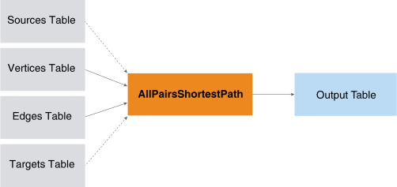

<h1 class="title topictitle1" id="ariaid-title1">AllPairsShortestPath (ML Engine)</h1>

The AllPairsShortestPath function computes the shortest distances between
			all combinations of the specified source and target vertices. The function works on
			directed, undirected, weighted, and unweighted graphs.

  </img>  

The function is useful in social network analysis. The resulting pairs and
			distances can be aggregated to determine a closeness metric or the k-degree for each
			vertex in a graph.

<h2 class="title topictitle2" id="ariaid-title2">AllPairsShortestPath Syntax</h2>

<h3 class="title sectiontitle">Version 1.5</h3><pre class="pre codeblock" xml:space="preserve"><code>SELECT * FROM AllPairsShortestPath (
  ON <var class="keyword varname">vertices_table</var> AS Vertices PARTITION BY <var class="keyword varname">vertex_key_column</var> [,...] 
  ON <var class="keyword varname">edges_table</var> AS Edges PARTITION BY <var class="keyword varname">source_vertex_key_column</var> [,...] 
  [ ON <var class="keyword varname">sources_table</var> AS Sources PARTITION BY <var class="keyword varname">source_vertex_key_column</var> [,...] ]
  [ ON <var class="keyword varname">targets_table</var> AS Targets PARTITION BY <var class="keyword varname">target_vertex_key_column</var> [,...] ]
  USING
  TargetKey ({ '<var class="keyword varname">target_key_column</var>' | <var class="keyword varname">target_key_column_range</var> }[,...])
  [ EdgeWeight ('<var class="keyword varname">edge_weight</var>') ]
  [ Directed (<b>{'true'|'t'|'yes'|'y'|'1'|'false'|'f'|'no'|'n'|'0'}</b>) ]
  [ MaxDistance (<var class="keyword varname">max_distance</var>) ]
  [ GroupSize (<var class="keyword varname">group_size</var>) ]
) AS <var class="keyword varname">alias</var>;</code></pre>

<b>Related Information</b>

<ul class="linklist linklist relinfo">
<a href="ndv1557782188375.md">Column Specification Syntax Elements</a>
</ul>

<h2 class="title topictitle2" id="ariaid-title3">AllPairsShortestPath Syntax Elements</h2>

<dl class="dl parml"><dt class="dt pt dlterm">TargetKey</dt><dd class="dd pd">Specify the target key (the names of the Edges table columns that identify the target vertex). If you specify <var class="keyword varname">targets_table</var>, the function uses only the vertices in <var class="keyword varname">targets_table</var> as targets (which must be a subset of those that this syntax element specifies).</dd><dt class="dt pt dlterm">EdgeWeight</dt><dd class="dd pd">[Optional] Specify the name of the Edges table column that contains edge weights. Each <var class="keyword varname">edge_weight</var> is a positive value.</dd><dd class="dd pd ddexpand">Default: Each <var class="keyword varname">edge_weight</var> is 1 (that is, the graph is unweighted)</dd><dt class="dt pt dlterm">Directed</dt><dd class="dd pd">[Optional] Specify whether the graph is directed.</dd><dd class="dd pd ddexpand">Default: 'true'</dd><dt class="dt pt dlterm">MaxDistance</dt><dd class="dd pd">[Optional] Specify the maximum distance between source and target for which the function outputs the vertices. The <var class="keyword varname">max_distance</var> must be an integer. If <var class="keyword varname">max_distance</var> is negative, the distance between source and target is unbounded.</dd><dd class="dd pd ddexpand">Default: 10</dd><dt class="dt pt dlterm">GroupSize</dt><dd class="dd pd">[Optional] Specify the number of source vertices that run a single-node shortest path (SNSP) algorithm in parallel. If <var class="keyword varname">group_size</var> exceeds the number of source vertices in a partition, the number of source vertices in the partition is the group size.</dd><dd class="dd pd ddexpand">Default behavior: The function uses cluster and query characteristics to determine the optimal group size.</dd></dl>

