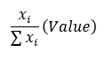
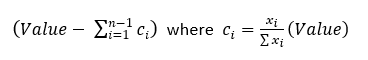
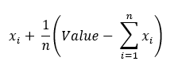

<h1 class="title topictitle1" id="ariaid-title1">Burst (ML Engine)</h1>

The Burst function bursts (splits) a time interval into a series of shorter "burst" intervals and allocates values from the time intervals into the new, shorter subintervals. The Burst function is useful for allocating values from overlapping time intervals into user-defined time intervals (for example, when a cable company has customer data from overlapping time intervals, which it wants to analyze by dividing into uniform time intervals). The Burst function supports several allocation methods.

The burst intervals can have either the same length (specified by the TimeInterval syntax element), the same number of data points (specified by the NumPoints syntax element), or specific start and end times (specified by time_table).

<h2 class="title topictitle2" id="ariaid-title2">Burst Syntax</h2>

<h3 class="title sectiontitle">Version 2.5</h3><pre class="pre codeblock" xml:space="preserve"><code>SELECT * FROM Burst (
  ON { <var class="keyword varname">table</var> | <var class="keyword varname">view</var> | (<var class="keyword varname">query</var>) } AS InputTable
    PARTITION BY <var class="keyword varname">id</var> [ ORDER BY <var class="keyword varname">order_column</var> ]
  [ ON { <var class="keyword varname">table</var> | <var class="keyword varname">view</var> | (<var class="keyword varname">query</var>) } AS TimeIntervalTable
    PARTITION BY <var class="keyword varname">id</var> [ ORDER BY <var class="keyword varname">ordering_column</var> ] ]
  USING
  TimeColumn ('<var class="keyword varname">start_time_column</var>', '<var class="keyword varname">end_time_column</var>')
  [ TimeInterval (<var class="keyword varname">numeric_value</var>) ]
  TargetColumns ({ '<var class="keyword varname">target_column</var>' | <var class="keyword varname">target_column_range</var> }[,...])
  [ TimeDataType (<var class="keyword varname">data_type</var>) ]
  [ ValueDataType (<var class="keyword varname">value_type</var> [,...]) ]
  [ StartTime ('<var class="keyword varname">start_time</var>') ]
  [ EndTime ('<var class="keyword varname">end_time</var>') ]
  [ NumPoints (<var class="keyword varname">data_points</var>) ]
  [ ValuesBeforeFirst ('<var class="keyword varname">before_first_value</var>' [,...]) ]
  [ ValuesAfterLast ('<var class="keyword varname">after_last_value</var>' [,...]) ]
  [ SplitCriteria ({ 'nosplit' | 'proportional' | 'random' | 'gaussian' | 'poisson' }) ]
  [ Seed (<var class="keyword varname">seed</var>) ]
  <code class="ph codeph">[ Accumulate ({ '<var class="keyword varname">accumulate_column</var>' | <var class="keyword varname">accumulate_column_range</var> }[,...]) ]</code>
) AS <var class="keyword varname">alias</var>;</code></pre>

<b>Related Information</b>

<ul class="linklist linklist relinfo">
<a href="ndv1557782188375.md">Column Specification Syntax Elements</a>
</ul>

<h2 class="title topictitle2" id="ariaid-title3">Burst Syntax Elements</h2>

<dl class="dl parml"><dt class="dt pt dlterm">TimeColumn</dt><dd class="dd pd">Specify the names of the InputTable columns that contain the start and end times of the time interval to be burst.</dd><dt class="dt pt dlterm">TimeInterval</dt><dd class="dd pd">[Optional] Specify exactly one of TimeIntervalTable, TimeInterval, or NumPoints.</dd><dd class="dd pd ddexpand">Specify the length of each burst time interval. This value must be either INTEGER or DOUBLE PRECISION.</dd><dt class="dt pt dlterm">TargetColumns</dt><dd class="dd pd">Specify the names of InputTable columns to copy to the output table.</dd><dt class="dt pt dlterm">TimeDataType</dt><dd class="dd pd">[Optional] Specify the data type of the output columns that correspond to the input table columns that TimeColumn specifies (<var class="keyword varname">start_time_column</var> and <var class="keyword varname">end_time_column</var>).

If you omit this syntax element, the function infers the data type of <var class="keyword varname">start_time_column</var> and <var class="keyword varname">end_time_column</var> from the input table and uses the inferred data type for the corresponding output table columns.

If you specify this syntax element, the function can transform the input data to the specified output data type only if both the input column data type and the specified output column data type are in this list:
<ul class="ul" id="umj1506031042722__ul_vcn_3xc_dy">
<li class="li">INTEGER</li>
<li class="li">BIGINT</li>
<li class="li">SMALLINT</li>
<li class="li">DOUBLE PRECISION</li>
<li class="li">NUMERIC</li>
<li class="li">NUMERIC(<var class="keyword varname">n</var>[,<var class="keyword varname">m</var>])</li></ul>
</dd><dt class="dt pt dlterm">ValueDataType</dt><dd class="dd pd">[Optional] Specify the data types of the output columns that correspond to the input table columns that TargetColumns specifies.

If you omit this syntax element, the function infers the data type of each <var class="keyword varname">target_column</var> from the input table and uses the inferred data type for the corresponding output table column.

If you specify ValueDataType, it must be the same size as TargetColumns. That is, if TargetColumns specifies <var class="keyword varname">n</var> columns, ValueDataType must specify <var class="keyword varname">n</var> data types. For <var class="keyword varname">i</var> in [1, <var class="keyword varname">n</var>], <var class="keyword varname">value_column_i</var> has <var class="keyword varname">value_type_i</var>. However, <var class="keyword varname">value_type_i</var> can be empty; for example:
<pre class="pre codeblock" xml:space="preserve"><code>TargetColumns ('c1', 'c2', 'c3')
ValueDataType (INTEGER, ,VARCHAR)</code></pre>
If you specify this syntax element, the function can transform the input data to the specified output data type only if both the input column data type and the specified output column data type are in this list:
<ul class="ul" id="umj1506031042722__ul_oq2_pxc_dy">
<li class="li">INTEGER</li>
<li class="li">BIGINT</li>
<li class="li">SMALLINT</li>
<li class="li">DOUBLE PRECISION</li>
<li class="li">NUMERIC</li>
<li class="li">NUMERIC(<var class="keyword varname">n</var>[,<var class="keyword varname">m</var>])</li></ul>
</dd><dt class="dt pt dlterm">StartTime</dt><dd class="dd pd">[Optional] Specify the start time for the time interval to be burst.</dd><dd class="dd pd ddexpand">Default: value in <var class="keyword varname">start_time_column</var></dd><dt class="dt pt dlterm">EndTime</dt><dd class="dd pd">[Optional] Specify the end time for the time interval to be burst.</dd><dd class="dd pd ddexpand">Default: value in <var class="keyword varname">end_time_column</var></dd><dt class="dt pt dlterm">NumPoints</dt><dd class="dd pd">[Optional] Specify exactly one of TimeIntervalTable, TimeInterval, or NumPoints.

Specify the number of data points in each burst time interval. This value must be an INTEGER.
</dd><dt class="dt pt dlterm">ValuesBeforeFirst</dt><dd class="dd pd">[Optional] Specify the values to use if <var class="keyword varname">start_time</var> is before <var class="keyword varname">start_time_column</var>. Each of these values must have the same data type as its corresponding <var class="keyword varname">target_column</var>. Values of data type VARCHAR are case-insensitive.</dd><dd class="dd pd ddexpand">If you specify ValuesBeforeFirst, it must be the same size as TargetColumns. That is, if TargetColumns specifies <var class="keyword varname">n</var> columns, ValuesBeforeFirst must specify <var class="keyword varname">n</var> values. For <var class="keyword varname">i</var> in [1, <var class="keyword varname">n</var>], <var class="keyword varname">value_column_i</var> has the value <var class="keyword varname">before_first_value_i</var>. However, <var class="keyword varname">before_first_value_i</var> can be empty; for example:<pre class="pre codeblock" xml:space="preserve"><code>TargetColumns ('c1', 'c2', 'c3')
ValuesBeforeFirst (1, ,'abc')</code></pre></dd><dd class="dd pd ddexpand">If <var class="keyword varname">before_first_value_i</var> is empty, <var class="keyword varname">value_column_i</var> has the value NULL.</dd><dd class="dd pd ddexpand">Default: <var class="keyword varname">value_column_i</var> has the value NULL for <var class="keyword varname">i</var> in [1, <var class="keyword varname">n</var>].</dd><dt class="dt pt dlterm">ValuesAfterLast</dt><dd class="dd pd">[Optional] Specify the values to use if <var class="keyword varname">end_time</var> is after <var class="keyword varname">end_time_column</var>. Each of these values must have the same data type as its corresponding <var class="keyword varname">target_column</var>. Values of data type VARCHAR are case-insensitive.</dd><dd class="dd pd ddexpand">If you specify ValuesAfterLast, it must be the same size as TargetColumns. That is, if TargetColumns specifies <var class="keyword varname">n</var> columns, ValuesAfterLast must specify <var class="keyword varname">n</var> values. For <var class="keyword varname">i</var> in [1, <var class="keyword varname">n</var>], <var class="keyword varname">value_column_i</var> has the value <var class="keyword varname">after_last_value_i</var>. However, <var class="keyword varname">after_last_value_i</var> can be empty; for example:<pre class="pre codeblock" xml:space="preserve"><code>TargetColumns ('c1', 'c2', 'c3')
ValuesAfterLast (1, ,'abc')</code></pre></dd><dd class="dd pd ddexpand">If <var class="keyword varname">after_last_value_i</var> is empty, <var class="keyword varname">value_column_i</var> has the value NULL.</dd><dd class="dd pd ddexpand">Default: <var class="keyword varname">value_column_i</var> has the value NULL for <var class="keyword varname">i</var> in [1, <var class="keyword varname">n</var>].</dd><dt class="dt pt dlterm">SplitCriteria</dt><dd class="dd pd">[Optional] Specify how to split <var class="keyword varname">target_column</var> values into subintervals:

<table cellpadding="4" cellspacing="0" summary="" id="umj1506031042722__table_otq_g1y_fdb" class="table" frame="border" border="1" rules="all">

<colgroup span="1"><col style="width:20%" span="1"></col><col style="width:80%" span="1"></col></colgroup><thead class="thead" style="text-align:left;"><tr class="row"><th class="entry cellrowborder" style="vertical-align:top;" id="d111181e453" rowspan="1" colspan="1">Option</th><th class="entry cellrowborder" style="vertical-align:top;" id="d111181e455" rowspan="1" colspan="1">Description</th></tr></thead><tbody class="tbody"><tr class="row"><td class="entry cellrowborder" style="vertical-align:top;" headers="d111181e453" rowspan="1" colspan="1"><code class="ph codeph">'nosplit'</code> (Default)</td><td class="entry cellrowborder" style="vertical-align:top;" headers="d111181e455" rowspan="1" colspan="1">The function assigns to each subinterval the sum of the values in the rows in that interval. See <a href="akk1542752536193.md">Burst Example: TimeInterval, SplitCriteria ('nosplit')</a> and <a href="heh1542752583386.md">Burst Example: TimeIntervalTable File</a> (where SplitCriteria defaults to 'nosplit').</td></tr><tr class="row"><td class="entry cellrowborder" style="vertical-align:top;" headers="d111181e453" rowspan="1" colspan="1"><code class="ph codeph">'proportional'</code></td><td class="entry cellrowborder" style="vertical-align:top;" headers="d111181e455" rowspan="1" colspan="1">The function does the following:
<ol class="ol" id="umj1506031042722__ol_ddb_l1y_fdb">
<li class="li">Determines the number of subintervals for each row.</li>
<li class="li">Divides the <var class="keyword varname">target_column</var> values evenly across all subintervals.</li>
<li class="li">Adds the contributions from all rows to each subinterval.</li></ol>

See <a href="eib1542752551489.md">Burst Example: TimeInterval, SplitCriteria ('proportional')</a>.
</td></tr><tr class="row"><td class="entry cellrowborder" style="vertical-align:top;" headers="d111181e453" rowspan="1" colspan="1"><code class="ph codeph">'random'</code></td><td class="entry cellrowborder" style="vertical-align:top;" headers="d111181e455" rowspan="1" colspan="1">The function does the following:
<ol class="ol" id="umj1506031042722__ol_pyr_wft_rcb">
<li class="li">Determines the number of subintervals for each row.</li>
<li class="li">Draws <var class="keyword varname">x</var><var class="keyword varname">i</var> for each subinterval <var class="keyword varname">i</var>.

The distribution is uniform on (0,1). The value assigned to each subinterval except the last is:
</img>

where <var class="keyword varname">Value</var> is the value of the input table for that row.

The value assigned to the last subinterval is:
</img></li>
<li class="li">Adds the contributions from all rows to each subinterval.</li></ol></td></tr><tr class="row"><td class="entry cellrowborder" style="vertical-align:top;" headers="d111181e453" rowspan="1" colspan="1"><code class="ph codeph">'gaussian'</code></td><td class="entry cellrowborder" style="vertical-align:top;" headers="d111181e455" rowspan="1" colspan="1">The function does the following:

<ol class="ol" id="umj1506031042722__ol_zhr_k3t_rcb">
<li class="li">Determines the number of subintervals for each row.</li>
<li class="li">Draws <var class="keyword varname">x</var><var class="keyword varname">i</var> for each subinterval <var class="keyword varname">i</var>.

The distribution is a standard normal distribution. The value assigned to each subinterval except the last, and the value assigned to the last subinterval, are calculated with the equations shown for 'random'.
</li>
<li class="li">Adds the contributions from all rows to each subinterval.</li></ol>

See <a href="oht1542752568602.md">Burst Example: TimeInterval, SplitCriteria ('gaussian')</a>.
</td></tr><tr class="row"><td class="entry cellrowborder" style="vertical-align:top;" headers="d111181e453" rowspan="1" colspan="1"><code class="ph codeph">'poisson'</code></td><td class="entry cellrowborder" style="vertical-align:top;" headers="d111181e455" rowspan="1" colspan="1">Use 'poisson' only if the means of each <var class="keyword varname">target_column</var> is nonnegative.

For data sets with an expected mean value greater than 40, Teradata recommends selecting 'gaussian' instead of 'poisson'. The performance of the 'poisson' option decreases as the mean of the data set increases.

The function does the following:
<ol class="ol" id="umj1506031042722__ol_utc_fjt_rcb">
<li class="li">Determines the number of subintervals for each row.</li>
<li class="li">Draws <var class="keyword varname">x</var><var class="keyword varname">i</var> for each subinterval <var class="keyword varname">i</var>.

The distribution is a Poisson distribution with mean:

<var class="keyword varname">Value</var> / <var class="keyword varname">number_of_subintervals</var>

Each subinterval is assigned this value:
</img></li>
<li class="li">Adds the contributions from all rows to each subinterval.</li></ol>
</td></tr></tbody></table>
</dd><dt class="dt pt dlterm">Seed</dt><dd class="dd pd">[Optional] Use only if SplitCriteria is 'random' or 'gaussian'. Specify the value for initializing the random number generator the algorithm uses for repeatable results.
<b>Note</b>
 For repeatable results, use both the Seed and UniqueID syntax elements. For more information, see <a href="qym1549987102806.md">Nondeterministic Results and UniqueID Syntax Element</a>.

Default: 0
</dd><dt class="dt pt dlterm">Accumulate</dt><dd class="dd pd">[Optional] Specify the names of InputTable columns (other than those specified by TimeColumn and TargetColumns) to copy to the output table.</dd><dd class="dd pd ddexpand">Default behavior: The function copies to the output table only the columns specified by TimeColumn and TargetColumns.</dd></dl>

