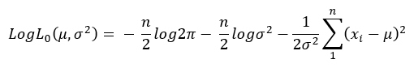
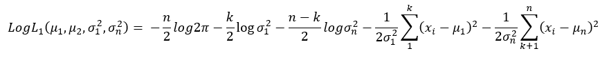
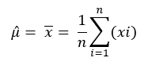
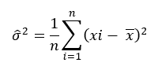

<h1 class="title topictitle1" id="ariaid-title1">ChangePointDetection (ML Engine)</h1>

The change-point search method for retrospective change-point detection, binary segmentation, uses this procedure:

<ol class="ol" id="jks1506305286697__ol_ung_gsf_5bb">
<li class="li">Search the data for the first change point.</li>
<li class="li">At that change point, split the data into two parts.</li>
<li class="li">In each part, select the change point with the minimum loss.</li>
<li class="li">Repeat this procedure until there are either no new change points or the maximum number of change points.</li></ol>

Binary segmentation is an approximation method, because the change point is decided with only part of the data. However, this method is efficient and has an O(<var class="keyword varname">n</var> log <var class="keyword varname">n</var>) computational cost, where <var class="keyword varname">n</var> is the number of data points.

  </img>  

Taking normal distribution as an example, the change-point problem is to test the following null hypothesis:

<var class="keyword varname">H</var>0:<var class="keyword varname">μ</var> = <var class="keyword varname">μ</var>1 = <var class="keyword varname">μ</var>2 = … = <var class="keyword varname">μ</var><var class="keyword varname">n</var> and <var class="keyword varname">σ</var>2 = <var class="keyword varname">σ</var>12 = <var class="keyword varname">σ</var>22 = … <var class="keyword varname">σ</var><var class="keyword varname">n</var>2

as opposed to the alternatives,

<var class="keyword varname">H</var>1:<var class="keyword varname">μ</var>1 = … = <var class="keyword varname">μ</var><var class="keyword varname">k</var>1 ≠ <var class="keyword varname">μ</var><var class="keyword varname">k</var>1+1 = … <var class="keyword varname">μ</var><var class="keyword varname">k</var>2 ≠ ... ≠ <var class="keyword varname">μ</var><var class="keyword varname">k</var><var class="keyword varname">q</var>+1 = ...= <var class="keyword varname">μ</var><var class="keyword varname">n</var>

and

<var class="keyword varname">σ</var>12 = … = <var class="keyword varname">σ</var><var class="keyword varname">k</var>12 ≠ <var class="keyword varname">σ</var><var class="keyword varname">k</var>1+12 = … = <var class="keyword varname">σ</var><var class="keyword varname">k</var>22 ≠ ... ≠ <var class="keyword varname">σ</var><var class="keyword varname">k</var><var class="keyword varname">q</var>+12 = … = <var class="keyword varname">σ</var><var class="keyword varname">n</var>2

Binary segmentation performs the following tests in each iteration:

<var class="keyword varname">H</var>1:<var class="keyword varname">μ</var>1 = … = <var class="keyword varname">μ</var><var class="keyword varname">k</var>1 ≠ <var class="keyword varname">μ</var><var class="keyword varname">k</var>1+1 = … = <var class="keyword varname">μ</var><var class="keyword varname">n</var>

and

<var class="keyword varname">σ</var>12 = … = <var class="keyword varname">σ</var><var class="keyword varname">k</var>12 ≠ <var class="keyword varname">σ</var><var class="keyword varname">k</var>1+12 = … <var class="keyword varname">σ</var><var class="keyword varname">n</var>2

These are the formulas for the log likelihood functions <var class="keyword varname">H</var>0 and <var class="keyword varname">H</var>1:

  </img>  

  </img>  

These are the formulas for the maximum likelihood estimation of <var class="keyword varname">μ</var> and σ2:

  </img>  

  </img>  

From the preceding formulas, the binary segmentation algorithm computes max <var class="keyword varname">LogL</var>1 by giving <var class="keyword varname">k</var> different values. Then, to check for a change point, the algorithm compares the difference between max <var class="keyword varname">LogL</var>1 and <var class="keyword varname">LogL</var>0 to the penalty value.

If the algorithm detects a change point, it adds that change point to its list of candidate change points and splits the data into two parts. From the candidate change points that the algorithm finds in the two parts, it selects the one with the minimum loss.

The ChangePointDetection function detects change points in a stochastic process or time series, using retrospective change-point detection, implemented with these algorithms:

<ul class="ul" id="jks1506305286697__ul_yy4_l22_p1b">
<li class="li">Search algorithm: binary search</li>
<li class="li">Segmentation algorithm: normal distribution and linear regression</li></ul>

Use this function when the input data can be stored in memory and the application does not require a real-time response. If the input data cannot be stored in memory, or the application requires a real-time response, use the function <a href="bcd1558464226278.md#lhg1506370281349">ChangePointDetectionRT (ML Engine)</a>.

<h2 class="title topictitle2" id="ariaid-title2">ChangePointDetection Syntax</h2>

<h3 class="title sectiontitle">Version 1.3</h3><pre class="pre codeblock" xml:space="preserve"><code>SELECT * FROM ChangePointDetection (
  ON { <var class="keyword varname">table</var> | <var class="keyword varname">view</var> | (<var class="keyword varname">query</var>) } PARTITION BY <var class="keyword varname">partition_expr</var> ORDER BY <var class="keyword varname">order_by_expr</var>
  USING
  TargetColumn ('<var class="keyword varname">target_column</var>')
  <code class="ph codeph">[ Accumulate ({ '<var class="keyword varname">accumulate_column</var>' | <var class="keyword varname">accumulate_column_range</var> }[,...]) ]</code>
  [ SegmentationMethod ({ 'normal_distribution' | 'linear_regression' }) ]
  [ SearchMethod ('binary') ]
  [ MaxChangeNum (<var class="keyword varname">maximum_change_point_count</var>) ]
  [ Cost ({ 'BIC' | 'AIC' | <var class="keyword varname">threshold</var> }) ]
  [ OutputType ({ 'CHANGEPOINT' | 'VERBOSE' | 'SEGMENT' }) ]
) AS <var class="keyword varname">alias</var>;</code></pre>

<b>Related Information</b>

<ul class="linklist linklist relinfo">
<a href="ndv1557782188375.md">Column Specification Syntax Elements</a>
</ul>

<h2 class="title topictitle2" id="ariaid-title3">ChangePointDetection Syntax Elements</h2>

<dl class="dl parml"><dt class="dt pt dlterm">TargetColumn</dt><dd class="dd pd">Specify the name of the input table column that contains the time series data.</dd><dt class="dt pt dlterm">Accumulate</dt><dd class="dd pd">Specify the names of the input table columns to copy to the output table.
<b>Tip</b>
To identify change points in the output table, specify the columns that appear in <var class="keyword varname">partition_exp</var> and <var class="keyword varname">order_by_exp</var>.

</dd><dt class="dt pt dlterm">SegmentationMethod</dt><dd class="dd pd">[Optional] Specify the segmentation method:

<table cellpadding="4" cellspacing="0" summary="" id="yav1506305895469__table_rmf_1by_fdb" class="table" frame="border" border="1" rules="all">

<colgroup span="1"><col style="width:50%" span="1"></col><col style="width:50%" span="1"></col></colgroup><thead class="thead" style="text-align:left;"><tr class="row"><th class="entry cellrowborder" style="vertical-align:top;" id="d792e524" rowspan="1" colspan="1"> </th><th class="entry cellrowborder" style="vertical-align:top;" id="d792e525" rowspan="1" colspan="1"> </th></tr></thead><tbody class="tbody"><tr class="row"><td class="entry cellrowborder" style="vertical-align:top;" headers="d792e524" rowspan="1" colspan="1"><code class="ph codeph">'normal_distribution'</code> (Default)</td><td class="entry cellrowborder" style="vertical-align:top;" headers="d792e525" rowspan="1" colspan="1">In each segment, data is in normal distribution.</td></tr><tr class="row"><td class="entry cellrowborder" style="vertical-align:top;" headers="d792e524" rowspan="1" colspan="1"><code class="ph codeph">'linear_regression'</code></td><td class="entry cellrowborder" style="vertical-align:top;" headers="d792e525" rowspan="1" colspan="1">In each segment, data is in linear regression.</td></tr></tbody></table>
</dd><dt class="dt pt dlterm">SearchMethod</dt><dd class="dd pd">[Optional] Specify the search method, binary search.</dd><dt class="dt pt dlterm">MaxChangeNum</dt><dd class="dd pd">[Optional] Specify the maximum number of change points to detect.</dd><dd class="dd pd ddexpand">Default: 10</dd><dt class="dt pt dlterm">Cost</dt><dd class="dd pd">[Optional] Specify the penalty function, which is used to avoid over-fitting:

<table cellpadding="4" cellspacing="0" summary="" id="yav1506305895469__table_s4z_gby_fdb" class="table" frame="border" border="1" rules="all">

<colgroup span="1"><col style="width:33.33333333333333%" span="1"></col><col style="width:33.33333333333333%" span="1"></col><col style="width:33.33333333333333%" span="1"></col></colgroup><thead class="thead" style="text-align:left;"><tr class="row"><th class="entry cellrowborder" style="vertical-align:top;" id="d792e564" rowspan="1" colspan="1">Option</th><th class="entry cellrowborder" style="vertical-align:top;" id="d792e566" rowspan="1" colspan="1">Condition for Change Point Existence</th><th class="entry cellrowborder" style="vertical-align:top;" id="d792e568" rowspan="1" colspan="1">Condition for Normal Distribution and Linear Regression</th></tr></thead><tbody class="tbody"><tr class="row"><td class="entry cellrowborder" style="vertical-align:top;" headers="d792e564" rowspan="1" colspan="1"><code class="ph codeph">'BIC'</code> (Default)</td><td class="entry cellrowborder" style="vertical-align:top;" headers="d792e566" rowspan="1" colspan="1"><var class="keyword varname">ln</var>(<var class="keyword varname">L</var>1)−<var class="keyword varname">ln</var>(<var class="keyword varname">L</var>0) > (<var class="keyword varname">p</var>1<var class="keyword varname">-p</var>0)*<var class="keyword varname">ln</var>(<var class="keyword varname">n</var>)/2</td><td class="entry cellrowborder" style="vertical-align:top;" headers="d792e568" rowspan="1" colspan="1">(<var class="keyword varname">p</var>1<var class="keyword varname">-p</var>0)*<var class="keyword varname">ln</var>(<var class="keyword varname">n</var>)/2 = <var class="keyword varname">ln</var>(<var class="keyword varname">n</var>)</td></tr><tr class="row"><td class="entry cellrowborder" style="vertical-align:top;" headers="d792e564" rowspan="1" colspan="1"><code class="ph codeph">'AIC'</code></td><td class="entry cellrowborder" style="vertical-align:top;" headers="d792e566" rowspan="1" colspan="1"><var class="keyword varname">ln</var>(<var class="keyword varname">L</var>1)−<var class="keyword varname">ln</var>(<var class="keyword varname">L</var>0) > <var class="keyword varname">p</var>1<var class="keyword varname">-p</var>0</td><td class="entry cellrowborder" style="vertical-align:top;" headers="d792e568" rowspan="1" colspan="1">

<var class="keyword varname">p</var>1<var class="keyword varname">-p</var>0 = 2
</td></tr><tr class="row"><td class="entry cellrowborder" style="vertical-align:top;" headers="d792e564" rowspan="1" colspan="1"><var class="keyword varname">threshold</var>, a DOUBLE PRECISION value

Function compares specified value to <var class="keyword varname">ln</var>(<var class="keyword varname">L</var>1)−<var class="keyword varname">ln</var>(<var class="keyword varname">L</var>0).

<var class="keyword varname">L</var>1 and <var class="keyword varname">L</var>0 are the maximum likelihood estimation of hypotheses <var class="keyword varname">H</var>1 and <var class="keyword varname">H</var>0.
</td><td class="entry cellrowborder" style="vertical-align:top;" headers="d792e566" rowspan="1" colspan="1">For normal distribution, the definition of Log(<var class="keyword varname">L</var>1 ) and Log(<var class="keyword varname">L</var>0) are in <a href="byq1558464045028.md#jks1506305286697">ChangePointDetection (ML Engine)</a>.</td><td class="entry cellrowborder" style="vertical-align:top;" headers="d792e568" rowspan="1" colspan="1"> </td></tr></tbody></table>

<var class="keyword varname">p</var> is the number of additional parameters introduced by adding a change point.  <var class="keyword varname">p</var>1 and <var class="keyword varname">p</var>0 represent this parameter in hypotheses <var class="keyword varname">H</var>1 and <var class="keyword varname">H</var>0, respectively.
</dd><dt class="dt pt dlterm">OutputType</dt><dd class="dd pd">[Optional] Specify the output table columns. See <a href="svj1562008925647.md">ChangePointDetection Output</a>.</dd><dd class="dd pd ddexpand">Default: 'CHANGEPOINT'</dd></dl>

