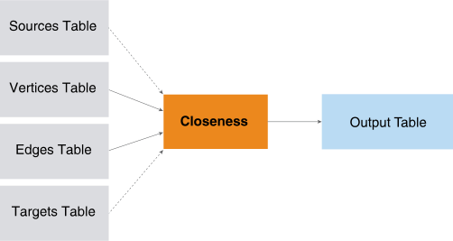

<h1 class="title topictitle1" id="ariaid-title1">Closeness (ML Engine)</h1>

The Closeness function returns closeness and k-degree scores for each
			specified source vertex in a graph. The closeness scores are the inverse of the sum, the
			inverse of the average, and the sum of inverses for the shortest distances to all
			reachable target vertices (excluding the source vertex itself).The graph can be directed
			or undirected, weighted or unweighted.

For large graph, you can apply the function to a random sample of the
			specified target vertices to get an efficient approximation of the closeness and
			k-degree scores.

  </img>  

<h2 class="title topictitle2" id="ariaid-title2">Closeness Syntax</h2>

<h3 class="title sectiontitle">Version 1.4</h3><pre class="pre codeblock" xml:space="preserve"><code>SELECT * FROM Closeness (
  ON <var class="keyword varname">vertices_table</var> AS Vertices PARTITION BY <var class="keyword varname">vertex_key_column</var> [,...] 
  ON <var class="keyword varname">edges_table</var> AS Edges PARTITION BY <var class="keyword varname">source_vertex_key_column</var> [,...] 
  [ ON <var class="keyword varname">sources_table</var> AS Sources PARTITION BY <var class="keyword varname">source_vertex_key_column</var> [,...] ]
  [ ON <var class="keyword varname">targets_table</var> AS Targets PARTITION BY <var class="keyword varname">target_vertex_key_column</var> [,...] ]
  USING
  TargetKey ('<var class="keyword varname">target_key_column</var>' [,...])
  [ Directed (<b>{'true'|'t'|'yes'|'y'|'1'|'false'|'f'|'no'|'n'|'0'}</b>) ]
  [ EdgeWeight (<var class="keyword varname">edge_weight</var>) ]
  [ MaxDistance (<var class="keyword varname">max_distance</var>) ]
  [ GroupSize (<var class="keyword varname">group_size</var>) ]
  [ SampleRate (<var class="keyword varname">sample_rate</var>) ]
  <code class="ph codeph">[ Accumulate ({ '<var class="keyword varname">accumulate_column</var>' | <var class="keyword varname">accumulate_column_range</var> }[,...]) ]</code>
) AS <var class="keyword varname">alias</var>;</code></pre>

<h2 class="title topictitle2" id="ariaid-title3">Closeness Syntax Elements</h2>

<dl class="dl parml"><dt class="dt pt dlterm">TargetKey</dt><dd class="dd pd">Specify the target key (the names of the Edges table columns that identify the target vertex). If you specify <var class="keyword varname">targets_table</var>, then the function uses only the Vertices in <var class="keyword varname">targets_table</var> as targets (which must be a subset of those that this syntax element specifies).</dd><dt class="dt pt dlterm">Directed</dt><dd class="dd pd">[Optional] Specify whether the graph is directed.</dd><dd class="dd pd ddexpand">Default: 'true'</dd><dt class="dt pt dlterm">EdgeWeight</dt><dd class="dd pd">[Optional] Specify the name of the Edges table column that contains edge weights. The weights are positive values.</dd><dd class="dd pd ddexpand">Default behavior: The weight of each edge is 1 (that is, the graph is unweighted).</dd><dt class="dt pt dlterm">MaxDistance</dt><dd class="dd pd">[Optional] Specify the maximum distance (an integer) between the source and target Vertices. A negative <var class="keyword varname">max_distance</var> specifies an infinite distance. If Vertices are separated by more than <var class="keyword varname">max_distance</var>, the function does not output them.</dd><dd class="dd pd ddexpand">Default: 10</dd><dt class="dt pt dlterm">GroupSize</dt><dd class="dd pd">[Optional] Specify the number of source Vertices that run a SNSP algorithm in parallel. If <var class="keyword varname">group_size</var> exceeds the number of source Vertices in each partition, <var class="keyword varname">s</var>, then <var class="keyword varname">s</var> is the group size. Running a group of Vertices on each vworker, in parallel, uses less memory than running all Vertices on each vworker.</dd><dd class="dd pd ddexpand">Default behavior: The function calculates the optimal group size based on cluster and query characteristics.</dd><dt class="dt pt dlterm">SampleRate</dt><dd class="dd pd">[Optional] Specify the sample rate (the percentage of source Vertices to sample), a numeric value in the range (0, 1].</dd><dd class="dd pd ddexpand">Default: 1</dd><dt class="dt pt dlterm">Accumulate</dt><dd class="dd pd">[Optional] Specify the names of the Vertices table columns to copy to the output table. These columns enable you to identify the different closeness scores in the output table.</dd></dl>

