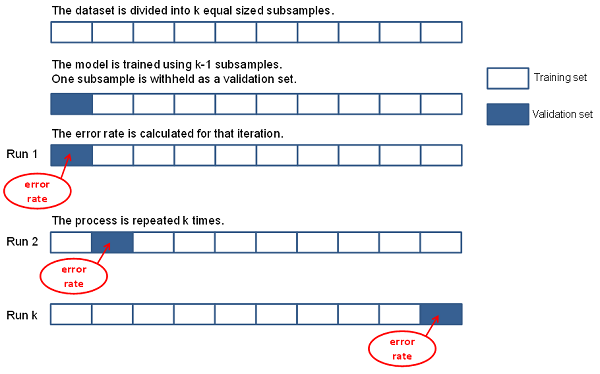

<h1 class="title topictitle1" id="ariaid-title1">CrossValidation (ML Engine)</h1>

<dfn class="term">Cross-validation</dfn> (or <dfn class="term">rotation
				estimation</dfn>) is a model-validation technique for assessing how the results of
			a statistical analysis generalize to an independent data set. Use this technique when
			your goal is prediction, to estimate how accurately a predictive model performs in
			practice.

Typically, you train a model on a <dfn class="term">training set</dfn> (a data set for which you know the response variable) and validate the model on a <dfn class="term">test set</dfn> or <dfn class="term">validation set</dfn> (a different data set for which you know the response variable). The CrossValidation function lets you have multiple test sets by partitioning the training set. The function can thus provide insight into how a model might generalize to an independent data set.

The CrossValidation function works as follows:
<ol class="ol" id="rmb1506982502554__ol_fms_ncm_lx">
<li class="li">It partitions the data randomly into <var class="keyword varname">k</var> equal-sized subsamples.</li>
<li class="li">It keeps one group as a test set and trains the model on the rest of the data.</li>
<li class="li">It uses the trained model on the test set and calculates the error rate.</li>
<li class="li">It repeats the preceding steps <var class="keyword varname">k</var> times, using each of the <var class="keyword varname">k</var> subsamples as the test set.</li></ol>

K-Fold Cross-Validation
  </img>  

<b>Related Information</b>

<ul class="linklist linklist relinfo">
<a href="qym1549987102806.md">Nondeterministic Results and UniqueID Syntax Element</a>
</ul>

<h2 class="title topictitle2" id="ariaid-title2">CrossValidation Syntax</h2>

<h3 class="title sectiontitle">Version 1.13</h3><pre class="pre codeblock" xml:space="preserve"><code>SELECT * FROM CrossValidation (
  ON { <var class="keyword varname">table</var> | <var class="keyword varname">view</var> | (<var class="keyword varname">query</var>) } AS InputTable
  [ OUT TABLE CrossValidationErrorTable (<var class="keyword varname">cv_error_table</var>) ]
  USING
  FunctionName ('GLM')
  [ <var class="keyword varname">glm_function_syntax_elements</var> ]
  CVParams ('<var class="keyword varname">cv_parameter</var>' [,...])
  [ FoldNum (<var class="keyword varname">k</var>) ]
  [ Metric ({ 'AUROC' | 'MSE' }) ]
) AS <var class="keyword varname">alias</var>;</code></pre>

<h2 class="title topictitle2" id="ariaid-title3">CrossValidation Syntax Elements</h2>

<dl class="dl parml"><dt class="dt pt dlterm">CrossValidationErrorTable</dt><dd class="dd pd">[Optional] Specify the name for the crossvalidation error table that the function outputs.</dd><dd class="dd pd ddexpand">Default:  cvtable in the current schema</dd><dt class="dt pt dlterm">FunctionName</dt><dd class="dd pd">Specify the name of the function to be cross-validated. The <var class="keyword varname">function</var> must be GLM (not case-sensitive).</dd><dt class="dt pt dlterm"><var class="keyword varname">glm_function_syntax_elements</var></dt><dd class="dd pd"><a href="eej1558472403086.md#cws1507149433550">GLM Syntax Elements</a>.</dd><dd class="dd pd ddexpand">For CrossValidation, each GLM syntax element can have multiple values. Each GLM syntax element must have the same number of values. These values define the models to cross-validate.</dd><dt class="dt pt dlterm">CVParams</dt><dd class="dd pd">Specify the syntax elements to use in cross-validation.</dd><dt class="dt pt dlterm">FoldNum</dt><dd class="dd pd">[Optional] Specify the value of <var class="keyword varname">k</var> in <var class="keyword varname">k</var>-fold cross-validation.</dd><dd class="dd pd ddexpand">Default: 10</dd><dt class="dt pt dlterm">Metric</dt><dd class="dd pd">[Optional] Specify the error function to use to calculate the cross-validation error:

<table cellpadding="4" cellspacing="0" summary="" id="azs1506982634562__table_qpf_g4y_fdb" class="table" frame="border" border="1" rules="all">

<colgroup span="1"><col style="width:50%" span="1"></col><col style="width:50%" span="1"></col></colgroup><thead class="thead" style="text-align:left;"><tr class="row"><th class="entry cellrowborder" style="vertical-align:top;" id="d114235e211" rowspan="1" colspan="1">Option</th><th class="entry cellrowborder" style="vertical-align:top;" id="d114235e213" rowspan="1" colspan="1">Description</th></tr></thead><tbody class="tbody"><tr class="row"><td class="entry cellrowborder" style="vertical-align:top;" headers="d114235e211" rowspan="1" colspan="1"><code class="ph codeph">'AUROC'</code> (Default)</td><td class="entry cellrowborder" style="vertical-align:top;" headers="d114235e213" rowspan="1" colspan="1">Area under ROC curve.</td></tr><tr class="row"><td class="entry cellrowborder" style="vertical-align:top;" headers="d114235e211" rowspan="1" colspan="1"><code class="ph codeph">'MSE'</code></td><td class="entry cellrowborder" style="vertical-align:top;" headers="d114235e213" rowspan="1" colspan="1">Mean squared error.</td></tr></tbody></table>
</dd></dl>

