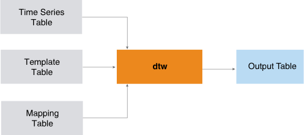

<html><head></head><body>
<h1 class="title topictitle1" id="ariaid-title1">DTW (ML Engine)</h1>

The DTW function performs dynamic time warping (DTW), which measures the similarity (warp distance) between two time series that vary in time or speed. You can use DTW to analyze any data that can be represented linearly—for example, video, audio, and graphics.

For example:

<ul class="ul" id="mgd1506466414339__ul_hfk_yq2_p1b">
<li class="li">In two videos, DTW can detect similarities in walking patterns, even if in one video the person is walking slowly and in another, the same person is walking fast.</li>
<li class="li">In audio, DTW can detect similarities in speech speeds (useful in speech
				recognition applications).</li></ul>

Given an input table, a template table, and a mapping table, DTW compares each time series in the input table to the corresponding time series in the template table. The correspondence is defined by the mapping table.

  </img>  

For more information, see <cite class="cite">FastDTW: Toward Accurate Dynamic Time Warping in Linear Time and Space. Stan Salvador and Philip Chan. KDD Workshop on Mining Temporal and Sequential Data, pp. 70-80, 2004</cite> (<a class="xref" href="http://cs.fit.edu/~pkc/papers/tdm04.pdf" target="_blank" title="" shape="rect">http://cs.fit.edu/~pkc/papers/tdm04.pdf</a>)

<h2 class="title topictitle2" id="ariaid-title2">DTW Syntax</h2>

<h3 class="title sectiontitle">Version TBD</h3><pre class="pre codeblock" xml:space="preserve"><code>SELECT * FROM DTW (
  ON { <var class="keyword varname">table</var> | <var class="keyword varname">view</var> | (<var class="keyword varname">query</var>) } AS InputTable
    PARTITION BY <var class="keyword varname">timeseriesid</var>
    ORDER BY <var class="keyword varname">target_timestamp</var>
  ON <var class="keyword varname">template_table</var> AS TemplateTable DIMENSION
    ORDER BY <var class="keyword varname">templateid</var>, <var class="keyword varname">template_timestamp</var>
  ON <var class="keyword varname">mapping_table</var> AS MappingTable
    PARTITION BY <var class="keyword varname">timeseriesid</var>
  USING
  TargetColumns ('<var class="keyword varname">target_value</var>', '<var class="keyword varname">target_timestamp</var>')
  TemplateColumns ('<var class="keyword varname">template_value</var>', '<var class="keyword varname">template_timestamp</var>')
  TimeseriesID ('<var class="keyword varname">timeseriesid</var>')
  TemplateID ('<var class="keyword varname">templateid</var>')
  [ Radius (<var class="keyword varname">radius</var>) ]
  [ DistanceMethod ('<var class="keyword varname">distance_method</var>') ]
  [ WarpPath (<b>{'true'|'t'|'yes'|'y'|'1'|'false'|'f'|'no'|'n'|'0'}</b>)]
) AS <var class="keyword varname">alias</var>;</code></pre>

<h2 class="title topictitle2" id="ariaid-title3">DTW Syntax Elements</h2>

<dl class="dl parml"><dt class="dt pt dlterm">TargetColumns</dt><dd class="dd pd">Specify the names of the InputTable columns that contain the values and timestamps of the time series. If these columns contain NaN or infinity values, use a WHERE clause to remove them.</dd><dt class="dt pt dlterm">TemplateColumns</dt><dd class="dd pd">Specify the names of the TemplateTable columns that contain the values and timestamps of the time series. If these columns contain NaN or infinity values, use a WHERE clause to remove them.</dd><dt class="dt pt dlterm">TimeseriesID</dt><dd class="dd pd">Specify the names of the columns by which the InputTable is partitioned. These columns comprise the unique ID for a time series in InputTable.</dd><dt class="dt pt dlterm">TemplateID</dt><dd class="dd pd">Specify the names of the columns by which the TemplateTable is ordered. These columns comprise the unique ID for a time series in TemplateTable.</dd><dt class="dt pt dlterm">Radius</dt><dd class="dd pd">[Optional] Specify the integer value that determines the projected warp path from a previous resolution.</dd><dd class="dd pd ddexpand">Default: 10</dd><dt class="dt pt dlterm">DistanceMethod</dt><dd class="dd pd">[Optional] Specify the metric for computing the warping distance (options are case-sensitive):

<table cellpadding="4" cellspacing="0" summary="" id="ekp1506466619731__table_jmv_52y_fdb" class="table" frame="border" border="1" rules="all">

<colgroup span="1"><col style="width:50%" span="1"></col><col style="width:50%" span="1"></col></colgroup><thead class="thead" style="text-align:left;"><tr class="row"><th class="entry cellrowborder" style="vertical-align:top;" id="d78305e200" rowspan="1" colspan="1"><var class="keyword varname">distance_method</var></th><th class="entry cellrowborder" style="vertical-align:top;" id="d78305e203" rowspan="1" colspan="1">Description</th></tr></thead><tbody class="tbody"><tr class="row"><td class="entry cellrowborder" style="vertical-align:top;" headers="d78305e200" rowspan="1" colspan="1"><code class="ph codeph">'EuclideanDistance'</code> (Default)</td><td class="entry cellrowborder" style="vertical-align:top;" headers="d78305e203" rowspan="1" colspan="1">Euclidean distance</td></tr><tr class="row"><td class="entry cellrowborder" style="vertical-align:top;" headers="d78305e200" rowspan="1" colspan="1"><code class="ph codeph">'ManhattanDistance'</code></td><td class="entry cellrowborder" style="vertical-align:top;" headers="d78305e203" rowspan="1" colspan="1">Manhattan distance</td></tr><tr class="row"><td class="entry cellrowborder" style="vertical-align:top;" headers="d78305e200" rowspan="1" colspan="1"><code class="ph codeph">'BinaryDistance'</code></td><td class="entry cellrowborder" style="vertical-align:top;" headers="d78305e203" rowspan="1" colspan="1">Binary distance</td></tr></tbody></table>

</dd><dt class="dt pt dlterm">WarpPath</dt><dd class="dd pd">[Optional] Determines whether to output the warping path.</dd><dd class="dd pd ddexpand">Default: 'false'</dd></dl>

</body></html>
