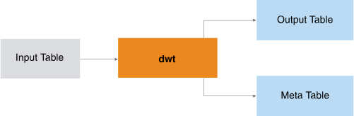

<html><head></head><body>
<h1 class="title topictitle1" id="ariaid-title1">DWT (ML Engine)</h1>

The DWT function implements the Mallat algorithm (an iterate algorithm in the Discrete Wavelet Transform field) and applies wavelet transform on multiple sequences simultaneously.

The input is typically a set of time series sequences. You specify the wavelet name or wavelet filter table, transform level, and (optionally) extension mode. The function returns the transformed sequences in Hilbert space with the corresponding component identifiers and indices. (The transformation is also called the decomposition.)

  </img>  

The wavelet filter table does not appear in the preceding diagram because it is seldom used.

You can filter the result to reduce the lengths of the transformed sequences and then use the function <a href="ntt1558468334001.md#xcy1506632882935">IDWT (ML Engine)</a> to reconstruct them; therefore, the DWT and IDWT functions are useful for compression and removing noise.

<h2 class="title topictitle2" id="ariaid-title2">DWT Syntax</h2>

<h3 class="title sectiontitle">Version ?</h3><pre class="pre codeblock" xml:space="preserve"><code>SELECT * FROM DWT (
  ON { <var class="keyword varname">table</var> | <var class="keyword varname">view</var> | (<var class="keyword varname">query</var>) } AS InputTable
  [ ON { <var class="keyword varname">table</var> | <var class="keyword varname">view</var> | (<var class="keyword varname">query</var>) } AS WaveletFilterTable ]
  OUT TABLE OutputTable (<var class="keyword varname">output_table</var>)
  OUT TABLE MetaInformationTable (<var class="keyword varname">meta_info_table</var>)
  USING
  TargetColumns ({ '<var class="keyword varname">target_column</var>' | <var class="keyword varname">target_column_range</var> }[,... ])
  SortColumn ('<var class="keyword varname">sort_column</var>')
  [ PartitionColumns ({ '<var class="keyword varname">partition_column</var>' | <var class="keyword varname">partition_column_range</var> }[,... ]) ]
  [ Wavelet ('<var class="keyword varname">wavelet</var>') ]
  WaveletTransformLevel (<var class="keyword varname">level</var>)
  [ ExtensionMode ('<var class="keyword varname">extension_mode</var>') ]
) AS <var class="keyword varname">alias</var>;</code></pre>

<b>Related Information</b>

<ul class="linklist linklist relinfo">
<a href="ndv1557782188375.md">Column Specification Syntax Elements</a>
</ul>

<h2 class="title topictitle2" id="ariaid-title3">DWT Syntax Elements</h2>

<dl class="dl parml"><dt class="dt pt dlterm">OutputTable</dt><dd class="dd pd">Specify the name for the table that the function creates to store the coefficients output by the wavelet transform. This table must not exist.</dd><dt class="dt pt dlterm">MetaInformationTable</dt><dd class="dd pd">Specify the name for the table that the function creates to store the meta information for the wavelet transform. This table must not exist.</dd><dt class="dt pt dlterm">TargetColumns</dt><dd class="dd pd">Specify the names of the InputTable columns that contain the data to transform. These columns must contain numeric values between -1e308 and 1e308. The function treats NULL as 0.</dd><dt class="dt pt dlterm">SortColumn</dt><dd class="dd pd">Specify the name of the InputTable column that defines the order of samples in the sequences to transform. In a time series sequence, the column can consist of timestamp values.</dd><dd class="dd pd ddexpand">If <var class="keyword varname">sort_column</var> has duplicate elements in a sequence (that is, in a partition), sequence order can vary, and the function can produce different transform results for the sequence.</dd><dt class="dt pt dlterm">PartitionColumns</dt><dd class="dd pd">[Optional] Specify the names of the InputTable partition columns, which identify the sequences. Rows with the same partition column values belong to the same sequence. If you specify multiple partition columns, the function treats the first one as the distribute key of OutputTable and MetaInformationTable.</dd><dd class="dd pd ddexpand">The DWT output tables are the IDWT input tables. If you specify this syntax element for DWT, you must also specify it for IDWT; otherwise, the results might not make sense.</dd><dd class="dd pd ddexpand">Default behavior: All rows belong to one sequence, and the function creates a distribute key column named dwt_id_<var class="keyword varname">random_name</var> in both the OutputTable and MetaInformationTable. In both tables, every cell of dwt_id_<var class="keyword varname">random_name</var> has the value 1.</dd><dt class="dt pt dlterm">Wavelet</dt><dd class="dd pd">[Required if you omit WaveletFilterTable.] Specify a wavelet filter name from the following table.</dd><dd class="dd pd ddexpand">
<table cellpadding="4" cellspacing="0" summary="" id="pic1506628946514__table_N100DD_N1000C_N10001" class="table" frame="border" border="1" rules="all">

<colgroup span="1"><col style="width:20%" span="1"></col><col style="width:80%" span="1"></col></colgroup><thead class="thead" style="text-align:left;"><tr class="row"><th class="entry nocellnorowborder" style="vertical-align:top;" id="d56739e228" rowspan="1" colspan="1">Wavelet Family</th><th class="entry cell-norowborder" style="vertical-align:top;" id="d56739e230" rowspan="1" colspan="1">Supported Wavelet Names (wavelet values)</th></tr></thead><tbody class="tbody"><tr class="row"><td class="entry nocellnorowborder" style="vertical-align:top;" headers="d56739e228" rowspan="1" colspan="1">Daubechies</td><td class="entry cell-norowborder" style="vertical-align:top;" headers="d56739e230" rowspan="1" colspan="1">'db1' or 'haar', 'db2', .... ,'db10'</td></tr><tr class="row"><td class="entry nocellnorowborder" style="vertical-align:top;" headers="d56739e228" rowspan="1" colspan="1">Coiflets</td><td class="entry cell-norowborder" style="vertical-align:top;" headers="d56739e230" rowspan="1" colspan="1">'coif1', ... , 'coif5'</td></tr><tr class="row"><td class="entry nocellnorowborder" style="vertical-align:top;" headers="d56739e228" rowspan="1" colspan="1">Symlets</td><td class="entry cell-norowborder" style="vertical-align:top;" headers="d56739e230" rowspan="1" colspan="1">'sym1', ... ,' sym10'</td></tr><tr class="row"><td class="entry nocellnorowborder" style="vertical-align:top;" headers="d56739e228" rowspan="1" colspan="1">Discrete Meyer</td><td class="entry cell-norowborder" style="vertical-align:top;" headers="d56739e230" rowspan="1" colspan="1">'dmey'</td></tr><tr class="row"><td class="entry nocellnorowborder" style="vertical-align:top;" headers="d56739e228" rowspan="1" colspan="1">Biorthogonal</td><td class="entry cell-norowborder" style="vertical-align:top;" headers="d56739e230" rowspan="1" colspan="1">'bior1.1', 'bior1.3', 'bior1.5', 'bior2.2', 'bior2.4', 'bior2.6', 'bior2.8', 'bior3.1', 'bior3.3', 'bior3.5', 'bior3.7', 'bior3.9', 'bior4.4', 'bior5.5'</td></tr><tr class="row"><td class="entry row-nocellborder" style="vertical-align:top;" headers="d56739e228" rowspan="1" colspan="1">Reverse Biorthogonal</td><td class="entry cellrowborder" style="vertical-align:top;" headers="d56739e230" rowspan="1" colspan="1">'rbio1.1', 'rbio1.3', 'rbio1.5' 'rbio2.2', 'rbio2.4', 'rbio2.6', 'rbio2.8', 'rbio3.1', 'rbio3.3', 'rbio3.5', 'rbio3.7','rbio3.9', 'rbio4.4', 'rbio5.5'</td></tr></tbody></table>
</dd><dt class="dt pt dlterm">WaveletTransformLevel</dt><dd class="dd pd">Specify the wavelet transform level. The value level must be an integer in the range [1, 1000].</dd><dt class="dt pt dlterm">ExtensionMode</dt><dd class="dd pd">[Optional] Specify the wavelet transform level. The <var class="keyword varname">level</var> must be an integer in the range [1, 1000].</dd><dd class="dd pd ddexpand">

For the examples in the following table, assume that the sequence before the extension is 1 2 3 4 and the convolution kernel in the wavelet filter has the length 6, which means that the length of the sequence is to extend by 5 positions before and after the sequence.

<table cellpadding="4" cellspacing="0" summary="" id="pic1506628946514__table_N1013E_N10138_N1000C_N10001" class="table" frame="border" border="1" rules="all">

<colgroup span="1"><col style="width:33.33333333333333%" span="1"></col><col style="width:66.66666666666666%" span="1"></col></colgroup><thead class="thead" style="text-align:left;"><tr class="row"><th class="entry nocellnorowborder" style="vertical-align:top;" id="d56739e285" rowspan="1" colspan="1">Supported Extension Mode (extension_mode value)</th><th class="entry cell-norowborder" style="vertical-align:top;" id="d56739e287" rowspan="1" colspan="1">Description</th></tr></thead><tbody class="tbody"><tr class="row"><td class="entry nocellnorowborder" style="vertical-align:top;" headers="d56739e285" rowspan="1" colspan="1">sym</td><td class="entry cell-norowborder" style="vertical-align:top;" headers="d56739e287" rowspan="1" colspan="1">(Default) Symmetrically replicate boundary values, mirroring the points near the boundaries. For example:

4 4 3 2 1 | 1 2 3 4 | 4 3 2 1 1
</td></tr><tr class="row"><td class="entry nocellnorowborder" style="vertical-align:top;" headers="d56739e285" rowspan="1" colspan="1">zpd</td><td class="entry cell-norowborder" style="vertical-align:top;" headers="d56739e287" rowspan="1" colspan="1">Zero-pad boundary values with zero. For example:

0 0 0 0 0 | 1 2 3 4 | 0 0 0 0 0
</td></tr><tr class="row"><td class="entry row-nocellborder" style="vertical-align:top;" headers="d56739e285" rowspan="1" colspan="1">ppd</td><td class="entry cellrowborder" style="vertical-align:top;" headers="d56739e287" rowspan="1" colspan="1">Periodic extension, fill boundary values as the input sequence is a periodic one. For example:

4 1 2 3 4 | 1 2 3 4 | 1 2 3 4 1
</td></tr></tbody></table>
</dd></dl>

</body></html>
