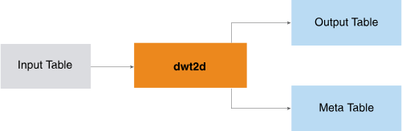

<html><head></head><body>
<h1 class="title topictitle1" id="ariaid-title1">DWT2D (ML Engine)</h1>

The DWT2D function implements the Mallat algorithm (an iterate algorithm in the Discrete Wavelet Transform field) on 2-dimensional matrixes and applies wavelet transform on multiple sequences simultaneously.

The input is a set of sequences. Typically, each sequence is a matrix that contains a position in 2-dimensional space (y and x indexes or coordinates) and its corresponding values. You specify the wavelet name or wavelet filter table, transform level, and (optionally) extension mode. The function returns the transformed sequences in Hilbert space with the corresponding component identifiers and indices. (The transformation is also called the decomposition.)

  </img>  

The wavelet filter table does not appear in the preceding diagram because it is seldom used.

This is a typical DWT2D use case:

<ol class="ol" id="mld1506629675211__ol_i4x_11f_p1b">
<li class="li">Apply DWT2D to the original data to create the approximate coefficients of the matrixes and the corresponding metadata.</li>
<li class="li">If desired, filter the coefficients by methods appropriate for the objects (for example, minimum threshold or top <var class="keyword varname">n</var> coefficients).</li>
<li class="li">From the approximate or filtered coefficients, reconstruct the matrixes and compare them with their original counterparts.</li></ol>

<h2 class="title topictitle2" id="ariaid-title2">DWT2D Syntax</h2>

<h3 class="title sectiontitle">Version ?</h3><pre class="pre codeblock" xml:space="preserve"><code>SELECT * FROM DWT2D (
  ON { <var class="keyword varname">table</var> | <var class="keyword varname">view</var> | (<var class="keyword varname">query</var>) } AS InputTable
  [ ON { <var class="keyword varname">table</var> | <var class="keyword varname">view</var> | (<var class="keyword varname">query</var>) } AS WaveletFilterTable ]
  OUT TABLE OutputTable (<var class="keyword varname">output_table</var>)
  OUT TABLE MetaInformationTable (<var class="keyword varname">meta_info_table</var>)
  USING
  TargetColumns ({ '<var class="keyword varname">target_column</var>' | <var class="keyword varname">target_column_range</var> }[,... ])
  [ PartitionColumns ({ '<var class="keyword varname">partition_column</var>' | <var class="keyword varname">partition_column_range</var> }[,... ]) ]
  IndexColumns ('<var class="keyword varname">indexy_column</var>', '<var class="keyword varname">indexx_column</var>')
  [ Range ('(<var class="keyword varname">starty</var>, <var class="keyword varname">startx</var>), (<var class="keyword varname">endy</var>, <var class="keyword varname">endx</var>)') ]
  [ Wavelet ('<var class="keyword varname">wavelet</var>') ]
  WaveletTransformLevel (<var class="keyword varname">level</var>)
  [ ExtensionMode ('<var class="keyword varname">extension_mode</var>') ]
  [ CompactOutput (<b>{'true'|'t'|'yes'|'y'|'1'|'false'|'f'|'no'|'n'|'0'}</b>) ]
) AS <var class="keyword varname">alias</var>;</code></pre>

<b>Related Information</b>

<ul class="linklist linklist relinfo">
<a href="ndv1557782188375.md">Column Specification Syntax Elements</a>
</ul>

<h2 class="title topictitle2" id="ariaid-title3">DWT2D Syntax Elements</h2>

<dl class="dl parml"><dt class="dt pt dlterm">OutputTable</dt><dd class="dd pd">Specify the name for the table that the function creates to store the coefficients output by the wavelet transform. This table must not exist.</dd><dt class="dt pt dlterm">MetaInformationTable</dt><dd class="dd pd">Specify the name for the table that the function creates to store the meta information for the wavelet transform. This table must not exist.</dd><dt class="dt pt dlterm">TargetColumns</dt><dd class="dd pd">Specify the names of the InputTable columns that contain the data to transform. These columns must contain numeric values between -1e308 and 1e308. The function treats NULL as 0.</dd><dt class="dt pt dlterm">PartitionColumns</dt><dd class="dd pd">[Optional] Specify the names of the InputTable partition columns, which identify the sequences. Rows with the same partition column values belong to the same sequence. If you specify multiple partition columns, the function treats the first one as the distribute key of the OutputTable and MetaInformationTable.
<b>Note</b>
The DWT2D output tables are the IDWT2D input tables. If you specify this syntax element for DWT2D, you must also specify it for IDWT2D; otherwise, the results might not make sense.

</dd><dd class="dd pd ddexpand">Default behavior: All rows belong to one sequence, and the function creates a distribute key column named dwt_id_<var class="keyword varname">random_name</var> in both the OutputTable and MetaInformationTable. In both tables, every cell of dwt_id_<var class="keyword varname">random_name</var> has the value 1.</dd><dt class="dt pt dlterm">IndexColumns</dt><dd class="dd pd">Specify the columns that contain the indexes of the input sequences. For a matrix, <var class="keyword varname">indexy_column</var> contains the y coordinates and <var class="keyword varname">indexx_column</var> contains the x coordinates.</dd><dt class="dt pt dlterm">Range</dt><dd class="dd pd">[Optional] Specify the start and end indexes of the input data, all of which must be integers. The range can specify a maximum of 1,000,000 cells. The function treats any NULL value as 0.

<table cellpadding="4" cellspacing="0" summary="" id="jvt1506630894806__table_cb5_4zf_bcb" class="table" frame="border" border="1" rules="all">

<colgroup span="1"><col style="width:50%" span="1"></col><col style="width:50%" span="1"></col></colgroup><thead class="thead" style="text-align:left;"><tr class="row"><th class="entry cellrowborder" style="vertical-align:top;" id="d73216e248" rowspan="1" colspan="1">Index</th><th class="entry cellrowborder" style="vertical-align:top;" id="d73216e250" rowspan="1" colspan="1">Default</th></tr></thead><tbody class="tbody"><tr class="row"><td class="entry cellrowborder" style="vertical-align:top;" headers="d73216e248" rowspan="1" colspan="1"><var class="keyword varname">starty</var></td><td class="entry cellrowborder" style="vertical-align:top;" headers="d73216e250" rowspan="1" colspan="1">minimum y index</td></tr><tr class="row"><td class="entry cellrowborder" style="vertical-align:top;" headers="d73216e248" rowspan="1" colspan="1"><var class="keyword varname">startx</var></td><td class="entry cellrowborder" style="vertical-align:top;" headers="d73216e250" rowspan="1" colspan="1">minimum x index</td></tr><tr class="row"><td class="entry cellrowborder" style="vertical-align:top;" headers="d73216e248" rowspan="1" colspan="1"><var class="keyword varname">endy</var></td><td class="entry cellrowborder" style="vertical-align:top;" headers="d73216e250" rowspan="1" colspan="1">maximum y index</td></tr><tr class="row"><td class="entry cellrowborder" style="vertical-align:top;" headers="d73216e248" rowspan="1" colspan="1"><var class="keyword varname">endx</var></td><td class="entry cellrowborder" style="vertical-align:top;" headers="d73216e250" rowspan="1" colspan="1">maximum x index</td></tr></tbody></table>
</dd><dt class="dt pt dlterm">Wavelet</dt><dd class="dd pd">[Required if you omit WaveletFilterTable] Specify a wavelet filter name from the table Supported Wavelet Filter Names in <a href="asx1558468105037.md#pic1506628946514">DWT Syntax Elements</a>.</dd><dt class="dt pt dlterm">WaveletTransformLevel</dt><dd class="dd pd">Specify the wavelet transform level. The value level must be an integer in the range [1, 1000].</dd><dt class="dt pt dlterm">ExtensionMode</dt><dd class="dd pd">[Optional] Specify the method for handling border distortion, an <var class="keyword varname">extension_mode</var> from the table Supported Extension Modes in DWT syntax elements.</dd><dd class="dd pd ddexpand">Default: 'sym'</dd><dt class="dt pt dlterm">CompactOutput</dt><dd class="dd pd">[Optional] Specify whether to ignore rows in which all coefficient values have an absolute value less than 1e-12).</dd><dd class="dd pd ddexpand">Default: 'true'. For a sparse input matrix, ignoring such rows reduces the output table size.</dd></dl>

</body></html>
