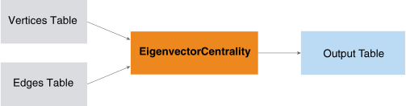

<html><head></head><body>
<h1 class="title topictitle1" id="ariaid-title1">EigenvectorCentrality (ML Engine)</h1>

The EigenvectorCentrality function calculates the <dfn class="term">centrality</dfn> (relative importance) of each node in a graph.

  </img>  

<h2 class="title topictitle2" id="ariaid-title2">EigenvectorCentrality Syntax</h2>

<h3 class="title sectiontitle">Version 1.5</h3><pre class="pre codeblock" xml:space="preserve"><code>SELECT * FROM EigenvectorCentrality (
  ON <var class="keyword varname">vertices_table</var> AS Vertices PARTITION BY <var class="keyword varname">vertex_key_column</var> [,...] 
  ON <var class="keyword varname">edges_table</var> AS Edges PARTITION BY <var class="keyword varname">source_vertex_key_column</var> [,...]
  USING
  TargetKey ({ '<var class="keyword varname">edge_attribute</var>' | <var class="keyword varname">edge_attribute_range</var> }[,...])
  [ EdgeWeight (<var class="keyword varname">edge_weight</var>) ]
  [ Family ({ 'eigenvector' | 'katz' | 'bonacich' }) ]
  [ Alpha (<var class="keyword varname">alpha_value</var>) ]
  [ Beta (<var class="keyword varname">beta_value</var>) ]
  [ Directed (<b>{'true'|'t'|'yes'|'y'|'1'|'false'|'f'|'no'|'n'|'0'}</b>) ]
  [ MaxIterNum (<var class="keyword varname">max_iteration_number</var>) ]
  [ StopThreshold (<var class="keyword varname">threshold</var>) ]
  <code class="ph codeph">[ Accumulate ({ '<var class="keyword varname">accumulate_column</var>' | <var class="keyword varname">accumulate_column_range</var> }[,...]) ]</code>
) AS <var class="keyword varname">alias</var>;</code></pre>

<b>Related Information</b>

<ul class="linklist linklist relinfo">
<a href="ndv1557782188375.md">Column Specification Syntax Elements</a>
</ul>

<h2 class="title topictitle2" id="ariaid-title3">EigenvectorCentrality Syntax Elements</h2>

<dl class="dl parml"><dt class="dt pt dlterm">TargetKey</dt><dd class="dd pd">Specify the names of the target key columns in the Edges table. The number and data types of columns must correspond to those of <var class="keyword varname">vertex_key</var>.</dd><dt class="dt pt dlterm">EdgeWeight</dt><dd class="dd pd">[Optional] Specify the name of the Edges table column that contains the edge weights. The edge weights must be positive values.</dd><dd class="dd pd ddexpand">Default behavior: The graph is unweighted.</dd><dt class="dt pt dlterm">Family</dt><dd class="dd pd">[Optional] Specify the centrality formula:
<ul class="ul" id="uzl1507757786903__ul_wsp_pd1_2z">
<li class="li"><code class="ph codeph">'eigenvector'</code> (Default)</li>
<li class="li"><code class="ph codeph">'katz'</code></li>
<li class="li"><code class="ph codeph">'bonacich'</code></li></ul>

For descriptions of the centrality formulas, see <a href="imb1549572670289.md">Centrality Formulas</a>.
</dd><dt class="dt pt dlterm">Alpha</dt><dd class="dd pd">[Optional] Specify the alpha value for the Katz or Bonacich centrality formula.</dd><dd class="dd pd ddexpand">Default: 0.85</dd><dt class="dt pt dlterm">Beta</dt><dd class="dd pd">[Optional] Specify the beta value for the Katz or Bonacich centrality formula.</dd><dd class="dd pd ddexpand">Default: 1 for Katz and 0 for Bonacich</dd><dt class="dt pt dlterm">Directed</dt><dd class="dd pd">[Optional] Specify whether the graph is directed.</dd><dd class="dd pd ddexpand">Default: 'true'</dd><dt class="dt pt dlterm">MaxIterNum</dt><dd class="dd pd">[Optional] Specify the maximum number of iterations for the function.</dd><dd class="dd pd ddexpand">Default: 20</dd><dt class="dt pt dlterm">StopThreshold</dt><dd class="dd pd">[Optional] Specify the threshold for convergence (the difference of between <var class="keyword varname">b</var>k+1 and <var class="keyword varname">b</var>k).</dd><dd class="dd pd ddexpand">Default: 0.001</dd><dt class="dt pt dlterm">Accumulate</dt><dd class="dd pd">[Optional] Specify the names of the Vertices columns to copy to the output table.</dd></dl>

</body></html>
