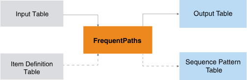

<h1 class="title topictitle1" id="ariaid-title1">FrequentPaths (ML Engine)</h1>

The FrequentPaths takes a table of sequences and outputs a table of subsequences (patterns) that frequently appear in the input table and, optionally, a table of sequence-pattern pairs.

  </img>  

The function is useful for analyzing customer purchase behavior, web access patterns, disease treatments, and DNA sequences.

<h2 class="title topictitle2" id="ariaid-title2">FrequentPaths Syntax</h2>

<h3 class="title sectiontitle">Version 2.6</h3><pre class="pre codeblock" xml:space="preserve"><code>SELECT * FROM FrequentPaths (
  ON { <var class="keyword varname">table</var> | <var class="keyword varname">view</var> | (<var class="keyword varname">query</var>) } AS InputTable
  ON { <var class="keyword varname">table</var> | <var class="keyword varname">view</var> | (<var class="keyword varname">query</var>) } AS ItemDefinitionTable
  OUT TABLE OutputTable (<var class="keyword varname">output_table</var>)
  [ OUT TABLE SeqPatternTable (<var class="keyword varname">sequence_pattern_table</var>) ]
  USING
  PartitionColumns ( { '<var class="keyword varname">partition_column</var>' | <var class="keyword varname">partition_column_range</var> }[,...])
  [ TimeColumn ('<var class="keyword varname">time_column</var>') ]
  [ PathFilters ([Separator (<var class="keyword varname">symbol</var>),] '<var class="keyword varname">filter</var>' [,...]) ]
  [ GroupByColumns ({ '<var class="keyword varname">group_column'</var> | <var class="keyword varname">group_column_range</var>}[,...]) ]
  { ItemColumn ('<var class="keyword varname">sequence_column</var>') |
    PathColumn ('<var class="keyword varname">path_column</var>') |
    ItemDefinitionColumns ('[<var class="keyword varname">index_column</var>:<var class="keyword varname">definition_column</var>:<var class="keyword varname">item_column</var>]')
  }
  MinSupport (<var class="keyword varname">minimum</var>)
  [ MaxLength (<var class="keyword varname">maximum_length</var>) ]
  [ MinLength (<var class="keyword varname">minimum_length</var>) ]
  [ ClosedPattern (<b>{'true'|'t'|'yes'|'y'|'1'|'false'|'f'|'no'|'n'|'0'}</b>)]
) AS <var class="keyword varname">alias</var>;</code></pre>

For the ItemDefinitionColumns syntax element, the brackets inside the parentheses are required. For example: 
<pre class="pre codeblock" xml:space="preserve"><code>ItemDefinitionColumns ([id:def:item])</code></pre>

<b>Related Information</b>

<ul class="linklist linklist relinfo">
<a href="ndv1557782188375.md">Column Specification Syntax Elements</a>
</ul>

<h2 class="title topictitle2" id="ariaid-title3">FrequentPaths Syntax Elements</h2>

<dl class="dl parml"><dt class="dt pt dlterm">OutputTable</dt><dd class="dd pd">Specify the name of the table where the function outputs the subsequences.</dd><dt class="dt pt dlterm">SeqPatternTable</dt><dd class="dd pd">[Optional] Specify the name of the table where the function outputs sequence-pattern pairs. For example, if a sequence has a partition value of "1" and contains 3 patterns with IDs 2, 9, and 10, for that sequence the function outputs the sequence-pattern pairs ("1", 2), ("1", 9), and ("1", 10).</dd><dt class="dt pt dlterm">PartitionColumns</dt><dd class="dd pd">Specify the names of the columns that comprise the partition key of the InputTable sequences.</dd><dt class="dt pt dlterm">TimeColumn</dt><dd class="dd pd">[Required when ItemColumn or ItemDefinition is specified.] Specify the name of the InputTable column that determines the order of items in a sequence. Items in the same sequence that have the same time stamp belong to the same set.</dd><dt class="dt pt dlterm">PathFilters</dt><dd class="dd pd">[Optional] Specify the filters to use on the InputTable sequences. Only InputTable sequences that satisfy all constraints of at least one filter are input to the function.</dd><dd class="dd pd ddexpand">Each <var class="keyword varname">filter</var> has one or more constraints, which are separated by spaces. Each constraint has this syntax:<pre class="pre codeblock" xml:space="preserve"><code><var class="keyword varname">constraint</var> (<var class="keyword varname">item</var> [<var class="keyword varname">symbol</var> ...])</code></pre></dd><dd class="dd pd ddexpand">
<table cellpadding="4" cellspacing="0" summary="" id="mnl1507643365154__table_xjw_3fy_fdb" class="table" frame="border" border="1" rules="all">

<colgroup span="1"><col style="width:50%" span="1"></col><col style="width:50%" span="1"></col></colgroup><thead class="thead" style="text-align:left;"><tr class="row"><th class="entry cellrowborder" style="vertical-align:top;" id="d28692e236" rowspan="1" colspan="1"><var class="keyword varname">constraint</var></th><th class="entry cellrowborder" style="vertical-align:top;" id="d28692e239" rowspan="1" colspan="1">Description</th></tr></thead><tbody class="tbody"><tr class="row"><td class="entry cellrowborder" style="vertical-align:top;" headers="d28692e236" rowspan="1" colspan="1"><code class="ph codeph">STW (<var class="keyword varname">start-with_constraint</var>)</code></td><td class="entry cellrowborder" style="vertical-align:top;" headers="d28692e239" rowspan="1" colspan="1">First item set of sequence must contain at least one <var class="keyword varname">item</var>.

For example, STW(c,d) requires first item set of sequence to contain c or d. Sequence "(a, c), e, (f, d)" meets this constraint because first item set, (a,c), contains c.
</td></tr><tr class="row"><td class="entry cellrowborder" style="vertical-align:top;" headers="d28692e236" rowspan="1" colspan="1"><code class="ph codeph">EDW (<var class="keyword varname">end-with_constraint</var>)</code></td><td class="entry cellrowborder" style="vertical-align:top;" headers="d28692e239" rowspan="1" colspan="1">Last item set of sequence must contain at least one <var class="keyword varname">item</var>.

For example, EDW(f,g) requires the last item set of the sequence to contain f or g. Sequence "(a, b), e, (f, d)" meets this constraint because last item set, (f,d), contains f.
</td></tr><tr class="row"><td class="entry cellrowborder" style="vertical-align:top;" headers="d28692e236" rowspan="1" colspan="1"><code class="ph codeph">CTN (<var class="keyword varname">containing_constraint</var>)</code></td><td class="entry cellrowborder" style="vertical-align:top;" headers="d28692e239" rowspan="1" colspan="1">Sequence must contain at least one <var class="keyword varname">item</var>.

For example, CTN(a,b) requires sequence to contain a or b. Sequence "(a,c), d, (e,f)" meets this constraint but sequence "d, (e,f)" does not.
</td></tr></tbody></table>
</dd><dd class="dd pd ddexpand">Constraints in the same <var class="keyword varname">filter</var> must differ. For example:
<ul class="ul" id="mnl1507643365154__ul_x3k_t2x_kx">
<li class="li">Valid: <code class="ph codeph">'STW(c,d) EDW(g,k) CTN(e)'</code></li>
<li class="li">Invalid: <code class="ph codeph">'STW(c,d) STW(e,h)'</code></li></ul></dd><dd class="dd pd ddexpand">This syntax element specifies a separator and uses it in two filters:</dd><dd class="dd pd ddexpand"><code class="ph codeph">PathFilters('Separator(#)', 'STW(c#d) EDW(g#k) CTN(e)', 'CTN(h#k)')</code></dd><dd class="dd pd ddexpand">If you specify <var class="keyword varname">symbol</var>, it applies to all filters. Default <var class="keyword varname">symbol</var>:  comma (,)</dd><dt class="dt pt dlterm">GroupByColumns</dt><dd class="dd pd">[Optional] Specify the names of the InputTable columns by which to group the InputTable sequences. If you specify this syntax element, the function operates on each group separately and copies each <var class="keyword varname">group_column</var> to the output table.</dd><dt class="dt pt dlterm">ItemColumn</dt><dd class="dd pd">[Required if you specify neither ItemDefinitionColumns nor PathColumn.] Specify the names of the InputTable columns that contain the items.</dd><dt class="dt pt dlterm">PathColumn</dt><dd class="dd pd">[Required if you specify neither ItemDefinitionColumns nor ItemColumn.] Specify the name of the InputTable column that contains paths in the form of sequence strings. A sequence string has this syntax:<pre class="pre codeblock" xml:space="preserve"><code>'[<var class="keyword varname">item</var> [, ...]]'</code></pre>

In the sequence string syntax, you must type the outer brackets (bold). The sequence strings in this column can be created by the nPath function.

If you specify this syntax element, each item set can have only one item.
</dd><dt class="dt pt dlterm">ItemDefinitionColumns</dt><dd class="dd pd">[Required if you specify neither ItemColumn nor PathColumn.] Specify the names of the index, definition, and item columns of the ItemDefinitionTable.</dd><dt class="dt pt dlterm">MinSupport</dt><dd class="dd pd">Determines the threshold for whether a sequential pattern is frequent. The <var class="keyword varname">minimum</var> must be a positive real number.

If <var class="keyword varname">minimum</var> is in the range (0,1], it is a relative threshold: If <var class="keyword varname">N</var> is the total number of input sequences, the threshold is <var class="keyword varname">T</var>=<var class="keyword varname">N</var>*<var class="keyword varname">minimum</var>. For example, if there are 1000 sequences in the InputTable and <var class="keyword varname">minimum</var> is 0.05, the threshold is 50.

If <var class="keyword varname">minimum</var> is in the range (1,+), it is an absolute threshold: Regardless of <var class="keyword varname">N</var>, <var class="keyword varname">T</var>=<var class="keyword varname">minimum</var>. For example, if <var class="keyword varname">minimum</var> is 50, the threshold is 50, regardless of <var class="keyword varname">N</var>.

A pattern is frequent if its support value is at least <var class="keyword varname">T</var>.

Because the function outputs only frequent patterns, <var class="keyword varname">minimum</var> controls the number of output patterns. If <var class="keyword varname">minimum</var> is small, processing time increases exponentially; therefore, Teradata recommends starting the trial with a larger value.—for example, 5% of the total sequence number if you know N and 0.05 otherwise.

If you specify a relative <var class="keyword varname">minimum</var> and GroupByColumns, the function calculates <var class="keyword varname">N</var> and <var class="keyword varname">T</var> for each group.

If you specify a relative <var class="keyword varname">minimum</var> and PathFilters, <var class="keyword varname">N</var> is the number of sequences that meet the constraints of the filters.
</dd><dt class="dt pt dlterm">MaxLength</dt><dd class="dd pd">[Optional] Specify the maximum length of the output sequential patterns. The length of a pattern is its number of sets.</dd><dd class="dd pd ddexpand">Default: No maximum length</dd><dt class="dt pt dlterm">MinLength</dt><dd class="dd pd">[Optional] Specify the minimum length of the output sequential patterns.</dd><dd class="dd pd ddexpand">Default: 1</dd><dt class="dt pt dlterm">ClosedPattern</dt><dd class="dd pd">[Optional] Specify whether to output only closed patterns.</dd><dd class="dd pd ddexpand">Default: 'false'</dd></dl>

