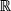
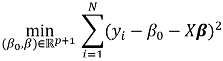
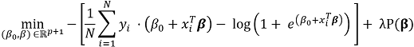
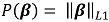
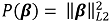
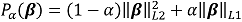

<html><head></head><body id="wss1507134739235"><h1 class="title topictitle1" id="ariaid-title1">Generalized Linear Model (GLM) Functions (ML Engine)</h1>

The GLM, GLML1L2, and GLMPerSegment functions perform linear regression analysis for distribution functions using a user-specified distribution family and link function. Their output is input to the GLMPredict_MLE, GLML1L2Predict, and GLMPredictPerSegment functions (respectively), which perform generalized linear model prediction on new input data.

The GLM, GLML1L2, and GLMPerSegment functions differ in these ways:

<table cellpadding="4" cellspacing="0" summary="" id="wss1507134739235__table_N10133_N10013_N10010_N10001" class="table" frame="border" border="1" rules="all">

<colgroup span="1"><col style="width:20%" span="1"></col><col style="width:20%" span="1"></col><col style="width:20%" span="1"></col><col style="width:20%" span="1"></col><col style="width:20%" span="1"></col></colgroup><thead class="thead" style="text-align:left;"><tr class="row"><th class="entry cellrowborder" style="vertical-align:top;" id="d109505e37" rowspan="1" colspan="1">Function</th><th class="entry cellrowborder" style="vertical-align:top;" id="d109505e39" rowspan="1" colspan="1">Description</th><th class="entry cellrowborder" style="vertical-align:top;" id="d109505e41" rowspan="1" colspan="1">Supported Distribution Families</th><th class="entry cellrowborder" style="vertical-align:top;" id="d109505e43" rowspan="1" colspan="1">Supported Regularization Models</th><th class="entry cellrowborder" style="vertical-align:top;" id="d109505e45" rowspan="1" colspan="1">Output Tables</th></tr></thead><tbody class="tbody"><tr class="row"><td class="entry cellrowborder" style="vertical-align:top;" headers="d109505e37" rowspan="1" colspan="1"><a href="eej1558472403086.md#hrv1507149150084">GLM (ML Engine)</a></td><td class="entry cellrowborder" style="vertical-align:top;" headers="d109505e39" rowspan="1" colspan="1">Unbiased ordinary least square estimator.

Builds single model.
</td><td class="entry cellrowborder" style="vertical-align:top;" headers="d109505e41" rowspan="1" colspan="1">See <a href="ewh1563913874279.md">Supported Family/Link Function Combinations</a></td><td class="entry cellrowborder" style="vertical-align:top;" headers="d109505e43" rowspan="1" colspan="1">None</td><td class="entry cellrowborder" style="vertical-align:top;" headers="d109505e45" rowspan="1" colspan="1">
<ul class="ul">
<li class="li">Model table</li></ul></td></tr><tr class="row"><td class="entry cellrowborder" style="vertical-align:top;" headers="d109505e37" rowspan="1" colspan="1"><a href="mxy1558472465230.md#fgw1518542561108">GLML1L2 (ML Engine)</a></td><td class="entry cellrowborder" style="vertical-align:top;" headers="d109505e39" rowspan="1" colspan="1">Biased estimator based on regularization.

Builds single model.
</td><td class="entry cellrowborder" style="vertical-align:top;" headers="d109505e41" rowspan="1" colspan="1">Binomial, Gaussian</td><td class="entry cellrowborder" style="vertical-align:top;" headers="d109505e43" rowspan="1" colspan="1">Ridge, LASSO, and elastic net</td><td class="entry cellrowborder" style="vertical-align:top;" headers="d109505e45" rowspan="1" colspan="1">
<ul class="ul">
<li class="li">Model table</li>
<li class="li">[Optional] Factor table</li></ul></td></tr><tr class="row"><td class="entry cellrowborder" style="vertical-align:top;" headers="d109505e37" rowspan="1" colspan="1"><a href="vzk1572296570258.md">GLMPerSegment</a></td><td class="entry cellrowborder" style="vertical-align:top;" headers="d109505e39" rowspan="1" colspan="1">Biased estimator based on regularization.

For partitioned input table, creates model for each partition.
</td><td class="entry cellrowborder" style="vertical-align:top;" headers="d109505e41" rowspan="1" colspan="1">Binomial, Gaussian</td><td class="entry cellrowborder" style="vertical-align:top;" headers="d109505e43" rowspan="1" colspan="1">Ridge, LASSO, and elastic net</td><td class="entry cellrowborder" style="vertical-align:top;" headers="d109505e45" rowspan="1" colspan="1">Model table</td></tr></tbody></table>

<h2 class="title sectiontitle">Regularization</h2>

<dfn class="term">Regularization</dfn> is a technique for reducing overfitting and thus decreasing the variance of trained models. GLM functions are fit by minimizing a loss function, such as the sum of squared errors. For example, given a predictor vector <var class="keyword varname">X</var> ϵ </img><var class="keyword varname">p</var>, a response variable <var class="keyword varname">Y</var> ϵ </img>, and <var class="keyword varname">N</var> observation pairs, you can find model parameters <var class="keyword varname">β</var>0 and <var class="keyword varname">β</var> with this formula:

  </img>  

These fits can be regularized by adding a penalty function <var class="keyword varname">P</var>(<var class="keyword varname">β</var> ) to the loss function being minimized. For example:

  </img>  

where λ controls the strength of the penalty function.

For logistic regression, the loss function is based on the log likelihood, as follows:

  </img>  

These are three popular penalty functions:
<ul class="ul" id="wss1507134739235__ul_bz1_xl3_mz">
<li class="li">The sum of the absolute values of the model parameters:

  </img>  

which is the L1 norm of the model parameters. This regularization technique, also called Least Absolute Shrinkage and Selection Operator (LASSO), was introduced by Robert Tibshirani in 1996. LASSO has the potential to shrink some parameters to zero; therefore, you can also use it for variable selection.
</li>
<li class="li">The sum of the squared values of the model parameters:

  </img>  

which is the L2 norm of the model parameters. This regularization technique is also called <dfn class="term">ridge regression</dfn>. With ridge regression, parameter values become smaller as λ increases, but never reach zero.
</li>
<li class="li">Elastic net regularization, which is a linear combination of L1 and L2 normalization:

  </img>  
</li></ul>

<h2 class="title sectiontitle">References</h2>
<ul class="ul" id="wss1507134739235__ul_zjj_km3_mz">
<li class="li">

<cite class="cite">Friedman, J., Hastie, T., and Tibshirani, R. (2010). Regularization Paths for Generalized Linear Models via Coordinate Descent. Journal of Statistical Software, 33(1), 1 - 22.doi</cite> (<a class="xref" href="http://dx.doi.org/10.18637/jss.v033.i01" target="_blank" title="" shape="rect">GLM regularization paths article</a>)
</li>
<li class="li">

<cite class="cite">Tibshirani, R., Bien, J., Friedman, J., Hastie, T., Simon, N., Taylor, J. and Tibshirani, R. J. (2012), Strong rules for discarding predictors in lasso-type problems. Journal of the Royal Statistical Society: Series B (Statistical Methodology), 74: 245–266. doi:10.1111/j.1467-9868.2011.01004.x</cite>
</li></ul>

