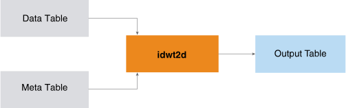

<h1 class="title topictitle1" id="ariaid-title1">IDWT2D (ML Engine)</h1>

The IDWT2D function is the inverse of <a href="noj1558468237458.md#mld1506629675211">DWT2D (ML Engine)</a>; that is, IDWT2D applies inverse wavelet transforms on multiple sequences simultaneously. IDWT2D takes as input the output table and meta table output by DWT2D and outputs the sequences as 2-dimensional matrixes. (Because the IDWT2D output is comparable to the DWT2D input, the inverse transformation is also called the reconstruction.)

  </img>  

This is a typical IDWT2D use case:

<ol class="ol" id="zsa1506633647588__ol_pzp_s1f_p1b">
<li class="li">Apply DWT2D to 2-dimensional sequences to create the coefficients of the matrixes and corresponding metadata.</li>
<li class="li">Filter the coefficients by methods appropriate for the objects (for example, minimum threshold or top <var class="keyword varname">n</var> coefficients), compressing the original matrixes.</li>
<li class="li">Apply IDWT to the filtered coefficients to reconstruct the sequences.</li>
<li class="li">Compare the reconstructed matrixes to their original counterparts.</li></ol>

<h2 class="title topictitle2" id="ariaid-title2">IDWT2D Syntax</h2>

<h3 class="title sectiontitle">Version ?</h3><pre class="pre codeblock" xml:space="preserve"><code>SELECT * FROM IDWT2D (
  ON { <var class="keyword varname">table</var> | <var class="keyword varname">view</var> | (<var class="keyword varname">query</var>) } AS InputTable
  ON { <var class="keyword varname">table</var> | <var class="keyword varname">view</var> | (<var class="keyword varname">query</var>) } AS MetaTable
  OUT TABLE OutputTable (<var class="keyword varname">output_table</var>)
  USING
  TargetColumns ({ '<var class="keyword varname">target_column</var>' | <var class="keyword varname">target_column_range</var> }[,... ])
  SortColumn ('<var class="keyword varname">sort_column</var>')
  [ PartitionColumns ({ '<var class="keyword varname">partition_column</var>' | <var class="keyword varname">partition_column_range</var> }[,... ]) ]
  [ VerboseFlag (<b>{'true'|'t'|'yes'|'y'|'1'|'false'|'f'|'no'|'n'|'0'}</b>) ]
) AS <var class="keyword varname">alias</var>;</code></pre>

<b>Related Information</b>

<ul class="linklist linklist relinfo">
<a href="ndv1557782188375.md">Column Specification Syntax Elements</a>
</ul>

<h2 class="title topictitle2" id="ariaid-title3">IDWT2D Syntax Elements</h2>

<dl class="dl parml"><dt class="dt pt dlterm">OutputTable</dt><dd class="dd pd">Specify the name for the table that the function creates to store the reconstructed result. This table must not exist.</dd><dt class="dt pt dlterm">TargetColumns</dt><dd class="dd pd">Specify the names of the InputTable columns that contain the data to transform. These columns must contain numeric values between -1e308 and 1e308. The function treats NULL as 0.</dd><dt class="dt pt dlterm">SortColumn</dt><dd class="dd pd">Specify the name of the InputTable column that represents the order of coefficients in each sequence (the waveletid column in the DWT2D output table). The column must contain a sequence of integer values that start from 1 for each sequence. If a value is missing from the sequence, the function treats the corresponding data column as 0.</dd><dt class="dt pt dlterm">PartitionColumns</dt><dd class="dd pd">[Optional] Specify the names of the InputTable partition columns, which identify the sequences. Rows with the same partition column values belong to the same sequence. If you specify multiple partition columns, the function treats the first one as the distribute key of the OutputTable and MetaTable.
<b>Note</b>
The IDWT2D input tables are the DWT2D output tables. If you specify this syntax element for DWT2D, you must also specify it for IDWT2D; otherwise, the results might not make sense.

</dd><dd class="dd pd ddexpand">Default behavior: All rows belong to one sequence, and the function creates a distribute key column named dwt_id_<var class="keyword varname">random_name</var> in both the OutputTable and MetaTable. In both tables, every cell of dwt_id_<var class="keyword varname">random_name</var> has the value 1.</dd><dt class="dt pt dlterm">VerboseFlag</dt><dd class="dd pd">[Optional] Specify whether to ignore (not output) rows in which all coefficient values have an absolute value less than 1e-12). For a sparse input matrix, ignoring such rows reduces the output table size.</dd><dd class="dd pd ddexpand">Default: 'true'</dd></dl>

