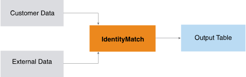

<h1 class="title topictitle1" id="ariaid-title1">IdentityMatch (ML Engine)</h1>

The IdentityMatch function tries to match source data with reference data,
			using specified attributes to calculate the similarity score of each source-reference
			pair, and then computes the final similarity score.

Typically, the source data is about business customers and the reference data is from external sources, such as online forums and social networking services. The IdentityMatch function is designed to help determine if customers with similar identifiers are the same customer. The function supports both nominal (exact) matching and weighted fuzzy matching.

  </img>  

<h2 class="title topictitle2" id="ariaid-title2">IdentityMatch Syntax</h2>

<h3 class="title topictitle3" id="ariaid-title3">When Reference Data Fits in Memory</h3>

Use this syntax when one input (SourceTable or ReferenceTable) fits in memory. For best performance, identify the smaller table as ReferenceTable. Function results are the same regardless of how you identify the inputs.

The function compares each record from SourceTable and each record from ReferenceTable. The number of comparisons is |SourceTable|*|ReferenceTable|. In the syntax, a and b refer to the SourceTable and ReferenceTable, respectively.

<h4 class="title sectiontitle">Version 1.11</h4><pre class="pre codeblock" xml:space="preserve"><code>SELECT * FROM IdentityMatch (
  ON <var class="keyword varname">source_input_table</var> AS SourceTable PARTITION BY ANY
  ON <var class="keyword varname">reference_input_table</var> AS ReferenceTable DIMENSION
  USING
  IDColumn ('a.<var class="keyword varname">id_column</var>: b.<var class="keyword varname">id_column</var>')
  { NominalMatchColumns ('a.<var class="keyword varname">columnX</var>: b.<var class="keyword varname">columnY</var>' [,...]) |
    FuzzyMatchColumns ('a.<var class="keyword varname">columnX</var>: b.<var class="keyword varname">columnY</var>, <var class="keyword varname">match_metric</var>, <var class="keyword varname">match_weight</var> [, <var class="keyword varname">synonym_file</var> ]' [,...])
  }
  [ Accumulate ('{a|b}.<var class="keyword varname">accumulate_column</var>' [,...]')]
  [ ThresholdScore (<var class="keyword varname">threshold</var>) ]
) AS <var class="keyword varname">alias</var>;</code></pre>

<h3 class="title topictitle3" id="ariaid-title4">When Reference Data Does Not Fit in Memory</h3>

Use this syntax when neither input fits in memory. Partition the data by categorical attribute (for example, age range), thereby distributing the records to workers by the specified attribute and reducing the comparison times. If the categorical attribute has <var class="keyword varname">n</var> values and each range has same size, the comparison times are reduced to 1/<var class="keyword varname">n</var>. In the syntax, a and b refer to the SourceTable and ReferenceTable, respectively.

<h4 class="title sectiontitle">Version 1.11</h4><pre class="pre codeblock" xml:space="preserve"><code>SELECT * FROM IdentityMatch (
  ON <var class="keyword varname">source_input_table</var> AS SourceTable PARTITION BY <var class="keyword varname">key</var> 
  ON <var class="keyword varname">reference_input_table</var> AS ReferenceTable PARTITION BY <var class="keyword varname">key</var>
  USING
  IDColumn (a.<var class="keyword varname">id_column</var>: b.<var class="keyword varname">id_column</var>')
  { NominalMatchColumns ('a.<var class="keyword varname">columnX</var>: b.<var class="keyword varname">columnY</var>' [,...]) |
    FuzzyMatchColumns ('a.<var class="keyword varname">columnX</var>: b.<var class="keyword varname">columnY</var>, <var class="keyword varname">match_metric</var>, <var class="keyword varname">match_weight</var> [, <var class="keyword varname">synonym_file</var> ]' [,...])
  }
  [ Accumulate ('{a|b}.<var class="keyword varname">accumulate_column</var>' [,...]')]
  [ ThresholdScore (<var class="keyword varname">threshold</var>) ]
) AS <var class="keyword varname">alias</var>;</code></pre>

<h2 class="title topictitle2" id="ariaid-title5">IdentityMatch Syntax Elements</h2>

<dl class="dl parml"><dt class="dt pt dlterm">IDColumn</dt><dd class="dd pd">Specify the names of the columns in SourceTable and ReferenceTable that contain row identifiers. The function copies these columns to the output table.</dd><dt class="dt pt dlterm">NominalMatchColumns</dt><dd class="dd pd">[Required if you omit FuzzyMatchColumns.] Specify pairs of columns (attributes) to check for exact matching (a.<var class="keyword varname">columnX</var> and b.<var class="keyword varname">columnY</var> are column names). If any pair matches exactly, their records are considered exact matches, and the function does not compare the fuzzy match attributes.</dd><dt class="dt pt dlterm">FuzzyMatchColumns</dt><dd class="dd pd">[Required if you omit NominalMatchColumns.] Specify pairs of columns (attributes) to check for fuzzy matching (a.<var class="keyword varname">columnX</var> and b.<var class="keyword varname">columnY</var> are column names) and fuzzy matching parameters. If any pair is a fuzzy match, their records are considered fuzzy matches, and the function reports the similarity score of these attributes.
Fuzzy matching parameters:<dl class="dl parml"><dt class="dt pt dlterm"><var class="keyword varname">match_metric</var></dt><dd class="dd pd">Specify the similarity metric, which is a function that returns the similarity score of two strings (a value between 0 and 1), as follows:

<table cellpadding="4" cellspacing="0" summary="" id="aos1507839419073__table_wjk_xwf_5cb" class="table" frame="border" border="1" rules="all">

<colgroup span="1"><col style="width:33.33333333333333%" span="1"></col><col style="width:66.66666666666666%" span="1"></col></colgroup><thead class="thead" style="text-align:left;"><tr class="row"><th class="entry cellrowborder" style="vertical-align:top;" id="d22811e282" rowspan="1" colspan="1"><var class="keyword varname">match_metric</var></th><th class="entry cellrowborder" style="vertical-align:top;" id="d22811e285" rowspan="1" colspan="1">Similarity Score</th></tr></thead><tbody class="tbody"><tr class="row"><td class="entry cellrowborder" style="vertical-align:top;" headers="d22811e282" rowspan="1" colspan="1"><code class="ph codeph">EQUAL</code></td><td class="entry cellrowborder" style="vertical-align:top;" headers="d22811e285" rowspan="1" colspan="1">1.0 if strings a and b are equal; otherwise 0.0.</td></tr><tr class="row"><td class="entry cellrowborder" style="vertical-align:top;" headers="d22811e282" rowspan="1" colspan="1"><code class="ph codeph">LD</code></td><td class="entry cellrowborder" style="vertical-align:top;" headers="d22811e285" rowspan="1" colspan="1">LD(a,b)/max(len(a),len(b)), where LD(a,b) is the Levenshtein distance between a and b.</td></tr><tr class="row"><td class="entry cellrowborder" style="vertical-align:top;" headers="d22811e282" rowspan="1" colspan="1"><code class="ph codeph">D-LD</code></td><td class="entry cellrowborder" style="vertical-align:top;" headers="d22811e285" rowspan="1" colspan="1">LD(a,b)/max(len(a),len(b)), where LD(a,b) is the Damerau-Levenshtein distance between a and b. </td></tr><tr class="row"><td class="entry cellrowborder" style="vertical-align:top;" headers="d22811e282" rowspan="1" colspan="1"><code class="ph codeph">JARO</code></td><td class="entry cellrowborder" style="vertical-align:top;" headers="d22811e285" rowspan="1" colspan="1">Jaro distance between a and b.</td></tr><tr class="row"><td class="entry cellrowborder" style="vertical-align:top;" headers="d22811e282" rowspan="1" colspan="1"><code class="ph codeph">JARO-WINKLER</code></td><td class="entry cellrowborder" style="vertical-align:top;" headers="d22811e285" rowspan="1" colspan="1">Jaro-Winkler distance between a and b.</td></tr><tr class="row"><td class="entry cellrowborder" style="vertical-align:top;" headers="d22811e282" rowspan="1" colspan="1"><code class="ph codeph">NEEDLEMAN-WUNSCH</code></td><td class="entry cellrowborder" style="vertical-align:top;" headers="d22811e285" rowspan="1" colspan="1">Needleman-Wunsch distance between a and b.</td></tr><tr class="row"><td class="entry cellrowborder" style="vertical-align:top;" headers="d22811e282" rowspan="1" colspan="1"><code class="ph codeph">JD</code></td><td class="entry cellrowborder" style="vertical-align:top;" headers="d22811e285" rowspan="1" colspan="1">Jaccard distance between a and b. The function converts the strings a and b to sets s and t by splitting them by space and then uses the formula f(s,t)=|s∩t|/|s∪t|.</td></tr><tr class="row"><td class="entry cellrowborder" style="vertical-align:top;" headers="d22811e282" rowspan="1" colspan="1"><code class="ph codeph">COSINE</code></td><td class="entry cellrowborder" style="vertical-align:top;" headers="d22811e285" rowspan="1" colspan="1">Calculated with term frequency-inverse document frequency (TF-IDF) and cosine similarity of a and b.

The function calculates IDF only on the input relation stored in memory.
</td></tr></tbody></table>
</dd><dt class="dt pt dlterm"><var class="keyword varname">match_weight</var></dt><dd class="dd pd">Specify the weight (relative importance) of the attribute represented by a.<var class="keyword varname">columnX</var> and b.<var class="keyword varname">columnY</var>. The <var class="keyword varname">match_weight</var> must be a positive number.

The function normalizes each <var class="keyword varname">match_weight</var> to a value in the range [0, 1]. Given <var class="keyword varname">match_weight</var> values, <var class="keyword varname">w</var>1, <var class="keyword varname">w</var>2, ..., <var class="keyword varname">w</var>n, this is the formula for the normalized value of <var class="keyword varname">w</var>i:

<var class="keyword varname">w</var>i/(<var class="keyword varname">w</var>1<var class="keyword varname">+w</var>2<var class="keyword varname">+ ...+ w</var>n)

For example, given two pairs of columns, whose match weights are 3 and 7, the function uses the weights 3/(3+7)=0.3 and 7/(3+7)=0.7 to compute the similarity score.
</dd><dt class="dt pt dlterm"><var class="keyword varname">synonym_file</var></dt><dd class="dd pd">Specify the dictionary in which the function checks the two strings for semantic equality. In the dictionary, each line is a comma-separated list of synonyms.</dd><dd class="dd pd ddexpand">You must install the dictionary on <b>ML Engine</b> before running the function.</dd><dd class="dd pd ddexpand">Default behavior: The function does not use a dictionary.</dd></dl>
</dd><dt class="dt pt dlterm">Accumulate</dt><dd class="dd pd">[Optional] Specify SourceTable and ReferenceTable columns to copy to the output table.</dd><dt class="dt pt dlterm">ThresholdScore</dt><dd class="dd pd">[Optional] Specify the threshold similarity score, a DOUBLE PRECISION value between 0 and 1. The function outputs only the records whose similarity score exceeds <var class="keyword varname">threshold</var>. The higher the <var class="keyword varname">threshold</var>, the higher the matching accuracy.</dd><dd class="dd pd ddexpand">Default: 0.5</dd></dl>

