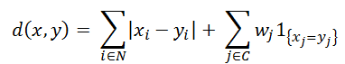

<h1 class="title topictitle1" id="ariaid-title1">KModes (ML Engine)</h1>

KModes is an extension of KMeans that supports categorical data. KModes
			models are fit similarly to KMeans models. The core algorithm is an
			expectation-maximization algorithm that finds a locally optimal solution.

These are the main steps to fitting the model:

<ol class="ol" id="zqh1507735899373__ol_lsr_wxv_q1b">
<li class="li">Initialization

Select a set of K initial cluster centers. You can create this set with the <a href="erv1549378867990.md#vkk1507737806782">RandomSample (ML Engine)</a> function, which samples rows from an input table using the kmeans++ and kmeans|| algorithms. These initialization algorithms create initial cluster centers that are more likely to lead to better local optima.
</li>
<li class="li">E step

A mapper assigns each point in the input
					table to one of the K clusters, and stores the sums of the numerical attributes
					and counts of the categorical attributes.
</li>
<li class="li">M step

A reducer aggregates the the statistics created for each worker in the E step and creates new cluster centers. For numerical attributes, the new center is the mean of the value of the attribute for the points assigned to the cluster. For categorical attributes, the new center is the mode of the attribute value for the points assigned to the cluster.
</li></ol>

The algorithm runs for either a set number of iterations or until the
			change in movement of the cluster centers drops below a user-specified threshold.

When assigning points to a cluster, a hybrid distance function that
			combines a numeric distance and a categorical distance is required. The default distance
			between two data points in a KModes model is the squared Euclidean distance:

  </img>  

where N denotes the indexes of numerical attributes, C denotes the indexes of categorical attributes, and wj denotes the weight to assign to a category.

The Manhattan distance can also be used:

  </img>  

<h2 class="title topictitle2" id="ariaid-title2">KModes Syntax</h2>

<h3 class="title sectiontitle">Version 1.9</h3><pre class="pre codeblock" xml:space="preserve"><code>SELECT * FROM KModes (
  ON { <var class="keyword varname">table</var> | <var class="keyword varname">view</var> | (<var class="keyword varname">query</var>) } AS InputTable
  [ ON { <var class="keyword varname">table</var> | <var class="keyword varname">view</var> | (<var class="keyword varname">query</var>) } AS InitialSeedTable ]
  OUT TABLE OutputTable (<var class="keyword varname">output_table</var>)
  USING
  [ NumClusters (<var class="keyword varname">clusters</var> [,...] ) ]
  [ ModelIDColumn ('<var class="keyword varname">model_id_column</var>') ]
  TargetColumns ('<var class="keyword varname">target_column</var>' [,...] )
  [ StopThreshold (<var class="keyword varname">threshold</var>) ]
  [ MaxIterNum (<var class="keyword varname">max_iterations</var>) ]
  [ NumericDistanceMethod ({ 'euclidean' | 'manhattan' }) ]
  [ CategoricalDistanceMethod ({ 'overlap' | 'hamming' }) ]
  [ CategoryWeights ('<var class="keyword varname">weight</var>' [,...] ) ]
  [ NumericAsCategorical ({ '<var class="keyword varname">ascat_column</var>' | <var class="keyword varname">ascat_column_range</var> }[,...]) ]
  [ Seed (<var class="keyword varname">seed</var>)
    SeedColumns ('<var class="keyword varname">seed_column</var>' [,...])
  ]
) AS <var class="keyword varname">alias</var>;</code></pre>

<h2 class="title topictitle2" id="ariaid-title3">KModes Syntax Elements</h2>

<dl class="dl parml"><dt class="dt pt dlterm">OutputTable</dt><dd class="dd pd">Specify the name of the table in which to output the centroids of the clusters.</dd><dt class="dt pt dlterm">NumClusters</dt><dd class="dd pd">[Required if you omit InitialSeedTable, disallowed otherwise.] Specify the number of clusters. If you specify a single value, the function trains a single model with the specified number of clusters. If you specify multiple values, the function trains a model for each value.</dd><dt class="dt pt dlterm">ModelIDColumn</dt><dd class="dd pd">[Optional] Specify the name of the InitialSeedTable column that contains seed values for multiple models.</dd><dt class="dt pt dlterm">TargetColumns</dt><dd class="dd pd">Specify the input table columns to use for clustering.</dd><dt class="dt pt dlterm">StopThreshold</dt><dd class="dd pd">[Optional] Specify the convergence threshold. When the centroids move by less than <var class="keyword varname">threshold</var>, the algorithm has converged. The <var class="keyword varname">threshold</var> must be a nonnegative DOUBLE value.</dd><dd class="dd pd ddexpand">Default: 0.0395</dd><dt class="dt pt dlterm">MaxIterNum</dt><dd class="dd pd">[Optional] Specify the maximum number of iterations that the algorithm runs before quitting if the convergence threshold is not met. The <var class="keyword varname">max_iterations</var> must be a positive INTEGER.</dd><dd class="dd pd ddexpand">Default: 10</dd><dt class="dt pt dlterm">NumericDistanceMethod</dt><dd class="dd pd">[Optional] Specify the distance metric for numeric dimensions.</dd><dd class="dd pd ddexpand">Default: 'euclidean'</dd><dt class="dt pt dlterm">CategoricalDistanceMethod</dt><dd class="dd pd">[Optional] Specify the distance metric for categorical dimensions:

<table cellpadding="4" cellspacing="0" summary="" id="edx1507735947827__table_d5b_34z_fdb" class="table" frame="border" border="1" rules="all">

<colgroup span="1"><col style="width:50%" span="1"></col><col style="width:50%" span="1"></col></colgroup><thead class="thead" style="text-align:left;"><tr class="row"><th class="entry cellrowborder" style="vertical-align:top;" id="d18000e264" rowspan="1" colspan="1">Option</th><th class="entry cellrowborder" style="vertical-align:top;" id="d18000e266" rowspan="1" colspan="1">Description</th></tr></thead><tbody class="tbody"><tr class="row"><td class="entry cellrowborder" style="vertical-align:top;" headers="d18000e264" rowspan="1" colspan="1"><code class="ph codeph">overlap</code> (Default)</td><td class="entry cellrowborder" style="vertical-align:top;" headers="d18000e266" rowspan="1" colspan="1">Distance is 0 if two points are in same category, 1 otherwise.</td></tr><tr class="row"><td class="entry cellrowborder" style="vertical-align:top;" headers="d18000e264" rowspan="1" colspan="1"><code class="ph codeph">hamming</code></td><td class="entry cellrowborder" style="vertical-align:top;" headers="d18000e266" rowspan="1" colspan="1">Used for categories that are strings of equal length. Percentage of different characters.</td></tr></tbody></table>
</dd><dt class="dt pt dlterm">CategoryWeights</dt><dd class="dd pd">[Optional] Specify the weight of each category in the KModes distance. Each <var class="keyword varname">weight</var> must be a DOUBLE value.</dd><dd class="dd pd ddexpand">Default behavior: All categories have equal weight.</dd><dt class="dt pt dlterm">NumericAsCategorical</dt><dd class="dd pd">[Optional] Specify the input table columns that contain numeric variables to interpret as categorical variables. These columns must have numeric SQL data types.</dd><dd class="dd pd ddexpand">Default behavior: No numeric variables are treated as categorical variables.</dd><dt class="dt pt dlterm">Seed</dt><dd class="dd pd">[Optional] Specify the random seed the algorithm uses for repeatable results. The <var class="keyword varname">seed</var> must be a LONG value.</dd><dd class="dd pd ddexpand">If you specify Seed:
<ul class="ul" id="edx1507735947827__ul_ylx_btw_qy">
<li class="li">You must also specify SeedColumn.</li>
<li class="li">You must specify NumClusters, not InitialSeedTable.</li></ul>
<b>Note</b>
 For repeatable results, use both the Seed and UniqueID syntax elements. For more information, see <a href="qym1549987102806.md">Nondeterministic Results and UniqueID Syntax Element</a>.

</dd><dt class="dt pt dlterm">SeedColumn</dt><dd class="dd pd">[Optional] Specify the names of the InputTable columns by which to partition the input. Function calls that use the same input data, <var class="keyword varname">seed</var>, and <var class="keyword varname">seed_column</var> output the same result. If you specify SeedColumn, you must also specify Seed.</dd><dd class="dd pd ddexpand">Ideally, the number of distinct values in the <var class="keyword varname">seed_column</var> is the same as the number of workers in the cluster. A very large number of distinct values in the <var class="keyword varname">seed_column</var> degrades function performance.</dd></dl>

