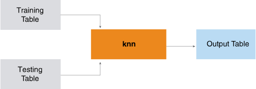

<html><head></head><body>
<h1 class="title topictitle1" id="ariaid-title1">KNN (ML Engine)</h1>

The KNN function uses training data objects to map test data objects to categories. The function is optimized for both small and large training sets. The function supports user-defined distance metrics and distance-weighted voting.

  </img>  

<h2 class="title topictitle2" id="ariaid-title2">KNN Syntax</h2>

<h3 class="title sectiontitle">Version 2.3</h3><pre class="pre codeblock" xml:space="preserve"><code>SELECT * FROM KNN (
  ON <var class="keyword varname">training_table</var> AS TrainingData
  ON <var class="keyword varname">test_table</var> AS TestData
  [ OUT TABLE OutputTable (<var class="keyword varname">output_table</var>) ]
  USING
  K (<var class="keyword varname">k</var>)
  ResponseColumn ('<var class="keyword varname">response_column</var>')
  <code class="ph codeph">[ TrainingIDColumn ('<var class="keyword varname">training_id_column</var>') ]</code>
  <code class="ph codeph">Test</code>IDColumn ('<var class="keyword varname">test_id_column</var>')
  DistanceFeatures ({ '<var class="keyword varname">df_column</var>' | <var class="keyword varname">df_column_range</var> }[,... ])
  [ VotingWeight (<var class="keyword varname">voting_weight</var>) ]
  [ CustomizedDistance ('<var class="keyword varname">jar</var>', '<var class="keyword varname">distance_class</var>') ]
  [ ForceMapReduce (<b>{'true'|'t'|'yes'|'y'|'1'|'false'|'f'|'no'|'n'|'0'}</b>) ]
  [ PartitionColumn ('<var class="keyword varname">partition_column</var>') ]
  [ PartitionBlockSize (<var class="keyword varname">partition_block_size</var>) ]
  [ OutputProb (<b>{'true'|'t'|'yes'|'y'|'1'|'false'|'f'|'no'|'n'|'0'}</b>) ]
  <code class="ph codeph">[ Accumulate ({ '<var class="keyword varname">accumulate_column</var>' | <var class="keyword varname">accumulate_column_range</var> }[,...]) ]</code>
) AS <var class="keyword varname">alias</var>;</code></pre>

<b>Related Information</b>

<ul class="linklist linklist relinfo">
<a href="ndv1557782188375.md">Column Specification Syntax Elements</a>
</ul>

<h2 class="title topictitle2" id="ariaid-title3">KNN Syntax Elements</h2>

<dl class="dl parml"><dt class="dt pt dlterm">OutputTable</dt><dd class="dd pd">[Optional] Specify the name of the output table.</dd><dd class="dd pd ddexpand">Default behavior: The function displays the output to the screen.</dd><dt class="dt pt dlterm">K</dt><dd class="dd pd">Specify the number of nearest neighbors to use for classifying the test data. The choice of <var class="keyword varname">k</var> presents a bias-variance trade-off. A higher value of <var class="keyword varname">k</var> typically results in lower variance and smoother neighboring boundaries but increases bias, and the reverse. If there are more than <var class="keyword varname">k</var> neighbors at the same distance, <var class="keyword varname">k</var> nearest neighbors are randomly chosen. This adds nondeterminism to the algorithm and may result in variation in classification results. To ensure deterministic behavior, use the <a href="fdw1549987717481.md">UniqueID Syntax Element</a>.</dd><dt class="dt pt dlterm">ResponseColumn</dt><dd class="dd pd">Specify the name of the TrainingData column that contains the class label or classification of the classified data objects.</dd><dt class="dt pt dlterm">TrainingIDColumn</dt><dd class="dd pd">[Required with SequenceInputBy]]</dd><dt class="dt pt dlterm">TestIDColumn</dt><dd class="dd pd">Specify the name of the TestData column that uniquely identifies a data object.</dd><dt class="dt pt dlterm">DistanceFeatures</dt><dd class="dd pd">Specify the names of the TrainingData columns that the function uses to compute the distance between a test object and the training objects. The TestData table must also have these columns.</dd><dd class="dd pd ddexpand">A null value in a column is treated as infinite distance.</dd><dd class="dd pd ddexpand">While computing nearest neighbors, the function considers only neighbors from training data, not the already predicted neighbors from testing data.</dd><dd class="dd pd ddexpand">If different features have different units of measurement, Teradata recommends normalizing all data points to be in the range [0,1].</dd><dd class="dd pd ddexpand">As the number of DistanceFeatures increases, the distances between all data points become small and the usefulness of the distance measure decreases. If necessary, reduce the number of features for distance computation by using feature selection or dimensionality reduction methods.</dd><dt class="dt pt dlterm">VotingWeight</dt><dd class="dd pd">[Optional] Specify the voting weight of the distance between a test object and the training objects. The <var class="keyword varname">voting_weight</var> must be a nonnegative integer.</dd><dd class="dd pd ddexpand">The function calculates distance-weighted voting, <var class="keyword varname">w</var>, with this equation:

<code class="ph codeph"><var class="keyword varname">w</var> = 1/POWER(<var class="keyword varname">distance</var>, <var class="keyword varname">voting_weight</var>)</code>
</dd><dd class="dd pd ddexpand">Where <var class="keyword varname">distance</var> is the distance between the test object and the training object.</dd><dd class="dd pd ddexpand">Default: 0</dd><dt class="dt pt dlterm">CustomizedDistance</dt><dd class="dd pd">[Optional] Specify the distance function. The parameter jar is the name of the JAR file that contains the distance metric class. The parameter <var class="keyword varname">distance_class</var> is the distance metric class defined in the jar file. This JAR file must be installed on <b>ML Engine</b>.</dd><dd class="dd pd ddexpand"><b>ML Engine</b> does not support the creation of new customized distance classes. However, it does support existing JAR files—for installation instructions, see <cite class="cite">Teradata Vantage™ User Guide</cite>, B700-4002.</dd><dd class="dd pd ddexpand">Default: Euclidean distance</dd><dt class="dt pt dlterm">ForceMapReduce</dt><dd class="dd pd">[Optional] Specify whether to partition the training data. If you specify 'true', the KNN function partitions the training data and uses the map-and reduce function.</dd><dd class="dd pd ddexpand">If you specify ForceMapReduce, you must also specify PartitionColumn.</dd><dd class="dd pd ddexpand">Default: 'false' (The function loads all training data into memory and uses only the row function.)</dd><dt class="dt pt dlterm">PartitionColumn</dt><dd class="dd pd">[Required if ForceMapReduce is true, ignored otherwise.] Specify name of column by which input table can be uniformly partitioned. The <var class="keyword varname">partition_column</var> must contain INTEGER, BIGINT, or BYTEINT values. A unique identifier for each row results in more uniformed partitioning, for better performance.</dd><dt class="dt pt dlterm">PartitionBlockSize</dt><dd class="dd pd">[Optional] Specify the partition block size to use with ForceMapReduce ('true'). Specifying an optimal value for this syntax element may improve performance. The optimal value depends on the size of the training data and the vworker configuration. Because rows in a partition are processed together, a higher value improves performance, but the maximum value is limited by the memory of the vworker. For example, if the training data set has 1024 rows, specifying PartitionBlockSize('16') partitions the input data into 64 partitions of 16 rows each. Similarly, PartitionBlockSize('128') creates 8 (1024/128) partitions of 128 rows each. The partitions are distributed evenly across the number of vworkers available.</dd><dd class="dd pd ddexpand">If you omit this syntax element, the function calculates the partition block size that best fits available memory. The calculated value is optimal if <var class="keyword varname">partition_column</var> has a unique INTEGER for each row.</dd><dt class="dt pt dlterm">OutputProb</dt><dd class="dd pd">Specify whether to output the calculated probability for each observation.</dd><dd class="dd pd ddexpand">Default: 'false'</dd><dt class="dt pt dlterm">Accumulate</dt><dd class="dd pd">Specify the names of the TrainingTable columns to copy to OutputTable.</dd></dl>

</body></html>
