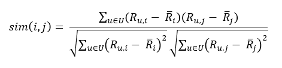
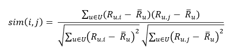

<html><head></head><body>
<h1 class="title topictitle1" id="ariaid-title1">KNNRecommender (ML Engine)</h1>

<b>Related Information</b>

<ul class="linklist linklist relinfo">
<a href="qym1549987102806.md">Nondeterministic Results and UniqueID Syntax Element</a>
</ul>

<h2 class="title topictitle2" id="ariaid-title2">KNNRecommender Syntax</h2>

<h3 class="title sectiontitle">Version 1.7</h3><pre class="pre codeblock" xml:space="preserve"><code>SELECT * FROM KNNRecommender (
  ON <var class="keyword varname">input_table</var> AS InputTable
  OUT TABLE WeightModelTable (<var class="keyword varname">weight_model_table</var>)
  OUT TABLE BiasModelTable (<var class="keyword varname">bias_model_table</var>)
  [ OUT TABLE NearestItemsTable (<var class="keyword varname">item_neighbors_table</var>) ]
  USING
  [ UserIDColumn ('<var class="keyword varname">userid_column</var>')
    ItemIDColumn ('<var class="keyword varname">itemid_column</var>')
    RatingColumn ('<var class="keyword varname">rating_column</var>')
  ]
  [ K (<var class="keyword varname">number_of_item_neighbors</var>) ]
  [ LearningRate (<var class="keyword varname">learning_rate</var>) ]
  [ MaxIterNum (<var class="keyword varname">max_iteration_number</var>) ]
  [ StopThreshold (<var class="keyword varname">threshold</var>) ]
  [ SimilarityMethod ({ 'pearson' | 'adjustedcosine' }) ]
) AS <var class="keyword varname">alias</var>;</code></pre>

<h2 class="title topictitle2" id="ariaid-title3">KNNRecommender Syntax Elements</h2>

<dl class="dl parml"><dt class="dt pt dlterm">WeightModelTable</dt><dd class="dd pd">Specify the name for the output table of interpolation weights.</dd><dt class="dt pt dlterm">BiasModelTable</dt><dd class="dd pd">Specify the name for the output table of global, user, and item bias statistics.</dd><dt class="dt pt dlterm">NearestItemsTable</dt><dd class="dd pd">[Optional] Specify the name for the output table of nearest neighbors for each item.

If you omit this syntax element, the function does not output this table.

If you specify this syntax element, and a table named <var class="keyword varname">item_neighbors_table</var> exists, the function uses the existing table to train the model.

If you specify this syntax element, and no table named <var class="keyword varname">item_neighbors_table</var> exists, the function creates a table with that name.
</dd><dt class="dt pt dlterm">UserIDColumn</dt><dd class="dd pd">[Optional] Specify the InputTable column that contains the user IDs.</dd><dd class="dd pd ddexpand">You must specify either all or none of UserIDColumn, ItemIDColumn, and RatingColumn.</dd><dd class="dd pd ddexpand">Default: First InputTable column</dd><dt class="dt pt dlterm">ItemIDColumn</dt><dd class="dd pd">[Optional] Specify the InputTable column that contains the item IDs.</dd><dd class="dd pd ddexpand">Default: Second InputTable column</dd><dt class="dt pt dlterm">RatingColumn</dt><dd class="dd pd">[Optional] Specify the InputTable column that contains the ratings.</dd><dd class="dd pd ddexpand">Default: Third InputTable column</dd><dt class="dt pt dlterm">K</dt><dd class="dd pd">[Optional] Specify the number of nearest neighbors with which to calculate the interpolation weights.</dd><dd class="dd pd ddexpand">Default: 20</dd><dt class="dt pt dlterm">LearningRate</dt><dd class="dd pd">[Optional] Specify the initial learning rate. The learning rate adjusts automatically during training based on changes in the root-mean-square error (RMSE).</dd><dd class="dd pd ddexpand">Default: 0.001</dd><dt class="dt pt dlterm">MaxIterNum</dt><dd class="dd pd">[Optional] Specify the maximum number of iterations.</dd><dd class="dd pd ddexpand">Default: 10</dd><dt class="dt pt dlterm">StopThreshold</dt><dd class="dd pd">[Optional] Specify the RMSE below which the function stops.</dd><dd class="dd pd ddexpand">Default: 0.0002</dd><dt class="dt pt dlterm">SimilarityMethod</dt><dd class="dd pd">[Optional] Specify the method for calculating item similarity:

<table cellpadding="4" cellspacing="0" summary="" id="ztk1507908552372__table_dn2_jrz_fdb" class="table" frame="border" border="1" rules="all">

<colgroup span="1"><col style="width:25%" span="1"></col><col style="width:75%" span="1"></col></colgroup><thead class="thead" style="text-align:left;"><tr class="row"><th class="entry cellrowborder" style="vertical-align:top;" id="d62425e211" rowspan="1" colspan="1">Option</th><th class="entry cellrowborder" style="vertical-align:top;" id="d62425e213" rowspan="1" colspan="1">Description</th></tr></thead><tbody class="tbody"><tr class="row"><td class="entry cellrowborder" style="vertical-align:top;" headers="d62425e211" rowspan="1" colspan="1"><code class="ph codeph">'pearson'</code> (Default)</td><td class="entry cellrowborder" style="vertical-align:top;" headers="d62425e213" rowspan="1" colspan="1">Pearson correlation coefficient:

  </img>  
</td></tr><tr class="row"><td class="entry cellrowborder" style="vertical-align:top;" headers="d62425e211" rowspan="1" colspan="1"><code class="ph codeph">'adjustedcosine'</code></td><td class="entry cellrowborder" style="vertical-align:top;" headers="d62425e213" rowspan="1" colspan="1">Adjusted cosine similarity:

  </img>  
</td></tr></tbody></table>
</dd></dl>

</body></html>
