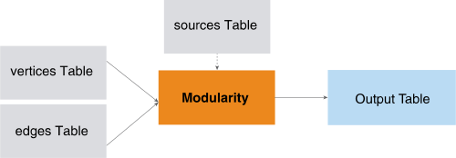

<h1 class="title topictitle1" id="ariaid-title1">Modularity (ML Engine)</h1>

The Modularity function uses a clustering algorithm to detect communities
			in networks (graphs).The function needs no prior knowledge or estimation of starting
			cluster centers and assumes no particular data distribution of the input data set.

  </img>  

<h2 class="title topictitle2" id="ariaid-title2">Modularity Syntax</h2>

<h3 class="title sectiontitle">Version 1.8</h3><pre class="pre codeblock" xml:space="preserve"><code>SELECT * FROM Modularity (
  ON { <var class="keyword varname">table</var> | <var class="keyword varname">view</var> | (<var class="keyword varname">query</var>) } AS Vertices PARTITION BY <var class="keyword varname">vertex_key_column</var> [,...] 
  ON { <var class="keyword varname">table</var> | <var class="keyword varname">view</var> | (<var class="keyword varname">query</var>) } AS Edges PARTITION BY <var class="keyword varname">source_vertex_key_column</var> [,...] 
  [ ON { <var class="keyword varname">table</var> | <var class="keyword varname">view</var> | (<var class="keyword varname">query</var>) } AS Sources PARTITION BY <var class="keyword varname">vertex_key_column</var> [,...] ]
  [ OUT TABLE CommunityEdgeTable (<var class="keyword varname">community_edge_table</var>) ]
  USING
  TargetKey ({ '<var class="keyword varname">target_key_column</var>' | <var class="keyword varname">target_key_column_range</var> }[,...])
  [ EdgeWeight (<var class="keyword varname">edge_weight</var>) ]
  [ CommunityAssociation ('<var class="keyword varname">community_id</var>') ]
  [ Resolution (<var class="keyword varname">resolution</var> [,...]) ]
  [ Seed (<var class="keyword varname">seed</var>) ]
  <code class="ph codeph">[ Accumulate ({ '<var class="keyword varname">accumulate_column</var>' | <var class="keyword varname">accumulate_column_range</var> }[,...]) ]</code>
) AS <var class="keyword varname">alias</var>;</code></pre>

<b>Related Information</b>

<ul class="linklist linklist relinfo">
<a href="ndv1557782188375.md">Column Specification Syntax Elements</a>
</ul>

<h2 class="title topictitle2" id="ariaid-title3">Modularity Syntax Elements</h2>

<dl class="dl parml"><dt class="dt pt dlterm">CommunityEdgeTable</dt><dd class="dd pd">[Optional] Specify the name of the table that the function creates to output the weights of the edges between the communities at different resolution levels. If you omit this syntax element, the function does not create this table.</dd><dd class="dd pd ddexpand">
<b>Tip</b>
Teradata recommends using this element only if this information is required. Creating this table can greatly increase function run time.

</dd><dt class="dt pt dlterm">TargetKey</dt><dd class="dd pd">Specify the key of the target vertex of an edge. The key consists of the names of one or more Edges table columns.</dd><dt class="dt pt dlterm">EdgeWeight</dt><dd class="dd pd">[Optional] Specify the name of the Edges table column that contains edge weights. Each <var class="keyword varname">edge_weight</var> is a positive value.</dd><dd class="dd pd ddexpand">Default behavior: The weight of each edge is 1 (that is, the graph is unweighted).

This syntax element determines how the function treats duplicate edges (that is, edges with the same source and destination, which might have different weights). For a weighted graph, the function treats duplicate edges as a single edge whose weight is the sum of the weights of the duplicate edges. For an unweighted graph, the function uses only one of the duplicate edges.
</dd><dt class="dt pt dlterm">CommunityAssociation</dt><dd class="dd pd">[Optional] Specify the name of the column that represents the community association of the vertices. Use this syntax element if you know some vertex communities.</dd><dt class="dt pt dlterm">Resolution</dt><dd class="dd pd">[Optional] Specify hierarchical-level information for the communities. For details, see <a href="fmd1559146970819.md">Resolution</a>. If you specify a list of <var class="keyword varname">resolution</var> values, the function incrementally finds the communities for each value and for the default value.</dd><dd class="dd pd ddexpand">Each <var class="keyword varname">resolution</var> must be a distinct DOUBLE PRECISION value in the range [0.0, 1000000.0]. The value 0.0 puts each node in its own community of size 1. You can specify a maximum of 500 <var class="keyword varname">resolution</var> values.</dd><dd class="dd pd ddexpand">Default: 1.0</dd><dt class="dt pt dlterm">Seed</dt><dd class="dd pd">[Optional] Specify the random seed the algorithm uses for repeatable results. The <var class="keyword varname">seed</var> must be a LONG value greater than or equal to 1. The algorithm multiplies <var class="keyword varname">seed</var> by the hash code of <var class="keyword varname">vertex_key</var> to create a unique seed for each vertex.
<b>Note</b>
 For repeatable results, use both the Seed and UniqueID syntax elements. For more information, see <a href="qym1549987102806.md">Nondeterministic Results and UniqueID Syntax Element</a>.

</dd><dd class="dd pd ddexpand">The function also uses <var class="keyword varname">seed</var> for these purposes:
<ul class="ul" id="cud1507756639473__ul_xmg_dyt_gy">
<li class="li">To break ties between different vertices during community formation</li>
<li class="li">To determine when to stop community formation

If <var class="keyword varname">seed</var> is 1 (default value), community formation continues until the change in modularity score drops below a threshold value. The threshold value is set in the function code; you cannot change it.

If <var class="keyword varname">seed</var> is set to any other value, community formation continues until the change in modularity score between iterations is 0. This deeper analysis of the graph can improve community formation, but can also increase execution time.
</li></ul></dd><dd class="dd pd ddexpand">Default: 1</dd><dt class="dt pt dlterm">Accumulate</dt><dd class="dd pd">[Optional] Specify the names of the Vertices columns to copy to the community Vertices table.</dd><dd class="dd pd ddexpand">Default behavior: The function copies the <var class="keyword varname">vertex_key</var> columns to the output Vertices table for each vertex, changing the column names to <var class="keyword varname">id</var>, <var class="keyword varname">id</var>_1, <var class="keyword varname">id</var>_2, and so on.</dd></dl>

