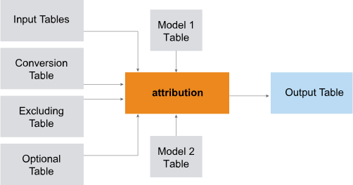

<html><head></head><body>
<h1 class="title topictitle1" id="ariaid-title1">Multiple-Input Attribution_MLE (ML Engine)</h1>

The multiple-input version of the Attribution_MLE function accepts one or more input tables and gets many parameters from other dimension tables.

  </img>  

<b>Related Information</b>

<ul class="linklist linklist relinfo">
<a href="ppu1541526284885.md#ifq1507592820945">Single-Input Attribution_MLE (ML Engine)</a>
</ul>

<h2 class="title topictitle2" id="ariaid-title2">Attribution_MLE Syntax (Multiple Inputs)</h2>

<h3 class="title sectiontitle">Version 2.10</h3><pre class="pre codeblock" xml:space="preserve"><code>SELECT * FROM Attribution_MLE (
  ON { <var class="keyword varname">table</var> | <var class="keyword varname">view</var> | (<var class="keyword varname">query</var>) } PARTITION BY <var class="keyword varname">user_id</var> ORDER BY <var class="keyword varname">timestamp_column</var> 
  [ ON { <var class="keyword varname">table</var> | <var class="keyword varname">view</var> | (<var class="keyword varname">query</var>) } PARTITION BY <var class="keyword varname">user_id</var> ORDER BY <var class="keyword varname">timestamp_column</var> ][,...]
  ON <var class="keyword varname">conversion_event_table</var> AS ConversionEventTable DIMENSION
  [ ON <var class="keyword varname">excluding_event_table</var> AS ExcludedEventTable DIMENSION ]
  [ ON <var class="keyword varname">optional_event_table</var> AS OptionalEventTable DIMENSION ]
  ON <var class="keyword varname">first_model_table</var> AS FirstModelTable DIMENSION
  [ ON <var class="keyword varname">second_model_table</var> AS SecondModelTable DIMENSION ]
  USING
  EventColumn ('<var class="keyword varname">event_column</var>')
  TimeColumn ('<var class="keyword varname">timestamp_column</var>')
  WindowSize ({ 'rows:<var class="keyword varname">K</var>' | 'seconds:<var class="keyword varname">K</var>' | 'rows:<var class="keyword varname">K</var>&amp;seconds:<var class="keyword varname">K2</var>' })
) AS <var class="keyword varname">alias</var> ORDER BY <var class="keyword varname">user_id</var>,<var class="keyword varname">time_stamp</var>;</code></pre>

<b>Related Information</b>

<ul class="linklist linklist relinfo">
<a href="eta1543514041091.md">Comments in Queries</a>
</ul>

<h2 class="title topictitle2" id="ariaid-title3">Attribution_MLE Syntax Elements (Multiple Inputs)</h2>

<dl class="dl parml"><dt class="dt pt dlterm">EventColumn</dt><dd class="dd pd">Specify the name of the input column that contains the clickstream events.</dd><dt class="dt pt dlterm">TimeColumn</dt><dd class="dd pd">Specify the name of the input column that contains the timestamps of the clickstream events.</dd><dt class="dt pt dlterm">WindowSize</dt><dd class="dd pd">Specify how to determine the maximum window size for the attribution calculation:

<table cellpadding="4" cellspacing="0" summary="" id="nwj1507592418107__table_a4k_nyx_fdb" class="table" frame="border" border="1" rules="all">

<colgroup span="1"><col style="width:50%" span="1"></col><col style="width:50%" span="1"></col></colgroup><thead class="thead" style="text-align:left;"><tr class="row"><th class="entry cellrowborder" style="vertical-align:top;" id="d72766e203" rowspan="1" colspan="1">Option</th><th class="entry cellrowborder" style="vertical-align:top;" id="d72766e205" rowspan="1" colspan="1">Description</th></tr></thead><tbody class="tbody"><tr class="row"><td class="entry cellrowborder" style="vertical-align:top;" headers="d72766e203" rowspan="1" colspan="1"><code class="ph codeph">rows:</code><var class="keyword varname">K</var></td><td class="entry cellrowborder" style="vertical-align:top;" headers="d72766e205" rowspan="1" colspan="1">Assign attributions to at most <var class="keyword varname">K</var> events before conversion event, excluding events of types specified in ExcludedEventTable.</td></tr><tr class="row"><td class="entry cellrowborder" style="vertical-align:top;" headers="d72766e203" rowspan="1" colspan="1"><code class="ph codeph">seconds:</code><var class="keyword varname">K</var></td><td class="entry cellrowborder" style="vertical-align:top;" headers="d72766e205" rowspan="1" colspan="1">Assign attributions only to rows not more than <var class="keyword varname">K</var> seconds before conversion event.</td></tr><tr class="row"><td class="entry cellrowborder" style="vertical-align:top;" headers="d72766e203" rowspan="1" colspan="1"><code class="ph codeph">rows:</code><var class="keyword varname">K</var><code class="ph codeph">&amp;seconds:</code><var class="keyword varname">K2</var></td><td class="entry cellrowborder" style="vertical-align:top;" headers="d72766e205" rowspan="1" colspan="1">Apply both constraints and comply with stricter one.</td></tr></tbody></table>
</dd></dl>

</body></html>
