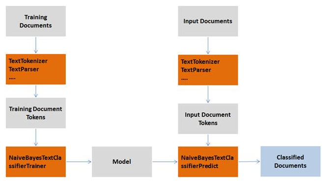

<html><head></head><body id="hgc1507916729258"><h1 class="title topictitle1" id="ariaid-title1">Naive Bayes Text Classifier Functions (ML Engine)</h1>

The Naive Bayes Text Classifier is a variant of the Naive Bayes classification algorithm that is designed specifically for document classification.

For information about the Naive Bayes classification algorithm and functions, see <a href="xhl1570134681012.md">Naive Bayes Functions (ML Engine)</a>.

Naive Bayes Text Classifier runs these functions:

<ul class="ul" id="hgc1507916729258__ul_sgl_vy2_n1b">
<li class="li"><a href="rqb1558538329353.md#umc1507760750165">NaiveBayesTextClassifierTrainer (ML Engine)</a>, which creates a model from training data</li>
<li class="li"><a href="guv1541533763626.md#erm1507322198819">NaiveBayesTextClassifierPredict_MLE (ML Engine)</a>, which uses the model to make predictions about testing data</li></ul>

The preceding functions process tokens, not documents. The input is a table of tokens that you can create with the <a href="vxn1558537001391.md#cqz1507574499386">TextTokenizer (ML Engine)</a> function.

  </img>  

