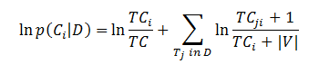
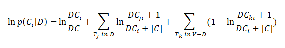

<h1 class="title topictitle1" id="ariaid-title1">NaiveBayesTextClassifierTrainer (ML Engine)</h1>

The NaiveBayesTextClassifierTrainer function takes training data as input
			and outputs a model table.

<h2 class="title topictitle2" id="ariaid-title2">NaiveBayesTextClassifierTrainer Syntax</h2>

<h3 class="title sectiontitle">NaiveBayesTextClassifierTrainer version 1.9, NaiveBayesTextClassifierInternal version 1.7</h3><pre class="pre codeblock" xml:space="preserve"><code>SELECT * FROM NaiveBayesTextClassifierTrainer (
  ON NaiveBayesTextClassifierInternal (
  ON <var class="keyword varname">input_table</var> AS InputTable PARTITION BY <var class="keyword varname">doc_category_column</var> 
      [ ON <var class="keyword varname">categories_table</var> AS CategoriesTable DIMENSION ]
      [ ON <var class="keyword varname">stop_words_table</var> AS StopWords DIMENSION ]
      USING
      TokenColumn ('<var class="keyword varname">token_column</var>')
      [ ModelType ({ 'Multinomial' | 'Bernoulli' }) ]
      [ DocIDColumns ({ '<var class="keyword varname">doc_id_column</var>' | <var class="keyword varname">doc_id_column_range</var> }[,...])]
      DocCategoryColumn ('<var class="keyword varname">doc_category_column</var>')
      [ CategoryColumn ('<var class="keyword varname">category_column</var>') | Categories ('<var class="keyword varname">category</var>' [,...]) ]
      [ StopWordsColumn ('<var class="keyword varname">stop_words_column</var>') | StopWordsList ('<var class="keyword varname">word</var>' [,...]) ]
  ) AS <var class="keyword varname">alias_1</var> PARTITION BY 1
) AS <var class="keyword varname">alias_2</var>;</code></pre>

<b>Related Information</b>

<ul class="linklist linklist relinfo">
<a href="ndv1557782188375.md">Column Specification Syntax Elements</a>
</ul>

<h2 class="title topictitle2" id="ariaid-title3">NaiveBayesTextClassifierTrainer Syntax Elements</h2>

<dl class="dl parml"><dt class="dt pt dlterm">TokenColumn</dt><dd class="dd pd">Specify the name of the InputTable column that contains the tokens to classify.</dd><dt class="dt pt dlterm">ModelType</dt><dd class="dd pd">[Optional] Specify the model type of the text classifier.</dd><dd class="dd pd ddexpand">Default: 'Multinomial'. See the sections that follow this table.</dd><dt class="dt pt dlterm">DocIDColumn</dt><dd class="dd pd">[Required if ModelType is 'Bernoulli', unnecessary otherwise.] Specify the names of the token table columns that contain the document identifier.</dd><dt class="dt pt dlterm">DocCategoryColumn</dt><dd class="dd pd">Specify the name of the InputTable column that contains the document category.</dd><dt class="dt pt dlterm">CategoryColumn</dt><dd class="dd pd">[Optional] Use only if you specify CategoriesTable. Specify the name of the CategoriesTable column that contains the prediction categories to use in the model.</dd><dd class="dd pd ddexpand">Default: First column of CategoriesTable</dd><dd class="dd pd ddexpand">If you omit both CategoriesTable and CategoryColumn, the function uses all categories specified by DocCategoryColumn.</dd><dt class="dt pt dlterm">Categories</dt><dd class="dd pd">[Optional] Specify the prediction categories to use in the model.</dd><dd class="dd pd ddexpand">Default: All categories specified by DocCategoryColumn.</dd><dt class="dt pt dlterm">StopWordsColumn</dt><dd class="dd pd">[Optional] Specify the name of the StopWords table column that contains the stop words.</dd><dd class="dd pd ddexpand">Default: First column of StopWords table</dd><dt class="dt pt dlterm">StopWordsList</dt><dd class="dd pd">[Optional] Specify either this syntax element or the StopWords table, but not both.

Specify words to ignore (such as a, an, and the).
</dd></dl>

<h3 class="title sectiontitle">Multinomial (default) Model Formula</h3>

  </img>  

<table cellpadding="4" cellspacing="0" summary="" id="sqd1507321614930__table_N100E0_N100D4_N1000C_N10001" class="table" frame="border" border="1" rules="all">

<colgroup span="1"><col style="width:16.666666666666664%" span="1"></col><col style="width:83.33333333333334%" span="1"></col></colgroup><thead class="thead" style="text-align:left;"><tr class="row"><th class="entry nocellnorowborder" style="vertical-align:top;" id="d53210e218" rowspan="1" colspan="1">Expression</th><th class="entry cell-norowborder" style="vertical-align:top;" id="d53210e220" rowspan="1" colspan="1">Description</th></tr></thead><tbody class="tbody"><tr class="row"><td class="entry nocellnorowborder" style="vertical-align:top;" headers="d53210e218" rowspan="1" colspan="1"><var class="keyword varname">p</var>(<var class="keyword varname">C</var>i|<var class="keyword varname">D</var>)</td><td class="entry cell-norowborder" style="vertical-align:top;" headers="d53210e220" rowspan="1" colspan="1">Probability that new document <var class="keyword varname">D</var> is classified to category <var class="keyword varname">i</var></td></tr><tr class="row"><td class="entry nocellnorowborder" style="vertical-align:top;" headers="d53210e218" rowspan="1" colspan="1"><var class="keyword varname">TC</var></td><td class="entry cell-norowborder" style="vertical-align:top;" headers="d53210e220" rowspan="1" colspan="1">Total token count (including duplicate tokens)</td></tr><tr class="row"><td class="entry nocellnorowborder" style="vertical-align:top;" headers="d53210e218" rowspan="1" colspan="1"><var class="keyword varname">T</var>j</td><td class="entry cell-norowborder" style="vertical-align:top;" headers="d53210e220" rowspan="1" colspan="1">Count of token <var class="keyword varname">j</var> in category <var class="keyword varname">i</var> (including duplicate tokens)</td></tr><tr class="row"><td class="entry nocellnorowborder" style="vertical-align:top;" headers="d53210e218" rowspan="1" colspan="1"><var class="keyword varname">TC</var>i</td><td class="entry cell-norowborder" style="vertical-align:top;" headers="d53210e220" rowspan="1" colspan="1">Token count in category <var class="keyword varname">i</var> (including duplicate tokens)</td></tr><tr class="row"><td class="entry nocellnorowborder" style="vertical-align:top;" headers="d53210e218" rowspan="1" colspan="1"><var class="keyword varname">TC</var>ji</td><td class="entry cell-norowborder" style="vertical-align:top;" headers="d53210e220" rowspan="1" colspan="1">Count of token j in category i (including duplicate tokens)</td></tr><tr class="row"><td class="entry row-nocellborder" style="vertical-align:top;" headers="d53210e218" rowspan="1" colspan="1">|<var class="keyword varname">V</var>|</td><td class="entry cellrowborder" style="vertical-align:top;" headers="d53210e220" rowspan="1" colspan="1">Number of unique tokens in training set <var class="keyword varname">V</var></td></tr></tbody></table>

<h3 class="title sectiontitle">Bernoulli Model Formula</h3>

  </img>  

<table cellpadding="4" cellspacing="0" summary="" id="sqd1507321614930__table_N1016E_N100D4_N1000C_N10001" class="table" frame="border" border="1" rules="all">

<colgroup span="1"><col style="width:16.666666666666664%" span="1"></col><col style="width:83.33333333333334%" span="1"></col></colgroup><thead class="thead" style="text-align:left;"><tr class="row"><th class="entry nocellnorowborder" style="vertical-align:top;" id="d53210e308" rowspan="1" colspan="1">Expression</th><th class="entry cell-norowborder" style="vertical-align:top;" id="d53210e310" rowspan="1" colspan="1">Description</th></tr></thead><tbody class="tbody"><tr class="row"><td class="entry nocellnorowborder" style="vertical-align:top;" headers="d53210e308" rowspan="1" colspan="1"><var class="keyword varname">p</var>(<var class="keyword varname">C</var>i|<var class="keyword varname">D</var>)</td><td class="entry cell-norowborder" style="vertical-align:top;" headers="d53210e310" rowspan="1" colspan="1">Probability that new document <var class="keyword varname">D</var> is classified to category <var class="keyword varname">i</var></td></tr><tr class="row"><td class="entry nocellnorowborder" style="vertical-align:top;" headers="d53210e308" rowspan="1" colspan="1"><var class="keyword varname">DC</var></td><td class="entry cell-norowborder" style="vertical-align:top;" headers="d53210e310" rowspan="1" colspan="1">Total document count</td></tr><tr class="row"><td class="entry nocellnorowborder" style="vertical-align:top;" headers="d53210e308" rowspan="1" colspan="1"><var class="keyword varname">DC</var>i</td><td class="entry cell-norowborder" style="vertical-align:top;" headers="d53210e310" rowspan="1" colspan="1">Document count in category <var class="keyword varname">i</var></td></tr><tr class="row"><td class="entry nocellnorowborder" style="vertical-align:top;" headers="d53210e308" rowspan="1" colspan="1"><var class="keyword varname">V</var></td><td class="entry cell-norowborder" style="vertical-align:top;" headers="d53210e310" rowspan="1" colspan="1">Number of unique tokens in training set <var class="keyword varname">V</var></td></tr><tr class="row"><td class="entry nocellnorowborder" style="vertical-align:top;" headers="d53210e308" rowspan="1" colspan="1"><var class="keyword varname">T</var>k</td><td class="entry cell-norowborder" style="vertical-align:top;" headers="d53210e310" rowspan="1" colspan="1">Token in <var class="keyword varname">V</var> that is not in document <var class="keyword varname">D</var></td></tr><tr class="row"><td class="entry nocellnorowborder" style="vertical-align:top;" headers="d53210e308" rowspan="1" colspan="1"><var class="keyword varname">DC</var>ji</td><td class="entry cell-norowborder" style="vertical-align:top;" headers="d53210e310" rowspan="1" colspan="1">Document count in category <var class="keyword varname">i</var> that contains token <var class="keyword varname">j</var></td></tr><tr class="row"><td class="entry nocellnorowborder" style="vertical-align:top;" headers="d53210e308" rowspan="1" colspan="1"><var class="keyword varname">DC</var>ki</td><td class="entry cell-norowborder" style="vertical-align:top;" headers="d53210e310" rowspan="1" colspan="1">Document count in category <var class="keyword varname">i</var> that contains token <var class="keyword varname">k</var></td></tr><tr class="row"><td class="entry row-nocellborder" style="vertical-align:top;" headers="d53210e308" rowspan="1" colspan="1">|<var class="keyword varname">C</var>|</td><td class="entry cellrowborder" style="vertical-align:top;" headers="d53210e310" rowspan="1" colspan="1">Number of unique categories in category set <var class="keyword varname">C</var></td></tr></tbody></table>

