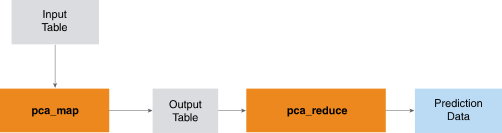

<h1 class="title topictitle1" id="ariaid-title1">PCA (ML Engine)</h1>

The PCA function, which is composed of two functions, PCAMap and PCAReduce, uses a deterministic algorithm to identify the principal components of an input table in dense format.

  </img>  

<h2 class="title topictitle2" id="ariaid-title2">PCA Syntax</h2>

<h3 class="title sectiontitle">PCAReduce version 1.9, PCAMap version 1.8</h3><pre class="pre codeblock" xml:space="preserve"><code>SELECT * FROM PCAReduce (
  ON PCAMap (
    ON <var class="keyword varname">target_table</var> [ PARTITION BY { ANY | KEY } ]
    [ USING Target_Columns ({ '<var class="keyword varname">target_column</var>' | <var class="keyword varname">target_column</var><var class="keyword varname">_range</var> }[,...]) ]
  ) AS <var class="keyword varname">alias_1</var> PARTITION BY 1
  [ USING Components (<var class="keyword varname">num_components</var>) ]
) AS <var class="keyword varname">alias_2</var> ORDER BY <var class="keyword varname">component_rank</var>;</code></pre>

<b>Related Information</b>

<ul class="linklist linklist relinfo">
<a href="ndv1557782188375.md">Column Specification Syntax Elements</a>
</ul>

<h2 class="title topictitle2" id="ariaid-title3">PCA Syntax Elements</h2>

<dl class="dl parml"><dt class="dt pt dlterm">Target_Columns</dt><dd class="dd pd">[Optional] Specify the <var class="keyword varname">target_table</var> columns that contain the data, which must be numeric.</dd><dd class="dd pd ddexpand">Default: Every <var class="keyword varname">target_table</var> column</dd><dt class="dt pt dlterm">Components</dt><dd class="dd pd">[Optional] Specify the number of principal components to return (an integer). If <var class="keyword varname">num_components</var> is <var class="keyword varname">k</var>, then the function returns the top <var class="keyword varname">k</var> components.</dd><dd class="dd pd ddexpand">Default: Every principal component</dd></dl>

