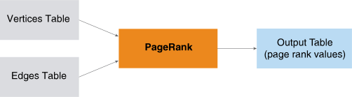

<html><head></head><body>
<h1 class="title topictitle1" id="ariaid-title1">PageRank (ML Engine)</h1>

The PageRank function computes the PageRank values for a directed graph,
			weighted or unweighted.

  </img>  

PageRank is a link analysis algorithm. It assigns a numerical weight (between 0 and 1) to each node in a directed graph, for the purpose of measuring the relative importance of the node to the graph. The sum of the PageRank values of the nodes is 1. PageRank is applicable to any collection of entities with reciprocal quotations and references.

<h2 class="title topictitle2" id="ariaid-title2">PageRank Syntax</h2>

<h3 class="title sectiontitle">Version 1.8</h3><pre class="pre codeblock" xml:space="preserve"><code>SELECT * FROM PageRank (
  ON <var class="keyword varname">vertices_table</var> AS Vertices PARTITION BY <var class="keyword varname">vertex_key_column</var> [,...] 
  ON <var class="keyword varname">edges_table</var> AS Edges PARTITION BY <var class="keyword varname">source_vertex_key_column</var> [,...]
  USING
  TargetKey ('<var class="keyword varname">target_key_column</var>' [,...])
  [ EdgeWeight (<var class="keyword varname">edge_weight</var>) ]
  [ DampFactor (<var class="keyword varname">damp_factor</var>) ]
  [ MaxIterNum (<var class="keyword varname">max_iterations</var>) ]
  [ StopThreshold (<var class="keyword varname">threshold</var>) ]
  <code class="ph codeph">[ Accumulate ({ '<var class="keyword varname">accumulate_column</var>' | <var class="keyword varname">accumulate_column_range</var> }[,...]) ]</code>
) AS <var class="keyword varname">alias</var>;</code></pre>

<b>Related Information</b>

<ul class="linklist linklist relinfo">
<a href="ndv1557782188375.md">Column Specification Syntax Elements</a>
</ul>

<h2 class="title topictitle2" id="ariaid-title3">PageRank Syntax Elements</h2>

<dl class="dl parml"><dt class="dt pt dlterm">TargetKey</dt><dd class="dd pd">Specify the target key columns in the Edges table.</dd><dt class="dt pt dlterm">EdgeWeight</dt><dd class="dd pd">[Optional] Specify the column in the Edges table that contains the edge weight, which must be a positive value.</dd><dd class="dd pd ddexpand">Default behavior: All edges have the same weight (that is, the graph is unweighted).</dd><dt class="dt pt dlterm">DampFactor</dt><dd class="dd pd">[Optional] Specify the value to use in the PageRank formula. The <var class="keyword varname">damp_factor</var> must be a DOUBLE PRECISION value between 0 and 1.</dd><dd class="dd pd ddexpand">Default: 0.85</dd><dt class="dt pt dlterm">MaxIterNum</dt><dd class="dd pd">[Optional] Specify the maximum number of function iterations before the function completes. The <var class="keyword varname">max_iterations</var> must be a positive INTEGER value.</dd><dd class="dd pd ddexpand">The <var class="keyword varname">max_iterations</var> is the number of function iterations (that is, the <b>SQL-GR</b> iterations minus 3).</dd><dd class="dd pd ddexpand">Default: 20</dd><dt class="dt pt dlterm">StopThreshold</dt><dd class="dd pd">[Optional] Specify the convergence criteria value. The threshold must be a DOUBLE PRECISION value.</dd><dd class="dd pd ddexpand">Default: 0.0001</dd><dt class="dt pt dlterm">Accumulate</dt><dd class="dd pd">[Optional] Specify the Vertices table columns to copy to the output table.</dd></dl>

</body></html>
