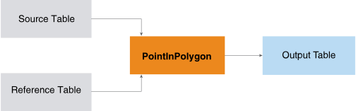
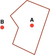

<h1 class="title topictitle1" id="ariaid-title1">PointInPolygon (ML Engine)</h1>

The PointInPolygon function takes a list of location points and a list of
			polygons and returns a list of binary values for every point and polygon combination,
			which indicates whether the point is contained in the polygon.

  </img>  

The PointInPolygon function works only on 2D spatial objects.

The function determines whether a given point in the plane lies inside or outside of a polygon. It has various applications in many fields such as computer graphics, geographical information systems (GIS), and CAD.

In the following example, point A is in the polygon and point B is outside of the polygon.

  </img>  

A use case for this function is to determine in which drive-time polygon surrounding a store a customer resides. This information helps in mailer targeting.

Another use case is to determine which cell phones are frequently within a polygon surrounding an airport. This information helps in identifying frequent fliers.

<h2 class="title topictitle2" id="ariaid-title2">PointInPolygon Syntax</h2>

<h3 class="title topictitle3" id="ariaid-title3">Small Polygon Count and Large Point Count</h3>

<h4 class="title sectiontitle">Version 1.4</h4><pre class="pre codeblock" xml:space="preserve"><code>SELECT * FROM PointInPolygon (
  ON <var class="keyword varname">source_table</var> AS SourceTable PARTITION BY ANY
  ON <var class="keyword varname">reference_table</var> AS ReferenceTable DIMENSION
  USING
  SourceLocationColumn ('<var class="keyword varname">source_location_point_column</var>' [, '<var class="keyword varname">source_location_point_column_2</var>' ])
  ReferenceLocationColumn ('<var class="keyword varname">reference_location_polygon_column</var>')
  ReferenceNameColumns ({ '<var class="keyword varname">reference_name_column</var>' | <var class="keyword varname">reference_name_column_range</var> }[,...])
  [ OutputAll (<b>{'true'|'t'|'yes'|'y'|'1'|'false'|'f'|'no'|'n'|'0'}</b>) ]
  <code class="ph codeph">[ Accumulate ({ '<var class="keyword varname">accumulate_column</var>' | <var class="keyword varname">accumulate_column_range</var> }[,...]) ]</code>
) AS <var class="keyword varname">alias</var>;</code></pre>

<b>Related Information</b>

<ul class="linklist linklist relinfo">
<a href="ndv1557782188375.md">Column Specification Syntax Elements</a>
</ul>

<h3 class="title topictitle3" id="ariaid-title4">Large Polygon Count and Small Point Count</h3>

<h4 class="title sectiontitle">Version 1.4</h4><pre class="pre codeblock" xml:space="preserve"><code>SELECT * FROM PointInPolygon (
  ON <var class="keyword varname">dimension_table</var> AS SourceTable DIMENSION
  ON <var class="keyword varname">reference_table</var> AS ReferenceTable PARTITION BY ANY
  USING
  SourceLocationColumn ('<var class="keyword varname">source_location_point_column</var>' [, '<var class="keyword varname">source_location_point_column_2</var>' ])
  ReferenceLocationColumn ('<var class="keyword varname">reference_location_polygon_column</var>')
  ReferenceNameColumns ({ '<var class="keyword varname">reference_name_column</var>' | <var class="keyword varname">reference_name_column_range</var> }[,...])
  OutputAll (<b>{'true'|'t'|'yes'|'y'|'1'|'false'|'f'|'no'|'n'|'0'}</b>)
  <code class="ph codeph">[ Accumulate ({ '<var class="keyword varname">accumulate_column</var>' | <var class="keyword varname">accumulate_column_range</var> }[,...]) ]</code>
) AS <var class="keyword varname">alias</var>;</code></pre>

<b>Related Information</b>

<ul class="linklist linklist relinfo">
<a href="ndv1557782188375.md">Column Specification Syntax Elements</a>
</ul>

<h3 class="title topictitle3" id="ariaid-title5">Only to Determine Relations of Points and Polygons in Same Group</h3>

<h4 class="title sectiontitle">Version 1.4</h4><pre class="pre codeblock" xml:space="preserve"><code>SELECT * FROM PointInPolygon (
  ON { <var class="keyword varname">table</var> | <var class="keyword varname">view</var> | (<var class="keyword varname">query</var>) } AS SourceTable PARTITION BY <var class="keyword varname">group_key</var> 
  ON { <var class="keyword varname">table</var> | <var class="keyword varname">view</var> | (<var class="keyword varname">query</var>) } AS ReferenceTable PARTITION BY <var class="keyword varname">group_key</var>
  USING
  SourceLocationColumn ('<var class="keyword varname">source_location_point_column</var>' [, '<var class="keyword varname">source_location_point_column_2</var>' ])
  ReferenceLocationColumn ('<var class="keyword varname">reference_location_polygon_column</var>')
  ReferenceNameColumns ({ '<var class="keyword varname">reference_name_column</var>' | <var class="keyword varname">reference_name_column_range</var> }[,...])
  OutputAll (<b>{'true'|'t'|'yes'|'y'|'1'|'false'|'f'|'no'|'n'|'0'}</b>)
  <code class="ph codeph">[ Accumulate ({ '<var class="keyword varname">accumulate_column</var>' | <var class="keyword varname">accumulate_column_range</var> }[,...]) ]</code>
) AS <var class="keyword varname">alias</var>;</code></pre>

<b>Related Information</b>

<ul class="linklist linklist relinfo">
<a href="ndv1557782188375.md">Column Specification Syntax Elements</a>
</ul>

<h2 class="title topictitle2" id="ariaid-title6">PointInPolygon Syntax Elements</h2>

<dl class="dl parml"><dt class="dt pt dlterm">SourceLocationColumn</dt><dd class="dd pd">Specify the names of the SourceTable columns that contain the point coordinate values.

If you specify only one column, specify the point coordinates in well-known text (WKT) syntax. For example, the string 'POINT (30 10)' is the WKT markup syntax that describes a point with x coordinate 30 and y coordinate 10.

If you specify two columns, they represent the two coordinates of the input points (for example, latitude and longitude).

<b>Tip</b>
When you specify two columns, the output of the IPGeo function can be input to this function.

</dd><dt class="dt pt dlterm">ReferenceLocationColumn</dt><dd class="dd pd">Specify the name of the ReferenceTable column that contains the polygon coordinate values. The column content must be of type WKT.</dd><dt class="dt pt dlterm">ReferenceNameColumns</dt><dd class="dd pd">Specify the names of the ReferenceTable columns that contain the polygon names. The function copies these columns to the output table.</dd><dt class="dt pt dlterm">OutputAll</dt><dd class="dd pd">[Optional] Specify whether to indicate in the output table when the point is not in a polygon.</dd><dd class="dd pd ddexpand">Default: 'false'</dd><dt class="dt pt dlterm">Accumulate</dt><dd class="dd pd">[Optional] Specify the SourceTable columns to copy to the output table.</dd></dl>

