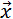

<h1 class="title topictitle1" id="ariaid-title1">SVMDense (ML Engine)</h1>

The SVMDense function takes training data in dense format and outputs a predictive model in binary format, which is input to the functions <a href="vxh1558534233309.md#vca1507910662998">SVMDensePredict (ML Engine)</a> and <a href="tyx1558534390212.md#tbs1507909904503">SVMDenseSummary (ML Engine)</a>.

<h2 class="title topictitle2" id="ariaid-title2">SVMDense Syntax</h2>

<h3 class="title sectiontitle">Version 1.8</h3><pre class="pre codeblock" xml:space="preserve"><code>SELECT * FROM SVMDense (
  ON { <var class="keyword varname">table</var> | <var class="keyword varname">view</var> | (<var class="keyword varname">query</var>) } AS InputTable
  OUT TABLE ModelTable (<var class="keyword varname">model_table</var>)
  USING
  IDColumn ('<var class="keyword varname">id_column</var>')
  TargetColumns ({ '<var class="keyword varname">target_column</var>' | <var class="keyword varname">target_column_range</var> }[,...])
  [ KernelFunction ({ 'linear' | 'polynomial' | 'rbf' | 'sigmoid' }) ]
  [ Gamma (<var class="keyword varname">gamma</var>) ]
  [ Constant (<var class="keyword varname">c</var>) ]
  [ Degree (<var class="keyword varname">d</var>) ]
  [ SubspaceDimension (<var class="keyword varname">subspace_dimension</var>) ]
  [ HashBits (<var class="keyword varname">hash_bits</var>) ]
  ResponseColumn ('<var class="keyword varname">response_column</var>')
  [ RegularizationLambda (<var class="keyword varname">lambda</var>) ]
  [ Bias (<var class="keyword varname">bias</var>) ]
  [ ClassWeights ('<var class="keyword varname">class</var>:<var class="keyword varname">weight</var>' [,...]) ]
  [ MaxIterNum (<var class="keyword varname">max_iteration_number</var>) ]
  [ StopThreshold (<var class="keyword varname">threshold</var>) ]
  [ Seed (<var class="keyword varname">seed</var>) ]
  [ ForceMapReduce <b>{'true'|'t'|'yes'|'y'|'1'|'false'|'f'|'no'|'n'|'0'}</b> ]
) AS <var class="keyword varname">alias</var>;</code></pre>

<b>Related Information</b>

<ul class="linklist linklist relinfo">
<a href="ndv1557782188375.md">Column Specification Syntax Elements</a>
</ul>

<h2 class="title topictitle2" id="ariaid-title3">SVMDense Syntax Elements</h2>

<dl class="dl parml"><dt class="dt pt dlterm">ModelTable</dt><dd class="dd pd">Specify the name of the model table (which must not exist).</dd><dt class="dt pt dlterm">IDColumn</dt><dd class="dd pd">Specify the name of the InputTable column that contains the identifiers of the training samples.</dd><dt class="dt pt dlterm">TargetColumns</dt><dd class="dd pd">Specify the names of the InputTable columns that contain the attributes, which must have numeric data types.</dd><dt class="dt pt dlterm">KernelFunction</dt><dd class="dd pd">[Optional] Specify the kernel function that the SVMDense function uses to compute the hash function:

<table cellpadding="4" cellspacing="0" summary="" id="sry1507911814699__table_ppz_kxy_fdb" class="table" frame="border" border="1" rules="all">

<colgroup span="1"><col style="width:50%" span="1"></col><col style="width:50%" span="1"></col></colgroup><thead class="thead" style="text-align:left;"><tr class="row"><th class="entry cellrowborder" style="vertical-align:top;" id="d75500e208" rowspan="1" colspan="1">Option</th><th class="entry cellrowborder" style="vertical-align:top;" id="d75500e210" rowspan="1" colspan="1">Description</th></tr></thead><tbody class="tbody"><tr class="row"><td class="entry cellrowborder" style="vertical-align:top;" headers="d75500e208" rowspan="1" colspan="1"><code class="ph codeph">'linear'</code> (Default)</td><td class="entry cellrowborder" style="vertical-align:top;" headers="d75500e210" rowspan="1" colspan="1">SVMDense uses a Pegasos algorithm to solve linear SVM.</td></tr><tr class="row"><td class="entry cellrowborder" style="vertical-align:top;" headers="d75500e208" rowspan="1" colspan="1"><code class="ph codeph">'polynomial'</code></td><td class="entry cellrowborder" style="vertical-align:top;" headers="d75500e210" rowspan="1" colspan="1">SVMDense uses a Hash-SVM algorithm.

Formula for polynomial:

γ(<var class="keyword varname">u</var><var class="keyword varname">T</var><var class="keyword varname">v</var> + <var class="keyword varname">c</var>)<var class="keyword varname">d</var>

When SVMDense uses a Hash-SVM algorithm, each sample is represented by compact hash bits, over which an inner product is defined to serve as the surrogate of the original nonlinear kernels.
</td></tr><tr class="row"><td class="entry cellrowborder" style="vertical-align:top;" headers="d75500e208" rowspan="1" colspan="1"><code class="ph codeph">'rbf'</code></td><td class="entry cellrowborder" style="vertical-align:top;" headers="d75500e210" rowspan="1" colspan="1">SVMDense uses a Hash-SVM algorithm.

Formula for RBF:

exp (-γ * | | <var class="keyword varname">x</var> - <var class="keyword varname">x'</var> | |2)
</td></tr><tr class="row"><td class="entry cellrowborder" style="vertical-align:top;" headers="d75500e208" rowspan="1" colspan="1"><code class="ph codeph">'sigmoid'</code></td><td class="entry cellrowborder" style="vertical-align:top;" headers="d75500e210" rowspan="1" colspan="1">SVMDense uses a Hash-SVM algorithm.

Formula for sigmoid:

tanh (γ * <var class="keyword varname">u</var><var class="keyword varname">T</var><var class="keyword varname">v</var> + <var class="keyword varname">c</var>)
</td></tr></tbody></table>
</dd><dt class="dt pt dlterm">Gamma</dt><dd class="dd pd">[Optional] Use only when KernelFunction is 'polynomial', 'RBF', or 'sigmoid'. Specify γ in the formula. The <var class="keyword varname">gamma</var> must be a positive DOUBLE value.</dd><dd class="dd pd ddexpand">Default: 1.0</dd><dt class="dt pt dlterm">Constant</dt><dd class="dd pd">[Optional] Use only when KernelFunction is 'polynomial' or 'sigmoid'. Specify <var class="keyword varname">c</var> in the formula. The <var class="keyword varname">c</var> must be a DOUBLE value. If KernelFunction is polynomial, the minimum <var class="keyword varname">c</var> value is 0.0.</dd><dd class="dd pd ddexpand">Default: 1.0</dd><dt class="dt pt dlterm">Degree</dt><dd class="dd pd">[Optional] Use only when KernelFunction is 'polynomial'. Specify <var class="keyword varname">d</var> in the formula. The <var class="keyword varname">d</var> must be a positive INTEGER.</dd><dd class="dd pd ddexpand">Default: 2</dd><dt class="dt pt dlterm">SubspaceDimension</dt><dd class="dd pd">[Optional] Use only when KernelFunction is 'polynomial', 'sigmoid', or 'rbf'. Specify the random subspace dimension of the basis matrix V obtained by the Gram-Schmidt process. The <var class="keyword varname">subspace_dimension</var> must be in the range [1, 2048]. Because the Gram-Schmidt process cannot be parallelized, this dimension cannot be too large. Accuracy increases with higher <var class="keyword varname">subspace_dimension</var> values, but computation costs also increase.</dd><dd class="dd pd ddexpand">Default: 256</dd><dt class="dt pt dlterm">HashBits</dt><dd class="dd pd">[Optional] Use only when KernelFunction is 'polynomial', 'RBF', or 'sigmoid'. Specify the number of compact hash bits that represent a data point. The <var class="keyword varname">hash_bits</var> must be in the range [8, 8192]. Accuracy increases with higher <var class="keyword varname">hash_bits</var> values, but computation costs also increase.</dd><dd class="dd pd ddexpand">Default: 256</dd><dt class="dt pt dlterm">ResponseColumn</dt><dd class="dd pd">Specify the name of the InputTable column that contains the class identifiers of the samples. The <var class="keyword varname">response_column</var> must have an integer or string data type.</dd><dt class="dt pt dlterm">RegularizationLambda</dt><dd class="dd pd">[Optional] Specify the regularization parameter λ in the SVM soft-margin loss function:

  </img>  
</dd><dd class="dd pd ddexpand">The <var class="keyword varname">lambda</var> must be greater than 0.0.</dd><dd class="dd pd ddexpand">Default: 1.0</dd><dt class="dt pt dlterm">Bias</dt><dd class="dd pd">[Optional] Specify whether to add another dimension containing the bias value <var class="keyword varname">b</var>. The <var class="keyword varname">bias</var> must be nonnegative. If <var class="keyword varname">bias</var> is greater than 0, the function converts each sample </img> in the training set to ( </img> , b). Use this syntax element when not all samples center at 0.</dd><dd class="dd pd ddexpand">Default: 0.0</dd><dt class="dt pt dlterm">ClassWeights</dt><dd class="dd pd">[Optional] Specify the weights for different classes. If you specify a <var class="keyword varname">weight</var> for a <var class="keyword varname">class</var>, the function multiplies the value of <var class="keyword varname">lambda</var> used for that class by <var class="keyword varname">weight</var>. A <var class="keyword varname">weight</var> larger than 1 often increases the accuracy of <var class="keyword varname">class</var>; however, it may decrease global accuracy.</dd><dd class="dd pd ddexpand">Default behavior: The function assigns weight 1.0 to any class not assigned a weight in this syntax element.</dd><dt class="dt pt dlterm">MaxIterNum</dt><dd class="dd pd">[Optional] Specify the maximum number of steps of the training process. One step means that the trainer sees each sample once. The <var class="keyword varname">max_iteration_number</var> must be in the range (0, 10000].</dd><dd class="dd pd ddexpand">Default: 100</dd><dt class="dt pt dlterm">StopThreshold</dt><dd class="dd pd">[Optional] Specify the termination criterion: When the difference between the values of the loss function in two sequential iterations is less than this <var class="keyword varname">threshold</var>, the function stops. The <var class="keyword varname">threshold</var> must be greater than 0.0.</dd><dd class="dd pd ddexpand">Default: 0.01</dd><dt class="dt pt dlterm">Seed</dt><dd class="dd pd">[Optional] Specify the random seed the algorithm uses for repeatable results. The algorithm uses the seed to order the training set randomly and consistently. The <var class="keyword varname">seed</var> must be a nonnegative LONG value.
<b>Note</b>
 For repeatable results, use both the Seed and UniqueID syntax elements. For more information, see <a href="qym1549987102806.md">Nondeterministic Results and UniqueID Syntax Element</a>.

</dd><dd class="dd pd ddexpand">Default: 0</dd><dt class="dt pt dlterm">ForceMapReduce</dt><dd class="dd pd">[Optional with KernelFunction ('linear'), redundant otherwise.] Specify whether to run a lighter version of the function for faster results. Has no effect without KernelFunction ('linear').</dd><dd class="dd pd ddexpand">Default: 'false' if InputTable has fewer than one million data points, 'true' otherwise</dd></dl>

