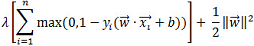

<html><head></head><body>
<h1 class="title topictitle1" id="ariaid-title1">SVMSparse (ML Engine)</h1>

The SVMSparse function takes training data (in sparse format) and outputs a predictive model in binary format, which is input to the functions <a href="wzb1541537305621.md#guu1507914686828">SVMSparsePredict_MLE (ML Engine)</a> and <a href="ity1558533483914.md#igx1507913009828">SVMSparseSummary (ML Engine)</a>.

<h2 class="title topictitle2" id="ariaid-title2">SVMSparse Syntax</h2>

<h3 class="title sectiontitle">Version 1.7</h3><pre class="pre codeblock" xml:space="preserve"><code>SELECT * FROM SVMSparse (
  ON { <var class="keyword varname">table</var> | <var class="keyword varname">view</var> | (<var class="keyword varname">query</var>) } AS InputTable
  OUT TABLE ModelTable (<var class="keyword varname">model_table</var>)
  USING
  IDColumn ('<var class="keyword varname">id_column</var>')
  AttributeNameColumn ('<var class="keyword varname">attribute_name_column</var>')
  AttributeValueColumn ('<var class="keyword varname">attribute_value_column</var>')
  ResponseColumn ('<var class="keyword varname">response_column</var>')
  [ RegularizationLambda (<var class="keyword varname">lambda</var>) ]
  [ Bias (<var class="keyword varname">bias</var>) ]
  [ HashProjection (<b>{'true'|'t'|'yes'|'y'|'1'|'false'|'f'|'no'|'n'|'0'}</b>) ]
  [ HashBuckets (<var class="keyword varname">buckets_number</var>) ]
  [ ClassWeights ('<var class="keyword varname">class</var>:<var class="keyword varname">weight</var>' [,...]) ]
  [ MaxIterNum (<var class="keyword varname">max_iteration_number</var>) ]
  [ StopThreshold (<var class="keyword varname">threshold</var>) ]
  [ Seed (<var class="keyword varname">seed</var>) ]
  [ ForceMapReduce <b>{'true'|'t'|'yes'|'y'|'1'|'false'|'f'|'no'|'n'|'0'}</b>
) AS <var class="keyword varname">alias</var>;</code></pre>

<h2 class="title topictitle2" id="ariaid-title3">SVMSparse Syntax Elements</h2>

<dl class="dl parml"><dt class="dt pt dlterm">ModelTable</dt><dd class="dd pd">Specify the name of the model table (which must not exist).</dd><dt class="dt pt dlterm">IDColumn</dt><dd class="dd pd">Specify the name of the InputTable column that contains the identifiers of the training samples.</dd><dt class="dt pt dlterm">AttributeNameColumn</dt><dd class="dd pd">Specify the name of the InputTable column that contains the attributes of the samples.</dd><dt class="dt pt dlterm">AttributeValueColumn</dt><dd class="dd pd">Specify the name of the InputTable column that contains the attribute values.
<b>Note</b>
In earlier versions, AttributeValueColumn was optional. The default value of each attribute was 1.

</dd><dt class="dt pt dlterm">ResponseColumn</dt><dd class="dd pd">Specify the name of the InputTable column that contains the classes of the samples.</dd><dt class="dt pt dlterm">RegularizationLambda</dt><dd class="dd pd">[Optional] Specify the regularization parameter λ in the SVM soft-margin loss function:

  </img>  
</dd><dd class="dd pd ddexpand">The <var class="keyword varname">lambda</var> must be greater than 0.0.</dd><dd class="dd pd ddexpand">Default: 1.0</dd><dt class="dt pt dlterm">Bias</dt><dd class="dd pd">[Optional] Specify whether to add another dimension containing the bias value <var class="keyword varname">b</var>. The <var class="keyword varname">bias</var> must be nonnegative. If <var class="keyword varname">bias</var> is greater than 0, the function converts each sample </img> in the training set to (</img> , b). Use this syntax element when not all samples center at 0.</dd><dd class="dd pd ddexpand">Default: 0.0</dd><dt class="dt pt dlterm">HashProjection</dt><dd class="dd pd">[Optional] Specify whether to use hash projection on attributes. Hash projection can accelerate processing speed but can slightly decrease accuracy.</dd><dd class="dd pd ddexpand">You must use hash projection if the data set has more features than fit into memory.</dd><dd class="dd pd ddexpand">Default: 'false'</dd><dt class="dt pt dlterm">HashBuckets</dt><dd class="dd pd">[Optional] [Valid only with HashProjection ('true').] Specify the number of buckets for hash projection. Usually, the function can determine the appropriate number of buckets from the scale of the input data set. However, if the data set has many features, you might have to specify <var class="keyword varname">buckets_number</var> to accelerate the function.</dd><dd class="dd pd ddexpand">Default behavior: The function determines the appropriate number of buckets from the scale of the input data set.</dd><dt class="dt pt dlterm">ClassWeights</dt><dd class="dd pd">[Optional] Specify the weights for different classes. If you specify a <var class="keyword varname">weight</var> for a <var class="keyword varname">class</var>, the function multiplies the value of <var class="keyword varname">lambda</var> used for that class by <var class="keyword varname">weight</var>. A <var class="keyword varname">weight</var> larger than 1 often increases the accuracy of <var class="keyword varname">class</var>; however, it may decrease global accuracy.</dd><dd class="dd pd ddexpand">Default behavior: The function assigns weight 1.0 to any class not assigned a weight in this syntax element.</dd><dt class="dt pt dlterm">MaxIterNum</dt><dd class="dd pd">[Optional] Specify the maximum number of steps of the training process. One step means that the trainer sees each sample once. The <var class="keyword varname">max_iteration_number</var> must be in the range (0, 10000].</dd><dd class="dd pd ddexpand">Default: 100</dd><dt class="dt pt dlterm">StopThreshold</dt><dd class="dd pd">[Optional] Specify the termination criterion: When the difference between the values of the loss function in two sequential iterations is less than this <var class="keyword varname">threshold</var>, the function stops. The <var class="keyword varname">threshold</var> must be greater than 0.0.</dd><dd class="dd pd ddexpand">Default: 0.01</dd><dt class="dt pt dlterm">Seed</dt><dd class="dd pd">[Optional] Specify the random seed the algorithm uses for repeatable results. The algorithm uses the seed to order the training set randomly and consistently. The <var class="keyword varname">seed</var> must be a nonnegative LONG value.
<b>Note</b>
 For repeatable results, use both the Seed and UniqueID syntax elements. For more information, see <a href="qym1549987102806.md">Nondeterministic Results and UniqueID Syntax Element</a>.

</dd><dd class="dd pd ddexpand">Default: 0</dd><dt class="dt pt dlterm">ForceMapReduce</dt><dd class="dd pd">[Optional] Specify whether to run a lighter version of the function for faster results.</dd><dd class="dd pd ddexpand">Default: 'false' if InputTable has fewer than one million data points, 'true' otherwise</dd></dl>

</body></html>
