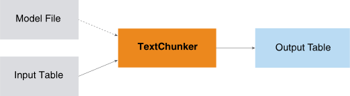

<h1 class="title topictitle1" id="ariaid-title1">TextChunker (ML Engine)</h1>

The TextChunker function divides text into phrases and assigns each phrase
			a tag that identifies its type.

  </img>  

<dfn class="term">Text chunking</dfn> (also called <dfn class="term">shallow parsing</dfn>) divides text into phrases in such a way that syntactically related words become members of the same phrase. Phrases do not overlap; that is, a word is a member of only one chunk.

For example, the sentence "He reckons the current account deficit will narrow to only # 1.8 billion in September ." can be divided as follows, with brackets delimiting phrases:

[NP He] [VP reckons] [NP the current account deficit] [VP will narrow] [PP to] [NP only # 1.8 billion] [PP in] [NP September]

After each opening bracket is a tag that identifies the chunk type (NP, VP, and so on). For information about chunk types, see <a href="hyk1507566114056.md">TextChunker Output</a>.

For more information about text chunking, see:
<ul class="ul" id="sct1507564726632__ul_yrg_51k_mbb">
<li class="li">Erik F. Tjong Kim Sang and Sabine Buchholz, Introduction to the CoNLL-2000 Shared Task: Chunking. In: <cite class="cite">Proceedings of CoNLL-2000 and LLL-2000</cite>, Lisbon, Portugal, 2000.</li>
<li class="li">Fei Sha and Fernando Pereira, Shallow Parsing with Conditional Random Fields. [2003]</li></ul>

TextChunker uses files that are preinstalled on <b>ML Engine</b>. For details, see <a href="tzu1557778477026.md">Preinstalled Files That Functions Use</a>.

<h2 class="title topictitle2" id="ariaid-title2">TextChunker Syntax</h2>

<h3 class="title sectiontitle">Version 1.6</h3><pre class="pre codeblock" xml:space="preserve"><code>SELECT * FROM TextChunker (
  ON { <var class="keyword varname">table</var> | <var class="keyword varname">view</var> | (<var class="keyword varname">query</var>) } PARTITION BY <var class="keyword varname">partition_key</var> ORDER BY <var class="keyword varname">word_sn</var>
  USING
  WordColumn ('<var class="keyword varname">word_column</var>')
  POSColumn ('<var class="keyword varname">pos_tag_column</var>')
) AS <var class="keyword varname">alias</var>;</code></pre>

The <var class="keyword varname">input_table</var> is output table of the <a href="pxt1558535687028.md#pwz1507564974181">POSTagger (ML Engine)</a> function, which contains the columns <var class="keyword varname">partition_key</var> and <var class="keyword varname">word_sn</var>.

<h2 class="title topictitle2" id="ariaid-title3">TextChunker Syntax Elements</h2>

<dl class="dl parml"><dt class="dt pt dlterm">WordColumn</dt><dd class="dd pd">Specify the name of the input table column that contains the words to chunk into phrases. Typically, this is the word column of the output table of the POSTagger function (described in <a href="pqx1507566419673.md">POSTagger Output</a>).</dd><dt class="dt pt dlterm">POSColumn</dt><dd class="dd pd">Specify the name of the input table column the part-of-speech (POS) tag of words. Typically, this is the pos_tag column of the output table of the POSTagger function (described in "POSTagger Output").</dd></dl>

