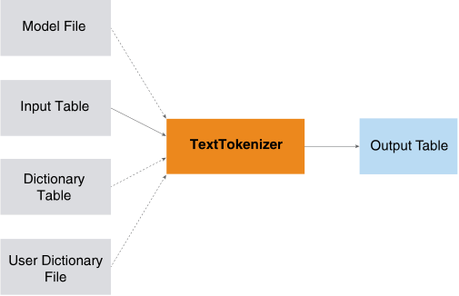

<html><head></head><body>
<h1 class="title topictitle1" id="ariaid-title1">TextTokenizer (ML Engine)</h1>

The TextTokenizer function extracts English, Chinese, or Japanese tokens
			from text. Examples of tokens are words, punctuation marks, and numbers. Tokenization is
			the first step of many types of text analysis.

  </img>  

TextTokenizer uses files that are preinstalled on <b>ML Engine</b>. For details, see <a href="tzu1557778477026.md">Preinstalled Files That Functions Use</a>.

<h2 class="title topictitle2" id="ariaid-title2">TextTokenizer Syntax</h2>

<h3 class="title sectiontitle">Version 3.8</h3><pre class="pre codeblock" xml:space="preserve"><code>SELECT * FROM TextTokenizer (
  ON { <var class="keyword varname">table</var> | <var class="keyword varname">view</var> | (<var class="keyword varname">query</var>) } PARTITION BY ANY
  [ ON <var class="keyword varname">dict_table</var> AS Dict DIMENSION ]
  USING
  TextColumn ('<var class="keyword varname">text_column</var>') ]
  [ InputLanguage ({ 'en' | 'zh_CN' | 'zh_TW' | 'jp' | }) ]
  [ InputModelFile ('<var class="keyword varname">input_model_file</var>') ]
  [ OutputDelimiter ('<var class="keyword varname">delimiter</var>') ]
  [ OutputByWord (<b>{'true'|'t'|'yes'|'y'|'1'|'false'|'f'|'no'|'n'|'0'}</b>) ]
  <code class="ph codeph">[ Accumulate ({ '<var class="keyword varname">accumulate_column</var>' | <var class="keyword varname">accumulate_column_range</var> }[,...]) ]</code>
  [ UserDictionaryFile ('<var class="keyword varname">user_dictionary_file</var>') ]
) AS <var class="keyword varname">alias</var>;</code></pre>

<b>Related Information</b>

<ul class="linklist linklist relinfo">
<a href="ndv1557782188375.md">Column Specification Syntax Elements</a>
</ul>

<h2 class="title topictitle2" id="ariaid-title3">TextTokenizer Syntax Elements</h2>

<dl class="dl parml"><dt class="dt pt dlterm">TextColumn</dt><dd class="dd pd">Specify the name of the InputTable column that contains the text to tokenize.</dd><dt class="dt pt dlterm">InputLanguage</dt><dd class="dd pd">[Optional] Specify the language of the text in <var class="keyword varname">text_column</var>:

<table cellpadding="4" cellspacing="0" summary="" id="wht1507574656875__table_x3n_flz_fdb" class="table" frame="border" border="1" rules="all">

<colgroup span="1"><col style="width:50%" span="1"></col><col style="width:50%" span="1"></col></colgroup><thead class="thead" style="text-align:left;"><tr class="row"><th class="entry cellrowborder" style="vertical-align:top;" id="d64721e179" rowspan="1" colspan="1">Option</th><th class="entry cellrowborder" style="vertical-align:top;" id="d64721e181" rowspan="1" colspan="1">Description</th></tr></thead><tbody class="tbody"><tr class="row"><td class="entry cellrowborder" style="vertical-align:top;" headers="d64721e179" rowspan="1" colspan="1"><code class="ph codeph">'en'</code> (Default)</td><td class="entry cellrowborder" style="vertical-align:top;" headers="d64721e181" rowspan="1" colspan="1">English</td></tr><tr class="row"><td class="entry cellrowborder" style="vertical-align:top;" headers="d64721e179" rowspan="1" colspan="1"><code class="ph codeph">'zh_CN'</code></td><td class="entry cellrowborder" style="vertical-align:top;" headers="d64721e181" rowspan="1" colspan="1">Simplified Chinese</td></tr><tr class="row"><td class="entry cellrowborder" style="vertical-align:top;" headers="d64721e179" rowspan="1" colspan="1"><code class="ph codeph">'zh_TW'</code></td><td class="entry cellrowborder" style="vertical-align:top;" headers="d64721e181" rowspan="1" colspan="1">Traditional Chinese</td></tr><tr class="row"><td class="entry cellrowborder" style="vertical-align:top;" headers="d64721e179" rowspan="1" colspan="1"><code class="ph codeph">'jp'</code></td><td class="entry cellrowborder" style="vertical-align:top;" headers="d64721e181" rowspan="1" colspan="1">Japanese</td></tr></tbody></table>
</dd><dt class="dt pt dlterm">InputModelFile</dt><dd class="dd pd">[Optional] Specify the name of model file that the function uses for tokenizing. The model must be a conditional random-fields model and <var class="keyword varname">input_model_file</var> must already be installed on <b>ML Engine</b>. If you omit this syntax element, or if <var class="keyword varname">input_model_file</var> is not installed, then the function uses white spaces to separate English words and an embedded dictionary to tokenize Chinese text.</dd><dd class="dd pd ddexpand">If you specify <code class="ph codeph">InputLanguage('jp')</code>, the function ignores this syntax element.</dd><dt class="dt pt dlterm">OutputDelimiter</dt><dd class="dd pd">[Optional] Specify the delimiter, a string, for separating tokens in the output.</dd><dd class="dd pd ddexpand">Default: '/' (slash)</dd><dt class="dt pt dlterm">OutputByWord</dt><dd class="dd pd">Specify whether to output one token in each row.</dd><dd class="dd pd ddexpand">Default: 'false' (Output one line of text in each row.)</dd><dt class="dt pt dlterm">Accumulate</dt><dd class="dd pd">[Optional] Specify the names of the InputTable columns to copy to the output table.</dd><dt class="dt pt dlterm">UserDictionaryFile</dt><dd class="dd pd">[Optional] Specify the name of the user dictionary to use to correct results specified by the model. If you specify both this syntax element and a dictionary table (Dict), then the function uses the union of <var class="keyword varname">user_dictionary_file</var> and Dict as its dictionary. <a href="cyf1542663565904.md">TextTokenizer Input</a> describes the format of <var class="keyword varname">user_dictionary_file</var> and Dict.</dd><dd class="dd pd ddexpand">If the function finds more than one matched term, it selects the longest term for the first match.</dd></dl>

</body></html>
