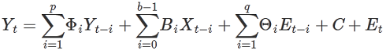

<html><head></head><body>
<h1 class="title topictitle1" id="ariaid-title1">VARMAX (ML Engine)</h1>

VARMAX (Vector Autoregressive Moving Average model with eXogenous variables) extends the ARMA/ARIMA model in two ways:

<ul class="ul" id="klg1507052716326__ul_nhg_5dl_p1b">
<li class="li">To work with time series with multiple response variables (vector time series).</li>
<li class="li">To work with exogenous variables, or variables that are independent of the other variables in the system.</li></ul>

The model includes both the dynamic relationship between the multiple response variables and the relationship between the dependent and independent variables.

<h2 class="title sectiontitle">Nonseasonal VARMAX Model</h2>

This formula represents a nonseasonal VARMAX model:

  </img>  

<table cellpadding="4" cellspacing="0" summary="" id="klg1507052716326__table_mqq_pj4_zdb" class="table" frame="border" border="1" rules="all">

<colgroup span="1"><col style="width:50%" span="1"></col><col style="width:50%" span="1"></col></colgroup><thead class="thead" style="text-align:left;"><tr class="row"><th class="entry cellrowborder" style="vertical-align:top;" id="d91881e56" rowspan="1" colspan="1">Variable</th><th class="entry cellrowborder" style="vertical-align:top;" id="d91881e58" rowspan="1" colspan="1">Description</th></tr></thead><tbody class="tbody"><tr class="row"><td class="entry cellrowborder" style="vertical-align:top;" headers="d91881e56" rowspan="1" colspan="1"><var class="keyword varname">Y</var><var class="keyword varname">t</var></td><td class="entry cellrowborder" style="vertical-align:top;" headers="d91881e58" rowspan="1" colspan="1">Time series made stationary. First term is autoregressive component, second term is exogenous component, third term is moving average component, the fourth term (<var class="keyword varname">C</var>) is vector of constants, and fifth term (<var class="keyword varname">E</var><var class="keyword varname">t</var>) is vector of residual errors.</td></tr><tr class="row"><td class="entry cellrowborder" style="vertical-align:top;" headers="d91881e56" rowspan="1" colspan="1"><var class="keyword varname">Y</var><var class="keyword varname">t</var></td><td class="entry cellrowborder" style="vertical-align:top;" headers="d91881e58" rowspan="1" colspan="1">Vector of <var class="keyword varname">n</var> response variables.</td></tr><tr class="row"><td class="entry cellrowborder" style="vertical-align:top;" headers="d91881e56" rowspan="1" colspan="1"><var class="keyword varname">X</var><var class="keyword varname">t</var></td><td class="entry cellrowborder" style="vertical-align:top;" headers="d91881e58" rowspan="1" colspan="1">Vector of <var class="keyword varname">m</var> exogenous variables.</td></tr><tr class="row"><td class="entry cellrowborder" style="vertical-align:top;" headers="d91881e56" rowspan="1" colspan="1"><var class="keyword varname">p</var></td><td class="entry cellrowborder" style="vertical-align:top;" headers="d91881e58" rowspan="1" colspan="1">Number of previous periods of endogenous variables included in model.</td></tr><tr class="row"><td class="entry cellrowborder" style="vertical-align:top;" headers="d91881e56" rowspan="1" colspan="1"><var class="keyword varname">q</var></td><td class="entry cellrowborder" style="vertical-align:top;" headers="d91881e58" rowspan="1" colspan="1">Number of previous periods included in moving average.</td></tr><tr class="row"><td class="entry cellrowborder" style="vertical-align:top;" headers="d91881e56" rowspan="1" colspan="1"><var class="keyword varname">b</var></td><td class="entry cellrowborder" style="vertical-align:top;" headers="d91881e58" rowspan="1" colspan="1">Number of previous periods of exogenous variables included.</td></tr><tr class="row"><td class="entry cellrowborder" style="vertical-align:top;" headers="d91881e56" rowspan="1" colspan="1">Φ<var class="keyword varname">i</var></td><td class="entry cellrowborder" style="vertical-align:top;" headers="d91881e58" rowspan="1" colspan="1"><var class="keyword varname">n</var> * <var class="keyword varname">n</var> matrix of autoregressive parameters.</td></tr><tr class="row"><td class="entry cellrowborder" style="vertical-align:top;" headers="d91881e56" rowspan="1" colspan="1"><var class="keyword varname">B</var><var class="keyword varname">i</var></td><td class="entry cellrowborder" style="vertical-align:top;" headers="d91881e58" rowspan="1" colspan="1"><var class="keyword varname">n</var> * <var class="keyword varname">m</var> matrix of exogenous variable parameters.</td></tr><tr class="row"><td class="entry cellrowborder" style="vertical-align:top;" headers="d91881e56" rowspan="1" colspan="1">Θ<var class="keyword varname">i</var></td><td class="entry cellrowborder" style="vertical-align:top;" headers="d91881e58" rowspan="1" colspan="1"><var class="keyword varname">n</var> * <var class="keyword varname">n</var> matrix of moving average parameters.</td></tr><tr class="row"><td class="entry cellrowborder" style="vertical-align:top;" headers="d91881e56" rowspan="1" colspan="1"><var class="keyword varname">E</var><var class="keyword varname">t</var></td><td class="entry cellrowborder" style="vertical-align:top;" headers="d91881e58" rowspan="1" colspan="1">Difference between actual and predicted value of <var class="keyword varname">Y</var><var class="keyword varname">t</var>, (<var class="keyword varname">Y</var><var class="keyword varname">t</var> - Ŷ<var class="keyword varname">t</var>).</td></tr></tbody></table>

<h2 class="title sectiontitle">Seasonal VARMAX Model</h2>

This formula represents a seasonal VARMAX model:

(1 - Φ1Back - … - Φ<var class="keyword varname">p</var>Back<var class="keyword varname">p</var>)(1 - Φ1Back<var class="keyword varname">m</var> - … - Φ<var class="keyword varname">sp</var>Back<var class="keyword varname">m*sp</var>)(1 - Back)<var class="keyword varname">d</var>(1 - Back<var class="keyword varname">m</var>)<var class="keyword varname">sd</var>(<var class="keyword varname">Y</var><var class="keyword varname">t</var>) =

<var class="keyword varname">C</var> + (1 + Θ1Back + … + Θ<var class="keyword varname">q</var>Back<var class="keyword varname">q</var>) (1 + Θ1Back<var class="keyword varname">m</var> + … + Θ<var class="keyword varname">sq</var>Back<var class="keyword varname">m*sq</var>) <var class="keyword varname">E</var><var class="keyword varname">t</var> + 

 (<var class="keyword varname">B</var>1 + <var class="keyword varname">B</var>2Back + … + <var class="keyword varname">B</var><var class="keyword varname">b</var>-1Back<var class="keyword varname">b</var>) (1 - Back)<var class="keyword varname">d</var> (1 - Back<var class="keyword varname">m</var>)<var class="keyword varname">sd</var><var class="keyword varname">X</var><var class="keyword varname">t</var>

Variables are as in the nonseasonal VARMAX Model and the following table.

<table cellpadding="4" cellspacing="0" summary="" id="klg1507052716326__table_tpx_kl4_zdb" class="table" frame="border" border="1" rules="all">

<colgroup span="1"><col style="width:50%" span="1"></col><col style="width:50%" span="1"></col></colgroup><thead class="thead" style="text-align:left;"><tr class="row"><th class="entry cellrowborder" style="vertical-align:top;" id="d91881e326" rowspan="1" colspan="1">Variable</th><th class="entry cellrowborder" style="vertical-align:top;" id="d91881e328" rowspan="1" colspan="1">Description</th></tr></thead><tbody class="tbody"><tr class="row"><td class="entry cellrowborder" style="vertical-align:top;" headers="d91881e326" rowspan="1" colspan="1">Back</td><td class="entry cellrowborder" style="vertical-align:top;" headers="d91881e328" rowspan="1" colspan="1">Back-shift operator, that is:

 Back(<var class="keyword varname">y</var><var class="keyword varname">t</var>) = <var class="keyword varname">y</var><var class="keyword varname">t</var>-1
</td></tr><tr class="row"><td class="entry cellrowborder" style="vertical-align:top;" headers="d91881e326" rowspan="1" colspan="1"><var class="keyword varname">m</var></td><td class="entry cellrowborder" style="vertical-align:top;" headers="d91881e328" rowspan="1" colspan="1">Number of periods in each season.</td></tr><tr class="row"><td class="entry cellrowborder" style="vertical-align:top;" headers="d91881e326" rowspan="1" colspan="1"><var class="keyword varname">d</var></td><td class="entry cellrowborder" style="vertical-align:top;" headers="d91881e328" rowspan="1" colspan="1">Number of differencing steps performed to stationarize time series.</td></tr><tr class="row"><td class="entry cellrowborder" style="vertical-align:top;" headers="d91881e326" rowspan="1" colspan="1"><var class="keyword varname">sp</var></td><td class="entry cellrowborder" style="vertical-align:top;" headers="d91881e328" rowspan="1" colspan="1">Seasonal parameter corresponding to <var class="keyword varname">p</var>.</td></tr><tr class="row"><td class="entry cellrowborder" style="vertical-align:top;" headers="d91881e326" rowspan="1" colspan="1"><var class="keyword varname">sq</var></td><td class="entry cellrowborder" style="vertical-align:top;" headers="d91881e328" rowspan="1" colspan="1">Seasonal parameter corresponding to <var class="keyword varname">q</var>.</td></tr><tr class="row"><td class="entry cellrowborder" style="vertical-align:top;" headers="d91881e326" rowspan="1" colspan="1"><var class="keyword varname">sd</var></td><td class="entry cellrowborder" style="vertical-align:top;" headers="d91881e328" rowspan="1" colspan="1">Seasonal parameter corresponding to <var class="keyword varname">d</var>.</td></tr></tbody></table>

<h2 class="title sectiontitle">Difference between VARMAX and R Function VARMA</h2>

The results of the VARMAX function and the VARMA function in the R package MTS might not match exactly, because VARMA applies a boundary to the numerical optimization and VARMAX does not. Also, the default optimization method (the Method syntax element) is different for VARMA and VARMAX.

<h2 class="title topictitle2" id="ariaid-title2">VARMAX Syntax</h2>

<h3 class="title sectiontitle">Version 1.14</h3><pre class="pre codeblock" xml:space="preserve"><code>SELECT * FROM VARMAX (
  ON <var class="keyword varname">input_table</var> [ AS InputTable ]
    PARTITION BY { 1 | <var class="keyword varname">partition_column</var> [,...] } ORDER BY <var class="keyword varname">time_stamp_column</var> [,...]
  { ON <var class="keyword varname">orders_table</var> AS Orders PARTITION BY { 1 | <var class="keyword varname">partition_column</var> [,...] } |
    OrderP (<var class="keyword varname">p</var>) OrderD (<var class="keyword varname">d</var>) OrderQ (<var class="keyword varname">q</var>) |
    PDQ ('<var class="keyword varname">p</var>, <var class="keyword varname">d</var>, <var class="keyword varname">q</var>')
  }
  USING
  TargetColumns ('<var class="keyword varname">target_column</var>' [,...])
  [ ExogenousColumns ('<var class="keyword varname">exogenous_column</var>' [,...]) ]
  [ PartitionColumns ('<var class="keyword varname">partition_column</var>' [,...]) ]
  [ { SeasonalOrderP (<var class="keyword varname">sp</var>) SeasonalOrderD (<var class="keyword varname">sd</var>) SeasonalOrderQ (<var class="keyword varname">sq</var>) |
      SeasonalPDQ ('<var class="keyword varname">sp</var>, <var class="keyword varname">sd</var>, <var class="keyword varname">sq</var>')
    } Period (<var class="keyword varname">period</var>)
  ]
  [ ExogenousOrder ('<var class="keyword varname">b</var>') ]
  [ Lag (<var class="keyword varname">lag</var>) ]
  [ IncludeMean (<b>{'true'|'t'|'yes'|'y'|'1'|'false'|'f'|'no'|'n'|'0'}</b>) ]
  [ IncludeDrift (<b>{'true'|'t'|'yes'|'y'|'1'|'false'|'f'|'no'|'n'|'0'}</b>)]
  [ MaxIterNum (<var class="keyword varname">max_iteration_number</var>) ]
  [ StepAhead (<var class="keyword varname">predict_steps</var>) ]
  [ FitMethod ({ 'SSE' | 'ML' }) ]
) AS <var class="keyword varname">alias</var>;</code></pre>

<h2 class="title topictitle2" id="ariaid-title3">VARMAX Syntax Elements</h2>

<dl class="dl parml"><dt class="dt pt dlterm">TargetColumns</dt><dd class="dd pd">Specify the InputTable columns containing the response data. Null values are allowed at the end of the series. If you specify StepAhead, the function reports predicted values for the missing values, using values from the predictor columns for those time periods.</dd><dt class="dt pt dlterm">ExogenousColumns</dt><dd class="dd pd">[Optional] Specify the InputTable columns containing the exogenous (independent) predictors.</dd><dd class="dd pd ddexpand">Default behavior: The function calculates the model without exogenous vectors.</dd><dt class="dt pt dlterm">PartitionColumns</dt><dd class="dd pd">[Optional] Specify the InputTable partition columns to pass to the output.</dd><dt class="dt pt dlterm">OrderP</dt><dd class="dd pd">[Required if you omit Orders table and PDQ, disallowed otherwise.] Specify the value of the nonseasonal parameter <var class="keyword varname">p</var> for the VARMAX model, an INTEGER in the range [0, 10].</dd><dt class="dt pt dlterm">OrderD</dt><dd class="dd pd">[Required if you omit Orders table and PDQ, disallowed otherwise.] Specify the value of the nonseasonal parameter <var class="keyword varname">d</var> for the VARMAX model, the INTEGER 0 or 1.</dd><dt class="dt pt dlterm">OrderQ</dt><dd class="dd pd">[Required if you omit Orders table and PDQ, disallowed otherwise.] Specify the value of the nonseasonal parameter <var class="keyword varname">q</var> for the VARMAX model, an INTEGER in the range [0, 10].</dd><dt class="dt pt dlterm">PDQ</dt><dd class="dd pd">[Required if you omit Orders table and OrderP, OrderD, and OrderQ; disallowed otherwise.] Specify the parameters <var class="keyword varname">p</var>, <var class="keyword varname">d</var>, and <var class="keyword varname">q</var> for the VARMA part of the model. These values must be in the ranges for OrderP, OrderD, and OrderQ, respectively.</dd><dt class="dt pt dlterm">SeasonalOrderP</dt><dd class="dd pd">[Optional if you omit Orders table and SeasonalPDQ, disallowed otherwise.] Specify the value of the seasonal parameter <var class="keyword varname">sp</var> for the VARMAX model, an INTEGER in the range [0, 10].</dd><dt class="dt pt dlterm">SeasonalOrderD</dt><dd class="dd pd">[Optional if you omit Orders table and SeasonalPDQ, disallowed otherwise.] Specify the value of the seasonal parameter <var class="keyword varname">sd</var> for the VARMAX model, an INTEGER in the range [0, 3].</dd><dt class="dt pt dlterm">SeasonalOrderQ</dt><dd class="dd pd">[Optional if you omit Orders table and SeasonalPDQ, disallowed otherwise.] Specify the value of the seasonal parameter <var class="keyword varname">sq</var> for the VARMAX model, an INTEGER in the range [0, 10].</dd><dt class="dt pt dlterm">SeasonalPDQ</dt><dd class="dd pd">[Optional if you omit Orders table and SeasonalOrderP, SeasonalOrderD, and SeasonalOrderQ; disallowed otherwise.] Specify seasonal parameters <var class="keyword varname">sp</var>, <var class="keyword varname">sd</var>, and <var class="keyword varname">sq</var> for the VARMA part of the model. These values must be in the ranges for SeasonalOrderP, SeasonalOrderD, and SeasonalOrderQ, respectively.</dd><dd class="dd pd ddexpand">If you specify this syntax element, you must also specify the Period syntax element.</dd><dd class="dd pd ddexpand">Default behavior: The function treats the model as nonseasonal.</dd><dt class="dt pt dlterm">Period</dt><dd class="dd pd">[Required if you specify SeasonalPDQ or SeasonalOrderP, SeasonalOrderD, and SeasonalOrderQ; disallowed otherwise.] Specify the period of each season. The <var class="keyword varname">period</var> must be a positive INTEGER value.</dd><dd class="dd pd ddexpand">Default behavior: The function treats the model as nonseasonal.</dd><dt class="dt pt dlterm">ExogenousOrder</dt><dd class="dd pd">[Optional] Specify the order of the exogenous variables. If the current time is <var class="keyword varname">t</var> and ExogenousOrder is <var class="keyword varname">b</var>, the following values of the exogenous time series are used in calculating the response: X<var class="keyword varname">t</var> X<var class="keyword varname">t</var>-1 ... X<var class="keyword varname">t</var>-<var class="keyword varname">b</var>+1.</dd><dd class="dd pd ddexpand">Default behavior: The function calculates the model without exogenous vectors.</dd><dt class="dt pt dlterm">Lag</dt><dd class="dd pd">[Optional] Specify the lag in the effect of the exogenous variables on the response variables. For example, if <var class="keyword varname">lag</var> is 3, and ExogenousOrder is <var class="keyword varname">b</var>, the prediction Y<var class="keyword varname">i</var> is based on X<var class="keyword varname">i</var>-3 to X<var class="keyword varname">i</var>-<var class="keyword varname">b</var>-2.</dd><dd class="dd pd ddexpand">Default: 0</dd><dt class="dt pt dlterm">IncludeMean</dt><dd class="dd pd">[Optional if you omit Orders table, disallowed otherwise.] Specify whether to add the mean vector of the response series in the VARMAX model.</dd><dd class="dd pd ddexpand">If this syntax element is 'true', the values of the difference parameters <var class="keyword varname">d</var> (in the PDQ syntax element) and <var class="keyword varname">sd</var> (in the SeasonalPDQ syntax element) must be 0.</dd><dd class="dd pd ddexpand">Default: 'false'</dd><dt class="dt pt dlterm">IncludeDrift</dt><dd class="dd pd">[Optional if you omit Orders table, disallowed otherwise.] Specify whether to add the drift term of the response series in the VARMAX model. The drift term applies only when <var class="keyword varname">d</var> is 1.</dd><dd class="dd pd ddexpand">IncludeDrift and IncludeMean cannot both be true. If either the syntax elements or order table specifies true for both IncludeDrift and IncludeMean, the function issues an error message.</dd><dd class="dd pd ddexpand">Default: 'false'</dd><dt class="dt pt dlterm">MaxIterNum</dt><dd class="dd pd">[Optional] Specify the maximum number of iterations performed. The <var class="keyword varname">max_iteration_number</var> must be a positive INTEGER value.</dd><dd class="dd pd ddexpand">Default: 100</dd><dt class="dt pt dlterm">StepAhead</dt><dd class="dd pd">[Optional] Specify the number of steps to forecast after the end of the time series. The <var class="keyword varname">predict_steps</var> must be a positive INTEGER value.</dd><dd class="dd pd ddexpand">Default behavior: The function calculates no forecast values.</dd><dt class="dt pt dlterm">FitMethod</dt><dd class="dd pd">[Optional] Specify the method for fitting the model parameters:

<table cellpadding="4" cellspacing="0" summary="" id="arw1507054267366__table_jwp_kly_fdb" class="table" frame="border" border="1" rules="all">

<colgroup span="1"><col style="width:50%" span="1"></col><col style="width:50%" span="1"></col></colgroup><thead class="thead" style="text-align:left;"><tr class="row"><th class="entry cellrowborder" style="vertical-align:top;" id="d91881e750" rowspan="1" colspan="1">Option</th><th class="entry cellrowborder" style="vertical-align:top;" id="d91881e752" rowspan="1" colspan="1">Description</th></tr></thead><tbody class="tbody"><tr class="row"><td class="entry cellrowborder" style="vertical-align:top;" headers="d91881e750" rowspan="1" colspan="1"><code class="ph codeph">'SSE'</code> (Default)</td><td class="entry cellrowborder" style="vertical-align:top;" headers="d91881e752" rowspan="1" colspan="1">Sum of squared error.</td></tr><tr class="row"><td class="entry cellrowborder" style="vertical-align:top;" headers="d91881e750" rowspan="1" colspan="1"><code class="ph codeph">'ML'</code></td><td class="entry cellrowborder" style="vertical-align:top;" headers="d91881e752" rowspan="1" colspan="1">Maximum likelihood. This method is more accurate, but slower to calculate.</td></tr></tbody></table>
</dd></dl>

</body></html>
