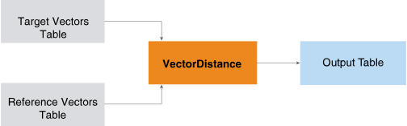
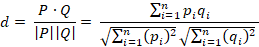
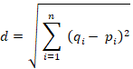
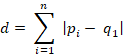

<html><head></head><body>
<h1 class="title topictitle1" id="ariaid-title1">VectorDistance (ML Engine)</h1>

The VectorDistance function takes a table of target vectors and a table of reference vectors and returns a table that contains the distance between each target-reference pair.

  </img>  

Information retrieval and text mining applications use the vector distance between the Term Frequency Inverse Document Frequency (TF-IDF) representations of two documents to measure the similarity of their subject matter.

<h2 class="title topictitle2" id="ariaid-title2">VectorDistance Syntax</h2>

<h3 class="title sectiontitle">Version 1.3</h3><pre class="pre codeblock" xml:space="preserve"><code>SELECT * FROM VectorDistance (
  ON <var class="keyword varname">target_input_table</var> AS TargetTable PARTITION BY <var class="keyword varname">target_id_column</var> [,...]
  ON <var class="keyword varname">ref_input_table</var> AS ReferenceTable DIMENSION
  USING
  TargetIDColumns ({ '<var class="keyword varname">target_id_column</var>' | <var class="keyword varname">target_id_column_range</var> }[,...])
  TargetFeatureColumn ('<var class="keyword varname">target_feature_column</var>')
  [ TargetValueColumn ('<var class="keyword varname">target_value_column</var>') ]
  [ RefIDColumns ({ '<var class="keyword varname">ref_id_column</var>' | <var class="keyword varname">ref_id_column_range</var> }[,...])
  [ RefTableSize ({ 'SMALL' | 'LARGE' }) ]
  [ RefFeatureColumn ('<var class="keyword varname">ref_feature_column</var>') ]
  [ RefValueColumn ('<var class="keyword varname">ref_value_column</var>') ]
  [ DistanceMeasure ({ 'cosine' | 'euclidean' | 'manhattan' | 'binary' }[,...])]
  [ IgnoreMismatch (<b>{'true'|'t'|'yes'|'y'|'1'|'false'|'f'|'no'|'n'|'0'}</b>) ]
  [ ReplaceInvalid ({ 'PositiveInfinity' |'NegativeInfinity' | <var class="keyword varname">custom</var> })]
  [ TopK (<var class="keyword varname">k</var>) ]
  [ MaxDistance (<var class="keyword varname">threshold</var> [,...]) ]
) AS <var class="keyword varname">alias</var>;</code></pre>

<b>Related Information</b>

<ul class="linklist linklist relinfo">
<a href="ndv1557782188375.md">Column Specification Syntax Elements</a>
</ul>

<h2 class="title topictitle2" id="ariaid-title3">VectorDistance Syntax Elements</h2>

<dl class="dl parml"><dt class="dt pt dlterm">TargetIDColumns</dt><dd class="dd pd">Specify the names of the columns that comprise the target vector identifier. You must partition the target input table by these columns and specify them with this syntax element.</dd><dt class="dt pt dlterm">TargetFeatureColumn</dt><dd class="dd pd">Specify the name of the column that contains the target vector feature name (for example, the axis of a 3-D vector).</dd><dd class="dd pd ddexpand">The function drops any entry that has a NULL value in a <var class="keyword varname">feature_column</var>.</dd><dt class="dt pt dlterm">TargetValueColumn</dt><dd class="dd pd">[Optional] Specify the name of the column that contains the value for the target vector feature. If you omit this syntax element, each feature (that is, each row) has the target value 1.</dd><dd class="dd pd ddexpand">The function drops any entry that has a NULL value in a <var class="keyword varname">value_column</var>.</dd><dt class="dt pt dlterm">RefIDColumns</dt><dd class="dd pd">[Optional] Specify the names of the columns that comprise the reference vector identifier.</dd><dd class="dd pd ddexpand">Default: TargetIDColumns value</dd><dt class="dt pt dlterm">RefFeatureColumn</dt><dd class="dd pd">[Optional] Specify the name of the column that contains the reference vector feature name.</dd><dd class="dd pd ddexpand">The function drops any entry that has a NULL value in a <var class="keyword varname">feature_column</var>.</dd><dd class="dd pd ddexpand">Default: <var class="keyword varname">feature_column</var> (TargetFeatureColumn value)</dd><dt class="dt pt dlterm">RefValueColumn</dt><dd class="dd pd">[Optional] Specify the name of the column that contains the value for the reference vector feature.</dd><dd class="dd pd ddexpand">The function drops any entry that has a NULL value in a <var class="keyword varname">value_column</var>.</dd><dd class="dd pd ddexpand">Default: TargetValueColumn syntax element value.</dd><dt class="dt pt dlterm">RefTableSize</dt><dd class="dd pd">[Optional] Specify the size of the ReferenceTable. Specify 'LARGE' only if the ReferenceTable does not fit in memory, because 'SMALL' allows faster processing.</dd><dd class="dd pd ddexpand">Default: 'SMALL'</dd><dt class="dt pt dlterm">DistanceMeasure</dt><dd class="dd pd">[Optional] Specify the distance measures that the function uses.

<table cellpadding="4" cellspacing="0" summary="" id="rus1507749886078__table_N100B4_N100B0_N100A9_N10018_N10014_N10010_N10001" class="table" frame="border" border="1" rules="all">

<colgroup span="1"><col style="width:50%" span="1"></col><col style="width:50%" span="1"></col></colgroup><thead class="thead" style="text-align:left;"><tr class="row"><th class="entry cellrowborder" style="vertical-align:top;" id="d2452e226" rowspan="1" colspan="1">Option</th><th class="entry cellrowborder" style="vertical-align:top;" id="d2452e228" rowspan="1" colspan="1">Description</th></tr></thead><tbody class="tbody"><tr class="row"><td class="entry cellrowborder" style="vertical-align:top;" headers="d2452e226" rowspan="1" colspan="1">'cosine'</td><td class="entry cellrowborder" style="vertical-align:top;" headers="d2452e228" rowspan="1" colspan="1">Cosine distance between vectors <var class="keyword varname">p</var> and <var class="keyword varname">q</var>:

</img>
</td></tr><tr class="row"><td class="entry cellrowborder" style="vertical-align:top;" headers="d2452e226" rowspan="1" colspan="1">'euclidean'</td><td class="entry cellrowborder" style="vertical-align:top;" headers="d2452e228" rowspan="1" colspan="1">Euclidean distance between vectors <var class="keyword varname">p</var> and <var class="keyword varname">q</var>:

</img>
</td></tr><tr class="row"><td class="entry cellrowborder" style="vertical-align:top;" headers="d2452e226" rowspan="1" colspan="1">'manhattan'</td><td class="entry cellrowborder" style="vertical-align:top;" headers="d2452e228" rowspan="1" colspan="1">Manhattan distance between vectors <var class="keyword varname">p</var> and <var class="keyword varname">q</var>:

</img>
</td></tr><tr class="row"><td class="entry cellrowborder" style="vertical-align:top;" headers="d2452e226" rowspan="1" colspan="1">'binary'</td><td class="entry cellrowborder" style="vertical-align:top;" headers="d2452e228" rowspan="1" colspan="1">Binary distance between two vectors is 1 if vectors are identical and 0 otherwise.</td></tr></tbody></table>
</dd><dd class="dd pd ddexpand">Default: 'cosine'</dd><dt class="dt pt dlterm">IgnoreMismatch</dt><dd class="dd pd">[Optional] Specify whether to drop mismatched dimensions. If DistanceMeasure is 'cosine', this syntax element is 'false'. If you specify 'true', two vectors with no common features become two empty vectors when only their common features are considered, and the function cannot measure the distance between them.</dd><dd class="dd pd ddexpand">Default: 'true'</dd><dt class="dt pt dlterm">ReplaceInvalid</dt><dd class="dd pd">[Optional] Specify the value to return when the function encounters an infinite value or empty vectors. For <var class="keyword varname">custom</var>, you can supply any DOUBLE PRECISION value.</dd><dd class="dd pd ddexpand">Default: 'PositiveInfinity'</dd><dt class="dt pt dlterm">TopK</dt><dd class="dd pd">[Optional] Specify, for each target vector and for each measure, the maximum number of closest reference vectors to include in the output table. For k, you can supply any INTEGER value.</dd><dd class="dd pd ddexpand">Default: Maximum INTEGER value (2,147,483,647)</dd><dt class="dt pt dlterm">MaxDistance</dt><dd class="dd pd">[Optional] Specify the maximum distance between a pair of target and reference vectors. If the distance exceeds the threshold, the pair does not appear in the output table.</dd><dd class="dd pd ddexpand">If the DistanceMeasure syntax element specifies multiple measures, then the MaxDistance syntax element must specify a <var class="keyword varname">threshold</var> for each measure. The <var class="keyword varname">i</var>th <var class="keyword varname">threshold</var> corresponds to the ith measure. Each <var class="keyword varname">threshold</var> can be any DOUBLE PRECISION value.</dd><dd class="dd pd ddexpand">Default behavior: The function returns all results.</dd></dl>

</body></html>
