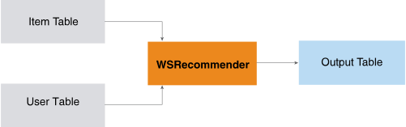

<h1 class="title topictitle1" id="ariaid-title1">WSRecommender (ML Engine)</h1>

The WSRecommender function is an item-based, collaborative filtering
			function that uses a weighted-sum algorithm to make recommendations (for example, items
			or products for users to consider purchasing).

  </img>  

<h2 class="title topictitle2" id="ariaid-title2">WSRecommender Syntax</h2>

<h3 class="title sectiontitle">WSRecommender version 1.3, WSRecommenderReduce version 1.3</h3><pre class="pre codeblock" xml:space="preserve"><code>SELECT * FROM WSRecommender
  ON (
    SELECT * FROM WSRecommenderReduce (
      ON <var class="keyword varname">item_table</var> AS ItemTable PARTITION BY <var class="keyword varname">item1_column</var> 
      ON <var class="keyword varname">user_table</var> AS UserTable PARTITION BY <var class="keyword varname">item_column</var>
      [ USING
        [ Item1 ('<var class="keyword varname">item1_column</var>') ]
        [ Item2 ('<var class="keyword varname">item2_column</var>') ]
        [ ItemSimilarityScore ('<var class="keyword varname">similarity_column</var>') ]
        [ UserItemColumn ('<var class="keyword varname">item_column</var>') ]
        [ UserIDColumn ('<var class="keyword varname">user_column</var>') ]
        [ UserPrefColumn ('<var class="keyword varname">preference_column</var>') ]
        [ AccumulateItem ({ '<var class="keyword varname">accumulate_item_column</var>' | <var class="keyword varname">accumulate_item_column_range</var> }[,...]) ]
        [ AccumulateUser ({ '<var class="keyword varname">accumulate_user_column</var>' | <var class="keyword varname">accumulate_user_column_range</var> }[,...]) ]
      ]
    ) AS <var class="keyword varname">alias_1</var>
  ) AS <var class="keyword varname">temporary_table</var> PARTITION BY <var class="keyword varname">usr</var>, <var class="keyword varname">col1_item2</var> 
) AS <var class="keyword varname">alias_2</var>;</code></pre>

<b>Related Information</b>

<ul class="linklist linklist relinfo">
<a href="ndv1557782188375.md">Column Specification Syntax Elements</a>
</ul>

<h2 class="title topictitle2" id="ariaid-title3">WSRecommender Syntax Elements</h2>

<dl class="dl parml"><dt class="dt pt dlterm">Item1</dt><dd class="dd pd">[Optional] Specify the name of the ItemTable column that contains the first item (item1).</dd><dd class="dd pd ddexpand">Default: 'col1_item1'</dd><dt class="dt pt dlterm">Item2</dt><dd class="dd pd">[Optional] Specify the name of the ItemTable column that contains the second item (item2).</dd><dd class="dd pd ddexpand">Default: 'col1_item2'</dd><dt class="dt pt dlterm">ItemSimilarityScore</dt><dd class="dd pd">[Optional] Specify the name of the ItemTable column that contains the similarity score for item1 and item2.</dd><dd class="dd pd ddexpand">Default: 'cntb'</dd><dt class="dt pt dlterm">UserItemColumn</dt><dd class="dd pd">[Optional] Specify the name of the UserTable column that contains the names of the items that the user viewed or purchased.</dd><dd class="dd pd ddexpand">Default: 'item'</dd><dt class="dt pt dlterm">UserIDColumn</dt><dd class="dd pd">Specify the name of the UserTable column that contains the unique user identifiers.</dd><dd class="dd pd ddexpand">Default: 'usr'</dd><dt class="dt pt dlterm">UserPrefColumn</dt><dd class="dd pd">[Optional] Specify the name of the UserTable column that contains user preferences for an item, expressed as numeric values. The value 0 indicates no preference.</dd><dd class="dd pd ddexpand">Default: 'preference'</dd><dt class="dt pt dlterm">AccumulateItem</dt><dd class="dd pd">[Optional] Specify the names of ItemTable columns to copy to the output table.</dd><dt class="dt pt dlterm">AccumulateUser</dt><dd class="dd pd">[Optional] Specify the names of UserTable columns to copy to the output table.</dd></dl>

