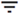

Consumo mensual por departamento
================================

Revisa el número de unidades Vantage que se usan por departamento según el número de usuarios del departamento asignados a la base de datos.

Los datos se actualizan cada hora y se conservan durante cuatro meses.

El consumo para usuarios no asignados a un departamento aparece como **Desconocido**.

Usa filtros, , para personalizar la visualización del consumo mensual por departamento.

Selecciona  para exportar los datos en formato .csv.
