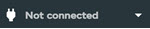

Se conecta a un sitio como usuario de la base de datos.

En el panel **Editor**, en el cuadro de diálogo **Crear una conexión nueva**, que se abre de forma predeterminada, escriba las credenciales para establecer una conexión. Si no se muestra el cuadro de diálogo **Crear una conexión nueva**, seleccione **+ Añadir conexión** en  para abrirlo. Elija el sitio disponible con el que quiera trabajar. Si este sitio no ha sido actualizado/configurado para el acceso del Editor, le avisará.

Una vez que esté conectado, aparecerán todas las bases de datos que tiene permiso para usar.

Para finalizar la conexión y eliminarla de la lista desplegable, seleccione **Quitar**.
