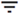

部門による毎月の消費量
======================

データベースに割り当てられた部門ユーザーに基づいた、部門による Vantage 単位数の使用量を確認できます。

データは 1 時間おきに更新され、4 か月間保持されます。

部門に割り当てられていないユーザーの消費量は、**不明** と表示されます。

フィルタ  を使用して、部門の毎月の消費量の表示をカスタマイズできます。

データを .csv 形式でエクスポートするには、 を選択します。
