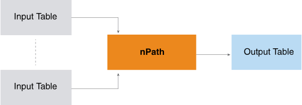
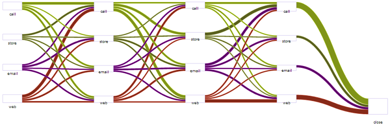
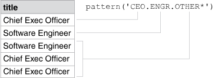
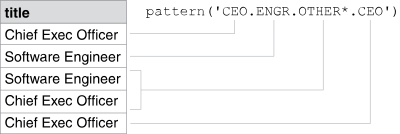

<html><head></head><body>
<h1 class="title topictitle1" id="ariaid-title1">nPath® (ML Engine)</h1>

<h2 class="title topictitle2" id="ariaid-title2">Introduction to nPath</h2>

The nPath function scans a set of rows, looking for patterns that you specify. For each set of input rows that matches the pattern, nPath produces a single output row. The function provides a flexible pattern-matching capability that lets you specify complex patterns in the input data and define the values that are output for each matched input set.

  </img>  

nPath is useful when your goal is to identify the paths that lead to an outcome. For example, you can use nPath to analyze:

<ul class="ul" id="nnz1507231322706__ul_qwt_4fl_p1b">
<li class="li">Web site click data, to identify paths that lead to sales over a specified amount</li>
<li class="li">Sensor data from industrial processes, to identify paths to poor product
				quality</li>
<li class="li">Healthcare records of individual patients, to identify paths that indicate that patients are at risk of developing conditions such as heart disease or diabetes</li>
<li class="li">Financial data for individuals, to identify paths that provide information about credit or fraud risks</li></ul>

The output from the nPath function can be input to other <b>ML Engine</b> functions or to a visualization tool such as <b>Teradata® AppCenter</b>.

Sankey Diagram of <b>ML Engine</b> nPath Output
  </img>  

An nPath call specifies:
<ul class="ul" id="nnz1507231322706__ul_nk4_3g4_cz">
<li class="li"><a href="anj1558127449015.md#sal1507231621140">Mode (overlapping or nonoverlapping)</a></li>
<li class="li"><a href="anj1558127449015.md#duh1507234733202">Pattern to match</a></li>
<li class="li"><a href="anj1558127449015.md#hkc1507231941696">Symbols to use</a></li>
<li class="li">[Optional] <a href="anj1558127449015.md#ffp1507311580978">Filters to apply</a></li>
<li class="li"><a href="anj1558127449015.md#kpw1507312276859">Results to output</a></li></ul>

<h2 class="title topictitle2" id="ariaid-title3">nPath Syntax</h2>

<h3 class="title sectiontitle">Version 1.1</h3>
<b>Note</b>
This function requires "@coprocessor".

<pre class="pre codeblock" xml:space="preserve"><code>SELECT * FROM nPath@coprocessor (
  ON { <var class="keyword varname">table</var> | <var class="keyword varname">view</var> | (<var class="keyword varname">query</var>) } PARTITION BY <var class="keyword varname">partition_column</var> ORDER BY <var class="keyword varname">order_column</var> [ ASC | DESC ][<var class="keyword varname">...</var>]
  [ ON { <var class="keyword varname">table</var> | <var class="keyword varname">view</var> | (<var class="keyword varname">query</var>) } 
    [ PARTITION BY <var class="keyword varname">partition_column</var> | DIMENSION ] ORDER BY <var class="keyword varname">order_column</var> [ ASC | DESC ] 
  ][<var class="keyword varname">...</var>]
  USING 
  Mode ({ OVERLAPPING | NONOVERLAPPING })
  Pattern ('<var class="keyword varname">pattern</var>')
  Symbols ({ <var class="keyword varname">col_expr</var> = <var class="keyword varname">symbol_predicate</var> AS <var class="keyword varname">symbol</var> } [,...])
  [ Filter (<var class="keyword varname">filter_expression</var> [,...]) ]
  Result ({ <var class="keyword varname">aggregate_function</var> (<var class="keyword varname">col_expr</var> OF <var class="keyword varname">symbol</var>) AS <var class="keyword varname">alias_1</var> }[,...])
) AS <var class="keyword varname">alias_2</var>;</code></pre>

The nPath function is not tied to any schema and must not be qualified with a schema name.

<b>Related Information</b>

<ul class="linklist linklist relinfo">
<a href="eta1543514041091.md">Comments in Queries</a>
</ul>

<h2 class="title topictitle2" id="ariaid-title4">nPath Syntax Elements</h2>

<dl class="dl parml"><dt class="dt pt dlterm">Mode</dt><dd class="dd pd">Specify the pattern-matching mode:

<table cellpadding="4" cellspacing="0" summary="" id="sal1507231621140__table_sng_gmy_fdb" class="table" frame="border" border="1" rules="all">

<colgroup span="1"><col style="width:50%" span="1"></col><col style="width:50%" span="1"></col></colgroup><thead class="thead" style="text-align:left;"><tr class="row"><th class="entry cellrowborder" style="vertical-align:top;" id="d250713e254" rowspan="1" colspan="1">Option</th><th class="entry cellrowborder" style="vertical-align:top;" id="d250713e256" rowspan="1" colspan="1">Description</th></tr></thead><tbody class="tbody"><tr class="row"><td class="entry cellrowborder" style="vertical-align:top;" headers="d250713e254" rowspan="1" colspan="1"><code class="ph codeph">OVERLAPPING</code></td><td class="entry cellrowborder" style="vertical-align:top;" headers="d250713e256" rowspan="1" colspan="1">Find every occurrence of pattern in partition, regardless of whether it is part of a previously found match. One row can match multiple symbols in a given matched pattern.</td></tr><tr class="row"><td class="entry cellrowborder" style="vertical-align:top;" headers="d250713e254" rowspan="1" colspan="1"><code class="ph codeph">NONOVERLAPPING</code></td><td class="entry cellrowborder" style="vertical-align:top;" headers="d250713e256" rowspan="1" colspan="1">Start next pattern search at row that follows last pattern match.</td></tr></tbody></table>
</dd><dt class="dt pt dlterm">Pattern</dt><dd class="dd pd">Specify the pattern for which the function searches. You compose <var class="keyword varname">pattern</var> with the symbols (which you define in the Symbols syntax element), operators, and parentheses. 

When patterns have multiple operators, the function applies them in order of precedence, and applies operators of equal precedence from left to right. To force the function to evaluate a subpattern first, enclose it in parentheses. For more information, see <a href="anj1558127449015.md#duh1507234733202">nPath Patterns</a>.
</dd><dt class="dt pt dlterm">Symbols</dt><dd class="dd pd">Specify the symbols that appear in the values of the Pattern and Result syntax elements. The <var class="keyword varname">col_expr</var> is an expression whose value is a column name, <var class="keyword varname">symbol</var> is any valid identifier, and <var class="keyword varname">symbol_predicate</var> is a SQL predicate (often a column name).

For example, this Symbols syntax element is for analyzing website visits:
<pre class="pre codeblock" xml:space="preserve"><code>Symbols (
  pagetype = 'homepage' AS H,
  pagetype <> 'homepage' AND pagetype <> 'checkout' AS PP,
  pagetype = 'checkout' AS CO
)</code></pre>

The <var class="keyword varname">symbol</var> is case-insensitive; however, a <var class="keyword varname">symbol</var> of one or two uppercase letters is easy to identify in patterns.

If <var class="keyword varname">col_expr</var> represents a column that appears in multiple input tables, you must qualify the ambiguous column name with its table name. For example:
<pre class="pre codeblock" xml:space="preserve"><code>Symbols (
  weblog.pagetype = 'homepage' AS H,
  weblog.pagetype = 'thankyou' AS T,
  ads.adname = 'xmaspromo' AS X,
  ads.adname = 'realtorpromo' AS R
)</code></pre>

For more information about symbols that appear in the Pattern syntax element value, see <a href="anj1558127449015.md#hkc1507231941696">nPath Symbols</a>. For more information about symbols that appear in the Result syntax element value, see <a href="anj1558127449015.md#kpw1507312276859">nPath Results</a>.
</dd><dt class="dt pt dlterm">Filter</dt><dd class="dd pd">[Optional] Specify filters to impose on the matched rows. The function combines the filter expressions using the AND operator.

This is the <var class="keyword varname">filter_expression</var> syntax:
<pre class="pre codeblock" xml:space="preserve"><code><var class="keyword varname">symbol_expression comparison_operator symbol_expression</var></code></pre>

The two symbol expressions must be type-compatible. This is the <var class="keyword varname">symbol_expression</var> syntax:
<pre class="pre codeblock" xml:space="preserve"><code>{ FIRST | LAST }(<var class="keyword varname">column_with_expression</var> OF [ANY](<var class="keyword varname">symbol</var>[,...]))</code></pre>

The <var class="keyword varname">column_with_expression</var> cannot contain the operator AND or OR, and all its columns must come from the same input. If the function has multiple inputs, <var class="keyword varname">column_with_expression</var> and symbol must come from the same input.

The <var class="keyword varname">comparison_operator</var> is either <code class="ph codeph"><</code>, <code class="ph codeph">></code>, <code class="ph codeph"><=</code>, <code class="ph codeph">>=</code>, <code class="ph codeph">=</code>, or <code class="ph codeph">!=</code>.

Whether this syntax element improves or degrades nPath performance depends on several factors. For details, see <a href="anj1558127449015.md#ffp1507311580978">nPath Filters</a>.
</dd><dt class="dt pt dlterm">Result</dt><dd class="dd pd">Specify the output columns. The <var class="keyword varname">col_expr</var> is an expression whose value is a column name; it specifies the values to retrieve from the matched rows. The function applies <var class="keyword varname">aggregate_function</var> to these values. For details, see <a href="anj1558127449015.md#kpw1507312276859">nPath Results</a>.

The function evaluates this syntax element once for every matched pattern in the partition (that is, it outputs one row for each pattern match).
</dd></dl>

<h2 class="title topictitle2" id="ariaid-title5">nPath Input</h2>

The function requires at least one partitioned input table, and can have additional input tables that are either partitioned or DIMENSION tables.

<b>Note</b>
If the input to nPath is nondeterministic, the results are nondeterministic. For more information, see <a href="qym1549987102806.md">Nondeterministic Results and UniqueID Syntax Element</a>.

<h3 class="title sectiontitle">Input Table Schema</h3>
<table cellpadding="4" cellspacing="0" summary="" id="rdo1507231702191__table_N10014_N1000E_N1000C_N10001" class="table" frame="border" border="1" rules="all">

<colgroup span="1"><col style="width:28.57142857142857%" span="1"></col><col style="width:14.285714285714285%" span="1"></col><col style="width:57.14285714285714%" span="1"></col></colgroup><thead class="thead" style="text-align:left;"><tr class="row"><th class="entry nocellnorowborder" style="vertical-align:top;" id="d250713e447" rowspan="1" colspan="1">Column</th><th class="entry nocellnorowborder" style="vertical-align:top;" id="d250713e449" rowspan="1" colspan="1">Data Type</th><th class="entry cell-norowborder" style="vertical-align:top;" id="d250713e451" rowspan="1" colspan="1">Description</th></tr></thead><tbody class="tbody"><tr class="row"><td class="entry nocellnorowborder" style="vertical-align:top;" headers="d250713e447" rowspan="1" colspan="1"><var class="keyword varname">partition_column</var></td><td class="entry nocellnorowborder" style="vertical-align:top;" headers="d250713e449" rowspan="1" colspan="1">INTEGER or VARCHAR</td><td class="entry cell-norowborder" style="vertical-align:top;" headers="d250713e451" rowspan="1" colspan="1">Column by which every partitioned input table is partitioned.</td></tr><tr class="row"><td class="entry nocellnorowborder" style="vertical-align:top;" headers="d250713e447" rowspan="1" colspan="1"><var class="keyword varname">order_column</var></td><td class="entry nocellnorowborder" style="vertical-align:top;" headers="d250713e449" rowspan="1" colspan="1">INTEGER or VARCHAR</td><td class="entry cell-norowborder" style="vertical-align:top;" headers="d250713e451" rowspan="1" colspan="1">Column by which every input table is ordered.</td></tr><tr class="row"><td class="entry row-nocellborder" style="vertical-align:top;" headers="d250713e447" rowspan="1" colspan="1"><var class="keyword varname">input_column</var></td><td class="entry row-nocellborder" style="vertical-align:top;" headers="d250713e449" rowspan="1" colspan="1">INTEGER or VARCHAR</td><td class="entry cellrowborder" style="vertical-align:top;" headers="d250713e451" rowspan="1" colspan="1">Data to search for patterns.</td></tr></tbody></table>

<h2 class="title topictitle2" id="ariaid-title6">nPath Output</h2>

<h3 class="title sectiontitle">Output Table Schema</h3>
<table cellpadding="4" cellspacing="0" summary="" id="izm1507231778801__table_N1000E_N1000C_N10001" class="table" frame="border" border="1" rules="all">

<colgroup span="1"><col style="width:18.032786885245905%" span="1"></col><col style="width:24.590163934426233%" span="1"></col><col style="width:57.37704918032788%" span="1"></col></colgroup><thead class="thead" style="text-align:left;"><tr class="row"><th class="entry nocellnorowborder" style="vertical-align:top;" id="d250713e497" rowspan="1" colspan="1">Column</th><th class="entry nocellnorowborder" style="vertical-align:top;" id="d250713e499" rowspan="1" colspan="1">Data Type</th><th class="entry cell-norowborder" style="vertical-align:top;" id="d250713e501" rowspan="1" colspan="1">Description</th></tr></thead><tbody class="tbody"><tr class="row"><td class="entry nocellnorowborder" style="vertical-align:top;" headers="d250713e497" rowspan="1" colspan="1"><var class="keyword varname">partition_column</var></td><td class="entry nocellnorowborder" style="vertical-align:top;" headers="d250713e499" rowspan="1" colspan="1">Same as in Input table</td><td class="entry cell-norowborder" style="vertical-align:top;" headers="d250713e501" rowspan="1" colspan="1">Column by which partitioned input tables are partitioned.</td></tr><tr class="row"><td class="entry nocellnorowborder" style="vertical-align:top;" headers="d250713e497" rowspan="1" colspan="1"><var class="keyword varname">order_column</var></td><td class="entry nocellnorowborder" style="vertical-align:top;" headers="d250713e499" rowspan="1" colspan="1">Same as in Input table</td><td class="entry cell-norowborder" style="vertical-align:top;" headers="d250713e501" rowspan="1" colspan="1">Column by which input tables are ordered.</td></tr><tr class="row"><td class="entry row-nocellborder" style="vertical-align:top;" headers="d250713e497" rowspan="1" colspan="1"><var class="keyword varname">result_column</var></td><td class="entry row-nocellborder" style="vertical-align:top;" headers="d250713e499" rowspan="1" colspan="1">Same as result of <var class="keyword varname">aggregate_function</var></td><td class="entry cellrowborder" style="vertical-align:top;" headers="d250713e501" rowspan="1" colspan="1">Determined by Result syntax element. For details, see <a href="anj1558127449015.md#kpw1507312276859">nPath Results</a>.</td></tr></tbody></table>

<h2 class="title topictitle2" id="ariaid-title7">nPath Symbols</h2>

A <dfn class="term">symbol</dfn> identifies a row in the Pattern and Result syntax elements. A symbol can be any valid identifier (that is, a sequence of characters and digits that begins with a character) but is typically one or two uppercase letters. Symbols are case-insensitive; that is, 'SU' is identical to 'su', and the system reports an error if you use both.

For example, suppose that you have this input table:

<table cellpadding="4" cellspacing="0" summary="" id="hkc1507231941696__table_cjj_cj4_cz" class="table" width="100%" frame="border" border="1" rules="all">

<colgroup span="1"><col style="width:10.81081081081081%" span="1"></col><col style="width:10.81081081081081%" span="1"></col><col style="width:10.81081081081081%" span="1"></col><col style="width:10.81081081081081%" span="1"></col><col style="width:13.513513513513514%" span="1"></col><col style="width:10.81081081081081%" span="1"></col><col style="width:16.216216216216218%" span="1"></col><col style="width:16.216216216216218%" span="1"></col></colgroup><thead class="thead" style="text-align:left;"><tr class="row"><th class="entry cellrowborder" style="vertical-align:top;" id="d250713e566" rowspan="1" colspan="1">record</th><th class="entry cellrowborder" style="vertical-align:top;" id="d250713e568" rowspan="1" colspan="1">city</th><th class="entry cellrowborder" style="vertical-align:top;" id="d250713e570" rowspan="1" colspan="1">temp</th><th class="entry cellrowborder" style="vertical-align:top;" id="d250713e572" rowspan="1" colspan="1">rh</th><th class="entry cellrowborder" style="vertical-align:top;" id="d250713e574" rowspan="1" colspan="1">cloudcover</th><th class="entry cellrowborder" style="vertical-align:top;" id="d250713e576" rowspan="1" colspan="1">windspeed</th><th class="entry cellrowborder" style="vertical-align:top;" id="d250713e578" rowspan="1" colspan="1">winddirection</th><th class="entry cellrowborder" style="vertical-align:top;" id="d250713e580" rowspan="1" colspan="1">rained_next_day</th></tr></thead><tbody class="tbody"><tr class="row"><td class="entry cellrowborder" style="vertical-align:top;" headers="d250713e566" rowspan="1" colspan="1">1</td><td class="entry cellrowborder" style="vertical-align:top;" headers="d250713e568" rowspan="1" colspan="1">Tuscson</td><td class="entry cellrowborder" style="vertical-align:top;" headers="d250713e570" rowspan="1" colspan="1">81</td><td class="entry cellrowborder" style="vertical-align:top;" headers="d250713e572" rowspan="1" colspan="1">30</td><td class="entry cellrowborder" style="vertical-align:top;" headers="d250713e574" rowspan="1" colspan="1">0.0</td><td class="entry cellrowborder" style="vertical-align:top;" headers="d250713e576" rowspan="1" colspan="1">5</td><td class="entry cellrowborder" style="vertical-align:top;" headers="d250713e578" rowspan="1" colspan="1">NW</td><td class="entry cellrowborder" style="vertical-align:top;" headers="d250713e580" rowspan="1" colspan="1">1</td></tr><tr class="row"><td class="entry cellrowborder" style="vertical-align:top;" headers="d250713e566" rowspan="1" colspan="1">2</td><td class="entry cellrowborder" style="vertical-align:top;" headers="d250713e568" rowspan="1" colspan="1">Tempe</td><td class="entry cellrowborder" style="vertical-align:top;" headers="d250713e570" rowspan="1" colspan="1">76</td><td class="entry cellrowborder" style="vertical-align:top;" headers="d250713e572" rowspan="1" colspan="1">40</td><td class="entry cellrowborder" style="vertical-align:top;" headers="d250713e574" rowspan="1" colspan="1">0.2</td><td class="entry cellrowborder" style="vertical-align:top;" headers="d250713e576" rowspan="1" colspan="1">15</td><td class="entry cellrowborder" style="vertical-align:top;" headers="d250713e578" rowspan="1" colspan="1">NE</td><td class="entry cellrowborder" style="vertical-align:top;" headers="d250713e580" rowspan="1" colspan="1">0</td></tr><tr class="row"><td class="entry cellrowborder" style="vertical-align:top;" headers="d250713e566" rowspan="1" colspan="1">3</td><td class="entry cellrowborder" style="vertical-align:top;" headers="d250713e568" rowspan="1" colspan="1">Tuscson</td><td class="entry cellrowborder" style="vertical-align:top;" headers="d250713e570" rowspan="1" colspan="1">70</td><td class="entry cellrowborder" style="vertical-align:top;" headers="d250713e572" rowspan="1" colspan="1">70</td><td class="entry cellrowborder" style="vertical-align:top;" headers="d250713e574" rowspan="1" colspan="1">0.4</td><td class="entry cellrowborder" style="vertical-align:top;" headers="d250713e576" rowspan="1" colspan="1">10</td><td class="entry cellrowborder" style="vertical-align:top;" headers="d250713e578" rowspan="1" colspan="1">N</td><td class="entry cellrowborder" style="vertical-align:top;" headers="d250713e580" rowspan="1" colspan="1">0</td></tr><tr class="row"><td class="entry cellrowborder" style="vertical-align:top;" headers="d250713e566" rowspan="1" colspan="1">4</td><td class="entry cellrowborder" style="vertical-align:top;" headers="d250713e568" rowspan="1" colspan="1">Tusayan</td><td class="entry cellrowborder" style="vertical-align:top;" headers="d250713e570" rowspan="1" colspan="1">75</td><td class="entry cellrowborder" style="vertical-align:top;" headers="d250713e572" rowspan="1" colspan="1">50</td><td class="entry cellrowborder" style="vertical-align:top;" headers="d250713e574" rowspan="1" colspan="1">0.4</td><td class="entry cellrowborder" style="vertical-align:top;" headers="d250713e576" rowspan="1" colspan="1">5</td><td class="entry cellrowborder" style="vertical-align:top;" headers="d250713e578" rowspan="1" colspan="1">NW</td><td class="entry cellrowborder" style="vertical-align:top;" headers="d250713e580" rowspan="1" colspan="1">0</td></tr></tbody></table>

This table has examples of symbol definitions and the rows of the table that they match in NONOVERLAPPING mode:

<table cellpadding="4" cellspacing="0" summary="" id="hkc1507231941696__table_n1s_nk4_cz" class="table" frame="border" border="1" rules="all">

<colgroup span="1"><col style="width:60%" span="1"></col><col style="width:40%" span="1"></col></colgroup><thead class="thead" style="text-align:left;"><tr class="row"><th class="entry cellrowborder" style="vertical-align:top;" id="d250713e659" rowspan="1" colspan="1">Symbol Definition</th><th class="entry cellrowborder" style="vertical-align:top;" id="d250713e661" rowspan="1" colspan="1">Rows Matched</th></tr></thead><tbody class="tbody"><tr class="row"><td class="entry cellrowborder" style="vertical-align:top;" headers="d250713e659" rowspan="1" colspan="1"><code class="ph codeph">temp >= 80 AS H</code></td><td class="entry cellrowborder" style="vertical-align:top;" headers="d250713e661" rowspan="1" colspan="1">1</td></tr><tr class="row"><td class="entry cellrowborder" style="vertical-align:top;" headers="d250713e659" rowspan="1" colspan="1"><code class="ph codeph">winddirection = 'NW' AS NW</code></td><td class="entry cellrowborder" style="vertical-align:top;" headers="d250713e661" rowspan="1" colspan="1">1, 4</td></tr><tr class="row"><td class="entry cellrowborder" style="vertical-align:top;" headers="d250713e659" rowspan="1" colspan="1"><code class="ph codeph">winddirection = 'NW' OR windspeed > 12 AS W</code></td><td class="entry cellrowborder" style="vertical-align:top;" headers="d250713e661" rowspan="1" colspan="1">1, 2, 4</td></tr><tr class="row"><td class="entry cellrowborder" style="vertical-align:top;" headers="d250713e659" rowspan="1" colspan="1"><code class="ph codeph">cloudcover != 0.0 AND rh > 35 AS C</code></td><td class="entry cellrowborder" style="vertical-align:top;" headers="d250713e661" rowspan="1" colspan="1">2, 3, 4

(An alternative to <code class="ph codeph">!=</code> is <code class="ph codeph"><></code>.)
</td></tr><tr class="row"><td class="entry cellrowborder" style="vertical-align:top;" headers="d250713e659" rowspan="1" colspan="1"><code class="ph codeph">'true' AS A</code></td><td class="entry cellrowborder" style="vertical-align:top;" headers="d250713e661" rowspan="1" colspan="1">1, 2, 3, 4

This symbol definition matches all rows, for any input table.
</td></tr><tr class="row"><td class="entry cellrowborder" style="vertical-align:top;" headers="d250713e659" rowspan="1" colspan="1"><code class="ph codeph">city like 'tu%' AS TU</code></td><td class="entry cellrowborder" style="vertical-align:top;" headers="d250713e661" rowspan="1" colspan="1">None 

The like operator is case-sensitive. The <code class="ph codeph">%</code> operator matches any number of characters.
</td></tr><tr class="row"><td class="entry cellrowborder" style="vertical-align:top;" headers="d250713e659" rowspan="1" colspan="1"><code class="ph codeph">city not like 'tu%' AS TU</code></td><td class="entry cellrowborder" style="vertical-align:top;" headers="d250713e661" rowspan="1" colspan="1">None</td></tr><tr class="row"><td class="entry cellrowborder" style="vertical-align:top;" headers="d250713e659" rowspan="1" colspan="1"><code class="ph codeph">city ilike 'tu%' AS TU</code></td><td class="entry cellrowborder" style="vertical-align:top;" headers="d250713e661" rowspan="1" colspan="1">1, 3, 4 

The ilike operator is case-insensitive.
</td></tr><tr class="row"><td class="entry cellrowborder" style="vertical-align:top;" headers="d250713e659" rowspan="1" colspan="1"><code class="ph codeph">city not ilike 'tu%' AS N</code></td><td class="entry cellrowborder" style="vertical-align:top;" headers="d250713e661" rowspan="1" colspan="1">2</td></tr><tr class="row"><td class="entry cellrowborder" style="vertical-align:top;" headers="d250713e659" rowspan="1" colspan="1"><code class="ph codeph">city ilike 'tu%n' as T</code></td><td class="entry cellrowborder" style="vertical-align:top;" headers="d250713e661" rowspan="1" colspan="1">1, 3, 4 

The <code class="ph codeph">%</code> operator matches any number of characters.
</td></tr><tr class="row"><td class="entry cellrowborder" style="vertical-align:top;" headers="d250713e659" rowspan="1" colspan="1"><code class="ph codeph">city ilike 'tu___n' as T</code></td><td class="entry cellrowborder" style="vertical-align:top;" headers="d250713e661" rowspan="1" colspan="1">1, 3 

The underscore (_) operator matches any single character. The pattern <code class="ph codeph">'tu___n'</code> has three underscores, so it matches 'Tucson' but not 'Tusayan'.
</td></tr></tbody></table>

Rows with NULL values do not match any symbol. That is, the function ignores rows with missing values.

<h3 class="title topictitle3" id="ariaid-title8">LAG and LEAD Expressions in Symbol Predicates</h3>

You can create symbol predicates that compare a row to a previous or subsequent row, using a LAG or LEAD operator.

<h4 class="title sectiontitle">LAG Expression Syntax</h4><pre class="pre codeblock" xml:space="preserve"><code>{ <var class="keyword varname">current_expr operator</var> LAG (<var class="keyword varname">previous_expr</var>, <var class="keyword varname">lag_rows</var> [, <var class="keyword varname">default</var>]) |
  LAG (<var class="keyword varname">previous_expr</var>, <var class="keyword varname">lag_rows</var> [, <var class="keyword varname">default</var>]) <var class="keyword varname">operator current_expr</var> }</code></pre><dl class="dl parml"><dt class="dt pt dlterm"><var class="keyword varname">current_expr</var></dt><dd class="dd pd">Name of a column from the current row, or an expression operating on a column from the current row.</dd><dt class="dt pt dlterm"><var class="keyword varname">operator</var></dt><dd class="dd pd">Either <code class="ph codeph">>, >=, <, <=, =,</code> or <code class="ph codeph">!=</code>.</dd><dt class="dt pt dlterm"><var class="keyword varname">previous_expr</var></dt><dd class="dd pd">Name of a column from a previous row, or an expression operating on a column from a previous row.</dd><dt class="dt pt dlterm"><var class="keyword varname">lag_rows</var></dt><dd class="dd pd">Number of rows to count backward from the current row to reach the previous row. For example, if <var class="keyword varname">lag_rows</var> is 1, the previous row is the immediately preceding row.</dd><dt class="dt pt dlterm"><var class="keyword varname">default</var></dt><dd class="dd pd">Value to use for <var class="keyword varname">previous_expr</var> when there is no previous row (that is, when the current row is the first row or there is no row that is <var class="keyword varname">lag_rows</var> before the current row).</dd></dl>

<h4 class="title sectiontitle">LAG and LEAD Expression Rules</h4>
<ul class="ul" id="uex1507233172664__ul_c5p_q1k_mdb">
<li class="li">A symbol definition can have multiple LAG and LEAD expressions.</li>
<li class="li">A symbol definition that has a LAG or LEAD expression cannot have an OR operator.</li>
<li class="li">If a symbol definition has a LAG or LEAD expression and the input is not a table, you must create an alias of the input query, as in <a href="anj1558127449015.md#knr1523641167790">LAG and LEAD Expressions Example: Input Query with Alias</a>.</li></ul>

<h4 class="title topictitle4" id="ariaid-title9">LAG and LEAD Expressions Example: Input Query with Alias</h4>

<h5 class="title sectiontitle">Input</h5>
<table cellpadding="4" cellspacing="0" summary="" id="knr1523641167790__table_cvb_mck_mdb" class="table" frame="border" border="1" rules="all">
bank_web_clicks
<colgroup span="1"><col style="width:25%" span="1"></col><col style="width:25%" span="1"></col><col style="width:25%" span="1"></col><col style="width:25%" span="1"></col></colgroup><thead class="thead" style="text-align:left;"><tr class="row"><th class="entry cellrowborder" style="vertical-align:top;" id="d250713e909" rowspan="1" colspan="1">customer_id</th><th class="entry cellrowborder" style="vertical-align:top;" id="d250713e911" rowspan="1" colspan="1">session_id</th><th class="entry cellrowborder" style="vertical-align:top;" id="d250713e913" rowspan="1" colspan="1">page</th><th class="entry cellrowborder" style="vertical-align:top;" id="d250713e915" rowspan="1" colspan="1">datestamp</th></tr></thead><tbody class="tbody"><tr class="row"><td class="entry cellrowborder" style="vertical-align:top;" headers="d250713e909" rowspan="1" colspan="1">529</td><td class="entry cellrowborder" style="vertical-align:top;" headers="d250713e911" rowspan="1" colspan="1">0</td><td class="entry cellrowborder" style="vertical-align:top;" headers="d250713e913" rowspan="1" colspan="1">ACCOUNT SUMMARY</td><td class="entry cellrowborder" style="vertical-align:top;" headers="d250713e915" rowspan="1" colspan="1">2004-03-17 16:35:00</td></tr><tr class="row"><td class="entry cellrowborder" style="vertical-align:top;" headers="d250713e909" rowspan="1" colspan="1">529</td><td class="entry cellrowborder" style="vertical-align:top;" headers="d250713e911" rowspan="1" colspan="1">0</td><td class="entry cellrowborder" style="vertical-align:top;" headers="d250713e913" rowspan="1" colspan="1">FAQ</td><td class="entry cellrowborder" style="vertical-align:top;" headers="d250713e915" rowspan="1" colspan="1">2004-03-17 16:38:00</td></tr><tr class="row"><td class="entry cellrowborder" style="vertical-align:top;" headers="d250713e909" rowspan="1" colspan="1">529</td><td class="entry cellrowborder" style="vertical-align:top;" headers="d250713e911" rowspan="1" colspan="1">0</td><td class="entry cellrowborder" style="vertical-align:top;" headers="d250713e913" rowspan="1" colspan="1">ACCOUNT HISTORY</td><td class="entry cellrowborder" style="vertical-align:top;" headers="d250713e915" rowspan="1" colspan="1">2004-03-17 16:42:00</td></tr><tr class="row"><td class="entry cellrowborder" style="vertical-align:top;" headers="d250713e909" rowspan="1" colspan="1">529</td><td class="entry cellrowborder" style="vertical-align:top;" headers="d250713e911" rowspan="1" colspan="1">0</td><td class="entry cellrowborder" style="vertical-align:top;" headers="d250713e913" rowspan="1" colspan="1">FUNDS TRANSFER</td><td class="entry cellrowborder" style="vertical-align:top;" headers="d250713e915" rowspan="1" colspan="1">2004-03-17 16:45:00</td></tr><tr class="row"><td class="entry cellrowborder" style="vertical-align:top;" headers="d250713e909" rowspan="1" colspan="1">529</td><td class="entry cellrowborder" style="vertical-align:top;" headers="d250713e911" rowspan="1" colspan="1">0</td><td class="entry cellrowborder" style="vertical-align:top;" headers="d250713e913" rowspan="1" colspan="1">ONLINE STATEMENT ENROLLMENT</td><td class="entry cellrowborder" style="vertical-align:top;" headers="d250713e915" rowspan="1" colspan="1">2004-03-17 16:49:00</td></tr><tr class="row"><td class="entry cellrowborder" style="vertical-align:top;" headers="d250713e909" rowspan="1" colspan="1">529</td><td class="entry cellrowborder" style="vertical-align:top;" headers="d250713e911" rowspan="1" colspan="1">0</td><td class="entry cellrowborder" style="vertical-align:top;" headers="d250713e913" rowspan="1" colspan="1">PROFILE UPDATE</td><td class="entry cellrowborder" style="vertical-align:top;" headers="d250713e915" rowspan="1" colspan="1">2004-03-17 16:50:00</td></tr><tr class="row"><td class="entry cellrowborder" style="vertical-align:top;" headers="d250713e909" rowspan="1" colspan="1">529</td><td class="entry cellrowborder" style="vertical-align:top;" headers="d250713e911" rowspan="1" colspan="1">0</td><td class="entry cellrowborder" style="vertical-align:top;" headers="d250713e913" rowspan="1" colspan="1">ACCOUNT SUMMARY</td><td class="entry cellrowborder" style="vertical-align:top;" headers="d250713e915" rowspan="1" colspan="1">2004-03-17 16:51:00</td></tr><tr class="row"><td class="entry cellrowborder" style="vertical-align:top;" headers="d250713e909" rowspan="1" colspan="1">529</td><td class="entry cellrowborder" style="vertical-align:top;" headers="d250713e911" rowspan="1" colspan="1">0</td><td class="entry cellrowborder" style="vertical-align:top;" headers="d250713e913" rowspan="1" colspan="1">CUSTOMER SUPPORT</td><td class="entry cellrowborder" style="vertical-align:top;" headers="d250713e915" rowspan="1" colspan="1">2004-03-17 16:53:00</td></tr><tr class="row"><td class="entry cellrowborder" style="vertical-align:top;" headers="d250713e909" rowspan="1" colspan="1">529</td><td class="entry cellrowborder" style="vertical-align:top;" headers="d250713e911" rowspan="1" colspan="1">0</td><td class="entry cellrowborder" style="vertical-align:top;" headers="d250713e913" rowspan="1" colspan="1">VIEW DEPOSIT DETAILS</td><td class="entry cellrowborder" style="vertical-align:top;" headers="d250713e915" rowspan="1" colspan="1">2004-03-17 16:57:00</td></tr><tr class="row"><td class="entry cellrowborder" style="vertical-align:top;" headers="d250713e909" rowspan="1" colspan="1">529</td><td class="entry cellrowborder" style="vertical-align:top;" headers="d250713e911" rowspan="1" colspan="1">1</td><td class="entry cellrowborder" style="vertical-align:top;" headers="d250713e913" rowspan="1" colspan="1">ACCOUNT SUMMARY</td><td class="entry cellrowborder" style="vertical-align:top;" headers="d250713e915" rowspan="1" colspan="1">2004-03-18 01:16:00</td></tr><tr class="row"><td class="entry cellrowborder" style="vertical-align:top;" headers="d250713e909" rowspan="1" colspan="1">529</td><td class="entry cellrowborder" style="vertical-align:top;" headers="d250713e911" rowspan="1" colspan="1">1</td><td class="entry cellrowborder" style="vertical-align:top;" headers="d250713e913" rowspan="1" colspan="1">ACCOUNT SUMMARY</td><td class="entry cellrowborder" style="vertical-align:top;" headers="d250713e915" rowspan="1" colspan="1">2004-03-18 01:18:00</td></tr><tr class="row"><td class="entry cellrowborder" style="vertical-align:top;" headers="d250713e909" rowspan="1" colspan="1">529</td><td class="entry cellrowborder" style="vertical-align:top;" headers="d250713e911" rowspan="1" colspan="1">1</td><td class="entry cellrowborder" style="vertical-align:top;" headers="d250713e913" rowspan="1" colspan="1">FAQ</td><td class="entry cellrowborder" style="vertical-align:top;" headers="d250713e915" rowspan="1" colspan="1">2004-03-18 01:20:00</td></tr><tr class="row"><td class="entry cellrowborder" style="vertical-align:top;" headers="d250713e909" rowspan="1" colspan="1">...</td><td class="entry cellrowborder" style="vertical-align:top;" headers="d250713e911" rowspan="1" colspan="1">...</td><td class="entry cellrowborder" style="vertical-align:top;" headers="d250713e913" rowspan="1" colspan="1">...</td><td class="entry cellrowborder" style="vertical-align:top;" headers="d250713e915" rowspan="1" colspan="1">...</td></tr></tbody></table>

<h5 class="title sectiontitle">SQL Call</h5><pre class="pre codeblock" xml:space="preserve"><code>SELECT * FROM nPath@coprocessor (
  ON (SELECT customer_id, session_id, datestamp, page FROM bank_web_clicks) AS alias1
    PARTITION BY customer_id, session_id
    ORDER BY datestamp
  USING
  Mode (NONOVERLAPPING)
  Pattern ('(DUP|A)*')
  Symbols (
    'true' AS A,
    page = LAG (page,1) AS DUP
  )
  Result (
    FIRST (customer_id OF any (A)) AS customer_id,
    FIRST (session_id OF A) AS session_id,
    FIRST (datestamp OF A) AS first_date,
    LAST (datestamp OF ANY(A,DUP)) AS last_date,
    ACCUMULATE (page OF A) AS page_path,
    ACCUMULATE (page of DUP) AS dup_path)
) AS dt GROUP BY 1;</code></pre>

<h5 class="title sectiontitle">Output</h5>
<table cellpadding="4" cellspacing="0" summary="" id="knr1523641167790__table_i23_vck_mdb" class="table rotate" frame="border" border="1" rules="all">

<colgroup span="1"><col style="width:16.666666666666664%" span="1"></col><col style="width:16.666666666666664%" span="1"></col><col style="width:16.666666666666664%" span="1"></col><col style="width:16.666666666666664%" span="1"></col><col style="width:16.666666666666664%" span="1"></col><col style="width:16.666666666666664%" span="1"></col></colgroup><thead class="thead" style="text-align:left;"><tr class="row"><th class="entry cellrowborder" style="vertical-align:top;" id="d250713e1055" rowspan="1" colspan="1">customer_id</th><th class="entry cellrowborder" style="vertical-align:top;" id="d250713e1057" rowspan="1" colspan="1">session_id</th><th class="entry cellrowborder" style="vertical-align:top;" id="d250713e1059" rowspan="1" colspan="1">first_date</th><th class="entry cellrowborder" style="vertical-align:top;" id="d250713e1061" rowspan="1" colspan="1">last_date</th><th class="entry cellrowborder" style="vertical-align:top;" id="d250713e1063" rowspan="1" colspan="1">page_path</th><th class="entry cellrowborder" style="vertical-align:top;" id="d250713e1065" rowspan="1" colspan="1">dup_path</th></tr></thead><tbody class="tbody"><tr class="row"><td class="entry cellrowborder" style="vertical-align:top;" headers="d250713e1055" rowspan="1" colspan="1">529</td><td class="entry cellrowborder" style="vertical-align:top;" headers="d250713e1057" rowspan="1" colspan="1">0</td><td class="entry cellrowborder" style="vertical-align:top;" headers="d250713e1059" rowspan="1" colspan="1">2004-03-17 16:35:00</td><td class="entry cellrowborder" style="vertical-align:top;" headers="d250713e1061" rowspan="1" colspan="1">2004-03-17 16:57:00</td><td class="entry cellrowborder" style="vertical-align:top;" headers="d250713e1063" rowspan="1" colspan="1">[ACCOUNT SUMMARY, FAQ, ACCOUNT HISTORY, FUNDS TRANSFER, ONLINE STATEMENT ENROLLMENT, PROFILE UPDATE, ACCOUNT SUMMARY, CUSTOMER SUPPORT, VIEW DEPOSIT DETAILS]</td><td class="entry cellrowborder" style="vertical-align:top;" headers="d250713e1065" rowspan="1" colspan="1">[]</td></tr><tr class="row"><td class="entry cellrowborder" style="vertical-align:top;" headers="d250713e1055" rowspan="1" colspan="1">529</td><td class="entry cellrowborder" style="vertical-align:top;" headers="d250713e1057" rowspan="1" colspan="1">1</td><td class="entry cellrowborder" style="vertical-align:top;" headers="d250713e1059" rowspan="1" colspan="1">2004-03-18 01:16:00</td><td class="entry cellrowborder" style="vertical-align:top;" headers="d250713e1061" rowspan="1" colspan="1">2004-03-18 01:28:00</td><td class="entry cellrowborder" style="vertical-align:top;" headers="d250713e1063" rowspan="1" colspan="1">[ACCOUNT SUMMARY, FAQ, ACCOUNT SUMMARY, FUNDS TRANSFER, ACCOUNT HISTORY, VIEW DEPOSIT DETAILS, ACCOUNT SUMMARY, ACCOUNT HISTORY]</td><td class="entry cellrowborder" style="vertical-align:top;" headers="d250713e1065" rowspan="1" colspan="1">[ACCOUNT SUMMARY]</td></tr><tr class="row"><td class="entry cellrowborder" style="vertical-align:top;" headers="d250713e1055" rowspan="1" colspan="1">529</td><td class="entry cellrowborder" style="vertical-align:top;" headers="d250713e1057" rowspan="1" colspan="1">2</td><td class="entry cellrowborder" style="vertical-align:top;" headers="d250713e1059" rowspan="1" colspan="1">2004-03-18 09:22:00</td><td class="entry cellrowborder" style="vertical-align:top;" headers="d250713e1061" rowspan="1" colspan="1">2004-03-18 09:36:00</td><td class="entry cellrowborder" style="vertical-align:top;" headers="d250713e1063" rowspan="1" colspan="1">[ACCOUNT SUMMARY, ACCOUNT HISTORY, FUNDS TRANSFER, ACCOUNT SUMMARY, FAQ]</td><td class="entry cellrowborder" style="vertical-align:top;" headers="d250713e1065" rowspan="1" colspan="1">[ACCOUNT SUMMARY, ACCOUNT SUMMARY, FAQ]</td></tr><tr class="row"><td class="entry cellrowborder" style="vertical-align:top;" headers="d250713e1055" rowspan="1" colspan="1">529</td><td class="entry cellrowborder" style="vertical-align:top;" headers="d250713e1057" rowspan="1" colspan="1">3</td><td class="entry cellrowborder" style="vertical-align:top;" headers="d250713e1059" rowspan="1" colspan="1">2004-03-18 22:41:00</td><td class="entry cellrowborder" style="vertical-align:top;" headers="d250713e1061" rowspan="1" colspan="1">2004-03-18 22:55:00</td><td class="entry cellrowborder" style="vertical-align:top;" headers="d250713e1063" rowspan="1" colspan="1">[ACCOUNT SUMMARY, ACCOUNT HISTORY, ACCOUNT SUMMARY, ACCOUNT HISTORY, FAQ, ACCOUNT SUMMARY]</td><td class="entry cellrowborder" style="vertical-align:top;" headers="d250713e1065" rowspan="1" colspan="1">[ACCOUNT SUMMARY]</td></tr><tr class="row"><td class="entry cellrowborder" style="vertical-align:top;" headers="d250713e1055" rowspan="1" colspan="1">529</td><td class="entry cellrowborder" style="vertical-align:top;" headers="d250713e1057" rowspan="1" colspan="1">4</td><td class="entry cellrowborder" style="vertical-align:top;" headers="d250713e1059" rowspan="1" colspan="1">2004-03-19 08:33:00</td><td class="entry cellrowborder" style="vertical-align:top;" headers="d250713e1061" rowspan="1" colspan="1">2004-03-19 08:41:00</td><td class="entry cellrowborder" style="vertical-align:top;" headers="d250713e1063" rowspan="1" colspan="1">[ACCOUNT SUMMARY, FAQ, VIEW DEPOSIT DETAILS, FAQ]</td><td class="entry cellrowborder" style="vertical-align:top;" headers="d250713e1065" rowspan="1" colspan="1">[]</td></tr><tr class="row"><td class="entry cellrowborder" style="vertical-align:top;" headers="d250713e1055" rowspan="1" colspan="1">529</td><td class="entry cellrowborder" style="vertical-align:top;" headers="d250713e1057" rowspan="1" colspan="1">5</td><td class="entry cellrowborder" style="vertical-align:top;" headers="d250713e1059" rowspan="1" colspan="1">2004-03-19 10:06:00</td><td class="entry cellrowborder" style="vertical-align:top;" headers="d250713e1061" rowspan="1" colspan="1">2004-03-19 10:14:00</td><td class="entry cellrowborder" style="vertical-align:top;" headers="d250713e1063" rowspan="1" colspan="1">[ACCOUNT SUMMARY, FUNDS TRANSFER, VIEW DEPOSIT DETAILS, ACCOUNT HISTORY]</td><td class="entry cellrowborder" style="vertical-align:top;" headers="d250713e1065" rowspan="1" colspan="1">[VIEW DEPOSIT DETAILS]</td></tr><tr class="row"><td class="entry cellrowborder" style="vertical-align:top;" headers="d250713e1055" rowspan="1" colspan="1">...</td><td class="entry cellrowborder" style="vertical-align:top;" headers="d250713e1057" rowspan="1" colspan="1">...</td><td class="entry cellrowborder" style="vertical-align:top;" headers="d250713e1059" rowspan="1" colspan="1">...</td><td class="entry cellrowborder" style="vertical-align:top;" headers="d250713e1061" rowspan="1" colspan="1">...</td><td class="entry cellrowborder" style="vertical-align:top;" headers="d250713e1063" rowspan="1" colspan="1">...</td><td class="entry cellrowborder" style="vertical-align:top;" headers="d250713e1065" rowspan="1" colspan="1">...</td></tr></tbody></table>

Download a zip file of all examples and a SQL script file that creates their input tables from the attachment in the left sidebar.

<h4 class="title topictitle4" id="ariaid-title10">LAG and LEAD Expressions Example: First and Most Expensive Purchases</h4>

Whenever a user visits the home page and then visits checkout pages and buys increasingly expensive products, the nPath query returns the first purchase and the most expensive purchase.

<h5 class="title sectiontitle">Input</h5>

The input table is a collection of clickstream data for different products with price information. Columns userid and sessionid identify the users.

<table cellpadding="4" cellspacing="0" summary="" id="lrg1507234030779__table_xz2_vdk_mdb" class="table" frame="border" border="1" rules="all">
aggregate_clicks
<colgroup span="1"><col style="width:14.285714285714285%" span="1"></col><col style="width:14.285714285714285%" span="1"></col><col style="width:14.285714285714285%" span="1"></col><col style="width:14.285714285714285%" span="1"></col><col style="width:14.285714285714285%" span="1"></col><col style="width:14.285714285714285%" span="1"></col><col style="width:14.285714285714285%" span="1"></col></colgroup><thead class="thead" style="text-align:left;"><tr class="row"><th class="entry cellrowborder" style="vertical-align:top;" id="d250713e1204" rowspan="1" colspan="1">userid</th><th class="entry cellrowborder" style="vertical-align:top;" id="d250713e1206" rowspan="1" colspan="1">sessionid</th><th class="entry cellrowborder" style="vertical-align:top;" id="d250713e1208" rowspan="1" colspan="1">productname</th><th class="entry cellrowborder" style="vertical-align:top;" id="d250713e1210" rowspan="1" colspan="1">pagetype</th><th class="entry cellrowborder" style="vertical-align:top;" id="d250713e1212" rowspan="1" colspan="1">clicktime</th><th class="entry cellrowborder" style="vertical-align:top;" id="d250713e1214" rowspan="1" colspan="1">referrer</th><th class="entry cellrowborder" style="vertical-align:top;" id="d250713e1216" rowspan="1" colspan="1">productprice</th></tr></thead><tbody class="tbody"><tr class="row"><td class="entry cellrowborder" style="vertical-align:top;" headers="d250713e1204" rowspan="1" colspan="1">1039</td><td class="entry cellrowborder" style="vertical-align:top;" headers="d250713e1206" rowspan="1" colspan="1">1</td><td class="entry cellrowborder" style="vertical-align:top;" headers="d250713e1208" rowspan="1" colspan="1">sneakers</td><td class="entry cellrowborder" style="vertical-align:top;" headers="d250713e1210" rowspan="1" colspan="1">home</td><td class="entry cellrowborder" style="vertical-align:top;" headers="d250713e1212" rowspan="1" colspan="1">2009-07-29 20:17:59</td><td class="entry cellrowborder" style="vertical-align:top;" headers="d250713e1214" rowspan="1" colspan="1">Company1</td><td class="entry cellrowborder" style="vertical-align:top;" headers="d250713e1216" rowspan="1" colspan="1">100</td></tr><tr class="row"><td class="entry cellrowborder" style="vertical-align:top;" headers="d250713e1204" rowspan="1" colspan="1">1039</td><td class="entry cellrowborder" style="vertical-align:top;" headers="d250713e1206" rowspan="1" colspan="1">2</td><td class="entry cellrowborder" style="vertical-align:top;" headers="d250713e1208" rowspan="1" colspan="1">books</td><td class="entry cellrowborder" style="vertical-align:top;" headers="d250713e1210" rowspan="1" colspan="1">home</td><td class="entry cellrowborder" style="vertical-align:top;" headers="d250713e1212" rowspan="1" colspan="1">2009-04-21 13:17:59</td><td class="entry cellrowborder" style="vertical-align:top;" headers="d250713e1214" rowspan="1" colspan="1">Company2</td><td class="entry cellrowborder" style="vertical-align:top;" headers="d250713e1216" rowspan="1" colspan="1">300</td></tr><tr class="row"><td class="entry cellrowborder" style="vertical-align:top;" headers="d250713e1204" rowspan="1" colspan="1">1039</td><td class="entry cellrowborder" style="vertical-align:top;" headers="d250713e1206" rowspan="1" colspan="1">3</td><td class="entry cellrowborder" style="vertical-align:top;" headers="d250713e1208" rowspan="1" colspan="1">television</td><td class="entry cellrowborder" style="vertical-align:top;" headers="d250713e1210" rowspan="1" colspan="1">home</td><td class="entry cellrowborder" style="vertical-align:top;" headers="d250713e1212" rowspan="1" colspan="1">2009-05-23 13:17:59</td><td class="entry cellrowborder" style="vertical-align:top;" headers="d250713e1214" rowspan="1" colspan="1">Company3</td><td class="entry cellrowborder" style="vertical-align:top;" headers="d250713e1216" rowspan="1" colspan="1">500</td></tr><tr class="row"><td class="entry cellrowborder" style="vertical-align:top;" headers="d250713e1204" rowspan="1" colspan="1">1039</td><td class="entry cellrowborder" style="vertical-align:top;" headers="d250713e1206" rowspan="1" colspan="1">4</td><td class="entry cellrowborder" style="vertical-align:top;" headers="d250713e1208" rowspan="1" colspan="1">envelopes</td><td class="entry cellrowborder" style="vertical-align:top;" headers="d250713e1210" rowspan="1" colspan="1">home</td><td class="entry cellrowborder" style="vertical-align:top;" headers="d250713e1212" rowspan="1" colspan="1">2009-07-16 11:17:59</td><td class="entry cellrowborder" style="vertical-align:top;" headers="d250713e1214" rowspan="1" colspan="1">Company4</td><td class="entry cellrowborder" style="vertical-align:top;" headers="d250713e1216" rowspan="1" colspan="1">10</td></tr><tr class="row"><td class="entry cellrowborder" style="vertical-align:top;" headers="d250713e1204" rowspan="1" colspan="1">1039</td><td class="entry cellrowborder" style="vertical-align:top;" headers="d250713e1206" rowspan="1" colspan="1">4</td><td class="entry cellrowborder" style="vertical-align:top;" headers="d250713e1208" rowspan="1" colspan="1">envelopes</td><td class="entry cellrowborder" style="vertical-align:top;" headers="d250713e1210" rowspan="1" colspan="1">home1</td><td class="entry cellrowborder" style="vertical-align:top;" headers="d250713e1212" rowspan="1" colspan="1">2009-07-16 11:18:16</td><td class="entry cellrowborder" style="vertical-align:top;" headers="d250713e1214" rowspan="1" colspan="1">Company4</td><td class="entry cellrowborder" style="vertical-align:top;" headers="d250713e1216" rowspan="1" colspan="1">10</td></tr><tr class="row"><td class="entry cellrowborder" style="vertical-align:top;" headers="d250713e1204" rowspan="1" colspan="1">1039</td><td class="entry cellrowborder" style="vertical-align:top;" headers="d250713e1206" rowspan="1" colspan="1">4</td><td class="entry cellrowborder" style="vertical-align:top;" headers="d250713e1208" rowspan="1" colspan="1">envelopes</td><td class="entry cellrowborder" style="vertical-align:top;" headers="d250713e1210" rowspan="1" colspan="1">page1</td><td class="entry cellrowborder" style="vertical-align:top;" headers="d250713e1212" rowspan="1" colspan="1">2009-07-16 11:18:18</td><td class="entry cellrowborder" style="vertical-align:top;" headers="d250713e1214" rowspan="1" colspan="1">Company4</td><td class="entry cellrowborder" style="vertical-align:top;" headers="d250713e1216" rowspan="1" colspan="1">10</td></tr><tr class="row"><td class="entry cellrowborder" style="vertical-align:top;" headers="d250713e1204" rowspan="1" colspan="1">1039</td><td class="entry cellrowborder" style="vertical-align:top;" headers="d250713e1206" rowspan="1" colspan="1">5</td><td class="entry cellrowborder" style="vertical-align:top;" headers="d250713e1208" rowspan="1" colspan="1">bookcases</td><td class="entry cellrowborder" style="vertical-align:top;" headers="d250713e1210" rowspan="1" colspan="1">home</td><td class="entry cellrowborder" style="vertical-align:top;" headers="d250713e1212" rowspan="1" colspan="1">2009-08-19 22:17:59</td><td class="entry cellrowborder" style="vertical-align:top;" headers="d250713e1214" rowspan="1" colspan="1">Company5</td><td class="entry cellrowborder" style="vertical-align:top;" headers="d250713e1216" rowspan="1" colspan="1">150</td></tr><tr class="row"><td class="entry cellrowborder" style="vertical-align:top;" headers="d250713e1204" rowspan="1" colspan="1">1039</td><td class="entry cellrowborder" style="vertical-align:top;" headers="d250713e1206" rowspan="1" colspan="1">5</td><td class="entry cellrowborder" style="vertical-align:top;" headers="d250713e1208" rowspan="1" colspan="1">bookcases</td><td class="entry cellrowborder" style="vertical-align:top;" headers="d250713e1210" rowspan="1" colspan="1">home1</td><td class="entry cellrowborder" style="vertical-align:top;" headers="d250713e1212" rowspan="1" colspan="1">2009-08-19 22:18:02</td><td class="entry cellrowborder" style="vertical-align:top;" headers="d250713e1214" rowspan="1" colspan="1">Company5</td><td class="entry cellrowborder" style="vertical-align:top;" headers="d250713e1216" rowspan="1" colspan="1">150</td></tr><tr class="row"><td class="entry cellrowborder" style="vertical-align:top;" headers="d250713e1204" rowspan="1" colspan="1">1039</td><td class="entry cellrowborder" style="vertical-align:top;" headers="d250713e1206" rowspan="1" colspan="1">5</td><td class="entry cellrowborder" style="vertical-align:top;" headers="d250713e1208" rowspan="1" colspan="1">bookcases</td><td class="entry cellrowborder" style="vertical-align:top;" headers="d250713e1210" rowspan="1" colspan="1">page1</td><td class="entry cellrowborder" style="vertical-align:top;" headers="d250713e1212" rowspan="1" colspan="1">2009-08-19 22:18:05</td><td class="entry cellrowborder" style="vertical-align:top;" headers="d250713e1214" rowspan="1" colspan="1">Company5</td><td class="entry cellrowborder" style="vertical-align:top;" headers="d250713e1216" rowspan="1" colspan="1">150</td></tr><tr class="row"><td class="entry cellrowborder" style="vertical-align:top;" headers="d250713e1204" rowspan="1" colspan="1">1039</td><td class="entry cellrowborder" style="vertical-align:top;" headers="d250713e1206" rowspan="1" colspan="1">5</td><td class="entry cellrowborder" style="vertical-align:top;" headers="d250713e1208" rowspan="1" colspan="1">bookcases</td><td class="entry cellrowborder" style="vertical-align:top;" headers="d250713e1210" rowspan="1" colspan="1">page2</td><td class="entry cellrowborder" style="vertical-align:top;" headers="d250713e1212" rowspan="1" colspan="1">2009-08-22 04:20:05</td><td class="entry cellrowborder" style="vertical-align:top;" headers="d250713e1214" rowspan="1" colspan="1">Company5</td><td class="entry cellrowborder" style="vertical-align:top;" headers="d250713e1216" rowspan="1" colspan="1">150</td></tr><tr class="row"><td class="entry cellrowborder" style="vertical-align:top;" headers="d250713e1204" rowspan="1" colspan="1">1039</td><td class="entry cellrowborder" style="vertical-align:top;" headers="d250713e1206" rowspan="1" colspan="1">5</td><td class="entry cellrowborder" style="vertical-align:top;" headers="d250713e1208" rowspan="1" colspan="1">bookcases</td><td class="entry cellrowborder" style="vertical-align:top;" headers="d250713e1210" rowspan="1" colspan="1">checkout</td><td class="entry cellrowborder" style="vertical-align:top;" headers="d250713e1212" rowspan="1" colspan="1">2009-08-24 14:30:05</td><td class="entry cellrowborder" style="vertical-align:top;" headers="d250713e1214" rowspan="1" colspan="1">Company5</td><td class="entry cellrowborder" style="vertical-align:top;" headers="d250713e1216" rowspan="1" colspan="1">150</td></tr><tr class="row"><td class="entry cellrowborder" style="vertical-align:top;" headers="d250713e1204" rowspan="1" colspan="1">1039</td><td class="entry cellrowborder" style="vertical-align:top;" headers="d250713e1206" rowspan="1" colspan="1">5</td><td class="entry cellrowborder" style="vertical-align:top;" headers="d250713e1208" rowspan="1" colspan="1">bookcases</td><td class="entry cellrowborder" style="vertical-align:top;" headers="d250713e1210" rowspan="1" colspan="1">page2</td><td class="entry cellrowborder" style="vertical-align:top;" headers="d250713e1212" rowspan="1" colspan="1">2009-08-27 23:03:05</td><td class="entry cellrowborder" style="vertical-align:top;" headers="d250713e1214" rowspan="1" colspan="1">Company5</td><td class="entry cellrowborder" style="vertical-align:top;" headers="d250713e1216" rowspan="1" colspan="1">150</td></tr><tr class="row"><td class="entry cellrowborder" style="vertical-align:top;" headers="d250713e1204" rowspan="1" colspan="1">1040</td><td class="entry cellrowborder" style="vertical-align:top;" headers="d250713e1206" rowspan="1" colspan="1">1</td><td class="entry cellrowborder" style="vertical-align:top;" headers="d250713e1208" rowspan="1" colspan="1">tables</td><td class="entry cellrowborder" style="vertical-align:top;" headers="d250713e1210" rowspan="1" colspan="1">home</td><td class="entry cellrowborder" style="vertical-align:top;" headers="d250713e1212" rowspan="1" colspan="1">2009-07-29 20:17:59</td><td class="entry cellrowborder" style="vertical-align:top;" headers="d250713e1214" rowspan="1" colspan="1">Company5</td><td class="entry cellrowborder" style="vertical-align:top;" headers="d250713e1216" rowspan="1" colspan="1">250</td></tr><tr class="row"><td class="entry cellrowborder" style="vertical-align:top;" headers="d250713e1204" rowspan="1" colspan="1">1040</td><td class="entry cellrowborder" style="vertical-align:top;" headers="d250713e1206" rowspan="1" colspan="1">2</td><td class="entry cellrowborder" style="vertical-align:top;" headers="d250713e1208" rowspan="1" colspan="1">Appliances</td><td class="entry cellrowborder" style="vertical-align:top;" headers="d250713e1210" rowspan="1" colspan="1">home</td><td class="entry cellrowborder" style="vertical-align:top;" headers="d250713e1212" rowspan="1" colspan="1">2009-04-21 13:17:59</td><td class="entry cellrowborder" style="vertical-align:top;" headers="d250713e1214" rowspan="1" colspan="1">Company6</td><td class="entry cellrowborder" style="vertical-align:top;" headers="d250713e1216" rowspan="1" colspan="1">1500</td></tr><tr class="row"><td class="entry cellrowborder" style="vertical-align:top;" headers="d250713e1204" rowspan="1" colspan="1">1040</td><td class="entry cellrowborder" style="vertical-align:top;" headers="d250713e1206" rowspan="1" colspan="1">3</td><td class="entry cellrowborder" style="vertical-align:top;" headers="d250713e1208" rowspan="1" colspan="1">laptops</td><td class="entry cellrowborder" style="vertical-align:top;" headers="d250713e1210" rowspan="1" colspan="1">home</td><td class="entry cellrowborder" style="vertical-align:top;" headers="d250713e1212" rowspan="1" colspan="1">2009-05-23 13:17:59</td><td class="entry cellrowborder" style="vertical-align:top;" headers="d250713e1214" rowspan="1" colspan="1">Company7</td><td class="entry cellrowborder" style="vertical-align:top;" headers="d250713e1216" rowspan="1" colspan="1">800</td></tr><tr class="row"><td class="entry cellrowborder" style="vertical-align:top;" headers="d250713e1204" rowspan="1" colspan="1">1040</td><td class="entry cellrowborder" style="vertical-align:top;" headers="d250713e1206" rowspan="1" colspan="1">4</td><td class="entry cellrowborder" style="vertical-align:top;" headers="d250713e1208" rowspan="1" colspan="1">chairs</td><td class="entry cellrowborder" style="vertical-align:top;" headers="d250713e1210" rowspan="1" colspan="1">home</td><td class="entry cellrowborder" style="vertical-align:top;" headers="d250713e1212" rowspan="1" colspan="1">2009-07-16 11:17:59</td><td class="entry cellrowborder" style="vertical-align:top;" headers="d250713e1214" rowspan="1" colspan="1">Company4</td><td class="entry cellrowborder" style="vertical-align:top;" headers="d250713e1216" rowspan="1" colspan="1">400</td></tr><tr class="row"><td class="entry cellrowborder" style="vertical-align:top;" headers="d250713e1204" rowspan="1" colspan="1">1040</td><td class="entry cellrowborder" style="vertical-align:top;" headers="d250713e1206" rowspan="1" colspan="1">4</td><td class="entry cellrowborder" style="vertical-align:top;" headers="d250713e1208" rowspan="1" colspan="1">chairs</td><td class="entry cellrowborder" style="vertical-align:top;" headers="d250713e1210" rowspan="1" colspan="1">home1</td><td class="entry cellrowborder" style="vertical-align:top;" headers="d250713e1212" rowspan="1" colspan="1">2009-07-16 11:18:16</td><td class="entry cellrowborder" style="vertical-align:top;" headers="d250713e1214" rowspan="1" colspan="1">Company4</td><td class="entry cellrowborder" style="vertical-align:top;" headers="d250713e1216" rowspan="1" colspan="1">400</td></tr><tr class="row"><td class="entry cellrowborder" style="vertical-align:top;" headers="d250713e1204" rowspan="1" colspan="1">1040</td><td class="entry cellrowborder" style="vertical-align:top;" headers="d250713e1206" rowspan="1" colspan="1">4</td><td class="entry cellrowborder" style="vertical-align:top;" headers="d250713e1208" rowspan="1" colspan="1">chairs</td><td class="entry cellrowborder" style="vertical-align:top;" headers="d250713e1210" rowspan="1" colspan="1">page1</td><td class="entry cellrowborder" style="vertical-align:top;" headers="d250713e1212" rowspan="1" colspan="1">2009-07-16 11:18:18</td><td class="entry cellrowborder" style="vertical-align:top;" headers="d250713e1214" rowspan="1" colspan="1">Company4</td><td class="entry cellrowborder" style="vertical-align:top;" headers="d250713e1216" rowspan="1" colspan="1">400</td></tr><tr class="row"><td class="entry cellrowborder" style="vertical-align:top;" headers="d250713e1204" rowspan="1" colspan="1">1040</td><td class="entry cellrowborder" style="vertical-align:top;" headers="d250713e1206" rowspan="1" colspan="1">5</td><td class="entry cellrowborder" style="vertical-align:top;" headers="d250713e1208" rowspan="1" colspan="1">cellphones</td><td class="entry cellrowborder" style="vertical-align:top;" headers="d250713e1210" rowspan="1" colspan="1">home</td><td class="entry cellrowborder" style="vertical-align:top;" headers="d250713e1212" rowspan="1" colspan="1">2009-08-19 22:17:59</td><td class="entry cellrowborder" style="vertical-align:top;" headers="d250713e1214" rowspan="1" colspan="1">Company8</td><td class="entry cellrowborder" style="vertical-align:top;" headers="d250713e1216" rowspan="1" colspan="1">600</td></tr><tr class="row"><td class="entry cellrowborder" style="vertical-align:top;" headers="d250713e1204" rowspan="1" colspan="1">1040</td><td class="entry cellrowborder" style="vertical-align:top;" headers="d250713e1206" rowspan="1" colspan="1">5</td><td class="entry cellrowborder" style="vertical-align:top;" headers="d250713e1208" rowspan="1" colspan="1">cellphones</td><td class="entry cellrowborder" style="vertical-align:top;" headers="d250713e1210" rowspan="1" colspan="1">home1</td><td class="entry cellrowborder" style="vertical-align:top;" headers="d250713e1212" rowspan="1" colspan="1">2009-08-19 22:18:02</td><td class="entry cellrowborder" style="vertical-align:top;" headers="d250713e1214" rowspan="1" colspan="1">Company8</td><td class="entry cellrowborder" style="vertical-align:top;" headers="d250713e1216" rowspan="1" colspan="1">600</td></tr><tr class="row"><td class="entry cellrowborder" style="vertical-align:top;" headers="d250713e1204" rowspan="1" colspan="1">1040</td><td class="entry cellrowborder" style="vertical-align:top;" headers="d250713e1206" rowspan="1" colspan="1">5</td><td class="entry cellrowborder" style="vertical-align:top;" headers="d250713e1208" rowspan="1" colspan="1">cellphones</td><td class="entry cellrowborder" style="vertical-align:top;" headers="d250713e1210" rowspan="1" colspan="1">page1</td><td class="entry cellrowborder" style="vertical-align:top;" headers="d250713e1212" rowspan="1" colspan="1">2009-08-19 22:18:05</td><td class="entry cellrowborder" style="vertical-align:top;" headers="d250713e1214" rowspan="1" colspan="1">Company8</td><td class="entry cellrowborder" style="vertical-align:top;" headers="d250713e1216" rowspan="1" colspan="1">600</td></tr><tr class="row"><td class="entry cellrowborder" style="vertical-align:top;" headers="d250713e1204" rowspan="1" colspan="1">1040</td><td class="entry cellrowborder" style="vertical-align:top;" headers="d250713e1206" rowspan="1" colspan="1">5</td><td class="entry cellrowborder" style="vertical-align:top;" headers="d250713e1208" rowspan="1" colspan="1">cellphones</td><td class="entry cellrowborder" style="vertical-align:top;" headers="d250713e1210" rowspan="1" colspan="1">page2</td><td class="entry cellrowborder" style="vertical-align:top;" headers="d250713e1212" rowspan="1" colspan="1">2009-08-22 04:20:05</td><td class="entry cellrowborder" style="vertical-align:top;" headers="d250713e1214" rowspan="1" colspan="1">Company8</td><td class="entry cellrowborder" style="vertical-align:top;" headers="d250713e1216" rowspan="1" colspan="1">600</td></tr><tr class="row"><td class="entry cellrowborder" style="vertical-align:top;" headers="d250713e1204" rowspan="1" colspan="1">1040</td><td class="entry cellrowborder" style="vertical-align:top;" headers="d250713e1206" rowspan="1" colspan="1">5</td><td class="entry cellrowborder" style="vertical-align:top;" headers="d250713e1208" rowspan="1" colspan="1">cellphones</td><td class="entry cellrowborder" style="vertical-align:top;" headers="d250713e1210" rowspan="1" colspan="1">checkout</td><td class="entry cellrowborder" style="vertical-align:top;" headers="d250713e1212" rowspan="1" colspan="1">2009-08-24 14:30:05</td><td class="entry cellrowborder" style="vertical-align:top;" headers="d250713e1214" rowspan="1" colspan="1">Company8</td><td class="entry cellrowborder" style="vertical-align:top;" headers="d250713e1216" rowspan="1" colspan="1">600</td></tr><tr class="row"><td class="entry cellrowborder" style="vertical-align:top;" headers="d250713e1204" rowspan="1" colspan="1">1040</td><td class="entry cellrowborder" style="vertical-align:top;" headers="d250713e1206" rowspan="1" colspan="1">5</td><td class="entry cellrowborder" style="vertical-align:top;" headers="d250713e1208" rowspan="1" colspan="1">cellphones</td><td class="entry cellrowborder" style="vertical-align:top;" headers="d250713e1210" rowspan="1" colspan="1">page2</td><td class="entry cellrowborder" style="vertical-align:top;" headers="d250713e1212" rowspan="1" colspan="1">2009-08-27 23:03:05</td><td class="entry cellrowborder" style="vertical-align:top;" headers="d250713e1214" rowspan="1" colspan="1">Company8</td><td class="entry cellrowborder" style="vertical-align:top;" headers="d250713e1216" rowspan="1" colspan="1">600</td></tr><tr class="row"><td class="entry cellrowborder" style="vertical-align:top;" headers="d250713e1204" rowspan="1" colspan="1">...</td><td class="entry cellrowborder" style="vertical-align:top;" headers="d250713e1206" rowspan="1" colspan="1">...</td><td class="entry cellrowborder" style="vertical-align:top;" headers="d250713e1208" rowspan="1" colspan="1">...</td><td class="entry cellrowborder" style="vertical-align:top;" headers="d250713e1210" rowspan="1" colspan="1">...</td><td class="entry cellrowborder" style="vertical-align:top;" headers="d250713e1212" rowspan="1" colspan="1">...</td><td class="entry cellrowborder" style="vertical-align:top;" headers="d250713e1214" rowspan="1" colspan="1">...</td><td class="entry cellrowborder" style="vertical-align:top;" headers="d250713e1216" rowspan="1" colspan="1">...</td></tr></tbody></table>

<h5 class="title sectiontitle">SQL Call</h5><pre class="pre codeblock" xml:space="preserve"><code>SELECT * FROM nPath@coprocessor (
  ON aggregate_clicks PARTITION BY sessionid
    ORDER BY clicktime ASC, productname, pagetype, userid
  USING
  Mode (NONOVERLAPPING)
  Pattern ('H+.D*.X*.P1.P2+')
  Symbols (
    'true' AS X,
    pagetype = 'home' AS H,
    pagetype <> 'home' AND pagetype <> 'checkout' AS D,
    pagetype = 'checkout' AS P1,
    pagetype = 'checkout' AND
    productprice > 100 AND
    productprice > LAG (productprice, 1, 100::REAL) AS P2
  )
  Result (
    FIRST (productname OF P1) AS first_product,
    MAX_CHOOSE (productprice, productname OF P2) AS max_product,
    FIRST (sessionid OF P2) AS sessionid
  )
) AS dt;</code></pre>

<h5 class="title sectiontitle">Output</h5>
<table cellpadding="4" cellspacing="0" summary="" id="lrg1507234030779__table_mrv_22k_mdb" class="table" frame="border" border="1" rules="all">

<colgroup span="1"><col style="width:33.33333333333333%" span="1"></col><col style="width:33.33333333333333%" span="1"></col><col style="width:33.33333333333333%" span="1"></col></colgroup><thead class="thead" style="text-align:left;"><tr class="row"><th class="entry cellrowborder" style="vertical-align:top;" id="d250713e1611" rowspan="1" colspan="1">first_product</th><th class="entry cellrowborder" style="vertical-align:top;" id="d250713e1613" rowspan="1" colspan="1">max_product</th><th class="entry cellrowborder" style="vertical-align:top;" id="d250713e1615" rowspan="1" colspan="1">sessionid</th></tr></thead><tbody class="tbody"><tr class="row"><td class="entry cellrowborder" style="vertical-align:top;" headers="d250713e1611" rowspan="1" colspan="1">bookcases</td><td class="entry cellrowborder" style="vertical-align:top;" headers="d250713e1613" rowspan="1" colspan="1">cellphones</td><td class="entry cellrowborder" style="vertical-align:top;" headers="d250713e1615" rowspan="1" colspan="1">5</td></tr></tbody></table>

Download a zip file of all examples and a SQL script file that creates their input tables from the attachment in the left sidebar.

<h2 class="title topictitle2" id="ariaid-title11">nPath Patterns</h2>

The value of the Pattern syntax element specifies the sequence of rows for which the function searches. You compose the pattern definition, <var class="keyword varname">pattern</var>, with symbols (which you define in the Symbols syntax element), operators, and parentheses. In the pattern definition, symbols represent rows. You can combine symbols with pattern operators to define simple or complex patterns of rows for which to search.

<h3 class="title sectiontitle">Basic Pattern Operators</h3>

The following table lists and describes the basic pattern operators, in decreasing order of precedence. In the table, <code class="ph codeph">A</code> and <code class="ph codeph">B</code> are symbols that have been defined in the Symbols syntax element.

<table cellpadding="4" cellspacing="0" summary="" id="duh1507234733202__table_rcc_vr4_cz" class="table" frame="border" border="1" rules="all">

<colgroup span="1"><col style="width:33.33333333333333%" span="1"></col><col style="width:33.33333333333333%" span="1"></col><col style="width:33.33333333333333%" span="1"></col></colgroup><thead class="thead" style="text-align:left;"><tr class="row"><th class="entry cellrowborder" style="vertical-align:top;" id="d250713e1660" rowspan="1" colspan="1">Operator</th><th class="entry cellrowborder" style="vertical-align:top;" id="d250713e1662" rowspan="1" colspan="1">Description</th><th class="entry cellrowborder" style="vertical-align:top;" id="d250713e1664" rowspan="1" colspan="1">Precedence</th></tr></thead><tbody class="tbody"><tr class="row"><td class="entry cellrowborder" style="vertical-align:top;" headers="d250713e1660" rowspan="1" colspan="1"><code class="ph codeph">A</code></td><td class="entry cellrowborder" style="vertical-align:top;" headers="d250713e1662" rowspan="1" colspan="1">Matches one row that meets the definition of <code class="ph codeph">A</code>.</td><td class="entry cellrowborder" style="vertical-align:top;" headers="d250713e1664" rowspan="1" colspan="1">1 (highest)</td></tr><tr class="row"><td class="entry cellrowborder" style="vertical-align:top;" headers="d250713e1660" rowspan="1" colspan="1"><code class="ph codeph">A.</code></td><td class="entry cellrowborder" style="vertical-align:top;" headers="d250713e1662" rowspan="1" colspan="1">Matches one row that meets the definition of <code class="ph codeph">A</code>.</td><td class="entry cellrowborder" style="vertical-align:top;" headers="d250713e1664" rowspan="1" colspan="1">1</td></tr><tr class="row"><td class="entry cellrowborder" style="vertical-align:top;" headers="d250713e1660" rowspan="1" colspan="1"><code class="ph codeph">A?</code></td><td class="entry cellrowborder" style="vertical-align:top;" headers="d250713e1662" rowspan="1" colspan="1">Matches 0 or 1 rows that satisfy the definition of <code class="ph codeph">A</code>.</td><td class="entry cellrowborder" style="vertical-align:top;" headers="d250713e1664" rowspan="1" colspan="1">1</td></tr><tr class="row"><td class="entry cellrowborder" style="vertical-align:top;" headers="d250713e1660" rowspan="1" colspan="1"><code class="ph codeph">A*</code></td><td class="entry cellrowborder" style="vertical-align:top;" headers="d250713e1662" rowspan="1" colspan="1">Matches 0 or more rows that satisfy the definition of <code class="ph codeph">A</code> (greedy operator).</td><td class="entry cellrowborder" style="vertical-align:top;" headers="d250713e1664" rowspan="1" colspan="1">1</td></tr><tr class="row"><td class="entry cellrowborder" style="vertical-align:top;" headers="d250713e1660" rowspan="1" colspan="1"><code class="ph codeph">A+</code></td><td class="entry cellrowborder" style="vertical-align:top;" headers="d250713e1662" rowspan="1" colspan="1">Matches 1 of more rows that satisfy the definition of <code class="ph codeph">A</code> (greedy operator).</td><td class="entry cellrowborder" style="vertical-align:top;" headers="d250713e1664" rowspan="1" colspan="1">1</td></tr><tr class="row"><td class="entry cellrowborder" style="vertical-align:top;" headers="d250713e1660" rowspan="1" colspan="1"><code class="ph codeph">A.B</code></td><td class="entry cellrowborder" style="vertical-align:top;" headers="d250713e1662" rowspan="1" colspan="1">Matches two rows, where the first row meets the definition of <code class="ph codeph">A</code> and the second row meets the definition of <code class="ph codeph">B</code>.</td><td class="entry cellrowborder" style="vertical-align:top;" headers="d250713e1664" rowspan="1" colspan="1">2</td></tr><tr class="row"><td class="entry cellrowborder" style="vertical-align:top;" headers="d250713e1660" rowspan="1" colspan="1"><code class="ph codeph">A|B</code></td><td class="entry cellrowborder" style="vertical-align:top;" headers="d250713e1662" rowspan="1" colspan="1">Matches one row that meets the definition of either <code class="ph codeph">A</code> or <code class="ph codeph">B</code>.</td><td class="entry cellrowborder" style="vertical-align:top;" headers="d250713e1664" rowspan="1" colspan="1">3</td></tr></tbody></table>

The nPath function uses greedy pattern matching. That is, it finds the longest available match when matching patterns specified by nongreedy operators. For more information, see <a href="anj1558127449015.md#gmb1507234864207">nPath Greedy Pattern Matching</a>.

<h3 class="title sectiontitle">Pattern Operator Precedence</h3>

<table cellpadding="4" cellspacing="0" summary="" id="duh1507234733202__table_zlh_cny_fdb" class="table" frame="border" border="1" rules="all">

<colgroup span="1"><col style="width:50%" span="1"></col><col style="width:50%" span="1"></col></colgroup><thead class="thead" style="text-align:left;"><tr class="row"><th class="entry cellrowborder" style="vertical-align:top;" id="d250713e1766" rowspan="1" colspan="1">Example</th><th class="entry cellrowborder" style="vertical-align:top;" id="d250713e1768" rowspan="1" colspan="1">Equivalent</th></tr></thead><tbody class="tbody"><tr class="row"><td class="entry cellrowborder" style="vertical-align:top;" headers="d250713e1766" rowspan="1" colspan="1"><code class="ph codeph">A.B+</code></td><td class="entry cellrowborder" style="vertical-align:top;" headers="d250713e1768" rowspan="1" colspan="1"><code class="ph codeph">A.(B+)</code></td></tr><tr class="row"><td class="entry cellrowborder" style="vertical-align:top;" headers="d250713e1766" rowspan="1" colspan="1"><code class="ph codeph">A|B*</code></td><td class="entry cellrowborder" style="vertical-align:top;" headers="d250713e1768" rowspan="1" colspan="1"><code class="ph codeph">A|(B*)</code></td></tr><tr class="row"><td class="entry cellrowborder" style="vertical-align:top;" headers="d250713e1766" rowspan="1" colspan="1"><code class="ph codeph">A.B|C</code></td><td class="entry cellrowborder" style="vertical-align:top;" headers="d250713e1768" rowspan="1" colspan="1"><code class="ph codeph">(A.B)|C</code></td></tr></tbody></table>

Example:
<pre class="pre codeblock" xml:space="preserve"><code>A.(B|C)+.D?.X*.A</code></pre>

The preceding pattern definition matches any set of rows whose first row meets the definition of symbol <code class="ph codeph">A</code>, followed by a non-empty sequence of rows, each of which meets the definition of either symbol <code class="ph codeph">B</code> or <code class="ph codeph">C</code>, optionally followed by one row that meets the definition of symbol <code class="ph codeph">D</code>, followed by any number of rows that meet the definition of symbol <code class="ph codeph">X</code>, and ending with a row that meets the definition of symbol <code class="ph codeph">A</code>.

You can use parentheses to define precedence rules. Parentheses are recommended for clarity, even where not strictly required.

<h3 class="title sectiontitle">Start Anchor and End Anchor Pattern Operators</h3>

To indicate that a sequence of rows must start or end with a row that matches a certain symbol, use the start anchor (<code class="ph codeph">^</code>) or end anchor (<code class="ph codeph">$</code>) operator.

<table cellpadding="4" cellspacing="0" summary="" id="duh1507234733202__table_mdb_ws4_cz" class="table" frame="border" border="1" rules="all">

<colgroup span="1"><col style="width:50%" span="1"></col><col style="width:50%" span="1"></col></colgroup><thead class="thead" style="text-align:left;"><tr class="row"><th class="entry cellrowborder" style="vertical-align:top;" id="d250713e1836" rowspan="1" colspan="1">Operator</th><th class="entry cellrowborder" style="vertical-align:top;" id="d250713e1838" rowspan="1" colspan="1">Description</th></tr></thead><tbody class="tbody"><tr class="row"><td class="entry cellrowborder" style="vertical-align:top;" headers="d250713e1836" rowspan="1" colspan="1"><code class="ph codeph">^A</code></td><td class="entry cellrowborder" style="vertical-align:top;" headers="d250713e1838" rowspan="1" colspan="1">Appears only at beginning of pattern. Indicates that set of rows must start with row that meets  definition of <code class="ph codeph">A</code>.</td></tr><tr class="row"><td class="entry cellrowborder" style="vertical-align:top;" headers="d250713e1836" rowspan="1" colspan="1"><code class="ph codeph">A$</code></td><td class="entry cellrowborder" style="vertical-align:top;" headers="d250713e1838" rowspan="1" colspan="1">Appears only at end of pattern. Indicates that set of rows must end with row that meets definition of <code class="ph codeph">A</code>.</td></tr></tbody></table>

<h3 class="title sectiontitle">Subpattern Operators</h3>

Subpattern operators let you specify how often a subpattern must appear in a match. You can specify a minimum number, exact number, or range. In the following table, <code class="ph codeph">X</code> represents any pattern definition composed of symbols and any of the previously described pattern operators.

<table cellpadding="4" cellspacing="0" summary="" id="duh1507234733202__table_zzx_1t4_cz" class="table" frame="border" border="1" rules="all">

<colgroup span="1"><col style="width:50%" span="1"></col><col style="width:50%" span="1"></col></colgroup><thead class="thead" style="text-align:left;"><tr class="row"><th class="entry cellrowborder" style="vertical-align:top;" id="d250713e1873" rowspan="1" colspan="1">Operator</th><th class="entry cellrowborder" style="vertical-align:top;" id="d250713e1875" rowspan="1" colspan="1">Description</th></tr></thead><tbody class="tbody"><tr class="row"><td class="entry cellrowborder" style="vertical-align:top;" headers="d250713e1873" rowspan="1" colspan="1"><code class="ph codeph">(X){a}</code></td><td class="entry cellrowborder" style="vertical-align:top;" headers="d250713e1875" rowspan="1" colspan="1">Matches exactly <code class="ph codeph">a</code> occurrences of pattern <code class="ph codeph">X</code>.</td></tr><tr class="row"><td class="entry cellrowborder" style="vertical-align:top;" headers="d250713e1873" rowspan="1" colspan="1"><code class="ph codeph">(X){a,}</code></td><td class="entry cellrowborder" style="vertical-align:top;" headers="d250713e1875" rowspan="1" colspan="1">Matches at least <code class="ph codeph">a</code> occurrences of pattern <code class="ph codeph">X</code>.</td></tr><tr class="row"><td class="entry cellrowborder" style="vertical-align:top;" headers="d250713e1873" rowspan="1" colspan="1"><code class="ph codeph">(X){a,b}</code></td><td class="entry cellrowborder" style="vertical-align:top;" headers="d250713e1875" rowspan="1" colspan="1">Matches at least <code class="ph codeph">a</code> and no more than <code class="ph codeph">b</code> occurrences of pattern <code class="ph codeph">X</code>.</td></tr></tbody></table>

<h3 class="title topictitle3" id="ariaid-title12">nPath Greedy Pattern Matching</h3>

The nPath function uses greedy pattern matching, finding the longest available match despite any nongreedy operators in the pattern.

For example, consider the input table link2:

<table cellpadding="4" cellspacing="0" summary="" id="gmb1507234864207__table_N10017_N1000E_N1000C_N10001" class="table" frame="border" border="1" rules="all">
link2
<colgroup span="1"><col style="width:12.5%" span="1"></col><col style="width:37.5%" span="1"></col><col style="width:25%" span="1"></col><col style="width:25%" span="1"></col></colgroup><thead class="thead" style="text-align:left;"><tr class="row"><th class="entry nocellnorowborder" style="vertical-align:top;" id="d250713e1941" rowspan="1" colspan="1">userid</th><th class="entry nocellnorowborder" style="vertical-align:top;" id="d250713e1943" rowspan="1" colspan="1">title1</th><th class="entry nocellnorowborder" style="vertical-align:top;" id="d250713e1945" rowspan="1" colspan="1">startdate</th><th class="entry cell-norowborder" style="vertical-align:top;" id="d250713e1947" rowspan="1" colspan="1">enddate</th></tr></thead><tbody class="tbody"><tr class="row"><td class="entry nocellnorowborder" style="vertical-align:top;" headers="d250713e1941" rowspan="1" colspan="1">21</td><td class="entry nocellnorowborder" style="vertical-align:top;" headers="d250713e1943" rowspan="1" colspan="1">Chief Exec Officer</td><td class="entry nocellnorowborder" style="vertical-align:top;" headers="d250713e1945" rowspan="1" colspan="1">1994-10-01</td><td class="entry cell-norowborder" style="vertical-align:top;" headers="d250713e1947" rowspan="1" colspan="1">2005-02-28</td></tr><tr class="row"><td class="entry nocellnorowborder" style="vertical-align:top;" headers="d250713e1941" rowspan="1" colspan="1">21</td><td class="entry nocellnorowborder" style="vertical-align:top;" headers="d250713e1943" rowspan="1" colspan="1">Software Engineer</td><td class="entry nocellnorowborder" style="vertical-align:top;" headers="d250713e1945" rowspan="1" colspan="1">1996-10-01</td><td class="entry cell-norowborder" style="vertical-align:top;" headers="d250713e1947" rowspan="1" colspan="1">2001-06-30</td></tr><tr class="row"><td class="entry nocellnorowborder" style="vertical-align:top;" headers="d250713e1941" rowspan="1" colspan="1">21</td><td class="entry nocellnorowborder" style="vertical-align:top;" headers="d250713e1943" rowspan="1" colspan="1">Software Engineer</td><td class="entry nocellnorowborder" style="vertical-align:top;" headers="d250713e1945" rowspan="1" colspan="1">1998-10-01</td><td class="entry cell-norowborder" style="vertical-align:top;" headers="d250713e1947" rowspan="1" colspan="1">2001-06-30</td></tr><tr class="row"><td class="entry nocellnorowborder" style="vertical-align:top;" headers="d250713e1941" rowspan="1" colspan="1">21</td><td class="entry nocellnorowborder" style="vertical-align:top;" headers="d250713e1943" rowspan="1" colspan="1">Chief Exec Officer</td><td class="entry nocellnorowborder" style="vertical-align:top;" headers="d250713e1945" rowspan="1" colspan="1">2005-03-01</td><td class="entry cell-norowborder" style="vertical-align:top;" headers="d250713e1947" rowspan="1" colspan="1">2007-03-31</td></tr><tr class="row"><td class="entry row-nocellborder" style="vertical-align:top;" headers="d250713e1941" rowspan="1" colspan="1">21</td><td class="entry row-nocellborder" style="vertical-align:top;" headers="d250713e1943" rowspan="1" colspan="1">Chief Exec Officer</td><td class="entry row-nocellborder" style="vertical-align:top;" headers="d250713e1945" rowspan="1" colspan="1">2007-06-01</td><td class="entry cellrowborder" style="vertical-align:top;" headers="d250713e1947" rowspan="1" colspan="1">null</td></tr></tbody></table>

This query returns the following table:
<pre class="pre codeblock" xml:space="preserve"><code>SELECT job_transition_path, count(*) AS count1 FROM nPath@coprocessor (
  ON link2 PARTITION BY userid ORDER BY startdate
  USING
  Mode (NONOVERLAPPING)
  Pattern ('CEO.ENGR.OTHER*')
  Symbols (title1 ilike 'software eng%' AS ENGR,
    true AS OTHER,
    title1 ilike 'Chief Exec Officer' AS CEO)
  Result (accumulate(title1 OF ANY(ENGR,OTHER,CEO))
    AS job_transition_path)
) AS dt GROUP BY 1;</code></pre>
<table cellpadding="4" cellspacing="0" summary="" id="gmb1507234864207__table_N100AB_N1000E_N1000C_N10001" class="table" width="100%" frame="border" border="1" rules="all">

<colgroup span="1"><col style="width:87.5%" span="1"></col><col style="width:12.5%" span="1"></col></colgroup><thead class="thead" style="text-align:left;"><tr class="row"><th class="entry nocellnorowborder" style="vertical-align:top;" id="d250713e2008" rowspan="1" colspan="1">job_transition_path</th><th class="entry cell-norowborder" style="vertical-align:top;" id="d250713e2010" rowspan="1" colspan="1">count</th></tr></thead><tbody class="tbody"><tr class="row"><td class="entry row-nocellborder" style="vertical-align:top;" headers="d250713e2008" rowspan="1" colspan="1">[Chief Exec Officer, Software Engineer, Software Engineer, Chief Exec Officer, Chief Exec Officer]</td><td class="entry cellrowborder" style="vertical-align:top;" headers="d250713e2010" rowspan="1" colspan="1">1</td></tr></tbody></table>

In the pattern, CEO matches the first row, ENGR matches the second row, and
                OTHER* matches the remaining rows:

  </img>  

This query returns the following table:
<pre class="pre codeblock" xml:space="preserve"><code>SELECT job_transition_path, count(*) AS count1 FROM nPath@coprocessor (
  ON link2 PARTITION BY userid ORDER BY startdate
  USING
  Mode (NONOVERLAPPING)
  Pattern ('CEO.ENGR.OTHER*.CEO')
  Symbols (title1 ilike 'software eng%' AS ENGR,
    true AS OTHER,
    title1 ilike 'Chief Exec Officer' AS CEO)
  Result (accumulate(title1 of ANY(ENGR,OTHER,CEO))
    AS job_transition_path)
) AS dt GROUP BY 1;</code></pre>
<table cellpadding="4" cellspacing="0" summary="" id="gmb1507234864207__table_N100F6_N1000E_N1000C_N10001" class="table" width="100%" frame="border" border="1" rules="all">

<colgroup span="1"><col style="width:87.5%" span="1"></col><col style="width:12.5%" span="1"></col></colgroup><thead class="thead" style="text-align:left;"><tr class="row"><th class="entry nocellnorowborder" style="vertical-align:top;" id="d250713e2037" rowspan="1" colspan="1">job_transition_path</th><th class="entry cell-norowborder" style="vertical-align:top;" id="d250713e2039" rowspan="1" colspan="1">count</th></tr></thead><tbody class="tbody"><tr class="row"><td class="entry row-nocellborder" style="vertical-align:top;" headers="d250713e2037" rowspan="1" colspan="1">[Chief Exec Officer, Software Engineer, Software Engineer, Chief Exec Officer, Chief Exec Officer]</td><td class="entry cellrowborder" style="vertical-align:top;" headers="d250713e2039" rowspan="1" colspan="1">1</td></tr></tbody></table>

In the pattern, CEO matches the first row, ENGR matches the second row, OTHER*
                matches the next two rows, and CEO matches the last row:

  </img>  

Download a zip file of all examples and a SQL script file that creates their input tables from the attachment in the left sidebar.

<h2 class="title topictitle2" id="ariaid-title13">nPath Filters</h2>

The Filter syntax element specifies filters to impose on the matched rows. Filtering out most matches can improve performance, but memory fragmentation can degrade it. Memory fragmentation can occur in these cases:

<ul class="ul">
<li class="li">The mode is NONOVERLAPPING and the pattern includes the end anchor operator (<code class="ph codeph">$</code>) but not the start anchor operator (<code class="ph codeph">^</code>).</li>
<li class="li">The mode is OVERLAPPING and the pattern does not include the start anchor operator.</li>
<li class="li">The first symbol in the pattern can match an infinite number of input rows.</li>
<li class="li">The data partition is huge.</li>
<li class="li">The Java Virtual Machine (JVM) is too small.</li></ul>

If nPath runs much slower with the Filter syntax element, increase the size of the JVM. If the problem persists, alter the pattern.

<h3 class="title topictitle3" id="ariaid-title14">nPath Filters Example</h3>

Using clickstream data from an online store, this example finds the sessions where the user visited the checkout page within 10 minutes of visiting the home page. Because there is no way to know in advance how many rows might appear between the home page and the checkout page, the example cannot use a LAG or LEAD expression. Therefore, it uses the Filter syntax element.

<h4 class="title sectiontitle">Input</h4>
<table cellpadding="4" cellspacing="0" summary="" id="wrh1507311692324__table_xzw_qfk_mdb" class="table" frame="border" border="1" rules="all">
clickstream
<colgroup span="1"><col style="width:25%" span="1"></col><col style="width:25%" span="1"></col><col style="width:25%" span="1"></col><col style="width:25%" span="1"></col></colgroup><thead class="thead" style="text-align:left;"><tr class="row"><th class="entry cellrowborder" style="vertical-align:top;" id="d250713e2123" rowspan="1" colspan="1">userid</th><th class="entry cellrowborder" style="vertical-align:top;" id="d250713e2125" rowspan="1" colspan="1">sessionid</th><th class="entry cellrowborder" style="vertical-align:top;" id="d250713e2127" rowspan="1" colspan="1">clicktime</th><th class="entry cellrowborder" style="vertical-align:top;" id="d250713e2129" rowspan="1" colspan="1">pagetype</th></tr></thead><tbody class="tbody"><tr class="row"><td class="entry cellrowborder" style="vertical-align:top;" headers="d250713e2123" rowspan="1" colspan="1">1</td><td class="entry cellrowborder" style="vertical-align:top;" headers="d250713e2125" rowspan="1" colspan="1">1</td><td class="entry cellrowborder" style="vertical-align:top;" headers="d250713e2127" rowspan="1" colspan="1">10-10-2012 10:15</td><td class="entry cellrowborder" style="vertical-align:top;" headers="d250713e2129" rowspan="1" colspan="1">home</td></tr><tr class="row"><td class="entry cellrowborder" style="vertical-align:top;" headers="d250713e2123" rowspan="1" colspan="1">1</td><td class="entry cellrowborder" style="vertical-align:top;" headers="d250713e2125" rowspan="1" colspan="1">1</td><td class="entry cellrowborder" style="vertical-align:top;" headers="d250713e2127" rowspan="1" colspan="1">10-10-2012 10:16</td><td class="entry cellrowborder" style="vertical-align:top;" headers="d250713e2129" rowspan="1" colspan="1">view</td></tr><tr class="row"><td class="entry cellrowborder" style="vertical-align:top;" headers="d250713e2123" rowspan="1" colspan="1">1</td><td class="entry cellrowborder" style="vertical-align:top;" headers="d250713e2125" rowspan="1" colspan="1">1</td><td class="entry cellrowborder" style="vertical-align:top;" headers="d250713e2127" rowspan="1" colspan="1">10-10-2012 10:17</td><td class="entry cellrowborder" style="vertical-align:top;" headers="d250713e2129" rowspan="1" colspan="1">view</td></tr><tr class="row"><td class="entry cellrowborder" style="vertical-align:top;" headers="d250713e2123" rowspan="1" colspan="1">1</td><td class="entry cellrowborder" style="vertical-align:top;" headers="d250713e2125" rowspan="1" colspan="1">1</td><td class="entry cellrowborder" style="vertical-align:top;" headers="d250713e2127" rowspan="1" colspan="1">10-10-2012 10:20</td><td class="entry cellrowborder" style="vertical-align:top;" headers="d250713e2129" rowspan="1" colspan="1">checkout</td></tr><tr class="row"><td class="entry cellrowborder" style="vertical-align:top;" headers="d250713e2123" rowspan="1" colspan="1">1</td><td class="entry cellrowborder" style="vertical-align:top;" headers="d250713e2125" rowspan="1" colspan="1">1</td><td class="entry cellrowborder" style="vertical-align:top;" headers="d250713e2127" rowspan="1" colspan="1">10-10-2012 10:30</td><td class="entry cellrowborder" style="vertical-align:top;" headers="d250713e2129" rowspan="1" colspan="1">checkout</td></tr><tr class="row"><td class="entry cellrowborder" style="vertical-align:top;" headers="d250713e2123" rowspan="1" colspan="1">1</td><td class="entry cellrowborder" style="vertical-align:top;" headers="d250713e2125" rowspan="1" colspan="1">1</td><td class="entry cellrowborder" style="vertical-align:top;" headers="d250713e2127" rowspan="1" colspan="1">10-10-2012 10:35</td><td class="entry cellrowborder" style="vertical-align:top;" headers="d250713e2129" rowspan="1" colspan="1">view</td></tr><tr class="row"><td class="entry cellrowborder" style="vertical-align:top;" headers="d250713e2123" rowspan="1" colspan="1">1</td><td class="entry cellrowborder" style="vertical-align:top;" headers="d250713e2125" rowspan="1" colspan="1">1</td><td class="entry cellrowborder" style="vertical-align:top;" headers="d250713e2127" rowspan="1" colspan="1">10-10-2012 10:45</td><td class="entry cellrowborder" style="vertical-align:top;" headers="d250713e2129" rowspan="1" colspan="1">view</td></tr><tr class="row"><td class="entry cellrowborder" style="vertical-align:top;" headers="d250713e2123" rowspan="1" colspan="1">2</td><td class="entry cellrowborder" style="vertical-align:top;" headers="d250713e2125" rowspan="1" colspan="1">2</td><td class="entry cellrowborder" style="vertical-align:top;" headers="d250713e2127" rowspan="1" colspan="1">10-10-2012 13:15</td><td class="entry cellrowborder" style="vertical-align:top;" headers="d250713e2129" rowspan="1" colspan="1">home</td></tr><tr class="row"><td class="entry cellrowborder" style="vertical-align:top;" headers="d250713e2123" rowspan="1" colspan="1">2</td><td class="entry cellrowborder" style="vertical-align:top;" headers="d250713e2125" rowspan="1" colspan="1">2</td><td class="entry cellrowborder" style="vertical-align:top;" headers="d250713e2127" rowspan="1" colspan="1">10-10-2012 13:16</td><td class="entry cellrowborder" style="vertical-align:top;" headers="d250713e2129" rowspan="1" colspan="1">view</td></tr><tr class="row"><td class="entry cellrowborder" style="vertical-align:top;" headers="d250713e2123" rowspan="1" colspan="1">2</td><td class="entry cellrowborder" style="vertical-align:top;" headers="d250713e2125" rowspan="1" colspan="1">2</td><td class="entry cellrowborder" style="vertical-align:top;" headers="d250713e2127" rowspan="1" colspan="1">10-10-2012 13:43</td><td class="entry cellrowborder" style="vertical-align:top;" headers="d250713e2129" rowspan="1" colspan="1">checkout</td></tr><tr class="row"><td class="entry cellrowborder" style="vertical-align:top;" headers="d250713e2123" rowspan="1" colspan="1">2</td><td class="entry cellrowborder" style="vertical-align:top;" headers="d250713e2125" rowspan="1" colspan="1">2</td><td class="entry cellrowborder" style="vertical-align:top;" headers="d250713e2127" rowspan="1" colspan="1">10-10-2012 13:35</td><td class="entry cellrowborder" style="vertical-align:top;" headers="d250713e2129" rowspan="1" colspan="1">view</td></tr><tr class="row"><td class="entry cellrowborder" style="vertical-align:top;" headers="d250713e2123" rowspan="1" colspan="1">2</td><td class="entry cellrowborder" style="vertical-align:top;" headers="d250713e2125" rowspan="1" colspan="1">2</td><td class="entry cellrowborder" style="vertical-align:top;" headers="d250713e2127" rowspan="1" colspan="1">10-10-2012 13:45</td><td class="entry cellrowborder" style="vertical-align:top;" headers="d250713e2129" rowspan="1" colspan="1">view</td></tr></tbody></table>

<h4 class="title sectiontitle">SQL Call</h4><pre class="pre codeblock" xml:space="preserve"><code>SELECT * FROM nPath@coprocessor (
  ON clickstream PARTITION BY userid ORDER BY clicktime
  USING
  Symbols (pagetype='home' AS home,
    pagetype!='home' AND pagetype!='checkout' AS view,
    pagetype='checkout' AS checkout)
  Pattern ('home.view*.checkout')
  Result (FIRST(userid of ANY(home, checkout, view)) AS userid,
    FIRST (sessionid of ANY(home, checkout, view)) AS sessionid,
    COUNT (* of any(home, checkout, view)) AS cnt,
    FIRST (clicktime of ANY(home)) AS firsthome,
    LAST (clicktime of ANY(checkout)) AS lastcheckout)
  Filter (FIRST (clicktime + '10 minutes' ::interval OF ANY (home)) > 
    FIRST (clicktime of any(checkout))) 
  Mode (NONOVERLAPPING)
) AS dt;</code></pre>

<h4 class="title sectiontitle">Output</h4>
<table cellpadding="4" cellspacing="0" summary="" id="wrh1507311692324__table_lpj_yfk_mdb" class="table" frame="border" border="1" rules="all">

<colgroup span="1"><col style="width:20%" span="1"></col><col style="width:20%" span="1"></col><col style="width:20%" span="1"></col><col style="width:20%" span="1"></col><col style="width:20%" span="1"></col></colgroup><thead class="thead" style="text-align:left;"><tr class="row"><th class="entry cellrowborder" style="vertical-align:top;" id="d250713e2267" rowspan="1" colspan="1">userid</th><th class="entry cellrowborder" style="vertical-align:top;" id="d250713e2269" rowspan="1" colspan="1">sessionid</th><th class="entry cellrowborder" style="vertical-align:top;" id="d250713e2271" rowspan="1" colspan="1">cnt</th><th class="entry cellrowborder" style="vertical-align:top;" id="d250713e2273" rowspan="1" colspan="1">firsthome</th><th class="entry cellrowborder" style="vertical-align:top;" id="d250713e2275" rowspan="1" colspan="1">lastcheckout</th></tr></thead><tbody class="tbody"><tr class="row"><td class="entry cellrowborder" style="vertical-align:top;" headers="d250713e2267" rowspan="1" colspan="1">1</td><td class="entry cellrowborder" style="vertical-align:top;" headers="d250713e2269" rowspan="1" colspan="1">1</td><td class="entry cellrowborder" style="vertical-align:top;" headers="d250713e2271" rowspan="1" colspan="1">4</td><td class="entry cellrowborder" style="vertical-align:top;" headers="d250713e2273" rowspan="1" colspan="1">2012-10-10 10:15:00</td><td class="entry cellrowborder" style="vertical-align:top;" headers="d250713e2275" rowspan="1" colspan="1">2012-10-10 10:20:00</td></tr></tbody></table>

Download a zip file of all examples and a SQL script file that creates their input tables from the attachment in the left sidebar.

<h2 class="title topictitle2" id="ariaid-title15">nPath Results</h2>

The Result syntax element defines the output columns, specifying the values to retrieve from the matched rows and the aggregate function to apply to these values.

For each pattern, the nPath function can apply one or more aggregate functions to the matched rows and output the aggregated results.

Supported aggregate functions:

<ul class="ul">
<li class="li">SQL aggregate functions AVG, COUNT, MAX, MIN, and SUM</li>
<li class="li"><b>ML Engine</b> nPath sequence aggregate functions described in the following table</li></ul>

In the following table, <var class="keyword varname">col_expr</var> is an expression whose value is a column name, <var class="keyword varname">symbol</var> is defined by the Symbols syntax element, and <var class="keyword varname">symbol_list</var> has this syntax:
<pre class="pre codeblock" xml:space="preserve"><code>{ symbol | ANY (symbol[,...]) }</code></pre>
<table cellpadding="4" cellspacing="0" summary="" id="kpw1507312276859__table_N1003A_N1000E_N1000C_N10001" class="table" frame="border" border="1" rules="all">

<colgroup span="1"><col style="width:33.33333333333333%" span="1"></col><col style="width:66.66666666666666%" span="1"></col></colgroup><thead class="thead" style="text-align:left;"><tr class="row"><th class="entry nocellnorowborder" style="vertical-align:top;" id="d250713e2333" rowspan="1" colspan="1">Function</th><th class="entry cell-norowborder" style="vertical-align:top;" id="d250713e2335" rowspan="1" colspan="1">Description</th></tr></thead><tbody class="tbody"><tr class="row"><td class="entry nocellnorowborder" style="vertical-align:top;" headers="d250713e2333" rowspan="1" colspan="1"><pre class="pre codeblock" xml:space="preserve"><code>COUNT (
 { * | [DISTINCT] <var class="keyword varname">col_expr</var> }
 OF <var class="keyword varname">symbol_list</var> )</code></pre></td><td class="entry cell-norowborder" style="vertical-align:top;" headers="d250713e2335" rowspan="1" colspan="1">Returns either the number of total number of matched rows (*) or the number (or distinct number) of <var class="keyword varname">col_expr</var> values in the matched rows.</td></tr><tr class="row"><td class="entry nocellnorowborder" style="vertical-align:top;" headers="d250713e2333" rowspan="1" colspan="1"><pre class="pre codeblock" xml:space="preserve"><code>FIRST (
  <var class="keyword varname">col_expr</var> OF <var class="keyword varname">symbol_list</var> )</code></pre></td><td class="entry cell-norowborder" style="vertical-align:top;" headers="d250713e2335" rowspan="1" colspan="1">Returns the <var class="keyword varname">col_expr</var> value of the first matched row.</td></tr><tr class="row"><td class="entry nocellnorowborder" style="vertical-align:top;" headers="d250713e2333" rowspan="1" colspan="1"><pre class="pre codeblock" xml:space="preserve"><code>LAST (
  <var class="keyword varname">col_expr</var> OF <var class="keyword varname">symbol_list</var> )</code></pre></td><td class="entry cell-norowborder" style="vertical-align:top;" headers="d250713e2335" rowspan="1" colspan="1">Returns the <var class="keyword varname">col_expr</var> value of the last matched row.</td></tr><tr class="row"><td class="entry nocellnorowborder" style="vertical-align:top;" headers="d250713e2333" rowspan="1" colspan="1"><pre class="pre codeblock" xml:space="preserve"><code>NTH (
 <var class="keyword varname">col_expr</var>, <var class="keyword varname">n</var> OF <var class="keyword varname">symbol_list</var> )</code></pre></td><td class="entry cell-norowborder" style="vertical-align:top;" headers="d250713e2335" rowspan="1" colspan="1">Returns the <var class="keyword varname">col_expr</var> value of the <var class="keyword varname">n</var>th matched row, where <var class="keyword varname">n</var> is a nonzero value of the data type SMALLINT, INTEGER, or BIGINT.

The sign of <var class="keyword varname">n</var> determines whether the <var class="keyword varname">n</var>th matched row is <var class="keyword varname">n</var>th from the first or last matched row. For example, if <var class="keyword varname">n</var> is 1, the <var class="keyword varname">n</var>th matched row is the first matched row, and if <var class="keyword varname">n</var> is -1, the <var class="keyword varname">n</var>th matched row is the last matched row.

If <var class="keyword varname">n</var> is greater than the number of matched rows, the <var class="keyword varname">n</var>th function returns NULL.
</td></tr><tr class="row"><td class="entry nocellnorowborder" style="vertical-align:top;" headers="d250713e2333" rowspan="1" colspan="1"><pre class="pre codeblock" xml:space="preserve"><code>FIRST_NOTNULL (
  <var class="keyword varname">col_expr</var> OF <var class="keyword varname">symbol_list</var> )</code></pre></td><td class="entry cell-norowborder" style="vertical-align:top;" headers="d250713e2335" rowspan="1" colspan="1">Returns the first non-null <var class="keyword varname">col_expr</var> value in the matched rows.</td></tr><tr class="row"><td class="entry nocellnorowborder" style="vertical-align:top;" headers="d250713e2333" rowspan="1" colspan="1"><pre class="pre codeblock" xml:space="preserve"><code>LAST_NOTNULL (
  <var class="keyword varname">col_expr</var> OF <var class="keyword varname">symbol_list</var> )</code></pre></td><td class="entry cell-norowborder" style="vertical-align:top;" headers="d250713e2335" rowspan="1" colspan="1">Returns the last non-null <var class="keyword varname">col_expr</var> value in the matched rows.</td></tr><tr class="row"><td class="entry nocellnorowborder" style="vertical-align:top;" headers="d250713e2333" rowspan="1" colspan="1"><pre class="pre codeblock" xml:space="preserve"><code>MAX_CHOOSE (
  <var class="keyword varname">quantifying_col_expr</var>,
  <var class="keyword varname">descriptive_col_expr</var>
  OF <var class="keyword varname">symbol_list</var> )</code></pre></td><td class="entry cell-norowborder" style="vertical-align:top;" headers="d250713e2335" rowspan="1" colspan="1">Returns the <var class="keyword varname">descriptive_col_expr</var> value of the matched row with the highest-sorted <var class="keyword varname">quantifying_col_expr</var> value. For example, <code class="ph codeph">MAX_CHOOSE (product_price, product_name OF B)</code> returns the product_name of the most expensive product in the rows that map to B.

The <var class="keyword varname">descriptive_col_expr</var> can have any data type. The <var class="keyword varname">qualifying_col_expr</var> must have a sortable datatype (SMALLINT, INTEGER, BIGINT, DOUBLE PRECISION, DATE, TIME, TIMESTAMP, VARCHAR, or CHARACTER).
</td></tr><tr class="row"><td class="entry nocellnorowborder" style="vertical-align:top;" headers="d250713e2333" rowspan="1" colspan="1"><pre class="pre codeblock" xml:space="preserve"><code>MIN_CHOOSE (
  <var class="keyword varname">quantifying_col_expr</var>,
  <var class="keyword varname">descriptive_col_expr</var>
  OF <var class="keyword varname">symbol_list</var> )</code></pre></td><td class="entry cell-norowborder" style="vertical-align:top;" headers="d250713e2335" rowspan="1" colspan="1">Returns the <var class="keyword varname">descriptive_col_expr</var> value of the matched row with the lowest-sorted <var class="keyword varname">qualifying_col_expr</var> value. For example, <code class="ph codeph">MIN_CHOOSE (product_price, product_name OF B)</code> returns the product_name of the least expensive product in the rows that map to B.

The <var class="keyword varname">descriptive_col_expr</var> can have any data type. The <var class="keyword varname">qualifying_col_expr</var> must have a sortable datatype (SMALLINT, INTEGER, BIGINT, DOUBLE PRECISION, DATE, TIME, TIMESTAMP, VARCHAR, or CHARACTER).
</td></tr><tr class="row"><td class="entry nocellnorowborder" style="vertical-align:top;" headers="d250713e2333" rowspan="1" colspan="1"><pre class="pre codeblock" xml:space="preserve"><code>DUPCOUNT (
  <var class="keyword varname">col_expr</var> OF <var class="keyword varname">symbol_list</var> )</code></pre></td><td class="entry cell-norowborder" style="vertical-align:top;" headers="d250713e2335" rowspan="1" colspan="1">Returns the duplicate count for <var class="keyword varname">col_expr</var> in the matched rows. That is, for each matched row, the function returns the number of occurrences of the current value of <var class="keyword varname">col_expr</var> in the immediately preceding matched row.

When <var class="keyword varname">col_expr</var> is also the ORDER BY col_expr, this function returns the equivalent of <code class="ph codeph">ROW_NUMBER()-RANK()</code>.
</td></tr><tr class="row"><td class="entry nocellnorowborder" style="vertical-align:top;" headers="d250713e2333" rowspan="1" colspan="1"><pre class="pre codeblock" xml:space="preserve"><code>DUPCOUNTCUM (
  <var class="keyword varname">col_expr</var> OF <var class="keyword varname">symbol_list</var> )</code></pre></td><td class="entry cell-norowborder" style="vertical-align:top;" headers="d250713e2335" rowspan="1" colspan="1">Returns the cumulative duplicate count for <var class="keyword varname">col_expr</var> in the matched rows. That is, for each matched row, the function returns the number of occurrences of the current value of <var class="keyword varname">col_expr</var> in all preceding matched rows.

When <var class="keyword varname">col_expr</var> is also the ORDER BY <var class="keyword varname">col_expr</var>, this function returns the equivalent of <code class="ph codeph">ROW_NUMBER()-DENSE_RANK()</code>.
</td></tr><tr class="row"><td class="entry row-nocellborder" style="vertical-align:top;" headers="d250713e2333" rowspan="1" colspan="1"><pre class="pre codeblock" xml:space="preserve"><code>ACCUMULATE (
  [ DISTINCT | CDISTINCT ]
  <var class="keyword varname">col_expr</var> OF <var class="keyword varname">symbol_list</var>
  [ DELIMITER '<var class="keyword varname">delimiter</var>'] )</code></pre></td><td class="entry cellrowborder" style="vertical-align:top;" headers="d250713e2335" rowspan="1" colspan="1">Returns, for each matched row, the concatenated values in <var class="keyword varname">col_expr</var>, separated by <var class="keyword varname">delimiter</var>. The default delimiter is ', ' (a comma followed by a space).

DISTINCT limits the concatenated values to distinct values.

CDISTINCT limits the concatenated values to consecutive distinct values.
</td></tr></tbody></table>

You can compute an aggregate over more than one symbol. For example, <code class="ph codeph">SUM (val OF ANY (A,B))</code> computes the sum of the values of the attribute <var class="keyword varname">val</var> across all rows in the matched segment that map to A or B.

<h3 class="title topictitle3" id="ariaid-title16">nPath Results Examples</h3>

<h4 class="title topictitle4" id="ariaid-title17">nPath Results Example: FIRST, LAST_NOTNULL, MAX_CHOOSE, MIN_CHOOSE</h4>

<h5 class="title sectiontitle">Input</h5>
<table cellpadding="4" cellspacing="0" summary="" id="jxw1510768405439__table_b5k_3lk_mdb" class="table" frame="border" border="1" rules="all">
trans1
<colgroup span="1"><col style="width:20%" span="1"></col><col style="width:20%" span="1"></col><col style="width:20%" span="1"></col><col style="width:20%" span="1"></col><col style="width:20%" span="1"></col></colgroup><thead class="thead" style="text-align:left;"><tr class="row"><th class="entry cellrowborder" style="vertical-align:top;" id="d250713e2664" rowspan="1" colspan="1">userid</th><th class="entry cellrowborder" style="vertical-align:top;" id="d250713e2666" rowspan="1" colspan="1">gender</th><th class="entry cellrowborder" style="vertical-align:top;" id="d250713e2668" rowspan="1" colspan="1">ts</th><th class="entry cellrowborder" style="vertical-align:top;" id="d250713e2670" rowspan="1" colspan="1">productname</th><th class="entry cellrowborder" style="vertical-align:top;" id="d250713e2672" rowspan="1" colspan="1">productamt</th></tr></thead><tbody class="tbody"><tr class="row"><td class="entry cellrowborder" style="vertical-align:top;" headers="d250713e2664" rowspan="1" colspan="1">1</td><td class="entry cellrowborder" style="vertical-align:top;" headers="d250713e2666" rowspan="1" colspan="1">M</td><td class="entry cellrowborder" style="vertical-align:top;" headers="d250713e2668" rowspan="1" colspan="1">2012-01-01 00:00:00</td><td class="entry cellrowborder" style="vertical-align:top;" headers="d250713e2670" rowspan="1" colspan="1">shoes</td><td class="entry cellrowborder" style="vertical-align:top;" headers="d250713e2672" rowspan="1" colspan="1">100</td></tr><tr class="row"><td class="entry cellrowborder" style="vertical-align:top;" headers="d250713e2664" rowspan="1" colspan="1">1</td><td class="entry cellrowborder" style="vertical-align:top;" headers="d250713e2666" rowspan="1" colspan="1">M</td><td class="entry cellrowborder" style="vertical-align:top;" headers="d250713e2668" rowspan="1" colspan="1">2012-02-01 00:00:00</td><td class="entry cellrowborder" style="vertical-align:top;" headers="d250713e2670" rowspan="1" colspan="1">books</td><td class="entry cellrowborder" style="vertical-align:top;" headers="d250713e2672" rowspan="1" colspan="1">300</td></tr><tr class="row"><td class="entry cellrowborder" style="vertical-align:top;" headers="d250713e2664" rowspan="1" colspan="1">1</td><td class="entry cellrowborder" style="vertical-align:top;" headers="d250713e2666" rowspan="1" colspan="1">M</td><td class="entry cellrowborder" style="vertical-align:top;" headers="d250713e2668" rowspan="1" colspan="1">2012-03-01 00:00:00</td><td class="entry cellrowborder" style="vertical-align:top;" headers="d250713e2670" rowspan="1" colspan="1">television</td><td class="entry cellrowborder" style="vertical-align:top;" headers="d250713e2672" rowspan="1" colspan="1">500</td></tr><tr class="row"><td class="entry cellrowborder" style="vertical-align:top;" headers="d250713e2664" rowspan="1" colspan="1">1</td><td class="entry cellrowborder" style="vertical-align:top;" headers="d250713e2666" rowspan="1" colspan="1">M</td><td class="entry cellrowborder" style="vertical-align:top;" headers="d250713e2668" rowspan="1" colspan="1">2012-04-01 00:00:00</td><td class="entry cellrowborder" style="vertical-align:top;" headers="d250713e2670" rowspan="1" colspan="1">envelopes</td><td class="entry cellrowborder" style="vertical-align:top;" headers="d250713e2672" rowspan="1" colspan="1">10</td></tr><tr class="row"><td class="entry cellrowborder" style="vertical-align:top;" headers="d250713e2664" rowspan="1" colspan="1">2</td><td class="entry cellrowborder" style="vertical-align:top;" headers="d250713e2666" rowspan="1" colspan="1"> </td><td class="entry cellrowborder" style="vertical-align:top;" headers="d250713e2668" rowspan="1" colspan="1">2012-01-01 00:00:00</td><td class="entry cellrowborder" style="vertical-align:top;" headers="d250713e2670" rowspan="1" colspan="1">bookcases</td><td class="entry cellrowborder" style="vertical-align:top;" headers="d250713e2672" rowspan="1" colspan="1">150</td></tr><tr class="row"><td class="entry cellrowborder" style="vertical-align:top;" headers="d250713e2664" rowspan="1" colspan="1">2</td><td class="entry cellrowborder" style="vertical-align:top;" headers="d250713e2666" rowspan="1" colspan="1"> </td><td class="entry cellrowborder" style="vertical-align:top;" headers="d250713e2668" rowspan="1" colspan="1">2012-02-01 00:00:00</td><td class="entry cellrowborder" style="vertical-align:top;" headers="d250713e2670" rowspan="1" colspan="1">tables</td><td class="entry cellrowborder" style="vertical-align:top;" headers="d250713e2672" rowspan="1" colspan="1">250</td></tr><tr class="row"><td class="entry cellrowborder" style="vertical-align:top;" headers="d250713e2664" rowspan="1" colspan="1">2</td><td class="entry cellrowborder" style="vertical-align:top;" headers="d250713e2666" rowspan="1" colspan="1">F</td><td class="entry cellrowborder" style="vertical-align:top;" headers="d250713e2668" rowspan="1" colspan="1">2012-03-01 00:00:00</td><td class="entry cellrowborder" style="vertical-align:top;" headers="d250713e2670" rowspan="1" colspan="1">appliances</td><td class="entry cellrowborder" style="vertical-align:top;" headers="d250713e2672" rowspan="1" colspan="1">1500</td></tr><tr class="row"><td class="entry cellrowborder" style="vertical-align:top;" headers="d250713e2664" rowspan="1" colspan="1">3</td><td class="entry cellrowborder" style="vertical-align:top;" headers="d250713e2666" rowspan="1" colspan="1">F</td><td class="entry cellrowborder" style="vertical-align:top;" headers="d250713e2668" rowspan="1" colspan="1">2012-01-01 00:00:00</td><td class="entry cellrowborder" style="vertical-align:top;" headers="d250713e2670" rowspan="1" colspan="1">chairs</td><td class="entry cellrowborder" style="vertical-align:top;" headers="d250713e2672" rowspan="1" colspan="1">400</td></tr><tr class="row"><td class="entry cellrowborder" style="vertical-align:top;" headers="d250713e2664" rowspan="1" colspan="1">3</td><td class="entry cellrowborder" style="vertical-align:top;" headers="d250713e2666" rowspan="1" colspan="1">F</td><td class="entry cellrowborder" style="vertical-align:top;" headers="d250713e2668" rowspan="1" colspan="1">2012-02-01 00:00:00</td><td class="entry cellrowborder" style="vertical-align:top;" headers="d250713e2670" rowspan="1" colspan="1">cellphones</td><td class="entry cellrowborder" style="vertical-align:top;" headers="d250713e2672" rowspan="1" colspan="1">600</td></tr><tr class="row"><td class="entry cellrowborder" style="vertical-align:top;" headers="d250713e2664" rowspan="1" colspan="1">3</td><td class="entry cellrowborder" style="vertical-align:top;" headers="d250713e2666" rowspan="1" colspan="1">F</td><td class="entry cellrowborder" style="vertical-align:top;" headers="d250713e2668" rowspan="1" colspan="1">2012-03-01 00:00:00</td><td class="entry cellrowborder" style="vertical-align:top;" headers="d250713e2670" rowspan="1" colspan="1">dvds</td><td class="entry cellrowborder" style="vertical-align:top;" headers="d250713e2672" rowspan="1" colspan="1">50</td></tr></tbody></table>

<h5 class="title sectiontitle">SQL Call</h5><pre class="pre codeblock" xml:space="preserve"><code>SELECT * FROM nPath@coprocessor (
  ON trans1 PARTITION BY userid ORDER BY ts
  USING
  Mode (nonoverlapping)
  Pattern ('A+')
  Symbols (TRUE AS A)
  Result (FIRST(userid OF A) AS Userid,
    LAST_NOTNULL (gender OF A) AS Gender,
    MAX_CHOOSE (productamt, productname OF A) AS Max_prod,
    MIN_CHOOSE (productamt, productname OF A) AS Min_prod)
) AS dt;</code></pre>

<h5 class="title sectiontitle">Output</h5>
<table cellpadding="4" cellspacing="0" summary="" id="jxw1510768405439__table_czq_plk_mdb" class="table" frame="border" border="1" rules="all">

<colgroup span="1"><col style="width:25%" span="1"></col><col style="width:25%" span="1"></col><col style="width:25%" span="1"></col><col style="width:25%" span="1"></col></colgroup><thead class="thead" style="text-align:left;"><tr class="row"><th class="entry cellrowborder" style="vertical-align:top;" id="d250713e2799" rowspan="1" colspan="1">userid</th><th class="entry cellrowborder" style="vertical-align:top;" id="d250713e2801" rowspan="1" colspan="1">gender</th><th class="entry cellrowborder" style="vertical-align:top;" id="d250713e2803" rowspan="1" colspan="1">max_prod</th><th class="entry cellrowborder" style="vertical-align:top;" id="d250713e2805" rowspan="1" colspan="1">min_prod</th></tr></thead><tbody class="tbody"><tr class="row"><td class="entry cellrowborder" style="vertical-align:top;" headers="d250713e2799" rowspan="1" colspan="1">1</td><td class="entry cellrowborder" style="vertical-align:top;" headers="d250713e2801" rowspan="1" colspan="1">M</td><td class="entry cellrowborder" style="vertical-align:top;" headers="d250713e2803" rowspan="1" colspan="1">television</td><td class="entry cellrowborder" style="vertical-align:top;" headers="d250713e2805" rowspan="1" colspan="1">envelopes</td></tr><tr class="row"><td class="entry cellrowborder" style="vertical-align:top;" headers="d250713e2799" rowspan="1" colspan="1">2</td><td class="entry cellrowborder" style="vertical-align:top;" headers="d250713e2801" rowspan="1" colspan="1">F</td><td class="entry cellrowborder" style="vertical-align:top;" headers="d250713e2803" rowspan="1" colspan="1">appliances</td><td class="entry cellrowborder" style="vertical-align:top;" headers="d250713e2805" rowspan="1" colspan="1">bookcases</td></tr><tr class="row"><td class="entry cellrowborder" style="vertical-align:top;" headers="d250713e2799" rowspan="1" colspan="1">3</td><td class="entry cellrowborder" style="vertical-align:top;" headers="d250713e2801" rowspan="1" colspan="1">F</td><td class="entry cellrowborder" style="vertical-align:top;" headers="d250713e2803" rowspan="1" colspan="1">cellphones</td><td class="entry cellrowborder" style="vertical-align:top;" headers="d250713e2805" rowspan="1" colspan="1">dvds</td></tr></tbody></table>

Download a zip file of all examples and a SQL script file that creates their input tables from the attachment in the left sidebar.

<h4 class="title topictitle4" id="ariaid-title18">nPath Results Example: FIRST, ACCUMULATE</h4>

<h5 class="title sectiontitle">Input</h5>
<table cellpadding="4" cellspacing="0" summary="" id="znx1510768323007__table_p42_cmk_mdb" class="table" frame="border" border="1" rules="all">
clicks
<colgroup span="1"><col style="width:14.285714285714285%" span="1"></col><col style="width:14.285714285714285%" span="1"></col><col style="width:14.285714285714285%" span="1"></col><col style="width:14.285714285714285%" span="1"></col><col style="width:14.285714285714285%" span="1"></col><col style="width:14.285714285714285%" span="1"></col><col style="width:14.285714285714285%" span="1"></col></colgroup><thead class="thead" style="text-align:left;"><tr class="row"><th class="entry cellrowborder" style="vertical-align:top;" id="d250713e2873" rowspan="1" colspan="1">userid</th><th class="entry cellrowborder" style="vertical-align:top;" id="d250713e2875" rowspan="1" colspan="1">sessionid</th><th class="entry cellrowborder" style="vertical-align:top;" id="d250713e2877" rowspan="1" colspan="1">productname</th><th class="entry cellrowborder" style="vertical-align:top;" id="d250713e2879" rowspan="1" colspan="1">pagetype</th><th class="entry cellrowborder" style="vertical-align:top;" id="d250713e2881" rowspan="1" colspan="1">clicktime</th><th class="entry cellrowborder" style="vertical-align:top;" id="d250713e2883" rowspan="1" colspan="1">referrer</th><th class="entry cellrowborder" style="vertical-align:top;" id="d250713e2885" rowspan="1" colspan="1">productprice</th></tr></thead><tbody class="tbody"><tr class="row"><td class="entry cellrowborder" style="vertical-align:top;" headers="d250713e2873" rowspan="1" colspan="1">1039</td><td class="entry cellrowborder" style="vertical-align:top;" headers="d250713e2875" rowspan="1" colspan="1">1</td><td class="entry cellrowborder" style="vertical-align:top;" headers="d250713e2877" rowspan="1" colspan="1">null</td><td class="entry cellrowborder" style="vertical-align:top;" headers="d250713e2879" rowspan="1" colspan="1">home</td><td class="entry cellrowborder" style="vertical-align:top;" headers="d250713e2881" rowspan="1" colspan="1">06:59:13</td><td class="entry cellrowborder" style="vertical-align:top;" headers="d250713e2883" rowspan="1" colspan="1">Company1</td><td class="entry cellrowborder" style="vertical-align:top;" headers="d250713e2885" rowspan="1" colspan="1">100</td></tr><tr class="row"><td class="entry cellrowborder" style="vertical-align:top;" headers="d250713e2873" rowspan="1" colspan="1">1039</td><td class="entry cellrowborder" style="vertical-align:top;" headers="d250713e2875" rowspan="1" colspan="1">1</td><td class="entry cellrowborder" style="vertical-align:top;" headers="d250713e2877" rowspan="1" colspan="1">null</td><td class="entry cellrowborder" style="vertical-align:top;" headers="d250713e2879" rowspan="1" colspan="1">home</td><td class="entry cellrowborder" style="vertical-align:top;" headers="d250713e2881" rowspan="1" colspan="1">07:00:10</td><td class="entry cellrowborder" style="vertical-align:top;" headers="d250713e2883" rowspan="1" colspan="1">Company3</td><td class="entry cellrowborder" style="vertical-align:top;" headers="d250713e2885" rowspan="1" colspan="1">300</td></tr><tr class="row"><td class="entry cellrowborder" style="vertical-align:top;" headers="d250713e2873" rowspan="1" colspan="1">1039</td><td class="entry cellrowborder" style="vertical-align:top;" headers="d250713e2875" rowspan="1" colspan="1">1</td><td class="entry cellrowborder" style="vertical-align:top;" headers="d250713e2877" rowspan="1" colspan="1">television</td><td class="entry cellrowborder" style="vertical-align:top;" headers="d250713e2879" rowspan="1" colspan="1">checkout</td><td class="entry cellrowborder" style="vertical-align:top;" headers="d250713e2881" rowspan="1" colspan="1">07:00:12</td><td class="entry cellrowborder" style="vertical-align:top;" headers="d250713e2883" rowspan="1" colspan="1">Company3</td><td class="entry cellrowborder" style="vertical-align:top;" headers="d250713e2885" rowspan="1" colspan="1">500</td></tr><tr class="row"><td class="entry cellrowborder" style="vertical-align:top;" headers="d250713e2873" rowspan="1" colspan="1">1039</td><td class="entry cellrowborder" style="vertical-align:top;" headers="d250713e2875" rowspan="1" colspan="1">1</td><td class="entry cellrowborder" style="vertical-align:top;" headers="d250713e2877" rowspan="1" colspan="1">television</td><td class="entry cellrowborder" style="vertical-align:top;" headers="d250713e2879" rowspan="1" colspan="1">checkout</td><td class="entry cellrowborder" style="vertical-align:top;" headers="d250713e2881" rowspan="1" colspan="1">07:00:18</td><td class="entry cellrowborder" style="vertical-align:top;" headers="d250713e2883" rowspan="1" colspan="1">Company3</td><td class="entry cellrowborder" style="vertical-align:top;" headers="d250713e2885" rowspan="1" colspan="1">10</td></tr><tr class="row"><td class="entry cellrowborder" style="vertical-align:top;" headers="d250713e2873" rowspan="1" colspan="1">1039</td><td class="entry cellrowborder" style="vertical-align:top;" headers="d250713e2875" rowspan="1" colspan="1">1</td><td class="entry cellrowborder" style="vertical-align:top;" headers="d250713e2877" rowspan="1" colspan="1">envelopes</td><td class="entry cellrowborder" style="vertical-align:top;" headers="d250713e2879" rowspan="1" colspan="1">checkout</td><td class="entry cellrowborder" style="vertical-align:top;" headers="d250713e2881" rowspan="1" colspan="1">07:01:00</td><td class="entry cellrowborder" style="vertical-align:top;" headers="d250713e2883" rowspan="1" colspan="1">Company4</td><td class="entry cellrowborder" style="vertical-align:top;" headers="d250713e2885" rowspan="1" colspan="1">10</td></tr><tr class="row"><td class="entry cellrowborder" style="vertical-align:top;" headers="d250713e2873" rowspan="1" colspan="1">1039</td><td class="entry cellrowborder" style="vertical-align:top;" headers="d250713e2875" rowspan="1" colspan="1">1</td><td class="entry cellrowborder" style="vertical-align:top;" headers="d250713e2877" rowspan="1" colspan="1">null</td><td class="entry cellrowborder" style="vertical-align:top;" headers="d250713e2879" rowspan="1" colspan="1">checkout</td><td class="entry cellrowborder" style="vertical-align:top;" headers="d250713e2881" rowspan="1" colspan="1">07:01:10</td><td class="entry cellrowborder" style="vertical-align:top;" headers="d250713e2883" rowspan="1" colspan="1">Company4</td><td class="entry cellrowborder" style="vertical-align:top;" headers="d250713e2885" rowspan="1" colspan="1">10</td></tr></tbody></table>

<h5 class="title sectiontitle">SQL Call</h5><pre class="pre codeblock" xml:space="preserve"><code>SELECT * FROM nPath@coprocessor (
  ON clicks PARTITION BY sessionid ORDER BY clicktime
  USING
  Mode ('nonoverlapping')
  Symbols (pagetype='home' AS H, pagetype='checkout' AS C,
           pagetype!='home' AND pagetype!='checkout' AS A)
  Pattern ('^H+.A*.C+$')
  Result (
    FIRST (sessionid OF ANY (H, A, C)) AS sessionid,
    FIRST (clicktime OF H) AS firsthome,
    FIRST (clicktime OF C) AS firstcheckout,
    ACCUMULATE (productname OF ANY (H,A,C) DELIMITER '*')
      AS products_accumulate,
    ACCUMULATE (CDISTINCT productname OF ANY (H,A,C) DELIMITER '$$')
      AS cde_dup_products,
    ACCUMULATE (DISTINCT productname OF ANY (H,A,C))
      AS de_dup_products
  )
) AS dt;</code></pre>

<h5 class="title sectiontitle">Output</h5>
<table cellpadding="4" cellspacing="0" summary="" id="znx1510768323007__table_dyz_vmk_mdb" class="table fittight" frame="border" border="1" rules="all">

<colgroup span="1"><col style="width:16.666666666666664%" span="1"></col><col style="width:16.666666666666664%" span="1"></col><col style="width:16.666666666666664%" span="1"></col><col style="width:16.666666666666664%" span="1"></col><col style="width:16.666666666666664%" span="1"></col><col style="width:16.666666666666664%" span="1"></col></colgroup><thead class="thead" style="text-align:left;"><tr class="row"><th class="entry cellrowborder" style="vertical-align:top;" id="d250713e2996" rowspan="1" colspan="1">sessionid</th><th class="entry cellrowborder" style="vertical-align:top;" id="d250713e2998" rowspan="1" colspan="1">firsthome</th><th class="entry cellrowborder" style="vertical-align:top;" id="d250713e3000" rowspan="1" colspan="1">firstcheckout</th><th class="entry cellrowborder" style="vertical-align:top;" id="d250713e3002" rowspan="1" colspan="1">products_accumulate</th><th class="entry cellrowborder" style="vertical-align:top;" id="d250713e3004" rowspan="1" colspan="1">cde_dup_products</th><th class="entry cellrowborder" style="vertical-align:top;" id="d250713e3006" rowspan="1" colspan="1">de_dup_products</th></tr></thead><tbody class="tbody"><tr class="row"><td class="entry cellrowborder" style="vertical-align:top;" headers="d250713e2996" rowspan="1" colspan="1">1</td><td class="entry cellrowborder" style="vertical-align:top;" headers="d250713e2998" rowspan="1" colspan="1">06:59:13</td><td class="entry cellrowborder" style="vertical-align:top;" headers="d250713e3000" rowspan="1" colspan="1">07:00:12</td><td class="entry cellrowborder" style="vertical-align:top;" headers="d250713e3002" rowspan="1" colspan="1">[null*null*television*television*envelopes*null]</td><td class="entry cellrowborder" style="vertical-align:top;" headers="d250713e3004" rowspan="1" colspan="1">[null$$television$$envelopes$$null]</td><td class="entry cellrowborder" style="vertical-align:top;" headers="d250713e3006" rowspan="1" colspan="1">[null, television, envelopes]</td></tr></tbody></table>

Download a zip file of all examples and a SQL script file that creates their input tables from the attachment in the left sidebar.

<h4 class="title topictitle4" id="ariaid-title19">nPath Results Example: FIRST, ACCUMULATE, COUNT, NTH</h4>

<h5 class="title sectiontitle">Input</h5>

The input table is clicks, as in <a href="anj1558127449015.md#znx1510768323007">nPath Results Example: FIRST, ACCUMULATE</a>.

<h5 class="title sectiontitle">SQL Call</h5><pre class="pre codeblock" xml:space="preserve"><code>SELECT * FROM nPath@coprocessor (
  ON clicks PARTITION BY sessionid ORDER BY clicktime
  USING
  Mode ('nonoverlapping')
  Symbols (pagetype='home' AS H, pagetype='checkout' AS C,
           pagetype!='home' AND pagetype!='checkout' AS A)
  Pattern ('^H+.A*.C+$')
  Result (
    FIRST (sessionid OF ANY (H, A, C)) AS sessionid,
    FIRST (clicktime OF H) AS firsthome,
    FIRST (clicktime OF C) AS firstcheckout,
    ACCUMULATE (productname OF ANY (H,A,C))
      AS products_accumulate,
    COUNT (DISTINCT productname OF ANY(H,A,C))
      AS count_distinct_products,
    ACCUMULATE (CDISTINCT productname OF ANY (H,A,C))
      AS consecutive_distinct_products,
    ACCUMULATE (DISTINCT productname OF ANY (H,A,C))
      AS distinct_products,
    NTH (productname, -1 OF ANY(H,A,C)) AS nth
  )
) AS dt;</code></pre>

<h5 class="title sectiontitle">Output</h5>
<table cellpadding="4" cellspacing="0" summary="" id="ihl1510768126783__table_xjs_nnk_mdb" class="table fittight" frame="border" border="1" rules="all">

<colgroup span="1"><col style="width:12.5%" span="1"></col><col style="width:12.5%" span="1"></col><col style="width:12.5%" span="1"></col><col style="width:12.5%" span="1"></col><col style="width:12.5%" span="1"></col><col style="width:12.5%" span="1"></col><col style="width:12.5%" span="1"></col><col style="width:12.5%" span="1"></col></colgroup><thead class="thead" style="text-align:left;"><tr class="row"><th class="entry cellrowborder" style="vertical-align:top;" id="d250713e3078" rowspan="1" colspan="1">sessionid</th><th class="entry cellrowborder" style="vertical-align:top;" id="d250713e3080" rowspan="1" colspan="1">firsthome</th><th class="entry cellrowborder" style="vertical-align:top;" id="d250713e3082" rowspan="1" colspan="1">firstcheckout</th><th class="entry cellrowborder" style="vertical-align:top;" id="d250713e3084" rowspan="1" colspan="1">products_accumulate</th><th class="entry cellrowborder" style="vertical-align:top;" id="d250713e3086" rowspan="1" colspan="1">count_distinct_products</th><th class="entry cellrowborder" style="vertical-align:top;" id="d250713e3088" rowspan="1" colspan="1">consecutive_distinct_products</th><th class="entry cellrowborder" style="vertical-align:top;" id="d250713e3090" rowspan="1" colspan="1">distinct_products</th><th class="entry cellrowborder" style="vertical-align:top;" id="d250713e3092" rowspan="1" colspan="1">nth</th></tr></thead><tbody class="tbody"><tr class="row"><td class="entry cellrowborder" style="vertical-align:top;" headers="d250713e3078" rowspan="1" colspan="1">1</td><td class="entry cellrowborder" style="vertical-align:top;" headers="d250713e3080" rowspan="1" colspan="1">06:59:13</td><td class="entry cellrowborder" style="vertical-align:top;" headers="d250713e3082" rowspan="1" colspan="1">07:00:12</td><td class="entry cellrowborder" style="vertical-align:top;" headers="d250713e3084" rowspan="1" colspan="1">[null, null, television, television, envelopes, null]</td><td class="entry cellrowborder" style="vertical-align:top;" headers="d250713e3086" rowspan="1" colspan="1">3</td><td class="entry cellrowborder" style="vertical-align:top;" headers="d250713e3088" rowspan="1" colspan="1">[null, television, envelopes, null]</td><td class="entry cellrowborder" style="vertical-align:top;" headers="d250713e3090" rowspan="1" colspan="1">[null, television, envelopes]</td><td class="entry cellrowborder" style="vertical-align:top;" headers="d250713e3092" rowspan="1" colspan="1">null</td></tr></tbody></table>

Download a zip file of all examples and a SQL script file that creates their input tables from the attachment in the left sidebar.

<h2 class="title topictitle2" id="ariaid-title20">nPath Examples</h2>

<h3 class="title topictitle3" id="ariaid-title21">nPath Example: Pages Visited in Each Session</h3>

This example accumulates the pages visited in each session.

<h4 class="title sectiontitle">Input</h4>
<ul class="ul" id="qdl1466004781889__ul_xmc_pjf_p2b">
<li class="li">aggregate_clicks, as in <a href="anj1558127449015.md#lrg1507234030779">LAG and LEAD Expressions Example: First and Most Expensive Purchases</a> (under <a href="anj1558127449015.md#hkc1507231941696">nPath Symbols</a>)</li></ul>

<h4 class="title sectiontitle">SQL Call</h4><pre class="pre codeblock" xml:space="preserve"><code>SELECT * FROM NPath@coprocessor (
  ON aggregate_clicks PARTITION BY sessionid ORDER BY clicktime
  USING
    Mode(nonoverlapping)
    Pattern('A*')
    Symbols(true AS A)
    Result(first(sessionid of A) AS sessionid,
           accumulate(pagetype of A) AS path)
) AS dt;</code></pre>

<h4 class="title sectiontitle">Output</h4><pre class="pre screen" xml:space="preserve"> sessionid path                                                                                                                                       
 --------- ------------------------------------------------------------------------------------------------------------------------------------------ 
         4 [home, home, home, home, home, home, home1, home1, home1, page1, page1, page1]                                                            
         2 [home, home, home, home, home, home, home, home, home, home1, page1, checkout, checkout, home, home]                                      
         3 [home, home, home, home, home, home, home, home, home1, page1, home, home1, page1, home]                                                  
         1 [home, home1, page1, home, home1, page1, home, home, home, home1, page1, checkout, home, home, home, home, home, home, home, home, home]  
         5 [home, home, home, home, home1, home1, home1, page1, page1, page1, page2, page2, page2, checkout, checkout, checkout, page2, page2, page2]
</pre>

<h3 class="title topictitle3" id="ariaid-title22">nPath Example: Sessions Start at Home and Visit Page1</h3>

This example finds the sessions that start at the home page and visit Page1.

<h4 class="title sectiontitle">Input</h4>
<ul class="ul" id="qyy1466004781952__ul_xmc_pjf_p2b">
<li class="li">aggregate_clicks, as in <a href="anj1558127449015.md#lrg1507234030779">LAG and LEAD Expressions Example: First and Most Expensive Purchases</a> (under <a href="anj1558127449015.md#hkc1507231941696">nPath Symbols</a>)</li></ul>

<h4 class="title sectiontitle">SQL Call</h4><pre class="pre codeblock" xml:space="preserve"><code>SELECT * FROM NPath@coprocessor (
  ON aggregate_clicks PARTITION BY sessionid ORDER BY clicktime
  USING
    Mode(nonoverlapping)
    Pattern('^H.A*.P1.A*')
    Symbols(pagetype='home' AS H, pagetype='page1' AS P1, TRUE AS A)
    Result(FIRST(sessionid OF A) AS sessionid,
           accumulate(pagetype OF ANY(H,P1,A)) AS path)
) AS dt;</code></pre>

<h4 class="title sectiontitle">Output</h4><pre class="pre screen" xml:space="preserve"> sessionid path                                                                                                                                       
 --------- ------------------------------------------------------------------------------------------------------------------------------------------ 
         4 [home, home, home, home, home, home, home1, home1, home1, page1, page1, page1]                                                            
         2 [home, home, home, home, home, home, home, home, home, home1, page1, checkout, checkout, home, home]                                      
         5 [home, home, home, home, home1, home1, home1, page1, page1, page1, page2, page2, page2, checkout, checkout, checkout, page2, page2, page2]
         1 [home, home1, page1, home, home1, page1, home, home, home, home1, page1, checkout, home, home, home, home, home, home, home, home, home]  
         3 [home, home, home, home, home, home, home, home, home1, page1, home, home1, page1, home]</pre>

Download a zip file of all examples and a SQL script file that creates their input tables from the attachment in the left sidebar.

<h3 class="title topictitle3" id="ariaid-title23">nPath Example: Checkout Paths for Purchases Over $200</h3>

This example finds the paths to the checkout page for purchases over $200.

<h4 class="title sectiontitle">Input</h4>
<ul class="ul" id="nhw1466004782019__ul_xmc_pjf_p2b">
<li class="li">aggregate_clicks, as in <a href="anj1558127449015.md#lrg1507234030779">LAG and LEAD Expressions Example: First and Most Expensive Purchases</a> (under <a href="anj1558127449015.md#hkc1507231941696">nPath Symbols</a>)</li></ul>

<h4 class="title sectiontitle">SQL Call</h4><pre class="pre codeblock" xml:space="preserve"><code>SELECT * FROM NPath@coprocessor (
  ON aggregate_clicks PARTITION BY sessionid ORDER BY clicktime
  USING
    Mode(nonoverlapping)
    Pattern('A*.C+.A*')
    Symbols(productprice > 200 AND pagetype='checkout' AS C, true AS A)
    Result(first(sessionid of A) AS sessionid,
           accumulate(pagetype OF ANY(A,C)) AS path,
           AVG(productprice OF ANY(A,C)) AS sum)
) AS dt;</code></pre>

<h4 class="title sectiontitle">Output</h4><pre class="pre screen" xml:space="preserve"> sessionid path                                                                                                                                       sum               
 --------- ------------------------------------------------------------------------------------------------------------------------------------------ ----------------- 
         1 [home, home1, page1, home, home1, page1, home, home, home, home1, page1, checkout, home, home, home, home, home, home, home, home, home]   602.8571428571429
         5 [home, home, home, home, home1, home1, home1, page1, page1, page1, page2, page2, page2, checkout, checkout, checkout, page2, page2, page2] 363.1578947368421</pre>

Download a zip file of all examples and a SQL script file that creates their input tables from the attachment in the left sidebar.

<h3 class="title topictitle3" id="ariaid-title24">nPath Example: Mode (OVERLAPPING)</h3>

<h4 class="title sectiontitle">Input</h4>
<ul class="ul" id="ons1466004782088__ul_xmc_pjf_p2b">
<li class="li">aggregate_clicks, as in <a href="anj1558127449015.md#lrg1507234030779">LAG and LEAD Expressions Example: First and Most Expensive Purchases</a> (under <a href="anj1558127449015.md#hkc1507231941696">nPath Symbols</a>)</li></ul>

<h4 class="title sectiontitle">SQL Call</h4><pre class="pre codeblock" xml:space="preserve"><code>SELECT * FROM NPath@coprocessor (
  ON aggregate_clicks PARTITION BY sessionid ORDER BY clicktime
  USING
    Mode (overlapping)
    Pattern ('A.A')
    Symbols (TRUE AS A)
    Result (FIRST(sessionid OF A) AS sessionid,
            accumulate(pagetype OF A) AS path)
) AS dt ORDER BY sessionid;</code></pre>

<h4 class="title sectiontitle">Output</h4><pre class="pre screen" xml:space="preserve"> sessionid path                 
 --------- -------------------- 
         1 [home, home]        
         1 [home, home]        
         1 [home, home]        
         1 [home, home]        
         1 [checkout, home]    
         1 [page1, checkout]   
         1 [home1, page1]      
         1 [home, home1]       
         1 [home, home]        
         1 [home, home]        
         1 [page1, home]       
         1 [home, home1]       
         1 [page1, home]       
         1 [home1, page1]      
         1 [home, home1]       
         1 [home1, page1]      
         1 [home, home]        
         1 [home, home]        
         1 [home, home]        
         1 [home, home]        
         2 [checkout, checkout]
         2 [home1, page1]      
         2 [home, home1]       
         2 [home, home]        
         2 [home, home]        
         2 [home, home]        
         2 [home, home]        
         2 [home, home]        
         2 [home, home]        
         2 [home, home]        
         2 [home, home]        
         2 [page1, checkout]   
         2 [checkout, home]    
         2 [home, home]        
         3 [home, home1]       
         3 [home1, page1]      
         3 [home, home1]       
         3 [home, home]        
         3 [home, home]        
         3 [home, home]        
         3 [home, home]        
         3 [home, home]        
         3 [home, home]        
         3 [home, home]        
         3 [page1, home]       
         3 [home1, page1]      
         3 [page1, home]       
         4 [home1, page1]      
         4 [home1, home1]      
         4 [home, home1]       
         4 [home, home]        
         4 [home, home]        
         4 [home, home]        
         4 [home, home]        
         4 [home, home]        
         4 [home1, home1]      
         4 [page1, page1]      
         4 [page1, page1]      
         5 [checkout, page2]   
         5 [checkout, checkout]
         5 [page2, checkout]   
         5 [page2, page2]      
         5 [page1, page2]      
         5 [page1, page1]      
         5 [page1, page1]      
         5 [home1, page1]      
         5 [home1, home1]      
         5 [home1, home1]      
         5 [home, home1]       
         5 [home, home]        
         5 [home, home]        
         5 [home, home]        
         5 [page2, page2]      
         5 [checkout, checkout]
         5 [page2, page2]      
         5 [page2, page2]</pre>

Download a zip file of all examples and a SQL script file that creates their input tables from the attachment in the left sidebar.

<h3 class="title topictitle3" id="ariaid-title25">nPath Example: First Product with Multiple Referrers</h3>

This example finds the first product with multiple referrers in any session.

<h4 class="title sectiontitle">Input</h4>
<ul class="ul" id="jic1466004782150__ul_xmc_pjf_p2b">
<li class="li">aggregate_clicks, as in <a href="anj1558127449015.md#lrg1507234030779">LAG and LEAD Expressions Example: First and Most Expensive Purchases</a> (under <a href="anj1558127449015.md#hkc1507231941696">nPath Symbols</a>)</li></ul>

<h4 class="title sectiontitle">SQL Call</h4><pre class="pre codeblock" xml:space="preserve"><code>SELECT * FROM NPath@coprocessor (
  ON aggregate_clicks PARTITION BY sessionid ORDER BY clicktime
  USING
    Mode(nonoverlapping)
    Pattern('REFERRER{2,}')
    Symbols(referrer IS NOT NULL AS REFERRER)
    Result (FIRST(sessionid OF REFERRER) AS sessionid,
            FIRST(productname OF REFERRER) AS product)
) AS dt;</code></pre>

<h4 class="title sectiontitle">Output</h4><pre class="pre screen" xml:space="preserve"> sessionid product    
 --------- ---------- 
         5 appliances
         4 tables    
         2 tables    
         3 bookcases 
         1 envelopes</pre>

Download a zip file of all examples and a SQL script file that creates their input tables from the attachment in the left sidebar.

<h3 class="title topictitle3" id="ariaid-title26">nPath Example: Sessions that Checked 3-6 Products</h3>

This example finds the data for sessions that checked three to six products.

For sessions where the user checked between three and six products (exclusive),
                return the names of the most and least expensive products, the maximum price of the
                most expensive product, and the minimum price of the least expensive product.

<h4 class="title sectiontitle">Input</h4>
<ul class="ul" id="wzi1507323901672__ul_xmc_pjf_p2b">
<li class="li">aggregate_clicks, as in <a href="anj1558127449015.md#lrg1507234030779">LAG and LEAD Expressions Example: First and Most Expensive Purchases</a> (under <a href="anj1558127449015.md#hkc1507231941696">nPath Symbols</a>)</li></ul>

<h4 class="title sectiontitle">SQL Call</h4><pre class="pre codeblock" xml:space="preserve"><code>SELECT * FROM NPath@coprocessor (
  ON aggregate_clicks PARTITION BY sessionid ORDER BY clicktime
  USING
    Mode(nonoverlapping)
    Pattern('H+.D*.C{3,6}.D')
    Symbols(pagetype = 'home' AS H, pagetype='checkout' AS C,
            pagetype<>'home' AND pagetype<>'checkout' AS D)
    Result(first(sessionid of C) AS sessionid,
           max_choose(productprice, productname of C) AS most_expensive_product,
           max(productprice of C) AS max_price,
           min_choose(productprice, productname of C) AS least_expensive_product,
           min(productprice of C) AS min_price)
) AS dt;</code></pre>

<h4 class="title sectiontitle">Output</h4><pre class="pre screen" xml:space="preserve"> sessionid most_expensive_product max_price least_expensive_product min_price 
 --------- ---------------------- --------- ----------------------- --------- 
         5 cellphones                 600.0 bookcases                   150.0</pre>

Download a zip file of all examples and a SQL script file that creates their input tables from the attachment in the left sidebar.

<h3 class="title topictitle3" id="ariaid-title27">nPath Example: Sessions that Checked at Least 3 Products</h3>

This example finds the data for sessions that checked at least three products.

Modify the SQL call in <a href="anj1558127449015.md#wzi1507323901672">nPath Example: Sessions that Checked 3-6 Products</a> to find sessions where the user checked at least three products by changing the Pattern syntax element.

<h4 class="title sectiontitle">Input</h4>
<ul class="ul" id="ujm1507324164056__ul_xmc_pjf_p2b">
<li class="li">aggregate_clicks, as in <a href="anj1558127449015.md#lrg1507234030779">LAG and LEAD Expressions Example: First and Most Expensive Purchases</a> (under <a href="anj1558127449015.md#hkc1507231941696">nPath Symbols</a>)</li></ul>

<h4 class="title sectiontitle">SQL Call</h4><pre class="pre codeblock" xml:space="preserve"><code>SELECT * FROM NPath@coprocessor (
  ON aggregate_clicks PARTITION BY sessionid ORDER BY clicktime
  USING
    Mode(nonoverlapping)
    Pattern('H+.D*.C{3,}.D')
    Symbols(pagetype = 'home' AS H, pagetype='checkout' AS C,
            pagetype<>'home' AND pagetype<>'checkout' AS D)
    Result(first(sessionid of C) AS sessionid,
           max_choose(productprice, productname of C) AS most_expensive_product,
           max(productprice of C) AS max_price,
           min_choose(productprice, productname of C) AS least_expensive_product,
           min(productprice of C) AS min_price)
) AS dt;</code></pre>

<h4 class="title sectiontitle">Output</h4><pre class="pre screen" xml:space="preserve"> sessionid most_expensive_product max_price least_expensive_product min_price 
 --------- ---------------------- --------- ----------------------- --------- 
         5 cellphones                 600.0 bookcases                   150.0</pre>

Download a zip file of all examples and a SQL script file that creates their input tables from the attachment in the left sidebar.

<h3 class="title topictitle3" id="ariaid-title28">nPath Example: Multiple Partitioned Input Tables and Dimension Input Table</h3>

An e-commerce store wants to count the advertising impressions that lead to a user clicking an online advertisement. The example counts the online advertisements that the user viewed and the television advertisements that the user might have viewed.

<h4 class="title sectiontitle">Input</h4>
<table cellpadding="4" cellspacing="0" summary="" id="jel1507324469900__table_o5c_hbl_mdb" class="table" frame="border" border="1" rules="all">
impressions
<colgroup span="1"><col style="width:33.33333333333333%" span="1"></col><col style="width:33.33333333333333%" span="1"></col><col style="width:33.33333333333333%" span="1"></col></colgroup><thead class="thead" style="text-align:left;"><tr class="row"><th class="entry cellrowborder" style="vertical-align:top;" id="d250713e3552" rowspan="1" colspan="1">userid</th><th class="entry cellrowborder" style="vertical-align:top;" id="d250713e3554" rowspan="1" colspan="1">ts</th><th class="entry cellrowborder" style="vertical-align:top;" id="d250713e3556" rowspan="1" colspan="1">imp</th></tr></thead><tbody class="tbody"><tr class="row"><td class="entry cellrowborder" style="vertical-align:top;" headers="d250713e3552" rowspan="1" colspan="1">1</td><td class="entry cellrowborder" style="vertical-align:top;" headers="d250713e3554" rowspan="1" colspan="1">2012-01-01</td><td class="entry cellrowborder" style="vertical-align:top;" headers="d250713e3556" rowspan="1" colspan="1">ad1</td></tr><tr class="row"><td class="entry cellrowborder" style="vertical-align:top;" headers="d250713e3552" rowspan="1" colspan="1">1</td><td class="entry cellrowborder" style="vertical-align:top;" headers="d250713e3554" rowspan="1" colspan="1">2012-01-02</td><td class="entry cellrowborder" style="vertical-align:top;" headers="d250713e3556" rowspan="1" colspan="1">ad1</td></tr><tr class="row"><td class="entry cellrowborder" style="vertical-align:top;" headers="d250713e3552" rowspan="1" colspan="1">1</td><td class="entry cellrowborder" style="vertical-align:top;" headers="d250713e3554" rowspan="1" colspan="1">2012-01-03</td><td class="entry cellrowborder" style="vertical-align:top;" headers="d250713e3556" rowspan="1" colspan="1">ad1</td></tr><tr class="row"><td class="entry cellrowborder" style="vertical-align:top;" headers="d250713e3552" rowspan="1" colspan="1">1</td><td class="entry cellrowborder" style="vertical-align:top;" headers="d250713e3554" rowspan="1" colspan="1">2012-01-04</td><td class="entry cellrowborder" style="vertical-align:top;" headers="d250713e3556" rowspan="1" colspan="1">ad1</td></tr><tr class="row"><td class="entry cellrowborder" style="vertical-align:top;" headers="d250713e3552" rowspan="1" colspan="1">1</td><td class="entry cellrowborder" style="vertical-align:top;" headers="d250713e3554" rowspan="1" colspan="1">2012-01-05</td><td class="entry cellrowborder" style="vertical-align:top;" headers="d250713e3556" rowspan="1" colspan="1">ad1</td></tr><tr class="row"><td class="entry cellrowborder" style="vertical-align:top;" headers="d250713e3552" rowspan="1" colspan="1">1</td><td class="entry cellrowborder" style="vertical-align:top;" headers="d250713e3554" rowspan="1" colspan="1">2012-01-06</td><td class="entry cellrowborder" style="vertical-align:top;" headers="d250713e3556" rowspan="1" colspan="1">ad1</td></tr><tr class="row"><td class="entry cellrowborder" style="vertical-align:top;" headers="d250713e3552" rowspan="1" colspan="1">1</td><td class="entry cellrowborder" style="vertical-align:top;" headers="d250713e3554" rowspan="1" colspan="1">2012-01-07</td><td class="entry cellrowborder" style="vertical-align:top;" headers="d250713e3556" rowspan="1" colspan="1">ad1</td></tr><tr class="row"><td class="entry cellrowborder" style="vertical-align:top;" headers="d250713e3552" rowspan="1" colspan="1">2</td><td class="entry cellrowborder" style="vertical-align:top;" headers="d250713e3554" rowspan="1" colspan="1">2012-01-08</td><td class="entry cellrowborder" style="vertical-align:top;" headers="d250713e3556" rowspan="1" colspan="1">ad2</td></tr><tr class="row"><td class="entry cellrowborder" style="vertical-align:top;" headers="d250713e3552" rowspan="1" colspan="1">2</td><td class="entry cellrowborder" style="vertical-align:top;" headers="d250713e3554" rowspan="1" colspan="1">2012-01-09</td><td class="entry cellrowborder" style="vertical-align:top;" headers="d250713e3556" rowspan="1" colspan="1">ad2</td></tr><tr class="row"><td class="entry cellrowborder" style="vertical-align:top;" headers="d250713e3552" rowspan="1" colspan="1">2</td><td class="entry cellrowborder" style="vertical-align:top;" headers="d250713e3554" rowspan="1" colspan="1">2012-01-10</td><td class="entry cellrowborder" style="vertical-align:top;" headers="d250713e3556" rowspan="1" colspan="1">ad2</td></tr><tr class="row"><td class="entry cellrowborder" style="vertical-align:top;" headers="d250713e3552" rowspan="1" colspan="1">2</td><td class="entry cellrowborder" style="vertical-align:top;" headers="d250713e3554" rowspan="1" colspan="1">2012-01-11</td><td class="entry cellrowborder" style="vertical-align:top;" headers="d250713e3556" rowspan="1" colspan="1">ad2</td></tr><tr class="row"><td class="entry cellrowborder" style="vertical-align:top;" headers="d250713e3552" rowspan="1" colspan="1">...</td><td class="entry cellrowborder" style="vertical-align:top;" headers="d250713e3554" rowspan="1" colspan="1">...</td><td class="entry cellrowborder" style="vertical-align:top;" headers="d250713e3556" rowspan="1" colspan="1">...</td></tr></tbody></table>

<table cellpadding="4" cellspacing="0" summary="" id="jel1507324469900__table_g4g_qbl_mdb" class="table" frame="border" border="1" rules="all">
clicks2
<colgroup span="1"><col style="width:33.33333333333333%" span="1"></col><col style="width:33.33333333333333%" span="1"></col><col style="width:33.33333333333333%" span="1"></col></colgroup><thead class="thead" style="text-align:left;"><tr class="row"><th class="entry cellrowborder" style="vertical-align:top;" id="d250713e3653" rowspan="1" colspan="1">userid</th><th class="entry cellrowborder" style="vertical-align:top;" id="d250713e3655" rowspan="1" colspan="1">ts</th><th class="entry cellrowborder" style="vertical-align:top;" id="d250713e3657" rowspan="1" colspan="1">click</th></tr></thead><tbody class="tbody"><tr class="row"><td class="entry cellrowborder" style="vertical-align:top;" headers="d250713e3653" rowspan="1" colspan="1">1</td><td class="entry cellrowborder" style="vertical-align:top;" headers="d250713e3655" rowspan="1" colspan="1">2012-01-01</td><td class="entry cellrowborder" style="vertical-align:top;" headers="d250713e3657" rowspan="1" colspan="1">ad1</td></tr><tr class="row"><td class="entry cellrowborder" style="vertical-align:top;" headers="d250713e3653" rowspan="1" colspan="1">2</td><td class="entry cellrowborder" style="vertical-align:top;" headers="d250713e3655" rowspan="1" colspan="1">2012-01-08</td><td class="entry cellrowborder" style="vertical-align:top;" headers="d250713e3657" rowspan="1" colspan="1">ad2</td></tr><tr class="row"><td class="entry cellrowborder" style="vertical-align:top;" headers="d250713e3653" rowspan="1" colspan="1">3</td><td class="entry cellrowborder" style="vertical-align:top;" headers="d250713e3655" rowspan="1" colspan="1">2012-01-16</td><td class="entry cellrowborder" style="vertical-align:top;" headers="d250713e3657" rowspan="1" colspan="1">ad3</td></tr><tr class="row"><td class="entry cellrowborder" style="vertical-align:top;" headers="d250713e3653" rowspan="1" colspan="1">4</td><td class="entry cellrowborder" style="vertical-align:top;" headers="d250713e3655" rowspan="1" colspan="1">2012-01-23</td><td class="entry cellrowborder" style="vertical-align:top;" headers="d250713e3657" rowspan="1" colspan="1">ad4</td></tr><tr class="row"><td class="entry cellrowborder" style="vertical-align:top;" headers="d250713e3653" rowspan="1" colspan="1">5</td><td class="entry cellrowborder" style="vertical-align:top;" headers="d250713e3655" rowspan="1" colspan="1">2012-02-01</td><td class="entry cellrowborder" style="vertical-align:top;" headers="d250713e3657" rowspan="1" colspan="1">ad5</td></tr><tr class="row"><td class="entry cellrowborder" style="vertical-align:top;" headers="d250713e3653" rowspan="1" colspan="1">6</td><td class="entry cellrowborder" style="vertical-align:top;" headers="d250713e3655" rowspan="1" colspan="1">2012-02-08</td><td class="entry cellrowborder" style="vertical-align:top;" headers="d250713e3657" rowspan="1" colspan="1">ad6</td></tr><tr class="row"><td class="entry cellrowborder" style="vertical-align:top;" headers="d250713e3653" rowspan="1" colspan="1">7</td><td class="entry cellrowborder" style="vertical-align:top;" headers="d250713e3655" rowspan="1" colspan="1">2012-02-14</td><td class="entry cellrowborder" style="vertical-align:top;" headers="d250713e3657" rowspan="1" colspan="1">ad7</td></tr><tr class="row"><td class="entry cellrowborder" style="vertical-align:top;" headers="d250713e3653" rowspan="1" colspan="1">8</td><td class="entry cellrowborder" style="vertical-align:top;" headers="d250713e3655" rowspan="1" colspan="1">2012-02-24</td><td class="entry cellrowborder" style="vertical-align:top;" headers="d250713e3657" rowspan="1" colspan="1">ad8</td></tr><tr class="row"><td class="entry cellrowborder" style="vertical-align:top;" headers="d250713e3653" rowspan="1" colspan="1">9</td><td class="entry cellrowborder" style="vertical-align:top;" headers="d250713e3655" rowspan="1" colspan="1">2012-03-02</td><td class="entry cellrowborder" style="vertical-align:top;" headers="d250713e3657" rowspan="1" colspan="1">ad9</td></tr><tr class="row"><td class="entry cellrowborder" style="vertical-align:top;" headers="d250713e3653" rowspan="1" colspan="1">10</td><td class="entry cellrowborder" style="vertical-align:top;" headers="d250713e3655" rowspan="1" colspan="1">2012-03-10</td><td class="entry cellrowborder" style="vertical-align:top;" headers="d250713e3657" rowspan="1" colspan="1">ad10</td></tr><tr class="row"><td class="entry cellrowborder" style="vertical-align:top;" headers="d250713e3653" rowspan="1" colspan="1">11</td><td class="entry cellrowborder" style="vertical-align:top;" headers="d250713e3655" rowspan="1" colspan="1">2012-03-18</td><td class="entry cellrowborder" style="vertical-align:top;" headers="d250713e3657" rowspan="1" colspan="1">ad11</td></tr><tr class="row"><td class="entry cellrowborder" style="vertical-align:top;" headers="d250713e3653" rowspan="1" colspan="1">12</td><td class="entry cellrowborder" style="vertical-align:top;" headers="d250713e3655" rowspan="1" colspan="1">2012-03-25</td><td class="entry cellrowborder" style="vertical-align:top;" headers="d250713e3657" rowspan="1" colspan="1">ad12</td></tr><tr class="row"><td class="entry cellrowborder" style="vertical-align:top;" headers="d250713e3653" rowspan="1" colspan="1">13</td><td class="entry cellrowborder" style="vertical-align:top;" headers="d250713e3655" rowspan="1" colspan="1">2012-03-30</td><td class="entry cellrowborder" style="vertical-align:top;" headers="d250713e3657" rowspan="1" colspan="1">ad13</td></tr><tr class="row"><td class="entry cellrowborder" style="vertical-align:top;" headers="d250713e3653" rowspan="1" colspan="1">14</td><td class="entry cellrowborder" style="vertical-align:top;" headers="d250713e3655" rowspan="1" colspan="1">2012-04-02</td><td class="entry cellrowborder" style="vertical-align:top;" headers="d250713e3657" rowspan="1" colspan="1">ad14</td></tr><tr class="row"><td class="entry cellrowborder" style="vertical-align:top;" headers="d250713e3653" rowspan="1" colspan="1">15</td><td class="entry cellrowborder" style="vertical-align:top;" headers="d250713e3655" rowspan="1" colspan="1">2012-04-06</td><td class="entry cellrowborder" style="vertical-align:top;" headers="d250713e3657" rowspan="1" colspan="1">ad15</td></tr></tbody></table>

<table cellpadding="4" cellspacing="0" summary="" id="jel1507324469900__table_tf1_xbl_mdb" class="table" frame="border" border="1" rules="all">
tv_spots
<colgroup span="1"><col style="width:50%" span="1"></col><col style="width:50%" span="1"></col></colgroup><thead class="thead" style="text-align:left;"><tr class="row"><th class="entry cellrowborder" style="vertical-align:top;" id="d250713e3774" rowspan="1" colspan="1">ts</th><th class="entry cellrowborder" style="vertical-align:top;" id="d250713e3776" rowspan="1" colspan="1">tv_imp</th></tr></thead><tbody class="tbody"><tr class="row"><td class="entry cellrowborder" style="vertical-align:top;" headers="d250713e3774" rowspan="1" colspan="1">2012-01-01</td><td class="entry cellrowborder" style="vertical-align:top;" headers="d250713e3776" rowspan="1" colspan="1">ad1</td></tr><tr class="row"><td class="entry cellrowborder" style="vertical-align:top;" headers="d250713e3774" rowspan="1" colspan="1">2012-01-02</td><td class="entry cellrowborder" style="vertical-align:top;" headers="d250713e3776" rowspan="1" colspan="1">ad2</td></tr><tr class="row"><td class="entry cellrowborder" style="vertical-align:top;" headers="d250713e3774" rowspan="1" colspan="1">2012-01-03</td><td class="entry cellrowborder" style="vertical-align:top;" headers="d250713e3776" rowspan="1" colspan="1">ad3</td></tr><tr class="row"><td class="entry cellrowborder" style="vertical-align:top;" headers="d250713e3774" rowspan="1" colspan="1">2012-01-04</td><td class="entry cellrowborder" style="vertical-align:top;" headers="d250713e3776" rowspan="1" colspan="1">ad4</td></tr><tr class="row"><td class="entry cellrowborder" style="vertical-align:top;" headers="d250713e3774" rowspan="1" colspan="1">2012-01-05</td><td class="entry cellrowborder" style="vertical-align:top;" headers="d250713e3776" rowspan="1" colspan="1">ad5</td></tr><tr class="row"><td class="entry cellrowborder" style="vertical-align:top;" headers="d250713e3774" rowspan="1" colspan="1">2012-01-06</td><td class="entry cellrowborder" style="vertical-align:top;" headers="d250713e3776" rowspan="1" colspan="1">ad6</td></tr><tr class="row"><td class="entry cellrowborder" style="vertical-align:top;" headers="d250713e3774" rowspan="1" colspan="1">2012-01-07</td><td class="entry cellrowborder" style="vertical-align:top;" headers="d250713e3776" rowspan="1" colspan="1">ad7</td></tr><tr class="row"><td class="entry cellrowborder" style="vertical-align:top;" headers="d250713e3774" rowspan="1" colspan="1">2012-01-08</td><td class="entry cellrowborder" style="vertical-align:top;" headers="d250713e3776" rowspan="1" colspan="1">ad8</td></tr><tr class="row"><td class="entry cellrowborder" style="vertical-align:top;" headers="d250713e3774" rowspan="1" colspan="1">2012-01-09</td><td class="entry cellrowborder" style="vertical-align:top;" headers="d250713e3776" rowspan="1" colspan="1">ad9</td></tr><tr class="row"><td class="entry cellrowborder" style="vertical-align:top;" headers="d250713e3774" rowspan="1" colspan="1">2012-01-10</td><td class="entry cellrowborder" style="vertical-align:top;" headers="d250713e3776" rowspan="1" colspan="1">ad10</td></tr><tr class="row"><td class="entry cellrowborder" style="vertical-align:top;" headers="d250713e3774" rowspan="1" colspan="1">2012-01-11</td><td class="entry cellrowborder" style="vertical-align:top;" headers="d250713e3776" rowspan="1" colspan="1">ad11</td></tr><tr class="row"><td class="entry cellrowborder" style="vertical-align:top;" headers="d250713e3774" rowspan="1" colspan="1">2012-01-12</td><td class="entry cellrowborder" style="vertical-align:top;" headers="d250713e3776" rowspan="1" colspan="1">ad12</td></tr><tr class="row"><td class="entry cellrowborder" style="vertical-align:top;" headers="d250713e3774" rowspan="1" colspan="1">2012-01-13</td><td class="entry cellrowborder" style="vertical-align:top;" headers="d250713e3776" rowspan="1" colspan="1">ad13</td></tr><tr class="row"><td class="entry cellrowborder" style="vertical-align:top;" headers="d250713e3774" rowspan="1" colspan="1">2012-01-14</td><td class="entry cellrowborder" style="vertical-align:top;" headers="d250713e3776" rowspan="1" colspan="1">ad14</td></tr><tr class="row"><td class="entry cellrowborder" style="vertical-align:top;" headers="d250713e3774" rowspan="1" colspan="1">2012-01-15</td><td class="entry cellrowborder" style="vertical-align:top;" headers="d250713e3776" rowspan="1" colspan="1">ad15</td></tr></tbody></table>

<h4 class="title sectiontitle">SQL Call</h4>

The tables impressions and clicks have a user_id column, but the table tv_spots is only a record of television advertisements shown, which any user might have seen. Therefore, tv_spots must be a dimension table.
<pre class="pre codeblock" xml:space="preserve"><code>SELECT * FROM NPath@coprocessor (
  ON impressions PARTITION BY userid ORDER BY ts
  ON clicks2 PARTITION BY userid ORDER BY ts
  ON tv_spots DIMENSION ORDER BY ts
  USING
    Mode('nonoverlapping')
    Symbols(true AS imp, TRUE AS click,TRUE AS tv_imp)
    Pattern('(imp|tv_imp)*.click')
    Result (COUNT(* OF imp) AS imp_cnt, 
            COUNT(* OF tv_imp) AS tv_imp_cnt)
) AS dt;</code></pre>

<h4 class="title sectiontitle">Output</h4><pre class="pre screen" xml:space="preserve">imp_cnt tv_imp_cnt 
 ------- ---------- 
      23          0
      19          0
      24          0
      22          0
      23          0
      22          0
      19          0
      23          0
      18          0
      22          0
      20          0
      25          0
      21          0
      22          0
      22          0
</pre>

Download a zip file of all examples and a SQL script file that creates their input tables from the attachment in the left sidebar.

</body></html>
