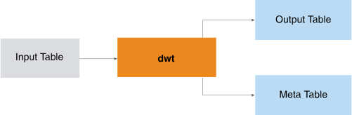

<html><head></head><body>
<h1 class="title topictitle1" id="ariaid-title1">DWT</h1>

The DWT function implements the Mallat algorithm (an iterate algorithm in the Discrete Wavelet Transform field) and applies wavelet transform on multiple sequences simultaneously.

The input is typically a set of time series sequences. You specify the wavelet name or wavelet filter table, transform level, and (optionally) extension mode. The function returns the transformed sequences in Hilbert space with the corresponding component identifiers and indices. (The transformation is also called the decomposition.)

  </img>  

The wavelet filter table does not appear in the preceding diagram because it is seldom used.

You can filter the result to reduce the lengths of the transformed sequences and then use the function <a href="ntt1558468334001.md#xcy1506632882935">IDWT</a> to reconstruct them; therefore, the DWT and IDWT functions are useful for compression and removing noise.

<h2 class="title topictitle2" id="ariaid-title2">DWT Syntax</h2>

<h2 class="title topictitle2" id="ariaid-title3">DWT Syntax Elements</h2>

<dl class="dl parml"><dt class="dt pt dlterm">OutputTable</dt><dd class="dd pd">Specify the name for the table that the function creates to store the coefficients output by the wavelet transform. This table must not exist.</dd><dt class="dt pt dlterm">MetaInformationTable</dt><dd class="dd pd">Specify the name for the table that the function creates to store the meta information for the wavelet transform. This table must not exist.</dd><dt class="dt pt dlterm">TargetColumns</dt><dd class="dd pd">Specify the names of the InputTable columns that contain the data to transform. These columns must contain numeric values between -1e308 and 1e308. The function treats NULL as 0.</dd><dt class="dt pt dlterm">SortColumn</dt><dd class="dd pd">Specify the name of the InputTable column that defines the order of samples in the sequences to transform. In a time series sequence, the column can consist of timestamp values.</dd><dd class="dd pd ddexpand">If <var class="keyword varname">sort_column</var> has duplicate elements in a sequence (that is, in a partition), sequence order can vary, and the function can produce different transform results for the sequence.</dd><dt class="dt pt dlterm">PartitionColumns</dt><dd class="dd pd">[Optional] Specify the names of the InputTable partition columns, which identify the sequences. Rows with the same partition column values belong to the same sequence. If you specify multiple partition columns, the function treats the first one as the distribute key of OutputTable and MetaInformationTable.</dd><dd class="dd pd ddexpand">The DWT output tables are the IDWT input tables. If you specify this syntax element for DWT, you must also specify it for IDWT; otherwise, the results might not make sense.</dd><dd class="dd pd ddexpand">Default behavior: All rows belong to one sequence, and the function creates a distribute key column named dwt_id_<var class="keyword varname">random_name</var> in both the OutputTable and MetaInformationTable. In both tables, every cell of dwt_id_<var class="keyword varname">random_name</var> has the value 1.</dd><dt class="dt pt dlterm">Wavelet</dt><dd class="dd pd">[Required if you omit WaveletFilterTable.] Specify a wavelet filter name from the following table.</dd><dd class="dd pd ddexpand">
<table cellpadding="4" cellspacing="0" summary="" id="pic1506628946514__table_N100DD_N1000C_N10001" class="table" frame="border" border="1" rules="all">

<colgroup span="1"><col style="width:20%" span="1"></col><col style="width:80%" span="1"></col></colgroup><thead class="thead" style="text-align:left;"><tr class="row"><th class="entry nocellnorowborder" style="vertical-align:top;" id="d327091e144" rowspan="1" colspan="1">Wavelet Family</th><th class="entry cell-norowborder" style="vertical-align:top;" id="d327091e146" rowspan="1" colspan="1">Supported Wavelet Names (wavelet values)</th></tr></thead><tbody class="tbody"><tr class="row"><td class="entry nocellnorowborder" style="vertical-align:top;" headers="d327091e144" rowspan="1" colspan="1">Daubechies</td><td class="entry cell-norowborder" style="vertical-align:top;" headers="d327091e146" rowspan="1" colspan="1">'db1' or 'haar', 'db2', .... ,'db10'</td></tr><tr class="row"><td class="entry nocellnorowborder" style="vertical-align:top;" headers="d327091e144" rowspan="1" colspan="1">Coiflets</td><td class="entry cell-norowborder" style="vertical-align:top;" headers="d327091e146" rowspan="1" colspan="1">'coif1', ... , 'coif5'</td></tr><tr class="row"><td class="entry nocellnorowborder" style="vertical-align:top;" headers="d327091e144" rowspan="1" colspan="1">Symlets</td><td class="entry cell-norowborder" style="vertical-align:top;" headers="d327091e146" rowspan="1" colspan="1">'sym1', ... ,' sym10'</td></tr><tr class="row"><td class="entry nocellnorowborder" style="vertical-align:top;" headers="d327091e144" rowspan="1" colspan="1">Discrete Meyer</td><td class="entry cell-norowborder" style="vertical-align:top;" headers="d327091e146" rowspan="1" colspan="1">'dmey'</td></tr><tr class="row"><td class="entry nocellnorowborder" style="vertical-align:top;" headers="d327091e144" rowspan="1" colspan="1">Biorthogonal</td><td class="entry cell-norowborder" style="vertical-align:top;" headers="d327091e146" rowspan="1" colspan="1">'bior1.1', 'bior1.3', 'bior1.5', 'bior2.2', 'bior2.4', 'bior2.6', 'bior2.8', 'bior3.1', 'bior3.3', 'bior3.5', 'bior3.7', 'bior3.9', 'bior4.4', 'bior5.5'</td></tr><tr class="row"><td class="entry row-nocellborder" style="vertical-align:top;" headers="d327091e144" rowspan="1" colspan="1">Reverse Biorthogonal</td><td class="entry cellrowborder" style="vertical-align:top;" headers="d327091e146" rowspan="1" colspan="1">'rbio1.1', 'rbio1.3', 'rbio1.5' 'rbio2.2', 'rbio2.4', 'rbio2.6', 'rbio2.8', 'rbio3.1', 'rbio3.3', 'rbio3.5', 'rbio3.7','rbio3.9', 'rbio4.4', 'rbio5.5'</td></tr></tbody></table>
</dd><dt class="dt pt dlterm">WaveletTransformLevel</dt><dd class="dd pd">Specify the wavelet transform level. The value level must be an integer in the range [1, 1000].</dd><dt class="dt pt dlterm">ExtensionMode</dt><dd class="dd pd">[Optional] Specify the wavelet transform level. The <var class="keyword varname">level</var> must be an integer in the range [1, 1000].</dd><dd class="dd pd ddexpand">

For the examples in the following table, assume that the sequence before the extension is 1 2 3 4 and the convolution kernel in the wavelet filter has the length 6, which means that the length of the sequence is to extend by 5 positions before and after the sequence.

<table cellpadding="4" cellspacing="0" summary="" id="pic1506628946514__table_N1013E_N10138_N1000C_N10001" class="table" frame="border" border="1" rules="all">

<colgroup span="1"><col style="width:33.33333333333333%" span="1"></col><col style="width:66.66666666666666%" span="1"></col></colgroup><thead class="thead" style="text-align:left;"><tr class="row"><th class="entry nocellnorowborder" style="vertical-align:top;" id="d327091e201" rowspan="1" colspan="1">Supported Extension Mode (extension_mode value)</th><th class="entry cell-norowborder" style="vertical-align:top;" id="d327091e203" rowspan="1" colspan="1">Description</th></tr></thead><tbody class="tbody"><tr class="row"><td class="entry nocellnorowborder" style="vertical-align:top;" headers="d327091e201" rowspan="1" colspan="1">sym</td><td class="entry cell-norowborder" style="vertical-align:top;" headers="d327091e203" rowspan="1" colspan="1">(Default) Symmetrically replicate boundary values, mirroring the points near the boundaries. For example:

4 4 3 2 1 | 1 2 3 4 | 4 3 2 1 1
</td></tr><tr class="row"><td class="entry nocellnorowborder" style="vertical-align:top;" headers="d327091e201" rowspan="1" colspan="1">zpd</td><td class="entry cell-norowborder" style="vertical-align:top;" headers="d327091e203" rowspan="1" colspan="1">Zero-pad boundary values with zero. For example:

0 0 0 0 0 | 1 2 3 4 | 0 0 0 0 0
</td></tr><tr class="row"><td class="entry row-nocellborder" style="vertical-align:top;" headers="d327091e201" rowspan="1" colspan="1">ppd</td><td class="entry cellrowborder" style="vertical-align:top;" headers="d327091e203" rowspan="1" colspan="1">Periodic extension, fill boundary values as the input sequence is a periodic one. For example:

4 1 2 3 4 | 1 2 3 4 | 1 2 3 4 1
</td></tr></tbody></table>
</dd></dl>

<h2 class="title topictitle2" id="ariaid-title4">DWT Input</h2>

<table cellpadding="4" cellspacing="0" summary="" id="gzm1506629008899__table_dtv_cdt_wcb" class="table" frame="border" border="1" rules="all">

<colgroup span="1"><col style="width:50%" span="1"></col><col style="width:50%" span="1"></col></colgroup><thead class="thead" style="text-align:left;"><tr class="row"><th class="entry cellrowborder" style="vertical-align:top;" id="d327091e246" rowspan="1" colspan="1">Table</th><th class="entry cellrowborder" style="vertical-align:top;" id="d327091e248" rowspan="1" colspan="1">Description</th></tr></thead><tbody class="tbody"><tr class="row"><td class="entry cellrowborder" style="vertical-align:top;" headers="d327091e246" rowspan="1" colspan="1">InputTable</td><td class="entry cellrowborder" style="vertical-align:top;" headers="d327091e248" rowspan="1" colspan="1">Has at most 1594 columns. Function assumes that each sequence can be fitted into memory of worker.</td></tr><tr class="row"><td class="entry cellrowborder" style="vertical-align:top;" headers="d327091e246" rowspan="1" colspan="1">WaveletFilterTable</td><td class="entry cellrowborder" style="vertical-align:top;" headers="d327091e248" rowspan="1" colspan="1">[Optional] If omitted, you must specify Wavelet syntax element.</td></tr></tbody></table>

<h3 class="title sectiontitle">InputTable Schema</h3>

The table can have additional columns, but the function ignores them.

<table cellpadding="4" cellspacing="0" summary="" id="gzm1506629008899__table_N10017_N1000E_N1000C_N10001" class="table" frame="border" border="1" rules="all">

<colgroup span="1"><col style="width:20%" span="1"></col><col style="width:40%" span="1"></col><col style="width:40%" span="1"></col></colgroup><thead class="thead" style="text-align:left;"><tr class="row"><th class="entry nocellnorowborder" style="vertical-align:top;" id="d327091e276" rowspan="1" colspan="1">Column</th><th class="entry nocellnorowborder" style="vertical-align:top;" id="d327091e278" rowspan="1" colspan="1">Data Type</th><th class="entry cell-norowborder" style="vertical-align:top;" id="d327091e280" rowspan="1" colspan="1">Description</th></tr></thead><tbody class="tbody"><tr class="row"><td class="entry nocellnorowborder" style="vertical-align:top;" headers="d327091e276" rowspan="1" colspan="1"><var class="keyword varname">partition_column</var></td><td class="entry nocellnorowborder" style="vertical-align:top;" headers="d327091e278" rowspan="1" colspan="1">INTEGER, SMALLINT, BIGINT, NUMERIC, VARCHAR, VARBYTE(<var class="keyword varname">n</var>), or BLOB</td><td class="entry cell-norowborder" style="vertical-align:top;" headers="d327091e280" rowspan="1" colspan="1">[Column appears once for each specified <var class="keyword varname">partition_column</var>.] Identifier of sequence to which data belongs. Rows with same partition column values belong to same sequence. If table has multiple partition columns, function treats first one as distribution key of OutputTable and MetaInformationTable.</td></tr><tr class="row"><td class="entry nocellnorowborder" style="vertical-align:top;" headers="d327091e276" rowspan="1" colspan="1"><var class="keyword varname">sort_column</var></td><td class="entry nocellnorowborder" style="vertical-align:top;" headers="d327091e278" rowspan="1" colspan="1">INTEGER, SMALLINT, BIGINT, DOUBLE PRECISION, NUMERIC, TIME, or TIMESTAMP</td><td class="entry cell-norowborder" style="vertical-align:top;" headers="d327091e280" rowspan="1" colspan="1">Position of data in its sequence.</td></tr><tr class="row"><td class="entry row-nocellborder" style="vertical-align:top;" headers="d327091e276" rowspan="1" colspan="1"><var class="keyword varname">target_column</var></td><td class="entry row-nocellborder" style="vertical-align:top;" headers="d327091e278" rowspan="1" colspan="1">INTEGER, SMALLINT, BIGINT, DOUBLE PRECISION, or NUMERIC</td><td class="entry cellrowborder" style="vertical-align:top;" headers="d327091e280" rowspan="1" colspan="1">Data to transform—numeric values between -1e308 and 1e308 (or NULL, which function treats as 0).</td></tr></tbody></table>

<h3 class="title sectiontitle">WaveletFilterTable Schema</h3>
<table cellpadding="4" cellspacing="0" summary="" id="gzm1506629008899__table_N10076_N1000E_N1000C_N10001" class="table" frame="border" border="1" rules="all">

<colgroup span="1"><col style="width:16.666666666666664%" span="1"></col><col style="width:16.666666666666664%" span="1"></col><col style="width:66.66666666666666%" span="1"></col></colgroup><thead class="thead" style="text-align:left;"><tr class="row"><th class="entry nocellnorowborder" style="vertical-align:top;" id="d327091e329" rowspan="1" colspan="1">Column</th><th class="entry nocellnorowborder" style="vertical-align:top;" id="d327091e331" rowspan="1" colspan="1">Data Type</th><th class="entry cell-norowborder" style="vertical-align:top;" id="d327091e333" rowspan="1" colspan="1">Description</th></tr></thead><tbody class="tbody"><tr class="row"><td class="entry nocellnorowborder" style="vertical-align:top;" headers="d327091e329" rowspan="1" colspan="1">filtername</td><td class="entry nocellnorowborder" style="vertical-align:top;" headers="d327091e331" rowspan="1" colspan="1">VARCHAR</td><td class="entry cell-norowborder" style="vertical-align:top;" headers="d327091e333" rowspan="1" colspan="1">Wave filtername from following table.</td></tr><tr class="row"><td class="entry row-nocellborder" style="vertical-align:top;" headers="d327091e329" rowspan="1" colspan="1">filtervalue</td><td class="entry row-nocellborder" style="vertical-align:top;" headers="d327091e331" rowspan="1" colspan="1">VARCHAR</td><td class="entry cellrowborder" style="vertical-align:top;" headers="d327091e333" rowspan="1" colspan="1">Decomposed or reconstructed wavelet filter, represented as comma-separated sequence; conjugated scale coefficients for orthogonal wavelet. For details, see following table.</td></tr></tbody></table>

<h3 class="title sectiontitle">WaveletFilterTable Names and Values</h3>
<table cellpadding="4" cellspacing="0" summary="" id="gzm1506629008899__table_N100BF_N1000E_N1000C_N10001" class="table" frame="border" border="1" rules="all">

<colgroup span="1"><col style="width:16.666666666666664%" span="1"></col><col style="width:83.33333333333334%" span="1"></col></colgroup><thead class="thead" style="text-align:left;"><tr class="row"><th class="entry nocellnorowborder" style="vertical-align:top;" id="d327091e359" rowspan="1" colspan="1">filtername</th><th class="entry cell-norowborder" style="vertical-align:top;" id="d327091e361" rowspan="1" colspan="1">filtervalue</th></tr></thead><tbody class="tbody"><tr class="row"><td class="entry nocellnorowborder" style="vertical-align:top;" headers="d327091e359" rowspan="1" colspan="1">lowpassfilter</td><td class="entry cell-norowborder" style="vertical-align:top;" headers="d327091e361" rowspan="1" colspan="1">Decomposed low-pass filter, represented as comma-separated sequence; conjugated scale coefficients for orthogonal wavelet. For example:

-0.1294095225512604, 0.2241438680420134, 0.8365163037378081, 0.4829629131445342
</td></tr><tr class="row"><td class="entry nocellnorowborder" style="vertical-align:top;" headers="d327091e359" rowspan="1" colspan="1">highpassfilter</td><td class="entry cell-norowborder" style="vertical-align:top;" headers="d327091e361" rowspan="1" colspan="1">Decomposed high-pass filter, represented as comma-separated sequence; conjugated wavelet coefficients for orthogonal wavelet. For example:

-0.4829629131445342, 0.8365163037378081, -0.2241438680420134, -0.1294095225512604
</td></tr><tr class="row"><td class="entry nocellnorowborder" style="vertical-align:top;" headers="d327091e359" rowspan="1" colspan="1">ilowpassfilter</td><td class="entry cell-norowborder" style="vertical-align:top;" headers="d327091e361" rowspan="1" colspan="1">Reconstructed low-pass filter, represented as comma-separated sequence; scale coefficients for orthogonal wavelet. For example:

0.4829629131445342, 0.8365163037378081, 0.2241438680420134, -0.1294095225512604
</td></tr><tr class="row"><td class="entry row-nocellborder" style="vertical-align:top;" headers="d327091e359" rowspan="1" colspan="1">ihighpassfilter</td><td class="entry cellrowborder" style="vertical-align:top;" headers="d327091e361" rowspan="1" colspan="1">Reconstructed high-pass filter, represented as comma-separated sequence; wavelet coefficients for orthogonal wavelet. For example:

-0.1294095225512604, -0.2241438680420134, 0.8365163037378081, -0.4829629131445342
</td></tr></tbody></table>

<h2 class="title topictitle2" id="ariaid-title5">DWT Output</h2>

<h3 class="title sectiontitle">Output Message Schema</h3>
<table cellpadding="4" cellspacing="0" summary="" id="sns1506629090993__table_N10014_N1000E_N1000C_N10001" class="table" frame="border" border="1" rules="all">

<colgroup span="1"><col style="width:20%" span="1"></col><col style="width:16%" span="1"></col><col style="width:64%" span="1"></col></colgroup><thead class="thead" style="text-align:left;"><tr class="row"><th class="entry nocellnorowborder" style="vertical-align:top;" id="d327091e411" rowspan="1" colspan="1">Column</th><th class="entry nocellnorowborder" style="vertical-align:top;" id="d327091e413" rowspan="1" colspan="1">Data Type</th><th class="entry cell-norowborder" style="vertical-align:top;" id="d327091e415" rowspan="1" colspan="1">Description</th></tr></thead><tbody class="tbody"><tr class="row"><td class="entry row-nocellborder" style="vertical-align:top;" headers="d327091e411" rowspan="1" colspan="1">messages</td><td class="entry row-nocellborder" style="vertical-align:top;" headers="d327091e413" rowspan="1" colspan="1">VARCHAR</td><td class="entry cellrowborder" style="vertical-align:top;" headers="d327091e415" rowspan="1" colspan="1">Reports whether function succeeded.</td></tr></tbody></table>

<h3 class="title sectiontitle">OutputTable Schema</h3>

The table has decomposed sequences.

<table cellpadding="4" cellspacing="0" summary="" id="sns1506629090993__table_N10049_N1000E_N1000C_N10001" class="table" frame="border" border="1" rules="all">

<colgroup span="1"><col style="width:28.57142857142857%" span="1"></col><col style="width:14.285714285714285%" span="1"></col><col style="width:57.14285714285714%" span="1"></col></colgroup><thead class="thead" style="text-align:left;"><tr class="row"><th class="entry nocellnorowborder" style="vertical-align:top;" id="d327091e437" rowspan="1" colspan="1">Column</th><th class="entry nocellnorowborder" style="vertical-align:top;" id="d327091e439" rowspan="1" colspan="1">Data Type</th><th class="entry cell-norowborder" style="vertical-align:top;" id="d327091e441" rowspan="1" colspan="1">Description</th></tr></thead><tbody class="tbody"><tr class="row"><td class="entry nocellnorowborder" style="vertical-align:top;" headers="d327091e437" rowspan="1" colspan="1"><var class="keyword varname">partition_column</var></td><td class="entry nocellnorowborder" style="vertical-align:top;" headers="d327091e439" rowspan="1" colspan="1">Same as in Input table</td><td class="entry cell-norowborder" style="vertical-align:top;" headers="d327091e441" rowspan="1" colspan="1">[Column appears once for each specified <var class="keyword varname">partition_column</var>.] Identifier of sequence to which data belongs. Rows with same partition column values belong to same sequence.

If InputTable has multiple partition columns, first one is distribution key in both InputTable and OutputTable.

If InputTable has only one partition column, OutputTable has as its distribution key a function-created column named dwt_id_<var class="keyword varname">random_name</var>. Every cell of dwt_id_<var class="keyword varname">random_name</var> has the value 1.
</td></tr><tr class="row"><td class="entry nocellnorowborder" style="vertical-align:top;" headers="d327091e437" rowspan="1" colspan="1">waveletid</td><td class="entry nocellnorowborder" style="vertical-align:top;" headers="d327091e439" rowspan="1" colspan="1">INTEGER</td><td class="entry cell-norowborder" style="vertical-align:top;" headers="d327091e441" rowspan="1" colspan="1">Index of each wavelet coefficient (starting from 1 for each sequence).</td></tr><tr class="row"><td class="entry nocellnorowborder" style="vertical-align:top;" headers="d327091e437" rowspan="1" colspan="1">waveletcomponent</td><td class="entry nocellnorowborder" style="vertical-align:top;" headers="d327091e439" rowspan="1" colspan="1">VARCHAR</td><td class="entry cell-norowborder" style="vertical-align:top;" headers="d327091e441" rowspan="1" colspan="1">Component to which coefficient belongs. Possible values are <var class="keyword varname">A</var>n<var class="keyword varname">, D</var>n<var class="keyword varname">, D</var>n-1<var class="keyword varname">, ..., D</var>1, where <var class="keyword varname">n</var> is wavelet transform level.</td></tr><tr class="row"><td class="entry row-nocellborder" style="vertical-align:top;" headers="d327091e437" rowspan="1" colspan="1"><var class="keyword varname">target_column</var></td><td class="entry row-nocellborder" style="vertical-align:top;" headers="d327091e439" rowspan="1" colspan="1">DOUBLE PRECISION</td><td class="entry cellrowborder" style="vertical-align:top;" headers="d327091e441" rowspan="1" colspan="1">[Column appears once for each <var class="keyword varname">target_column</var>.] Coefficient of input column after wavelet transform.</td></tr></tbody></table>

<h3 class="title sectiontitle">MetaInformationTable Schema</h3>
<table cellpadding="4" cellspacing="0" summary="" id="sns1506629090993__table_N100ED_N1000E_N1000C_N10001" class="table" frame="border" border="1" rules="all">

<colgroup span="1"><col style="width:28.57142857142857%" span="1"></col><col style="width:14.285714285714285%" span="1"></col><col style="width:57.14285714285714%" span="1"></col></colgroup><thead class="thead" style="text-align:left;"><tr class="row"><th class="entry nocellnorowborder" style="vertical-align:top;" id="d327091e521" rowspan="1" colspan="1">Column</th><th class="entry nocellnorowborder" style="vertical-align:top;" id="d327091e523" rowspan="1" colspan="1">Data Type</th><th class="entry cell-norowborder" style="vertical-align:top;" id="d327091e525" rowspan="1" colspan="1">Description</th></tr></thead><tbody class="tbody"><tr class="row"><td class="entry nocellnorowborder" style="vertical-align:top;" headers="d327091e521" rowspan="1" colspan="1"><var class="keyword varname">partition_column</var></td><td class="entry nocellnorowborder" style="vertical-align:top;" headers="d327091e523" rowspan="1" colspan="1">Same as in Input table</td><td class="entry cell-norowborder" style="vertical-align:top;" headers="d327091e525" rowspan="1" colspan="1">[Column appears once for each specified <var class="keyword varname">partition_column</var>.] Identifier of sequence to which data belongs. Rows with same partition column values belong to same sequence.

If InputTable has multiple partition columns, first one is distribution key in both InputTable and OutputTable.

If InputTable has only one partition column, OutputTable has as its distribution key a function-created column named dwt_id_<var class="keyword varname">random_name</var>. Every cell of dwt_id_<var class="keyword varname">random_name</var> has the value 1.
</td></tr><tr class="row"><td class="entry nocellnorowborder" style="vertical-align:top;" headers="d327091e521" rowspan="1" colspan="1">meta</td><td class="entry nocellnorowborder" style="vertical-align:top;" headers="d327091e523" rowspan="1" colspan="1">VARCHAR</td><td class="entry cell-norowborder" style="vertical-align:top;" headers="d327091e525" rowspan="1" colspan="1">Name from meta column of following table.</td></tr><tr class="row"><td class="entry row-nocellborder" style="vertical-align:top;" headers="d327091e521" rowspan="1" colspan="1">content</td><td class="entry row-nocellborder" style="vertical-align:top;" headers="d327091e523" rowspan="1" colspan="1">VARCHAR</td><td class="entry cellrowborder" style="vertical-align:top;" headers="d327091e525" rowspan="1" colspan="1">Content from content column of following table.</td></tr></tbody></table>

<h3 class="title sectiontitle">Meta Information for Each Sequence</h3>

<table cellpadding="4" cellspacing="0" summary="" id="sns1506629090993__table_N10160_N1000E_N1000C_N10001" class="table" frame="border" border="1" rules="all">

<colgroup span="1"><col style="width:20%" span="1"></col><col style="width:80%" span="1"></col></colgroup><thead class="thead" style="text-align:left;"><tr class="row"><th class="entry nocellnorowborder" style="vertical-align:top;" id="d327091e574" rowspan="1" colspan="1">meta</th><th class="entry cell-norowborder" style="vertical-align:top;" id="d327091e576" rowspan="1" colspan="1">content</th></tr></thead><tbody class="tbody"><tr class="row"><td class="entry nocellnorowborder" style="vertical-align:top;" headers="d327091e574" rowspan="1" colspan="1">blocklength</td><td class="entry cell-norowborder" style="vertical-align:top;" headers="d327091e576" rowspan="1" colspan="1">Length of each component after transformation, from <var class="keyword varname">A</var>n to <var class="keyword varname">D</var>1. Example: 8, 8, 13</td></tr><tr class="row"><td class="entry nocellnorowborder" style="vertical-align:top;" headers="d327091e574" rowspan="1" colspan="1">length</td><td class="entry cell-norowborder" style="vertical-align:top;" headers="d327091e576" rowspan="1" colspan="1">Length of sequence before transformation. Example: 24</td></tr><tr class="row"><td class="entry nocellnorowborder" style="vertical-align:top;" headers="d327091e574" rowspan="1" colspan="1">waveletname</td><td class="entry cell-norowborder" style="vertical-align:top;" headers="d327091e576" rowspan="1" colspan="1">Name of wavelet used in transformation. Example: db2</td></tr><tr class="row"><td class="entry nocellnorowborder" style="vertical-align:top;" headers="d327091e574" rowspan="1" colspan="1">lowpassfilter</td><td class="entry cell-norowborder" style="vertical-align:top;" headers="d327091e576" rowspan="1" colspan="1">Low-pass filter used in wavelet decomposition.</td></tr><tr class="row"><td class="entry nocellnorowborder" style="vertical-align:top;" headers="d327091e574" rowspan="1" colspan="1">highpassfilter</td><td class="entry cell-norowborder" style="vertical-align:top;" headers="d327091e576" rowspan="1" colspan="1">High-pass filter used in wavelet decomposition.</td></tr><tr class="row"><td class="entry nocellnorowborder" style="vertical-align:top;" headers="d327091e574" rowspan="1" colspan="1">ilowpassfilter</td><td class="entry cell-norowborder" style="vertical-align:top;" headers="d327091e576" rowspan="1" colspan="1">Low-pass filter used in wavelet reconstruction.</td></tr><tr class="row"><td class="entry nocellnorowborder" style="vertical-align:top;" headers="d327091e574" rowspan="1" colspan="1">ihighpassfilter</td><td class="entry cell-norowborder" style="vertical-align:top;" headers="d327091e576" rowspan="1" colspan="1">High-pass filter used in wavelet reconstruction.</td></tr><tr class="row"><td class="entry nocellnorowborder" style="vertical-align:top;" headers="d327091e574" rowspan="1" colspan="1">level</td><td class="entry cell-norowborder" style="vertical-align:top;" headers="d327091e576" rowspan="1" colspan="1">Level of wavelet transform.</td></tr><tr class="row"><td class="entry row-nocellborder" style="vertical-align:top;" headers="d327091e574" rowspan="1" colspan="1">extensionmode</td><td class="entry cellrowborder" style="vertical-align:top;" headers="d327091e576" rowspan="1" colspan="1">Extension mode used in wavelet transform.</td></tr></tbody></table>

<h2 class="title topictitle2" id="ariaid-title6">DWT Example</h2>

This example uses hourly climate data for five cities (Asheville, Greenville, Brownsville, Nashville and Knoxville) on a given day. The data are temperature (in degrees Fahrenheit), pressure (in mbars), and dewpoint (in degrees Fahrenheit). The function creates the coefficient model table and the meta table, which are used as input to the function <a href="ntt1558468334001.md#xcy1506632882935">IDWT</a>.

<h3 class="title sectiontitle">Input</h3>
<table cellpadding="4" cellspacing="0" summary="" id="jqm1506629299458__table_adc_3py_m2b" class="table" frame="border" border="1" rules="all">
InputTable: ville_climatedata
<colgroup span="1"><col style="width:20%" span="1"></col><col style="width:20%" span="1"></col><col style="width:20%" span="1"></col><col style="width:20%" span="1"></col><col style="width:20%" span="1"></col></colgroup><thead class="thead" style="text-align:left;"><tr class="row"><th class="entry cellrowborder" style="vertical-align:top;" id="d327091e680" rowspan="1" colspan="1">city</th><th class="entry cellrowborder" style="vertical-align:top;" id="d327091e682" rowspan="1" colspan="1">period</th><th class="entry cellrowborder" style="vertical-align:top;" id="d327091e684" rowspan="1" colspan="1">temp_f</th><th class="entry cellrowborder" style="vertical-align:top;" id="d327091e686" rowspan="1" colspan="1">pressure_mbar</th><th class="entry cellrowborder" style="vertical-align:top;" id="d327091e688" rowspan="1" colspan="1">dewpoint_f</th></tr></thead><tbody class="tbody"><tr class="row"><td class="entry cellrowborder" style="vertical-align:top;" headers="d327091e680" rowspan="1" colspan="1">Asheville</td><td class="entry cellrowborder" style="vertical-align:top;" headers="d327091e682" rowspan="1" colspan="1">2010-01-01 00:00:00</td><td class="entry cellrowborder" style="vertical-align:top;" headers="d327091e684" rowspan="1" colspan="1">34.9</td><td class="entry cellrowborder" style="vertical-align:top;" headers="d327091e686" rowspan="1" colspan="1">1020.5</td><td class="entry cellrowborder" style="vertical-align:top;" headers="d327091e688" rowspan="1" colspan="1">28.9</td></tr><tr class="row"><td class="entry cellrowborder" style="vertical-align:top;" headers="d327091e680" rowspan="1" colspan="1">Asheville</td><td class="entry cellrowborder" style="vertical-align:top;" headers="d327091e682" rowspan="1" colspan="1">2010-01-01 01:00:00</td><td class="entry cellrowborder" style="vertical-align:top;" headers="d327091e684" rowspan="1" colspan="1">34.4</td><td class="entry cellrowborder" style="vertical-align:top;" headers="d327091e686" rowspan="1" colspan="1">1020.2</td><td class="entry cellrowborder" style="vertical-align:top;" headers="d327091e688" rowspan="1" colspan="1">28.7</td></tr><tr class="row"><td class="entry cellrowborder" style="vertical-align:top;" headers="d327091e680" rowspan="1" colspan="1">Asheville</td><td class="entry cellrowborder" style="vertical-align:top;" headers="d327091e682" rowspan="1" colspan="1">2010-01-01 02:00:00</td><td class="entry cellrowborder" style="vertical-align:top;" headers="d327091e684" rowspan="1" colspan="1">33.9</td><td class="entry cellrowborder" style="vertical-align:top;" headers="d327091e686" rowspan="1" colspan="1">1020</td><td class="entry cellrowborder" style="vertical-align:top;" headers="d327091e688" rowspan="1" colspan="1">28.4</td></tr><tr class="row"><td class="entry cellrowborder" style="vertical-align:top;" headers="d327091e680" rowspan="1" colspan="1">Asheville</td><td class="entry cellrowborder" style="vertical-align:top;" headers="d327091e682" rowspan="1" colspan="1">2010-01-01 03:00:00</td><td class="entry cellrowborder" style="vertical-align:top;" headers="d327091e684" rowspan="1" colspan="1">33.4</td><td class="entry cellrowborder" style="vertical-align:top;" headers="d327091e686" rowspan="1" colspan="1">1020.2</td><td class="entry cellrowborder" style="vertical-align:top;" headers="d327091e688" rowspan="1" colspan="1">28.3</td></tr><tr class="row"><td class="entry cellrowborder" style="vertical-align:top;" headers="d327091e680" rowspan="1" colspan="1">Asheville</td><td class="entry cellrowborder" style="vertical-align:top;" headers="d327091e682" rowspan="1" colspan="1">2010-01-01 04:00:00</td><td class="entry cellrowborder" style="vertical-align:top;" headers="d327091e684" rowspan="1" colspan="1">33.1</td><td class="entry cellrowborder" style="vertical-align:top;" headers="d327091e686" rowspan="1" colspan="1">1020.2</td><td class="entry cellrowborder" style="vertical-align:top;" headers="d327091e688" rowspan="1" colspan="1">28</td></tr><tr class="row"><td class="entry cellrowborder" style="vertical-align:top;" headers="d327091e680" rowspan="1" colspan="1">Asheville</td><td class="entry cellrowborder" style="vertical-align:top;" headers="d327091e682" rowspan="1" colspan="1">2010-01-01 05:00:00</td><td class="entry cellrowborder" style="vertical-align:top;" headers="d327091e684" rowspan="1" colspan="1">32.7</td><td class="entry cellrowborder" style="vertical-align:top;" headers="d327091e686" rowspan="1" colspan="1">1020</td><td class="entry cellrowborder" style="vertical-align:top;" headers="d327091e688" rowspan="1" colspan="1">27.9</td></tr><tr class="row"><td class="entry cellrowborder" style="vertical-align:top;" headers="d327091e680" rowspan="1" colspan="1">Asheville</td><td class="entry cellrowborder" style="vertical-align:top;" headers="d327091e682" rowspan="1" colspan="1">2010-01-01 06:00:00</td><td class="entry cellrowborder" style="vertical-align:top;" headers="d327091e684" rowspan="1" colspan="1">32.5</td><td class="entry cellrowborder" style="vertical-align:top;" headers="d327091e686" rowspan="1" colspan="1">1020.3</td><td class="entry cellrowborder" style="vertical-align:top;" headers="d327091e688" rowspan="1" colspan="1">27.7</td></tr><tr class="row"><td class="entry cellrowborder" style="vertical-align:top;" headers="d327091e680" rowspan="1" colspan="1">Asheville</td><td class="entry cellrowborder" style="vertical-align:top;" headers="d327091e682" rowspan="1" colspan="1">2010-01-01 07:00:00</td><td class="entry cellrowborder" style="vertical-align:top;" headers="d327091e684" rowspan="1" colspan="1">32.3</td><td class="entry cellrowborder" style="vertical-align:top;" headers="d327091e686" rowspan="1" colspan="1">1020.8</td><td class="entry cellrowborder" style="vertical-align:top;" headers="d327091e688" rowspan="1" colspan="1">27.6</td></tr><tr class="row"><td class="entry cellrowborder" style="vertical-align:top;" headers="d327091e680" rowspan="1" colspan="1">Asheville</td><td class="entry cellrowborder" style="vertical-align:top;" headers="d327091e682" rowspan="1" colspan="1">2010-01-01 08:00:00</td><td class="entry cellrowborder" style="vertical-align:top;" headers="d327091e684" rowspan="1" colspan="1">32.1</td><td class="entry cellrowborder" style="vertical-align:top;" headers="d327091e686" rowspan="1" colspan="1">1021.3</td><td class="entry cellrowborder" style="vertical-align:top;" headers="d327091e688" rowspan="1" colspan="1">27.4</td></tr><tr class="row"><td class="entry cellrowborder" style="vertical-align:top;" headers="d327091e680" rowspan="1" colspan="1">Asheville</td><td class="entry cellrowborder" style="vertical-align:top;" headers="d327091e682" rowspan="1" colspan="1">2010-01-01 09:00:00</td><td class="entry cellrowborder" style="vertical-align:top;" headers="d327091e684" rowspan="1" colspan="1">33.8</td><td class="entry cellrowborder" style="vertical-align:top;" headers="d327091e686" rowspan="1" colspan="1">1021.7</td><td class="entry cellrowborder" style="vertical-align:top;" headers="d327091e688" rowspan="1" colspan="1">28.2</td></tr><tr class="row"><td class="entry cellrowborder" style="vertical-align:top;" headers="d327091e680" rowspan="1" colspan="1">Asheville</td><td class="entry cellrowborder" style="vertical-align:top;" headers="d327091e682" rowspan="1" colspan="1">2010-01-01 10:00:00</td><td class="entry cellrowborder" style="vertical-align:top;" headers="d327091e684" rowspan="1" colspan="1">36.4</td><td class="entry cellrowborder" style="vertical-align:top;" headers="d327091e686" rowspan="1" colspan="1">1022.1</td><td class="entry cellrowborder" style="vertical-align:top;" headers="d327091e688" rowspan="1" colspan="1">28.9</td></tr><tr class="row"><td class="entry cellrowborder" style="vertical-align:top;" headers="d327091e680" rowspan="1" colspan="1">Asheville</td><td class="entry cellrowborder" style="vertical-align:top;" headers="d327091e682" rowspan="1" colspan="1">2010-01-01 11:00:00</td><td class="entry cellrowborder" style="vertical-align:top;" headers="d327091e684" rowspan="1" colspan="1">39.4</td><td class="entry cellrowborder" style="vertical-align:top;" headers="d327091e686" rowspan="1" colspan="1">1022</td><td class="entry cellrowborder" style="vertical-align:top;" headers="d327091e688" rowspan="1" colspan="1">29.3</td></tr><tr class="row"><td class="entry cellrowborder" style="vertical-align:top;" headers="d327091e680" rowspan="1" colspan="1">Asheville</td><td class="entry cellrowborder" style="vertical-align:top;" headers="d327091e682" rowspan="1" colspan="1">2010-01-01 12:00:00</td><td class="entry cellrowborder" style="vertical-align:top;" headers="d327091e684" rowspan="1" colspan="1">42.1</td><td class="entry cellrowborder" style="vertical-align:top;" headers="d327091e686" rowspan="1" colspan="1">1021.1</td><td class="entry cellrowborder" style="vertical-align:top;" headers="d327091e688" rowspan="1" colspan="1">29.2</td></tr><tr class="row"><td class="entry cellrowborder" style="vertical-align:top;" headers="d327091e680" rowspan="1" colspan="1">Asheville</td><td class="entry cellrowborder" style="vertical-align:top;" headers="d327091e682" rowspan="1" colspan="1">2010-01-01 13:00:00</td><td class="entry cellrowborder" style="vertical-align:top;" headers="d327091e684" rowspan="1" colspan="1">44.2</td><td class="entry cellrowborder" style="vertical-align:top;" headers="d327091e686" rowspan="1" colspan="1">1020</td><td class="entry cellrowborder" style="vertical-align:top;" headers="d327091e688" rowspan="1" colspan="1">29.1</td></tr><tr class="row"><td class="entry cellrowborder" style="vertical-align:top;" headers="d327091e680" rowspan="1" colspan="1">Asheville</td><td class="entry cellrowborder" style="vertical-align:top;" headers="d327091e682" rowspan="1" colspan="1">2010-01-01 14:00:00</td><td class="entry cellrowborder" style="vertical-align:top;" headers="d327091e684" rowspan="1" colspan="1">45.6</td><td class="entry cellrowborder" style="vertical-align:top;" headers="d327091e686" rowspan="1" colspan="1">1019.3</td><td class="entry cellrowborder" style="vertical-align:top;" headers="d327091e688" rowspan="1" colspan="1">28.9</td></tr><tr class="row"><td class="entry cellrowborder" style="vertical-align:top;" headers="d327091e680" rowspan="1" colspan="1">Asheville</td><td class="entry cellrowborder" style="vertical-align:top;" headers="d327091e682" rowspan="1" colspan="1">2010-01-01 15:00:00</td><td class="entry cellrowborder" style="vertical-align:top;" headers="d327091e684" rowspan="1" colspan="1">46.2</td><td class="entry cellrowborder" style="vertical-align:top;" headers="d327091e686" rowspan="1" colspan="1">1019</td><td class="entry cellrowborder" style="vertical-align:top;" headers="d327091e688" rowspan="1" colspan="1">28.5</td></tr><tr class="row"><td class="entry cellrowborder" style="vertical-align:top;" headers="d327091e680" rowspan="1" colspan="1">Asheville</td><td class="entry cellrowborder" style="vertical-align:top;" headers="d327091e682" rowspan="1" colspan="1">2010-01-01 16:00:00</td><td class="entry cellrowborder" style="vertical-align:top;" headers="d327091e684" rowspan="1" colspan="1">45.8</td><td class="entry cellrowborder" style="vertical-align:top;" headers="d327091e686" rowspan="1" colspan="1">1019.2</td><td class="entry cellrowborder" style="vertical-align:top;" headers="d327091e688" rowspan="1" colspan="1">28.5</td></tr><tr class="row"><td class="entry cellrowborder" style="vertical-align:top;" headers="d327091e680" rowspan="1" colspan="1">Asheville</td><td class="entry cellrowborder" style="vertical-align:top;" headers="d327091e682" rowspan="1" colspan="1">2010-01-01 17:00:00</td><td class="entry cellrowborder" style="vertical-align:top;" headers="d327091e684" rowspan="1" colspan="1">44.1</td><td class="entry cellrowborder" style="vertical-align:top;" headers="d327091e686" rowspan="1" colspan="1">1019.6</td><td class="entry cellrowborder" style="vertical-align:top;" headers="d327091e688" rowspan="1" colspan="1">28.6</td></tr><tr class="row"><td class="entry cellrowborder" style="vertical-align:top;" headers="d327091e680" rowspan="1" colspan="1">Asheville</td><td class="entry cellrowborder" style="vertical-align:top;" headers="d327091e682" rowspan="1" colspan="1">2010-01-01 18:00:00</td><td class="entry cellrowborder" style="vertical-align:top;" headers="d327091e684" rowspan="1" colspan="1">41.2</td><td class="entry cellrowborder" style="vertical-align:top;" headers="d327091e686" rowspan="1" colspan="1">1020.1</td><td class="entry cellrowborder" style="vertical-align:top;" headers="d327091e688" rowspan="1" colspan="1">28.5</td></tr><tr class="row"><td class="entry cellrowborder" style="vertical-align:top;" headers="d327091e680" rowspan="1" colspan="1">Asheville</td><td class="entry cellrowborder" style="vertical-align:top;" headers="d327091e682" rowspan="1" colspan="1">2010-01-01 19:00:00</td><td class="entry cellrowborder" style="vertical-align:top;" headers="d327091e684" rowspan="1" colspan="1">39.6</td><td class="entry cellrowborder" style="vertical-align:top;" headers="d327091e686" rowspan="1" colspan="1">1020.6</td><td class="entry cellrowborder" style="vertical-align:top;" headers="d327091e688" rowspan="1" colspan="1">28.8</td></tr><tr class="row"><td class="entry cellrowborder" style="vertical-align:top;" headers="d327091e680" rowspan="1" colspan="1">Asheville</td><td class="entry cellrowborder" style="vertical-align:top;" headers="d327091e682" rowspan="1" colspan="1">2010-01-01 20:00:00</td><td class="entry cellrowborder" style="vertical-align:top;" headers="d327091e684" rowspan="1" colspan="1">38.2</td><td class="entry cellrowborder" style="vertical-align:top;" headers="d327091e686" rowspan="1" colspan="1">1020.9</td><td class="entry cellrowborder" style="vertical-align:top;" headers="d327091e688" rowspan="1" colspan="1">29</td></tr><tr class="row"><td class="entry cellrowborder" style="vertical-align:top;" headers="d327091e680" rowspan="1" colspan="1">Asheville</td><td class="entry cellrowborder" style="vertical-align:top;" headers="d327091e682" rowspan="1" colspan="1">2010-01-01 21:00:00</td><td class="entry cellrowborder" style="vertical-align:top;" headers="d327091e684" rowspan="1" colspan="1">37.2</td><td class="entry cellrowborder" style="vertical-align:top;" headers="d327091e686" rowspan="1" colspan="1">1021.1</td><td class="entry cellrowborder" style="vertical-align:top;" headers="d327091e688" rowspan="1" colspan="1">29</td></tr><tr class="row"><td class="entry cellrowborder" style="vertical-align:top;" headers="d327091e680" rowspan="1" colspan="1">Asheville</td><td class="entry cellrowborder" style="vertical-align:top;" headers="d327091e682" rowspan="1" colspan="1">2010-01-01 22:00:00</td><td class="entry cellrowborder" style="vertical-align:top;" headers="d327091e684" rowspan="1" colspan="1">36.3</td><td class="entry cellrowborder" style="vertical-align:top;" headers="d327091e686" rowspan="1" colspan="1">1021</td><td class="entry cellrowborder" style="vertical-align:top;" headers="d327091e688" rowspan="1" colspan="1">29</td></tr><tr class="row"><td class="entry cellrowborder" style="vertical-align:top;" headers="d327091e680" rowspan="1" colspan="1">Asheville</td><td class="entry cellrowborder" style="vertical-align:top;" headers="d327091e682" rowspan="1" colspan="1">2010-01-01 23:00:00</td><td class="entry cellrowborder" style="vertical-align:top;" headers="d327091e684" rowspan="1" colspan="1">35.5</td><td class="entry cellrowborder" style="vertical-align:top;" headers="d327091e686" rowspan="1" colspan="1">1020.9</td><td class="entry cellrowborder" style="vertical-align:top;" headers="d327091e688" rowspan="1" colspan="1">29</td></tr><tr class="row"><td class="entry cellrowborder" style="vertical-align:top;" headers="d327091e680" rowspan="1" colspan="1">Brownsville</td><td class="entry cellrowborder" style="vertical-align:top;" headers="d327091e682" rowspan="1" colspan="1">2010-01-01 00:00:00</td><td class="entry cellrowborder" style="vertical-align:top;" headers="d327091e684" rowspan="1" colspan="1">35.1</td><td class="entry cellrowborder" style="vertical-align:top;" headers="d327091e686" rowspan="1" colspan="1">1020.5</td><td class="entry cellrowborder" style="vertical-align:top;" headers="d327091e688" rowspan="1" colspan="1">28.9</td></tr><tr class="row"><td class="entry cellrowborder" style="vertical-align:top;" headers="d327091e680" rowspan="1" colspan="1">Brownsville</td><td class="entry cellrowborder" style="vertical-align:top;" headers="d327091e682" rowspan="1" colspan="1">2010-01-01 01:00:00</td><td class="entry cellrowborder" style="vertical-align:top;" headers="d327091e684" rowspan="1" colspan="1">34.6</td><td class="entry cellrowborder" style="vertical-align:top;" headers="d327091e686" rowspan="1" colspan="1">1020.2</td><td class="entry cellrowborder" style="vertical-align:top;" headers="d327091e688" rowspan="1" colspan="1">28.8</td></tr><tr class="row"><td class="entry cellrowborder" style="vertical-align:top;" headers="d327091e680" rowspan="1" colspan="1">Brownsville</td><td class="entry cellrowborder" style="vertical-align:top;" headers="d327091e682" rowspan="1" colspan="1">2010-01-01 02:00:00</td><td class="entry cellrowborder" style="vertical-align:top;" headers="d327091e684" rowspan="1" colspan="1">34.1</td><td class="entry cellrowborder" style="vertical-align:top;" headers="d327091e686" rowspan="1" colspan="1">1020</td><td class="entry cellrowborder" style="vertical-align:top;" headers="d327091e688" rowspan="1" colspan="1">28.5</td></tr><tr class="row"><td class="entry cellrowborder" style="vertical-align:top;" headers="d327091e680" rowspan="1" colspan="1">Brownsville</td><td class="entry cellrowborder" style="vertical-align:top;" headers="d327091e682" rowspan="1" colspan="1">2010-01-01 03:00:00</td><td class="entry cellrowborder" style="vertical-align:top;" headers="d327091e684" rowspan="1" colspan="1">33.7</td><td class="entry cellrowborder" style="vertical-align:top;" headers="d327091e686" rowspan="1" colspan="1">1020.1</td><td class="entry cellrowborder" style="vertical-align:top;" headers="d327091e688" rowspan="1" colspan="1">28.4</td></tr><tr class="row"><td class="entry cellrowborder" style="vertical-align:top;" headers="d327091e680" rowspan="1" colspan="1">...</td><td class="entry cellrowborder" style="vertical-align:top;" headers="d327091e682" rowspan="1" colspan="1">...</td><td class="entry cellrowborder" style="vertical-align:top;" headers="d327091e684" rowspan="1" colspan="1">...</td><td class="entry cellrowborder" style="vertical-align:top;" headers="d327091e686" rowspan="1" colspan="1">...</td><td class="entry cellrowborder" style="vertical-align:top;" headers="d327091e688" rowspan="1" colspan="1">...</td></tr></tbody></table>

<h3 class="title sectiontitle">SQL Call</h3><pre class="pre codeblock" xml:space="preserve"><code>SELECT * FROM DWT (
  ON ville_climatedata AS InputTable
  OUT TABLE OutputTable (dwt_coef_table)
  OUT TABLE MetaInformationTable (dwt_meta_table)
  USING
  TargetColumns ('temp_f', 'pressure_mbar', 'dewpoint_f')
  SortColumn ('period')
  PartitionColumns ('city')
  Wavelet ('db2')
  WaveletTransformLevel (2)
) AS dt;</code></pre>

<h3 class="title sectiontitle">Output</h3><pre class="pre screen" xml:space="preserve"> messages                   
 -------------------------- 
 Dwt finished successfully!</pre><pre class="pre codeblock" xml:space="preserve"><code>SELECT * FROM dwt_coef_table ORDER BY city, waveletid, waveletcomponent;</code></pre><pre class="pre screen" xml:space="preserve"> city        waveletid waveletcomponent temp_f                  pressure_mbar          dewpoint_f             
 ----------- --------- ---------------- ----------------------- ---------------------- ---------------------- 
 asheville           1 A2                     69.45400635094613     2040.7728765877373      57.65367785792577
 asheville           2 A2                     69.30023184096771     2040.6503284930213      57.59180262661559
 asheville           3 A2                      65.9380131645126      2040.058678320547     56.005921506979654
 asheville           4 A2                     65.36879316306577     2042.9121070722786      55.77428721187067
 asheville           5 A2                     84.14229220639045      2041.646914693414      58.26704310019643
 asheville           6 A2                     90.15648816047914     2038.6691751450737      57.09991198056049
 asheville           7 A2                     76.62920597456294     2041.6417468245272     57.802572142074276
 asheville           8 A2                      71.1744954681006     2041.9750000000006      58.05290063509463
 asheville           9 D2                   0.16626587736527298    0.13358166849354802    0.08023230358803346
 asheville          10 D2                 -0.023653810567672906  -0.015280398304071241    0.03459936490539306
 asheville          11 D2                   -1.0857608828455234    -0.3926120667978239    -0.5292146071760548
 asheville          12 D2                   -0.7317867492503041     1.5893185039809623     0.6914741335952215
 asheville          13 D2                    3.2634446290970445     -1.206962788129431   -0.20110571585150083
 asheville          14 D2                   -0.7483811196359333     0.1460816684935935   -0.12532849302035487
 asheville          15 D2                   -1.4011615179401318    0.05580127018947678   0.052900635094612625
 asheville          16 D2                   -0.8415943703856321    0.46650635094601967    0.19742785792574935
 asheville          17 D1                   0.30618621784789823    0.18371173070875102    0.12247448713916143
 asheville          18 D1                                   0.0   -0.20612611751289478   -0.08365163037377954
 asheville          19 D1                  0.022414386804204156    0.12247448713924314   -0.07071067811865106
 asheville          20 D1                 -0.025881904510249854   -0.16129734390449357   -0.03535533905932553
 asheville          21 D1                   -0.9176295349746102    0.04829629131444335   -0.47002196088940806
 asheville          22 D1                   -0.3096537355539475     0.2414814565723873    0.15782982619848873
 asheville          23 D1                   0.32860060465209884    0.20012020066997138    0.06470476127563174
 asheville          24 D1                    0.4769569963015101   -0.24494897427831575    0.10953353488403295
 asheville          25 D1                    0.7572613096391514    -0.1612973439043799   -0.10006010033495549
 asheville          26 D1                  -0.47256036002637813  -0.012940952255007687   -0.16730326074755908
 asheville          27 D1                  -0.21906706976806234    0.07417819582474294    0.10953353488403295
 asheville          28 D1                 -0.061237243569578936    0.03882285676547781                    0.0
 asheville          29 D1                   -0.4898979485566315   -0.06123724356950788                    0.0
 brownsville         1 A2                     69.84943103339883     2040.7774519052846      57.72410254037846
 brownsville         2 A2                     69.70815652342041     2040.6424038105683      57.68399818095332
 brownsville         3 A2                     66.37718784696528      2040.034455543378      56.32601769641199
 brownsville         4 A2                     65.78888935249812     2042.7775077073732       56.2960580837557
 brownsville         5 A2                      84.8067953818635     2041.4398874705828      59.04159437038564
 brownsville         6 A2                     90.64856347802647     2038.6382536380943     57.797788568297015
 brownsville         7 A2                     77.10375724475216     2041.3780208718854     58.443750000000016
 brownsville         8 A2                     71.57617015055332     2041.7545753175477     58.505024047358106
 brownsville         9 D2                   0.17419055981796205    0.12565698604089448    0.04485571585150083
 brownsville        10 D2                  0.049222777168864695   -0.08815698604064437 -0.0012259526419242661
 brownsville        11 D2                   -1.1011615179401275    -0.3214101615138816    -0.5725158773652694
 brownsville        12 D2                   -0.6884854790610753      1.578493186433775     0.6544228634060048
 brownsville        13 D2                    3.2992699466443476    -1.1898874705822209    -0.1710816684934109
 brownsville        14 D2                   -0.7346551669940204    0.15568103339887784   -0.08325317547305744
 brownsville        15 D2                    -1.421137470582046    0.07287658773657313  0.0016746824526912008
 brownsville        16 D2                   -0.8353443703856307    0.39028039830418493    0.20535254037844552
 brownsville        17 D1                   0.30618621784789823    0.18371173070875102    0.06123724356958071
 brownsville        18 D1                  -0.04829629131445401   -0.15782982619839458   -0.07071067811865106
 brownsville        19 D1               -1.7763568394002505E-15    0.14488887394344374  -0.035355339059327306
 brownsville        20 D1                   -0.0258819045102463   -0.16129734390449357  -0.035355339059327306
 brownsville        21 D1                   -0.9176295349746191   0.012940952255235061     -0.434666621830079
 brownsville        22 D1                  -0.27429839649462195     0.2414814565722736    0.15782982619848696
 brownsville        23 D1                    0.4122522350258855    0.20012020066997138    0.18371173070874036
 brownsville        24 D1                   0.46401604404638874    -0.2932452655926454    0.01294095225512848
 brownsville        25 D1                     0.721905970579833    -0.1483563916492585   -0.03882285676537478
 brownsville        26 D1                   -0.3889087296525986  -0.048296291314329665   -0.22854050431713624
 brownsville        27 D1                  -0.14835639164940417     0.1224744871391863    0.08711914807983412
 brownsville        28 D1                  -0.07417819582470386    0.06123724356967841    0.04829629131445756
 brownsville        29 D1                   -0.4898979485566315  -0.061237243569564725  -0.061237243569578936
 greenville          1 A2                     69.44943103339882     2040.9103765877376      57.52410254037846
 greenville          2 A2                      69.3081565234204     2040.7686297632104      57.50017603887906
 greenville          3 A2                     65.97596189432336      2040.112804908283      55.98851769641199
 greenville          4 A2                     65.39235895419392     2042.8979323898257      55.91860617847186
 greenville          5 A2                     84.70646688884312      2041.583188740772     58.804094370385656
 greenville          6 A2                     90.78851538331027     2038.6858017328102       57.5340626156551
 greenville          7 A2                       77.102980021921     2041.5559215069807      58.24375000000002
 greenville          8 A2                     71.71322142074253      2041.902900635095     58.305024047358096
 greenville          9 D2                   0.17419055981796916    0.15523230358826368   0.044855715851504385
 greenville         10 D2                   0.04922277716885759  -0.015280398304184928   0.059150635094614046
 greenville         11 D2                   -1.1057368354874413   -0.35891016151367694    -0.5941665124598821
 greenville         12 D2                   -0.7072354790610724     1.4748153285080434     0.7068747686898327
 greenville         13 D2                     3.309646534380864    -1.1898874705821072   -0.10612976320958012
 greenville         14 D2                   -0.7654564371832393     0.2081329386824109   -0.06617785792574793
 greenville         15 D2                   -1.3807368354874399    0.06540063509464744  0.0016746824526947535
 greenville         16 D2                   -0.8836696879329367    0.38403039830450325    0.20535254037844552
 greenville         17 D1                   0.30618621784789823     0.2449489742783726    0.06123724356958249
 greenville         18 D1                  -0.04829629131445756   -0.13541543939425082   -0.07071067811865284
 greenville         19 D1                1.7763568394002505E-15    0.10953353488406492   -0.07071067811865106
 greenville         20 D1                 -0.025881904510249854   -0.07764571353072824   -0.03535533905932553
 greenville         21 D1                   -0.9176295349746102    0.03535533905932198     -0.434666621830079
 greenville         22 D1                  -0.23894305743528932    0.20612611751295162    0.19318516525781604
 greenville         23 D1                   0.36395594371142437    0.23547553972929336    0.10006010033496082
 greenville         24 D1                    0.5606086266752932   -0.24494897427831575   0.025881904510255183
 greenville         25 D1                    0.7443203573840336    -0.1612973439043799   0.009473434549077453
 greenville         26 D1                   -0.4242640687119277  -0.012940952255007687    -0.2061261175129392
 greenville         27 D1                  -0.14835639164940417     0.1224744871391863    0.08711914807983412
 greenville         28 D1                  -0.12247448713915432  -0.022414386804086917    0.04829629131445401
 greenville         29 D1                   -0.4286607049870561 1.1368683772161603E-13   -0.06123724356957716
 knoxville           1 A2                     69.18358166849342     2040.5103765877373       57.1878284930204
 knoxville           2 A2                     69.00803628662999     2040.3549038105682     57.089230484541346
 knoxville           3 A2                     65.39928721187067      2039.775304908283      55.28394237886469
 knoxville           4 A2                     64.80853681211968     2042.5192545318996     55.304311259228754
 knoxville           5 A2                     83.99887069941079     2041.3682368354878     57.849967782649124
 knoxville           6 A2                     89.79075903236415     2038.5978530029997       56.6828366630132
 knoxville           7 A2                     76.46135343418449     2041.3780208718854      57.44375000000002
 knoxville           8 A2                     71.18197142074253     2041.7545753175477      57.50502404735809
 knoxville           9 D2                    0.2016424651017985       0.15523230358815    0.10768420887186991
 knoxville          10 D2                  0.012171506979655078   -0.06650635094570134  -0.011602540378440551
 knoxville          11 D2                   -1.1119868354874285    -0.3805607966081652     -0.567940559817977
 knoxville          12 D2                   -0.6468588913245519     1.5226919162445256     0.6419228634059948
 knoxville          13 D2                     3.226393358907824    -1.2456887407713566    -0.2331329386826333
 knoxville          14 D2                   -0.7887817547305538    0.16650635094629251   -0.05245190528383503
 knoxville          15 D2                   -1.3561855652982153    0.07287658773657313  0.0016746824526983062
 knoxville          16 D2                    -0.813693735291011    0.39028039830418493    0.20535254037845618
 knoxville          17 D1                    0.3674234614174736     0.2449489742783726    0.18371173070874036
 knoxville          18 D1                 -0.012940952255121374   -0.13541543939430767   -0.04829629131445046
 knoxville          19 D1                  -0.01294095225512848    0.06123724356967841 1.7763568394002505E-15
 knoxville          20 D1                 -0.025881904510249854     -0.100060100334872   -0.01294095225512848
 knoxville          21 D1                   -0.9176295349746155    0.03535533905932198    -0.4346666218300772
 knoxville          22 D1                  -0.23894305743529287    0.24148145657233044    0.20612611751294097
 knoxville          23 D1                   0.41225223502588193     0.2354755397293502    0.17077077845361543
 knoxville          24 D1                    0.5123123353608392   -0.24494897427820206    0.01294095225512848
 knoxville          25 D1                    0.7443203573840336   -0.12594200484511475   -0.08711914807983057
 knoxville          26 D1                  -0.38890872965260215  -0.048296291314329665    -0.2155995520620131
 knoxville          27 D1                  -0.11300105259007864     0.1224744871391863    0.08711914807983412
 knoxville          28 D1                  -0.03882285676537833    0.06123724356967841   0.048296291314455786
 knoxville          29 D1                   -0.4898979485566315  -0.061237243569564725  -0.061237243569578936
 nasheville          1 A2                     69.64943103339883     2040.5774519052848      57.79117785792577
 nasheville          2 A2                     69.51228311115692      2040.440729128116     57.696826673973675
 nasheville          3 A2                     66.11011252941796     2039.8265308609248      56.15056896660121
 nasheville          4 A2                     65.51924189287656     2042.5329804845417     56.092588482059895
 nasheville          5 A2                     84.43257260469463     2041.3206887407719      58.49661841774373
 nasheville          6 A2                     90.12446093764801     2038.4478530029992      57.33149047358085
 nasheville          7 A2                     76.68467875173178     2041.2417468245278      57.86707531754732
 nasheville          8 A2                     71.37572142074254     2041.5750000000007     57.898774047358096
 nasheville          9 D2                   0.17419055981797626     0.1256569860407808    0.10188293868263898
 nasheville         10 D2                     0.064623412263483   -0.09440698604032605  -0.014951905283837164
 nasheville         11 D2                   -1.0715862003928258   -0.39428674924999996    -0.5741905598179535
 nasheville         12 D2                     -0.60020825622993     1.5739178688862694     0.6731728634059841
 nasheville         13 D2                    3.1722667711712944    -1.1682368354875052    -0.1773316684934052
 nasheville         14 D2                   -0.7813058020886388    0.09820508075677026   -0.07577722283113175
 nasheville         15 D2                   -1.3624355652982132    0.05580127018924941  -0.004575317547303115
 nasheville         16 D2                   -0.8370190528383219     0.4665063509463607     0.1820272228311346
 nasheville         17 D1                    0.3061862178479018    0.18371173070875102    0.18371173070873859
 nasheville         18 D1                  -0.04829629131445401   -0.15782982619845143  -0.012940952255121374
 nasheville         19 D1                  -0.08365163037377776    0.14488887394344374   -0.04829629131445223
 nasheville         20 D1                  -0.09659258262890269   -0.11300105258999338   -0.03535533905932553
 nasheville         21 D1                    -0.856392291405033    0.03535533905932198    -0.4346666218300772
 nasheville         22 D1                   -0.2518840096904178    0.24148145657233044    0.12247448713916143
 nasheville         23 D1                   0.37689689596655285     0.2837718310438504    0.14835639164941128
 nasheville         24 D1                    0.4286607049870561   -0.22253458747400146   -0.03535533905932553
 nasheville         25 D1                     0.673609679265379   -0.16129734390455042   -0.10953353488403117
 nasheville         26 D1                  -0.32767148608302676   -0.04829629131444335   -0.16730326074755908
 nasheville         27 D1                  -0.12594200484521068    0.07417819582485663    0.07417819582470564
 nasheville         28 D1                  -0.03882285676537833    0.03882285676530728    0.04829629131445401
 nasheville         29 D1                  -0.48989794855663504   -0.06123724356950788   -0.06123724356957716</pre><pre class="pre codeblock" xml:space="preserve"><code>SELECT * FROM dwt_meta_table ORDER BY city;</code></pre><pre class="pre screen" xml:space="preserve"> city        meta            content                                                                          
 ----------- --------------- -------------------------------------------------------------------------------- 
 asheville   waveletname     db2                                                                             
 asheville   highpassfilter  -0.4829629131445342, 0.836516303737808, -0.2241438680420134, -0.1294095225512604
 asheville   ilowpassfilter  0.4829629131445342, 0.836516303737808, 0.2241438680420134, -0.1294095225512604  
 asheville   ihighpassfilter -0.1294095225512604, -0.2241438680420134, 0.836516303737808, -0.4829629131445342
 asheville   extensionmode   sym                                                                             
 asheville   level           2                                                                               
 asheville   lowpassfilter   -0.1294095225512604, 0.2241438680420134, 0.836516303737808, 0.4829629131445342  
 asheville   length          24                                                                              
 asheville   blocklength     8,8,13                                                                          
 brownsville waveletname     db2                                                                             
 brownsville highpassfilter  -0.4829629131445342, 0.836516303737808, -0.2241438680420134, -0.1294095225512604
 brownsville ilowpassfilter  0.4829629131445342, 0.836516303737808, 0.2241438680420134, -0.1294095225512604  
 brownsville ihighpassfilter -0.1294095225512604, -0.2241438680420134, 0.836516303737808, -0.4829629131445342
 brownsville extensionmode   sym                                                                             
 brownsville level           2                                                                               
 brownsville lowpassfilter   -0.1294095225512604, 0.2241438680420134, 0.836516303737808, 0.4829629131445342  
 brownsville length          24                                                                              
 brownsville blocklength     8,8,13                                                                          
 greenville  waveletname     db2                                                                             
 greenville  highpassfilter  -0.4829629131445342, 0.836516303737808, -0.2241438680420134, -0.1294095225512604
 greenville  ilowpassfilter  0.4829629131445342, 0.836516303737808, 0.2241438680420134, -0.1294095225512604  
 greenville  ihighpassfilter -0.1294095225512604, -0.2241438680420134, 0.836516303737808, -0.4829629131445342
 greenville  extensionmode   sym                                                                             
 greenville  level           2                                                                               
 greenville  lowpassfilter   -0.1294095225512604, 0.2241438680420134, 0.836516303737808, 0.4829629131445342  
 greenville  length          24                                                                              
 greenville  blocklength     8,8,13                                                                          
 knoxville   waveletname     db2                                                                             
 knoxville   highpassfilter  -0.4829629131445342, 0.836516303737808, -0.2241438680420134, -0.1294095225512604
 knoxville   ilowpassfilter  0.4829629131445342, 0.836516303737808, 0.2241438680420134, -0.1294095225512604  
 knoxville   ihighpassfilter -0.1294095225512604, -0.2241438680420134, 0.836516303737808, -0.4829629131445342
 knoxville   extensionmode   sym                                                                             
 knoxville   level           2                                                                               
 knoxville   lowpassfilter   -0.1294095225512604, 0.2241438680420134, 0.836516303737808, 0.4829629131445342  
 knoxville   length          24                                                                              
 knoxville   blocklength     8,8,13                                                                          
 nasheville  waveletname     db2                                                                             
 nasheville  highpassfilter  -0.4829629131445342, 0.836516303737808, -0.2241438680420134, -0.1294095225512604
 nasheville  ilowpassfilter  0.4829629131445342, 0.836516303737808, 0.2241438680420134, -0.1294095225512604  
 nasheville  ihighpassfilter -0.1294095225512604, -0.2241438680420134, 0.836516303737808, -0.4829629131445342
 nasheville  extensionmode   sym                                                                             
 nasheville  level           2                                                                               
 nasheville  lowpassfilter   -0.1294095225512604, 0.2241438680420134, 0.836516303737808, 0.4829629131445342  
 nasheville  length          24                                                                              
 nasheville  blocklength     8,8,13</pre>

Download a zip file of all examples and a SQL script file that creates their input tables from the attachment in the left sidebar.

</body></html>
