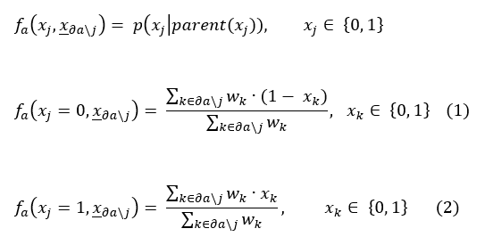
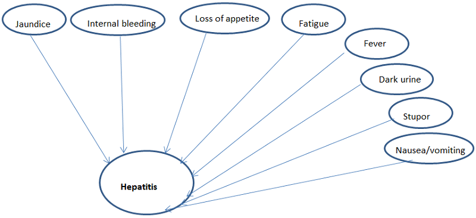

<html><head></head><body>
<h1 class="title topictitle1" id="ariaid-title1">LoopyBeliefPropagation (ML Engine)</h1>

<dfn class="term">Belief propagation</dfn>, or <dfn class="term">sum-product message passing</dfn>, is an algorithm for inferring probabilities
			from graphical models, such as Bayesian networks and Markov random fields.

The LoopyBeliefPropagation function calculates, for a Bayesian network of
			binary variables, the marginal distribution for each unobserved variable, conditional on
			any observed variables.

<h2 class="title topictitle2" id="ariaid-title2">LoopyBeliefPropagation Background</h2>

A <dfn class="term">Bayesian network</dfn> represents a set of random variables and their conditional dependencies. For example, a Bayesian network can represent the probabilistic relationships between symptoms and diseases. Given symptoms, belief propagation can use the graph to compute the probabilities of the presence of various diseases.

Formally, a Bayesian network is a directed acyclic graph (DAG) whose vertices (or nodes) represent random variables in the Bayesian sense: They are observable quantities, latent variables, unknown parameters, or hypotheses. Each vertex is associated with a probability function that takes the values of the vertex parent variables and returns the probability of the variable represented by the vertex. For example, if the parents are <var class="keyword varname">m</var> binary variables, the probability function is represented by a table of 2<var class="keyword varname">m</var> entries, one entry for each of the 2<var class="keyword varname">m</var> possible combinations of its parent values. If variables are conditionally dependent on each other, the vertices that represent them are connected by edges.

For example, suppose that there are two reasons that grass can be wet: the sprinkler is on or it is raining. Also, suppose that when it is raining, the sprinkler is less likely to be on. The Bayesian network in the following figure models this situation. The three variables are binary; their possible values are T (true) and F (false).

  </img>  

To use the LoopyBeliefPropagation function, you must specify only the conditional dependence between variables (directed edges, possibly weighted) and the values for observed variables. The function computes the potential tables, using these functions at factor nodes:

  </img>  

<h2 class="title topictitle2" id="ariaid-title3">LoopyBeliefPropagation Syntax</h2>

<h3 class="title sectiontitle">Version 1.5</h3><pre class="pre codeblock" xml:space="preserve"><code>SELECT * FROM LoopyBeliefPropagation (
  ON <var class="keyword varname">vertices_table</var> AS Vertices PARTITION BY <var class="keyword varname">vertex_key_column</var> [,...] 
  ON <var class="keyword varname">edges_table</var> AS Edges PARTITION BY <var class="keyword varname">source_vertex_key_column</var> [,...] 
  [ ON <var class="keyword varname">observation_table</var> AS ObservationTable PARTITION BY <var class="keyword varname">source_vertex_key_column</var> [,...] ]
  USING
  TargetKey ({ '<var class="keyword varname">target_key_column</var>' | <var class="keyword varname">target_key_column_range</var> }[,...])
  [ ObservationColumn ('<var class="keyword varname">observation_column</var>') ]
  [ EdgeWeight ('<var class="keyword varname">edge_weight</var>') ]
  [ Accumulate ('<var class="keyword varname">accumulate_column</var>') ] 
  [ MaxIterNum (<var class="keyword varname">max_iter_num</var>) ]
  [ StopThreshold (<var class="keyword varname">threshold</var>) ]
) AS <var class="keyword varname">alias</var>;</code></pre>

<h2 class="title topictitle2" id="ariaid-title4">LoopyBeliefPropagation Syntax Elements</h2>

<dl class="dl parml"><dt class="dt pt dlterm">TargetKey</dt><dd class="dd pd">[Optional] Specify the names of the Edges table columns that comprise the key of the target vertices.</dd><dt class="dt pt dlterm">ObservationColumn</dt><dd class="dd pd">[Required with ObservationTable, optional otherwise.] Specify the name of the ObservationTable column that contains the observations.</dd><dt class="dt pt dlterm">EdgeWeight</dt><dd class="dd pd">[Optional] Specify the name of the Edges table column that contains the edge weights. The function uses only positive edge weights. The sum of the edge weights that the function uses must be 1.</dd><dd class="dd pd ddexpand">Default behavior: All edges have equal weight.</dd><dt class="dt pt dlterm">Accumulate</dt><dd class="dd pd">[Optional] Specify the names of the Vertices table columns to copy to the output table.</dd><dt class="dt pt dlterm">MaxIterNum</dt><dd class="dd pd">[Optional] Specify the maximum number of iterations that the algorithm can run.</dd><dd class="dd pd ddexpand">Default: 20</dd><dt class="dt pt dlterm">StopThreshold</dt><dd class="dd pd">[Optional] Specify the threshold value for convergence.</dd><dd class="dd pd ddexpand">Default: 0.0001</dd></dl>

<h2 class="title topictitle2" id="ariaid-title5">LoopyBeliefPropagation Input</h2>

<table cellpadding="4" cellspacing="0" summary="" id="sci1507825969397__table_cpr_mbr_ycb" class="table" frame="border" border="1" rules="all">

<colgroup span="1"><col style="width:50%" span="1"></col><col style="width:50%" span="1"></col></colgroup><thead class="thead" style="text-align:left;"><tr class="row"><th class="entry cellrowborder" style="vertical-align:top;" id="d47622e231" rowspan="1" colspan="1">Table</th><th class="entry cellrowborder" style="vertical-align:top;" id="d47622e233" rowspan="1" colspan="1">Description</th></tr></thead><tbody class="tbody"><tr class="row"><td class="entry cellrowborder" style="vertical-align:top;" headers="d47622e231" rowspan="1" colspan="1">Vertices</td><td class="entry cellrowborder" style="vertical-align:top;" headers="d47622e233" rowspan="1" colspan="1">Each row represents a vertex of the graph. Each vertex represents a variable.

Computational cost for each vertex is exponential in terms of in-degree. If any vertex has an in-degree greater than 20, function may be very slow.
</td></tr><tr class="row"><td class="entry cellrowborder" style="vertical-align:top;" headers="d47622e231" rowspan="1" colspan="1">Edges</td><td class="entry cellrowborder" style="vertical-align:top;" headers="d47622e233" rowspan="1" colspan="1">Each row represents an edge of the graph.

If variables are conditionally dependent on each other, their representative vertices are connected by edges.
</td></tr><tr class="row"><td class="entry cellrowborder" style="vertical-align:top;" headers="d47622e231" rowspan="1" colspan="1">ObservationTable</td><td class="entry cellrowborder" style="vertical-align:top;" headers="d47622e233" rowspan="1" colspan="1">[Optional] Contains vertices (which represent variables) and observations for observed variables.</td></tr></tbody></table>

<h3 class="title sectiontitle">Vertices Schema</h3>

The table can have additional columns, but the function ignores them.

<table cellpadding="4" cellspacing="0" summary="" id="sci1507825969397__table_N10017_N1000E_N1000C_N10001" class="table" frame="border" border="1" rules="all">

<colgroup span="1"><col style="width:28.57142857142857%" span="1"></col><col style="width:14.285714285714285%" span="1"></col><col style="width:57.14285714285714%" span="1"></col></colgroup><thead class="thead" style="text-align:left;"><tr class="row"><th class="entry nocellnorowborder" style="vertical-align:top;" id="d47622e268" rowspan="1" colspan="1">Column</th><th class="entry nocellnorowborder" style="vertical-align:top;" id="d47622e270" rowspan="1" colspan="1">Data Type</th><th class="entry cell-norowborder" style="vertical-align:top;" id="d47622e272" rowspan="1" colspan="1">Description</th></tr></thead><tbody class="tbody"><tr class="row"><td class="entry nocellnorowborder" style="vertical-align:top;" headers="d47622e268" rowspan="1" colspan="1"><var class="keyword varname">vertex_key_column</var></td><td class="entry nocellnorowborder" style="vertical-align:top;" headers="d47622e270" rowspan="1" colspan="1">INTEGER</td><td class="entry cell-norowborder" style="vertical-align:top;" headers="d47622e272" rowspan="1" colspan="1">[Column appears once for each specified <var class="keyword varname">vertex_key_column</var>.] All or part of unique vertex key. Cannot be NULL.</td></tr><tr class="row"><td class="entry row-nocellborder" style="vertical-align:top;" headers="d47622e268" rowspan="1" colspan="1"><var class="keyword varname">accumulate_column</var></td><td class="entry row-nocellborder" style="vertical-align:top;" headers="d47622e270" rowspan="1" colspan="1">Any</td><td class="entry cellrowborder" style="vertical-align:top;" headers="d47622e272" rowspan="1" colspan="1">[Column appears once for each specified <var class="keyword varname">accumulate_column</var>.] Column to copy to output table.</td></tr></tbody></table>

<h3 class="title sectiontitle">Edges Schema</h3>

The table can have additional columns, but the function ignores them.

<table cellpadding="4" cellspacing="0" summary="" id="sci1507825969397__table_N10061_N1000E_N1000C_N10001" class="table" frame="border" border="1" rules="all">

<colgroup span="1"><col style="width:28.57142857142857%" span="1"></col><col style="width:14.285714285714285%" span="1"></col><col style="width:57.14285714285714%" span="1"></col></colgroup><thead class="thead" style="text-align:left;"><tr class="row"><th class="entry nocellnorowborder" style="vertical-align:top;" id="d47622e312" rowspan="1" colspan="1">Column</th><th class="entry nocellnorowborder" style="vertical-align:top;" id="d47622e314" rowspan="1" colspan="1">Data Type</th><th class="entry cell-norowborder" style="vertical-align:top;" id="d47622e316" rowspan="1" colspan="1">Description</th></tr></thead><tbody class="tbody"><tr class="row"><td class="entry nocellnorowborder" style="vertical-align:top;" headers="d47622e312" rowspan="1" colspan="1"><var class="keyword varname">source_vertex_key_column</var></td><td class="entry nocellnorowborder" style="vertical-align:top;" headers="d47622e314" rowspan="1" colspan="1">INTEGER</td><td class="entry cell-norowborder" style="vertical-align:top;" headers="d47622e316" rowspan="1" colspan="1">Column appears once for each specified <var class="keyword varname">source_vertex_key_column</var>.] All or part of key that identifies source vertex of edge. Must be a <var class="keyword varname">vertex_key_column</var> in Vertices table. Cannot be NULL.</td></tr><tr class="row"><td class="entry nocellnorowborder" style="vertical-align:top;" headers="d47622e312" rowspan="1" colspan="1"><var class="keyword varname">target_vertex_key_column</var></td><td class="entry nocellnorowborder" style="vertical-align:top;" headers="d47622e314" rowspan="1" colspan="1">INTEGER</td><td class="entry cell-norowborder" style="vertical-align:top;" headers="d47622e316" rowspan="1" colspan="1">Column appears once for each specified <var class="keyword varname">target_vertex_key_column</var>.] All or part of key that identifies target vertex of edge. Must be a <var class="keyword varname">vertex_key_column</var> in Vertices table. Cannot be NULL.</td></tr><tr class="row"><td class="entry row-nocellborder" style="vertical-align:top;" headers="d47622e312" rowspan="1" colspan="1"><var class="keyword varname">edge_weight</var></td><td class="entry row-nocellborder" style="vertical-align:top;" headers="d47622e314" rowspan="1" colspan="1">DOUBLE PRECISION</td><td class="entry cellrowborder" style="vertical-align:top;" headers="d47622e316" rowspan="1" colspan="1">[Required only for weighted graph.] Edge weight. Function uses only positive edge weights. Sum of edge weights that function uses must be 1.</td></tr></tbody></table>

<h3 class="title sectiontitle">ObservationTable Schema</h3>
<table cellpadding="4" cellspacing="0" summary="" id="sci1507825969397__table_N100B5_N1000E_N1000C_N10001" class="table" frame="border" border="1" rules="all">

<colgroup span="1"><col style="width:20%" span="1"></col><col style="width:13.333333333333334%" span="1"></col><col style="width:66.66666666666666%" span="1"></col></colgroup><thead class="thead" style="text-align:left;"><tr class="row"><th class="entry nocellnorowborder" style="vertical-align:top;" id="d47622e365" rowspan="1" colspan="1">Column</th><th class="entry nocellnorowborder" style="vertical-align:top;" id="d47622e367" rowspan="1" colspan="1">Data Type</th><th class="entry cell-norowborder" style="vertical-align:top;" id="d47622e369" rowspan="1" colspan="1">Description</th></tr></thead><tbody class="tbody"><tr class="row"><td class="entry nocellnorowborder" style="vertical-align:top;" headers="d47622e365" rowspan="1" colspan="1"><var class="keyword varname">source_vertex_key_column</var></td><td class="entry nocellnorowborder" style="vertical-align:top;" headers="d47622e367" rowspan="1" colspan="1">INTEGER</td><td class="entry cell-norowborder" style="vertical-align:top;" headers="d47622e369" rowspan="1" colspan="1">Column appears once for each specified <var class="keyword varname">source_vertex_key_column</var>.] All or part of key that identifies source vertex of edge. Must be a <var class="keyword varname">vertex_key_column</var> in Vertices table. Cannot be NULL.</td></tr><tr class="row"><td class="entry row-nocellborder" style="vertical-align:top;" headers="d47622e365" rowspan="1" colspan="1"><var class="keyword varname">observation_column</var></td><td class="entry row-nocellborder" style="vertical-align:top;" headers="d47622e367" rowspan="1" colspan="1">INTEGER</td><td class="entry cellrowborder" style="vertical-align:top;" headers="d47622e369" rowspan="1" colspan="1">Observation for variable represented by vertex: true or false for observed variable, NULL for unobserved variable. True can be represented by 'true', 't', 'yes', 'y', or '1'; false by 'false', 'f', 'no', 'n', or '0' (case-insensitive).</td></tr></tbody></table>

<h2 class="title topictitle2" id="ariaid-title6">LoopyBeliefPropagation Output</h2>

<h3 class="title sectiontitle">Output Table Schema</h3>
<table cellpadding="4" cellspacing="0" summary="" id="dqm1507826028884__table_N1000E_N1000C_N10001" class="table" frame="border" border="1" rules="all">

<colgroup span="1"><col style="width:28.57142857142857%" span="1"></col><col style="width:14.285714285714285%" span="1"></col><col style="width:57.14285714285714%" span="1"></col></colgroup><thead class="thead" style="text-align:left;"><tr class="row"><th class="entry nocellnorowborder" style="vertical-align:top;" id="d47622e414" rowspan="1" colspan="1">Column</th><th class="entry nocellnorowborder" style="vertical-align:top;" id="d47622e416" rowspan="1" colspan="1">Data Type</th><th class="entry cell-norowborder" style="vertical-align:top;" id="d47622e418" rowspan="1" colspan="1">Description</th></tr></thead><tbody class="tbody"><tr class="row"><td class="entry nocellnorowborder" style="vertical-align:top;" headers="d47622e414" rowspan="1" colspan="1"><var class="keyword varname">accumulate_column</var></td><td class="entry nocellnorowborder" style="vertical-align:top;" headers="d47622e416" rowspan="1" colspan="1">Same as in Vertices table</td><td class="entry cell-norowborder" style="vertical-align:top;" headers="d47622e418" rowspan="1" colspan="1">[Column appears once for each specified <var class="keyword varname">accumulate_column</var>.] Column copied from Vertices table.</td></tr><tr class="row"><td class="entry row-nocellborder" style="vertical-align:top;" headers="d47622e414" rowspan="1" colspan="1">prob_true</td><td class="entry row-nocellborder" style="vertical-align:top;" headers="d47622e416" rowspan="1" colspan="1">DOUBLE PRECISION</td><td class="entry cellrowborder" style="vertical-align:top;" headers="d47622e418" rowspan="1" colspan="1">Marginal probability that variable represented by vertex is true.</td></tr></tbody></table>

<h2 class="title topictitle2" id="ariaid-title7">LoopyBeliefPropagation Examples</h2>

These examples use the LoopyBeliefPropagation function to determine the marginal probability of the disease hepatitis by observing its symptoms.

Hepatitis is an inflammation of the liver that can be caused by drugs, alcohol, or (most often) a virus. These are the most common symptoms of hepatitis:

<ul class="ul">
<li class="li">Jaundice (yellowing of the skin and whites of the eyes)</li>
<li class="li">Internal bleeding</li>
<li class="li">Loss of appetite</li>
<li class="li">Fatigue</li>
<li class="li">Fever</li>
<li class="li">Dark urine</li>
<li class="li">Stupor</li>
<li class="li">Nausea/vomiting</li></ul>

Given the presence or absence of a given symptom, the LoopyBeliefPropagation function determines the conditional or marginal probability of hepatitis.

The following figure shows the DAG that represents the relationship between hepatitis and its symptoms. The DAG represents each symptom by a conditional node and the disease by the dependent, unobserved node. These examples assume that each observed node variable is independent and binary.

Relationship between Hepatitis and Symptoms
  </img>  

<h3 class="title topictitle3" id="ariaid-title8">LoopyBeliefPropagation Example: Equally Weighted Edges</h3>

In this example, the probability of hepatitis depends on all symptoms equally; therefore, the Edges table does not include edge weights.

<h4 class="title sectiontitle">Input</h4>
<table cellpadding="4" cellspacing="0" summary="" id="odv1507826678201__table_jzt_s2g_5db" class="table" frame="border" border="1" rules="all">
Vertices: lbp_vertices
<colgroup span="1"><col style="width:50%" span="1"></col><col style="width:50%" span="1"></col></colgroup><thead class="thead" style="text-align:left;"><tr class="row"><th class="entry cellrowborder" style="vertical-align:top;" id="d47622e520" rowspan="1" colspan="1">id</th><th class="entry cellrowborder" style="vertical-align:top;" id="d47622e522" rowspan="1" colspan="1">vertex</th></tr></thead><tbody class="tbody"><tr class="row"><td class="entry cellrowborder" style="vertical-align:top;" headers="d47622e520" rowspan="1" colspan="1">1</td><td class="entry cellrowborder" style="vertical-align:top;" headers="d47622e522" rowspan="1" colspan="1">Jaundice</td></tr><tr class="row"><td class="entry cellrowborder" style="vertical-align:top;" headers="d47622e520" rowspan="1" colspan="1">2</td><td class="entry cellrowborder" style="vertical-align:top;" headers="d47622e522" rowspan="1" colspan="1">Internal bleeding</td></tr><tr class="row"><td class="entry cellrowborder" style="vertical-align:top;" headers="d47622e520" rowspan="1" colspan="1">3</td><td class="entry cellrowborder" style="vertical-align:top;" headers="d47622e522" rowspan="1" colspan="1">Loss of appetite</td></tr><tr class="row"><td class="entry cellrowborder" style="vertical-align:top;" headers="d47622e520" rowspan="1" colspan="1">4</td><td class="entry cellrowborder" style="vertical-align:top;" headers="d47622e522" rowspan="1" colspan="1">Fatigue</td></tr><tr class="row"><td class="entry cellrowborder" style="vertical-align:top;" headers="d47622e520" rowspan="1" colspan="1">5</td><td class="entry cellrowborder" style="vertical-align:top;" headers="d47622e522" rowspan="1" colspan="1">Fever</td></tr><tr class="row"><td class="entry cellrowborder" style="vertical-align:top;" headers="d47622e520" rowspan="1" colspan="1">6</td><td class="entry cellrowborder" style="vertical-align:top;" headers="d47622e522" rowspan="1" colspan="1">Dark urine</td></tr><tr class="row"><td class="entry cellrowborder" style="vertical-align:top;" headers="d47622e520" rowspan="1" colspan="1">7</td><td class="entry cellrowborder" style="vertical-align:top;" headers="d47622e522" rowspan="1" colspan="1">Stupor</td></tr><tr class="row"><td class="entry cellrowborder" style="vertical-align:top;" headers="d47622e520" rowspan="1" colspan="1">8</td><td class="entry cellrowborder" style="vertical-align:top;" headers="d47622e522" rowspan="1" colspan="1">Nausea/vomiting</td></tr><tr class="row"><td class="entry cellrowborder" style="vertical-align:top;" headers="d47622e520" rowspan="1" colspan="1">9</td><td class="entry cellrowborder" style="vertical-align:top;" headers="d47622e522" rowspan="1" colspan="1">Hepatitis</td></tr></tbody></table>

<table cellpadding="4" cellspacing="0" summary="" id="odv1507826678201__table_u34_w2g_5db" class="table" frame="border" border="1" rules="all">
Edges: lbp_edges
<colgroup span="1"><col style="width:33.33333333333333%" span="1"></col><col style="width:33.33333333333333%" span="1"></col><col style="width:33.33333333333333%" span="1"></col></colgroup><thead class="thead" style="text-align:left;"><tr class="row"><th class="entry cellrowborder" style="vertical-align:top;" id="d47622e579" rowspan="1" colspan="1">id</th><th class="entry cellrowborder" style="vertical-align:top;" id="d47622e581" rowspan="1" colspan="1">source</th><th class="entry cellrowborder" style="vertical-align:top;" id="d47622e583" rowspan="1" colspan="1">target</th></tr></thead><tbody class="tbody"><tr class="row"><td class="entry cellrowborder" style="vertical-align:top;" headers="d47622e579" rowspan="1" colspan="1">1</td><td class="entry cellrowborder" style="vertical-align:top;" headers="d47622e581" rowspan="1" colspan="1">Jaundice</td><td class="entry cellrowborder" style="vertical-align:top;" headers="d47622e583" rowspan="1" colspan="1">Hepatitis</td></tr><tr class="row"><td class="entry cellrowborder" style="vertical-align:top;" headers="d47622e579" rowspan="1" colspan="1">2</td><td class="entry cellrowborder" style="vertical-align:top;" headers="d47622e581" rowspan="1" colspan="1">Internal bleeding</td><td class="entry cellrowborder" style="vertical-align:top;" headers="d47622e583" rowspan="1" colspan="1">Hepatitis</td></tr><tr class="row"><td class="entry cellrowborder" style="vertical-align:top;" headers="d47622e579" rowspan="1" colspan="1">3</td><td class="entry cellrowborder" style="vertical-align:top;" headers="d47622e581" rowspan="1" colspan="1">Loss of appetite</td><td class="entry cellrowborder" style="vertical-align:top;" headers="d47622e583" rowspan="1" colspan="1">Hepatitis</td></tr><tr class="row"><td class="entry cellrowborder" style="vertical-align:top;" headers="d47622e579" rowspan="1" colspan="1">4</td><td class="entry cellrowborder" style="vertical-align:top;" headers="d47622e581" rowspan="1" colspan="1">Fatigue</td><td class="entry cellrowborder" style="vertical-align:top;" headers="d47622e583" rowspan="1" colspan="1">Hepatitis</td></tr><tr class="row"><td class="entry cellrowborder" style="vertical-align:top;" headers="d47622e579" rowspan="1" colspan="1">5</td><td class="entry cellrowborder" style="vertical-align:top;" headers="d47622e581" rowspan="1" colspan="1">Fever</td><td class="entry cellrowborder" style="vertical-align:top;" headers="d47622e583" rowspan="1" colspan="1">Hepatitis</td></tr><tr class="row"><td class="entry cellrowborder" style="vertical-align:top;" headers="d47622e579" rowspan="1" colspan="1">6</td><td class="entry cellrowborder" style="vertical-align:top;" headers="d47622e581" rowspan="1" colspan="1">Dark urine</td><td class="entry cellrowborder" style="vertical-align:top;" headers="d47622e583" rowspan="1" colspan="1">Hepatitis</td></tr><tr class="row"><td class="entry cellrowborder" style="vertical-align:top;" headers="d47622e579" rowspan="1" colspan="1">7</td><td class="entry cellrowborder" style="vertical-align:top;" headers="d47622e581" rowspan="1" colspan="1">Stupor</td><td class="entry cellrowborder" style="vertical-align:top;" headers="d47622e583" rowspan="1" colspan="1">Hepatitis</td></tr><tr class="row"><td class="entry cellrowborder" style="vertical-align:top;" headers="d47622e579" rowspan="1" colspan="1">8</td><td class="entry cellrowborder" style="vertical-align:top;" headers="d47622e581" rowspan="1" colspan="1">Nausea/vomiting</td><td class="entry cellrowborder" style="vertical-align:top;" headers="d47622e583" rowspan="1" colspan="1">Hepatitis</td></tr></tbody></table>

In the ObservationTable, 't' means that the symptom is present and 'f' means that it is absent.

<table cellpadding="4" cellspacing="0" summary="" id="odv1507826678201__table_qdl_bfg_5db" class="table" frame="border" border="1" rules="all">
ObservationTable: lbp_observation
<colgroup span="1"><col style="width:33.33333333333333%" span="1"></col><col style="width:33.33333333333333%" span="1"></col><col style="width:33.33333333333333%" span="1"></col></colgroup><thead class="thead" style="text-align:left;"><tr class="row"><th class="entry cellrowborder" style="vertical-align:top;" id="d47622e653" rowspan="1" colspan="1">id</th><th class="entry cellrowborder" style="vertical-align:top;" id="d47622e655" rowspan="1" colspan="1">vertex</th><th class="entry cellrowborder" style="vertical-align:top;" id="d47622e657" rowspan="1" colspan="1">obs</th></tr></thead><tbody class="tbody"><tr class="row"><td class="entry cellrowborder" style="vertical-align:top;" headers="d47622e653" rowspan="1" colspan="1">1</td><td class="entry cellrowborder" style="vertical-align:top;" headers="d47622e655" rowspan="1" colspan="1">Jaundice</td><td class="entry cellrowborder" style="vertical-align:top;" headers="d47622e657" rowspan="1" colspan="1">t</td></tr><tr class="row"><td class="entry cellrowborder" style="vertical-align:top;" headers="d47622e653" rowspan="1" colspan="1">2</td><td class="entry cellrowborder" style="vertical-align:top;" headers="d47622e655" rowspan="1" colspan="1">Internal bleeding</td><td class="entry cellrowborder" style="vertical-align:top;" headers="d47622e657" rowspan="1" colspan="1">t</td></tr><tr class="row"><td class="entry cellrowborder" style="vertical-align:top;" headers="d47622e653" rowspan="1" colspan="1">3</td><td class="entry cellrowborder" style="vertical-align:top;" headers="d47622e655" rowspan="1" colspan="1">Loss of appetite</td><td class="entry cellrowborder" style="vertical-align:top;" headers="d47622e657" rowspan="1" colspan="1">t</td></tr><tr class="row"><td class="entry cellrowborder" style="vertical-align:top;" headers="d47622e653" rowspan="1" colspan="1">4</td><td class="entry cellrowborder" style="vertical-align:top;" headers="d47622e655" rowspan="1" colspan="1">Fatigue</td><td class="entry cellrowborder" style="vertical-align:top;" headers="d47622e657" rowspan="1" colspan="1">t</td></tr><tr class="row"><td class="entry cellrowborder" style="vertical-align:top;" headers="d47622e653" rowspan="1" colspan="1">5</td><td class="entry cellrowborder" style="vertical-align:top;" headers="d47622e655" rowspan="1" colspan="1">Fever</td><td class="entry cellrowborder" style="vertical-align:top;" headers="d47622e657" rowspan="1" colspan="1">f</td></tr><tr class="row"><td class="entry cellrowborder" style="vertical-align:top;" headers="d47622e653" rowspan="1" colspan="1">6</td><td class="entry cellrowborder" style="vertical-align:top;" headers="d47622e655" rowspan="1" colspan="1">Dark urine</td><td class="entry cellrowborder" style="vertical-align:top;" headers="d47622e657" rowspan="1" colspan="1">t</td></tr><tr class="row"><td class="entry cellrowborder" style="vertical-align:top;" headers="d47622e653" rowspan="1" colspan="1">7</td><td class="entry cellrowborder" style="vertical-align:top;" headers="d47622e655" rowspan="1" colspan="1">Stupor</td><td class="entry cellrowborder" style="vertical-align:top;" headers="d47622e657" rowspan="1" colspan="1">f</td></tr><tr class="row"><td class="entry cellrowborder" style="vertical-align:top;" headers="d47622e653" rowspan="1" colspan="1">8</td><td class="entry cellrowborder" style="vertical-align:top;" headers="d47622e655" rowspan="1" colspan="1">Nausea/vomiting</td><td class="entry cellrowborder" style="vertical-align:top;" headers="d47622e657" rowspan="1" colspan="1">f</td></tr></tbody></table>

<h4 class="title sectiontitle">SQL Call</h4><pre class="pre codeblock" xml:space="preserve"><code>SELECT * FROM LoopyBeliefPropagation (
  ON lbp_edges AS Edges PARTITION BY source
  ON lbp_vertices AS Vertices PARTITION BY vertex
  ON lbp_observation AS ObservationTable PARTITION BY vertex
  USING
  TargetKey ('target')
  ObservationColumn ('obs')
  Accumulate ('vertex')
  MaxIterNum (20)
  StopThreshold (1E-10)
) AS dt ORDER BY vertex;</code></pre>

<h4 class="title sectiontitle">Output</h4>

In the output table, 1 means that the symptom is present and 0 means that it is absent. Five of the eight symptoms are present, so the conditional probability of hepatitis is 5/8 (0.625).
<pre class="pre screen" xml:space="preserve"> vertex            prob_true 
 ----------------- --------- 
 dark urine              1.0
 fatigue                 1.0
 fever                   0.0
 hepatitis             0.625
 internal bleeding       1.0
 jaundice                1.0
 loss of appetite        1.0
 nausea/vomiting         0.0
 stupor                  0.0</pre>

Download a zip file of all examples and a SQL script file that creates their input tables from the attachment in the left sidebar.

<h3 class="title topictitle3" id="ariaid-title9">LoopyBeliefPropagation Example: Unequally Weighted Edges</h3>

In this example, the probability of hepatitis depends more on some symptoms than others; therefore, the Edges table includes edge weights (and the <b>SQL</b> call includes the EdgeWeight syntax element).

<h4 class="title sectiontitle">Input</h4>
<ul class="ul" id="hxh1507827103935__ul_jcm_5fg_5db">
<li class="li">From <a href="bxq1558544516257.md#odv1507826678201">LoopyBeliefPropagation Example: Equally Weighted Edges</a>:
<ul class="ul" id="hxh1507827103935__ul_k4j_cbq_j2b">
<li class="li">Vertices: lbp_vertices</li>
<li class="li">ObservationTable: lbp_observation </li></ul></li>
<li class="li">Edges: lbp_weighted_edges</li></ul>
<table cellpadding="4" cellspacing="0" summary="" id="hxh1507827103935__table_yc2_1gg_5db" class="table" frame="border" border="1" rules="all">
Edges: lbp_weighted_edges
<colgroup span="1"><col style="width:25%" span="1"></col><col style="width:25%" span="1"></col><col style="width:25%" span="1"></col><col style="width:25%" span="1"></col></colgroup><thead class="thead" style="text-align:left;"><tr class="row"><th class="entry cellrowborder" style="vertical-align:top;" id="d47622e789" rowspan="1" colspan="1">id</th><th class="entry cellrowborder" style="vertical-align:top;" id="d47622e791" rowspan="1" colspan="1">source</th><th class="entry cellrowborder" style="vertical-align:top;" id="d47622e793" rowspan="1" colspan="1">target</th><th class="entry cellrowborder" style="vertical-align:top;" id="d47622e795" rowspan="1" colspan="1">edgewt</th></tr></thead><tbody class="tbody"><tr class="row"><td class="entry cellrowborder" style="vertical-align:top;" headers="d47622e789" rowspan="1" colspan="1">1</td><td class="entry cellrowborder" style="vertical-align:top;" headers="d47622e791" rowspan="1" colspan="1">Jaundice</td><td class="entry cellrowborder" style="vertical-align:top;" headers="d47622e793" rowspan="1" colspan="1">Hepatitis</td><td class="entry cellrowborder" style="vertical-align:top;" headers="d47622e795" rowspan="1" colspan="1">0.2</td></tr><tr class="row"><td class="entry cellrowborder" style="vertical-align:top;" headers="d47622e789" rowspan="1" colspan="1">2</td><td class="entry cellrowborder" style="vertical-align:top;" headers="d47622e791" rowspan="1" colspan="1">Internal bleeding</td><td class="entry cellrowborder" style="vertical-align:top;" headers="d47622e793" rowspan="1" colspan="1">Hepatitis</td><td class="entry cellrowborder" style="vertical-align:top;" headers="d47622e795" rowspan="1" colspan="1">0.15</td></tr><tr class="row"><td class="entry cellrowborder" style="vertical-align:top;" headers="d47622e789" rowspan="1" colspan="1">3</td><td class="entry cellrowborder" style="vertical-align:top;" headers="d47622e791" rowspan="1" colspan="1">Loss of appetite</td><td class="entry cellrowborder" style="vertical-align:top;" headers="d47622e793" rowspan="1" colspan="1">Hepatitis</td><td class="entry cellrowborder" style="vertical-align:top;" headers="d47622e795" rowspan="1" colspan="1">0.05</td></tr><tr class="row"><td class="entry cellrowborder" style="vertical-align:top;" headers="d47622e789" rowspan="1" colspan="1">4</td><td class="entry cellrowborder" style="vertical-align:top;" headers="d47622e791" rowspan="1" colspan="1">Fatigue</td><td class="entry cellrowborder" style="vertical-align:top;" headers="d47622e793" rowspan="1" colspan="1">Hepatitis</td><td class="entry cellrowborder" style="vertical-align:top;" headers="d47622e795" rowspan="1" colspan="1">0.1</td></tr><tr class="row"><td class="entry cellrowborder" style="vertical-align:top;" headers="d47622e789" rowspan="1" colspan="1">5</td><td class="entry cellrowborder" style="vertical-align:top;" headers="d47622e791" rowspan="1" colspan="1">Fever</td><td class="entry cellrowborder" style="vertical-align:top;" headers="d47622e793" rowspan="1" colspan="1">Hepatitis</td><td class="entry cellrowborder" style="vertical-align:top;" headers="d47622e795" rowspan="1" colspan="1">0.1</td></tr><tr class="row"><td class="entry cellrowborder" style="vertical-align:top;" headers="d47622e789" rowspan="1" colspan="1">6</td><td class="entry cellrowborder" style="vertical-align:top;" headers="d47622e791" rowspan="1" colspan="1">Dark urine</td><td class="entry cellrowborder" style="vertical-align:top;" headers="d47622e793" rowspan="1" colspan="1">Hepatitis</td><td class="entry cellrowborder" style="vertical-align:top;" headers="d47622e795" rowspan="1" colspan="1">0.25</td></tr><tr class="row"><td class="entry cellrowborder" style="vertical-align:top;" headers="d47622e789" rowspan="1" colspan="1">7</td><td class="entry cellrowborder" style="vertical-align:top;" headers="d47622e791" rowspan="1" colspan="1">Stupor</td><td class="entry cellrowborder" style="vertical-align:top;" headers="d47622e793" rowspan="1" colspan="1">Hepatitis</td><td class="entry cellrowborder" style="vertical-align:top;" headers="d47622e795" rowspan="1" colspan="1">0.05</td></tr><tr class="row"><td class="entry cellrowborder" style="vertical-align:top;" headers="d47622e789" rowspan="1" colspan="1">8</td><td class="entry cellrowborder" style="vertical-align:top;" headers="d47622e791" rowspan="1" colspan="1">Nausea/vomiting</td><td class="entry cellrowborder" style="vertical-align:top;" headers="d47622e793" rowspan="1" colspan="1">Hepatitis</td><td class="entry cellrowborder" style="vertical-align:top;" headers="d47622e795" rowspan="1" colspan="1">0.1</td></tr></tbody></table>

<h4 class="title sectiontitle">SQL Call</h4><pre class="pre codeblock" xml:space="preserve"><code>SELECT * FROM LoopyBeliefPropagation (
  ON lbp_weighted_edges AS Edges PARTITION BY source
  ON lbp_vertices AS Vertices PARTITION BY vertex
  ON lbp_observation AS ObservationTable PARTITION BY vertex
  USING
  TargetKey ('target')
  ObservationColumn ('obs')
  EdgeWeight ('edgewt')
  Accumulate ('vertex')
  MaxIterNum (20)
  StopThreshold (1E-10)
) AS dt ORDER BY vertex;</code></pre>

<h4 class="title sectiontitle">Output</h4>

In the output table, 1 means that the symptom is present and 0 means that it is absent. The conditional probability of hepatitis is the sum of the weights of the symptoms that are present (0.25 + 0.1 + 0.05 + 0.15 + 0.2 = 0.75).
<pre class="pre screen" xml:space="preserve"> vertex            prob_true 
 ----------------- --------- 
 dark urine              1.0
 fatigue                 1.0
 fever                   0.0
 hepatitis              0.75
 internal bleeding       1.0
 jaundice                1.0
 loss of appetite        1.0
 nausea/vomiting         0.0
 stupor                  0.0</pre>

Download a zip file of all examples and a SQL script file that creates their input tables from the attachment in the left sidebar.

</body></html>
