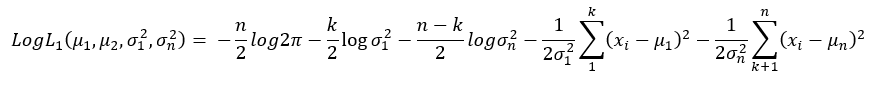
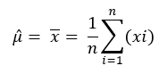
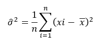
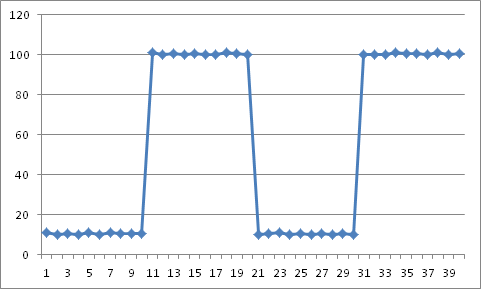

<html><head></head><body>
<h1 class="title topictitle1" id="ariaid-title1">ChangePointDetection</h1>

The change-point search method for retrospective change-point detection, binary segmentation, uses this procedure:

<ol class="ol" id="jks1506305286697__ol_ung_gsf_5bb">
<li class="li">Search the data for the first change point.</li>
<li class="li">At that change point, split the data into two parts.</li>
<li class="li">In each part, select the change point with the minimum loss.</li>
<li class="li">Repeat this procedure until there are either no new change points or the maximum number of change points.</li></ol>

Binary segmentation is an approximation method, because the change point is decided with only part of the data. However, this method is efficient and has an O(<var class="keyword varname">n</var> log <var class="keyword varname">n</var>) computational cost, where <var class="keyword varname">n</var> is the number of data points.

  </img>  

Taking normal distribution as an example, the change-point problem is to test the following null hypothesis:

<var class="keyword varname">H</var>0:<var class="keyword varname">μ</var> = <var class="keyword varname">μ</var>1 = <var class="keyword varname">μ</var>2 = … = <var class="keyword varname">μ</var><var class="keyword varname">n</var> and <var class="keyword varname">σ</var>2 = <var class="keyword varname">σ</var>12 = <var class="keyword varname">σ</var>22 = … <var class="keyword varname">σ</var><var class="keyword varname">n</var>2

as opposed to the alternatives,

<var class="keyword varname">H</var>1:<var class="keyword varname">μ</var>1 = … = <var class="keyword varname">μ</var><var class="keyword varname">k</var>1 ≠ <var class="keyword varname">μ</var><var class="keyword varname">k</var>1+1 = … <var class="keyword varname">μ</var><var class="keyword varname">k</var>2 ≠ ... ≠ <var class="keyword varname">μ</var><var class="keyword varname">k</var><var class="keyword varname">q</var>+1 = ...= <var class="keyword varname">μ</var><var class="keyword varname">n</var>

and

<var class="keyword varname">σ</var>12 = … = <var class="keyword varname">σ</var><var class="keyword varname">k</var>12 ≠ <var class="keyword varname">σ</var><var class="keyword varname">k</var>1+12 = … = <var class="keyword varname">σ</var><var class="keyword varname">k</var>22 ≠ ... ≠ <var class="keyword varname">σ</var><var class="keyword varname">k</var><var class="keyword varname">q</var>+12 = … = <var class="keyword varname">σ</var><var class="keyword varname">n</var>2

Binary segmentation performs the following tests in each iteration:

<var class="keyword varname">H</var>1:<var class="keyword varname">μ</var>1 = … = <var class="keyword varname">μ</var><var class="keyword varname">k</var>1 ≠ <var class="keyword varname">μ</var><var class="keyword varname">k</var>1+1 = … = <var class="keyword varname">μ</var><var class="keyword varname">n</var>

and

<var class="keyword varname">σ</var>12 = … = <var class="keyword varname">σ</var><var class="keyword varname">k</var>12 ≠ <var class="keyword varname">σ</var><var class="keyword varname">k</var>1+12 = … <var class="keyword varname">σ</var><var class="keyword varname">n</var>2

These are the formulas for the log likelihood functions <var class="keyword varname">H</var>0 and <var class="keyword varname">H</var>1:

  </img>  

  </img>  

These are the formulas for the maximum likelihood estimation of <var class="keyword varname">μ</var> and σ2:

  </img>  

  </img>  

From the preceding formulas, the binary segmentation algorithm computes max <var class="keyword varname">LogL</var>1 by giving <var class="keyword varname">k</var> different values. Then, to check for a change point, the algorithm compares the difference between max <var class="keyword varname">LogL</var>1 and <var class="keyword varname">LogL</var>0 to the penalty value.

If the algorithm detects a change point, it adds that change point to its list of candidate change points and splits the data into two parts. From the candidate change points that the algorithm finds in the two parts, it selects the one with the minimum loss.

The ChangePointDetection function detects change points in a stochastic process or time series, using retrospective change-point detection, implemented with these algorithms:

<ul class="ul" id="jks1506305286697__ul_yy4_l22_p1b">
<li class="li">Search algorithm: binary search</li>
<li class="li">Segmentation algorithm: normal distribution and linear regression</li></ul>

Use this function when the input data can be stored in memory and the application does not require a real-time response. If the input data cannot be stored in memory, or the application requires a real-time response, use the function <a href="bcd1558464226278.md#lhg1506370281349">ChangePointDetectionRT</a>.

<h2 class="title topictitle2" id="ariaid-title2">ChangePointDetection Syntax</h2>

<h3 class="title sectiontitle">Version 1.2</h3><pre class="pre codeblock" xml:space="preserve"><code>SELECT * FROM ChangePointDetection (
  ON { <var class="keyword varname">table</var> | <var class="keyword varname">view</var> | (<var class="keyword varname">query</var>) } PARTITION BY <var class="keyword varname">partition_expr</var> ORDER BY <var class="keyword varname">order_by_expr</var>
  USING
  TargetColumn ('<var class="keyword varname">target_column</var>')
  <code class="ph codeph">[ Accumulate ({ '<var class="keyword varname">accumulate_column</var>' | <var class="keyword varname">accumulate_column_range</var> }[,...]) ]</code>
  [ SegmentationMethod ({ 'normal_distribution' | 'linear_regression' }) ]
  [ SearchMethod ('binary') ]
  [ MaxChangeNum (<var class="keyword varname">maximum_change_point_count</var>) ]
  [ Cost ({ 'BIC' | 'AIC' | <var class="keyword varname">threshold</var> }) ]
  [ OutputType ({ 'CHANGEPOINT' | 'VERBOSE' | 'SEGMENT' }) ]
) AS <var class="keyword varname">alias</var>;</code></pre>

<b>Related Information</b>

<ul class="linklist linklist relinfo">
<a href="ndv1557782188375.md">Column Specification Syntax Elements</a>
</ul>

<h2 class="title topictitle2" id="ariaid-title3">ChangePointDetection Syntax Elements</h2>

<dl class="dl parml"><dt class="dt pt dlterm">TargetColumn</dt><dd class="dd pd">Specify the name of the input table column that contains the time series data.</dd><dt class="dt pt dlterm">Accumulate</dt><dd class="dd pd">Specify the names of the input table columns to copy to the output table.
<b>Tip</b>
To identify change points in the output table, specify the columns that appear in <var class="keyword varname">partition_exp</var> and <var class="keyword varname">order_by_exp</var>.

</dd><dt class="dt pt dlterm">SegmentationMethod</dt><dd class="dd pd">[Optional] Specify the segmentation method:

<table cellpadding="4" cellspacing="0" summary="" id="yav1506305895469__table_rmf_1by_fdb" class="table" frame="border" border="1" rules="all">

<colgroup span="1"><col style="width:50%" span="1"></col><col style="width:50%" span="1"></col></colgroup><thead class="thead" style="text-align:left;"><tr class="row"><th class="entry cellrowborder" style="vertical-align:top;" id="d212412e524" rowspan="1" colspan="1"> </th><th class="entry cellrowborder" style="vertical-align:top;" id="d212412e525" rowspan="1" colspan="1"> </th></tr></thead><tbody class="tbody"><tr class="row"><td class="entry cellrowborder" style="vertical-align:top;" headers="d212412e524" rowspan="1" colspan="1"><code class="ph codeph">'normal_distribution'</code> (Default)</td><td class="entry cellrowborder" style="vertical-align:top;" headers="d212412e525" rowspan="1" colspan="1">In each segment, data is in normal distribution.</td></tr><tr class="row"><td class="entry cellrowborder" style="vertical-align:top;" headers="d212412e524" rowspan="1" colspan="1"><code class="ph codeph">'linear_regression'</code></td><td class="entry cellrowborder" style="vertical-align:top;" headers="d212412e525" rowspan="1" colspan="1">In each segment, data is in linear regression.</td></tr></tbody></table>
</dd><dt class="dt pt dlterm">SearchMethod</dt><dd class="dd pd">[Optional] Specify the search method, binary search.</dd><dt class="dt pt dlterm">MaxChangeNum</dt><dd class="dd pd">[Optional] Specify the maximum number of change points to detect.</dd><dd class="dd pd ddexpand">Default: 10</dd><dt class="dt pt dlterm">Cost</dt><dd class="dd pd">[Optional] Specify the penalty function, which is used to avoid over-fitting:

<table cellpadding="4" cellspacing="0" summary="" id="yav1506305895469__table_s4z_gby_fdb" class="table" frame="border" border="1" rules="all">

<colgroup span="1"><col style="width:33.33333333333333%" span="1"></col><col style="width:33.33333333333333%" span="1"></col><col style="width:33.33333333333333%" span="1"></col></colgroup><thead class="thead" style="text-align:left;"><tr class="row"><th class="entry cellrowborder" style="vertical-align:top;" id="d212412e564" rowspan="1" colspan="1">Option</th><th class="entry cellrowborder" style="vertical-align:top;" id="d212412e566" rowspan="1" colspan="1">Condition for Change Point Existence</th><th class="entry cellrowborder" style="vertical-align:top;" id="d212412e568" rowspan="1" colspan="1">Condition for Normal Distribution and Linear Regression</th></tr></thead><tbody class="tbody"><tr class="row"><td class="entry cellrowborder" style="vertical-align:top;" headers="d212412e564" rowspan="1" colspan="1"><code class="ph codeph">'BIC'</code> (Default)</td><td class="entry cellrowborder" style="vertical-align:top;" headers="d212412e566" rowspan="1" colspan="1"><var class="keyword varname">ln</var>(<var class="keyword varname">L</var>1)−<var class="keyword varname">ln</var>(<var class="keyword varname">L</var>0) > (<var class="keyword varname">p</var>1<var class="keyword varname">-p</var>0)*<var class="keyword varname">ln</var>(<var class="keyword varname">n</var>)/2</td><td class="entry cellrowborder" style="vertical-align:top;" headers="d212412e568" rowspan="1" colspan="1">(<var class="keyword varname">p</var>1<var class="keyword varname">-p</var>0)*<var class="keyword varname">ln</var>(<var class="keyword varname">n</var>)/2 = <var class="keyword varname">ln</var>(<var class="keyword varname">n</var>)</td></tr><tr class="row"><td class="entry cellrowborder" style="vertical-align:top;" headers="d212412e564" rowspan="1" colspan="1"><code class="ph codeph">'AIC'</code></td><td class="entry cellrowborder" style="vertical-align:top;" headers="d212412e566" rowspan="1" colspan="1"><var class="keyword varname">ln</var>(<var class="keyword varname">L</var>1)−<var class="keyword varname">ln</var>(<var class="keyword varname">L</var>0) > <var class="keyword varname">p</var>1<var class="keyword varname">-p</var>0</td><td class="entry cellrowborder" style="vertical-align:top;" headers="d212412e568" rowspan="1" colspan="1">

<var class="keyword varname">p</var>1<var class="keyword varname">-p</var>0 = 2
</td></tr><tr class="row"><td class="entry cellrowborder" style="vertical-align:top;" headers="d212412e564" rowspan="1" colspan="1"><var class="keyword varname">threshold</var>, a DOUBLE PRECISION value

Function compares specified value to <var class="keyword varname">ln</var>(<var class="keyword varname">L</var>1)−<var class="keyword varname">ln</var>(<var class="keyword varname">L</var>0).

<var class="keyword varname">L</var>1 and <var class="keyword varname">L</var>0 are the maximum likelihood estimation of hypotheses <var class="keyword varname">H</var>1 and <var class="keyword varname">H</var>0.
</td><td class="entry cellrowborder" style="vertical-align:top;" headers="d212412e566" rowspan="1" colspan="1">For normal distribution, the definition of Log(<var class="keyword varname">L</var>1 ) and Log(<var class="keyword varname">L</var>0) are in <a href="byq1558464045028.md#jks1506305286697">ChangePointDetection</a>.</td><td class="entry cellrowborder" style="vertical-align:top;" headers="d212412e568" rowspan="1" colspan="1"> </td></tr></tbody></table>

<var class="keyword varname">p</var> is the number of additional parameters introduced by adding a change point.  <var class="keyword varname">p</var>1 and <var class="keyword varname">p</var>0 represent this parameter in hypotheses <var class="keyword varname">H</var>1 and <var class="keyword varname">H</var>0, respectively.
</dd><dt class="dt pt dlterm">OutputType</dt><dd class="dd pd">[Optional] Specify the output table columns. See <a href="byq1558464045028.md#otn1506306363759">ChangePointDetection Output</a>.</dd><dd class="dd pd ddexpand">Default: 'CHANGEPOINT'</dd></dl>

<h2 class="title topictitle2" id="ariaid-title4">ChangePointDetection Input</h2>

<h3 class="title sectiontitle">Input Table Schema</h3>

The table can have additional columns, but the function ignores them.

<table cellpadding="4" cellspacing="0" summary="" id="iku1506306197309__table_N10014_N1000E_N1000C_N10001" class="table" frame="border" border="1" rules="all">

<colgroup span="1"><col style="width:28.57142857142857%" span="1"></col><col style="width:14.285714285714285%" span="1"></col><col style="width:57.14285714285714%" span="1"></col></colgroup><thead class="thead" style="text-align:left;"><tr class="row"><th class="entry nocellnorowborder" style="vertical-align:top;" id="d212412e803" rowspan="1" colspan="1">Column</th><th class="entry nocellnorowborder" style="vertical-align:top;" id="d212412e805" rowspan="1" colspan="1">Data Type</th><th class="entry cell-norowborder" style="vertical-align:top;" id="d212412e807" rowspan="1" colspan="1">Description</th></tr></thead><tbody class="tbody"><tr class="row"><td class="entry nocellnorowborder" style="vertical-align:top;" headers="d212412e803" rowspan="1" colspan="1"><var class="keyword varname">partition_column</var></td><td class="entry nocellnorowborder" style="vertical-align:top;" headers="d212412e805" rowspan="1" colspan="1">Any</td><td class="entry cell-norowborder" style="vertical-align:top;" headers="d212412e807" rowspan="1" colspan="1">[Column appears once for each <var class="keyword varname">partition_column</var> specified in <var class="keyword varname">partition_expr</var>.] Column by which input table is partitioned.</td></tr><tr class="row"><td class="entry nocellnorowborder" style="vertical-align:top;" headers="d212412e803" rowspan="1" colspan="1"><var class="keyword varname">sort_column</var></td><td class="entry nocellnorowborder" style="vertical-align:top;" headers="d212412e805" rowspan="1" colspan="1">Any</td><td class="entry cell-norowborder" style="vertical-align:top;" headers="d212412e807" rowspan="1" colspan="1">[Column appears once for each <var class="keyword varname">sort_column</var> specified in <var class="keyword varname">order_by_expr</var>.] Column by which input table is sorted.</td></tr><tr class="row"><td class="entry nocellnorowborder" style="vertical-align:top;" headers="d212412e803" rowspan="1" colspan="1"><var class="keyword varname">target_column</var></td><td class="entry nocellnorowborder" style="vertical-align:top;" headers="d212412e805" rowspan="1" colspan="1">DOUBLE PRECISION</td><td class="entry cell-norowborder" style="vertical-align:top;" headers="d212412e807" rowspan="1" colspan="1">Contains time series data.</td></tr><tr class="row"><td class="entry row-nocellborder" style="vertical-align:top;" headers="d212412e803" rowspan="1" colspan="1"><var class="keyword varname">accumulate_column</var></td><td class="entry row-nocellborder" style="vertical-align:top;" headers="d212412e805" rowspan="1" colspan="1">Any</td><td class="entry cellrowborder" style="vertical-align:top;" headers="d212412e807" rowspan="1" colspan="1">[Column appears once for each specified <var class="keyword varname">accumulate_column</var>.] Column to copy to output table.</td></tr></tbody></table>

<h2 class="title topictitle2" id="ariaid-title5">ChangePointDetection Output</h2>

The output table schema depends on the OutputOption syntax element.

<h3 class="title sectiontitle">Output Table Schema, OutputOption ('CHANGEPOINT') (Default)</h3>

The table has one row for each change point.

<table cellpadding="4" cellspacing="0" summary="" id="otn1506306363759__table_N10014_N1000E_N1000C_N10001" class="table" frame="border" border="1" rules="all">

<colgroup span="1"><col style="width:28.57142857142857%" span="1"></col><col style="width:14.285714285714285%" span="1"></col><col style="width:57.14285714285714%" span="1"></col></colgroup><thead class="thead" style="text-align:left;"><tr class="row"><th class="entry nocellnorowborder" style="vertical-align:top;" id="d212412e883" rowspan="1" colspan="1">Column</th><th class="entry nocellnorowborder" style="vertical-align:top;" id="d212412e885" rowspan="1" colspan="1">Data Type</th><th class="entry cell-norowborder" style="vertical-align:top;" id="d212412e887" rowspan="1" colspan="1">Description</th></tr></thead><tbody class="tbody"><tr class="row"><td class="entry nocellnorowborder" style="vertical-align:top;" headers="d212412e883" rowspan="1" colspan="1"><var class="keyword varname">accumulate_column</var></td><td class="entry nocellnorowborder" style="vertical-align:top;" headers="d212412e885" rowspan="1" colspan="1">Same as in Input table</td><td class="entry cell-norowborder" style="vertical-align:top;" headers="d212412e887" rowspan="1" colspan="1">[Column appears once for each specified <var class="keyword varname">accumulate_column</var>.] Column copied from input table.</td></tr><tr class="row"><td class="entry row-nocellborder" style="vertical-align:top;" headers="d212412e883" rowspan="1" colspan="1">cptid</td><td class="entry row-nocellborder" style="vertical-align:top;" headers="d212412e885" rowspan="1" colspan="1">INTEGER</td><td class="entry cellrowborder" style="vertical-align:top;" headers="d212412e887" rowspan="1" colspan="1">Changepoint identifier of sequence. For each partition, identifiers range from 1 to <var class="keyword varname">n</var>, where <var class="keyword varname">n</var> is the number of changepoints for the partition.</td></tr></tbody></table>

<h3 class="title sectiontitle">Output Table Schema, OutputOption ('VERBOSE')</h3>

The table has one row for each change point.

<table cellpadding="4" cellspacing="0" summary="" id="otn1506306363759__table_N10064_N1000E_N1000C_N10001" class="table" frame="border" border="1" rules="all">

<colgroup span="1"><col style="width:28.57142857142857%" span="1"></col><col style="width:14.285714285714285%" span="1"></col><col style="width:57.14285714285714%" span="1"></col></colgroup><thead class="thead" style="text-align:left;"><tr class="row"><th class="entry nocellnorowborder" style="vertical-align:top;" id="d212412e929" rowspan="1" colspan="1">Column</th><th class="entry nocellnorowborder" style="vertical-align:top;" id="d212412e931" rowspan="1" colspan="1">Data Type</th><th class="entry cell-norowborder" style="vertical-align:top;" id="d212412e933" rowspan="1" colspan="1">Description</th></tr></thead><tbody class="tbody"><tr class="row"><td class="entry nocellnorowborder" style="vertical-align:top;" headers="d212412e929" rowspan="1" colspan="1"><var class="keyword varname">accumulate_column</var></td><td class="entry nocellnorowborder" style="vertical-align:top;" headers="d212412e931" rowspan="1" colspan="1">Same as in Input table</td><td class="entry cell-norowborder" style="vertical-align:top;" headers="d212412e933" rowspan="1" colspan="1">[Column appears once for each specified <var class="keyword varname">accumulate_column</var>.] Column copied from input table.</td></tr><tr class="row"><td class="entry nocellnorowborder" style="vertical-align:top;" headers="d212412e929" rowspan="1" colspan="1">cptid</td><td class="entry nocellnorowborder" style="vertical-align:top;" headers="d212412e931" rowspan="1" colspan="1">INTEGER</td><td class="entry cell-norowborder" style="vertical-align:top;" headers="d212412e933" rowspan="1" colspan="1">Changepoint identifier of sequence. For each partition, identifiers range from 1 to <var class="keyword varname">n</var>, where <var class="keyword varname">n</var> is the number of changepoints for that partition.</td></tr><tr class="row"><td class="entry row-nocellborder" style="vertical-align:top;" headers="d212412e929" rowspan="1" colspan="1">difference</td><td class="entry row-nocellborder" style="vertical-align:top;" headers="d212412e931" rowspan="1" colspan="1">DOUBLE PRECISION</td><td class="entry cellrowborder" style="vertical-align:top;" headers="d212412e933" rowspan="1" colspan="1">Difference <var class="keyword varname">H</var>1<var class="keyword varname">-H</var>0.</td></tr></tbody></table>

<h3 class="title sectiontitle">Output Table Schema, OutputOption ('SEGMENT')</h3>

The table has one row for each segment. For <var class="keyword varname">k</var> changepoints, there are <var class="keyword varname">k</var>+1 segments.

<table cellpadding="4" cellspacing="0" summary="" id="otn1506306363759__table_N100CF_N1000E_N1000C_N10001" class="table" frame="border" border="1" rules="all">

<colgroup span="1"><col style="width:28.57142857142857%" span="1"></col><col style="width:14.285714285714285%" span="1"></col><col style="width:57.14285714285714%" span="1"></col></colgroup><thead class="thead" style="text-align:left;"><tr class="row"><th class="entry nocellnorowborder" style="vertical-align:top;" id="d212412e997" rowspan="1" colspan="1">Column</th><th class="entry nocellnorowborder" style="vertical-align:top;" id="d212412e999" rowspan="1" colspan="1">Data Type</th><th class="entry cell-norowborder" style="vertical-align:top;" id="d212412e1001" rowspan="1" colspan="1">Description</th></tr></thead><tbody class="tbody"><tr class="row"><td class="entry nocellnorowborder" style="vertical-align:top;" headers="d212412e997" rowspan="1" colspan="1"><var class="keyword varname">accumulate_column</var>#</td><td class="entry nocellnorowborder" style="vertical-align:top;" headers="d212412e999" rowspan="1" colspan="1">Any</td><td class="entry cell-norowborder" style="vertical-align:top;" headers="d212412e1001" rowspan="1" colspan="1">[Column appears once for each specified <var class="keyword varname">accumulate_column</var>.] Segment starting point. </td></tr><tr class="row"><td class="entry nocellnorowborder" style="vertical-align:top;" headers="d212412e997" rowspan="1" colspan="1"><var class="keyword varname">accumulate_column</var></td><td class="entry nocellnorowborder" style="vertical-align:top;" headers="d212412e999" rowspan="1" colspan="1">Same as in Input table</td><td class="entry cell-norowborder" style="vertical-align:top;" headers="d212412e1001" rowspan="1" colspan="1">[Column appears once for each specified <var class="keyword varname">accumulate_column</var>.] Column copied from input table.</td></tr><tr class="row"><td class="entry row-nocellborder" style="vertical-align:top;" headers="d212412e997" rowspan="1" colspan="1">segid</td><td class="entry row-nocellborder" style="vertical-align:top;" headers="d212412e999" rowspan="1" colspan="1">INTEGER</td><td class="entry cellrowborder" style="vertical-align:top;" headers="d212412e1001" rowspan="1" colspan="1">Segment identifier.</td></tr></tbody></table>

<h2 class="title topictitle2" id="ariaid-title6">ChangePointDetection Examples</h2>

<h3 class="title topictitle3" id="ariaid-title7">ChangePointDetection Example: Two Series, Default Options</h3>

<h4 class="title sectiontitle">Input</h4>

Input table finance_data2 contains two time series of finance data.

<table cellpadding="4" cellspacing="0" summary="" id="xgh1506306643100__table_jp2_z2x_jdb" class="table" frame="border" border="1" rules="all">
finance_data2
<colgroup span="1"><col style="width:14.285714285714285%" span="1"></col><col style="width:14.285714285714285%" span="1"></col><col style="width:14.285714285714285%" span="1"></col><col style="width:14.285714285714285%" span="1"></col><col style="width:14.285714285714285%" span="1"></col><col style="width:14.285714285714285%" span="1"></col><col style="width:14.285714285714285%" span="1"></col></colgroup><thead class="thead" style="text-align:left;"><tr class="row"><th class="entry cellrowborder" style="vertical-align:top;" id="d212412e1083" rowspan="1" colspan="1">sid</th><th class="entry cellrowborder" style="vertical-align:top;" id="d212412e1085" rowspan="1" colspan="1">id</th><th class="entry cellrowborder" style="vertical-align:top;" id="d212412e1087" rowspan="1" colspan="1">start_time_column</th><th class="entry cellrowborder" style="vertical-align:top;" id="d212412e1089" rowspan="1" colspan="1">end_time_column</th><th class="entry cellrowborder" style="vertical-align:top;" id="d212412e1091" rowspan="1" colspan="1">expenditure</th><th class="entry cellrowborder" style="vertical-align:top;" id="d212412e1093" rowspan="1" colspan="1">income</th><th class="entry cellrowborder" style="vertical-align:top;" id="d212412e1095" rowspan="1" colspan="1">investment</th></tr></thead><tbody class="tbody"><tr class="row"><td class="entry cellrowborder" style="vertical-align:top;" headers="d212412e1083" rowspan="1" colspan="1">1</td><td class="entry cellrowborder" style="vertical-align:top;" headers="d212412e1085" rowspan="1" colspan="1">1</td><td class="entry cellrowborder" style="vertical-align:top;" headers="d212412e1087" rowspan="1" colspan="1">1967-06-30</td><td class="entry cellrowborder" style="vertical-align:top;" headers="d212412e1089" rowspan="1" colspan="1">2007-03-31</td><td class="entry cellrowborder" style="vertical-align:top;" headers="d212412e1091" rowspan="1" colspan="1">415</td><td class="entry cellrowborder" style="vertical-align:top;" headers="d212412e1093" rowspan="1" colspan="1">451</td><td class="entry cellrowborder" style="vertical-align:top;" headers="d212412e1095" rowspan="1" colspan="1">180</td></tr><tr class="row"><td class="entry cellrowborder" style="vertical-align:top;" headers="d212412e1083" rowspan="1" colspan="1">1</td><td class="entry cellrowborder" style="vertical-align:top;" headers="d212412e1085" rowspan="1" colspan="1">2</td><td class="entry cellrowborder" style="vertical-align:top;" headers="d212412e1087" rowspan="1" colspan="1">1967-06-30</td><td class="entry cellrowborder" style="vertical-align:top;" headers="d212412e1089" rowspan="1" colspan="1">2007-03-31</td><td class="entry cellrowborder" style="vertical-align:top;" headers="d212412e1091" rowspan="1" colspan="1">421</td><td class="entry cellrowborder" style="vertical-align:top;" headers="d212412e1093" rowspan="1" colspan="1">465</td><td class="entry cellrowborder" style="vertical-align:top;" headers="d212412e1095" rowspan="1" colspan="1">179</td></tr><tr class="row"><td class="entry cellrowborder" style="vertical-align:top;" headers="d212412e1083" rowspan="1" colspan="1">1</td><td class="entry cellrowborder" style="vertical-align:top;" headers="d212412e1085" rowspan="1" colspan="1">3</td><td class="entry cellrowborder" style="vertical-align:top;" headers="d212412e1087" rowspan="1" colspan="1">1967-06-30</td><td class="entry cellrowborder" style="vertical-align:top;" headers="d212412e1089" rowspan="1" colspan="1">2007-03-31</td><td class="entry cellrowborder" style="vertical-align:top;" headers="d212412e1091" rowspan="1" colspan="1">434</td><td class="entry cellrowborder" style="vertical-align:top;" headers="d212412e1093" rowspan="1" colspan="1">485</td><td class="entry cellrowborder" style="vertical-align:top;" headers="d212412e1095" rowspan="1" colspan="1">185</td></tr><tr class="row"><td class="entry cellrowborder" style="vertical-align:top;" headers="d212412e1083" rowspan="1" colspan="1">1</td><td class="entry cellrowborder" style="vertical-align:top;" headers="d212412e1085" rowspan="1" colspan="1">4</td><td class="entry cellrowborder" style="vertical-align:top;" headers="d212412e1087" rowspan="1" colspan="1">1967-06-30</td><td class="entry cellrowborder" style="vertical-align:top;" headers="d212412e1089" rowspan="1" colspan="1">2007-03-31</td><td class="entry cellrowborder" style="vertical-align:top;" headers="d212412e1091" rowspan="1" colspan="1">448</td><td class="entry cellrowborder" style="vertical-align:top;" headers="d212412e1093" rowspan="1" colspan="1">493</td><td class="entry cellrowborder" style="vertical-align:top;" headers="d212412e1095" rowspan="1" colspan="1">192</td></tr><tr class="row"><td class="entry cellrowborder" style="vertical-align:top;" headers="d212412e1083" rowspan="1" colspan="1">1</td><td class="entry cellrowborder" style="vertical-align:top;" headers="d212412e1085" rowspan="1" colspan="1">5</td><td class="entry cellrowborder" style="vertical-align:top;" headers="d212412e1087" rowspan="1" colspan="1">1967-06-30</td><td class="entry cellrowborder" style="vertical-align:top;" headers="d212412e1089" rowspan="1" colspan="1">2007-03-31</td><td class="entry cellrowborder" style="vertical-align:top;" headers="d212412e1091" rowspan="1" colspan="1">459</td><td class="entry cellrowborder" style="vertical-align:top;" headers="d212412e1093" rowspan="1" colspan="1">509</td><td class="entry cellrowborder" style="vertical-align:top;" headers="d212412e1095" rowspan="1" colspan="1">211</td></tr><tr class="row"><td class="entry cellrowborder" style="vertical-align:top;" headers="d212412e1083" rowspan="1" colspan="1">1</td><td class="entry cellrowborder" style="vertical-align:top;" headers="d212412e1085" rowspan="1" colspan="1">6</td><td class="entry cellrowborder" style="vertical-align:top;" headers="d212412e1087" rowspan="1" colspan="1">1967-06-30</td><td class="entry cellrowborder" style="vertical-align:top;" headers="d212412e1089" rowspan="1" colspan="1">2007-03-31</td><td class="entry cellrowborder" style="vertical-align:top;" headers="d212412e1091" rowspan="1" colspan="1">458</td><td class="entry cellrowborder" style="vertical-align:top;" headers="d212412e1093" rowspan="1" colspan="1">520</td><td class="entry cellrowborder" style="vertical-align:top;" headers="d212412e1095" rowspan="1" colspan="1">202</td></tr><tr class="row"><td class="entry cellrowborder" style="vertical-align:top;" headers="d212412e1083" rowspan="1" colspan="1">1</td><td class="entry cellrowborder" style="vertical-align:top;" headers="d212412e1085" rowspan="1" colspan="1">7</td><td class="entry cellrowborder" style="vertical-align:top;" headers="d212412e1087" rowspan="1" colspan="1">1967-06-30</td><td class="entry cellrowborder" style="vertical-align:top;" headers="d212412e1089" rowspan="1" colspan="1">2007-03-31</td><td class="entry cellrowborder" style="vertical-align:top;" headers="d212412e1091" rowspan="1" colspan="1">479</td><td class="entry cellrowborder" style="vertical-align:top;" headers="d212412e1093" rowspan="1" colspan="1">521</td><td class="entry cellrowborder" style="vertical-align:top;" headers="d212412e1095" rowspan="1" colspan="1">207</td></tr><tr class="row"><td class="entry cellrowborder" style="vertical-align:top;" headers="d212412e1083" rowspan="1" colspan="1">1</td><td class="entry cellrowborder" style="vertical-align:top;" headers="d212412e1085" rowspan="1" colspan="1">8</td><td class="entry cellrowborder" style="vertical-align:top;" headers="d212412e1087" rowspan="1" colspan="1">1967-06-30</td><td class="entry cellrowborder" style="vertical-align:top;" headers="d212412e1089" rowspan="1" colspan="1">2007-03-31</td><td class="entry cellrowborder" style="vertical-align:top;" headers="d212412e1091" rowspan="1" colspan="1">487</td><td class="entry cellrowborder" style="vertical-align:top;" headers="d212412e1093" rowspan="1" colspan="1">540</td><td class="entry cellrowborder" style="vertical-align:top;" headers="d212412e1095" rowspan="1" colspan="1">214</td></tr><tr class="row"><td class="entry cellrowborder" style="vertical-align:top;" headers="d212412e1083" rowspan="1" colspan="1">1</td><td class="entry cellrowborder" style="vertical-align:top;" headers="d212412e1085" rowspan="1" colspan="1">9</td><td class="entry cellrowborder" style="vertical-align:top;" headers="d212412e1087" rowspan="1" colspan="1">1967-06-30</td><td class="entry cellrowborder" style="vertical-align:top;" headers="d212412e1089" rowspan="1" colspan="1">2007-03-31</td><td class="entry cellrowborder" style="vertical-align:top;" headers="d212412e1091" rowspan="1" colspan="1">497</td><td class="entry cellrowborder" style="vertical-align:top;" headers="d212412e1093" rowspan="1" colspan="1">548</td><td class="entry cellrowborder" style="vertical-align:top;" headers="d212412e1095" rowspan="1" colspan="1">231</td></tr><tr class="row"><td class="entry cellrowborder" style="vertical-align:top;" headers="d212412e1083" rowspan="1" colspan="1">1</td><td class="entry cellrowborder" style="vertical-align:top;" headers="d212412e1085" rowspan="1" colspan="1">10</td><td class="entry cellrowborder" style="vertical-align:top;" headers="d212412e1087" rowspan="1" colspan="1">1967-06-30</td><td class="entry cellrowborder" style="vertical-align:top;" headers="d212412e1089" rowspan="1" colspan="1">2007-03-31</td><td class="entry cellrowborder" style="vertical-align:top;" headers="d212412e1091" rowspan="1" colspan="1">510</td><td class="entry cellrowborder" style="vertical-align:top;" headers="d212412e1093" rowspan="1" colspan="1">558</td><td class="entry cellrowborder" style="vertical-align:top;" headers="d212412e1095" rowspan="1" colspan="1">229</td></tr><tr class="row"><td class="entry cellrowborder" style="vertical-align:top;" headers="d212412e1083" rowspan="1" colspan="1">1</td><td class="entry cellrowborder" style="vertical-align:top;" headers="d212412e1085" rowspan="1" colspan="1">11</td><td class="entry cellrowborder" style="vertical-align:top;" headers="d212412e1087" rowspan="1" colspan="1">1967-06-30</td><td class="entry cellrowborder" style="vertical-align:top;" headers="d212412e1089" rowspan="1" colspan="1">2007-03-31</td><td class="entry cellrowborder" style="vertical-align:top;" headers="d212412e1091" rowspan="1" colspan="1">516</td><td class="entry cellrowborder" style="vertical-align:top;" headers="d212412e1093" rowspan="1" colspan="1">574</td><td class="entry cellrowborder" style="vertical-align:top;" headers="d212412e1095" rowspan="1" colspan="1">234</td></tr><tr class="row"><td class="entry cellrowborder" style="vertical-align:top;" headers="d212412e1083" rowspan="1" colspan="1">1</td><td class="entry cellrowborder" style="vertical-align:top;" headers="d212412e1085" rowspan="1" colspan="1">12</td><td class="entry cellrowborder" style="vertical-align:top;" headers="d212412e1087" rowspan="1" colspan="1">1967-06-30</td><td class="entry cellrowborder" style="vertical-align:top;" headers="d212412e1089" rowspan="1" colspan="1">2007-03-31</td><td class="entry cellrowborder" style="vertical-align:top;" headers="d212412e1091" rowspan="1" colspan="1">525</td><td class="entry cellrowborder" style="vertical-align:top;" headers="d212412e1093" rowspan="1" colspan="1">583</td><td class="entry cellrowborder" style="vertical-align:top;" headers="d212412e1095" rowspan="1" colspan="1">237</td></tr><tr class="row"><td class="entry cellrowborder" style="vertical-align:top;" headers="d212412e1083" rowspan="1" colspan="1">1</td><td class="entry cellrowborder" style="vertical-align:top;" headers="d212412e1085" rowspan="1" colspan="1">13</td><td class="entry cellrowborder" style="vertical-align:top;" headers="d212412e1087" rowspan="1" colspan="1">1967-06-30</td><td class="entry cellrowborder" style="vertical-align:top;" headers="d212412e1089" rowspan="1" colspan="1">2007-03-31</td><td class="entry cellrowborder" style="vertical-align:top;" headers="d212412e1091" rowspan="1" colspan="1">529</td><td class="entry cellrowborder" style="vertical-align:top;" headers="d212412e1093" rowspan="1" colspan="1">591</td><td class="entry cellrowborder" style="vertical-align:top;" headers="d212412e1095" rowspan="1" colspan="1">206</td></tr><tr class="row"><td class="entry cellrowborder" style="vertical-align:top;" headers="d212412e1083" rowspan="1" colspan="1">1</td><td class="entry cellrowborder" style="vertical-align:top;" headers="d212412e1085" rowspan="1" colspan="1">14</td><td class="entry cellrowborder" style="vertical-align:top;" headers="d212412e1087" rowspan="1" colspan="1">1967-06-30</td><td class="entry cellrowborder" style="vertical-align:top;" headers="d212412e1089" rowspan="1" colspan="1">2007-03-31</td><td class="entry cellrowborder" style="vertical-align:top;" headers="d212412e1091" rowspan="1" colspan="1">538</td><td class="entry cellrowborder" style="vertical-align:top;" headers="d212412e1093" rowspan="1" colspan="1">599</td><td class="entry cellrowborder" style="vertical-align:top;" headers="d212412e1095" rowspan="1" colspan="1">250</td></tr><tr class="row"><td class="entry cellrowborder" style="vertical-align:top;" headers="d212412e1083" rowspan="1" colspan="1">1</td><td class="entry cellrowborder" style="vertical-align:top;" headers="d212412e1085" rowspan="1" colspan="1">15</td><td class="entry cellrowborder" style="vertical-align:top;" headers="d212412e1087" rowspan="1" colspan="1">1967-06-30</td><td class="entry cellrowborder" style="vertical-align:top;" headers="d212412e1089" rowspan="1" colspan="1">2007-03-31</td><td class="entry cellrowborder" style="vertical-align:top;" headers="d212412e1091" rowspan="1" colspan="1">546</td><td class="entry cellrowborder" style="vertical-align:top;" headers="d212412e1093" rowspan="1" colspan="1">610</td><td class="entry cellrowborder" style="vertical-align:top;" headers="d212412e1095" rowspan="1" colspan="1">259</td></tr><tr class="row"><td class="entry cellrowborder" style="vertical-align:top;" headers="d212412e1083" rowspan="1" colspan="1">...</td><td class="entry cellrowborder" style="vertical-align:top;" headers="d212412e1085" rowspan="1" colspan="1">...</td><td class="entry cellrowborder" style="vertical-align:top;" headers="d212412e1087" rowspan="1" colspan="1">...</td><td class="entry cellrowborder" style="vertical-align:top;" headers="d212412e1089" rowspan="1" colspan="1">...</td><td class="entry cellrowborder" style="vertical-align:top;" headers="d212412e1091" rowspan="1" colspan="1">...</td><td class="entry cellrowborder" style="vertical-align:top;" headers="d212412e1093" rowspan="1" colspan="1">...</td><td class="entry cellrowborder" style="vertical-align:top;" headers="d212412e1095" rowspan="1" colspan="1">...</td></tr></tbody></table>

<h4 class="title sectiontitle">SQL Call</h4><pre class="pre codeblock" xml:space="preserve"><code>SELECT * FROM ChangePointDetection (
  ON finance_data2 PARTITION BY sid ORDER BY id
  USING
  TargetColumn ('expenditure')
  Accumulate ('sid', 'id', 'expenditure')
) AS dt;</code></pre>

<h4 class="title sectiontitle">Output</h4><pre class="pre screen" xml:space="preserve"> sid id expenditure cptid 
 --- -- ----------- ----- 
   1  3       434.0     1
   1  5       459.0     2
   1  7       479.0     3
   1 10       510.0     4</pre>

Download a zip file of all examples and a SQL script file that creates their input tables from the attachment in the left sidebar.

<h3 class="title topictitle3" id="ariaid-title8">ChangePointDetection Example: One Series, Default Options</h3>

<h4 class="title sectiontitle">Input</h4>

The following diagram represents the input. The input signal is like a clock signal whose values can represent a cyclic recurrence of an event (for example, electric power consumption at certain periods or sequence, pulse rate, and so on).

  </img>  

<table cellpadding="4" cellspacing="0" summary="" id="wzl1522871312560__table_vtr_b3x_jdb" class="table" frame="border" border="1" rules="all">
cpt
<colgroup span="1"><col style="width:33.33333333333333%" span="1"></col><col style="width:33.33333333333333%" span="1"></col><col style="width:33.33333333333333%" span="1"></col></colgroup><thead class="thead" style="text-align:left;"><tr class="row"><th class="entry cellrowborder" style="vertical-align:top;" id="d212412e1395" rowspan="1" colspan="1">sid</th><th class="entry cellrowborder" style="vertical-align:top;" id="d212412e1397" rowspan="1" colspan="1">id</th><th class="entry cellrowborder" style="vertical-align:top;" id="d212412e1399" rowspan="1" colspan="1">val</th></tr></thead><tbody class="tbody"><tr class="row"><td class="entry cellrowborder" style="vertical-align:top;" headers="d212412e1395" rowspan="1" colspan="1">1</td><td class="entry cellrowborder" style="vertical-align:top;" headers="d212412e1397" rowspan="1" colspan="1">1</td><td class="entry cellrowborder" style="vertical-align:top;" headers="d212412e1399" rowspan="1" colspan="1">10.8308</td></tr><tr class="row"><td class="entry cellrowborder" style="vertical-align:top;" headers="d212412e1395" rowspan="1" colspan="1">1</td><td class="entry cellrowborder" style="vertical-align:top;" headers="d212412e1397" rowspan="1" colspan="1">2</td><td class="entry cellrowborder" style="vertical-align:top;" headers="d212412e1399" rowspan="1" colspan="1">10.07182</td></tr><tr class="row"><td class="entry cellrowborder" style="vertical-align:top;" headers="d212412e1395" rowspan="1" colspan="1">1</td><td class="entry cellrowborder" style="vertical-align:top;" headers="d212412e1397" rowspan="1" colspan="1">3</td><td class="entry cellrowborder" style="vertical-align:top;" headers="d212412e1399" rowspan="1" colspan="1">10.30902</td></tr><tr class="row"><td class="entry cellrowborder" style="vertical-align:top;" headers="d212412e1395" rowspan="1" colspan="1">1</td><td class="entry cellrowborder" style="vertical-align:top;" headers="d212412e1397" rowspan="1" colspan="1">4</td><td class="entry cellrowborder" style="vertical-align:top;" headers="d212412e1399" rowspan="1" colspan="1">10.01128</td></tr><tr class="row"><td class="entry cellrowborder" style="vertical-align:top;" headers="d212412e1395" rowspan="1" colspan="1">1</td><td class="entry cellrowborder" style="vertical-align:top;" headers="d212412e1397" rowspan="1" colspan="1">5</td><td class="entry cellrowborder" style="vertical-align:top;" headers="d212412e1399" rowspan="1" colspan="1">10.83433</td></tr><tr class="row"><td class="entry cellrowborder" style="vertical-align:top;" headers="d212412e1395" rowspan="1" colspan="1">1</td><td class="entry cellrowborder" style="vertical-align:top;" headers="d212412e1397" rowspan="1" colspan="1">6</td><td class="entry cellrowborder" style="vertical-align:top;" headers="d212412e1399" rowspan="1" colspan="1">10.0189</td></tr><tr class="row"><td class="entry cellrowborder" style="vertical-align:top;" headers="d212412e1395" rowspan="1" colspan="1">1</td><td class="entry cellrowborder" style="vertical-align:top;" headers="d212412e1397" rowspan="1" colspan="1">7</td><td class="entry cellrowborder" style="vertical-align:top;" headers="d212412e1399" rowspan="1" colspan="1">10.8702</td></tr><tr class="row"><td class="entry cellrowborder" style="vertical-align:top;" headers="d212412e1395" rowspan="1" colspan="1">1</td><td class="entry cellrowborder" style="vertical-align:top;" headers="d212412e1397" rowspan="1" colspan="1">8</td><td class="entry cellrowborder" style="vertical-align:top;" headers="d212412e1399" rowspan="1" colspan="1">10.70688</td></tr><tr class="row"><td class="entry cellrowborder" style="vertical-align:top;" headers="d212412e1395" rowspan="1" colspan="1">1</td><td class="entry cellrowborder" style="vertical-align:top;" headers="d212412e1397" rowspan="1" colspan="1">9</td><td class="entry cellrowborder" style="vertical-align:top;" headers="d212412e1399" rowspan="1" colspan="1">10.72465</td></tr><tr class="row"><td class="entry cellrowborder" style="vertical-align:top;" headers="d212412e1395" rowspan="1" colspan="1">1</td><td class="entry cellrowborder" style="vertical-align:top;" headers="d212412e1397" rowspan="1" colspan="1">10</td><td class="entry cellrowborder" style="vertical-align:top;" headers="d212412e1399" rowspan="1" colspan="1">10.76334</td></tr><tr class="row"><td class="entry cellrowborder" style="vertical-align:top;" headers="d212412e1395" rowspan="1" colspan="1">1</td><td class="entry cellrowborder" style="vertical-align:top;" headers="d212412e1397" rowspan="1" colspan="1">11</td><td class="entry cellrowborder" style="vertical-align:top;" headers="d212412e1399" rowspan="1" colspan="1">100.9431</td></tr><tr class="row"><td class="entry cellrowborder" style="vertical-align:top;" headers="d212412e1395" rowspan="1" colspan="1">1</td><td class="entry cellrowborder" style="vertical-align:top;" headers="d212412e1397" rowspan="1" colspan="1">12</td><td class="entry cellrowborder" style="vertical-align:top;" headers="d212412e1399" rowspan="1" colspan="1">100.245</td></tr><tr class="row"><td class="entry cellrowborder" style="vertical-align:top;" headers="d212412e1395" rowspan="1" colspan="1">1</td><td class="entry cellrowborder" style="vertical-align:top;" headers="d212412e1397" rowspan="1" colspan="1">13</td><td class="entry cellrowborder" style="vertical-align:top;" headers="d212412e1399" rowspan="1" colspan="1">100.8667</td></tr><tr class="row"><td class="entry cellrowborder" style="vertical-align:top;" headers="d212412e1395" rowspan="1" colspan="1">1</td><td class="entry cellrowborder" style="vertical-align:top;" headers="d212412e1397" rowspan="1" colspan="1">14</td><td class="entry cellrowborder" style="vertical-align:top;" headers="d212412e1399" rowspan="1" colspan="1">100.0768</td></tr><tr class="row"><td class="entry cellrowborder" style="vertical-align:top;" headers="d212412e1395" rowspan="1" colspan="1">1</td><td class="entry cellrowborder" style="vertical-align:top;" headers="d212412e1397" rowspan="1" colspan="1">15</td><td class="entry cellrowborder" style="vertical-align:top;" headers="d212412e1399" rowspan="1" colspan="1">100.7646</td></tr><tr class="row"><td class="entry cellrowborder" style="vertical-align:top;" headers="d212412e1395" rowspan="1" colspan="1">1</td><td class="entry cellrowborder" style="vertical-align:top;" headers="d212412e1397" rowspan="1" colspan="1">16</td><td class="entry cellrowborder" style="vertical-align:top;" headers="d212412e1399" rowspan="1" colspan="1">100.0001</td></tr><tr class="row"><td class="entry cellrowborder" style="vertical-align:top;" headers="d212412e1395" rowspan="1" colspan="1">1</td><td class="entry cellrowborder" style="vertical-align:top;" headers="d212412e1397" rowspan="1" colspan="1">17</td><td class="entry cellrowborder" style="vertical-align:top;" headers="d212412e1399" rowspan="1" colspan="1">100.3316</td></tr><tr class="row"><td class="entry cellrowborder" style="vertical-align:top;" headers="d212412e1395" rowspan="1" colspan="1">1</td><td class="entry cellrowborder" style="vertical-align:top;" headers="d212412e1397" rowspan="1" colspan="1">18</td><td class="entry cellrowborder" style="vertical-align:top;" headers="d212412e1399" rowspan="1" colspan="1">100.8994</td></tr><tr class="row"><td class="entry cellrowborder" style="vertical-align:top;" headers="d212412e1395" rowspan="1" colspan="1">1</td><td class="entry cellrowborder" style="vertical-align:top;" headers="d212412e1397" rowspan="1" colspan="1">19</td><td class="entry cellrowborder" style="vertical-align:top;" headers="d212412e1399" rowspan="1" colspan="1">100.5965</td></tr><tr class="row"><td class="entry cellrowborder" style="vertical-align:top;" headers="d212412e1395" rowspan="1" colspan="1">1</td><td class="entry cellrowborder" style="vertical-align:top;" headers="d212412e1397" rowspan="1" colspan="1">20</td><td class="entry cellrowborder" style="vertical-align:top;" headers="d212412e1399" rowspan="1" colspan="1">100.1943</td></tr><tr class="row"><td class="entry cellrowborder" style="vertical-align:top;" headers="d212412e1395" rowspan="1" colspan="1">1</td><td class="entry cellrowborder" style="vertical-align:top;" headers="d212412e1397" rowspan="1" colspan="1">21</td><td class="entry cellrowborder" style="vertical-align:top;" headers="d212412e1399" rowspan="1" colspan="1">10.24228</td></tr><tr class="row"><td class="entry cellrowborder" style="vertical-align:top;" headers="d212412e1395" rowspan="1" colspan="1">1</td><td class="entry cellrowborder" style="vertical-align:top;" headers="d212412e1397" rowspan="1" colspan="1">22</td><td class="entry cellrowborder" style="vertical-align:top;" headers="d212412e1399" rowspan="1" colspan="1">10.78137</td></tr><tr class="row"><td class="entry cellrowborder" style="vertical-align:top;" headers="d212412e1395" rowspan="1" colspan="1">1</td><td class="entry cellrowborder" style="vertical-align:top;" headers="d212412e1397" rowspan="1" colspan="1">23</td><td class="entry cellrowborder" style="vertical-align:top;" headers="d212412e1399" rowspan="1" colspan="1">10.90752</td></tr><tr class="row"><td class="entry cellrowborder" style="vertical-align:top;" headers="d212412e1395" rowspan="1" colspan="1">1</td><td class="entry cellrowborder" style="vertical-align:top;" headers="d212412e1397" rowspan="1" colspan="1">24</td><td class="entry cellrowborder" style="vertical-align:top;" headers="d212412e1399" rowspan="1" colspan="1">10.02013</td></tr><tr class="row"><td class="entry cellrowborder" style="vertical-align:top;" headers="d212412e1395" rowspan="1" colspan="1">1</td><td class="entry cellrowborder" style="vertical-align:top;" headers="d212412e1397" rowspan="1" colspan="1">25</td><td class="entry cellrowborder" style="vertical-align:top;" headers="d212412e1399" rowspan="1" colspan="1">10.46117</td></tr><tr class="row"><td class="entry cellrowborder" style="vertical-align:top;" headers="d212412e1395" rowspan="1" colspan="1">1</td><td class="entry cellrowborder" style="vertical-align:top;" headers="d212412e1397" rowspan="1" colspan="1">26</td><td class="entry cellrowborder" style="vertical-align:top;" headers="d212412e1399" rowspan="1" colspan="1">10.08672</td></tr><tr class="row"><td class="entry cellrowborder" style="vertical-align:top;" headers="d212412e1395" rowspan="1" colspan="1">1</td><td class="entry cellrowborder" style="vertical-align:top;" headers="d212412e1397" rowspan="1" colspan="1">27</td><td class="entry cellrowborder" style="vertical-align:top;" headers="d212412e1399" rowspan="1" colspan="1">10.33539</td></tr><tr class="row"><td class="entry cellrowborder" style="vertical-align:top;" headers="d212412e1395" rowspan="1" colspan="1">1</td><td class="entry cellrowborder" style="vertical-align:top;" headers="d212412e1397" rowspan="1" colspan="1">28</td><td class="entry cellrowborder" style="vertical-align:top;" headers="d212412e1399" rowspan="1" colspan="1">10.0157</td></tr><tr class="row"><td class="entry cellrowborder" style="vertical-align:top;" headers="d212412e1395" rowspan="1" colspan="1">1</td><td class="entry cellrowborder" style="vertical-align:top;" headers="d212412e1397" rowspan="1" colspan="1">29</td><td class="entry cellrowborder" style="vertical-align:top;" headers="d212412e1399" rowspan="1" colspan="1">10.40867</td></tr><tr class="row"><td class="entry cellrowborder" style="vertical-align:top;" headers="d212412e1395" rowspan="1" colspan="1">1</td><td class="entry cellrowborder" style="vertical-align:top;" headers="d212412e1397" rowspan="1" colspan="1">30</td><td class="entry cellrowborder" style="vertical-align:top;" headers="d212412e1399" rowspan="1" colspan="1">10.17071</td></tr><tr class="row"><td class="entry cellrowborder" style="vertical-align:top;" headers="d212412e1395" rowspan="1" colspan="1">1</td><td class="entry cellrowborder" style="vertical-align:top;" headers="d212412e1397" rowspan="1" colspan="1">31</td><td class="entry cellrowborder" style="vertical-align:top;" headers="d212412e1399" rowspan="1" colspan="1">100.3789</td></tr><tr class="row"><td class="entry cellrowborder" style="vertical-align:top;" headers="d212412e1395" rowspan="1" colspan="1">1</td><td class="entry cellrowborder" style="vertical-align:top;" headers="d212412e1397" rowspan="1" colspan="1">32</td><td class="entry cellrowborder" style="vertical-align:top;" headers="d212412e1399" rowspan="1" colspan="1">100.2254</td></tr><tr class="row"><td class="entry cellrowborder" style="vertical-align:top;" headers="d212412e1395" rowspan="1" colspan="1">1</td><td class="entry cellrowborder" style="vertical-align:top;" headers="d212412e1397" rowspan="1" colspan="1">33</td><td class="entry cellrowborder" style="vertical-align:top;" headers="d212412e1399" rowspan="1" colspan="1">100.1049</td></tr><tr class="row"><td class="entry cellrowborder" style="vertical-align:top;" headers="d212412e1395" rowspan="1" colspan="1">1</td><td class="entry cellrowborder" style="vertical-align:top;" headers="d212412e1397" rowspan="1" colspan="1">34</td><td class="entry cellrowborder" style="vertical-align:top;" headers="d212412e1399" rowspan="1" colspan="1">100.9242</td></tr><tr class="row"><td class="entry cellrowborder" style="vertical-align:top;" headers="d212412e1395" rowspan="1" colspan="1">1</td><td class="entry cellrowborder" style="vertical-align:top;" headers="d212412e1397" rowspan="1" colspan="1">35</td><td class="entry cellrowborder" style="vertical-align:top;" headers="d212412e1399" rowspan="1" colspan="1">100.6543</td></tr><tr class="row"><td class="entry cellrowborder" style="vertical-align:top;" headers="d212412e1395" rowspan="1" colspan="1">1</td><td class="entry cellrowborder" style="vertical-align:top;" headers="d212412e1397" rowspan="1" colspan="1">36</td><td class="entry cellrowborder" style="vertical-align:top;" headers="d212412e1399" rowspan="1" colspan="1">100.5676</td></tr><tr class="row"><td class="entry cellrowborder" style="vertical-align:top;" headers="d212412e1395" rowspan="1" colspan="1">1</td><td class="entry cellrowborder" style="vertical-align:top;" headers="d212412e1397" rowspan="1" colspan="1">37</td><td class="entry cellrowborder" style="vertical-align:top;" headers="d212412e1399" rowspan="1" colspan="1">100.2341</td></tr><tr class="row"><td class="entry cellrowborder" style="vertical-align:top;" headers="d212412e1395" rowspan="1" colspan="1">1</td><td class="entry cellrowborder" style="vertical-align:top;" headers="d212412e1397" rowspan="1" colspan="1">38</td><td class="entry cellrowborder" style="vertical-align:top;" headers="d212412e1399" rowspan="1" colspan="1">100.9213</td></tr><tr class="row"><td class="entry cellrowborder" style="vertical-align:top;" headers="d212412e1395" rowspan="1" colspan="1">1</td><td class="entry cellrowborder" style="vertical-align:top;" headers="d212412e1397" rowspan="1" colspan="1">39</td><td class="entry cellrowborder" style="vertical-align:top;" headers="d212412e1399" rowspan="1" colspan="1">100.334</td></tr><tr class="row"><td class="entry cellrowborder" style="vertical-align:top;" headers="d212412e1395" rowspan="1" colspan="1">1</td><td class="entry cellrowborder" style="vertical-align:top;" headers="d212412e1397" rowspan="1" colspan="1">40</td><td class="entry cellrowborder" style="vertical-align:top;" headers="d212412e1399" rowspan="1" colspan="1">100.8727</td></tr></tbody></table>

<h4 class="title sectiontitle">SQL Call</h4><pre class="pre codeblock" xml:space="preserve"><code>SELECT * FROM ChangePointDetection (
  ON cpt PARTITION BY sid ORDER BY id
  USING
  TargetColumn ('val')
  Accumulate ('sid', 'id')
) AS dt;</code></pre>

<h4 class="title sectiontitle">Output</h4><pre class="pre screen" xml:space="preserve"> sid id cptid 
 --- -- ----- 
   1  8     1
   1 11     2
   1 21     3
   1 31     4
   1 34     5</pre>

Download a zip file of all examples and a SQL script file that creates their input tables from the attachment in the left sidebar.

<h3 class="title topictitle3" id="ariaid-title9">ChangePointDetection Example: One Series, VERBOSE Output</h3>

<h4 class="title sectiontitle">Input</h4>
<ul class="ul" id="zih1522872733060__ul_tzw_byy_h2b">
<li class="li">Output table of <a href="byq1558464045028.md#wzl1522871312560">ChangePointDetection Example: One Series, Default Options</a></li></ul>

<h4 class="title sectiontitle">SQL Call</h4><pre class="pre codeblock" xml:space="preserve"><code>SELECT * FROM ChangePointDetection (
  ON cpt PARTITION BY sid ORDER BY id
  USING
  TargetColumn ('val')
  Accumulate ('sid', 'id')
  OutputType ('VERBOSE')
) AS dt;</code></pre>

<h4 class="title sectiontitle">Output</h4><pre class="pre screen" xml:space="preserve"> sid id cptid difference         
 --- -- ----- ------------------ 
   1  8     1 7.4734790324760105
   1 11     2  97.35746106876692
   1 21     3  48.67501782818529
   1 31     4  52.08839257625203
   1 34     5 3.7188850706639904</pre>

Download a zip file of all examples and a SQL script file that creates their input tables from the attachment in the left sidebar.

<h3 class="title topictitle3" id="ariaid-title10">ChangePointDetection Example: One Series, Cost 10</h3>

<h4 class="title sectiontitle">Input</h4>
<ul class="ul" id="izx1522873377638__ul_ljm_gyy_h2b">
<li class="li">Output table of <a href="byq1558464045028.md#wzl1522871312560">ChangePointDetection Example: One Series, Default Options</a></li></ul>

<h4 class="title sectiontitle">SQL Call</h4><pre class="pre codeblock" xml:space="preserve"><code>SELECT * FROM ChangePointDetection (
  ON cpt PARTITION BY sid ORDER BY id
  USING
  TargetColumn ('val')
  Accumulate ('sid', 'id')
  Cost (10)
) AS dt;</code></pre>

<h4 class="title sectiontitle">Output</h4><pre class="pre screen" xml:space="preserve"> sid id cptid 
 --- -- ----- 
   1 11     1
   1 21     2
   1 31     3</pre>

Download a zip file of all examples and a SQL script file that creates their input tables from the attachment in the left sidebar.

<h3 class="title topictitle3" id="ariaid-title11">ChangePointDetection Example: One Series, SEGMENT Output, Cost 10</h3>

<h4 class="title sectiontitle">Input</h4>
<ul class="ul" id="iox1522874039525__ul_pjg_jyy_h2b">
<li class="li">Output table of <a href="byq1558464045028.md#wzl1522871312560">ChangePointDetection Example: One Series, Default Options</a></li></ul>

<h4 class="title sectiontitle">SQL Call</h4><pre class="pre codeblock" xml:space="preserve"><code>SELECT * FROM ChangePointDetection (
  ON cpt PARTITION BY sid ORDER BY id
  USING
  TargetColumn ('val')
  Accumulate ('sid', 'id')
  Cost (10)
  OutputType ('SEGMENT')
) AS dt;</code></pre>

<h4 class="title sectiontitle">Output</h4><pre class="pre screen" xml:space="preserve"> sid_s id_s sid id segid 
 ----- ---- --- -- ----- 
     1    1   1 10     1
     1   11   1 20     2
     1   21   1 30     3
     1   31   1 40     4</pre>

Download a zip file of all examples and a SQL script file that creates their input tables from the attachment in the left sidebar.

<h3 class="title topictitle3" id="ariaid-title12">ChangePointDetection Example: One Series, Cost 20, Linear Regression</h3>

<h4 class="title sectiontitle">Input</h4>
<ul class="ul" id="gts1522875039034__ul_w45_lyy_h2b">
<li class="li">Output table of <a href="byq1558464045028.md#wzl1522871312560">ChangePointDetection Example: One Series, Default Options</a></li></ul>

<h4 class="title sectiontitle">SQL Call</h4><pre class="pre codeblock" xml:space="preserve"><code>SELECT * FROM ChangePointDetection (
  ON cpt PARTITION BY sid ORDER BY id
  USING
  TargetColumn ('val')
  Accumulate ('sid', 'id')
  Cost (20)
  SegmentationMethod ('linear_regression')
) AS dt;</code></pre>

<h4 class="title sectiontitle">Output</h4><pre class="pre screen" xml:space="preserve"> sid id cptid 
 --- -- ----- 
   1 11     1
   1 21     2
   1 31     3</pre>

Download a zip file of all examples and a SQL script file that creates their input tables from the attachment in the left sidebar.

</body></html>
