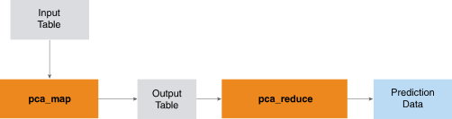

<html><head></head><body>
<h1 class="title topictitle1" id="ariaid-title1">PCA</h1>

The PCA function, which is composed of two functions, PCAMap and PCAReduce, uses a deterministic algorithm to identify the principal components of an input table in dense format.

  </img>  

<h2 class="title topictitle2" id="ariaid-title2">PCA Syntax</h2>

<h3 class="title sectiontitle">PCAReduce version 1.7, PCAMap version 1.7</h3><pre class="pre codeblock" xml:space="preserve"><code>SELECT * FROM PCAReduce (
  ON PCAMap (
    ON <var class="keyword varname">target_table</var> [ PARTITION BY { ANY | KEY } ]
    [ USING Target_Columns ({ '<var class="keyword varname">target_column</var>' | <var class="keyword varname">target_column</var><var class="keyword varname">_range</var> }[,...]) ]
  ) AS <var class="keyword varname">alias_1</var> PARTITION BY 1
  [ USING Components (<var class="keyword varname">num_components</var>) ]
) AS <var class="keyword varname">alias_2</var> ORDER BY <var class="keyword varname">component_rank</var>;</code></pre>

<b>Related Information</b>

<ul class="linklist linklist relinfo">
<a href="ndv1557782188375.md">Column Specification Syntax Elements</a>
</ul>

<h2 class="title topictitle2" id="ariaid-title3">PCA Syntax Elements</h2>

<dl class="dl parml"><dt class="dt pt dlterm">Target_Columns</dt><dd class="dd pd">[Optional] Specify the <var class="keyword varname">target_table</var> columns that contain the data, which must be numeric.</dd><dd class="dd pd ddexpand">Default: Every <var class="keyword varname">target_table</var> column</dd><dt class="dt pt dlterm">Components</dt><dd class="dd pd">[Optional] Specify the number of principal components to return (an integer). If <var class="keyword varname">num_components</var> is <var class="keyword varname">k</var>, then the function returns the top <var class="keyword varname">k</var> components.</dd><dd class="dd pd ddexpand">Default: Every principal component</dd></dl>

<h2 class="title topictitle2" id="ariaid-title4">PCA Input</h2>

<h3 class="title sectiontitle">PCAMap Input Table Schema</h3>
<b>Note</b>
It is important to normalize the input variables before calling this function. For details, see <a href="qnw1570800778984.md">Normalized Input</a>.

<table cellpadding="4" cellspacing="0" summary="" id="hkq1507735975124__table_N10018_N1000E_N1000C_N10001" class="table" frame="border" border="1" rules="all">

<colgroup span="1"><col style="width:23.076923076923077%" span="1"></col><col style="width:15.384615384615385%" span="1"></col><col style="width:61.53846153846154%" span="1"></col></colgroup><thead class="thead" style="text-align:left;"><tr class="row"><th class="entry nocellnorowborder" style="vertical-align:top;" id="d40e189" rowspan="1" colspan="1">Column</th><th class="entry nocellnorowborder" style="vertical-align:top;" id="d40e191" rowspan="1" colspan="1">Data Type</th><th class="entry cell-norowborder" style="vertical-align:top;" id="d40e193" rowspan="1" colspan="1">Description</th></tr></thead><tbody class="tbody"><tr class="row"><td class="entry row-nocellborder" style="vertical-align:top;" headers="d40e189" rowspan="1" colspan="1"><var class="keyword varname">target_column_i</var></td><td class="entry row-nocellborder" style="vertical-align:top;" headers="d40e191" rowspan="1" colspan="1">NUMERIC</td><td class="entry cellrowborder" style="vertical-align:top;" headers="d40e193" rowspan="1" colspan="1">[Column appears once for each dimension.] Values of <var class="keyword varname">i</var>th dimension of data set.</td></tr></tbody></table>

The function ignores input rows with NULL values.

<h2 class="title topictitle2" id="ariaid-title5">PCA Output</h2>

<h3 class="title sectiontitle">PCAReduce Output Table Schema</h3>

Each row represents a principal component. The rows are in descending order based on the standard deviation, which is a measure of the variation in the data set that was captured by that principal component.

<table cellpadding="4" cellspacing="0" summary="" id="nbp1507735978868__table_N10014_N1000E_N1000C_N10001" class="table" frame="border" border="1" rules="all">

<colgroup span="1"><col style="width:23.076923076923077%" span="1"></col><col style="width:15.384615384615385%" span="1"></col><col style="width:61.53846153846154%" span="1"></col></colgroup><thead class="thead" style="text-align:left;"><tr class="row"><th class="entry nocellnorowborder" style="vertical-align:top;" id="d40e231" rowspan="1" colspan="1">Column</th><th class="entry nocellnorowborder" style="vertical-align:top;" id="d40e233" rowspan="1" colspan="1">Data Type</th><th class="entry cell-norowborder" style="vertical-align:top;" id="d40e235" rowspan="1" colspan="1">Description</th></tr></thead><tbody class="tbody"><tr class="row"><td class="entry nocellnorowborder" style="vertical-align:top;" headers="d40e231" rowspan="1" colspan="1">component_rank</td><td class="entry nocellnorowborder" style="vertical-align:top;" headers="d40e233" rowspan="1" colspan="1">INTEGER</td><td class="entry cell-norowborder" style="vertical-align:top;" headers="d40e235" rowspan="1" colspan="1">Rank of principal component. Components are ranked in descending order of standard deviation (and variance).</td></tr><tr class="row"><td class="entry nocellnorowborder" style="vertical-align:top;" headers="d40e231" rowspan="1" colspan="1"><var class="keyword varname">dimension_i</var></td><td class="entry nocellnorowborder" style="vertical-align:top;" headers="d40e233" rowspan="1" colspan="1">DOUBLE PRECISION</td><td class="entry cell-norowborder" style="vertical-align:top;" headers="d40e235" rowspan="1" colspan="1">[Column appears once for each dimension.] Values of <var class="keyword varname">i</var>th dimension of data set.</td></tr><tr class="row"><td class="entry nocellnorowborder" style="vertical-align:top;" headers="d40e231" rowspan="1" colspan="1">sd</td><td class="entry nocellnorowborder" style="vertical-align:top;" headers="d40e233" rowspan="1" colspan="1">DOUBLE PRECISION</td><td class="entry cell-norowborder" style="vertical-align:top;" headers="d40e235" rowspan="1" colspan="1">Standard deviation of components in eigenvector represented by row.</td></tr><tr class="row"><td class="entry nocellnorowborder" style="vertical-align:top;" headers="d40e231" rowspan="1" colspan="1">var_proportion</td><td class="entry nocellnorowborder" style="vertical-align:top;" headers="d40e233" rowspan="1" colspan="1">DOUBLE PRECISION</td><td class="entry cell-norowborder" style="vertical-align:top;" headers="d40e235" rowspan="1" colspan="1">Proportion of variance of components in eigenvector represented by row.</td></tr><tr class="row"><td class="entry nocellnorowborder" style="vertical-align:top;" headers="d40e231" rowspan="1" colspan="1">cumulative_var</td><td class="entry nocellnorowborder" style="vertical-align:top;" headers="d40e233" rowspan="1" colspan="1">DOUBLE PRECISION</td><td class="entry cell-norowborder" style="vertical-align:top;" headers="d40e235" rowspan="1" colspan="1">Cumulative variance of components in eigenvector represented by row.</td></tr><tr class="row"><td class="entry row-nocellborder" style="vertical-align:top;" headers="d40e231" rowspan="1" colspan="1">mean</td><td class="entry row-nocellborder" style="vertical-align:top;" headers="d40e233" rowspan="1" colspan="1">VARCHAR</td><td class="entry cellrowborder" style="vertical-align:top;" headers="d40e235" rowspan="1" colspan="1">One row of this column contains a list of average values, one for each <var class="keyword varname">target_column_i</var> in the input table. The list has this format:

[<var class="keyword varname">average</var><code class="ph codeph">[,</code><var class="keyword varname">average</var><code class="ph codeph">...]</code>]

The outer brackets appear in the table.

The other rows of this column contain NULL.
</td></tr></tbody></table>

<h2 class="title topictitle2" id="ariaid-title6">PCA Example</h2>

This example uses the PCAMap and PCAReduce functions to calculate the principal components of a data set. The output displays the identified principal components, ranked according to standard deviation.

<h3 class="title sectiontitle">Input</h3>

The input table, patient_pca_input, contains medical data for 25 patients, identified by patient ID (pid).

Data attributes:

<ul class="ul" id="cpt1507736164224__ul_ttg_sxf_ndb">
<li class="li">Age (years)</li>
<li class="li">Body mass index (BMI) (kg/m2)</li>
<li class="li">Blood pressure (mm Hg)</li>
<li class="li">Blood glucose level (mg/dL)</li>
<li class="li">Strokes (number experienced)</li>
<li class="li">Cigarettes (number smoked/month)</li>
<li class="li">Insulin (mg/dL)</li>
<li class="li">High-density lipoproteins (HDL) (mg/dL)</li></ul>
<table cellpadding="4" cellspacing="0" summary="" id="cpt1507736164224__table_pmc_5fg_n2b" class="table" frame="border" border="1" rules="all">
patient_pca_input
<colgroup span="1"><col style="width:11.11111111111111%" span="1"></col><col style="width:11.11111111111111%" span="1"></col><col style="width:11.11111111111111%" span="1"></col><col style="width:11.11111111111111%" span="1"></col><col style="width:11.11111111111111%" span="1"></col><col style="width:11.11111111111111%" span="1"></col><col style="width:11.11111111111111%" span="1"></col><col style="width:11.11111111111111%" span="1"></col><col style="width:11.11111111111111%" span="1"></col></colgroup><thead class="thead" style="text-align:left;"><tr class="row"><th class="entry cellrowborder" style="vertical-align:top;" id="d40e366" rowspan="1" colspan="1">pid</th><th class="entry cellrowborder" style="vertical-align:top;" id="d40e368" rowspan="1" colspan="1">age</th><th class="entry cellrowborder" style="vertical-align:top;" id="d40e370" rowspan="1" colspan="1">bmi</th><th class="entry cellrowborder" style="vertical-align:top;" id="d40e372" rowspan="1" colspan="1">bloodpressure</th><th class="entry cellrowborder" style="vertical-align:top;" id="d40e374" rowspan="1" colspan="1">glucose</th><th class="entry cellrowborder" style="vertical-align:top;" id="d40e376" rowspan="1" colspan="1">strokes</th><th class="entry cellrowborder" style="vertical-align:top;" id="d40e378" rowspan="1" colspan="1">cigarettes</th><th class="entry cellrowborder" style="vertical-align:top;" id="d40e380" rowspan="1" colspan="1">insulin</th><th class="entry cellrowborder" style="vertical-align:top;" id="d40e382" rowspan="1" colspan="1">hdl</th></tr></thead><tbody class="tbody"><tr class="row"><td class="entry cellrowborder" style="vertical-align:top;" headers="d40e366" rowspan="1" colspan="1">1</td><td class="entry cellrowborder" style="vertical-align:top;" headers="d40e368" rowspan="1" colspan="1">50</td><td class="entry cellrowborder" style="vertical-align:top;" headers="d40e370" rowspan="1" colspan="1">33.6</td><td class="entry cellrowborder" style="vertical-align:top;" headers="d40e372" rowspan="1" colspan="1">72</td><td class="entry cellrowborder" style="vertical-align:top;" headers="d40e374" rowspan="1" colspan="1">148</td><td class="entry cellrowborder" style="vertical-align:top;" headers="d40e376" rowspan="1" colspan="1">6</td><td class="entry cellrowborder" style="vertical-align:top;" headers="d40e378" rowspan="1" colspan="1">35</td><td class="entry cellrowborder" style="vertical-align:top;" headers="d40e380" rowspan="1" colspan="1">0</td><td class="entry cellrowborder" style="vertical-align:top;" headers="d40e382" rowspan="1" colspan="1">62.7</td></tr><tr class="row"><td class="entry cellrowborder" style="vertical-align:top;" headers="d40e366" rowspan="1" colspan="1">2</td><td class="entry cellrowborder" style="vertical-align:top;" headers="d40e368" rowspan="1" colspan="1">31</td><td class="entry cellrowborder" style="vertical-align:top;" headers="d40e370" rowspan="1" colspan="1">26.6</td><td class="entry cellrowborder" style="vertical-align:top;" headers="d40e372" rowspan="1" colspan="1">66</td><td class="entry cellrowborder" style="vertical-align:top;" headers="d40e374" rowspan="1" colspan="1">85</td><td class="entry cellrowborder" style="vertical-align:top;" headers="d40e376" rowspan="1" colspan="1">1</td><td class="entry cellrowborder" style="vertical-align:top;" headers="d40e378" rowspan="1" colspan="1">29</td><td class="entry cellrowborder" style="vertical-align:top;" headers="d40e380" rowspan="1" colspan="1">0</td><td class="entry cellrowborder" style="vertical-align:top;" headers="d40e382" rowspan="1" colspan="1">35.1</td></tr><tr class="row"><td class="entry cellrowborder" style="vertical-align:top;" headers="d40e366" rowspan="1" colspan="1">3</td><td class="entry cellrowborder" style="vertical-align:top;" headers="d40e368" rowspan="1" colspan="1">32</td><td class="entry cellrowborder" style="vertical-align:top;" headers="d40e370" rowspan="1" colspan="1">23.3</td><td class="entry cellrowborder" style="vertical-align:top;" headers="d40e372" rowspan="1" colspan="1">64</td><td class="entry cellrowborder" style="vertical-align:top;" headers="d40e374" rowspan="1" colspan="1">183</td><td class="entry cellrowborder" style="vertical-align:top;" headers="d40e376" rowspan="1" colspan="1">8</td><td class="entry cellrowborder" style="vertical-align:top;" headers="d40e378" rowspan="1" colspan="1">0</td><td class="entry cellrowborder" style="vertical-align:top;" headers="d40e380" rowspan="1" colspan="1">0</td><td class="entry cellrowborder" style="vertical-align:top;" headers="d40e382" rowspan="1" colspan="1">67.2</td></tr><tr class="row"><td class="entry cellrowborder" style="vertical-align:top;" headers="d40e366" rowspan="1" colspan="1">4</td><td class="entry cellrowborder" style="vertical-align:top;" headers="d40e368" rowspan="1" colspan="1">21</td><td class="entry cellrowborder" style="vertical-align:top;" headers="d40e370" rowspan="1" colspan="1">28.1</td><td class="entry cellrowborder" style="vertical-align:top;" headers="d40e372" rowspan="1" colspan="1">66</td><td class="entry cellrowborder" style="vertical-align:top;" headers="d40e374" rowspan="1" colspan="1">89</td><td class="entry cellrowborder" style="vertical-align:top;" headers="d40e376" rowspan="1" colspan="1">1</td><td class="entry cellrowborder" style="vertical-align:top;" headers="d40e378" rowspan="1" colspan="1">23</td><td class="entry cellrowborder" style="vertical-align:top;" headers="d40e380" rowspan="1" colspan="1">94</td><td class="entry cellrowborder" style="vertical-align:top;" headers="d40e382" rowspan="1" colspan="1">16.7</td></tr><tr class="row"><td class="entry cellrowborder" style="vertical-align:top;" headers="d40e366" rowspan="1" colspan="1">5</td><td class="entry cellrowborder" style="vertical-align:top;" headers="d40e368" rowspan="1" colspan="1">33</td><td class="entry cellrowborder" style="vertical-align:top;" headers="d40e370" rowspan="1" colspan="1">43.1</td><td class="entry cellrowborder" style="vertical-align:top;" headers="d40e372" rowspan="1" colspan="1">40</td><td class="entry cellrowborder" style="vertical-align:top;" headers="d40e374" rowspan="1" colspan="1">137</td><td class="entry cellrowborder" style="vertical-align:top;" headers="d40e376" rowspan="1" colspan="1">0</td><td class="entry cellrowborder" style="vertical-align:top;" headers="d40e378" rowspan="1" colspan="1">35</td><td class="entry cellrowborder" style="vertical-align:top;" headers="d40e380" rowspan="1" colspan="1">168</td><td class="entry cellrowborder" style="vertical-align:top;" headers="d40e382" rowspan="1" colspan="1">228.8</td></tr><tr class="row"><td class="entry cellrowborder" style="vertical-align:top;" headers="d40e366" rowspan="1" colspan="1">6</td><td class="entry cellrowborder" style="vertical-align:top;" headers="d40e368" rowspan="1" colspan="1">30</td><td class="entry cellrowborder" style="vertical-align:top;" headers="d40e370" rowspan="1" colspan="1">25.6</td><td class="entry cellrowborder" style="vertical-align:top;" headers="d40e372" rowspan="1" colspan="1">74</td><td class="entry cellrowborder" style="vertical-align:top;" headers="d40e374" rowspan="1" colspan="1">116</td><td class="entry cellrowborder" style="vertical-align:top;" headers="d40e376" rowspan="1" colspan="1">5</td><td class="entry cellrowborder" style="vertical-align:top;" headers="d40e378" rowspan="1" colspan="1">0</td><td class="entry cellrowborder" style="vertical-align:top;" headers="d40e380" rowspan="1" colspan="1">0</td><td class="entry cellrowborder" style="vertical-align:top;" headers="d40e382" rowspan="1" colspan="1">20.1</td></tr><tr class="row"><td class="entry cellrowborder" style="vertical-align:top;" headers="d40e366" rowspan="1" colspan="1">7</td><td class="entry cellrowborder" style="vertical-align:top;" headers="d40e368" rowspan="1" colspan="1">26</td><td class="entry cellrowborder" style="vertical-align:top;" headers="d40e370" rowspan="1" colspan="1">31</td><td class="entry cellrowborder" style="vertical-align:top;" headers="d40e372" rowspan="1" colspan="1">50</td><td class="entry cellrowborder" style="vertical-align:top;" headers="d40e374" rowspan="1" colspan="1">78</td><td class="entry cellrowborder" style="vertical-align:top;" headers="d40e376" rowspan="1" colspan="1">3</td><td class="entry cellrowborder" style="vertical-align:top;" headers="d40e378" rowspan="1" colspan="1">32</td><td class="entry cellrowborder" style="vertical-align:top;" headers="d40e380" rowspan="1" colspan="1">88</td><td class="entry cellrowborder" style="vertical-align:top;" headers="d40e382" rowspan="1" colspan="1">24.8</td></tr><tr class="row"><td class="entry cellrowborder" style="vertical-align:top;" headers="d40e366" rowspan="1" colspan="1">8</td><td class="entry cellrowborder" style="vertical-align:top;" headers="d40e368" rowspan="1" colspan="1">29</td><td class="entry cellrowborder" style="vertical-align:top;" headers="d40e370" rowspan="1" colspan="1">35.3</td><td class="entry cellrowborder" style="vertical-align:top;" headers="d40e372" rowspan="1" colspan="1">0</td><td class="entry cellrowborder" style="vertical-align:top;" headers="d40e374" rowspan="1" colspan="1">115</td><td class="entry cellrowborder" style="vertical-align:top;" headers="d40e376" rowspan="1" colspan="1">10</td><td class="entry cellrowborder" style="vertical-align:top;" headers="d40e378" rowspan="1" colspan="1">0</td><td class="entry cellrowborder" style="vertical-align:top;" headers="d40e380" rowspan="1" colspan="1">0</td><td class="entry cellrowborder" style="vertical-align:top;" headers="d40e382" rowspan="1" colspan="1">13.4</td></tr><tr class="row"><td class="entry cellrowborder" style="vertical-align:top;" headers="d40e366" rowspan="1" colspan="1">9</td><td class="entry cellrowborder" style="vertical-align:top;" headers="d40e368" rowspan="1" colspan="1">53</td><td class="entry cellrowborder" style="vertical-align:top;" headers="d40e370" rowspan="1" colspan="1">30.5</td><td class="entry cellrowborder" style="vertical-align:top;" headers="d40e372" rowspan="1" colspan="1">70</td><td class="entry cellrowborder" style="vertical-align:top;" headers="d40e374" rowspan="1" colspan="1">197</td><td class="entry cellrowborder" style="vertical-align:top;" headers="d40e376" rowspan="1" colspan="1">2</td><td class="entry cellrowborder" style="vertical-align:top;" headers="d40e378" rowspan="1" colspan="1">45</td><td class="entry cellrowborder" style="vertical-align:top;" headers="d40e380" rowspan="1" colspan="1">543</td><td class="entry cellrowborder" style="vertical-align:top;" headers="d40e382" rowspan="1" colspan="1">15.8</td></tr><tr class="row"><td class="entry cellrowborder" style="vertical-align:top;" headers="d40e366" rowspan="1" colspan="1">10</td><td class="entry cellrowborder" style="vertical-align:top;" headers="d40e368" rowspan="1" colspan="1">54</td><td class="entry cellrowborder" style="vertical-align:top;" headers="d40e370" rowspan="1" colspan="1">0</td><td class="entry cellrowborder" style="vertical-align:top;" headers="d40e372" rowspan="1" colspan="1">96</td><td class="entry cellrowborder" style="vertical-align:top;" headers="d40e374" rowspan="1" colspan="1">125</td><td class="entry cellrowborder" style="vertical-align:top;" headers="d40e376" rowspan="1" colspan="1">8</td><td class="entry cellrowborder" style="vertical-align:top;" headers="d40e378" rowspan="1" colspan="1">0</td><td class="entry cellrowborder" style="vertical-align:top;" headers="d40e380" rowspan="1" colspan="1">0</td><td class="entry cellrowborder" style="vertical-align:top;" headers="d40e382" rowspan="1" colspan="1">23.2</td></tr><tr class="row"><td class="entry cellrowborder" style="vertical-align:top;" headers="d40e366" rowspan="1" colspan="1">11</td><td class="entry cellrowborder" style="vertical-align:top;" headers="d40e368" rowspan="1" colspan="1">30</td><td class="entry cellrowborder" style="vertical-align:top;" headers="d40e370" rowspan="1" colspan="1">37.6</td><td class="entry cellrowborder" style="vertical-align:top;" headers="d40e372" rowspan="1" colspan="1">92</td><td class="entry cellrowborder" style="vertical-align:top;" headers="d40e374" rowspan="1" colspan="1">110</td><td class="entry cellrowborder" style="vertical-align:top;" headers="d40e376" rowspan="1" colspan="1">4</td><td class="entry cellrowborder" style="vertical-align:top;" headers="d40e378" rowspan="1" colspan="1">0</td><td class="entry cellrowborder" style="vertical-align:top;" headers="d40e380" rowspan="1" colspan="1">0</td><td class="entry cellrowborder" style="vertical-align:top;" headers="d40e382" rowspan="1" colspan="1">19.1</td></tr><tr class="row"><td class="entry cellrowborder" style="vertical-align:top;" headers="d40e366" rowspan="1" colspan="1">12</td><td class="entry cellrowborder" style="vertical-align:top;" headers="d40e368" rowspan="1" colspan="1">34</td><td class="entry cellrowborder" style="vertical-align:top;" headers="d40e370" rowspan="1" colspan="1">38</td><td class="entry cellrowborder" style="vertical-align:top;" headers="d40e372" rowspan="1" colspan="1">74</td><td class="entry cellrowborder" style="vertical-align:top;" headers="d40e374" rowspan="1" colspan="1">168</td><td class="entry cellrowborder" style="vertical-align:top;" headers="d40e376" rowspan="1" colspan="1">10</td><td class="entry cellrowborder" style="vertical-align:top;" headers="d40e378" rowspan="1" colspan="1">0</td><td class="entry cellrowborder" style="vertical-align:top;" headers="d40e380" rowspan="1" colspan="1">0</td><td class="entry cellrowborder" style="vertical-align:top;" headers="d40e382" rowspan="1" colspan="1">53.7</td></tr><tr class="row"><td class="entry cellrowborder" style="vertical-align:top;" headers="d40e366" rowspan="1" colspan="1">13</td><td class="entry cellrowborder" style="vertical-align:top;" headers="d40e368" rowspan="1" colspan="1">57</td><td class="entry cellrowborder" style="vertical-align:top;" headers="d40e370" rowspan="1" colspan="1">27.1</td><td class="entry cellrowborder" style="vertical-align:top;" headers="d40e372" rowspan="1" colspan="1">80</td><td class="entry cellrowborder" style="vertical-align:top;" headers="d40e374" rowspan="1" colspan="1">139</td><td class="entry cellrowborder" style="vertical-align:top;" headers="d40e376" rowspan="1" colspan="1">10</td><td class="entry cellrowborder" style="vertical-align:top;" headers="d40e378" rowspan="1" colspan="1">0</td><td class="entry cellrowborder" style="vertical-align:top;" headers="d40e380" rowspan="1" colspan="1">0</td><td class="entry cellrowborder" style="vertical-align:top;" headers="d40e382" rowspan="1" colspan="1">144.1</td></tr><tr class="row"><td class="entry cellrowborder" style="vertical-align:top;" headers="d40e366" rowspan="1" colspan="1">14</td><td class="entry cellrowborder" style="vertical-align:top;" headers="d40e368" rowspan="1" colspan="1">59</td><td class="entry cellrowborder" style="vertical-align:top;" headers="d40e370" rowspan="1" colspan="1">30.1</td><td class="entry cellrowborder" style="vertical-align:top;" headers="d40e372" rowspan="1" colspan="1">60</td><td class="entry cellrowborder" style="vertical-align:top;" headers="d40e374" rowspan="1" colspan="1">189</td><td class="entry cellrowborder" style="vertical-align:top;" headers="d40e376" rowspan="1" colspan="1">1</td><td class="entry cellrowborder" style="vertical-align:top;" headers="d40e378" rowspan="1" colspan="1">23</td><td class="entry cellrowborder" style="vertical-align:top;" headers="d40e380" rowspan="1" colspan="1">846</td><td class="entry cellrowborder" style="vertical-align:top;" headers="d40e382" rowspan="1" colspan="1">39.8</td></tr><tr class="row"><td class="entry cellrowborder" style="vertical-align:top;" headers="d40e366" rowspan="1" colspan="1">15</td><td class="entry cellrowborder" style="vertical-align:top;" headers="d40e368" rowspan="1" colspan="1">51</td><td class="entry cellrowborder" style="vertical-align:top;" headers="d40e370" rowspan="1" colspan="1">25.8</td><td class="entry cellrowborder" style="vertical-align:top;" headers="d40e372" rowspan="1" colspan="1">72</td><td class="entry cellrowborder" style="vertical-align:top;" headers="d40e374" rowspan="1" colspan="1">166</td><td class="entry cellrowborder" style="vertical-align:top;" headers="d40e376" rowspan="1" colspan="1">5</td><td class="entry cellrowborder" style="vertical-align:top;" headers="d40e378" rowspan="1" colspan="1">19</td><td class="entry cellrowborder" style="vertical-align:top;" headers="d40e380" rowspan="1" colspan="1">175</td><td class="entry cellrowborder" style="vertical-align:top;" headers="d40e382" rowspan="1" colspan="1">58.7</td></tr><tr class="row"><td class="entry cellrowborder" style="vertical-align:top;" headers="d40e366" rowspan="1" colspan="1">16</td><td class="entry cellrowborder" style="vertical-align:top;" headers="d40e368" rowspan="1" colspan="1">32</td><td class="entry cellrowborder" style="vertical-align:top;" headers="d40e370" rowspan="1" colspan="1">30</td><td class="entry cellrowborder" style="vertical-align:top;" headers="d40e372" rowspan="1" colspan="1">0</td><td class="entry cellrowborder" style="vertical-align:top;" headers="d40e374" rowspan="1" colspan="1">100</td><td class="entry cellrowborder" style="vertical-align:top;" headers="d40e376" rowspan="1" colspan="1">7</td><td class="entry cellrowborder" style="vertical-align:top;" headers="d40e378" rowspan="1" colspan="1">0</td><td class="entry cellrowborder" style="vertical-align:top;" headers="d40e380" rowspan="1" colspan="1">0</td><td class="entry cellrowborder" style="vertical-align:top;" headers="d40e382" rowspan="1" colspan="1">48.4</td></tr><tr class="row"><td class="entry cellrowborder" style="vertical-align:top;" headers="d40e366" rowspan="1" colspan="1">17</td><td class="entry cellrowborder" style="vertical-align:top;" headers="d40e368" rowspan="1" colspan="1">31</td><td class="entry cellrowborder" style="vertical-align:top;" headers="d40e370" rowspan="1" colspan="1">45.8</td><td class="entry cellrowborder" style="vertical-align:top;" headers="d40e372" rowspan="1" colspan="1">84</td><td class="entry cellrowborder" style="vertical-align:top;" headers="d40e374" rowspan="1" colspan="1">118</td><td class="entry cellrowborder" style="vertical-align:top;" headers="d40e376" rowspan="1" colspan="1">0</td><td class="entry cellrowborder" style="vertical-align:top;" headers="d40e378" rowspan="1" colspan="1">47</td><td class="entry cellrowborder" style="vertical-align:top;" headers="d40e380" rowspan="1" colspan="1">230</td><td class="entry cellrowborder" style="vertical-align:top;" headers="d40e382" rowspan="1" colspan="1">55.1</td></tr><tr class="row"><td class="entry cellrowborder" style="vertical-align:top;" headers="d40e366" rowspan="1" colspan="1">18</td><td class="entry cellrowborder" style="vertical-align:top;" headers="d40e368" rowspan="1" colspan="1">31</td><td class="entry cellrowborder" style="vertical-align:top;" headers="d40e370" rowspan="1" colspan="1">29.6</td><td class="entry cellrowborder" style="vertical-align:top;" headers="d40e372" rowspan="1" colspan="1">74</td><td class="entry cellrowborder" style="vertical-align:top;" headers="d40e374" rowspan="1" colspan="1">107</td><td class="entry cellrowborder" style="vertical-align:top;" headers="d40e376" rowspan="1" colspan="1">7</td><td class="entry cellrowborder" style="vertical-align:top;" headers="d40e378" rowspan="1" colspan="1">0</td><td class="entry cellrowborder" style="vertical-align:top;" headers="d40e380" rowspan="1" colspan="1">0</td><td class="entry cellrowborder" style="vertical-align:top;" headers="d40e382" rowspan="1" colspan="1">25.4</td></tr><tr class="row"><td class="entry cellrowborder" style="vertical-align:top;" headers="d40e366" rowspan="1" colspan="1">19</td><td class="entry cellrowborder" style="vertical-align:top;" headers="d40e368" rowspan="1" colspan="1">33</td><td class="entry cellrowborder" style="vertical-align:top;" headers="d40e370" rowspan="1" colspan="1">43.3</td><td class="entry cellrowborder" style="vertical-align:top;" headers="d40e372" rowspan="1" colspan="1">30</td><td class="entry cellrowborder" style="vertical-align:top;" headers="d40e374" rowspan="1" colspan="1">103</td><td class="entry cellrowborder" style="vertical-align:top;" headers="d40e376" rowspan="1" colspan="1">1</td><td class="entry cellrowborder" style="vertical-align:top;" headers="d40e378" rowspan="1" colspan="1">38</td><td class="entry cellrowborder" style="vertical-align:top;" headers="d40e380" rowspan="1" colspan="1">83</td><td class="entry cellrowborder" style="vertical-align:top;" headers="d40e382" rowspan="1" colspan="1">18.3</td></tr><tr class="row"><td class="entry cellrowborder" style="vertical-align:top;" headers="d40e366" rowspan="1" colspan="1">20</td><td class="entry cellrowborder" style="vertical-align:top;" headers="d40e368" rowspan="1" colspan="1">32</td><td class="entry cellrowborder" style="vertical-align:top;" headers="d40e370" rowspan="1" colspan="1">34.6</td><td class="entry cellrowborder" style="vertical-align:top;" headers="d40e372" rowspan="1" colspan="1">70</td><td class="entry cellrowborder" style="vertical-align:top;" headers="d40e374" rowspan="1" colspan="1">115</td><td class="entry cellrowborder" style="vertical-align:top;" headers="d40e376" rowspan="1" colspan="1">1</td><td class="entry cellrowborder" style="vertical-align:top;" headers="d40e378" rowspan="1" colspan="1">30</td><td class="entry cellrowborder" style="vertical-align:top;" headers="d40e380" rowspan="1" colspan="1">96</td><td class="entry cellrowborder" style="vertical-align:top;" headers="d40e382" rowspan="1" colspan="1">52.9</td></tr><tr class="row"><td class="entry cellrowborder" style="vertical-align:top;" headers="d40e366" rowspan="1" colspan="1">21</td><td class="entry cellrowborder" style="vertical-align:top;" headers="d40e368" rowspan="1" colspan="1">27</td><td class="entry cellrowborder" style="vertical-align:top;" headers="d40e370" rowspan="1" colspan="1">39.3</td><td class="entry cellrowborder" style="vertical-align:top;" headers="d40e372" rowspan="1" colspan="1">88</td><td class="entry cellrowborder" style="vertical-align:top;" headers="d40e374" rowspan="1" colspan="1">126</td><td class="entry cellrowborder" style="vertical-align:top;" headers="d40e376" rowspan="1" colspan="1">3</td><td class="entry cellrowborder" style="vertical-align:top;" headers="d40e378" rowspan="1" colspan="1">41</td><td class="entry cellrowborder" style="vertical-align:top;" headers="d40e380" rowspan="1" colspan="1">235</td><td class="entry cellrowborder" style="vertical-align:top;" headers="d40e382" rowspan="1" colspan="1">70.4</td></tr><tr class="row"><td class="entry cellrowborder" style="vertical-align:top;" headers="d40e366" rowspan="1" colspan="1">22</td><td class="entry cellrowborder" style="vertical-align:top;" headers="d40e368" rowspan="1" colspan="1">50</td><td class="entry cellrowborder" style="vertical-align:top;" headers="d40e370" rowspan="1" colspan="1">35.4</td><td class="entry cellrowborder" style="vertical-align:top;" headers="d40e372" rowspan="1" colspan="1">84</td><td class="entry cellrowborder" style="vertical-align:top;" headers="d40e374" rowspan="1" colspan="1">99</td><td class="entry cellrowborder" style="vertical-align:top;" headers="d40e376" rowspan="1" colspan="1">8</td><td class="entry cellrowborder" style="vertical-align:top;" headers="d40e378" rowspan="1" colspan="1">0</td><td class="entry cellrowborder" style="vertical-align:top;" headers="d40e380" rowspan="1" colspan="1">0</td><td class="entry cellrowborder" style="vertical-align:top;" headers="d40e382" rowspan="1" colspan="1">38.8</td></tr><tr class="row"><td class="entry cellrowborder" style="vertical-align:top;" headers="d40e366" rowspan="1" colspan="1">23</td><td class="entry cellrowborder" style="vertical-align:top;" headers="d40e368" rowspan="1" colspan="1">41</td><td class="entry cellrowborder" style="vertical-align:top;" headers="d40e370" rowspan="1" colspan="1">39.8</td><td class="entry cellrowborder" style="vertical-align:top;" headers="d40e372" rowspan="1" colspan="1">90</td><td class="entry cellrowborder" style="vertical-align:top;" headers="d40e374" rowspan="1" colspan="1">196</td><td class="entry cellrowborder" style="vertical-align:top;" headers="d40e376" rowspan="1" colspan="1">7</td><td class="entry cellrowborder" style="vertical-align:top;" headers="d40e378" rowspan="1" colspan="1">0</td><td class="entry cellrowborder" style="vertical-align:top;" headers="d40e380" rowspan="1" colspan="1">0</td><td class="entry cellrowborder" style="vertical-align:top;" headers="d40e382" rowspan="1" colspan="1">45.1</td></tr><tr class="row"><td class="entry cellrowborder" style="vertical-align:top;" headers="d40e366" rowspan="1" colspan="1">24</td><td class="entry cellrowborder" style="vertical-align:top;" headers="d40e368" rowspan="1" colspan="1">29</td><td class="entry cellrowborder" style="vertical-align:top;" headers="d40e370" rowspan="1" colspan="1">29</td><td class="entry cellrowborder" style="vertical-align:top;" headers="d40e372" rowspan="1" colspan="1">80</td><td class="entry cellrowborder" style="vertical-align:top;" headers="d40e374" rowspan="1" colspan="1">119</td><td class="entry cellrowborder" style="vertical-align:top;" headers="d40e376" rowspan="1" colspan="1">9</td><td class="entry cellrowborder" style="vertical-align:top;" headers="d40e378" rowspan="1" colspan="1">35</td><td class="entry cellrowborder" style="vertical-align:top;" headers="d40e380" rowspan="1" colspan="1">0</td><td class="entry cellrowborder" style="vertical-align:top;" headers="d40e382" rowspan="1" colspan="1">26.3</td></tr><tr class="row"><td class="entry cellrowborder" style="vertical-align:top;" headers="d40e366" rowspan="1" colspan="1">25</td><td class="entry cellrowborder" style="vertical-align:top;" headers="d40e368" rowspan="1" colspan="1">51</td><td class="entry cellrowborder" style="vertical-align:top;" headers="d40e370" rowspan="1" colspan="1">36.6</td><td class="entry cellrowborder" style="vertical-align:top;" headers="d40e372" rowspan="1" colspan="1">94</td><td class="entry cellrowborder" style="vertical-align:top;" headers="d40e374" rowspan="1" colspan="1">143</td><td class="entry cellrowborder" style="vertical-align:top;" headers="d40e376" rowspan="1" colspan="1">11</td><td class="entry cellrowborder" style="vertical-align:top;" headers="d40e378" rowspan="1" colspan="1">33</td><td class="entry cellrowborder" style="vertical-align:top;" headers="d40e380" rowspan="1" colspan="1">146</td><td class="entry cellrowborder" style="vertical-align:top;" headers="d40e382" rowspan="1" colspan="1">25.4</td></tr></tbody></table>

<h3 class="title sectiontitle">Normalized Input</h3>

The reason to normalize the input variables before inputting them to the PCA function is that if some variables have much larger variance than others, they dominate in the first few principal components.

The following commands use the Scale and ScaleMap functions to create a table of normalized input variables, pca_scaled, from the patient_pca_input data set:
<pre class="pre codeblock" xml:space="preserve"><code>CREATE MULTISET TABLE tmpScale AS (
  SELECT * FROM ScaleMap (                                                                      ON patient_pca_input
    USING
    InputColumns ('[1:8]')
    MissValue ('omit')
  ) AS dt
) WITH DATA;</code></pre><pre class="pre codeblock" xml:space="preserve"><code>CREATE MULTISET TABLE pca_scaled AS (
  SELECT * FROM Scale (
    ON patient_pca_input AS InputTable PARTITION BY ANY
    ON tmpScale AS statistic DIMENSION
    USING
    ScaleMethod ('std')
    Accumulate ('pid')
  ) AS dt
) WITH DATA;
</code></pre>

<h3 class="title sectiontitle">SQL Calls</h3>

This query conducts a principal component analysis on the normalized input data:
<pre class="pre codeblock" xml:space="preserve"><code>SELECT * FROM PCAReduce (
  ON (SELECT * FROM  PCAMap (
  ON pca_scaled
  USING
  TargetColumns('[1:8]')
) AS dt1 ) PARTITION BY 1
) AS dt;</code></pre>

<h3 class="title sectiontitle">Output</h3><pre class="pre screen" xml:space="preserve"> component_rank age                  bmi                 bloodpressure        glucose              strokes              cigarettes            insulin              hdl                   sd                  var_proportion       cumulative_var      mean                                                                                                                                                                          
 -------------- -------------------- ------------------- -------------------- -------------------- -------------------- --------------------- -------------------- --------------------- ------------------- -------------------- ------------------- ----------------------------------------------------------------------------------------------------------------------------------------------------------------------------- 
              1  0.08209456624137079 -0.3870046090920526  0.09345439689066688 -0.04216593563916513   0.5531712742637565   -0.5556501224007842 -0.43685302464081466   -0.1654996736437919   1.472109758037739  0.28217540881639736 0.28217540881639736 [-2.486899575160351E-16, -6.661338147750939E-16, 9.769962616701378E-17, -1.0658141036401502E-16, 1.7763568394002505E-17, -5.329070518200751E-17, 0.0, -5.329070518200751E-17]
              2  -0.6028733018225988 0.17861430770359402 -0.31903125250345443  -0.5700201930411378 -0.11893913442095008 -0.005196208048840971  -0.3943619845210589  -0.09078467587773241  1.4241934069709463   0.2641050599556657   0.546280468772063 NULL                                                                                                                                                                         
              3  0.02374359397742567 0.39186196324224787 -0.30591120403327365  0.23782383985742445   0.2173850060727078   -0.1967429451346994  -0.1922943077460684    0.7568338469137748   1.049099321858834   0.1433085139485242  0.6895889827205872 NULL                                                                                                                                                                         
              4 -0.09998801486200944 0.21435051698676735   0.8444287615246641  -0.0918928665696382 0.011305174477644377    0.2111352882378259  -0.3579033088614018    0.2230500507326031   0.922502599277917   0.1108087299055356  0.8003977126261228 NULL                                                                                                                                                                         
              5 -0.14085382468973354  0.6716168063561156 0.015501081352144553   0.3351077534037482  0.34696752296785255 -0.038650465429363866 0.043038964135395014   -0.5411292846166164  0.8339617788814034  0.09055888654102022   0.890956599167143 NULL                                                                                                                                                                         
              6   0.5273985574183678  0.1083454629714406 -0.19613416785828364 -0.41491662766966964   0.4324034630774445    0.5429592283215245 -0.12781293754536002  -0.03706719659550343  0.6386214541768617 0.053103823142574176  0.9440604223097172 NULL                                                                                                                                                                         
              7   0.4246146518729586  0.3900261133262609  0.13557114512538138 -0.47994711699092446  -0.2574558219181479    -0.557165978164135  0.20322505229037413 -0.028903434023275044  0.5350610892169184   0.0372773918221348   0.981337814131852 NULL                                                                                                                                                                         
              8  0.37544142271498704  0.0624033352765424 -0.16048460010093996  0.30576508343845227   -0.508751667006649  0.034749606866136186  -0.6550398914761275  -0.21630745584000433 0.37858365979975517 0.018662185868148023                 1.0 NULL                                                                    </pre>

<h3 class="title sectiontitle">Output for Unnormalized Input</h3>

If you run the model without first normalizing the input, you get the output in the following table.

The loadings for each principal component are different. For example, for the first principal component, which captures the most variance among input space, insulin has a much larger loading than every other variable. This is because the raw insulin values, ranging from 70 to 190, are much larger in magnitude than the values for most of the other variables (for example, BMI is usually 18 to 30).

Teradata usually recommends normalization when variables have different variances. However, in some data sets, the magnitudes of input variables do matter, and normalization is not recommended.
<pre class="pre screen" xml:space="preserve"> component_rank age                   bmi                    bloodpressure         glucose              strokes                cigarettes            insulin               hdl                    sd                 var_proportion        cumulative_var     mean                                                                  
 -------------- --------------------- ---------------------- --------------------- -------------------- ---------------------- --------------------- --------------------- ---------------------- ------------------ --------------------- ------------------ --------------------------------------------------------------------- 
              1 -0.023353196034411227 -0.0050495648788435234 -0.001586693912675234 -0.08420322566619312    0.00859257029825338  -0.04133292194971656   -0.9952634091735024 -0.0022210309439499357 194.71738506207055    0.9035607310846709 0.9035607310846709 [37.88, 31.964000000000002, 66.8, 130.84, 5.12, 18.6, 108.16, 49.172]
              2   0.04018597618816406    0.04041268203719046  -0.02234490883189587  0.21768528557138409 -0.0034452736055330785   0.01718483933772813 -0.022445681193031374     0.9736810189820199  46.33698444340015   0.05116858707616014  0.954729318160831 NULL                                                                 
              3   0.16820726416678253   -0.06380548610918492   0.47282409285264465   0.8207662481650843    0.05397534805226847  -0.18045788796064954  -0.06546598054699179   -0.17507466173441805  32.12651862361091  0.024596608174712386 0.9793259263355433 NULL                                                                 
              4 -0.012965205864271578  0.0037804534935903873   -0.8583798540505494  0.40689903096324975    0.03913361827590789  -0.29046477452424657 -0.020135596705586265   -0.10549004121778502 23.059456330930484   0.01267202492569593 0.9919979512612392 NULL                                                                 
              5  -0.23359815217156288    0.32078777092180283  -0.12435451993064969   0.3099450633949961  -0.056895698485650424    0.8461243985086968  -0.05759515026265747   -0.09228380566106692 14.473486862384386  0.004992225949626681 0.9969901772108658 NULL                                                                 
              6    0.7433370943722172    -0.5151426717933871  -0.15319563481636883 -0.02823965187653383    0.07056464778179963   0.38970912809735386 -0.027739402093030042   -0.01376818417563162  8.892127729665095 0.0018843400370318058 0.9988745172478976 NULL                                                                 
              7     0.585637286534736     0.7907071454804706 -0.005530068854870849 -0.09254912263578012    0.10792172202547658  -0.10181406223812656 -0.004677778713769677    -0.0343536603012951  6.538193488247754 0.0010187401634787858 0.9998932574113765 NULL                                                                 
              8   0.13888402112454176    0.02759219001059113 -0.012492398266161555 0.029497751534728455    -0.9877276605628905 -0.053811065310627085  -0.01213027272971143   -0.01658362623945359   2.11638619445855  1.067425886235164E-4                1.0 NULL                                                                 
</pre>

Download a zip file of all examples and a SQL script file that creates their input tables from the attachment in the left sidebar.

</body></html>
