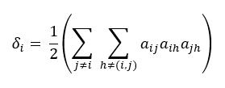
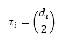
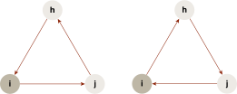
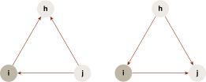
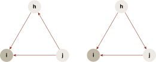
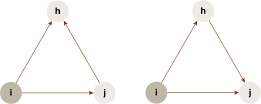
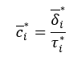
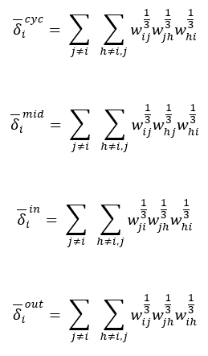
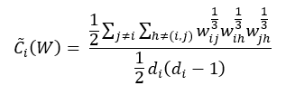
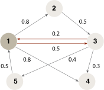

<html><head></head><body>
<h1 class="title topictitle1" id="ariaid-title1">LocalClusteringCoefficient (ML Engine)</h1>

The clustering coefficient, introduced by Watts and Strogatz in the
			context of binary undirected graphs, is frequently used for analyzing the structure of a
			network. The LocalClusteringCoefficient function extends the clustering coefficient to
			directed and weighted graphs. The LocalClusteringCoefficient function is based on the
			paper <cite class="cite">"Clustering in complex directed networks"</cite>by Georgio
			Fagiolo.

For general information about the clustering coefficient, see <cite class="cite">D. J. Watts and S. H. Strogatz. Collective dynamics of "small-world"
				networks. Nature, 393:440–442, 1998</cite>

<h2 class="title topictitle2" id="ariaid-title2">LocalClusteringCoefficient Background</h2>

The definition of the local clustering coefficient depends on the graph type:

<ul class="ul">
<li class="li"><a href="czi1558544370485.md#otu1507823229335">Unweighted, Undirected Network (BUN)</a></li>
<li class="li"><a href="czi1558544370485.md#zut1507823344466">Unweighted, Directed Network (BDN)</a></li>
<li class="li"><a href="czi1558544370485.md#edc1507823540923">Weighted, Directed Network (WDN)</a></li>
<li class="li"><a href="czi1558544370485.md#xhj1507823645782">Weighted, Undirected Network (WUN)</a></li></ul>

<h3 class="title topictitle3" id="ariaid-title3">Unweighted, Undirected Network (BUN)</h3>

The local clustering coefficient was originally defined on an unweighted, undirected graph—also called a bi-directed network (BUN). A <dfn class="term">simple</dfn> BUN has no self-loops and no multiple edges.

Let <var class="keyword varname">G</var> = (<var class="keyword varname">V</var>, <var class="keyword varname">E</var>) be a simple BUN with a set of nodes (vertices) <var class="keyword varname">V</var> and a set of edges <var class="keyword varname">E</var>.

The degree <var class="keyword varname">d</var><var class="keyword varname">i</var> of node <var class="keyword varname">i</var> is the number of nodes in <var class="keyword varname">V</var> that are adjacent to <var class="keyword varname">i</var>. A complete subgraph of three nodes of <var class="keyword varname">G</var> is called a <dfn class="term">triangle</dfn>. This is the formula for the number of triangles of node <var class="keyword varname">i</var>:

  </img>  

where <var class="keyword varname">a</var><var class="keyword varname">ij</var> = 1 if there is an edge from <var class="keyword varname">i</var> to <var class="keyword varname">j</var>; otherwise <var class="keyword varname">a</var><var class="keyword varname">ij</var> = 0.

A triple Ƴ at a node <var class="keyword varname">i</var> is a path of length two for which <var class="keyword varname">i</var> is the center node. This is the formula for the maximum number of triples of node <var class="keyword varname">i</var>:

  </img>  

The maximum number of triples occurs when every neighbor of node <var class="keyword varname">i</var> is connected to every other neighbor of node <var class="keyword varname">i</var>.

This is the formula for the clustering coefficient for a node <var class="keyword varname">i</var> with <var class="keyword varname">d</var><var class="keyword varname">i</var> ≥ 2:

<var class="keyword varname">c</var><var class="keyword varname">i</var> = δ<var class="keyword varname">i</var> / τ<var class="keyword varname">i</var>

<h3 class="title topictitle3" id="ariaid-title4">Unweighted, Directed Network (BDN)</h3>

For an unweighted, directed network (BDN), given a vertex <var class="keyword varname">i</var>, the BDN triangle types can be categorized to four patterns.

<table cellpadding="4" cellspacing="0" summary="" id="zut1507823344466__table_N10014_N1000E_N1000C_N10001" class="table" frame="border" border="1" rules="all">
Triangle Type Patterns
<colgroup span="1"><col style="width:14.285714285714285%" span="1"></col><col style="width:28.57142857142857%" span="1"></col><col style="width:57.14285714285714%" span="1"></col></colgroup><thead class="thead" style="text-align:left;"><tr class="row"><th class="entry nocellnorowborder" style="vertical-align:top;" id="d387984e261" rowspan="1" colspan="1">Pattern</th><th class="entry nocellnorowborder" style="vertical-align:top;" id="d387984e263" rowspan="1" colspan="1">Description</th><th class="entry cell-norowborder" style="vertical-align:top;" id="d387984e265" rowspan="1" colspan="1">Illustration</th></tr></thead><tbody class="tbody"><tr class="row"><td class="entry nocellnorowborder" style="vertical-align:top;" headers="d387984e261" rowspan="1" colspan="1">Cycle</td><td class="entry nocellnorowborder" style="vertical-align:top;" headers="d387984e263" rowspan="1" colspan="1">There is a cyclical relation among <var class="keyword varname">i</var> and any two of its neighbors: <var class="keyword varname">i</var>→<var class="keyword varname">j</var>→<var class="keyword varname">h</var>→<var class="keyword varname">i</var>, or the reverse.</td><td class="entry cell-norowborder" style="vertical-align:top;" headers="d387984e265" rowspan="1" colspan="1">

  </img>  
</td></tr><tr class="row"><td class="entry nocellnorowborder" style="vertical-align:top;" headers="d387984e261" rowspan="1" colspan="1">Middleman</td><td class="entry nocellnorowborder" style="vertical-align:top;" headers="d387984e263" rowspan="1" colspan="1">One of <var class="keyword varname">i</var>’s neighbors, <var class="keyword varname">j</var>, both holds an outward edge to a third neighbor, <var class="keyword varname">h</var>, and uses <var class="keyword varname">i</var> to reach <var class="keyword varname">h</var> in two steps.</td><td class="entry cell-norowborder" style="vertical-align:top;" headers="d387984e265" rowspan="1" colspan="1">

  </img>  
</td></tr><tr class="row"><td class="entry nocellnorowborder" style="vertical-align:top;" headers="d387984e261" rowspan="1" colspan="1">In</td><td class="entry nocellnorowborder" style="vertical-align:top;" headers="d387984e263" rowspan="1" colspan="1"><var class="keyword varname">i</var> holds two inward edges.</td><td class="entry cell-norowborder" style="vertical-align:top;" headers="d387984e265" rowspan="1" colspan="1"></img></td></tr><tr class="row"><td class="entry row-nocellborder" style="vertical-align:top;" headers="d387984e261" rowspan="1" colspan="1">Out</td><td class="entry row-nocellborder" style="vertical-align:top;" headers="d387984e263" rowspan="1" colspan="1"><var class="keyword varname">i</var> holds two outward edges.</td><td class="entry cellrowborder" style="vertical-align:top;" headers="d387984e265" rowspan="1" colspan="1">

  </img>  
</td></tr></tbody></table>

For each pattern, this is the formula for the clustering coefficient (CC):

<var class="keyword varname">c</var><var class="keyword varname">i</var>* = δ<var class="keyword varname">i</var>* / τ<var class="keyword varname">i</var>*

where {*}={<var class="keyword varname">cycle</var>, <var class="keyword varname">middleman</var>, <var class="keyword varname">in</var>, <var class="keyword varname">out</var>}.

These are the triples for each pattern:

τ<var class="keyword varname">i</var><var class="keyword varname">cyc</var> = <var class="keyword varname">d</var><var class="keyword varname">i</var><var class="keyword varname">in</var><var class="keyword varname">d</var><var class="keyword varname">i</var><var class="keyword varname">out</var> - <var class="keyword varname">d</var><var class="keyword varname">i</var>↔

where <var class="keyword varname">d</var><var class="keyword varname">i</var>↔ is the number of bilateral edges between <var class="keyword varname">i</var> and its neighbors.

τ<var class="keyword varname">i</var><var class="keyword varname">mid</var> = <var class="keyword varname">d</var><var class="keyword varname">i</var><var class="keyword varname">in</var><var class="keyword varname">d</var><var class="keyword varname">i</var><var class="keyword varname">out</var> - <var class="keyword varname">d</var><var class="keyword varname">i</var>↔

τ<var class="keyword varname">i</var><var class="keyword varname">in</var> = <var class="keyword varname">d</var><var class="keyword varname">i</var><var class="keyword varname">in</var>(<var class="keyword varname">d</var><var class="keyword varname">i</var><var class="keyword varname">in</var> - 1)

τ<var class="keyword varname">i</var><var class="keyword varname">out</var> = <var class="keyword varname">d</var><var class="keyword varname">i</var><var class="keyword varname">out</var>(<var class="keyword varname">d</var><var class="keyword varname">i</var><var class="keyword varname">out</var> - 1)

<h3 class="title topictitle3" id="ariaid-title5">Weighted, Directed Network (WDN)</h3>

For a weighted, directed network (WDN), CC is extended as:

  </img>  

where {*}={<var class="keyword varname">cycle</var>, <var class="keyword varname">middleman</var>, <var class="keyword varname">in</var>, <var class="keyword varname">out</var>}.

Assuming <var class="keyword varname">w</var><var class="keyword varname">ij</var> is the weight on the edge <var class="keyword varname">i</var>→<var class="keyword varname">j</var>, for node <var class="keyword varname">i</var>, these are the formulas for the weighted triangle for each pattern:

  </img>  

<h3 class="title topictitle3" id="ariaid-title6">Weighted, Undirected Network (WUN)</h3>

For a weighted, undirected network (WUN), assuming that <var class="keyword varname">w</var><var class="keyword varname">ij</var> is the weight on the edge <var class="keyword varname">i</var>→<var class="keyword varname">j</var>, for node <var class="keyword varname">i</var>, the formula for the clustering coefficient is:

  </img>  

<h2 class="title topictitle2" id="ariaid-title7">LocalClusteringCoefficient Syntax</h2>

<h3 class="title sectiontitle">Version 1.2</h3><pre class="pre codeblock" xml:space="preserve"><code>SELECT * FROM LocalClusteringCoefficient (
  ON <var class="keyword varname">vertices_table</var> AS Vertices PARTITION BY <var class="keyword varname">vertex_key_column</var> [,...] 
  ON <var class="keyword varname">edges_table</var> AS Edges PARTITION BY <var class="keyword varname">source_vertex_key_column</var> [,...]
  USING
  TargetKey ({ '<var class="keyword varname">target_vertex_column</var>' | <var class="keyword varname">target_vertex_column_range</var> }[,...])
  [ Directed (<b>{'true'|'t'|'yes'|'y'|'1'|'false'|'f'|'no'|'n'|'0'}</b>) ]
  [ EdgeWeight ('<var class="keyword varname">edge_weight</var>') ]
  [ DegreeRange ({ '[<var class="keyword varname">min</var>:<var class="keyword varname">max</var>]' | '[<var class="keyword varname">min</var>:]' | '[:<var class="keyword varname">max</var>]' }) ]
  <code class="ph codeph">[ Accumulate ({ '<var class="keyword varname">accumulate_column</var>' | <var class="keyword varname">accumulate_column_range</var> }[,...]) ]</code>
) AS <var class="keyword varname">alias</var>;</code></pre>

In the DegreeRange syntax element, the brackets inside the single quotation marks are required. They do not indicate that their contents are optional.

<b>Related Information</b>

<ul class="linklist linklist relinfo">
<a href="ndv1557782188375.md">Column Specification Syntax Elements</a>
</ul>

<h2 class="title topictitle2" id="ariaid-title8">LocalClusteringCoefficient Syntax Elements</h2>

<dl class="dl parml"><dt class="dt pt dlterm">TargetKey</dt><dd class="dd pd">Specify the key of the target vertex of an edge. The key consists of one or more Edges table column names.</dd><dt class="dt pt dlterm">Directed</dt><dd class="dd pd">[Optional] Specify whether the graph is directed.</dd><dd class="dd pd ddexpand">Default: 'false'</dd><dt class="dt pt dlterm">EdgeWeight</dt><dd class="dd pd">[Optional] Specify the name of the Edges table column that contains the edge weights. Each edge weight is a positive value in the range (0-1].</dd><dd class="dd pd ddexpand">Default behavior: The function treats the input graph as unweighted.</dd><dt class="dt pt dlterm">DegreeRange</dt><dd class="dd pd">[Optional] Specify the edge degree range—at least <var class="keyword varname">min</var> and at most <var class="keyword varname">max</var> (<code class="ph codeph">[<var class="keyword varname">min</var>:<var class="keyword varname">max</var>]</code>), at least <var class="keyword varname">min</var> (<code class="ph codeph">[<var class="keyword varname">min</var>:]</code>), or at most max (<code class="ph codeph">[:<var class="keyword varname">max</var>]</code>). The <var class="keyword varname">min</var> and <var class="keyword varname">max</var> must be positive integers. The function outputs only nodes with degrees in the specified range.</dd><dd class="dd pd ddexpand">Default behavior: The function outputs all nodes.</dd><dt class="dt pt dlterm">Accumulate</dt><dd class="dd pd">[Optional] Specify the names of the Vertices table columns to copy to the output table.</dd></dl>

<h2 class="title topictitle2" id="ariaid-title9">LocalClusteringCoefficient Input</h2>

<h3 class="title sectiontitle">Vertices Schema</h3>

Each row represents a vertex of the graph. If the table has duplicate vertices, the function uses the first one and ignores its duplicates. The table can have additional columns, but the function ignores them.

<table cellpadding="4" cellspacing="0" summary="" id="oxj1507823777263__table_N10017_N1000E_N1000C_N10001" class="table" frame="border" border="1" rules="all">

<colgroup span="1"><col style="width:25%" span="1"></col><col style="width:12.5%" span="1"></col><col style="width:62.5%" span="1"></col></colgroup><thead class="thead" style="text-align:left;"><tr class="row"><th class="entry nocellnorowborder" style="vertical-align:top;" id="d387984e815" rowspan="1" colspan="1">Column</th><th class="entry nocellnorowborder" style="vertical-align:top;" id="d387984e817" rowspan="1" colspan="1">Data Type</th><th class="entry cell-norowborder" style="vertical-align:top;" id="d387984e819" rowspan="1" colspan="1">Description</th></tr></thead><tbody class="tbody"><tr class="row"><td class="entry nocellnorowborder" style="vertical-align:top;" headers="d387984e815" rowspan="1" colspan="1"><var class="keyword varname">vertex_key_column</var></td><td class="entry nocellnorowborder" style="vertical-align:top;" headers="d387984e817" rowspan="1" colspan="1">INTEGER</td><td class="entry cell-norowborder" style="vertical-align:top;" headers="d387984e819" rowspan="1" colspan="1">[Column appears once for each specified <var class="keyword varname">vertex_key_column</var>.] All or part of unique vertex key. Cannot be NULL.</td></tr><tr class="row"><td class="entry row-nocellborder" style="vertical-align:top;" headers="d387984e815" rowspan="1" colspan="1"><var class="keyword varname">accumulate_column</var></td><td class="entry row-nocellborder" style="vertical-align:top;" headers="d387984e817" rowspan="1" colspan="1">Any</td><td class="entry cellrowborder" style="vertical-align:top;" headers="d387984e819" rowspan="1" colspan="1">[Column appears once for each specified <var class="keyword varname">accumulate_column</var>.] Column to copy to output table.</td></tr></tbody></table>

<h3 class="title sectiontitle">Edges Schema</h3>

Each row represents an edge of the graph. The table can have additional columns, but the function ignores them.

The data-checking rules for the Edges table are, given nodes A and B:

<ul class="ul" id="oxj1507823777263__ul_mng_dwl_ycb">
<li class="li">No graph can have multiple A→B edges.</li>
<li class="li">An undirected graph cannot have edges A→B and B→A.</li></ul>
<table cellpadding="4" cellspacing="0" summary="" id="oxj1507823777263__table_vlt_41k_pw" class="table" frame="border" border="1" rules="all">

<colgroup span="1"><col style="width:28.57142857142857%" span="1"></col><col style="width:14.285714285714285%" span="1"></col><col style="width:57.14285714285714%" span="1"></col></colgroup><thead class="thead" style="text-align:left;"><tr class="row"><th class="entry nocellnorowborder" style="vertical-align:top;" id="d387984e867" rowspan="1" colspan="1">Column</th><th class="entry nocellnorowborder" style="vertical-align:top;" id="d387984e869" rowspan="1" colspan="1">Data Type</th><th class="entry cell-norowborder" style="vertical-align:top;" id="d387984e871" rowspan="1" colspan="1">Description</th></tr></thead><tbody class="tbody"><tr class="row"><td class="entry nocellnorowborder" style="vertical-align:top;" headers="d387984e867" rowspan="1" colspan="1"><var class="keyword varname">source_vertex_key_column</var></td><td class="entry nocellnorowborder" style="vertical-align:top;" headers="d387984e869" rowspan="1" colspan="1">INTEGER</td><td class="entry cell-norowborder" style="vertical-align:top;" headers="d387984e871" rowspan="1" colspan="1">Column appears once for each specified <var class="keyword varname">source_vertex_key_column</var>.] All or part of key that identifies source vertex of edge. Must be a <var class="keyword varname">vertex_key_column</var> in Vertices table. Cannot be NULL.</td></tr><tr class="row"><td class="entry nocellnorowborder" style="vertical-align:top;" headers="d387984e867" rowspan="1" colspan="1"><var class="keyword varname">target_vertex_key_column</var></td><td class="entry nocellnorowborder" style="vertical-align:top;" headers="d387984e869" rowspan="1" colspan="1">INTEGER</td><td class="entry cell-norowborder" style="vertical-align:top;" headers="d387984e871" rowspan="1" colspan="1">Column appears once for each specified <var class="keyword varname">target_vertex_key_column</var>.] All or part of key that identifies target vertex of edge. Must be a <var class="keyword varname">vertex_key_column</var> in Vertices table. Cannot be NULL.</td></tr><tr class="row"><td class="entry row-nocellborder" style="vertical-align:top;" headers="d387984e867" rowspan="1" colspan="1"><var class="keyword varname">edge_weight</var></td><td class="entry row-nocellborder" style="vertical-align:top;" headers="d387984e869" rowspan="1" colspan="1">DOUBLE PRECISION</td><td class="entry cellrowborder" style="vertical-align:top;" headers="d387984e871" rowspan="1" colspan="1">[Required only for weighted graph.] Edge weight. Function uses only positive edge weights. Sum of edge weights that function uses must be 1.</td></tr></tbody></table>

<h2 class="title topictitle2" id="ariaid-title10">LocalClusteringCoefficient Output</h2>

The output table schema depends on the graph type. For descriptions of the graph types, see <a href="czi1558544370485.md#ohn1507822407811">LocalClusteringCoefficient Background</a>.

The output table schemas for BDN and WDN graphs use cycle, middleman, in, and out triangles, which are explained in <a href="czi1558544370485.md#zut1507823344466">Unweighted, Directed Network (BDN)</a>.

<h3 class="title sectiontitle">Output Table Schema, BUN Graph</h3>
<table cellpadding="4" cellspacing="0" summary="" id="aqa1507823841606__table_N1002B_N1000E_N1000C_N10001" class="table" frame="border" border="1" rules="all">

<colgroup span="1"><col style="width:28.57142857142857%" span="1"></col><col style="width:14.285714285714285%" span="1"></col><col style="width:57.14285714285714%" span="1"></col></colgroup><thead class="thead" style="text-align:left;"><tr class="row"><th class="entry nocellnorowborder" style="vertical-align:top;" id="d387984e951" rowspan="1" colspan="1">Column</th><th class="entry nocellnorowborder" style="vertical-align:top;" id="d387984e953" rowspan="1" colspan="1">Data Type</th><th class="entry cell-norowborder" style="vertical-align:top;" id="d387984e955" rowspan="1" colspan="1">Description</th></tr></thead><tbody class="tbody"><tr class="row"><td class="entry nocellnorowborder" style="vertical-align:top;" headers="d387984e951" rowspan="1" colspan="1"><var class="keyword varname">accumulate_column</var></td><td class="entry nocellnorowborder" style="vertical-align:top;" headers="d387984e953" rowspan="1" colspan="1">Same as in Vertices table</td><td class="entry cell-norowborder" style="vertical-align:top;" headers="d387984e955" rowspan="1" colspan="1">[Column appears once for each specified <var class="keyword varname">accumulate_column</var>.] Column copied from Vertices table.</td></tr><tr class="row"><td class="entry nocellnorowborder" style="vertical-align:top;" headers="d387984e951" rowspan="1" colspan="1">degree</td><td class="entry nocellnorowborder" style="vertical-align:top;" headers="d387984e953" rowspan="1" colspan="1">INTEGER</td><td class="entry cell-norowborder" style="vertical-align:top;" headers="d387984e955" rowspan="1" colspan="1">Number of neighbors of node (nodes directly connected to this node).</td></tr><tr class="row"><td class="entry nocellnorowborder" style="vertical-align:top;" headers="d387984e951" rowspan="1" colspan="1">tri_cnt</td><td class="entry nocellnorowborder" style="vertical-align:top;" headers="d387984e953" rowspan="1" colspan="1">INTEGER</td><td class="entry cell-norowborder" style="vertical-align:top;" headers="d387984e955" rowspan="1" colspan="1">Number of triangles of node.</td></tr><tr class="row"><td class="entry row-nocellborder" style="vertical-align:top;" headers="d387984e951" rowspan="1" colspan="1">cc</td><td class="entry row-nocellborder" style="vertical-align:top;" headers="d387984e953" rowspan="1" colspan="1">DOUBLE PRECISION</td><td class="entry cellrowborder" style="vertical-align:top;" headers="d387984e955" rowspan="1" colspan="1">Clustering coefficient of node.</td></tr></tbody></table>

<h3 class="title sectiontitle">Output Table Schema, BDN Graph</h3>
<table cellpadding="4" cellspacing="0" summary="" id="aqa1507823841606__table_N1008A_N1000E_N1000C_N10001" class="table" frame="border" border="1" rules="all">

<colgroup span="1"><col style="width:28.57142857142857%" span="1"></col><col style="width:14.285714285714285%" span="1"></col><col style="width:57.14285714285714%" span="1"></col></colgroup><thead class="thead" style="text-align:left;"><tr class="row"><th class="entry nocellnorowborder" style="vertical-align:top;" id="d387984e1001" rowspan="1" colspan="1">Column</th><th class="entry nocellnorowborder" style="vertical-align:top;" id="d387984e1003" rowspan="1" colspan="1">Data Type</th><th class="entry cell-norowborder" style="vertical-align:top;" id="d387984e1005" rowspan="1" colspan="1">Description</th></tr></thead><tbody class="tbody"><tr class="row"><td class="entry nocellnorowborder" style="vertical-align:top;" headers="d387984e1001" rowspan="1" colspan="1"><var class="keyword varname">accumulate_column</var></td><td class="entry nocellnorowborder" style="vertical-align:top;" headers="d387984e1003" rowspan="1" colspan="1">Same as in Vertices table</td><td class="entry cell-norowborder" style="vertical-align:top;" headers="d387984e1005" rowspan="1" colspan="1">[Column appears once for each specified <var class="keyword varname">accumulate_column</var>.] Column copied from Vertices table.</td></tr><tr class="row"><td class="entry nocellnorowborder" style="vertical-align:top;" headers="d387984e1001" rowspan="1" colspan="1">in_degree</td><td class="entry nocellnorowborder" style="vertical-align:top;" headers="d387984e1003" rowspan="1" colspan="1">INTEGER</td><td class="entry cell-norowborder" style="vertical-align:top;" headers="d387984e1005" rowspan="1" colspan="1">Number of incoming edges.</td></tr><tr class="row"><td class="entry nocellnorowborder" style="vertical-align:top;" headers="d387984e1001" rowspan="1" colspan="1">out_degree</td><td class="entry nocellnorowborder" style="vertical-align:top;" headers="d387984e1003" rowspan="1" colspan="1">INTEGER</td><td class="entry cell-norowborder" style="vertical-align:top;" headers="d387984e1005" rowspan="1" colspan="1">Number of outgoing edges.</td></tr><tr class="row"><td class="entry nocellnorowborder" style="vertical-align:top;" headers="d387984e1001" rowspan="1" colspan="1">bi_degree</td><td class="entry nocellnorowborder" style="vertical-align:top;" headers="d387984e1003" rowspan="1" colspan="1">INTEGER</td><td class="entry cell-norowborder" style="vertical-align:top;" headers="d387984e1005" rowspan="1" colspan="1">Total number of edges.</td></tr><tr class="row"><td class="entry nocellnorowborder" style="vertical-align:top;" headers="d387984e1001" rowspan="1" colspan="1">cyc_tri_cnt</td><td class="entry nocellnorowborder" style="vertical-align:top;" headers="d387984e1003" rowspan="1" colspan="1">INTEGER</td><td class="entry cell-norowborder" style="vertical-align:top;" headers="d387984e1005" rowspan="1" colspan="1">Number of cycle triangles for node.</td></tr><tr class="row"><td class="entry nocellnorowborder" style="vertical-align:top;" headers="d387984e1001" rowspan="1" colspan="1">mid_tri_cnt</td><td class="entry nocellnorowborder" style="vertical-align:top;" headers="d387984e1003" rowspan="1" colspan="1">INTEGER</td><td class="entry cell-norowborder" style="vertical-align:top;" headers="d387984e1005" rowspan="1" colspan="1">Number of middleman triangles for node.</td></tr><tr class="row"><td class="entry nocellnorowborder" style="vertical-align:top;" headers="d387984e1001" rowspan="1" colspan="1">in_tri_cnt</td><td class="entry nocellnorowborder" style="vertical-align:top;" headers="d387984e1003" rowspan="1" colspan="1">INTEGER</td><td class="entry cell-norowborder" style="vertical-align:top;" headers="d387984e1005" rowspan="1" colspan="1">Number of in triangles for node.</td></tr><tr class="row"><td class="entry nocellnorowborder" style="vertical-align:top;" headers="d387984e1001" rowspan="1" colspan="1">out_tri_cnt</td><td class="entry nocellnorowborder" style="vertical-align:top;" headers="d387984e1003" rowspan="1" colspan="1">INTEGER</td><td class="entry cell-norowborder" style="vertical-align:top;" headers="d387984e1005" rowspan="1" colspan="1">Number of out triangles for node.</td></tr><tr class="row"><td class="entry nocellnorowborder" style="vertical-align:top;" headers="d387984e1001" rowspan="1" colspan="1">tri_cnt</td><td class="entry nocellnorowborder" style="vertical-align:top;" headers="d387984e1003" rowspan="1" colspan="1">INTEGER</td><td class="entry cell-norowborder" style="vertical-align:top;" headers="d387984e1005" rowspan="1" colspan="1">Total number of triangles for node.</td></tr><tr class="row"><td class="entry nocellnorowborder" style="vertical-align:top;" headers="d387984e1001" rowspan="1" colspan="1">cyc_cc</td><td class="entry nocellnorowborder" style="vertical-align:top;" headers="d387984e1003" rowspan="1" colspan="1">DOUBLE PRECISION</td><td class="entry cell-norowborder" style="vertical-align:top;" headers="d387984e1005" rowspan="1" colspan="1">Clustering coefficient for cycle triangles for node.</td></tr><tr class="row"><td class="entry nocellnorowborder" style="vertical-align:top;" headers="d387984e1001" rowspan="1" colspan="1">mid_cc</td><td class="entry nocellnorowborder" style="vertical-align:top;" headers="d387984e1003" rowspan="1" colspan="1">DOUBLE PRECISION</td><td class="entry cell-norowborder" style="vertical-align:top;" headers="d387984e1005" rowspan="1" colspan="1">Clustering coefficient for middleman triangles for node.</td></tr><tr class="row"><td class="entry nocellnorowborder" style="vertical-align:top;" headers="d387984e1001" rowspan="1" colspan="1">in_cc</td><td class="entry nocellnorowborder" style="vertical-align:top;" headers="d387984e1003" rowspan="1" colspan="1">DOUBLE PRECISION</td><td class="entry cell-norowborder" style="vertical-align:top;" headers="d387984e1005" rowspan="1" colspan="1">Clustering coefficient for in triangles for node.</td></tr><tr class="row"><td class="entry nocellnorowborder" style="vertical-align:top;" headers="d387984e1001" rowspan="1" colspan="1">out_cc</td><td class="entry nocellnorowborder" style="vertical-align:top;" headers="d387984e1003" rowspan="1" colspan="1">DOUBLE PRECISION</td><td class="entry cell-norowborder" style="vertical-align:top;" headers="d387984e1005" rowspan="1" colspan="1">Clustering coefficient for out triangles for node.</td></tr><tr class="row"><td class="entry row-nocellborder" style="vertical-align:top;" headers="d387984e1001" rowspan="1" colspan="1">avg_cc</td><td class="entry row-nocellborder" style="vertical-align:top;" headers="d387984e1003" rowspan="1" colspan="1">DOUBLE PRECISION</td><td class="entry cellrowborder" style="vertical-align:top;" headers="d387984e1005" rowspan="1" colspan="1">Overall clustering coefficient for node.</td></tr></tbody></table>

<h3 class="title sectiontitle">Output Table Schema, WDN Graph</h3>
<table cellpadding="4" cellspacing="0" summary="" id="aqa1507823841606__table_N101E2_N1000E_N1000C_N10001" class="table" frame="border" border="1" rules="all">

<colgroup span="1"><col style="width:28.57142857142857%" span="1"></col><col style="width:14.285714285714285%" span="1"></col><col style="width:57.14285714285714%" span="1"></col></colgroup><thead class="thead" style="text-align:left;"><tr class="row"><th class="entry nocellnorowborder" style="vertical-align:top;" id="d387984e1122" rowspan="1" colspan="1">Column</th><th class="entry nocellnorowborder" style="vertical-align:top;" id="d387984e1124" rowspan="1" colspan="1">Data Type</th><th class="entry cell-norowborder" style="vertical-align:top;" id="d387984e1126" rowspan="1" colspan="1">Description</th></tr></thead><tbody class="tbody"><tr class="row"><td class="entry nocellnorowborder" style="vertical-align:top;" headers="d387984e1122" rowspan="1" colspan="1"><var class="keyword varname">accumulate_column</var></td><td class="entry nocellnorowborder" style="vertical-align:top;" headers="d387984e1124" rowspan="1" colspan="1">Same as in Vertices table</td><td class="entry cell-norowborder" style="vertical-align:top;" headers="d387984e1126" rowspan="1" colspan="1">[Column appears once for each specified <var class="keyword varname">accumulate_column</var>.] Column copied from Vertices table.</td></tr><tr class="row"><td class="entry nocellnorowborder" style="vertical-align:top;" headers="d387984e1122" rowspan="1" colspan="1">in_degree</td><td class="entry nocellnorowborder" style="vertical-align:top;" headers="d387984e1124" rowspan="1" colspan="1">INTEGER</td><td class="entry cell-norowborder" style="vertical-align:top;" headers="d387984e1126" rowspan="1" colspan="1">Number of incoming edges.</td></tr><tr class="row"><td class="entry nocellnorowborder" style="vertical-align:top;" headers="d387984e1122" rowspan="1" colspan="1">out_degree</td><td class="entry nocellnorowborder" style="vertical-align:top;" headers="d387984e1124" rowspan="1" colspan="1">INTEGER</td><td class="entry cell-norowborder" style="vertical-align:top;" headers="d387984e1126" rowspan="1" colspan="1">Number of outgoing edges.</td></tr><tr class="row"><td class="entry nocellnorowborder" style="vertical-align:top;" headers="d387984e1122" rowspan="1" colspan="1">bi_degree</td><td class="entry nocellnorowborder" style="vertical-align:top;" headers="d387984e1124" rowspan="1" colspan="1">INTEGER</td><td class="entry cell-norowborder" style="vertical-align:top;" headers="d387984e1126" rowspan="1" colspan="1">Total number of edges.</td></tr><tr class="row"><td class="entry nocellnorowborder" style="vertical-align:top;" headers="d387984e1122" rowspan="1" colspan="1">cyc_tri_cnt</td><td class="entry nocellnorowborder" style="vertical-align:top;" headers="d387984e1124" rowspan="1" colspan="1">INTEGER</td><td class="entry cell-norowborder" style="vertical-align:top;" headers="d387984e1126" rowspan="1" colspan="1">Number of cycle triangles for node.</td></tr><tr class="row"><td class="entry nocellnorowborder" style="vertical-align:top;" headers="d387984e1122" rowspan="1" colspan="1">mid_tri_cnt</td><td class="entry nocellnorowborder" style="vertical-align:top;" headers="d387984e1124" rowspan="1" colspan="1">INTEGER</td><td class="entry cell-norowborder" style="vertical-align:top;" headers="d387984e1126" rowspan="1" colspan="1">Number of middleman triangles for node.</td></tr><tr class="row"><td class="entry nocellnorowborder" style="vertical-align:top;" headers="d387984e1122" rowspan="1" colspan="1">in_tri_cnt</td><td class="entry nocellnorowborder" style="vertical-align:top;" headers="d387984e1124" rowspan="1" colspan="1">INTEGER</td><td class="entry cell-norowborder" style="vertical-align:top;" headers="d387984e1126" rowspan="1" colspan="1">Number of in triangles for node.</td></tr><tr class="row"><td class="entry nocellnorowborder" style="vertical-align:top;" headers="d387984e1122" rowspan="1" colspan="1">out_tri_cnt</td><td class="entry nocellnorowborder" style="vertical-align:top;" headers="d387984e1124" rowspan="1" colspan="1">INTEGER</td><td class="entry cell-norowborder" style="vertical-align:top;" headers="d387984e1126" rowspan="1" colspan="1">Number of out triangles for node.</td></tr><tr class="row"><td class="entry nocellnorowborder" style="vertical-align:top;" headers="d387984e1122" rowspan="1" colspan="1">tri_cnt</td><td class="entry nocellnorowborder" style="vertical-align:top;" headers="d387984e1124" rowspan="1" colspan="1">INTEGER</td><td class="entry cell-norowborder" style="vertical-align:top;" headers="d387984e1126" rowspan="1" colspan="1">Total number of triangles for node.</td></tr><tr class="row"><td class="entry nocellnorowborder" style="vertical-align:top;" headers="d387984e1122" rowspan="1" colspan="1">cyc_cc</td><td class="entry nocellnorowborder" style="vertical-align:top;" headers="d387984e1124" rowspan="1" colspan="1">DOUBLE PRECISION</td><td class="entry cell-norowborder" style="vertical-align:top;" headers="d387984e1126" rowspan="1" colspan="1">Clustering coefficient for cycle triangles for node.</td></tr><tr class="row"><td class="entry nocellnorowborder" style="vertical-align:top;" headers="d387984e1122" rowspan="1" colspan="1">mid_cc</td><td class="entry nocellnorowborder" style="vertical-align:top;" headers="d387984e1124" rowspan="1" colspan="1">DOUBLE PRECISION</td><td class="entry cell-norowborder" style="vertical-align:top;" headers="d387984e1126" rowspan="1" colspan="1">Clustering coefficient for middleman triangles for node.</td></tr><tr class="row"><td class="entry nocellnorowborder" style="vertical-align:top;" headers="d387984e1122" rowspan="1" colspan="1">in_cc</td><td class="entry nocellnorowborder" style="vertical-align:top;" headers="d387984e1124" rowspan="1" colspan="1">DOUBLE PRECISION</td><td class="entry cell-norowborder" style="vertical-align:top;" headers="d387984e1126" rowspan="1" colspan="1">Clustering coefficient for in triangles for node.</td></tr><tr class="row"><td class="entry nocellnorowborder" style="vertical-align:top;" headers="d387984e1122" rowspan="1" colspan="1">out_cc</td><td class="entry nocellnorowborder" style="vertical-align:top;" headers="d387984e1124" rowspan="1" colspan="1">DOUBLE PRECISION</td><td class="entry cell-norowborder" style="vertical-align:top;" headers="d387984e1126" rowspan="1" colspan="1">Clustering coefficient for out triangles for node.</td></tr><tr class="row"><td class="entry nocellnorowborder" style="vertical-align:top;" headers="d387984e1122" rowspan="1" colspan="1">avg_cc</td><td class="entry nocellnorowborder" style="vertical-align:top;" headers="d387984e1124" rowspan="1" colspan="1">DOUBLE PRECISION</td><td class="entry cell-norowborder" style="vertical-align:top;" headers="d387984e1126" rowspan="1" colspan="1">Overall clustering coefficient for node.</td></tr><tr class="row"><td class="entry nocellnorowborder" style="vertical-align:top;" headers="d387984e1122" rowspan="1" colspan="1">w_cyc_cc</td><td class="entry nocellnorowborder" style="vertical-align:top;" headers="d387984e1124" rowspan="1" colspan="1">DOUBLE PRECISION</td><td class="entry cell-norowborder" style="vertical-align:top;" headers="d387984e1126" rowspan="1" colspan="1">Weighted clustering coefficient for cycle triangles for node.</td></tr><tr class="row"><td class="entry nocellnorowborder" style="vertical-align:top;" headers="d387984e1122" rowspan="1" colspan="1">w_mid_cc</td><td class="entry nocellnorowborder" style="vertical-align:top;" headers="d387984e1124" rowspan="1" colspan="1">DOUBLE PRECISION</td><td class="entry cell-norowborder" style="vertical-align:top;" headers="d387984e1126" rowspan="1" colspan="1">Weighted clustering coefficient for middleman triangles for node.</td></tr><tr class="row"><td class="entry nocellnorowborder" style="vertical-align:top;" headers="d387984e1122" rowspan="1" colspan="1">w_in_cc</td><td class="entry nocellnorowborder" style="vertical-align:top;" headers="d387984e1124" rowspan="1" colspan="1">DOUBLE PRECISION</td><td class="entry cell-norowborder" style="vertical-align:top;" headers="d387984e1126" rowspan="1" colspan="1">Weighted clustering coefficient for in triangles for node.</td></tr><tr class="row"><td class="entry nocellnorowborder" style="vertical-align:top;" headers="d387984e1122" rowspan="1" colspan="1">w_out_cc</td><td class="entry nocellnorowborder" style="vertical-align:top;" headers="d387984e1124" rowspan="1" colspan="1">DOUBLE PRECISION</td><td class="entry cell-norowborder" style="vertical-align:top;" headers="d387984e1126" rowspan="1" colspan="1">Weighted clustering coefficient for out triangles for node.</td></tr><tr class="row"><td class="entry row-nocellborder" style="vertical-align:top;" headers="d387984e1122" rowspan="1" colspan="1">w_avg_cc</td><td class="entry row-nocellborder" style="vertical-align:top;" headers="d387984e1124" rowspan="1" colspan="1">DOUBLE PRECISION</td><td class="entry cellrowborder" style="vertical-align:top;" headers="d387984e1126" rowspan="1" colspan="1">Overall weighted clustering coefficient for node.</td></tr></tbody></table>

<h3 class="title sectiontitle">Output Table Schema, WUN Graph</h3>
<table cellpadding="4" cellspacing="0" summary="" id="aqa1507823841606__table_N10175_N1000E_N1000C_N10001" class="table" frame="border" border="1" rules="all">

<colgroup span="1"><col style="width:28.57142857142857%" span="1"></col><col style="width:14.285714285714285%" span="1"></col><col style="width:57.14285714285714%" span="1"></col></colgroup><thead class="thead" style="text-align:left;"><tr class="row"><th class="entry nocellnorowborder" style="vertical-align:top;" id="d387984e1278" rowspan="1" colspan="1">Column</th><th class="entry nocellnorowborder" style="vertical-align:top;" id="d387984e1280" rowspan="1" colspan="1">Data Type</th><th class="entry cell-norowborder" style="vertical-align:top;" id="d387984e1282" rowspan="1" colspan="1">Description</th></tr></thead><tbody class="tbody"><tr class="row"><td class="entry nocellnorowborder" style="vertical-align:top;" headers="d387984e1278" rowspan="1" colspan="1"><var class="keyword varname">accumulate_column</var></td><td class="entry nocellnorowborder" style="vertical-align:top;" headers="d387984e1280" rowspan="1" colspan="1">Same as in Vertices table</td><td class="entry cell-norowborder" style="vertical-align:top;" headers="d387984e1282" rowspan="1" colspan="1">[Column appears once for each specified <var class="keyword varname">accumulate_column</var>.] Column copied from Vertices table.</td></tr><tr class="row"><td class="entry nocellnorowborder" style="vertical-align:top;" headers="d387984e1278" rowspan="1" colspan="1">degree</td><td class="entry nocellnorowborder" style="vertical-align:top;" headers="d387984e1280" rowspan="1" colspan="1">INTEGER</td><td class="entry cell-norowborder" style="vertical-align:top;" headers="d387984e1282" rowspan="1" colspan="1">Number of neighbors (nodes directly connected to this node).</td></tr><tr class="row"><td class="entry nocellnorowborder" style="vertical-align:top;" headers="d387984e1278" rowspan="1" colspan="1">tri_cnt</td><td class="entry nocellnorowborder" style="vertical-align:top;" headers="d387984e1280" rowspan="1" colspan="1">INTEGER</td><td class="entry cell-norowborder" style="vertical-align:top;" headers="d387984e1282" rowspan="1" colspan="1">Number of triangles of node.</td></tr><tr class="row"><td class="entry nocellnorowborder" style="vertical-align:top;" headers="d387984e1278" rowspan="1" colspan="1">cc</td><td class="entry nocellnorowborder" style="vertical-align:top;" headers="d387984e1280" rowspan="1" colspan="1">DOUBLE PRECISION</td><td class="entry cell-norowborder" style="vertical-align:top;" headers="d387984e1282" rowspan="1" colspan="1">Clustering coefficient of node.</td></tr><tr class="row"><td class="entry row-nocellborder" style="vertical-align:top;" headers="d387984e1278" rowspan="1" colspan="1">w_cc</td><td class="entry row-nocellborder" style="vertical-align:top;" headers="d387984e1280" rowspan="1" colspan="1">DOUBLE PRECISION</td><td class="entry cellrowborder" style="vertical-align:top;" headers="d387984e1282" rowspan="1" colspan="1">Weighted clustering coefficient of node.</td></tr></tbody></table>

<h2 class="title topictitle2" id="ariaid-title11">LocalClusteringCoefficient Examples</h2>

<h3 class="title topictitle3" id="ariaid-title12">LocalClusteringCoefficient Example: WUN</h3>

This example treats the input graph as a weighted, undirected network (WUN).

<h4 class="title sectiontitle">Input</h4>

In the following figure, nodes represent countries, edges connect countries that trade with each other, and numbers on edges represent trade propensity.

Graph of Trading Partners
  </img>  

The graph in the figure is represented by the Vertices and Edges tables country and trade, respectively.

<table cellpadding="4" cellspacing="0" summary="" id="aqn1507824116862__table_dzz_1mr_t2b" class="table" frame="border" border="1" rules="all">
Vertices: country
<colgroup span="1"><col style="width:50%" span="1"></col><col style="width:50%" span="1"></col></colgroup><thead class="thead" style="text-align:left;"><tr class="row"><th class="entry cellrowborder" style="vertical-align:top;" id="d387984e1379" rowspan="1" colspan="1">countryid</th><th class="entry cellrowborder" style="vertical-align:top;" id="d387984e1381" rowspan="1" colspan="1">name</th></tr></thead><tbody class="tbody"><tr class="row"><td class="entry cellrowborder" style="vertical-align:top;" headers="d387984e1379" rowspan="1" colspan="1">1</td><td class="entry cellrowborder" style="vertical-align:top;" headers="d387984e1381" rowspan="1" colspan="1">USA</td></tr><tr class="row"><td class="entry cellrowborder" style="vertical-align:top;" headers="d387984e1379" rowspan="1" colspan="1">2</td><td class="entry cellrowborder" style="vertical-align:top;" headers="d387984e1381" rowspan="1" colspan="1">China</td></tr><tr class="row"><td class="entry cellrowborder" style="vertical-align:top;" headers="d387984e1379" rowspan="1" colspan="1">3</td><td class="entry cellrowborder" style="vertical-align:top;" headers="d387984e1381" rowspan="1" colspan="1">UK</td></tr><tr class="row"><td class="entry cellrowborder" style="vertical-align:top;" headers="d387984e1379" rowspan="1" colspan="1">4</td><td class="entry cellrowborder" style="vertical-align:top;" headers="d387984e1381" rowspan="1" colspan="1">Japan</td></tr><tr class="row"><td class="entry cellrowborder" style="vertical-align:top;" headers="d387984e1379" rowspan="1" colspan="1">5</td><td class="entry cellrowborder" style="vertical-align:top;" headers="d387984e1381" rowspan="1" colspan="1">France</td></tr></tbody></table>

<table cellpadding="4" cellspacing="0" summary="" id="aqn1507824116862__table_lyx_2mr_t2b" class="table" frame="border" border="1" rules="all">
Edges: trade
<colgroup span="1"><col style="width:33.33333333333333%" span="1"></col><col style="width:33.33333333333333%" span="1"></col><col style="width:33.33333333333333%" span="1"></col></colgroup><thead class="thead" style="text-align:left;"><tr class="row"><th class="entry cellrowborder" style="vertical-align:top;" id="d387984e1418" rowspan="1" colspan="1">fromid</th><th class="entry cellrowborder" style="vertical-align:top;" id="d387984e1420" rowspan="1" colspan="1">toid</th><th class="entry cellrowborder" style="vertical-align:top;" id="d387984e1422" rowspan="1" colspan="1">tradeweight</th></tr></thead><tbody class="tbody"><tr class="row"><td class="entry cellrowborder" style="vertical-align:top;" headers="d387984e1418" rowspan="1" colspan="1">1</td><td class="entry cellrowborder" style="vertical-align:top;" headers="d387984e1420" rowspan="1" colspan="1">2</td><td class="entry cellrowborder" style="vertical-align:top;" headers="d387984e1422" rowspan="1" colspan="1">0.8</td></tr><tr class="row"><td class="entry cellrowborder" style="vertical-align:top;" headers="d387984e1418" rowspan="1" colspan="1">1</td><td class="entry cellrowborder" style="vertical-align:top;" headers="d387984e1420" rowspan="1" colspan="1">3</td><td class="entry cellrowborder" style="vertical-align:top;" headers="d387984e1422" rowspan="1" colspan="1">0.5</td></tr><tr class="row"><td class="entry cellrowborder" style="vertical-align:top;" headers="d387984e1418" rowspan="1" colspan="1">1</td><td class="entry cellrowborder" style="vertical-align:top;" headers="d387984e1420" rowspan="1" colspan="1">4</td><td class="entry cellrowborder" style="vertical-align:top;" headers="d387984e1422" rowspan="1" colspan="1">0.8</td></tr><tr class="row"><td class="entry cellrowborder" style="vertical-align:top;" headers="d387984e1418" rowspan="1" colspan="1">2</td><td class="entry cellrowborder" style="vertical-align:top;" headers="d387984e1420" rowspan="1" colspan="1">3</td><td class="entry cellrowborder" style="vertical-align:top;" headers="d387984e1422" rowspan="1" colspan="1">0.5</td></tr><tr class="row"><td class="entry cellrowborder" style="vertical-align:top;" headers="d387984e1418" rowspan="1" colspan="1">3</td><td class="entry cellrowborder" style="vertical-align:top;" headers="d387984e1420" rowspan="1" colspan="1">1</td><td class="entry cellrowborder" style="vertical-align:top;" headers="d387984e1422" rowspan="1" colspan="1">0.2</td></tr><tr class="row"><td class="entry cellrowborder" style="vertical-align:top;" headers="d387984e1418" rowspan="1" colspan="1">3</td><td class="entry cellrowborder" style="vertical-align:top;" headers="d387984e1420" rowspan="1" colspan="1">4</td><td class="entry cellrowborder" style="vertical-align:top;" headers="d387984e1422" rowspan="1" colspan="1">0.3</td></tr><tr class="row"><td class="entry cellrowborder" style="vertical-align:top;" headers="d387984e1418" rowspan="1" colspan="1">3</td><td class="entry cellrowborder" style="vertical-align:top;" headers="d387984e1420" rowspan="1" colspan="1">5</td><td class="entry cellrowborder" style="vertical-align:top;" headers="d387984e1422" rowspan="1" colspan="1">0.4</td></tr><tr class="row"><td class="entry cellrowborder" style="vertical-align:top;" headers="d387984e1418" rowspan="1" colspan="1">5</td><td class="entry cellrowborder" style="vertical-align:top;" headers="d387984e1420" rowspan="1" colspan="1">1</td><td class="entry cellrowborder" style="vertical-align:top;" headers="d387984e1422" rowspan="1" colspan="1">0.5</td></tr></tbody></table>

<h4 class="title sectiontitle">SQL Call</h4><pre class="pre codeblock" xml:space="preserve"><code>SELECT * FROM LocalClusteringCoefficient (
  ON trade as Edges PARTITION BY fromid
  ON country as Vertices PARTITION BY countryid
  USING
  TargetKey ('toid')
  EdgeWeight ('tradeweight') 
  Directed ('f') 
  Accumulate ('countryid', 'name')
) AS dt ORDER BY countryid;</code></pre>

<h4 class="title sectiontitle">Output</h4><pre class="pre screen" xml:space="preserve"> countryid name   degree tri_cnt cc w_cc    
 --------- ------ ------ ------- -- ------- 
         1 usa         4       6  1 0.44642
         2 china       2       2  2 1.01569
         3 uk          4       6  1 0.44642
         4 japan       2       2  2 0.85667
         5 france      2       2  2 0.80615</pre>

Download a zip file of all examples and a SQL script file that creates their input tables from the attachment in the left sidebar.

<h3 class="title topictitle3" id="ariaid-title13">LocalClusteringCoefficient Example: WUN, DegreeRange 3+</h3>

This example treats the input graph as a weighted, undirected network and outputs only nodes with degree range 3 or greater.

<h4 class="title sectiontitle">Input</h4>

Input tables are from <a href="czi1558544370485.md#aqn1507824116862">LocalClusteringCoefficient Example: WUN</a>:

<ul class="ul" id="arx1507824211830__ul_lxj_jmr_t2b">
<li class="li">Edges: trade</li>
<li class="li">Vertices: country</li></ul>

<h4 class="title sectiontitle">SQL Call</h4><pre class="pre codeblock" xml:space="preserve"><code>SELECT * FROM LocalClusteringCoefficient (
  ON trade AS Edges PARTITION BY fromid
  ON country AS Vertices PARTITION BY countryid
  USING
  TargetKey ('toid')
  Directed ('f')
  EdgeWeight ('tradeweight')
  DegreeRange ('[3:]') 
  Accumulate ('countryid', 'name')
) AS dt ORDER BY countryid;</code></pre>

<h4 class="title sectiontitle">Output</h4><pre class="pre screen" xml:space="preserve"> countryid name degree tri_cnt cc w_cc    
 --------- ---- ------ ------- -- ------- 
         1 usa       4       6  1 0.44642
         3 uk        4       6  1 0.44642</pre>

Download a zip file of all examples and a SQL script file that creates their input tables from the attachment in the left sidebar.

<h3 class="title topictitle3" id="ariaid-title14">LocalClusteringCoefficient Example: WDN</h3>

This example treats the input graph as a weighted, directed network (WDN).

<h4 class="title sectiontitle">Input</h4>

Input tables are from <a href="czi1558544370485.md#aqn1507824116862">LocalClusteringCoefficient Example: WUN</a>:

<ul class="ul" id="mkq1507824531185__ul_lxj_jmr_t2b">
<li class="li">Edges: trade</li>
<li class="li">Vertices: country</li></ul>

<h4 class="title sectiontitle">SQL Call</h4><pre class="pre codeblock" xml:space="preserve"><code>SELECT * FROM LocalClusteringCoefficient (
  ON trade AS Edges PARTITION BY fromid
  ON country AS Vertices PARTITION BY countryid
  USING
  TargetKey ('toid')
  EdgeWeight ('tradeweight') 
  Directed ('t') 
  Accumulate ('countryid')
) AS dt ORDER BY countryid;</code></pre>

<h4 class="title sectiontitle">Output</h4><pre class="pre screen" xml:space="preserve"> countryid in_degree out_degree bi_degree cyc_tri_cnt mid_tri_cnt in_tri_cnt out_tri_cnt tri_cnt cyc_cc mid_cc in_cc out_cc  avg_cc  w_cyc_cc w_mid_cc w_in_cc w_out_cc w_avg_cc 
 --------- --------- ---------- --------- ----------- ----------- ---------- ----------- ------- ------ ------ ----- ------- ------- -------- -------- ------- -------- -------- 
         1         2          3         1           2           1          1           2       6    0.4    0.2   0.5 0.33333 0.33333  0.17901  0.07268   0.171  0.17967  0.14881
         2         1          1         0           1           1          0           0       2      1      1     0       0       1  0.43089   0.5848       0        0  0.50785
         3         2          3         1           2           1          1           2       6    0.4    0.2   0.5 0.33333 0.33333  0.17901  0.09865  0.2924  0.11757  0.14881
         4         2          0         0           0           0          2           0       2      0      0     1       0       1        0        0 0.42833        0  0.42833
         5         1          1         0           1           1          0           0       2      1      1     0       0       1  0.46416    0.342       0        0  0.40308</pre>

Download a zip file of all examples and a SQL script file that creates their input tables from the attachment in the left sidebar.

</body></html>
