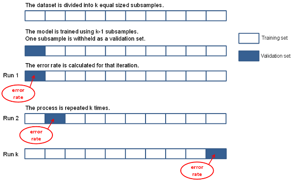

<html><head></head><body>
<h1 class="title topictitle1" id="ariaid-title1">CrossValidation (ML Engine)</h1>

<dfn class="term">Cross-validation</dfn> (or <dfn class="term">rotation
				estimation</dfn>) is a model-validation technique for assessing how the results of
			a statistical analysis generalize to an independent data set. Use this technique when
			your goal is prediction, to estimate how accurately a predictive model performs in
			practice.

Typically, you train a model on a <dfn class="term">training set</dfn> (a data set for which you know the response variable) and validate the model on a <dfn class="term">test set</dfn> or <dfn class="term">validation set</dfn> (a different data set for which you know the response variable). The CrossValidation function lets you have multiple test sets by partitioning the training set. The function can thus provide insight into how a model might generalize to an independent data set.

The CrossValidation function works as follows:
<ol class="ol" id="rmb1506982502554__ol_fms_ncm_lx">
<li class="li">It partitions the data randomly into <var class="keyword varname">k</var> equal-sized subsamples.</li>
<li class="li">It keeps one group as a test set and trains the model on the rest of the data.</li>
<li class="li">It uses the trained model on the test set and calculates the error rate.</li>
<li class="li">It repeats the preceding steps <var class="keyword varname">k</var> times, using each of the <var class="keyword varname">k</var> subsamples as the test set.</li></ol>

K-Fold Cross-Validation
  </img>  

<b>Related Information</b>

<ul class="linklist linklist relinfo">
<a href="qym1549987102806.md">Nondeterministic Results and UniqueID Syntax Element</a>
</ul>

<h2 class="title topictitle2" id="ariaid-title2">CrossValidation Syntax</h2>

<h3 class="title sectiontitle">Version 1.11</h3><pre class="pre codeblock" xml:space="preserve"><code>SELECT * FROM CrossValidation (
  ON { <var class="keyword varname">table</var> | <var class="keyword varname">view</var> | (<var class="keyword varname">query</var>) } AS InputTable
  [ OUT TABLE CrossValidationErrorTable (<var class="keyword varname">cv_error_table</var>) ]
  USING
  FunctionName ('GLM')
  [ <var class="keyword varname">glm_function_syntax_elements</var> ]
  CVParams ('<var class="keyword varname">cv_parameter</var>' [,...])
  [ FoldNum (<var class="keyword varname">k</var>) ]
  [ Metric ({ 'AUROC' | 'MSE' }) ]
) AS <var class="keyword varname">alias</var>;</code></pre>

<h2 class="title topictitle2" id="ariaid-title3">CrossValidation Syntax Elements</h2>

<dl class="dl parml"><dt class="dt pt dlterm">CrossValidationErrorTable</dt><dd class="dd pd">[Optional] Specify the name for the crossvalidation error table that the function outputs.</dd><dd class="dd pd ddexpand">Default:  cvtable in the current schema</dd><dt class="dt pt dlterm">FunctionName</dt><dd class="dd pd">Specify the name of the function to be cross-validated. The <var class="keyword varname">function</var> must be GLM (not case-sensitive).</dd><dt class="dt pt dlterm"><var class="keyword varname">glm_function_syntax_elements</var></dt><dd class="dd pd"><a href="eej1558472403086.md#cws1507149433550">GLM Syntax Elements</a>.</dd><dd class="dd pd ddexpand">For CrossValidation, each GLM syntax element can have multiple values. Each GLM syntax element must have the same number of values. These values define the models to cross-validate.</dd><dt class="dt pt dlterm">CVParams</dt><dd class="dd pd">Specify the syntax elements to use in cross-validation.</dd><dt class="dt pt dlterm">FoldNum</dt><dd class="dd pd">[Optional] Specify the value of <var class="keyword varname">k</var> in <var class="keyword varname">k</var>-fold cross-validation.</dd><dd class="dd pd ddexpand">Default: 10</dd><dt class="dt pt dlterm">Metric</dt><dd class="dd pd">[Optional] Specify the error function to use to calculate the cross-validation error:

<table cellpadding="4" cellspacing="0" summary="" id="azs1506982634562__table_qpf_g4y_fdb" class="table" frame="border" border="1" rules="all">

<colgroup span="1"><col style="width:50%" span="1"></col><col style="width:50%" span="1"></col></colgroup><thead class="thead" style="text-align:left;"><tr class="row"><th class="entry cellrowborder" style="vertical-align:top;" id="d211576e211" rowspan="1" colspan="1">Option</th><th class="entry cellrowborder" style="vertical-align:top;" id="d211576e213" rowspan="1" colspan="1">Description</th></tr></thead><tbody class="tbody"><tr class="row"><td class="entry cellrowborder" style="vertical-align:top;" headers="d211576e211" rowspan="1" colspan="1"><code class="ph codeph">'AUROC'</code> (Default)</td><td class="entry cellrowborder" style="vertical-align:top;" headers="d211576e213" rowspan="1" colspan="1">Area under ROC curve.</td></tr><tr class="row"><td class="entry cellrowborder" style="vertical-align:top;" headers="d211576e211" rowspan="1" colspan="1"><code class="ph codeph">'MSE'</code></td><td class="entry cellrowborder" style="vertical-align:top;" headers="d211576e213" rowspan="1" colspan="1">Mean squared error.</td></tr></tbody></table>
</dd></dl>

<h2 class="title topictitle2" id="ariaid-title4">CrossValidation Input</h2>

The InputTable has the same schema as the <a href="eej1558472403086.md#gpy1507149486046">GLM Input</a> table.

<h2 class="title topictitle2" id="ariaid-title5">CrossValidation Output</h2>

<h3 class="title sectiontitle">Output Message Schema</h3>
<table cellpadding="4" cellspacing="0" summary="" id="fnv1506982790612__table_rnw_t15_wcb" class="table" frame="border" border="1" rules="all">

<colgroup span="1"><col style="width:33.33333333333333%" span="1"></col><col style="width:33.33333333333333%" span="1"></col><col style="width:33.33333333333333%" span="1"></col></colgroup><thead class="thead" style="text-align:left;"><tr class="row"><th class="entry cellrowborder" style="vertical-align:top;" id="d211576e267" rowspan="1" colspan="1">Column</th><th class="entry cellrowborder" style="vertical-align:top;" id="d211576e269" rowspan="1" colspan="1">Data Type</th><th class="entry cellrowborder" style="vertical-align:top;" id="d211576e271" rowspan="1" colspan="1">Description</th></tr></thead><tbody class="tbody"><tr class="row"><td class="entry cellrowborder" style="vertical-align:top;" headers="d211576e267" rowspan="1" colspan="1">message</td><td class="entry cellrowborder" style="vertical-align:top;" headers="d211576e269" rowspan="1" colspan="1">VARCHAR</td><td class="entry cellrowborder" style="vertical-align:top;" headers="d211576e271" rowspan="1" colspan="1">Reports that function finished and where to find results.</td></tr></tbody></table>

<h3 class="title sectiontitle">CrossValidationErrorTable Schema</h3>

The function saves this table to <var class="keyword varname">cv_error_table</var>, whose default value is cvtable in the current schema.

<table cellpadding="4" cellspacing="0" summary="" id="fnv1506982790612__table_N10014_N1000E_N1000C_N10001" class="table" frame="border" border="1" rules="all">

<colgroup span="1"><col style="width:40.35087719298246%" span="1"></col><col style="width:17.54385964912281%" span="1"></col><col style="width:42.10526315789474%" span="1"></col></colgroup><thead class="thead" style="text-align:left;"><tr class="row"><th class="entry nocellnorowborder" style="vertical-align:top;" id="d211576e296" rowspan="1" colspan="1">Column</th><th class="entry nocellnorowborder" style="vertical-align:top;" id="d211576e298" rowspan="1" colspan="1">Data Type</th><th class="entry cell-norowborder" style="vertical-align:top;" id="d211576e300" rowspan="1" colspan="1">Description</th></tr></thead><tbody class="tbody"><tr class="row"><td class="entry nocellnorowborder" style="vertical-align:top;" headers="d211576e296" rowspan="1" colspan="1"><var class="keyword varname">cv_parameter</var></td><td class="entry nocellnorowborder" style="vertical-align:top;" headers="d211576e298" rowspan="1" colspan="1">String</td><td class="entry cell-norowborder" style="vertical-align:top;" headers="d211576e300" rowspan="1" colspan="1">[Column appears once for each specified <var class="keyword varname">cv_parameter</var>.] Syntax element used in cross-validation.</td></tr><tr class="row"><td class="entry nocellnorowborder" style="vertical-align:top;" headers="d211576e296" rowspan="1" colspan="1">model</td><td class="entry nocellnorowborder" style="vertical-align:top;" headers="d211576e298" rowspan="1" colspan="1">String</td><td class="entry cell-norowborder" style="vertical-align:top;" headers="d211576e300" rowspan="1" colspan="1">Name of model used in cross-validation.</td></tr><tr class="row"><td class="entry row-nocellborder" style="vertical-align:top;" headers="d211576e296" rowspan="1" colspan="1">cverror</td><td class="entry row-nocellborder" style="vertical-align:top;" headers="d211576e298" rowspan="1" colspan="1">DOUBLE PRECISION</td><td class="entry cellrowborder" style="vertical-align:top;" headers="d211576e300" rowspan="1" colspan="1">Cross-validation error for model.</td></tr></tbody></table>

<h2 class="title topictitle2" id="ariaid-title6">CrossValidation Example</h2>

This example calculates the cross-validation error for four GLM models based on the Gaussian family.

<h3 class="title sectiontitle">Input</h3>

The input table, housing_train, is from <a href="eej1558472403086.md#oec1507151560699">GLM Example: Gaussian Distribution Analysis</a>.

<h3 class="title sectiontitle">SQL Call</h3>

The LinkFunction and Intercept syntax elements specify the four GLM models to validate.
<pre class="pre codeblock" xml:space="preserve"><code>SELECT * FROM CrossValidation (
  ON housing_train AS InputTable
  OUT TABLE CrossValidationErrorTable (glmcvtable)
  USING
    Family ('gaussian')
    FunctionName ('glm')
    InputColumns ('price ','lotsize ','bedrooms ','bathrms ',
      'stories ','garagepl','driveway ','recroom ','fullbase ','gashw ',
      'airco ','prefarea','homestyle')
    CategoricalColumns ('driveway ','recroom ','fullbase ','gashw ',
      'airco ','prefarea','homestyle')
    LinkFunction ('identity','log','identity','log')
    Intercept ('t','f','f','t')
    FoldNum (3)
    CVParams ('LinkFunction','Intercept')
    Metric ('MSE')
) AS dt;
</code></pre>

<h3 class="title sectiontitle">Output</h3><pre class="pre screen" xml:space="preserve">message
--------------------------------------------------------------------------
Finished. Results can be found in table specified in the argument CVTable</pre><pre class="pre codeblock" xml:space="preserve"><code>SELECT * FROM glmcvtable;</code></pre><pre class="pre screen" xml:space="preserve">linkfunction   intercept  model               cverror
------------   ---------- ------------------  ----------------------
identity         t        "cv_outputtable_0"  1.15206987686268E 008
log              f        "cv_outputtable_1"  5.33687796406253E 009
log              t        "cv_outputtable_3"  5.33687796401766E 009
identity         f        "cv_outputtable_2"  1.15206981069037E 008</pre>

The cross-validation error shows that the default link function, identity, performs better than the log link function.

Download a zip file of all examples and a SQL script file that creates their input tables from the attachment in the left sidebar.

</body></html>
