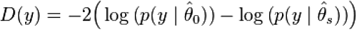
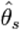
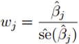
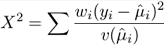

<html><head></head><body>
<h1 class="title topictitle1" id="ariaid-title1">GLM</h1>

The generalized linear model (GLM) is an extension of the linear regression model that enables the linear equation to relate to the dependent variables by a link function. The GLM function supports several distribution families and associated link functions.

You can input the output table to the function <a href="rgh1541529239182.md#xaz1507155725845">GLMPredict_MLE</a>.

The GLM function implementation uses the Fisher Scoring Algorithm, which scales better than the least-squares algorithm that the glm() function in the R package stats uses. The results of the two algorithms usually match closely. However, when the input data is highly skewed or has a large variance, the Fisher Scoring Algorithm can diverge, and you must use data set knowledge and trial and error to select the optimal family and link functions.

For more information about generalized linear models, see:
<ul class="ul" id="hrv1507149150084__ul_cbc_1mj_mbb">
<li class="li">Dobson, A.J.; Barnett, A.G. (2008). <cite class="cite">Introduction to Generalized Linear Models</cite> (3rd ed.). Boca Raton, FL: Chapman and Hall/CRC. ISBN 1-58488-165-8.</li>
<li class="li">Hardin, James; Hilbe, Joseph (2007). <cite class="cite">Generalized Linear Models and Extensions</cite> (2nd ed.). College Station: Stata Press. ISBN 1-59718-014-9.</li></ul>

<b>Related Information</b>

<ul class="linklist linklist relinfo">
<a href="fry1558121496793.md#vio1507671576104">LikelihoodRatioTest (ML Engine)</a>
</ul>

<h2 class="title topictitle2" id="ariaid-title2">GLM Syntax</h2>

<h3 class="title sectiontitle">Version 1.19</h3><pre class="pre codeblock" xml:space="preserve"><code>SELECT * FROM GLM (
  ON { <var class="keyword varname">table</var> | <var class="keyword varname">view</var> | (<var class="keyword varname">query</var>) } AS InputTable
  OUT TABLE OutputTable (<var class="keyword varname">output_table</var>)
  USING
  [ TargetColumns ('<var class="keyword varname">target_column</var>'[,...]) ]
  [ CategoricalColumns ('<var class="keyword varname">columnname_value_pair</var>'[,...]) ]
  [ Family ('<var class="keyword varname">family</var>') ]
  [ LinkFunction ('<var class="keyword varname">link</var>') ]
  [ WeightColumn ('<var class="keyword varname">weight_column</var>') ]
  [ StopThreshold (<var class="keyword varname">threshold</var>) ]
  [ MaxIterNum (<var class="keyword varname">max_iterations</var>) ]
  [ Intercept (<b>{'true'|'t'|'yes'|'y'|'1'|'false'|'f'|'no'|'n'|'0'}</b>) ]
  [ Step (<b>{'true'|'t'|'yes'|'y'|'1'|'false'|'f'|'no'|'n'|'0'}</b>) ]
) AS <var class="keyword varname">alias</var>;</code></pre>

<h2 class="title topictitle2" id="ariaid-title3">GLM Syntax Elements</h2>

<dl class="dl parml"><dt class="dt pt dlterm">OutputTable</dt><dd class="dd pd">Specify the name for the output table of coefficients. This table must not exist.</dd><dt class="dt pt dlterm">TargetColumns</dt><dd class="dd pd">[Optional] Specify the name of the column that contains the dependent variable (Y) followed by the names of the columns that contain the predictor variables (Xi), in this format: 'Y,X1,X2,...,Xp'.</dd><dd class="dd pd ddexpand">Default behavior: The first column of the InputTable is Y and the remaining InputTable columns are Xi, except for the column specified by the WeightColumn syntax element.</dd><dt class="dt pt dlterm">CategoricalColumns</dt><dd class="dd pd">[Optional] Specify columnname-value pairs, each of which contains the name of a categorical input column and the category values in that column that the function is to include in the model that it creates.

<table cellpadding="4" cellspacing="0" summary="" id="cws1507149433550__table_igz_wpy_fdb" class="table" frame="border" border="1" rules="all">

<colgroup span="1"><col style="width:50%" span="1"></col><col style="width:50%" span="1"></col></colgroup><thead class="thead" style="text-align:left;"><tr class="row"><th class="entry cellrowborder" style="vertical-align:top;" id="d152697e195" rowspan="1" colspan="1"><var class="keyword varname">columnname_value_pair</var></th><th class="entry cellrowborder" style="vertical-align:top;" id="d152697e198" rowspan="1" colspan="1">Description</th></tr></thead><tbody class="tbody"><tr class="row"><td class="entry cellrowborder" style="vertical-align:top;" headers="d152697e195" rowspan="1" colspan="1"><code class="ph codeph">'<var class="keyword varname">columnname</var>:<var class="keyword varname">max_cardinality</var>'</code></td><td class="entry cellrowborder" style="vertical-align:top;" headers="d152697e198" rowspan="1" colspan="1">Limits categories in column to <var class="keyword varname">max_cardinality</var> to most common ones and groups others together as 'others'.

For example, 'column_a:3' specifies that for column_a, function uses 3 most common categories and sets category of rows that do not belong to those 3 categories to 'others'.
</td></tr><tr class="row"><td class="entry cellrowborder" style="vertical-align:top;" headers="d152697e195" rowspan="1" colspan="1"><code class="ph codeph">'<var class="keyword varname">columnname</var>:(<var class="keyword varname">category</var> [,...])'</code></td><td class="entry cellrowborder" style="vertical-align:top;" headers="d152697e198" rowspan="1" colspan="1">Limits categories in column to those that you specify and groups others together as 'others'.

For example, 'column_a : (red, yellow, blue)' specifies that for column_a, function uses categories red, yellow, and blue, and sets category of rows that do not belong to those categories to 'others'.
</td></tr><tr class="row"><td class="entry cellrowborder" style="vertical-align:top;" headers="d152697e195" rowspan="1" colspan="1"><code class="ph codeph">'<var class="keyword varname">columnname</var>'</code></td><td class="entry cellrowborder" style="vertical-align:top;" headers="d152697e198" rowspan="1" colspan="1">All category values appear in model.</td></tr></tbody></table>
</dd><dd class="dd pd ddexpand">If you specify the TargetColumns syntax element, the columns that you specify in the CategoricalColumns syntax element must also appear in the TargetColumns syntax element.</dd><dd class="dd pd ddexpand">For information about columns that you must identify as numeric or categorical, see <a href="uxa1540574678350.md">Identification of Numeric and Categorical Columns</a>.</dd><dt class="dt pt dlterm">Family</dt><dd class="dd pd">[Optional] Specify the distribution exponential family, which is one of the following:
<ul class="ul" id="cws1507149433550__ul_yzc_md2_nx">
<li class="li">'BINOMIAL' (Default)</li>
<li class="li">'LOGISTIC' (equivalent to 'BINOMIAL')</li>
<li class="li">'POISSON'</li>
<li class="li">'GAUSSIAN'</li>
<li class="li">'GAMMA'</li>
<li class="li">'INVERSE_GAUSSIAN'</li>
<li class="li">'NEGATIVE_BINOMIAL'</li></ul></dd><dd class="dd pd ddexpand">For Binomial/Logistic and Gaussian applications, Teradata recommends using <a href="mxy1558472465230.md#fgw1518542561108">GLML1L2</a> instead of GLM. GLML1L2 is expected to provide better performance and accuracy.</dd><dt class="dt pt dlterm">LinkFunction</dt><dd class="dd pd">[Optional] Specify the link function.</dd><dd class="dd pd ddexpand">Default: 'CANONICAL'. The canonical link functions (default link functions) and the link functions that are allowed for each exponential family are listed in the tables in <a href="eej1558472403086.md#miq1507149222649">Supported Family/Link Function Combinations</a>.</dd><dt class="dt pt dlterm">WeightColumn</dt><dd class="dd pd">[Optional] Specify the name of an InputTable column that contains the weights to assign to responses.</dd><dd class="dd pd ddexpand">You can use non-NULL weights to indicate that different observations have different dispersions (with the weights being inversely proportional to the dispersions). Equivalently, when the weights are positive integers wi, each response yi is the mean of wi unit-weight observations. A binomial GLM uses prior weights to give the number of trials when the response is the proportion of successes. A Poisson GLM rarely uses weights.</dd><dd class="dd pd ddexpand">If the weight is less than the response value, the function throws an exception. Therefore, if the response value is greater than 1, you must specify a weight that is greater than or equal to the response value.</dd><dd class="dd pd ddexpand">Default behavior: All observations have equal weight.</dd><dt class="dt pt dlterm">StopThreshold</dt><dd class="dd pd">[Optional] Specify the convergence threshold.</dd><dd class="dd pd ddexpand">Default: 0.01</dd><dt class="dt pt dlterm">MaxIterNum</dt><dd class="dd pd">[Optional] Specify the maximum number of iterations that the algorithm runs before quitting if the convergence threshold has not been met. The parameter <var class="keyword varname">max_iterations</var> must be a positive INTEGER value.</dd><dd class="dd pd ddexpand">Default: 25</dd><dt class="dt pt dlterm">Intercept</dt><dd class="dd pd">[Optional] Specify whether the function uses an intercept. For example, in ß0+ß1*X1+ß2*X2+ ....+ ßpXp, the intercept is ß0.</dd><dd class="dd pd ddexpand">Default: 'true'</dd><dt class="dt pt dlterm">Step</dt><dd class="dd pd">[Optional] Specify whether the function uses a step. If the function uses a step, it runs with the GLM model that has the lowest Akaike information criterion (AIC) score, drops one predictor from the current predictor group, and repeats this process until no predictor remains.</dd><dd class="dd pd ddexpand">Default: 'false'</dd></dl>

<h2 class="title topictitle2" id="ariaid-title4">Supported Family/Link Function Combinations</h2>

<table cellpadding="4" cellspacing="0" summary="" id="miq1507149222649__table_N1000E_N1000C_N10001" class="table" width="100%" frame="border" border="1" rules="all">

<colgroup span="1"><col style="width:12.5%" span="1"></col><col style="width:23.75%" span="1"></col><col style="width:20%" span="1"></col><col style="width:15%" span="1"></col><col style="width:28.749999999999996%" span="1"></col></colgroup><thead class="thead" style="text-align:left;"><tr class="row"><th class="entry nocellnorowborder" style="vertical-align:top;" id="d152697e370" rowspan="1" colspan="1">Family Name</th><th class="entry nocellnorowborder" style="vertical-align:top;" id="d152697e372" rowspan="1" colspan="1">Family Function Name</th><th class="entry nocellnorowborder" style="vertical-align:top;" id="d152697e374" rowspan="1" colspan="1">Link</th><th class="entry nocellnorowborder" style="vertical-align:top;" id="d152697e376" rowspan="1" colspan="1">Link Function Expression</th><th class="entry cell-norowborder" style="vertical-align:top;" id="d152697e378" rowspan="1" colspan="1">Used</th></tr></thead><tbody class="tbody"><tr class="row"><td class="entry nocellnorowborder" style="vertical-align:top;" headers="d152697e370" rowspan="1" colspan="1">Binomial or Logistic</td><td class="entry nocellnorowborder" style="vertical-align:top;" headers="d152697e372" rowspan="1" colspan="1">BINOMIAL or LOGISTIC</td><td class="entry nocellnorowborder" style="vertical-align:top;" headers="d152697e374" rowspan="1" colspan="1">logit (default)

probit

cloglog

log

cauchit
</td><td class="entry nocellnorowborder" style="vertical-align:top;" headers="d152697e376" rowspan="1" colspan="1">log(μ/(1-μ))

Φ-μ

log[-log(1-μ)]

log(μ)

tan(π(μ - 1/2))
</td><td class="entry cell-norowborder" style="vertical-align:top;" headers="d152697e378" rowspan="1" colspan="1">When the dependent variable (Y) has only two possible values (0 and 1, 'yes' and 'no', or 'true' and 'false').

The algorithm applies the model to the data, predicts the most likely outcome for each input, and supplies a logit (logarithm of odds) for each outcome.
</td></tr><tr class="row"><td class="entry nocellnorowborder" style="vertical-align:top;" headers="d152697e370" rowspan="1" colspan="1">Gamma</td><td class="entry nocellnorowborder" style="vertical-align:top;" headers="d152697e372" rowspan="1" colspan="1">GAMMA</td><td class="entry nocellnorowborder" style="vertical-align:top;" headers="d152697e374" rowspan="1" colspan="1">inverse (default)

identity

log
</td><td class="entry nocellnorowborder" style="vertical-align:top;" headers="d152697e376" rowspan="1" colspan="1">μ-1

μ

log(μ)
</td><td class="entry cell-norowborder" style="vertical-align:top;" headers="d152697e378" rowspan="1" colspan="1">When data is continuous with constant response variance and appears to be right-skewed.</td></tr><tr class="row"><td class="entry nocellnorowborder" style="vertical-align:top;" headers="d152697e370" rowspan="1" colspan="1">Gaussian</td><td class="entry nocellnorowborder" style="vertical-align:top;" headers="d152697e372" rowspan="1" colspan="1">GAUSSIAN</td><td class="entry nocellnorowborder" style="vertical-align:top;" headers="d152697e374" rowspan="1" colspan="1">identity (default)

inverse

log
</td><td class="entry nocellnorowborder" style="vertical-align:top;" headers="d152697e376" rowspan="1" colspan="1">μ

μ-1

log(μ)
</td><td class="entry cell-norowborder" style="vertical-align:top;" headers="d152697e378" rowspan="1" colspan="1">When the data is grouped around a single mean and can be graphed in a normal or bell curve distribution.</td></tr><tr class="row"><td class="entry nocellnorowborder" style="vertical-align:top;" headers="d152697e370" rowspan="1" colspan="1">Inverse Gaussian</td><td class="entry nocellnorowborder" style="vertical-align:top;" headers="d152697e372" rowspan="1" colspan="1">INVERSE_GAUSSIAN</td><td class="entry nocellnorowborder" style="vertical-align:top;" headers="d152697e374" rowspan="1" colspan="1">inverse_mu_squared (default)

identity

inverse

log
</td><td class="entry nocellnorowborder" style="vertical-align:top;" headers="d152697e376" rowspan="1" colspan="1">μ-2

μ

μ-1

log(μ)
</td><td class="entry cell-norowborder" style="vertical-align:top;" headers="d152697e378" rowspan="1" colspan="1">When the data is grouped around a single mean but the graph appears to have a right-skewed curve distribution.</td></tr><tr class="row"><td class="entry nocellnorowborder" style="vertical-align:top;" headers="d152697e370" rowspan="1" colspan="1">Poisson</td><td class="entry nocellnorowborder" style="vertical-align:top;" headers="d152697e372" rowspan="1" colspan="1">POISSON</td><td class="entry nocellnorowborder" style="vertical-align:top;" headers="d152697e374" rowspan="1" colspan="1">log (default)

identity

square_root
</td><td class="entry nocellnorowborder" style="vertical-align:top;" headers="d152697e376" rowspan="1" colspan="1">log(μ)

μ

μ1/2
</td><td class="entry cell-norowborder" style="vertical-align:top;" headers="d152697e378" rowspan="1" colspan="1">To model count data (nonnegative integers) and contingency models (matrixes of the frequency distribution of variables).

The algorithm assumes that the dependent variable (Y) has a Poisson distribution (that is, that Y is segmented into intervals of, for example, time or geographic location) and then calculates the discrete probability of one or more events occurring within these segments.
</td></tr><tr class="row"><td class="entry row-nocellborder" style="vertical-align:top;" headers="d152697e370" rowspan="1" colspan="1">Negative Binomial</td><td class="entry row-nocellborder" style="vertical-align:top;" headers="d152697e372" rowspan="1" colspan="1">NEGATIVE_BINOMIAL</td><td class="entry row-nocellborder" style="vertical-align:top;" headers="d152697e374" rowspan="1" colspan="1">log (default)

identity
</td><td class="entry row-nocellborder" style="vertical-align:top;" headers="d152697e376" rowspan="1" colspan="1">log(μ)

μ
</td><td class="entry cellrowborder" style="vertical-align:top;" headers="d152697e378" rowspan="1" colspan="1">To model count data (nonnegative integers), usually over-dispersed response variables.</td></tr></tbody></table>

The following table shows the common link functions for the common distribution exponential families. D identifies the default link for each family.

<table cellpadding="4" cellspacing="0" summary="" id="miq1507149222649__table_fhm_dkt_wx" class="table" width="100%" frame="border" border="1" rules="all">

<colgroup span="1"><col style="width:8.849557522123893%" span="1"></col><col style="width:25.663716814159287%" span="1"></col><col style="width:8.849557522123893%" span="1"></col><col style="width:8.849557522123893%" span="1"></col><col style="width:8.849557522123893%" span="1"></col><col style="width:14.15929203539823%" span="1"></col><col style="width:8.849557522123893%" span="1"></col><col style="width:15.929203539823009%" span="1"></col></colgroup><thead class="thead" style="text-align:left;"><tr class="row"><th class="entry nocellnorowborder" style="vertical-align:top;" id="d152697e537" rowspan="1" colspan="1">Link</th><th class="entry nocellnorowborder" style="text-align:left;vertical-align:top;" id="d152697e539" rowspan="1" colspan="1">Link Descriptive</th><th class="entry nocellnorowborder" style="text-align:center;vertical-align:top;" id="d152697e541" rowspan="1" colspan="1">Binomial (Logistic)</th><th class="entry nocellnorowborder" style="text-align:center;vertical-align:top;" id="d152697e543" rowspan="1" colspan="1">Gamma</th><th class="entry nocellnorowborder" style="text-align:center;vertical-align:top;" id="d152697e545" rowspan="1" colspan="1">Gaussian</th><th class="entry nocellnorowborder" style="text-align:center;vertical-align:top;" id="d152697e547" rowspan="1" colspan="1">Inverse_Gaussian</th><th class="entry nocellnorowborder" style="text-align:center;vertical-align:top;" id="d152697e549" rowspan="1" colspan="1">Poisson</th><th class="entry cell-norowborder" style="text-align:center;vertical-align:top;" id="d152697e551" rowspan="1" colspan="1">Negative_Binomial</th></tr></thead><tbody class="tbody"><tr class="row"><td class="entry nocellnorowborder" style="vertical-align:top;" headers="d152697e537" rowspan="1" colspan="1">logit</td><td class="entry nocellnorowborder" style="text-align:left;vertical-align:top;" headers="d152697e539" rowspan="1" colspan="1">LOGIT</td><td class="entry nocellnorowborder" style="text-align:center;vertical-align:top;" headers="d152697e541" rowspan="1" colspan="1">D</td><td class="entry nocellnorowborder" style="text-align:center;vertical-align:top;" headers="d152697e543" rowspan="1" colspan="1"> </td><td class="entry nocellnorowborder" style="text-align:center;vertical-align:top;" headers="d152697e545" rowspan="1" colspan="1"> </td><td class="entry nocellnorowborder" style="text-align:center;vertical-align:top;" headers="d152697e547" rowspan="1" colspan="1"> </td><td class="entry nocellnorowborder" style="text-align:center;vertical-align:top;" headers="d152697e549" rowspan="1" colspan="1"> </td><td class="entry cell-norowborder" style="text-align:center;vertical-align:top;" headers="d152697e551" rowspan="1" colspan="1"> </td></tr><tr class="row"><td class="entry nocellnorowborder" style="vertical-align:top;" headers="d152697e537" rowspan="1" colspan="1">probit</td><td class="entry nocellnorowborder" style="text-align:left;vertical-align:top;" headers="d152697e539" rowspan="1" colspan="1">PROBIT</td><td class="entry nocellnorowborder" style="text-align:center;vertical-align:top;" headers="d152697e541" rowspan="1" colspan="1">*</td><td class="entry nocellnorowborder" style="text-align:center;vertical-align:top;" headers="d152697e543" rowspan="1" colspan="1"> </td><td class="entry nocellnorowborder" style="text-align:center;vertical-align:top;" headers="d152697e545" rowspan="1" colspan="1"> </td><td class="entry nocellnorowborder" style="text-align:center;vertical-align:top;" headers="d152697e547" rowspan="1" colspan="1"> </td><td class="entry nocellnorowborder" style="text-align:center;vertical-align:top;" headers="d152697e549" rowspan="1" colspan="1"> </td><td class="entry cell-norowborder" style="text-align:center;vertical-align:top;" headers="d152697e551" rowspan="1" colspan="1"> </td></tr><tr class="row"><td class="entry nocellnorowborder" style="vertical-align:top;" headers="d152697e537" rowspan="1" colspan="1">cloglog</td><td class="entry nocellnorowborder" style="text-align:left;vertical-align:top;" headers="d152697e539" rowspan="1" colspan="1">COMPLEMENTARY_LOG_LOG</td><td class="entry nocellnorowborder" style="text-align:center;vertical-align:top;" headers="d152697e541" rowspan="1" colspan="1">*</td><td class="entry nocellnorowborder" style="text-align:center;vertical-align:top;" headers="d152697e543" rowspan="1" colspan="1"> </td><td class="entry nocellnorowborder" style="text-align:center;vertical-align:top;" headers="d152697e545" rowspan="1" colspan="1"> </td><td class="entry nocellnorowborder" style="text-align:center;vertical-align:top;" headers="d152697e547" rowspan="1" colspan="1"> </td><td class="entry nocellnorowborder" style="text-align:center;vertical-align:top;" headers="d152697e549" rowspan="1" colspan="1"> </td><td class="entry cell-norowborder" style="text-align:center;vertical-align:top;" headers="d152697e551" rowspan="1" colspan="1"> </td></tr><tr class="row"><td class="entry nocellnorowborder" style="vertical-align:top;" headers="d152697e537" rowspan="1" colspan="1">identity</td><td class="entry nocellnorowborder" style="text-align:left;vertical-align:top;" headers="d152697e539" rowspan="1" colspan="1">IDENTITY</td><td class="entry nocellnorowborder" style="text-align:center;vertical-align:top;" headers="d152697e541" rowspan="1" colspan="1"> </td><td class="entry nocellnorowborder" style="text-align:center;vertical-align:top;" headers="d152697e543" rowspan="1" colspan="1">*</td><td class="entry nocellnorowborder" style="text-align:center;vertical-align:top;" headers="d152697e545" rowspan="1" colspan="1">D</td><td class="entry nocellnorowborder" style="text-align:center;vertical-align:top;" headers="d152697e547" rowspan="1" colspan="1">*</td><td class="entry nocellnorowborder" style="text-align:center;vertical-align:top;" headers="d152697e549" rowspan="1" colspan="1">*</td><td class="entry cell-norowborder" style="text-align:center;vertical-align:top;" headers="d152697e551" rowspan="1" colspan="1">*</td></tr><tr class="row"><td class="entry nocellnorowborder" style="vertical-align:top;" headers="d152697e537" rowspan="1" colspan="1">inverse</td><td class="entry nocellnorowborder" style="text-align:left;vertical-align:top;" headers="d152697e539" rowspan="1" colspan="1">INVERSE</td><td class="entry nocellnorowborder" style="text-align:center;vertical-align:top;" headers="d152697e541" rowspan="1" colspan="1"> </td><td class="entry nocellnorowborder" style="text-align:center;vertical-align:top;" headers="d152697e543" rowspan="1" colspan="1">D</td><td class="entry nocellnorowborder" style="text-align:center;vertical-align:top;" headers="d152697e545" rowspan="1" colspan="1">*</td><td class="entry nocellnorowborder" style="text-align:center;vertical-align:top;" headers="d152697e547" rowspan="1" colspan="1">*</td><td class="entry nocellnorowborder" style="text-align:center;vertical-align:top;" headers="d152697e549" rowspan="1" colspan="1"> </td><td class="entry cell-norowborder" style="text-align:center;vertical-align:top;" headers="d152697e551" rowspan="1" colspan="1"> </td></tr><tr class="row"><td class="entry nocellnorowborder" style="vertical-align:top;" headers="d152697e537" rowspan="1" colspan="1">log</td><td class="entry nocellnorowborder" style="text-align:left;vertical-align:top;" headers="d152697e539" rowspan="1" colspan="1">LOG</td><td class="entry nocellnorowborder" style="text-align:center;vertical-align:top;" headers="d152697e541" rowspan="1" colspan="1">*</td><td class="entry nocellnorowborder" style="text-align:center;vertical-align:top;" headers="d152697e543" rowspan="1" colspan="1">*</td><td class="entry nocellnorowborder" style="text-align:center;vertical-align:top;" headers="d152697e545" rowspan="1" colspan="1">*</td><td class="entry nocellnorowborder" style="text-align:center;vertical-align:top;" headers="d152697e547" rowspan="1" colspan="1">*</td><td class="entry nocellnorowborder" style="text-align:center;vertical-align:top;" headers="d152697e549" rowspan="1" colspan="1">D</td><td class="entry cell-norowborder" style="text-align:center;vertical-align:top;" headers="d152697e551" rowspan="1" colspan="1">D</td></tr><tr class="row"><td class="entry nocellnorowborder" style="vertical-align:top;" headers="d152697e537" rowspan="1" colspan="1">1/μ2</td><td class="entry nocellnorowborder" style="text-align:left;vertical-align:top;" headers="d152697e539" rowspan="1" colspan="1">INVERSE_MU_SQUARED</td><td class="entry nocellnorowborder" style="text-align:center;vertical-align:top;" headers="d152697e541" rowspan="1" colspan="1"> </td><td class="entry nocellnorowborder" style="text-align:center;vertical-align:top;" headers="d152697e543" rowspan="1" colspan="1"> </td><td class="entry nocellnorowborder" style="text-align:center;vertical-align:top;" headers="d152697e545" rowspan="1" colspan="1"> </td><td class="entry nocellnorowborder" style="text-align:center;vertical-align:top;" headers="d152697e547" rowspan="1" colspan="1">D</td><td class="entry nocellnorowborder" style="text-align:center;vertical-align:top;" headers="d152697e549" rowspan="1" colspan="1"> </td><td class="entry cell-norowborder" style="text-align:center;vertical-align:top;" headers="d152697e551" rowspan="1" colspan="1"> </td></tr><tr class="row"><td class="entry nocellnorowborder" style="vertical-align:top;" headers="d152697e537" rowspan="1" colspan="1">sqrt</td><td class="entry nocellnorowborder" style="text-align:left;vertical-align:top;" headers="d152697e539" rowspan="1" colspan="1">SQUARE_ROOT</td><td class="entry nocellnorowborder" style="text-align:center;vertical-align:top;" headers="d152697e541" rowspan="1" colspan="1"> </td><td class="entry nocellnorowborder" style="text-align:center;vertical-align:top;" headers="d152697e543" rowspan="1" colspan="1"> </td><td class="entry nocellnorowborder" style="text-align:center;vertical-align:top;" headers="d152697e545" rowspan="1" colspan="1"> </td><td class="entry nocellnorowborder" style="text-align:center;vertical-align:top;" headers="d152697e547" rowspan="1" colspan="1"> </td><td class="entry nocellnorowborder" style="text-align:center;vertical-align:top;" headers="d152697e549" rowspan="1" colspan="1">*</td><td class="entry cell-norowborder" style="text-align:center;vertical-align:top;" headers="d152697e551" rowspan="1" colspan="1"> </td></tr><tr class="row"><td class="entry row-nocellborder" style="vertical-align:top;" headers="d152697e537" rowspan="1" colspan="1">cauchit</td><td class="entry row-nocellborder" style="text-align:left;vertical-align:top;" headers="d152697e539" rowspan="1" colspan="1">CAUCHIT</td><td class="entry row-nocellborder" style="text-align:center;vertical-align:top;" headers="d152697e541" rowspan="1" colspan="1">*</td><td class="entry row-nocellborder" style="text-align:center;vertical-align:top;" headers="d152697e543" rowspan="1" colspan="1"> </td><td class="entry row-nocellborder" style="text-align:center;vertical-align:top;" headers="d152697e545" rowspan="1" colspan="1"> </td><td class="entry row-nocellborder" style="text-align:center;vertical-align:top;" headers="d152697e547" rowspan="1" colspan="1"> </td><td class="entry row-nocellborder" style="text-align:center;vertical-align:top;" headers="d152697e549" rowspan="1" colspan="1"> </td><td class="entry cellrowborder" style="text-align:center;vertical-align:top;" headers="d152697e551" rowspan="1" colspan="1"> </td></tr></tbody></table>

<h2 class="title topictitle2" id="ariaid-title5">GLM Input</h2>

<h3 class="title sectiontitle">InputTable Schema</h3>
<b>Note</b>
It is important to normalize the input variables before calling this function. For details, see <a href="qnw1570800778984.md">Normalized Input</a>.

The table can have additional columns, but the function ignores them.

<table cellpadding="4" cellspacing="0" summary="" id="gpy1507149486046__table_N10014_N1000E_N1000C_N10001" class="table" frame="border" border="1" rules="all">

<colgroup span="1"><col style="width:29.239766081871345%" span="1"></col><col style="width:16.081871345029242%" span="1"></col><col style="width:54.67836257309941%" span="1"></col></colgroup><thead class="thead" style="text-align:left;"><tr class="row"><th class="entry nocellnorowborder" style="vertical-align:top;" id="d152697e709" rowspan="1" colspan="1">Column</th><th class="entry nocellnorowborder" style="vertical-align:top;" id="d152697e711" rowspan="1" colspan="1">Data Type</th><th class="entry cell-norowborder" style="vertical-align:top;" id="d152697e713" rowspan="1" colspan="1">Description</th></tr></thead><tbody class="tbody"><tr class="row"><td class="entry nocellnorowborder" style="vertical-align:top;" headers="d152697e709" rowspan="1" colspan="1"><var class="keyword varname">dependent_variable_column</var></td><td class="entry nocellnorowborder" style="vertical-align:top;" headers="d152697e711" rowspan="1" colspan="1">Any numeric SQL data type</td><td class="entry cell-norowborder" style="vertical-align:top;" headers="d152697e713" rowspan="1" colspan="1">Dependent/response variable. Cannot be NULL. Must be first in TargetColumns syntax element. If Family is BINOMIAL or LOGISTIC, each value in this column must be either 0 or 1.</td></tr><tr class="row"><td class="entry nocellnorowborder" style="vertical-align:top;" headers="d152697e709" rowspan="1" colspan="1"><var class="keyword varname">predictor_variable_column</var></td><td class="entry nocellnorowborder" style="vertical-align:top;" headers="d152697e711" rowspan="1" colspan="1">Any</td><td class="entry cell-norowborder" style="vertical-align:top;" headers="d152697e713" rowspan="1" colspan="1">[Appears one or more times.] Independent/predictor variable. Cannot be NULL. Must follow <var class="keyword varname">dependent_variable_column</var> in TargetColumns syntax element.

Teradata recommends using <a href="hal1558454832381.md#zzl1507825806540">Scale</a> function on numeric predictors before calling function.
</td></tr><tr class="row"><td class="entry nocellnorowborder" style="vertical-align:top;" headers="d152697e709" rowspan="1" colspan="1"><var class="keyword varname">categorical_column</var></td><td class="entry nocellnorowborder" style="vertical-align:top;" headers="d152697e711" rowspan="1" colspan="1">CHARACTER, VARCHAR, INTEGER, BYTEINT, DATE, TIME (without TIME ZONE)</td><td class="entry cell-norowborder" style="vertical-align:top;" headers="d152697e713" rowspan="1" colspan="1">[Appears only with CategoricalColumns syntax element.] Categorical variable. Must also appear in TargetColumns syntax element.</td></tr><tr class="row"><td class="entry row-nocellborder" style="vertical-align:top;" headers="d152697e709" rowspan="1" colspan="1"><var class="keyword varname">weight_column</var></td><td class="entry row-nocellborder" style="vertical-align:top;" headers="d152697e711" rowspan="1" colspan="1">INTEGER, DOUBLE PRECISION</td><td class="entry cellrowborder" style="vertical-align:top;" headers="d152697e713" rowspan="1" colspan="1">[Appears only with WeightColumn syntax element.] Weight to assign to response variable.</td></tr></tbody></table>

<h2 class="title topictitle2" id="ariaid-title6">GLM Onscreen Output</h2>

The onscreen output of the GLM function is a table containing information about the regression analysis of the data, in two sections:
<ul class="ul" id="qmx1507149564629__ul_zmx_5jj_mfb">
<li class="li">Information about the model intercept and coefficients</li>
<li class="li">Information about the regression (number of iterations and number of rows processed) and several goodness-of-fit measures</li></ul>

<h3 class="title sectiontitle">Columns</h3>
<table cellpadding="4" cellspacing="0" summary="" id="qmx1507149564629__table_nm2_vnt_ndb" class="table" frame="border" border="1" rules="all">

<colgroup span="1"><col style="width:50%" span="1"></col><col style="width:50%" span="1"></col></colgroup><thead class="thead" style="text-align:left;"><tr class="row"><th class="entry cellrowborder" style="vertical-align:top;" id="d152697e791" rowspan="1" colspan="1">Column</th><th class="entry cellrowborder" style="vertical-align:top;" id="d152697e793" rowspan="1" colspan="1">Description</th></tr></thead><tbody class="tbody"><tr class="row"><td class="entry cellrowborder" style="vertical-align:top;" headers="d152697e791" rowspan="1" colspan="1">predictor</td><td class="entry cellrowborder" style="vertical-align:top;" headers="d152697e793" rowspan="1" colspan="1">

Name of predictor or other reported result.

For categorical predictors, the function selects one category as the reference category, and outputs one row for each other category for the column, in the format <var class="keyword varname">predictor</var>.<var class="keyword varname">level</var>.

For example, if column color has categories 'red', 'blue', and 'green', and green is the reference category, the function outputs these rows:

color.red

color.blue
</td></tr><tr class="row"><td class="entry cellrowborder" style="vertical-align:top;" headers="d152697e791" rowspan="1" colspan="1">estimate</td><td class="entry cellrowborder" style="vertical-align:top;" headers="d152697e793" rowspan="1" colspan="1">For predictors, estimated value of coefficient.

For other reported results, calculated value.
</td></tr><tr class="row"><td class="entry cellrowborder" style="vertical-align:top;" headers="d152697e791" rowspan="1" colspan="1">std_error</td><td class="entry cellrowborder" style="vertical-align:top;" headers="d152697e793" rowspan="1" colspan="1">For predictors, standard deviation of the mean (standard error).

For other reported results, not applicable (value 0).
</td></tr><tr class="row"><td class="entry cellrowborder" style="vertical-align:top;" headers="d152697e791" rowspan="1" colspan="1">z_score</td><td class="entry cellrowborder" style="vertical-align:top;" headers="d152697e793" rowspan="1" colspan="1">For predictors, calculated z-score.

For other reported results, calculated value.
</td></tr><tr class="row"><td class="entry cellrowborder" style="vertical-align:top;" headers="d152697e791" rowspan="1" colspan="1">p_value</td><td class="entry cellrowborder" style="vertical-align:top;" headers="d152697e793" rowspan="1" colspan="1">For predictors, calculated p-value.

For other reported results, not applicable (value 0).
</td></tr><tr class="row"><td class="entry cellrowborder" style="vertical-align:top;" headers="d152697e791" rowspan="1" colspan="1">significance</td><td class="entry cellrowborder" style="vertical-align:top;" headers="d152697e793" rowspan="1" colspan="1">For predictors, indicator of predictor significance. For key to significance codes, see <a href="sor1549378757651.md#vfm1506973266748">CoxPH Output</a>.

For other reported results, description of result.
</td></tr></tbody></table>

<h3 class="title sectiontitle">Rows</h3>

The onscreen output includes a row for each estimated parameter of the model and additional information about the model and the regression.

For Step ('true'), the rows of the following tables appear for the model at each step and describe the model at that step. For each step, the description includes only the predictors included in the model.

<table cellpadding="4" cellspacing="0" summary="" id="qmx1507149564629__table_bfh_k4t_ndb" class="table" frame="border" border="1" rules="all">
Estimated Parameters of the Model
<colgroup span="1"><col style="width:50%" span="1"></col><col style="width:50%" span="1"></col></colgroup><thead class="thead" style="text-align:left;"><tr class="row"><th class="entry cellrowborder" style="vertical-align:top;" id="d152697e870" rowspan="1" colspan="1">Parameter</th><th class="entry cellrowborder" style="vertical-align:top;" id="d152697e872" rowspan="1" colspan="1">Description</th></tr></thead><tbody class="tbody"><tr class="row"><td class="entry cellrowborder" style="vertical-align:top;" headers="d152697e870" rowspan="1" colspan="1">(Intercept)</td><td class="entry cellrowborder" style="vertical-align:top;" headers="d152697e872" rowspan="1" colspan="1">Value of link function (Y) when all predictors are 0.</td></tr><tr class="row"><td class="entry cellrowborder" style="vertical-align:top;" headers="d152697e870" rowspan="1" colspan="1"><var class="keyword varname">predictor</var></td><td class="entry cellrowborder" style="vertical-align:top;" headers="d152697e872" rowspan="1" colspan="1">[Appears only for numerical predictor.] Predictor name.</td></tr><tr class="row"><td class="entry cellrowborder" style="vertical-align:top;" headers="d152697e870" rowspan="1" colspan="1"><var class="keyword varname">predictor</var>.<var class="keyword varname">level</var></td><td class="entry cellrowborder" style="vertical-align:top;" headers="d152697e872" rowspan="1" colspan="1">[Appears only for categorical predictor.] Predictor name and level. Table has a row for each level of the predictor except one, which serves as the reference level.</td></tr></tbody></table>

<table cellpadding="4" cellspacing="0" summary="" id="qmx1507149564629__table_s5z_p4t_ndb" class="table" frame="border" border="1" rules="all">
Model and Regression Information
<colgroup span="1"><col style="width:50%" span="1"></col><col style="width:50%" span="1"></col></colgroup><thead class="thead" style="text-align:left;"><tr class="row"><th class="entry cellrowborder" style="vertical-align:top;" id="d152697e903" rowspan="1" colspan="1">Value</th><th class="entry cellrowborder" style="vertical-align:top;" id="d152697e905" rowspan="1" colspan="1">Description</th></tr></thead><tbody class="tbody"><tr class="row"><td class="entry cellrowborder" style="vertical-align:top;" headers="d152697e903" rowspan="1" colspan="1">ITERATIONS#</td><td class="entry cellrowborder" style="vertical-align:top;" headers="d152697e905" rowspan="1" colspan="1">Number of Fisher Scoring iterations performed on function.

With Step ('true'), function reports this number for each step.
</td></tr><tr class="row"><td class="entry cellrowborder" style="vertical-align:top;" headers="d152697e903" rowspan="1" colspan="1">ROWS#</td><td class="entry cellrowborder" style="vertical-align:top;" headers="d152697e905" rowspan="1" colspan="1">Number of rows of data received as input.</td></tr><tr class="row"><td class="entry cellrowborder" style="vertical-align:top;" headers="d152697e903" rowspan="1" colspan="1">Residual deviance</td><td class="entry cellrowborder" style="vertical-align:top;" headers="d152697e905" rowspan="1" colspan="1">Deviance, with degrees of freedom reported in significance column.

Residual deviance is not displayed when Family is GAMMA, NEGATIVE_BINOMIAL, or INVERSE_GAUSSIAN
</td></tr><tr class="row"><td class="entry cellrowborder" style="vertical-align:top;" headers="d152697e903" rowspan="1" colspan="1">Pearson goodness of fit</td><td class="entry cellrowborder" style="vertical-align:top;" headers="d152697e905" rowspan="1" colspan="1">Sum of squared Pearson residual.</td></tr><tr class="row"><td class="entry cellrowborder" style="vertical-align:top;" headers="d152697e903" rowspan="1" colspan="1">AIC</td><td class="entry cellrowborder" style="vertical-align:top;" headers="d152697e905" rowspan="1" colspan="1">Akaike information criterion, a measure of relative quality of model for given data set.</td></tr><tr class="row"><td class="entry cellrowborder" style="vertical-align:top;" headers="d152697e903" rowspan="1" colspan="1">BIC</td><td class="entry cellrowborder" style="vertical-align:top;" headers="d152697e905" rowspan="1" colspan="1">Bayesian information criterion, partly based on likelihood function and closely related to AIC. BIC is a criterion for model selection among a finite set of models; the model with the lowest BIC is preferred.</td></tr><tr class="row"><td class="entry cellrowborder" style="vertical-align:top;" headers="d152697e903" rowspan="1" colspan="1">Wald Test</td><td class="entry cellrowborder" style="vertical-align:top;" headers="d152697e905" rowspan="1" colspan="1">Tests goodness of fit.</td></tr><tr class="row"><td class="entry cellrowborder" style="vertical-align:top;" headers="d152697e903" rowspan="1" colspan="1">Dispersion parameter</td><td class="entry cellrowborder" style="vertical-align:top;" headers="d152697e905" rowspan="1" colspan="1">For GAUSSIAN, the value of this parameter is estimated from the data. For all other families, this parameter value is 1.</td></tr></tbody></table>

The coefficients are also stored in the table <var class="keyword varname">output_table</var> for later use.

For the Gamma distribution density, AIC and BIC might have the value NaN when the dispersion parameter is very small and goodness-of-fit is poor.

<h2 class="title topictitle2" id="ariaid-title7">GLM Output Table</h2>

The output table specified by the OutputTable syntax element stores the estimated coefficients and statistics, which are used by the functions <a href="rgh1541529239182.md#xaz1507155725845">GLMPredict_MLE</a> and <a href="fry1558121496793.md#vio1507671576104">LikelihoodRatioTest (ML Engine)</a>.

<h3 class="title sectiontitle">Columns</h3>
<table cellpadding="4" cellspacing="0" summary="" id="mbl1507149903431__table_N10027_N1000E_N1000C_N10001" class="table" frame="border" border="1" rules="all">

<colgroup span="1"><col style="width:50%" span="1"></col><col style="width:50%" span="1"></col></colgroup><thead class="thead" style="text-align:left;"><tr class="row"><th class="entry nocellnorowborder" style="vertical-align:top;" id="d152697e1000" rowspan="1" colspan="1">Column</th><th class="entry cell-norowborder" style="vertical-align:top;" id="d152697e1002" rowspan="1" colspan="1">Description</th></tr></thead><tbody class="tbody"><tr class="row"><td class="entry nocellnorowborder" style="vertical-align:top;" headers="d152697e1000" rowspan="1" colspan="1">attribute</td><td class="entry cell-norowborder" style="vertical-align:top;" headers="d152697e1002" rowspan="1" colspan="1">Numeric index of predictor.</td></tr><tr class="row"><td class="entry nocellnorowborder" style="vertical-align:top;" headers="d152697e1000" rowspan="1" colspan="1">predictor</td><td class="entry cell-norowborder" style="vertical-align:top;" headers="d152697e1002" rowspan="1" colspan="1">Predictor name.</td></tr><tr class="row"><td class="entry nocellnorowborder" style="vertical-align:top;" headers="d152697e1000" rowspan="1" colspan="1">category</td><td class="entry cell-norowborder" style="vertical-align:top;" headers="d152697e1002" rowspan="1" colspan="1">For categorical predictor, its level. For numeric predictor, NULL.</td></tr><tr class="row"><td class="entry nocellnorowborder" style="vertical-align:top;" headers="d152697e1000" rowspan="1" colspan="1">estimate</td><td class="entry cell-norowborder" style="vertical-align:top;" headers="d152697e1002" rowspan="1" colspan="1">Estimated coefficient.</td></tr><tr class="row"><td class="entry nocellnorowborder" style="vertical-align:top;" headers="d152697e1000" rowspan="1" colspan="1">std_error</td><td class="entry cell-norowborder" style="vertical-align:top;" headers="d152697e1002" rowspan="1" colspan="1">Standard error of coefficient.</td></tr><tr class="row"><td class="entry nocellnorowborder" style="vertical-align:top;" headers="d152697e1000" rowspan="1" colspan="1"> t_score</td><td class="entry cell-norowborder" style="vertical-align:top;" headers="d152697e1002" rowspan="1" colspan="1">[Appears only with Family ('GAUSSIAN').] The t_score follows a t(N-p-1) distribution.</td></tr><tr class="row"><td class="entry nocellnorowborder" style="vertical-align:top;" headers="d152697e1000" rowspan="1" colspan="1">z_score</td><td class="entry cell-norowborder" style="vertical-align:top;" headers="d152697e1002" rowspan="1" colspan="1">[Appears only without Family ('GAUSSIAN').] The z-score follows the N(0,1) distribution.</td></tr><tr class="row"><td class="entry nocellnorowborder" style="vertical-align:top;" headers="d152697e1000" rowspan="1" colspan="1">p_value</td><td class="entry cell-norowborder" style="vertical-align:top;" headers="d152697e1002" rowspan="1" colspan="1">p-value for z_score. (p-value represents significance of each coefficient.)</td></tr><tr class="row"><td class="entry nocellnorowborder" style="vertical-align:top;" headers="d152697e1000" rowspan="1" colspan="1">significance</td><td class="entry cell-norowborder" style="vertical-align:top;" headers="d152697e1002" rowspan="1" colspan="1">Indicator of predictor significance. For key to symbols in this column, see <a href="sor1549378757651.md#vfm1506973266748">CoxPH Output</a>.</td></tr><tr class="row"><td class="entry row-nocellborder" style="vertical-align:top;" headers="d152697e1000" rowspan="1" colspan="1">family</td><td class="entry cellrowborder" style="vertical-align:top;" headers="d152697e1002" rowspan="1" colspan="1">Distribution exponential family, specified by Family syntax element.</td></tr></tbody></table>

<h3 class="title sectiontitle">Rows</h3>

The OutputTable includes a row for each of the following parameters.

<table cellpadding="4" cellspacing="0" summary="" id="mbl1507149903431__table_N100AD_N1000E_N1000C_N10001" class="table" frame="border" border="1" rules="all">

<colgroup span="1"><col style="width:16.666666666666664%" span="1"></col><col style="width:83.33333333333334%" span="1"></col></colgroup><thead class="thead" style="text-align:left;"><tr class="row"><th class="entry nocellnorowborder" style="vertical-align:top;" id="d152697e1070" rowspan="1" colspan="1">Parameter</th><th class="entry cell-norowborder" style="vertical-align:top;" id="d152697e1072" rowspan="1" colspan="1">Description</th></tr></thead><tbody class="tbody"><tr class="row"><td class="entry nocellnorowborder" style="vertical-align:top;" headers="d152697e1070" rowspan="1" colspan="1">Loglik</td><td class="entry cell-norowborder" style="vertical-align:top;" headers="d152697e1072" rowspan="1" colspan="1">Log likelihood of model.</td></tr><tr class="row"><td class="entry nocellnorowborder" style="vertical-align:top;" headers="d152697e1070" rowspan="1" colspan="1">(Intercept)</td><td class="entry cell-norowborder" style="vertical-align:top;" headers="d152697e1072" rowspan="1" colspan="1">Value of link function (Y) when all predictors are 0.</td></tr><tr class="row"><td class="entry row-nocellborder" style="vertical-align:top;" headers="d152697e1070" rowspan="1" colspan="1">Predictors</td><td class="entry cellrowborder" style="vertical-align:top;" headers="d152697e1072" rowspan="1" colspan="1">Predictor name. For categorical predictor, table has a row for each level of the predictor.</td></tr></tbody></table>

<h2 class="title topictitle2" id="ariaid-title8">Odds Ratio and Confidence Intervals</h2>

You can exponentiate the coefficients (the estimate column in the output table coefficient estimates) and interpret them as odds ratios (ORs). To perform this type of computation, you can run the following SQL queries on the output of the GLM function.
<pre class="pre codeblock" xml:space="preserve"><code>-- odds ratios only
SELECT predictor, category,
  EXP(estimate) AS odds_ratio
  FROM glm_output;
-- odds ratios and 95% CI
SELECT predictor, category,
  EXP(estimate) AS odds_ratio,
  EXP(estimate - 1.96 * std_err) AS lower_bound,
  EXP(estimate + 1.96 * std_err) AS upper_bound
FROM glm_output;</code></pre>

<h2 class="title topictitle2" id="ariaid-title9">Goodness-of-Fit Tests</h2>

<ul class="ul">
<li class="li"><a href="eej1558472403086.md#rrb1507150140924">Deviance</a></li>
<li class="li"><a href="eej1558472403086.md#sbi1507150190639">Wald Test</a></li>
<li class="li"><a href="eej1558472403086.md#jie1507154111881">Pearson’s Chi-squared Statistic</a></li></ul>

<h3 class="title topictitle3" id="ariaid-title10">Deviance</h3>

The deviance for a model <var class="keyword varname">M</var>0, based on a data set <var class="keyword varname">y</var>, is defined as
                follows:

  </img>  

In the preceding equation:

  </img>  

denotes the fitted values of the parameters in the model <var class="keyword varname">M</var>0.

  </img>  

denotes the fitted parameters for the full model (or saturated model).

Both sets of fitted values are implicitly functions of the observations <var class="keyword varname">y</var>. In this case, the full model is a model with a parameter for every observation so that the data are fitted exactly.

The deviance is used to compare two models—in particular in the case of generalized linear models where it has a similar role to residual variance from ANOVA in linear models (RSS).

Suppose in the framework of the GLM that there are two nested models, <var class="keyword varname">M</var>1 and <var class="keyword varname">M</var>2. In particular, suppose
                that <var class="keyword varname">M</var>1 contains the
                parameters in <var class="keyword varname">M</var>2, and
                    <var class="keyword varname">k</var> additional parameters. Then, under the null
                hypothesis that <var class="keyword varname">M</var>2 is
                the true model, the difference between the deviances for the two models follows an
                approximate chi-squared distribution with <var class="keyword varname">k</var>-degrees of freedom. This provides us an alternative way for computing
                the log-likelihood ratio of two models.

Deviance is implemented in the GLM function. It computes residual deviance from model deviance and saturated deviance. The function does not compute null deviance.

<h3 class="title topictitle3" id="ariaid-title11">Wald Test</h3>

Significance tests can be performed for individual regression coefficients (that is, H0 : βj = 0) by computing the Wald statistics, which are similar to the partial t-statistics from classical regression:

  </img>  

Under the null hypothesis that βj = 0, the Wald test statistic wj follows approximately a standard normal distribution (and its square is approximately a chi-square on one-degree of freedom).

This quantity is computed by the GLM function as the Wald Test, as well as the corresponding 'p_value'. It is in the output table, and also displayed on the screen.

<h3 class="title topictitle3" id="ariaid-title12">Pearson’s Chi-squared Statistic</h3>

The deviance generalizes the sum of squared errors. Another generalization of sum of squared errors is Pearson’s chi-squared statistic. Given a generalized linear model with responses yi, weights wi, fitted means μi, variance function v(μ) and dispersion φ = 1, the Pearson goodness-of-fit statistic is

  </img>  

If the fitted model is correct and the observations yi are approximately normal, X2 is approximately distributed as X2on the residual degrees of freedom for the model. Both the deviance and the generalized Pearson X2 have exact X2 distributions for Normal-theory linear models (assuming of course that the model is true), and asymptotic results are available for the other distributions. The deviance has a general advantage as a measure of discrepancy in that it is additive for nested sets of models if maximum-likelihood estimates are used, whereas X2 in general is not. However, X2 may sometimes be preferred because of its more direct interpretation.

The GLM function computes the Pearson’s goodness of fit.

<h2 class="title topictitle2" id="ariaid-title13">GLM Examples</h2>

<h3 class="title topictitle3" id="ariaid-title14">GLM Example: Logistic Regression Analysis with Intercept</h3>

In logistic regression, the dependent variable (Y) has only two possible values (0 and 1, 'yes' and 'no', or 'true' and 'false'). The algorithm applies the model to the data and predicts the most likely outcome.

<h4 class="title sectiontitle">Input</h4>

The InputTable, admissions_train, contains data about applicants to an academic program. For each applicant, attributes in the table include a Masters Degree indicator, a grade point average (on a 4.0 scale), a statistical skills indicator, a programming skills indicator, and an indicator of whether the applicant was admitted. The Masters Degree, statistical skills, and programming skills indicators are categorical variables. Masters degree has two categories (yes or no), while the other two have three categories (Novice, Beginner and Advanced). For admitted status, 1 indicates that the student was admitted and 0 indicates otherwise.

<table cellpadding="4" cellspacing="0" summary="" id="poj1507150410273__table_mg4_z1z_m2b" class="table" frame="border" border="1" rules="all">
InputTable: admissions_train
<colgroup span="1"><col style="width:16.666666666666664%" span="1"></col><col style="width:16.666666666666664%" span="1"></col><col style="width:16.666666666666664%" span="1"></col><col style="width:16.666666666666664%" span="1"></col><col style="width:16.666666666666664%" span="1"></col><col style="width:16.666666666666664%" span="1"></col></colgroup><thead class="thead" style="text-align:left;"><tr class="row"><th class="entry cellrowborder" style="vertical-align:top;" id="d152697e1336" rowspan="1" colspan="1">id</th><th class="entry cellrowborder" style="vertical-align:top;" id="d152697e1338" rowspan="1" colspan="1">masters</th><th class="entry cellrowborder" style="vertical-align:top;" id="d152697e1340" rowspan="1" colspan="1">gpa</th><th class="entry cellrowborder" style="vertical-align:top;" id="d152697e1342" rowspan="1" colspan="1">stats</th><th class="entry cellrowborder" style="vertical-align:top;" id="d152697e1344" rowspan="1" colspan="1">programming</th><th class="entry cellrowborder" style="vertical-align:top;" id="d152697e1346" rowspan="1" colspan="1">admitted</th></tr></thead><tbody class="tbody"><tr class="row"><td class="entry cellrowborder" style="vertical-align:top;" headers="d152697e1336" rowspan="1" colspan="1">1</td><td class="entry cellrowborder" style="vertical-align:top;" headers="d152697e1338" rowspan="1" colspan="1">yes</td><td class="entry cellrowborder" style="vertical-align:top;" headers="d152697e1340" rowspan="1" colspan="1">3.95</td><td class="entry cellrowborder" style="vertical-align:top;" headers="d152697e1342" rowspan="1" colspan="1">Beginner</td><td class="entry cellrowborder" style="vertical-align:top;" headers="d152697e1344" rowspan="1" colspan="1">Beginner</td><td class="entry cellrowborder" style="vertical-align:top;" headers="d152697e1346" rowspan="1" colspan="1">0</td></tr><tr class="row"><td class="entry cellrowborder" style="vertical-align:top;" headers="d152697e1336" rowspan="1" colspan="1">2</td><td class="entry cellrowborder" style="vertical-align:top;" headers="d152697e1338" rowspan="1" colspan="1">yes</td><td class="entry cellrowborder" style="vertical-align:top;" headers="d152697e1340" rowspan="1" colspan="1">3.76</td><td class="entry cellrowborder" style="vertical-align:top;" headers="d152697e1342" rowspan="1" colspan="1">Beginner</td><td class="entry cellrowborder" style="vertical-align:top;" headers="d152697e1344" rowspan="1" colspan="1">Beginner</td><td class="entry cellrowborder" style="vertical-align:top;" headers="d152697e1346" rowspan="1" colspan="1">0</td></tr><tr class="row"><td class="entry cellrowborder" style="vertical-align:top;" headers="d152697e1336" rowspan="1" colspan="1">3</td><td class="entry cellrowborder" style="vertical-align:top;" headers="d152697e1338" rowspan="1" colspan="1">no</td><td class="entry cellrowborder" style="vertical-align:top;" headers="d152697e1340" rowspan="1" colspan="1">3.7</td><td class="entry cellrowborder" style="vertical-align:top;" headers="d152697e1342" rowspan="1" colspan="1">Novice</td><td class="entry cellrowborder" style="vertical-align:top;" headers="d152697e1344" rowspan="1" colspan="1">Beginner</td><td class="entry cellrowborder" style="vertical-align:top;" headers="d152697e1346" rowspan="1" colspan="1">1</td></tr><tr class="row"><td class="entry cellrowborder" style="vertical-align:top;" headers="d152697e1336" rowspan="1" colspan="1">4</td><td class="entry cellrowborder" style="vertical-align:top;" headers="d152697e1338" rowspan="1" colspan="1">yes</td><td class="entry cellrowborder" style="vertical-align:top;" headers="d152697e1340" rowspan="1" colspan="1">3.5</td><td class="entry cellrowborder" style="vertical-align:top;" headers="d152697e1342" rowspan="1" colspan="1">Beginner</td><td class="entry cellrowborder" style="vertical-align:top;" headers="d152697e1344" rowspan="1" colspan="1">Novice</td><td class="entry cellrowborder" style="vertical-align:top;" headers="d152697e1346" rowspan="1" colspan="1">1</td></tr><tr class="row"><td class="entry cellrowborder" style="vertical-align:top;" headers="d152697e1336" rowspan="1" colspan="1">5</td><td class="entry cellrowborder" style="vertical-align:top;" headers="d152697e1338" rowspan="1" colspan="1">no</td><td class="entry cellrowborder" style="vertical-align:top;" headers="d152697e1340" rowspan="1" colspan="1">3.44</td><td class="entry cellrowborder" style="vertical-align:top;" headers="d152697e1342" rowspan="1" colspan="1">Novice</td><td class="entry cellrowborder" style="vertical-align:top;" headers="d152697e1344" rowspan="1" colspan="1">Novice</td><td class="entry cellrowborder" style="vertical-align:top;" headers="d152697e1346" rowspan="1" colspan="1">0</td></tr><tr class="row"><td class="entry cellrowborder" style="vertical-align:top;" headers="d152697e1336" rowspan="1" colspan="1">6</td><td class="entry cellrowborder" style="vertical-align:top;" headers="d152697e1338" rowspan="1" colspan="1">yes</td><td class="entry cellrowborder" style="vertical-align:top;" headers="d152697e1340" rowspan="1" colspan="1">3.5</td><td class="entry cellrowborder" style="vertical-align:top;" headers="d152697e1342" rowspan="1" colspan="1">Beginner</td><td class="entry cellrowborder" style="vertical-align:top;" headers="d152697e1344" rowspan="1" colspan="1">Advanced</td><td class="entry cellrowborder" style="vertical-align:top;" headers="d152697e1346" rowspan="1" colspan="1">1</td></tr><tr class="row"><td class="entry cellrowborder" style="vertical-align:top;" headers="d152697e1336" rowspan="1" colspan="1">7</td><td class="entry cellrowborder" style="vertical-align:top;" headers="d152697e1338" rowspan="1" colspan="1">yes</td><td class="entry cellrowborder" style="vertical-align:top;" headers="d152697e1340" rowspan="1" colspan="1">2.33</td><td class="entry cellrowborder" style="vertical-align:top;" headers="d152697e1342" rowspan="1" colspan="1">Novice</td><td class="entry cellrowborder" style="vertical-align:top;" headers="d152697e1344" rowspan="1" colspan="1">Novice</td><td class="entry cellrowborder" style="vertical-align:top;" headers="d152697e1346" rowspan="1" colspan="1">1</td></tr><tr class="row"><td class="entry cellrowborder" style="vertical-align:top;" headers="d152697e1336" rowspan="1" colspan="1">8</td><td class="entry cellrowborder" style="vertical-align:top;" headers="d152697e1338" rowspan="1" colspan="1">no</td><td class="entry cellrowborder" style="vertical-align:top;" headers="d152697e1340" rowspan="1" colspan="1">3.6</td><td class="entry cellrowborder" style="vertical-align:top;" headers="d152697e1342" rowspan="1" colspan="1">Beginner</td><td class="entry cellrowborder" style="vertical-align:top;" headers="d152697e1344" rowspan="1" colspan="1">Advanced</td><td class="entry cellrowborder" style="vertical-align:top;" headers="d152697e1346" rowspan="1" colspan="1">1</td></tr><tr class="row"><td class="entry cellrowborder" style="vertical-align:top;" headers="d152697e1336" rowspan="1" colspan="1">9</td><td class="entry cellrowborder" style="vertical-align:top;" headers="d152697e1338" rowspan="1" colspan="1">no</td><td class="entry cellrowborder" style="vertical-align:top;" headers="d152697e1340" rowspan="1" colspan="1">3.82</td><td class="entry cellrowborder" style="vertical-align:top;" headers="d152697e1342" rowspan="1" colspan="1">Advanced</td><td class="entry cellrowborder" style="vertical-align:top;" headers="d152697e1344" rowspan="1" colspan="1">Advanced</td><td class="entry cellrowborder" style="vertical-align:top;" headers="d152697e1346" rowspan="1" colspan="1">1</td></tr><tr class="row"><td class="entry cellrowborder" style="vertical-align:top;" headers="d152697e1336" rowspan="1" colspan="1">10</td><td class="entry cellrowborder" style="vertical-align:top;" headers="d152697e1338" rowspan="1" colspan="1">no</td><td class="entry cellrowborder" style="vertical-align:top;" headers="d152697e1340" rowspan="1" colspan="1">3.71</td><td class="entry cellrowborder" style="vertical-align:top;" headers="d152697e1342" rowspan="1" colspan="1">Advanced</td><td class="entry cellrowborder" style="vertical-align:top;" headers="d152697e1344" rowspan="1" colspan="1">Advanced</td><td class="entry cellrowborder" style="vertical-align:top;" headers="d152697e1346" rowspan="1" colspan="1">1</td></tr><tr class="row"><td class="entry cellrowborder" style="vertical-align:top;" headers="d152697e1336" rowspan="1" colspan="1">11</td><td class="entry cellrowborder" style="vertical-align:top;" headers="d152697e1338" rowspan="1" colspan="1">no</td><td class="entry cellrowborder" style="vertical-align:top;" headers="d152697e1340" rowspan="1" colspan="1">3.13</td><td class="entry cellrowborder" style="vertical-align:top;" headers="d152697e1342" rowspan="1" colspan="1">Advanced</td><td class="entry cellrowborder" style="vertical-align:top;" headers="d152697e1344" rowspan="1" colspan="1">Advanced</td><td class="entry cellrowborder" style="vertical-align:top;" headers="d152697e1346" rowspan="1" colspan="1">1</td></tr><tr class="row"><td class="entry cellrowborder" style="vertical-align:top;" headers="d152697e1336" rowspan="1" colspan="1">12</td><td class="entry cellrowborder" style="vertical-align:top;" headers="d152697e1338" rowspan="1" colspan="1">no</td><td class="entry cellrowborder" style="vertical-align:top;" headers="d152697e1340" rowspan="1" colspan="1">3.65</td><td class="entry cellrowborder" style="vertical-align:top;" headers="d152697e1342" rowspan="1" colspan="1">Novice</td><td class="entry cellrowborder" style="vertical-align:top;" headers="d152697e1344" rowspan="1" colspan="1">Novice</td><td class="entry cellrowborder" style="vertical-align:top;" headers="d152697e1346" rowspan="1" colspan="1">1</td></tr><tr class="row"><td class="entry cellrowborder" style="vertical-align:top;" headers="d152697e1336" rowspan="1" colspan="1">13</td><td class="entry cellrowborder" style="vertical-align:top;" headers="d152697e1338" rowspan="1" colspan="1">no</td><td class="entry cellrowborder" style="vertical-align:top;" headers="d152697e1340" rowspan="1" colspan="1">4</td><td class="entry cellrowborder" style="vertical-align:top;" headers="d152697e1342" rowspan="1" colspan="1">Advanced</td><td class="entry cellrowborder" style="vertical-align:top;" headers="d152697e1344" rowspan="1" colspan="1">Novice</td><td class="entry cellrowborder" style="vertical-align:top;" headers="d152697e1346" rowspan="1" colspan="1">1</td></tr><tr class="row"><td class="entry cellrowborder" style="vertical-align:top;" headers="d152697e1336" rowspan="1" colspan="1">14</td><td class="entry cellrowborder" style="vertical-align:top;" headers="d152697e1338" rowspan="1" colspan="1">yes</td><td class="entry cellrowborder" style="vertical-align:top;" headers="d152697e1340" rowspan="1" colspan="1">3.45</td><td class="entry cellrowborder" style="vertical-align:top;" headers="d152697e1342" rowspan="1" colspan="1">Advanced</td><td class="entry cellrowborder" style="vertical-align:top;" headers="d152697e1344" rowspan="1" colspan="1">Advanced</td><td class="entry cellrowborder" style="vertical-align:top;" headers="d152697e1346" rowspan="1" colspan="1">0</td></tr><tr class="row"><td class="entry cellrowborder" style="vertical-align:top;" headers="d152697e1336" rowspan="1" colspan="1">15</td><td class="entry cellrowborder" style="vertical-align:top;" headers="d152697e1338" rowspan="1" colspan="1">yes</td><td class="entry cellrowborder" style="vertical-align:top;" headers="d152697e1340" rowspan="1" colspan="1">4</td><td class="entry cellrowborder" style="vertical-align:top;" headers="d152697e1342" rowspan="1" colspan="1">Advanced</td><td class="entry cellrowborder" style="vertical-align:top;" headers="d152697e1344" rowspan="1" colspan="1">Advanced</td><td class="entry cellrowborder" style="vertical-align:top;" headers="d152697e1346" rowspan="1" colspan="1">1</td></tr><tr class="row"><td class="entry cellrowborder" style="vertical-align:top;" headers="d152697e1336" rowspan="1" colspan="1">16</td><td class="entry cellrowborder" style="vertical-align:top;" headers="d152697e1338" rowspan="1" colspan="1">no</td><td class="entry cellrowborder" style="vertical-align:top;" headers="d152697e1340" rowspan="1" colspan="1">3.7</td><td class="entry cellrowborder" style="vertical-align:top;" headers="d152697e1342" rowspan="1" colspan="1">Advanced</td><td class="entry cellrowborder" style="vertical-align:top;" headers="d152697e1344" rowspan="1" colspan="1">Advanced</td><td class="entry cellrowborder" style="vertical-align:top;" headers="d152697e1346" rowspan="1" colspan="1">1</td></tr><tr class="row"><td class="entry cellrowborder" style="vertical-align:top;" headers="d152697e1336" rowspan="1" colspan="1">17</td><td class="entry cellrowborder" style="vertical-align:top;" headers="d152697e1338" rowspan="1" colspan="1">no</td><td class="entry cellrowborder" style="vertical-align:top;" headers="d152697e1340" rowspan="1" colspan="1">3.83</td><td class="entry cellrowborder" style="vertical-align:top;" headers="d152697e1342" rowspan="1" colspan="1">Advanced</td><td class="entry cellrowborder" style="vertical-align:top;" headers="d152697e1344" rowspan="1" colspan="1">Advanced</td><td class="entry cellrowborder" style="vertical-align:top;" headers="d152697e1346" rowspan="1" colspan="1">1</td></tr><tr class="row"><td class="entry cellrowborder" style="vertical-align:top;" headers="d152697e1336" rowspan="1" colspan="1">18</td><td class="entry cellrowborder" style="vertical-align:top;" headers="d152697e1338" rowspan="1" colspan="1">yes</td><td class="entry cellrowborder" style="vertical-align:top;" headers="d152697e1340" rowspan="1" colspan="1">3.81</td><td class="entry cellrowborder" style="vertical-align:top;" headers="d152697e1342" rowspan="1" colspan="1">Advanced</td><td class="entry cellrowborder" style="vertical-align:top;" headers="d152697e1344" rowspan="1" colspan="1">Advanced</td><td class="entry cellrowborder" style="vertical-align:top;" headers="d152697e1346" rowspan="1" colspan="1">1</td></tr><tr class="row"><td class="entry cellrowborder" style="vertical-align:top;" headers="d152697e1336" rowspan="1" colspan="1">19</td><td class="entry cellrowborder" style="vertical-align:top;" headers="d152697e1338" rowspan="1" colspan="1">yes</td><td class="entry cellrowborder" style="vertical-align:top;" headers="d152697e1340" rowspan="1" colspan="1">1.98</td><td class="entry cellrowborder" style="vertical-align:top;" headers="d152697e1342" rowspan="1" colspan="1">Advanced</td><td class="entry cellrowborder" style="vertical-align:top;" headers="d152697e1344" rowspan="1" colspan="1">Advanced</td><td class="entry cellrowborder" style="vertical-align:top;" headers="d152697e1346" rowspan="1" colspan="1">0</td></tr><tr class="row"><td class="entry cellrowborder" style="vertical-align:top;" headers="d152697e1336" rowspan="1" colspan="1">20</td><td class="entry cellrowborder" style="vertical-align:top;" headers="d152697e1338" rowspan="1" colspan="1">yes</td><td class="entry cellrowborder" style="vertical-align:top;" headers="d152697e1340" rowspan="1" colspan="1">3.9</td><td class="entry cellrowborder" style="vertical-align:top;" headers="d152697e1342" rowspan="1" colspan="1">Advanced</td><td class="entry cellrowborder" style="vertical-align:top;" headers="d152697e1344" rowspan="1" colspan="1">Advanced</td><td class="entry cellrowborder" style="vertical-align:top;" headers="d152697e1346" rowspan="1" colspan="1">1</td></tr><tr class="row"><td class="entry cellrowborder" style="vertical-align:top;" headers="d152697e1336" rowspan="1" colspan="1">21</td><td class="entry cellrowborder" style="vertical-align:top;" headers="d152697e1338" rowspan="1" colspan="1">no</td><td class="entry cellrowborder" style="vertical-align:top;" headers="d152697e1340" rowspan="1" colspan="1">3.87</td><td class="entry cellrowborder" style="vertical-align:top;" headers="d152697e1342" rowspan="1" colspan="1">Novice</td><td class="entry cellrowborder" style="vertical-align:top;" headers="d152697e1344" rowspan="1" colspan="1">Beginner</td><td class="entry cellrowborder" style="vertical-align:top;" headers="d152697e1346" rowspan="1" colspan="1">1</td></tr><tr class="row"><td class="entry cellrowborder" style="vertical-align:top;" headers="d152697e1336" rowspan="1" colspan="1">22</td><td class="entry cellrowborder" style="vertical-align:top;" headers="d152697e1338" rowspan="1" colspan="1">yes</td><td class="entry cellrowborder" style="vertical-align:top;" headers="d152697e1340" rowspan="1" colspan="1">3.46</td><td class="entry cellrowborder" style="vertical-align:top;" headers="d152697e1342" rowspan="1" colspan="1">Novice</td><td class="entry cellrowborder" style="vertical-align:top;" headers="d152697e1344" rowspan="1" colspan="1">Beginner</td><td class="entry cellrowborder" style="vertical-align:top;" headers="d152697e1346" rowspan="1" colspan="1">0</td></tr><tr class="row"><td class="entry cellrowborder" style="vertical-align:top;" headers="d152697e1336" rowspan="1" colspan="1">23</td><td class="entry cellrowborder" style="vertical-align:top;" headers="d152697e1338" rowspan="1" colspan="1">yes</td><td class="entry cellrowborder" style="vertical-align:top;" headers="d152697e1340" rowspan="1" colspan="1">3.59</td><td class="entry cellrowborder" style="vertical-align:top;" headers="d152697e1342" rowspan="1" colspan="1">Advanced</td><td class="entry cellrowborder" style="vertical-align:top;" headers="d152697e1344" rowspan="1" colspan="1">Novice</td><td class="entry cellrowborder" style="vertical-align:top;" headers="d152697e1346" rowspan="1" colspan="1">1</td></tr><tr class="row"><td class="entry cellrowborder" style="vertical-align:top;" headers="d152697e1336" rowspan="1" colspan="1">24</td><td class="entry cellrowborder" style="vertical-align:top;" headers="d152697e1338" rowspan="1" colspan="1">no</td><td class="entry cellrowborder" style="vertical-align:top;" headers="d152697e1340" rowspan="1" colspan="1">1.87</td><td class="entry cellrowborder" style="vertical-align:top;" headers="d152697e1342" rowspan="1" colspan="1">Advanced</td><td class="entry cellrowborder" style="vertical-align:top;" headers="d152697e1344" rowspan="1" colspan="1">Novice</td><td class="entry cellrowborder" style="vertical-align:top;" headers="d152697e1346" rowspan="1" colspan="1">1</td></tr><tr class="row"><td class="entry cellrowborder" style="vertical-align:top;" headers="d152697e1336" rowspan="1" colspan="1">25</td><td class="entry cellrowborder" style="vertical-align:top;" headers="d152697e1338" rowspan="1" colspan="1">no</td><td class="entry cellrowborder" style="vertical-align:top;" headers="d152697e1340" rowspan="1" colspan="1">3.96</td><td class="entry cellrowborder" style="vertical-align:top;" headers="d152697e1342" rowspan="1" colspan="1">Advanced</td><td class="entry cellrowborder" style="vertical-align:top;" headers="d152697e1344" rowspan="1" colspan="1">Advanced</td><td class="entry cellrowborder" style="vertical-align:top;" headers="d152697e1346" rowspan="1" colspan="1">1</td></tr><tr class="row"><td class="entry cellrowborder" style="vertical-align:top;" headers="d152697e1336" rowspan="1" colspan="1">26</td><td class="entry cellrowborder" style="vertical-align:top;" headers="d152697e1338" rowspan="1" colspan="1">yes</td><td class="entry cellrowborder" style="vertical-align:top;" headers="d152697e1340" rowspan="1" colspan="1">3.57</td><td class="entry cellrowborder" style="vertical-align:top;" headers="d152697e1342" rowspan="1" colspan="1">Advanced</td><td class="entry cellrowborder" style="vertical-align:top;" headers="d152697e1344" rowspan="1" colspan="1">Advanced</td><td class="entry cellrowborder" style="vertical-align:top;" headers="d152697e1346" rowspan="1" colspan="1">1</td></tr><tr class="row"><td class="entry cellrowborder" style="vertical-align:top;" headers="d152697e1336" rowspan="1" colspan="1">27</td><td class="entry cellrowborder" style="vertical-align:top;" headers="d152697e1338" rowspan="1" colspan="1">yes</td><td class="entry cellrowborder" style="vertical-align:top;" headers="d152697e1340" rowspan="1" colspan="1">3.96</td><td class="entry cellrowborder" style="vertical-align:top;" headers="d152697e1342" rowspan="1" colspan="1">Advanced</td><td class="entry cellrowborder" style="vertical-align:top;" headers="d152697e1344" rowspan="1" colspan="1">Advanced</td><td class="entry cellrowborder" style="vertical-align:top;" headers="d152697e1346" rowspan="1" colspan="1">0</td></tr><tr class="row"><td class="entry cellrowborder" style="vertical-align:top;" headers="d152697e1336" rowspan="1" colspan="1">28</td><td class="entry cellrowborder" style="vertical-align:top;" headers="d152697e1338" rowspan="1" colspan="1">no</td><td class="entry cellrowborder" style="vertical-align:top;" headers="d152697e1340" rowspan="1" colspan="1">3.93</td><td class="entry cellrowborder" style="vertical-align:top;" headers="d152697e1342" rowspan="1" colspan="1">Advanced</td><td class="entry cellrowborder" style="vertical-align:top;" headers="d152697e1344" rowspan="1" colspan="1">Advanced</td><td class="entry cellrowborder" style="vertical-align:top;" headers="d152697e1346" rowspan="1" colspan="1">1</td></tr><tr class="row"><td class="entry cellrowborder" style="vertical-align:top;" headers="d152697e1336" rowspan="1" colspan="1">29</td><td class="entry cellrowborder" style="vertical-align:top;" headers="d152697e1338" rowspan="1" colspan="1">yes</td><td class="entry cellrowborder" style="vertical-align:top;" headers="d152697e1340" rowspan="1" colspan="1">4</td><td class="entry cellrowborder" style="vertical-align:top;" headers="d152697e1342" rowspan="1" colspan="1">Novice</td><td class="entry cellrowborder" style="vertical-align:top;" headers="d152697e1344" rowspan="1" colspan="1">Beginner</td><td class="entry cellrowborder" style="vertical-align:top;" headers="d152697e1346" rowspan="1" colspan="1">0</td></tr><tr class="row"><td class="entry cellrowborder" style="vertical-align:top;" headers="d152697e1336" rowspan="1" colspan="1">30</td><td class="entry cellrowborder" style="vertical-align:top;" headers="d152697e1338" rowspan="1" colspan="1">yes</td><td class="entry cellrowborder" style="vertical-align:top;" headers="d152697e1340" rowspan="1" colspan="1">3.79</td><td class="entry cellrowborder" style="vertical-align:top;" headers="d152697e1342" rowspan="1" colspan="1">Advanced</td><td class="entry cellrowborder" style="vertical-align:top;" headers="d152697e1344" rowspan="1" colspan="1">Novice</td><td class="entry cellrowborder" style="vertical-align:top;" headers="d152697e1346" rowspan="1" colspan="1">0</td></tr><tr class="row"><td class="entry cellrowborder" style="vertical-align:top;" headers="d152697e1336" rowspan="1" colspan="1">31</td><td class="entry cellrowborder" style="vertical-align:top;" headers="d152697e1338" rowspan="1" colspan="1">yes</td><td class="entry cellrowborder" style="vertical-align:top;" headers="d152697e1340" rowspan="1" colspan="1">3.5</td><td class="entry cellrowborder" style="vertical-align:top;" headers="d152697e1342" rowspan="1" colspan="1">Advanced</td><td class="entry cellrowborder" style="vertical-align:top;" headers="d152697e1344" rowspan="1" colspan="1">Beginner</td><td class="entry cellrowborder" style="vertical-align:top;" headers="d152697e1346" rowspan="1" colspan="1">1</td></tr><tr class="row"><td class="entry cellrowborder" style="vertical-align:top;" headers="d152697e1336" rowspan="1" colspan="1">32</td><td class="entry cellrowborder" style="vertical-align:top;" headers="d152697e1338" rowspan="1" colspan="1">yes</td><td class="entry cellrowborder" style="vertical-align:top;" headers="d152697e1340" rowspan="1" colspan="1">3.46</td><td class="entry cellrowborder" style="vertical-align:top;" headers="d152697e1342" rowspan="1" colspan="1">Advanced</td><td class="entry cellrowborder" style="vertical-align:top;" headers="d152697e1344" rowspan="1" colspan="1">Beginner</td><td class="entry cellrowborder" style="vertical-align:top;" headers="d152697e1346" rowspan="1" colspan="1">0</td></tr><tr class="row"><td class="entry cellrowborder" style="vertical-align:top;" headers="d152697e1336" rowspan="1" colspan="1">33</td><td class="entry cellrowborder" style="vertical-align:top;" headers="d152697e1338" rowspan="1" colspan="1">no</td><td class="entry cellrowborder" style="vertical-align:top;" headers="d152697e1340" rowspan="1" colspan="1">3.55</td><td class="entry cellrowborder" style="vertical-align:top;" headers="d152697e1342" rowspan="1" colspan="1">Novice</td><td class="entry cellrowborder" style="vertical-align:top;" headers="d152697e1344" rowspan="1" colspan="1">Novice</td><td class="entry cellrowborder" style="vertical-align:top;" headers="d152697e1346" rowspan="1" colspan="1">1</td></tr><tr class="row"><td class="entry cellrowborder" style="vertical-align:top;" headers="d152697e1336" rowspan="1" colspan="1">34</td><td class="entry cellrowborder" style="vertical-align:top;" headers="d152697e1338" rowspan="1" colspan="1">yes</td><td class="entry cellrowborder" style="vertical-align:top;" headers="d152697e1340" rowspan="1" colspan="1">3.85</td><td class="entry cellrowborder" style="vertical-align:top;" headers="d152697e1342" rowspan="1" colspan="1">Advanced</td><td class="entry cellrowborder" style="vertical-align:top;" headers="d152697e1344" rowspan="1" colspan="1">Beginner</td><td class="entry cellrowborder" style="vertical-align:top;" headers="d152697e1346" rowspan="1" colspan="1">0</td></tr><tr class="row"><td class="entry cellrowborder" style="vertical-align:top;" headers="d152697e1336" rowspan="1" colspan="1">35</td><td class="entry cellrowborder" style="vertical-align:top;" headers="d152697e1338" rowspan="1" colspan="1">no</td><td class="entry cellrowborder" style="vertical-align:top;" headers="d152697e1340" rowspan="1" colspan="1">3.68</td><td class="entry cellrowborder" style="vertical-align:top;" headers="d152697e1342" rowspan="1" colspan="1">Novice</td><td class="entry cellrowborder" style="vertical-align:top;" headers="d152697e1344" rowspan="1" colspan="1">Beginner</td><td class="entry cellrowborder" style="vertical-align:top;" headers="d152697e1346" rowspan="1" colspan="1">1</td></tr><tr class="row"><td class="entry cellrowborder" style="vertical-align:top;" headers="d152697e1336" rowspan="1" colspan="1">36</td><td class="entry cellrowborder" style="vertical-align:top;" headers="d152697e1338" rowspan="1" colspan="1">no</td><td class="entry cellrowborder" style="vertical-align:top;" headers="d152697e1340" rowspan="1" colspan="1">3</td><td class="entry cellrowborder" style="vertical-align:top;" headers="d152697e1342" rowspan="1" colspan="1">Advanced</td><td class="entry cellrowborder" style="vertical-align:top;" headers="d152697e1344" rowspan="1" colspan="1">Novice</td><td class="entry cellrowborder" style="vertical-align:top;" headers="d152697e1346" rowspan="1" colspan="1">0</td></tr><tr class="row"><td class="entry cellrowborder" style="vertical-align:top;" headers="d152697e1336" rowspan="1" colspan="1">37</td><td class="entry cellrowborder" style="vertical-align:top;" headers="d152697e1338" rowspan="1" colspan="1">no</td><td class="entry cellrowborder" style="vertical-align:top;" headers="d152697e1340" rowspan="1" colspan="1">3.52</td><td class="entry cellrowborder" style="vertical-align:top;" headers="d152697e1342" rowspan="1" colspan="1">Novice</td><td class="entry cellrowborder" style="vertical-align:top;" headers="d152697e1344" rowspan="1" colspan="1">Novice</td><td class="entry cellrowborder" style="vertical-align:top;" headers="d152697e1346" rowspan="1" colspan="1">1</td></tr><tr class="row"><td class="entry cellrowborder" style="vertical-align:top;" headers="d152697e1336" rowspan="1" colspan="1">38</td><td class="entry cellrowborder" style="vertical-align:top;" headers="d152697e1338" rowspan="1" colspan="1">yes</td><td class="entry cellrowborder" style="vertical-align:top;" headers="d152697e1340" rowspan="1" colspan="1">2.65</td><td class="entry cellrowborder" style="vertical-align:top;" headers="d152697e1342" rowspan="1" colspan="1">Advanced</td><td class="entry cellrowborder" style="vertical-align:top;" headers="d152697e1344" rowspan="1" colspan="1">Beginner</td><td class="entry cellrowborder" style="vertical-align:top;" headers="d152697e1346" rowspan="1" colspan="1">1</td></tr><tr class="row"><td class="entry cellrowborder" style="vertical-align:top;" headers="d152697e1336" rowspan="1" colspan="1">39</td><td class="entry cellrowborder" style="vertical-align:top;" headers="d152697e1338" rowspan="1" colspan="1">yes</td><td class="entry cellrowborder" style="vertical-align:top;" headers="d152697e1340" rowspan="1" colspan="1">3.75</td><td class="entry cellrowborder" style="vertical-align:top;" headers="d152697e1342" rowspan="1" colspan="1">Advanced</td><td class="entry cellrowborder" style="vertical-align:top;" headers="d152697e1344" rowspan="1" colspan="1">Beginner</td><td class="entry cellrowborder" style="vertical-align:top;" headers="d152697e1346" rowspan="1" colspan="1">0</td></tr><tr class="row"><td class="entry cellrowborder" style="vertical-align:top;" headers="d152697e1336" rowspan="1" colspan="1">40</td><td class="entry cellrowborder" style="vertical-align:top;" headers="d152697e1338" rowspan="1" colspan="1">yes</td><td class="entry cellrowborder" style="vertical-align:top;" headers="d152697e1340" rowspan="1" colspan="1">3.95</td><td class="entry cellrowborder" style="vertical-align:top;" headers="d152697e1342" rowspan="1" colspan="1">Novice</td><td class="entry cellrowborder" style="vertical-align:top;" headers="d152697e1344" rowspan="1" colspan="1">Beginner</td><td class="entry cellrowborder" style="vertical-align:top;" headers="d152697e1346" rowspan="1" colspan="1">0</td></tr></tbody></table>

<h4 class="title sectiontitle">SQL Call</h4>

The default option is to include the intercept with the step syntax element set to false. The response variable (admitted, in this example) must be specified as the first variable listed in the TargetColumns syntax element, followed by the other predictors.
<pre class="pre codeblock" xml:space="preserve"><code>DROP TABLE glm_admissions_model;

SELECT * FROM GLM (
  ON admissions_train AS InputTable
  OUT TABLE OutputTable (glm_admissions_model)
  USING
  TargetColumns ('admitted','masters', 'gpa', 'stats', 'programming')
  CategoricalColumns ('masters', 'stats', 'programming')
  Family ('LOGISTIC')
  LinkFunction ('LOGIT')
  WeightColumn ('1')
  StopThreshold (0.01)
  MaxIterNum (25)
  Step ('false')
  Intercept ('true')
) AS dt;</code></pre>

<h4 class="title sectiontitle">Output</h4>

The output table shows the model statistics.
<pre class="pre screen" xml:space="preserve"> predictor               estimate             std_error          z_score              p_value              significance                            
 ----------------------- -------------------- ------------------ -------------------- -------------------- --------------------------------------- 
 (Intercept)               1.0775099992752075  2.920759916305542  0.36891400814056396   0.7121919989585876                                        
 masters.no                  2.21655011177063 1.0199899673461914    2.173110008239746 0.029771899804472923 *                                      
 gpa                     -0.11393500119447708  0.802573025226593 -0.14196200668811798   0.8871099948883057                                        
 stats.novice             0.04068480059504509 1.1156699657440186 0.036466699093580246   0.9709100127220154                                        
 stats.beginner            0.5266180038452148 1.2229000329971313  0.43063101172447205   0.6667360067367554                                        
 programming.beginner      -1.769760012626648  1.069000005722046  -1.6555299758911133  0.09781769663095474 .                                      
 programming.novice       -0.9803500175476074 1.1400400400161743  -0.8599230051040649    0.389831006526947                                        
 ITERATIONS #                             4.0                0.0                  0.0                  0.0 Number of Fisher Scoring iterations    
 ROWS #                                  40.0                0.0                  0.0                  0.0 Number of rows                         
 Residual deviance          38.90380096435547                0.0                  0.0                  0.0 on 33 degrees of freedom               
 Pearson goodness of fit    37.79050064086914                0.0                  0.0                  0.0 on 33 degrees of freedom               
 AIC                        52.90380096435547                0.0                  0.0                  0.0 Akaike information criterion           
 BIC                        64.72595977783203                0.0                  0.0                  0.0 Bayesian information criterion         
 Wald Test                  9.896419525146484                0.0                  0.0  0.19451963901519775                                        
 Dispersion parameter                     1.0                0.0                  0.0                  0.0 Taken to be 1 for BINOMIAL and POISSON.</pre>

For categorical variables, the model selects a reference category. This example uses the Advanced category as a reference for the stats variable.

This query returns the following table:
<pre class="pre codeblock" xml:space="preserve"><code>SELECT * FROM glm_admissions_model;</code></pre><pre class="pre screen" xml:space="preserve"> attribute predictor   category estimate             std_err            z_score              p_value              significance family   
 --------- ----------- -------- -------------------- ------------------ -------------------- -------------------- ------------ -------- 
        -1 Loglik      NULL      -19.451900482177734               40.0                  6.0                  0.0 NULL         LOGISTIC
         0 (Intercept) NULL       1.0775099992752075  2.920759916305542  0.36891400814056396   0.7121919989585876              LOGISTIC
         1 masters     yes                      NULL               NULL                 NULL                 NULL NULL         LOGISTIC
         2 masters     no           2.21655011177063 1.0199899673461914    2.173110008239746 0.029771899804472923 *            LOGISTIC
         3 gpa         NULL     -0.11393500119447708  0.802573025226593 -0.14196200668811798   0.8871099948883057              LOGISTIC
         4 stats       advanced                 NULL               NULL                 NULL                 NULL NULL         LOGISTIC
         5 stats       novice    0.04068480059504509 1.1156699657440186 0.036466699093580246   0.9709100127220154              LOGISTIC
         6 stats       beginner   0.5266180038452148 1.2229000329971313  0.43063101172447205   0.6667360067367554              LOGISTIC
         7 programming advanced                 NULL               NULL                 NULL                 NULL NULL         LOGISTIC
         8 programming beginner   -1.769760012626648  1.069000005722046  -1.6555299758911133  0.09781769663095474 .            LOGISTIC
         9 programming novice    -0.9803500175476074 1.1400400400161743  -0.8599230051040649    0.389831006526947              LOGISTIC</pre>

Download a zip file of all examples and a SQL script file that creates their input tables from the attachment in the left sidebar.

<h3 class="title topictitle3" id="ariaid-title15">GLM Example: Logistic Regression Analysis with Step</h3>

This example creates the regression model using the Step syntax element with an intercept.

After each step, the function drops one predictor from the current predictor group. The next step starts with the GLM model that has the lowest AIC score model. The function repeats this process until only the intercept remains.

<h4 class="title sectiontitle">Input</h4>
<ul class="ul" id="xpa1507150856449__ul_rd1_jdz_m2b">
<li class="li">InputTable: admissions_train, as in <a href="eej1558472403086.md#poj1507150410273">GLM Example: Logistic Regression Analysis with Intercept</a></li></ul>

<h4 class="title sectiontitle">SQL
      Call</h4><pre class="pre codeblock" xml:space="preserve"><code>DROP TABLE glm_admissions_model1;

SELECT * FROM GLM (
  ON admissions_train AS InputTable
  OUT TABLE OutputTable (glm_admissions_model1)
  USING
  TargetColumns ('admitted', 'masters', 'gpa', 'stats', 'programming')
  CategoricalColumns ('masters', 'stats', 'programming')
  Family ('LOGISTIC')
  LinkFunction ('LOGIT')
  WeightColumn ('1')
  StopThreshold (0.01)
  MaxIterNum (25)
  Step ('true')
  Intercept ('true')
) AS dt;</code></pre>

<h4 class="title sectiontitle">Output</h4>

The model starts with 33 degrees of freedom and then consecutively
        increases the degrees of freedom to 39, at which point the response is modeled with only the
        intercept. The model parameters are obtained progressively by dropping one predictor
        variable.
<pre class="pre screen" xml:space="preserve"> predictor               estimate             std_error          z_score              p_value              significance                            
 ----------------------- -------------------- ------------------ -------------------- -------------------- --------------------------------------- 
 (Intercept)               1.0775099992752075  2.920759916305542  0.36891400814056396   0.7121919989585876                                        
 masters.no                  2.21655011177063 1.0199899673461914    2.173110008239746 0.029771899804472923 *                                      
 gpa                     -0.11393500119447708  0.802573025226593 -0.14196200668811798   0.8871099948883057                                        
 stats.novice             0.04068480059504509 1.1156699657440186 0.036466699093580246   0.9709100127220154                                        
 stats.beginner            0.5266180038452148 1.2229000329971313  0.43063101172447205   0.6667360067367554                                        
 programming.beginner      -1.769760012626648  1.069000005722046  -1.6555299758911133  0.09781769663095474 .                                      
 programming.novice       -0.9803500175476074 1.1400400400161743  -0.8599230051040649    0.389831006526947                                        
 ITERATIONS #                             4.0                0.0                  0.0                  0.0 Number of Fisher Scoring iterations    
 ROWS #                                  40.0                0.0                  0.0                  0.0 Number of rows                         
 Residual deviance          38.90380096435547                0.0                  0.0                  0.0 on 33 degrees of freedom               
 Pearson goodness of fit    37.79050064086914                0.0                  0.0                  0.0 on 33 degrees of freedom               
 AIC                        52.90380096435547                0.0                  0.0                  0.0 Akaike information criterion           
 BIC                        64.72595977783203                0.0                  0.0                  0.0 Bayesian information criterion         
 Wald Test                  9.896419525146484                0.0                  0.0  0.19451963901519775                                        
 Dispersion parameter                     1.0                0.0                  0.0                  0.0 Taken to be 1 for BINOMIAL and POISSON.
 (Intercept)               1.3463000059127808  2.819309949874878  0.47752898931503296     0.63298499584198                                        
 gpa                     0.027686599642038345 0.7638930082321167  0.03624410182237625   0.9710879921913147                                        
 stats.novice              0.8634170293807983 0.9571099877357483   0.9021090269088745   0.3669990003108978                                        
 stats.beginner           0.16730499267578125 1.1734999418258667  0.14257000386714935   0.8866299986839294                                        
 programming.beginner      -2.361370086669922 0.9967899918556213  -2.3689699172973633  0.01783760078251362 *                                      
 programming.novice       -0.8239459991455078 1.0408200025558472  -0.7916290163993835   0.4285770058631897                                        
 ITERATIONS #                             3.0                0.0                  0.0                  0.0 Number of Fisher Scoring iterations    
 ROWS #                                  40.0                0.0                  0.0                  0.0 Number of rows                         
 Residual deviance          44.76940155029297                0.0                  0.0                  0.0 on 34 degrees of freedom               
 Pearson goodness of fit    39.89500045776367                0.0                  0.0                  0.0 on 34 degrees of freedom               
 AIC                        56.76940155029297                0.0                  0.0                  0.0 Akaike information criterion           
 BIC                        66.90267944335938                0.0                  0.0                  0.0 Bayesian information criterion         
 Wald Test                  8.555549621582031                0.0                  0.0   0.2001592367887497                                        
 Dispersion parameter                     1.0                0.0                  0.0                  0.0 Taken to be 1 for BINOMIAL and POISSON.
 (Intercept)               0.6764150261878967 0.7227180004119873   0.9359319806098938   0.3493080139160156                                        
 masters.no                 2.201469898223877 1.0115900039672852   2.1762499809265137 0.029536699876189232 *                                      
 stats.novice              0.0419435016810894  1.113700032234192  0.03766139969229698   0.9699580073356628                                        
 stats.beginner             0.504393994808197 1.2106399536132812  0.41663599014282227   0.6769449710845947                                        
 programming.beginner     -1.7793400287628174  1.067870020866394  -1.6662399768829346  0.09566470235586166 .                                      
 programming.novice       -0.9461399912834167 1.1110800504684448  -0.8515459895133972  0.39446601271629333                                        
 ITERATIONS #                             4.0                0.0                  0.0                  0.0 Number of Fisher Scoring iterations    
 ROWS #                                  40.0                0.0                  0.0                  0.0 Number of rows                         
 Residual deviance         38.924198150634766                0.0                  0.0                  0.0 on 34 degrees of freedom               
 Pearson goodness of fit    37.71229934692383                0.0                  0.0                  0.0 on 34 degrees of freedom               
 AIC                       50.924198150634766                0.0                  0.0                  0.0 Akaike information criterion           
 BIC                        61.05747604370117                0.0                  0.0                  0.0 Bayesian information criterion         
 Wald Test                  9.884750366210938                0.0                  0.0  0.12959010899066925                                        
 Dispersion parameter                     1.0                0.0                  0.0                  0.0 Taken to be 1 for BINOMIAL and POISSON.
 (Intercept)               0.9898110032081604 2.9018800258636475   0.3410930037498474   0.7330330014228821                                        
 masters.no                 2.136090040206909 0.9219740033149719   2.3168599605560303  0.02051120065152645 *                                      
 gpa                     -0.06874030083417892  0.793757975101471 -0.08660110086202621   0.9309890270233154                                        
 programming.beginner     -1.7227200269699097 0.9303900003433228  -1.8516099452972412  0.06408239901065826 .                                      
 programming.novice       -0.9160929918289185 1.0674799680709839  -0.8581849932670593   0.3907899856567383                                        
 ITERATIONS #                             4.0                0.0                  0.0                  0.0 Number of Fisher Scoring iterations    
 ROWS #                                  40.0                0.0                  0.0                  0.0 Number of rows                         
 Residual deviance          39.09859848022461                0.0                  0.0                  0.0 on 35 degrees of freedom               
 Pearson goodness of fit    38.03499984741211                0.0                  0.0                  0.0 on 35 degrees of freedom               
 AIC                        49.09859848022461                0.0                  0.0                  0.0 Akaike information criterion           
 BIC                        57.54299545288086                0.0                  0.0                  0.0 Bayesian information criterion         
 Wald Test                  9.907159805297852                0.0                  0.0   0.0779089704155922 .                                      
 Dispersion parameter                     1.0                0.0                  0.0                  0.0 Taken to be 1 for BINOMIAL and POISSON.
 (Intercept)               0.6668530106544495 2.7522799968719482  0.24229200184345245   0.8085539937019348                                        
 masters.no                2.5508100986480713 0.9602739810943604    2.656330108642578 0.007899539545178413 **                                     
 gpa                     -0.20816700160503387 0.7709010243415833 -0.27003100514411926   0.7871360182762146                                        
 stats.novice             -0.8480880260467529 0.9615479707717896  -0.8820019960403442  0.37777599692344666                                        
 stats.beginner           0.16571399569511414 1.0986599922180176  0.15083299577236176   0.8801079988479614                                        
 ITERATIONS #                             4.0                0.0                  0.0                  0.0 Number of Fisher Scoring iterations    
 ROWS #                                  40.0                0.0                  0.0                  0.0 Number of rows                         
 Residual deviance         41.898399353027344                0.0                  0.0                  0.0 on 35 degrees of freedom               
 Pearson goodness of fit    41.86180114746094                0.0                  0.0                  0.0 on 35 degrees of freedom               
 AIC                       51.898399353027344                0.0                  0.0                  0.0 Akaike information criterion           
 BIC                       60.342796325683594                0.0                  0.0                  0.0 Bayesian information criterion         
 Wald Test                  8.054160118103027                0.0                  0.0  0.15327592194080353                                        
 Dispersion parameter                     1.0                0.0                  0.0                  0.0 Taken to be 1 for BINOMIAL and POISSON.
 (Intercept)                1.040079951286316  2.745699882507324  0.37880200147628784   0.7048349976539612                                        
 gpa                      0.11817099899053574 0.7419229745864868  0.15927700698375702   0.8734509944915771                                        
 programming.beginner     -1.9427800178527832  0.859013020992279  -2.2616400718688965  0.02371940016746521 *                                      
 programming.novice        -0.447378009557724 0.9628700017929077 -0.46463000774383545    0.642195999622345                                        
 ITERATIONS #                             3.0                0.0                  0.0                  0.0 Number of Fisher Scoring iterations    
 ROWS #                                  40.0                0.0                  0.0                  0.0 Number of rows                         
 Residual deviance          45.63159942626953                0.0                  0.0                  0.0 on 36 degrees of freedom               
 Pearson goodness of fit    39.70479965209961                0.0                  0.0                  0.0 on 36 degrees of freedom               
 AIC                        53.63159942626953                0.0                  0.0                  0.0 Akaike information criterion           
 BIC                        60.38711929321289                0.0                  0.0                  0.0 Bayesian information criterion         
 Wald Test                  8.026900291442871                0.0                  0.0  0.09059777110815048 .                                      
 Dispersion parameter                     1.0                0.0                  0.0                  0.0 Taken to be 1 for BINOMIAL and POISSON.
 (Intercept)               0.7462490200996399 0.7035899758338928    1.060629963874817  0.28885799646377563                                        
 masters.no                2.1295900344848633 0.9188539981842041    2.317660093307495  0.02046789973974228 *                                      
 programming.beginner      -1.729099988937378  0.927944004535675  -1.8633699417114258  0.06241010129451752 .                                      
 programming.novice       -0.8966760039329529 1.0433399677276611  -0.8594290018081665   0.3901039958000183                                        
 ITERATIONS #                             4.0                0.0                  0.0                  0.0 Number of Fisher Scoring iterations    
 ROWS #                                  40.0                0.0                  0.0                  0.0 Number of rows                         
 Residual deviance            39.106201171875                0.0                  0.0                  0.0 on 36 degrees of freedom               
 Pearson goodness of fit    37.95159912109375                0.0                  0.0                  0.0 on 36 degrees of freedom               
 AIC                          47.106201171875                0.0                  0.0                  0.0 Akaike information criterion           
 BIC                       53.861717224121094                0.0                  0.0                  0.0 Bayesian information criterion         
 Wald Test                   9.89758014678955                0.0                  0.0  0.04218873009085655 *                                      
 Dispersion parameter                     1.0                0.0                  0.0                  0.0 Taken to be 1 for BINOMIAL and POISSON.
 (Intercept)              0.38512998819351196  2.611409902572632  0.14747999608516693   0.8827530145645142                                        
 masters.no                2.2676401138305664 0.8647770285606384    2.622230052947998 0.008735660463571548 **                                     
 gpa                      -0.1607159972190857  0.729777991771698  -0.2202250063419342   0.8256959915161133                                        
 ITERATIONS #                             4.0                0.0                  0.0                  0.0 Number of Fisher Scoring iterations    
 ROWS #                                  40.0                0.0                  0.0                  0.0 Number of rows                         
 Residual deviance         42.825401306152344                0.0                  0.0                  0.0 on 37 degrees of freedom               
 Pearson goodness of fit   40.705101013183594                0.0                  0.0                  0.0 on 37 degrees of freedom               
 AIC                       48.825401306152344                0.0                  0.0                  0.0 Akaike information criterion           
 BIC                        53.89204025268555                0.0                  0.0                  0.0 Bayesian information criterion         
 Wald Test                  7.896420001983643                0.0                  0.0 0.048201605677604675 *                                      
 Dispersion parameter                     1.0                0.0                  0.0                  0.0 Taken to be 1 for BINOMIAL and POISSON.
 (Intercept)               1.4663399457931519  0.640513002872467   2.2893199920654297 0.022060999646782875 *                                      
 programming.beginner     -1.9363399744033813 0.8574709892272949    -2.25819993019104 0.023933300748467445 *                                      
 programming.novice        -0.485507994890213 0.9319819808006287  -0.5209410190582275   0.6024079918861389                                        
 ITERATIONS #                             3.0                0.0                  0.0                  0.0 Number of Fisher Scoring iterations    
 ROWS #                                  40.0                0.0                  0.0                  0.0 Number of rows                         
 Residual deviance          45.65660095214844                0.0                  0.0                  0.0 on 37 degrees of freedom               
 Pearson goodness of fit                 40.0                0.0                  0.0                  0.0 on 37 degrees of freedom               
 AIC                        51.65660095214844                0.0                  0.0                  0.0 Akaike information criterion           
 BIC                        56.72323989868164                0.0                  0.0                  0.0 Bayesian information criterion         
 Wald Test                   8.01963996887207                0.0                  0.0   0.0456075444817543 *                                      
 Dispersion parameter                     1.0                0.0                  0.0                  0.0 Taken to be 1 for BINOMIAL and POISSON.
 (Intercept)             -0.18232199549674988 0.4281739890575409  -0.4258109927177429   0.6702449917793274                                        
 masters.no                2.2617599964141846 0.8636159896850586   2.6189498901367188 0.008820169605314732 **                                     
 ITERATIONS #                             4.0                0.0                  0.0                  0.0 Number of Fisher Scoring iterations    
 ROWS #                                  40.0                0.0                  0.0                  0.0 Number of rows                         
 Residual deviance           42.8744010925293                0.0                  0.0                  0.0 on 38 degrees of freedom               
 Pearson goodness of fit                 40.0                0.0                  0.0                  0.0 on 38 degrees of freedom               
 AIC                         46.8744010925293                0.0                  0.0                  0.0 Akaike information criterion           
 BIC                       50.252159118652344                0.0                  0.0                  0.0 Bayesian information criterion         
 Wald Test                  7.868579864501953                0.0                  0.0 0.019559580832719803 *                                      
 Dispersion parameter                     1.0                0.0                  0.0                  0.0 Taken to be 1 for BINOMIAL and POISSON.
 (Intercept)                0.619038999080658 0.3314970135688782   1.8674099445343018  0.06184479966759682 .                                      
 ITERATIONS #                             3.0                0.0                  0.0                  0.0 Number of Fisher Scoring iterations    
 ROWS #                                  40.0                0.0                  0.0                  0.0 Number of rows                         
 Residual deviance         51.795799255371094                0.0                  0.0                  0.0 on 39 degrees of freedom               
 Pearson goodness of fit                 40.0                0.0                  0.0                  0.0 on 39 degrees of freedom               
 AIC                       53.795799255371094                0.0                  0.0                  0.0 Akaike information criterion           
 BIC                        55.48468017578125                0.0                  0.0                  0.0 Bayesian information criterion         
 Wald Test                 3.4872100353240967                0.0                  0.0 0.061844732612371445 .                                      
 Dispersion parameter                     1.0                0.0                  0.0                  0.0 Taken to be 1 for BINOMIAL and POISSON.</pre><pre class="pre codeblock" xml:space="preserve"><code>SELECT * FROM glm_admissions_model1 ORDER BY attribute;</code></pre>

The example uses stepwise selection only to show which predictors are
        included in the regression. The predicted output models are not used in any prediction
        function. The following table is only a collection of the coefficients estimated in each
        step.
<pre class="pre screen" xml:space="preserve"> attribute predictor   category estimate             std_err            z_score              p_value              significance family   
 --------- ----------- -------- -------------------- ------------------ -------------------- -------------------- ------------ -------- 
        -1 Loglik      NULL      -22.384700775146484               40.0                  5.0                  0.0 NULL         LOGISTIC
        -1 Loglik      NULL      -19.462099075317383               40.0                  5.0                  0.0 NULL         LOGISTIC
        -1 Loglik      NULL      -19.549299240112305               40.0                  4.0                  0.0 NULL         LOGISTIC
        -1 Loglik      NULL      -20.949199676513672               40.0                  4.0                  0.0 NULL         LOGISTIC
        -1 Loglik      NULL        -19.5531005859375               40.0                  3.0                  0.0 NULL         LOGISTIC
        -1 Loglik      NULL      -21.412700653076172               40.0                  2.0                  0.0 NULL         LOGISTIC
        -1 Loglik      NULL       -22.82830047607422               40.0                  2.0                  0.0 NULL         LOGISTIC
        -1 Loglik      NULL       -21.43720054626465               40.0                  1.0                  0.0 NULL         LOGISTIC
        -1 Loglik      NULL      -25.897899627685547               40.0                  0.0                  0.0 NULL         LOGISTIC
        -1 Loglik      NULL      -22.815799713134766               40.0                  3.0                  0.0 NULL         LOGISTIC
        -1 Loglik      NULL      -19.451900482177734               40.0                  6.0                  0.0 NULL         LOGISTIC
         0 (Intercept) NULL       0.6764150261878967 0.7227180004119873   0.9359319806098938   0.3493080139160156              LOGISTIC
         0 (Intercept) NULL       0.6668530106544495 2.7522799968719482  0.24229200184345245   0.8085539937019348              LOGISTIC
         0 (Intercept) NULL        1.040079951286316  2.745699882507324  0.37880200147628784   0.7048349976539612              LOGISTIC
         0 (Intercept) NULL       0.7462490200996399 0.7035899758338928    1.060629963874817  0.28885799646377563              LOGISTIC
         0 (Intercept) NULL       1.4663399457931519  0.640513002872467   2.2893199920654297 0.022060999646782875 *            LOGISTIC
         0 (Intercept) NULL     -0.18232199549674988 0.4281739890575409  -0.4258109927177429   0.6702449917793274              LOGISTIC
         0 (Intercept) NULL        0.619038999080658 0.3314970135688782   1.8674099445343018  0.06184479966759682 .            LOGISTIC
         0 (Intercept) NULL      0.38512998819351196  2.611409902572632  0.14747999608516693   0.8827530145645142              LOGISTIC
         0 (Intercept) NULL       0.9898110032081604 2.9018800258636475   0.3410930037498474   0.7330330014228821              LOGISTIC
         0 (Intercept) NULL       1.3463000059127808  2.819309949874878  0.47752898931503296     0.63298499584198              LOGISTIC
         0 (Intercept) NULL       1.0775099992752075  2.920759916305542  0.36891400814056396   0.7121919989585876              LOGISTIC
         1 masters     yes                      NULL               NULL                 NULL                 NULL NULL         LOGISTIC
         1 masters     yes                      NULL               NULL                 NULL                 NULL NULL         LOGISTIC
         1 gpa         NULL      0.11817099899053574 0.7419229745864868  0.15927700698375702   0.8734509944915771              LOGISTIC
         1 masters     yes                      NULL               NULL                 NULL                 NULL NULL         LOGISTIC
         1 programming advanced                 NULL               NULL                 NULL                 NULL NULL         LOGISTIC
         1 masters     yes                      NULL               NULL                 NULL                 NULL NULL         LOGISTIC
         1 masters     yes                      NULL               NULL                 NULL                 NULL NULL         LOGISTIC
         1 masters     yes                      NULL               NULL                 NULL                 NULL NULL         LOGISTIC
         1 gpa         NULL     0.027686599642038345 0.7638930082321167  0.03624410182237625   0.9710879921913147              LOGISTIC
         1 masters     yes                      NULL               NULL                 NULL                 NULL NULL         LOGISTIC
         2 masters     no          2.201469898223877 1.0115900039672852   2.1762499809265137 0.029536699876189232 *            LOGISTIC
         2 masters     no         2.5508100986480713 0.9602739810943604    2.656330108642578 0.007899539545178413 **           LOGISTIC
         2 programming advanced                 NULL               NULL                 NULL                 NULL NULL         LOGISTIC
         2 masters     no         2.1295900344848633 0.9188539981842041    2.317660093307495  0.02046789973974228 *            LOGISTIC
         2 programming beginner  -1.9363399744033813 0.8574709892272949    -2.25819993019104 0.023933300748467445 *            LOGISTIC
         2 masters     no         2.2617599964141846 0.8636159896850586   2.6189498901367188 0.008820169605314732 **           LOGISTIC
         2 masters     no         2.2676401138305664 0.8647770285606384    2.622230052947998 0.008735660463571548 **           LOGISTIC
         2 masters     no          2.136090040206909 0.9219740033149719   2.3168599605560303  0.02051120065152645 *            LOGISTIC
         2 stats       advanced                 NULL               NULL                 NULL                 NULL NULL         LOGISTIC
         2 masters     no           2.21655011177063 1.0199899673461914    2.173110008239746 0.029771899804472923 *            LOGISTIC
         3 stats       advanced                 NULL               NULL                 NULL                 NULL NULL         LOGISTIC
         3 gpa         NULL     -0.20816700160503387 0.7709010243415833 -0.27003100514411926   0.7871360182762146              LOGISTIC
         3 programming beginner  -1.9427800178527832  0.859013020992279  -2.2616400718688965  0.02371940016746521 *            LOGISTIC
         3 programming advanced                 NULL               NULL                 NULL                 NULL NULL         LOGISTIC
         3 programming novice     -0.485507994890213 0.9319819808006287  -0.5209410190582275   0.6024079918861389              LOGISTIC
         3 gpa         NULL      -0.1607159972190857  0.729777991771698  -0.2202250063419342   0.8256959915161133              LOGISTIC
         3 gpa         NULL     -0.06874030083417892  0.793757975101471 -0.08660110086202621   0.9309890270233154              LOGISTIC
         3 stats       novice     0.8634170293807983 0.9571099877357483   0.9021090269088745   0.3669990003108978              LOGISTIC
         3 gpa         NULL     -0.11393500119447708  0.802573025226593 -0.14196200668811798   0.8871099948883057              LOGISTIC
         4 stats       novice     0.0419435016810894  1.113700032234192  0.03766139969229698   0.9699580073356628              LOGISTIC
         4 stats       advanced                 NULL               NULL                 NULL                 NULL NULL         LOGISTIC
         4 programming novice     -0.447378009557724 0.9628700017929077 -0.46463000774383545    0.642195999622345              LOGISTIC
         4 programming beginner   -1.729099988937378  0.927944004535675  -1.8633699417114258  0.06241010129451752 .            LOGISTIC
         4 programming advanced                 NULL               NULL                 NULL                 NULL NULL         LOGISTIC
         4 stats       beginner  0.16730499267578125 1.1734999418258667  0.14257000386714935   0.8866299986839294              LOGISTIC
         4 stats       advanced                 NULL               NULL                 NULL                 NULL NULL         LOGISTIC
         5 stats       beginner    0.504393994808197 1.2106399536132812  0.41663599014282227   0.6769449710845947              LOGISTIC
         5 stats       novice    -0.8480880260467529 0.9615479707717896  -0.8820019960403442  0.37777599692344666              LOGISTIC
         5 programming novice    -0.8966760039329529 1.0433399677276611  -0.8594290018081665   0.3901039958000183              LOGISTIC
         5 programming beginner  -1.7227200269699097 0.9303900003433228  -1.8516099452972412  0.06408239901065826 .            LOGISTIC
         5 programming advanced                 NULL               NULL                 NULL                 NULL NULL         LOGISTIC
         5 stats       novice    0.04068480059504509 1.1156699657440186 0.036466699093580246   0.9709100127220154              LOGISTIC
         6 programming advanced                 NULL               NULL                 NULL                 NULL NULL         LOGISTIC
         6 stats       beginner  0.16571399569511414 1.0986599922180176  0.15083299577236176   0.8801079988479614              LOGISTIC
         6 programming novice    -0.9160929918289185 1.0674799680709839  -0.8581849932670593   0.3907899856567383              LOGISTIC
         6 programming beginner   -2.361370086669922 0.9967899918556213  -2.3689699172973633  0.01783760078251362 *            LOGISTIC
         6 stats       beginner   0.5266180038452148 1.2229000329971313  0.43063101172447205   0.6667360067367554              LOGISTIC
         7 programming beginner  -1.7793400287628174  1.067870020866394  -1.6662399768829346  0.09566470235586166 .            LOGISTIC
         7 programming novice    -0.8239459991455078 1.0408200025558472  -0.7916290163993835   0.4285770058631897              LOGISTIC
         7 programming advanced                 NULL               NULL                 NULL                 NULL NULL         LOGISTIC
         8 programming novice    -0.9461399912834167 1.1110800504684448  -0.8515459895133972  0.39446601271629333              LOGISTIC
         8 programming beginner   -1.769760012626648  1.069000005722046  -1.6555299758911133  0.09781769663095474 .            LOGISTIC
         9 programming novice    -0.9803500175476074 1.1400400400161743  -0.8599230051040649    0.389831006526947              LOGISTIC</pre>

Download a zip file of all examples and a SQL script file that creates their input tables from the attachment in the left sidebar.

<h3 class="title topictitle3" id="ariaid-title16">GLM Example: Gaussian Distribution Analysis</h3>

For the Gaussian distribution the response variable must be a continuous numerical variable, where the data is grouped around a single mean and the graph looks like a normal or bell curve distribution. This example uses default options.

<h4 class="title sectiontitle">Input</h4>

The InputTable, housing_train, is real estate data on homes, which models the home price with 12 predictors (six numerical and six categorical variables).

<table cellpadding="4" cellspacing="0" summary="" id="oec1507151560699__table_x2s_nfz_m2b" class="table" frame="border" border="1" rules="all">
InputTable: housing_train
<colgroup span="1"><col style="width:7.142857142857142%" span="1"></col><col style="width:7.142857142857142%" span="1"></col><col style="width:7.142857142857142%" span="1"></col><col style="width:7.142857142857142%" span="1"></col><col style="width:7.142857142857142%" span="1"></col><col style="width:7.142857142857142%" span="1"></col><col style="width:7.142857142857142%" span="1"></col><col style="width:7.142857142857142%" span="1"></col><col style="width:7.142857142857142%" span="1"></col><col style="width:7.142857142857142%" span="1"></col><col style="width:7.142857142857142%" span="1"></col><col style="width:7.142857142857142%" span="1"></col><col style="width:7.142857142857142%" span="1"></col><col style="width:7.142857142857142%" span="1"></col></colgroup><thead class="thead" style="text-align:left;"><tr class="row"><th class="entry cellrowborder" style="vertical-align:top;" id="d152697e2040" rowspan="1" colspan="1">sn</th><th class="entry cellrowborder" style="vertical-align:top;" id="d152697e2043" rowspan="1" colspan="1">price</th><th class="entry cellrowborder" style="vertical-align:top;" id="d152697e2046" rowspan="1" colspan="1">lotsize</th><th class="entry cellrowborder" style="vertical-align:top;" id="d152697e2049" rowspan="1" colspan="1">bedrooms</th><th class="entry cellrowborder" style="vertical-align:top;" id="d152697e2052" rowspan="1" colspan="1">bathrms</th><th class="entry cellrowborder" style="vertical-align:top;" id="d152697e2056" rowspan="1" colspan="1">stories</th><th class="entry cellrowborder" style="vertical-align:top;" id="d152697e2059" rowspan="1" colspan="1">driveway</th><th class="entry cellrowborder" style="vertical-align:top;" id="d152697e2062" rowspan="1" colspan="1">recroom</th><th class="entry cellrowborder" style="vertical-align:top;" id="d152697e2065" rowspan="1" colspan="1">fullbase</th><th class="entry cellrowborder" style="vertical-align:top;" id="d152697e2068" rowspan="1" colspan="1">gashw</th><th class="entry cellrowborder" style="vertical-align:top;" id="d152697e2071" rowspan="1" colspan="1">airco</th><th class="entry cellrowborder" style="vertical-align:top;" id="d152697e2075" rowspan="1" colspan="1">garagepl</th><th class="entry cellrowborder" style="vertical-align:top;" id="d152697e2078" rowspan="1" colspan="1">prefarea</th><th class="entry cellrowborder" style="vertical-align:top;" id="d152697e2081" rowspan="1" colspan="1">homestyle</th></tr></thead><tbody class="tbody"><tr class="row"><td class="entry cellrowborder" style="vertical-align:top;" headers="d152697e2040" rowspan="1" colspan="1">1</td><td class="entry cellrowborder" style="vertical-align:top;" headers="d152697e2043" rowspan="1" colspan="1">42000</td><td class="entry cellrowborder" style="vertical-align:top;" headers="d152697e2046" rowspan="1" colspan="1">5850</td><td class="entry cellrowborder" style="vertical-align:top;" headers="d152697e2049" rowspan="1" colspan="1">3</td><td class="entry cellrowborder" style="vertical-align:top;" headers="d152697e2052" rowspan="1" colspan="1">1</td><td class="entry cellrowborder" style="vertical-align:top;" headers="d152697e2056" rowspan="1" colspan="1">2</td><td class="entry cellrowborder" style="vertical-align:top;" headers="d152697e2059" rowspan="1" colspan="1">yes</td><td class="entry cellrowborder" style="vertical-align:top;" headers="d152697e2062" rowspan="1" colspan="1">no</td><td class="entry cellrowborder" style="vertical-align:top;" headers="d152697e2065" rowspan="1" colspan="1">yes</td><td class="entry cellrowborder" style="vertical-align:top;" headers="d152697e2068" rowspan="1" colspan="1">no</td><td class="entry cellrowborder" style="vertical-align:top;" headers="d152697e2071" rowspan="1" colspan="1">no</td><td class="entry cellrowborder" style="vertical-align:top;" headers="d152697e2075" rowspan="1" colspan="1">1</td><td class="entry cellrowborder" style="vertical-align:top;" headers="d152697e2078" rowspan="1" colspan="1">no</td><td class="entry cellrowborder" style="vertical-align:top;" headers="d152697e2081" rowspan="1" colspan="1">Classic</td></tr><tr class="row"><td class="entry cellrowborder" style="vertical-align:top;" headers="d152697e2040" rowspan="1" colspan="1">2</td><td class="entry cellrowborder" style="vertical-align:top;" headers="d152697e2043" rowspan="1" colspan="1">38500</td><td class="entry cellrowborder" style="vertical-align:top;" headers="d152697e2046" rowspan="1" colspan="1">4000</td><td class="entry cellrowborder" style="vertical-align:top;" headers="d152697e2049" rowspan="1" colspan="1">2</td><td class="entry cellrowborder" style="vertical-align:top;" headers="d152697e2052" rowspan="1" colspan="1">1</td><td class="entry cellrowborder" style="vertical-align:top;" headers="d152697e2056" rowspan="1" colspan="1">1</td><td class="entry cellrowborder" style="vertical-align:top;" headers="d152697e2059" rowspan="1" colspan="1">yes</td><td class="entry cellrowborder" style="vertical-align:top;" headers="d152697e2062" rowspan="1" colspan="1">no</td><td class="entry cellrowborder" style="vertical-align:top;" headers="d152697e2065" rowspan="1" colspan="1">no</td><td class="entry cellrowborder" style="vertical-align:top;" headers="d152697e2068" rowspan="1" colspan="1">no</td><td class="entry cellrowborder" style="vertical-align:top;" headers="d152697e2071" rowspan="1" colspan="1">no</td><td class="entry cellrowborder" style="vertical-align:top;" headers="d152697e2075" rowspan="1" colspan="1">0</td><td class="entry cellrowborder" style="vertical-align:top;" headers="d152697e2078" rowspan="1" colspan="1">no</td><td class="entry cellrowborder" style="vertical-align:top;" headers="d152697e2081" rowspan="1" colspan="1">Classic</td></tr><tr class="row"><td class="entry cellrowborder" style="vertical-align:top;" headers="d152697e2040" rowspan="1" colspan="1">3</td><td class="entry cellrowborder" style="vertical-align:top;" headers="d152697e2043" rowspan="1" colspan="1">49500</td><td class="entry cellrowborder" style="vertical-align:top;" headers="d152697e2046" rowspan="1" colspan="1">3060</td><td class="entry cellrowborder" style="vertical-align:top;" headers="d152697e2049" rowspan="1" colspan="1">3</td><td class="entry cellrowborder" style="vertical-align:top;" headers="d152697e2052" rowspan="1" colspan="1">1</td><td class="entry cellrowborder" style="vertical-align:top;" headers="d152697e2056" rowspan="1" colspan="1">1</td><td class="entry cellrowborder" style="vertical-align:top;" headers="d152697e2059" rowspan="1" colspan="1">yes</td><td class="entry cellrowborder" style="vertical-align:top;" headers="d152697e2062" rowspan="1" colspan="1">no</td><td class="entry cellrowborder" style="vertical-align:top;" headers="d152697e2065" rowspan="1" colspan="1">no</td><td class="entry cellrowborder" style="vertical-align:top;" headers="d152697e2068" rowspan="1" colspan="1">no</td><td class="entry cellrowborder" style="vertical-align:top;" headers="d152697e2071" rowspan="1" colspan="1">no</td><td class="entry cellrowborder" style="vertical-align:top;" headers="d152697e2075" rowspan="1" colspan="1">0</td><td class="entry cellrowborder" style="vertical-align:top;" headers="d152697e2078" rowspan="1" colspan="1">no</td><td class="entry cellrowborder" style="vertical-align:top;" headers="d152697e2081" rowspan="1" colspan="1">Classic</td></tr><tr class="row"><td class="entry cellrowborder" style="vertical-align:top;" headers="d152697e2040" rowspan="1" colspan="1">4</td><td class="entry cellrowborder" style="vertical-align:top;" headers="d152697e2043" rowspan="1" colspan="1">60500</td><td class="entry cellrowborder" style="vertical-align:top;" headers="d152697e2046" rowspan="1" colspan="1">6650</td><td class="entry cellrowborder" style="vertical-align:top;" headers="d152697e2049" rowspan="1" colspan="1">3</td><td class="entry cellrowborder" style="vertical-align:top;" headers="d152697e2052" rowspan="1" colspan="1">1</td><td class="entry cellrowborder" style="vertical-align:top;" headers="d152697e2056" rowspan="1" colspan="1">2</td><td class="entry cellrowborder" style="vertical-align:top;" headers="d152697e2059" rowspan="1" colspan="1">yes</td><td class="entry cellrowborder" style="vertical-align:top;" headers="d152697e2062" rowspan="1" colspan="1">yes</td><td class="entry cellrowborder" style="vertical-align:top;" headers="d152697e2065" rowspan="1" colspan="1">no</td><td class="entry cellrowborder" style="vertical-align:top;" headers="d152697e2068" rowspan="1" colspan="1">no</td><td class="entry cellrowborder" style="vertical-align:top;" headers="d152697e2071" rowspan="1" colspan="1">no</td><td class="entry cellrowborder" style="vertical-align:top;" headers="d152697e2075" rowspan="1" colspan="1">0</td><td class="entry cellrowborder" style="vertical-align:top;" headers="d152697e2078" rowspan="1" colspan="1">no</td><td class="entry cellrowborder" style="vertical-align:top;" headers="d152697e2081" rowspan="1" colspan="1">Eclectic</td></tr><tr class="row"><td class="entry cellrowborder" style="vertical-align:top;" headers="d152697e2040" rowspan="1" colspan="1">5</td><td class="entry cellrowborder" style="vertical-align:top;" headers="d152697e2043" rowspan="1" colspan="1">61000</td><td class="entry cellrowborder" style="vertical-align:top;" headers="d152697e2046" rowspan="1" colspan="1">6360</td><td class="entry cellrowborder" style="vertical-align:top;" headers="d152697e2049" rowspan="1" colspan="1">2</td><td class="entry cellrowborder" style="vertical-align:top;" headers="d152697e2052" rowspan="1" colspan="1">1</td><td class="entry cellrowborder" style="vertical-align:top;" headers="d152697e2056" rowspan="1" colspan="1">1</td><td class="entry cellrowborder" style="vertical-align:top;" headers="d152697e2059" rowspan="1" colspan="1">yes</td><td class="entry cellrowborder" style="vertical-align:top;" headers="d152697e2062" rowspan="1" colspan="1">no</td><td class="entry cellrowborder" style="vertical-align:top;" headers="d152697e2065" rowspan="1" colspan="1">no</td><td class="entry cellrowborder" style="vertical-align:top;" headers="d152697e2068" rowspan="1" colspan="1">no</td><td class="entry cellrowborder" style="vertical-align:top;" headers="d152697e2071" rowspan="1" colspan="1">no</td><td class="entry cellrowborder" style="vertical-align:top;" headers="d152697e2075" rowspan="1" colspan="1">0</td><td class="entry cellrowborder" style="vertical-align:top;" headers="d152697e2078" rowspan="1" colspan="1">no</td><td class="entry cellrowborder" style="vertical-align:top;" headers="d152697e2081" rowspan="1" colspan="1">Eclectic</td></tr><tr class="row"><td class="entry cellrowborder" style="vertical-align:top;" headers="d152697e2040" rowspan="1" colspan="1">6</td><td class="entry cellrowborder" style="vertical-align:top;" headers="d152697e2043" rowspan="1" colspan="1">66000</td><td class="entry cellrowborder" style="vertical-align:top;" headers="d152697e2046" rowspan="1" colspan="1">4160</td><td class="entry cellrowborder" style="vertical-align:top;" headers="d152697e2049" rowspan="1" colspan="1">3</td><td class="entry cellrowborder" style="vertical-align:top;" headers="d152697e2052" rowspan="1" colspan="1">1</td><td class="entry cellrowborder" style="vertical-align:top;" headers="d152697e2056" rowspan="1" colspan="1">1</td><td class="entry cellrowborder" style="vertical-align:top;" headers="d152697e2059" rowspan="1" colspan="1">yes</td><td class="entry cellrowborder" style="vertical-align:top;" headers="d152697e2062" rowspan="1" colspan="1">yes</td><td class="entry cellrowborder" style="vertical-align:top;" headers="d152697e2065" rowspan="1" colspan="1">yes</td><td class="entry cellrowborder" style="vertical-align:top;" headers="d152697e2068" rowspan="1" colspan="1">no</td><td class="entry cellrowborder" style="vertical-align:top;" headers="d152697e2071" rowspan="1" colspan="1">yes</td><td class="entry cellrowborder" style="vertical-align:top;" headers="d152697e2075" rowspan="1" colspan="1">0</td><td class="entry cellrowborder" style="vertical-align:top;" headers="d152697e2078" rowspan="1" colspan="1">no</td><td class="entry cellrowborder" style="vertical-align:top;" headers="d152697e2081" rowspan="1" colspan="1">Eclectic</td></tr><tr class="row"><td class="entry cellrowborder" style="vertical-align:top;" headers="d152697e2040" rowspan="1" colspan="1">7</td><td class="entry cellrowborder" style="vertical-align:top;" headers="d152697e2043" rowspan="1" colspan="1">66000</td><td class="entry cellrowborder" style="vertical-align:top;" headers="d152697e2046" rowspan="1" colspan="1">3880</td><td class="entry cellrowborder" style="vertical-align:top;" headers="d152697e2049" rowspan="1" colspan="1">3</td><td class="entry cellrowborder" style="vertical-align:top;" headers="d152697e2052" rowspan="1" colspan="1">2</td><td class="entry cellrowborder" style="vertical-align:top;" headers="d152697e2056" rowspan="1" colspan="1">2</td><td class="entry cellrowborder" style="vertical-align:top;" headers="d152697e2059" rowspan="1" colspan="1">yes</td><td class="entry cellrowborder" style="vertical-align:top;" headers="d152697e2062" rowspan="1" colspan="1">no</td><td class="entry cellrowborder" style="vertical-align:top;" headers="d152697e2065" rowspan="1" colspan="1">yes</td><td class="entry cellrowborder" style="vertical-align:top;" headers="d152697e2068" rowspan="1" colspan="1">no</td><td class="entry cellrowborder" style="vertical-align:top;" headers="d152697e2071" rowspan="1" colspan="1">no</td><td class="entry cellrowborder" style="vertical-align:top;" headers="d152697e2075" rowspan="1" colspan="1">2</td><td class="entry cellrowborder" style="vertical-align:top;" headers="d152697e2078" rowspan="1" colspan="1">no</td><td class="entry cellrowborder" style="vertical-align:top;" headers="d152697e2081" rowspan="1" colspan="1">Eclectic</td></tr><tr class="row"><td class="entry cellrowborder" style="vertical-align:top;" headers="d152697e2040" rowspan="1" colspan="1">8</td><td class="entry cellrowborder" style="vertical-align:top;" headers="d152697e2043" rowspan="1" colspan="1">69000</td><td class="entry cellrowborder" style="vertical-align:top;" headers="d152697e2046" rowspan="1" colspan="1">4160</td><td class="entry cellrowborder" style="vertical-align:top;" headers="d152697e2049" rowspan="1" colspan="1">3</td><td class="entry cellrowborder" style="vertical-align:top;" headers="d152697e2052" rowspan="1" colspan="1">1</td><td class="entry cellrowborder" style="vertical-align:top;" headers="d152697e2056" rowspan="1" colspan="1">3</td><td class="entry cellrowborder" style="vertical-align:top;" headers="d152697e2059" rowspan="1" colspan="1">yes</td><td class="entry cellrowborder" style="vertical-align:top;" headers="d152697e2062" rowspan="1" colspan="1">no</td><td class="entry cellrowborder" style="vertical-align:top;" headers="d152697e2065" rowspan="1" colspan="1">no</td><td class="entry cellrowborder" style="vertical-align:top;" headers="d152697e2068" rowspan="1" colspan="1">no</td><td class="entry cellrowborder" style="vertical-align:top;" headers="d152697e2071" rowspan="1" colspan="1">no</td><td class="entry cellrowborder" style="vertical-align:top;" headers="d152697e2075" rowspan="1" colspan="1">0</td><td class="entry cellrowborder" style="vertical-align:top;" headers="d152697e2078" rowspan="1" colspan="1">no</td><td class="entry cellrowborder" style="vertical-align:top;" headers="d152697e2081" rowspan="1" colspan="1">Eclectic</td></tr><tr class="row"><td class="entry cellrowborder" style="vertical-align:top;" headers="d152697e2040" rowspan="1" colspan="1">9</td><td class="entry cellrowborder" style="vertical-align:top;" headers="d152697e2043" rowspan="1" colspan="1">83800</td><td class="entry cellrowborder" style="vertical-align:top;" headers="d152697e2046" rowspan="1" colspan="1">4800</td><td class="entry cellrowborder" style="vertical-align:top;" headers="d152697e2049" rowspan="1" colspan="1">3</td><td class="entry cellrowborder" style="vertical-align:top;" headers="d152697e2052" rowspan="1" colspan="1">1</td><td class="entry cellrowborder" style="vertical-align:top;" headers="d152697e2056" rowspan="1" colspan="1">1</td><td class="entry cellrowborder" style="vertical-align:top;" headers="d152697e2059" rowspan="1" colspan="1">yes</td><td class="entry cellrowborder" style="vertical-align:top;" headers="d152697e2062" rowspan="1" colspan="1">yes</td><td class="entry cellrowborder" style="vertical-align:top;" headers="d152697e2065" rowspan="1" colspan="1">yes</td><td class="entry cellrowborder" style="vertical-align:top;" headers="d152697e2068" rowspan="1" colspan="1">no</td><td class="entry cellrowborder" style="vertical-align:top;" headers="d152697e2071" rowspan="1" colspan="1">no</td><td class="entry cellrowborder" style="vertical-align:top;" headers="d152697e2075" rowspan="1" colspan="1">0</td><td class="entry cellrowborder" style="vertical-align:top;" headers="d152697e2078" rowspan="1" colspan="1">no</td><td class="entry cellrowborder" style="vertical-align:top;" headers="d152697e2081" rowspan="1" colspan="1">Eclectic</td></tr><tr class="row"><td class="entry cellrowborder" style="vertical-align:top;" headers="d152697e2040" rowspan="1" colspan="1">10</td><td class="entry cellrowborder" style="vertical-align:top;" headers="d152697e2043" rowspan="1" colspan="1">88500</td><td class="entry cellrowborder" style="vertical-align:top;" headers="d152697e2046" rowspan="1" colspan="1">5500</td><td class="entry cellrowborder" style="vertical-align:top;" headers="d152697e2049" rowspan="1" colspan="1">3</td><td class="entry cellrowborder" style="vertical-align:top;" headers="d152697e2052" rowspan="1" colspan="1">2</td><td class="entry cellrowborder" style="vertical-align:top;" headers="d152697e2056" rowspan="1" colspan="1">4</td><td class="entry cellrowborder" style="vertical-align:top;" headers="d152697e2059" rowspan="1" colspan="1">yes</td><td class="entry cellrowborder" style="vertical-align:top;" headers="d152697e2062" rowspan="1" colspan="1">yes</td><td class="entry cellrowborder" style="vertical-align:top;" headers="d152697e2065" rowspan="1" colspan="1">no</td><td class="entry cellrowborder" style="vertical-align:top;" headers="d152697e2068" rowspan="1" colspan="1">no</td><td class="entry cellrowborder" style="vertical-align:top;" headers="d152697e2071" rowspan="1" colspan="1">yes</td><td class="entry cellrowborder" style="vertical-align:top;" headers="d152697e2075" rowspan="1" colspan="1">1</td><td class="entry cellrowborder" style="vertical-align:top;" headers="d152697e2078" rowspan="1" colspan="1">no</td><td class="entry cellrowborder" style="vertical-align:top;" headers="d152697e2081" rowspan="1" colspan="1">Eclectic</td></tr><tr class="row"><td class="entry cellrowborder" style="vertical-align:top;" headers="d152697e2040" rowspan="1" colspan="1">...</td><td class="entry cellrowborder" style="vertical-align:top;" headers="d152697e2043" rowspan="1" colspan="1">...</td><td class="entry cellrowborder" style="vertical-align:top;" headers="d152697e2046" rowspan="1" colspan="1">...</td><td class="entry cellrowborder" style="vertical-align:top;" headers="d152697e2049" rowspan="1" colspan="1">...</td><td class="entry cellrowborder" style="vertical-align:top;" headers="d152697e2052" rowspan="1" colspan="1">...</td><td class="entry cellrowborder" style="vertical-align:top;" headers="d152697e2056" rowspan="1" colspan="1">...</td><td class="entry cellrowborder" style="vertical-align:top;" headers="d152697e2059" rowspan="1" colspan="1">...</td><td class="entry cellrowborder" style="vertical-align:top;" headers="d152697e2062" rowspan="1" colspan="1">...</td><td class="entry cellrowborder" style="vertical-align:top;" headers="d152697e2065" rowspan="1" colspan="1">...</td><td class="entry cellrowborder" style="vertical-align:top;" headers="d152697e2068" rowspan="1" colspan="1">...</td><td class="entry cellrowborder" style="vertical-align:top;" headers="d152697e2071" rowspan="1" colspan="1">...</td><td class="entry cellrowborder" style="vertical-align:top;" headers="d152697e2075" rowspan="1" colspan="1">...</td><td class="entry cellrowborder" style="vertical-align:top;" headers="d152697e2078" rowspan="1" colspan="1">...</td><td class="entry cellrowborder" style="vertical-align:top;" headers="d152697e2081" rowspan="1" colspan="1">...</td></tr></tbody></table>

<h4 class="title sectiontitle">SQL Call</h4>

The family is GAUSSIAN and the default family link is IDENTITY.
<pre class="pre codeblock" xml:space="preserve"><code>DROP TABLE glm_housing_model;

SELECT * FROM GLM (
  ON housing_train AS InputTable
  OUT TABLE OutputTable (glm_housing_model)
  USING
  TargetColumns ('price', 'lotsize', 'bedrooms', 'bathrms',
                'stories', 'garagepl', 'driveway', 'recroom',
                'fullbase', 'gashw', 'airco', 'prefarea', 'homestyle')
  CategoricalColumns ('driveway', 'recroom', 'fullbase', 'gashw',
                       'airco', 'prefarea', 'homestyle')
  Family ('GAUSSIAN')
  LinkFunction ('IDENTITY')
  WeightColumn ('1')
  StopThreshold (0.01)
  MaxIterNum (25)
  Step ('false')
  Intercept ('true')
) AS dt;</code></pre>

<h4 class="title sectiontitle">Output</h4><pre class="pre screen" xml:space="preserve"> predictor               estimate           std_error           t_score             p_value                significance                            
 ----------------------- ------------------ ------------------- ------------------- ---------------------- --------------------------------------- 
 (Intercept)                 36349.30078125   2733.462158203125  13.297897338867188                    0.0 ***                                    
 lotsize                 2.0809500217437744 0.26133036613464355   7.962909698486328 1.2434497875801753E-14 ***                                    
 bedrooms                  782.093017578125   766.8397216796875  1.0198911428451538     0.3082960247993469                                        
 bathrms                   6772.31005859375  1106.7789306640625   6.118936538696289   1.963181173181283E-9 ***                                    
 stories                    2445.6201171875   694.1449584960938   3.523212194442749   4.673068760894239E-4 ***                                    
 garagepl                1483.0999755859375   623.5965576171875   2.378300666809082    0.01778467558324337 *                                      
 driveway.no               -2822.6298828125  1481.2474365234375  -1.905576229095459    0.05730487406253815 .                                      
 recroom.yes              1208.530029296875   1358.570556640625  0.8895599842071533     0.3741496801376343                                        
 fullbase.yes             3588.300048828125  1167.3746337890625  3.0738205909729004  0.0022341914009302855 **                                     
 gashw.yes                          5787.25   2405.470458984375  2.4058704376220703    0.01651271991431713 *                                      
 airco.yes                  6478.7900390625  1152.1597900390625   5.623169422149658  3.1934060729099656E-8 ***                                    
 prefarea.yes              6465.64013671875  1212.8397216796875   5.330992698669434  1.5088656368789088E-7 ***                                    
 homestyle.classic         -16550.900390625   1308.585205078125 -12.647933959960938                    0.0 ***                                    
 homestyle.bungalow          37577.69921875      1850.173828125  20.310361862182617                    0.0 ***                                    
 ITERATIONS #                           2.0                 0.0                 0.0                    0.0 Number of Fisher Scoring iterations    
 ROWS #                               492.0                 0.0                 0.0                    0.0 Number of rows                         
 Residual deviance                 Infinity                 0.0                 0.0                    0.0 on 478 degrees of freedom              
 Pearson goodness of fit    5.3066899456E10                 0.0                 0.0                    0.0 on 478 degrees of freedom              
 AIC                               Infinity                 0.0                 0.0                    0.0 Akaike information criterion           
 BIC                               Infinity                 0.0                 0.0                    0.0 Bayesian information criterion         
 Wald Test                  23174.041015625                 0.0                 0.0                    0.0 ***                                    
 Dispersion parameter          1.11018616E8                 0.0                 0.0                    0.0 Taken to be 1 for BINOMIAL and POISSON.</pre>

Many predictors are significant at 95% confidence level (p-value
        < 0.05).
<pre class="pre codeblock" xml:space="preserve"><code>SELECT * FROM glm_housing_model ORDER BY attribute;</code></pre><pre class="pre screen" xml:space="preserve"> attribute predictor   category estimate           std_err             z_score             p_value                significance family   
 --------- ----------- -------- ------------------ ------------------- ------------------- ---------------------- ------------ -------- 
        -1 Loglik      NULL              -Infinity               492.0                13.0                    0.0 NULL         GAUSSIAN
         0 (Intercept) NULL         36349.30078125   2733.462158203125  13.297897338867188                    0.0 ***          GAUSSIAN
         1 lotsize     NULL     2.0809500217437744 0.26133036613464355   7.962909698486328 1.2434497875801753E-14 ***          GAUSSIAN
         2 bedrooms    NULL       782.093017578125   766.8397216796875  1.0198911428451538     0.3082960247993469              GAUSSIAN
         3 bathrms     NULL       6772.31005859375  1106.7789306640625   6.118936538696289   1.963181173181283E-9 ***          GAUSSIAN
         4 stories     NULL        2445.6201171875   694.1449584960938   3.523212194442749   4.673068760894239E-4 ***          GAUSSIAN
         5 garagepl    NULL     1483.0999755859375   623.5965576171875   2.378300666809082    0.01778467558324337 *            GAUSSIAN
         6 driveway    yes                    NULL                NULL                NULL                   NULL NULL         GAUSSIAN
         7 driveway    no         -2822.6298828125  1481.2474365234375  -1.905576229095459    0.05730487406253815 .            GAUSSIAN
         8 recroom     no                     NULL                NULL                NULL                   NULL NULL         GAUSSIAN
         9 recroom     yes       1208.530029296875   1358.570556640625  0.8895599842071533     0.3741496801376343              GAUSSIAN
        10 fullbase    no                     NULL                NULL                NULL                   NULL NULL         GAUSSIAN
        11 fullbase    yes       3588.300048828125  1167.3746337890625  3.0738205909729004  0.0022341914009302855 **           GAUSSIAN
        12 gashw       no                     NULL                NULL                NULL                   NULL NULL         GAUSSIAN
        13 gashw       yes                 5787.25   2405.470458984375  2.4058704376220703    0.01651271991431713 *            GAUSSIAN
        14 airco       no                     NULL                NULL                NULL                   NULL NULL         GAUSSIAN
        15 airco       yes         6478.7900390625  1152.1597900390625   5.623169422149658  3.1934060729099656E-8 ***          GAUSSIAN
        16 prefarea    no                     NULL                NULL                NULL                   NULL NULL         GAUSSIAN
        17 prefarea    yes        6465.64013671875  1212.8397216796875   5.330992698669434  1.5088656368789088E-7 ***          GAUSSIAN
        18 homestyle   eclectic               NULL                NULL                NULL                   NULL NULL         GAUSSIAN
        19 homestyle   classic    -16550.900390625   1308.585205078125 -12.647933959960938                    0.0 ***          GAUSSIAN
        20 homestyle   bungalow     37577.69921875      1850.173828125  20.310361862182617                    0.0 ***          GAUSSIAN</pre>

Download a zip file of all examples and a SQL script file that creates their input tables from the attachment in the left sidebar.

</body></html>
