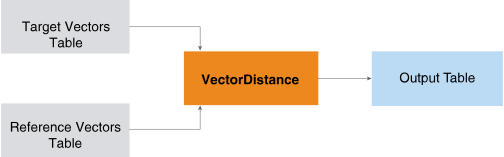

           VectorDistance (ML Engine)

VectorDistance (ML Engine)
==========================

The VectorDistance function takes a table of target vectors and a table of reference vectors and returns a table that contains the distance between each target-reference pair.

  
  

Information retrieval and text mining applications use the vector distance between the Term Frequency Inverse Document Frequency (TF-IDF) representations of two documents to measure the similarity of their subject matter.

VectorDistance Syntax
---------------------

### Version 1.3

    SELECT * FROM VectorDistance (
      ON target_input_table AS TargetTable PARTITION BY target_id_column [,...]
      ON ref_input_table AS ReferenceTable DIMENSION
      USING
      TargetIDColumns ({ 'target_id_column' | target_id_column_range }[,...])
      TargetFeatureColumn ('target_feature_column')
      [ TargetValueColumn ('target_value_column') ]
      [ RefIDColumns ({ 'ref_id_column' | ref_id_column_range }[,...])
      [ RefTableSize ({ 'SMALL' | 'LARGE' }) ]
      [ RefFeatureColumn ('ref_feature_column') ]
      [ RefValueColumn ('ref_value_column') ]
      [ DistanceMeasure ({ 'cosine' | 'euclidean' | 'manhattan' | 'binary' }[,...])]
      [ IgnoreMismatch ({'true'|'t'|'yes'|'y'|'1'|'false'|'f'|'no'|'n'|'0'}) ]
      [ ReplaceInvalid ({ 'PositiveInfinity' |'NegativeInfinity' | custom })]
      [ TopK (k) ]
      [ MaxDistance (threshold [,...]) ]
    ) AS alias;

Related Information

[Column Specification Syntax Elements](ndv1557782188375.html "See the syntax details for Machine Learning Engine analytic functions with syntax elements that specify ( {'column' | column_range }[,...] ).")

VectorDistance Syntax Elements
------------------------------

TargetIDColumns

Specify the names of the columns that comprise the target vector identifier. You must partition the target input table by these columns and specify them with this syntax element.

TargetFeatureColumn

Specify the name of the column that contains the target vector feature name (for example, the axis of a 3-D vector).

The function drops any entry that has a NULL value in a feature\_column.

TargetValueColumn

\[Optional\] Specify the name of the column that contains the value for the target vector feature. If you omit this syntax element, each feature (that is, each row) has the target value 1.

The function drops any entry that has a NULL value in a value\_column.

RefIDColumns

\[Optional\] Specify the names of the columns that comprise the reference vector identifier.

Default: TargetIDColumns value

RefFeatureColumn

\[Optional\] Specify the name of the column that contains the reference vector feature name.

The function drops any entry that has a NULL value in a feature\_column.

Default: feature\_column (TargetFeatureColumn value)

RefValueColumn

\[Optional\] Specify the name of the column that contains the value for the reference vector feature.

The function drops any entry that has a NULL value in a value\_column.

Default: TargetValueColumn syntax element value.

RefTableSize

\[Optional\] Specify the size of the ReferenceTable. Specify 'LARGE' only if the ReferenceTable does not fit in memory, because 'SMALL' allows faster processing.

Default: 'SMALL'

DistanceMeasure

\[Optional\] Specify the distance measures that the function uses.

Option

Description

'cosine'

Cosine distance between vectors p and q:

'euclidean'

Euclidean distance between vectors p and q:

'manhattan'

Manhattan distance between vectors p and q:

'binary'

Binary distance between two vectors is 1 if vectors are identical and 0 otherwise.

Default: 'cosine'

IgnoreMismatch

\[Optional\] Specify whether to drop mismatched dimensions. If DistanceMeasure is 'cosine', this syntax element is 'false'. If you specify 'true', two vectors with no common features become two empty vectors when only their common features are considered, and the function cannot measure the distance between them.

Default: 'true'

ReplaceInvalid

\[Optional\] Specify the value to return when the function encounters an infinite value or empty vectors. For custom, you can supply any DOUBLE PRECISION value.

Default: 'PositiveInfinity'

TopK

\[Optional\] Specify, for each target vector and for each measure, the maximum number of closest reference vectors to include in the output table. For k, you can supply any INTEGER value.

Default: Maximum INTEGER value (2,147,483,647)

MaxDistance

\[Optional\] Specify the maximum distance between a pair of target and reference vectors. If the distance exceeds the threshold, the pair does not appear in the output table.

If the DistanceMeasure syntax element specifies multiple measures, then the MaxDistance syntax element must specify a threshold for each measure. The ith threshold corresponds to the ith measure. Each threshold can be any DOUBLE PRECISION value.

Default behavior: The function returns all results.

VectorDistance Input
--------------------

### TargetTable Schema

This table has the target vectors.

Column

Data Type

Description

target\_id\_column

Any

\[Column appears once for each specified target\_id\_column.\] All or part of target vector identifier.

target\_feature\_column

Any except VARBYTE(n)

Feature name of target vector.

target\_value\_column

SMALLINT, INTEGER, BIGINT, NUMERIC, or DOUBLE PRECISION

Value of target vector.

### ReferenceTable Schema

This table has the reference vectors.

Column

Data Type

Description

ref\_id\_column

Any

\[Column appears once for each specified ref\_id\_column.\] All or part of reference vector identifier.

ref\_feature\_column

Any except VARBYTE(n)

Feature name of reference vector.

ref\_value\_column

SMALLINT, INTEGER, BIGINT, NUMERIC, or DOUBLE PRECISION

Value of reference vector.

VectorDistance Output
---------------------

### Output Table Schema

Column

Data Type

Description

target\_target\_id\_column

Same as in TargetTable

\[Column appears once for each specified target\_id\_column.\] All or part of target vector identifier.

ref\_ref\_id\_column

Same as in ReferenceTable

\[Column appears once for each specified ref\_id\_column.\] All or part of reference vector identifier.

type

VARCHAR

Distance measurement type.

distance

DOUBLE PRECISION

Distance between target vector and reference vector.

VectorDistance Examples
-----------------------

### VectorDistance Examples Input

#### Raw Input

The raw input is mobile telephone user data where each user (who is identified with UserID) has these attributes (for a specific time period):

Attribute

Description

CallDuration

Total time spent on telephone calls (in minutes)

SMS

Number of Short Message Service (SMS) messages sent and received

DataCounter

Data consumed (in megabytes)

UserID

CallDuration

SMS

DataCounter

1

25000

24

4

2

40000

27

5

3

55000

32

7

4

27000

25

5

5

53000

30

5

The CallDuration values are so much higher than other attribute values that they skew the distribution. Normalizing the raw data to the range \[0, 1\] solves this problem.

#### Normalized Input

In the following table, the raw input data has been normalized to the range \[0, 1\] using the Min-Max normalization technique.

UserID

CallDuration

SMS

DataCounter

1

0.0000333

0.1

0.2

2

0.5

0.4

0.4

3

1

0.9

0.8

4

0.01

0.2

0.4

5

0.93

0.7

0.4

This technique transforms the value 'a' (in column A) to the value 'b' in the range \[C, D\], using this formula:

b=((a\-minimum\_value\_in\_A)/(maximum\_value\_in\_A\-minimum\_value\_in\_A))\*(D-C)+C

The following table shows the minimum and maximum values that the formula uses for each input table column.

Column

Minimum Value

Maximum Value

CallDuration

24999

55001

SMS

23

33

DataCounter

3

8

From the normalized input data, select one or more users as the reference vector; the remaining users are the target vectors. The choice of reference vector depends on the application. For example, if the mobile telephone service is expanding its range to include a new area with similar users, then one or more typical users (with average or median attribute values) can be the reference vector. When the company has identified similar users in the new area, it can send them promotional offers.

#### Reference and Target Tables for Examples

For these examples, the reference vector is UserID 5.

ref\_mobile\_data

UserID

Feature

Value

5

CallDuration

0.93

5

SMS

0.7

5

DataCounter

0.4

target\_mobile\_data

UserID

Feature

value1

1

CallDuration

0.0000333

1

SMS

0.1

1

DataCounter

0.2

2

CallDuration

0.5

2

SMS

0.4

2

DataCounter

0.4

3

CallDuration

1

3

SMS

0.9

3

DataCounter

0.8

4

CallDuration

0.01

4

SMS

0.2

4

DataCounter

0.4

### VectorDistance Example: Default Thresholds

#### Input

See [VectorDistance Examples Input](fhm1558121996862.html#dxb1507750107365).

#### SQL Call

    SELECT * FROM VectorDistance(
      ON target_mobile_data as TargetTable PARTITION BY UserID
      ON ref_mobile_data as ReferenceTable DIMENSION
      USING
      TargetIdColumns('UserID')
      TargetFeatureColumn('Feature')
      TargetValueColumn('value1')
      DistanceMeasure('Cosine','Euclidean','Manhattan')
    ) AS dt ORDER BY 1;

#### Output

 target\_userid ref\_userid type      distance             
 ------------- ---------- --------- -------------------- 
             1          5 euclidean   1.1246501958870991
             1          5 manhattan            1.7299667
             1          5 cosine        0.45486517827424
             2          5 manhattan                 0.73
             2          5 euclidean   0.5243090691567331
             2          5 cosine     0.02608922985452755
             3          5 cosine    0.024150544155866593
             3          5 manhattan                 0.67
             3          5 euclidean   0.4526588119102511
             4          5 manhattan                 1.42
             4          5 euclidean    1.047091209016674
             4          5 cosine     0.43822243299800046

The following table (which is not output by the VectorDistance function) shows the distances of the target vectors from the reference vector (UserID 5) and their similarity ranks. The shorter the distance, the higher the similarity rank. Similarity rank is independent of measure—if relative distances are shorter in one measure, they are shorter in all measures. UserID 3 is most similar to UserID 5.

Target Distances from Reference and Similarity Ranks

target\_userid

Cosine Distance

Euclidean Distance

Manhattan Distance

Similarity Rank

1

0.454865179

1.124650195

1.7299667

4

2

0.02608923

0.524309065

0.72999999

2

3

0.024150545

0.452658811

0.66999999

1

4

0.438222434

1.047091208

1.41999999

3

Download a zip file of all examples and a SQL script file that creates their input tables from the attachment in the left sidebar.

### VectorDistance Example: Nondefault Thresholds

#### Input

See [VectorDistance Examples Input](fhm1558121996862.html#dxb1507750107365).

This example uses the MaxDistance syntax element to limit the output to target vectors within the specified distances for each measure.

#### SQL Call

    SELECT * FROM VectorDistance(
      ON target_mobile_data as TargetTable PARTITION BY UserID
      ON ref_mobile_data as ReferenceTable DIMENSION
      USING
      TargetIdColumns('UserID')
      TargetFeatureColumn('Feature')
      TargetValueColumn('value1')
      DistanceMeasure('Cosine','Euclidean','Manhattan')
      MaxDistance(0.03,0.8,1.0)
    ) AS dt ORDER BY 1;

#### Output

Only UserID 2 and UserID 3 meet the threshold criteria.

 target\_userid ref\_userid type      distance             
 ------------- ---------- --------- -------------------- 
             2          5 manhattan                 0.73
             2          5 euclidean   0.5243090691567331
             2          5 cosine     0.02608922985452755
             3          5 manhattan                 0.67
             3          5 euclidean   0.4526588119102511
             3          5 cosine    0.024150544155866593

Download a zip file of all examples and a SQL script file that creates their input tables from the attachment in the left sidebar.
