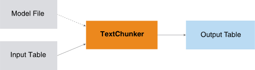

<html><head></head><body>
<h1 class="title topictitle1" id="ariaid-title1">TextChunker (ML Engine)</h1>

The TextChunker function divides text into phrases and assigns each phrase
			a tag that identifies its type.

  </img>  

<dfn class="term">Text chunking</dfn> (also called <dfn class="term">shallow parsing</dfn>) divides text into phrases in such a way that syntactically related words become members of the same phrase. Phrases do not overlap; that is, a word is a member of only one chunk.

For example, the sentence "He reckons the current account deficit will narrow to only # 1.8 billion in September ." can be divided as follows, with brackets delimiting phrases:

[NP He] [VP reckons] [NP the current account deficit] [VP will narrow] [PP to] [NP only # 1.8 billion] [PP in] [NP September]

After each opening bracket is a tag that identifies the chunk type (NP, VP, and so on). For information about chunk types, see <a href="ibg1558536107902.md#hyk1507566114056">TextChunker Output</a>.

For more information about text chunking, see:
<ul class="ul" id="sct1507564726632__ul_yrg_51k_mbb">
<li class="li">Erik F. Tjong Kim Sang and Sabine Buchholz, Introduction to the CoNLL-2000 Shared Task: Chunking. In: <cite class="cite">Proceedings of CoNLL-2000 and LLL-2000</cite>, Lisbon, Portugal, 2000.</li>
<li class="li">Fei Sha and Fernando Pereira, Shallow Parsing with Conditional Random Fields. [2003]</li></ul>

TextChunker uses files that are preinstalled on <b>ML Engine</b>. For details, see <a href="tzu1557778477026.md">Preinstalled Files That Functions Use</a>.

<h2 class="title topictitle2" id="ariaid-title2">TextChunker Syntax</h2>

<h3 class="title sectiontitle">Version 1.6</h3><pre class="pre codeblock" xml:space="preserve"><code>SELECT * FROM TextChunker (
  ON { <var class="keyword varname">table</var> | <var class="keyword varname">view</var> | (<var class="keyword varname">query</var>) } PARTITION BY <var class="keyword varname">partition_key</var> ORDER BY <var class="keyword varname">word_sn</var>
  USING
  WordColumn ('<var class="keyword varname">word_column</var>')
  POSColumn ('<var class="keyword varname">pos_tag_column</var>')
) AS <var class="keyword varname">alias</var>;</code></pre>

The <var class="keyword varname">input_table</var> is output table of the <a href="pxt1558535687028.md#pwz1507564974181">POSTagger (ML Engine)</a> function, which contains the columns <var class="keyword varname">partition_key</var> and <var class="keyword varname">word_sn</var>.

<h2 class="title topictitle2" id="ariaid-title3">TextChunker Syntax Elements</h2>

<dl class="dl parml"><dt class="dt pt dlterm">WordColumn</dt><dd class="dd pd">Specify the name of the input table column that contains the words to chunk into phrases. Typically, this is the word column of the output table of the POSTagger function (described in <a href="pxt1558535687028.md#pqx1507566419673">POSTagger Output</a>).</dd><dt class="dt pt dlterm">POSColumn</dt><dd class="dd pd">Specify the name of the input table column the part-of-speech (POS) tag of words. Typically, this is the pos_tag column of the output table of the POSTagger function (described in "POSTagger Output").</dd></dl>

<h2 class="title topictitle2" id="ariaid-title4">TextChunker Input</h2>

<table cellpadding="4" cellspacing="0" summary="" id="rwe1507565985415__table_bgh_y1d_ycb" class="table" frame="border" border="1" rules="all">

<colgroup span="1"><col style="width:50%" span="1"></col><col style="width:50%" span="1"></col></colgroup><thead class="thead" style="text-align:left;"><tr class="row"><th class="entry cellrowborder" style="vertical-align:top;" id="d110542e206" rowspan="1" colspan="1">Table</th><th class="entry cellrowborder" style="vertical-align:top;" id="d110542e208" rowspan="1" colspan="1">Description</th></tr></thead><tbody class="tbody"><tr class="row"><td class="entry cellrowborder" style="vertical-align:top;" headers="d110542e206" rowspan="1" colspan="1">Input table</td><td class="entry cellrowborder" style="vertical-align:top;" headers="d110542e208" rowspan="1" colspan="1"><a href="pxt1558535687028.md#pqx1507566419673">POSTagger Output</a> table.

When running POSTagger to create this table, specify in the Accumulate syntax element the name of the input column that contains the unique row identifiers.
</td></tr><tr class="row"><td class="entry cellrowborder" style="vertical-align:top;" headers="d110542e206" rowspan="1" colspan="1">Model file</td><td class="entry cellrowborder" style="vertical-align:top;" headers="d110542e208" rowspan="1" colspan="1"><i>chunker_default_model.bin</i>, provided with function.</td></tr></tbody></table>

<h2 class="title topictitle2" id="ariaid-title5">TextChunker Output</h2>

<h3 class="title sectiontitle">Output Table Schema</h3>
<table cellpadding="4" cellspacing="0" summary="" id="hyk1507566114056__table_N1000E_N1000C_N10001" class="table" frame="border" border="1" rules="all">

<colgroup span="1"><col style="width:17.24137931034483%" span="1"></col><col style="width:13.793103448275861%" span="1"></col><col style="width:68.96551724137932%" span="1"></col></colgroup><thead class="thead" style="text-align:left;"><tr class="row"><th class="entry nocellnorowborder" style="vertical-align:top;" id="d110542e247" rowspan="1" colspan="1">Column</th><th class="entry nocellnorowborder" style="vertical-align:top;" id="d110542e249" rowspan="1" colspan="1">Data Type</th><th class="entry cell-norowborder" style="vertical-align:top;" id="d110542e251" rowspan="1" colspan="1">Description</th></tr></thead><tbody class="tbody"><tr class="row"><td class="entry nocellnorowborder" style="vertical-align:top;" headers="d110542e247" rowspan="1" colspan="1">partition_key</td><td class="entry nocellnorowborder" style="vertical-align:top;" headers="d110542e249" rowspan="1" colspan="1">VARCHAR</td><td class="entry cell-norowborder" style="vertical-align:top;" headers="d110542e251" rowspan="1" colspan="1">Key of partition that contains text.</td></tr><tr class="row"><td class="entry nocellnorowborder" style="vertical-align:top;" headers="d110542e247" rowspan="1" colspan="1">chunk_sn</td><td class="entry nocellnorowborder" style="vertical-align:top;" headers="d110542e249" rowspan="1" colspan="1">INTEGER</td><td class="entry cell-norowborder" style="vertical-align:top;" headers="d110542e251" rowspan="1" colspan="1">Sequence number of phrase in sentence.</td></tr><tr class="row"><td class="entry nocellnorowborder" style="vertical-align:top;" headers="d110542e247" rowspan="1" colspan="1">chunk</td><td class="entry nocellnorowborder" style="vertical-align:top;" headers="d110542e249" rowspan="1" colspan="1">VARCHAR</td><td class="entry cell-norowborder" style="vertical-align:top;" headers="d110542e251" rowspan="1" colspan="1">Text chunk (syntactically related words).</td></tr><tr class="row"><td class="entry row-nocellborder" style="vertical-align:top;" headers="d110542e247" rowspan="1" colspan="1">chunk_tag</td><td class="entry row-nocellborder" style="vertical-align:top;" headers="d110542e249" rowspan="1" colspan="1">VARCHAR</td><td class="entry cellrowborder" style="vertical-align:top;" headers="d110542e251" rowspan="1" colspan="1">Phrase type tag (see following table).</td></tr></tbody></table>

<h3 class="title sectiontitle">Phrase Type Tags</h3>
<table cellpadding="4" cellspacing="0" summary="" id="hyk1507566114056__table_N1006D_N1000C_N10001" class="table" frame="border" border="1" rules="all">

<colgroup span="1"><col style="width:50%" span="1"></col><col style="width:50%" span="1"></col></colgroup><thead class="thead" style="text-align:left;"><tr class="row"><th class="entry nocellnorowborder" style="vertical-align:top;" id="d110542e291" rowspan="1" colspan="1">Tag</th><th class="entry cell-norowborder" style="vertical-align:top;" id="d110542e293" rowspan="1" colspan="1">Phrase Type</th></tr></thead><tbody class="tbody"><tr class="row"><td class="entry nocellnorowborder" style="vertical-align:top;" headers="d110542e291" rowspan="1" colspan="1">NP</td><td class="entry cell-norowborder" style="vertical-align:top;" headers="d110542e293" rowspan="1" colspan="1">noun phrase</td></tr><tr class="row"><td class="entry nocellnorowborder" style="vertical-align:top;" headers="d110542e291" rowspan="1" colspan="1">VP</td><td class="entry cell-norowborder" style="vertical-align:top;" headers="d110542e293" rowspan="1" colspan="1">verb phrase</td></tr><tr class="row"><td class="entry nocellnorowborder" style="vertical-align:top;" headers="d110542e291" rowspan="1" colspan="1">PP</td><td class="entry cell-norowborder" style="vertical-align:top;" headers="d110542e293" rowspan="1" colspan="1">prepositional phrase</td></tr><tr class="row"><td class="entry nocellnorowborder" style="vertical-align:top;" headers="d110542e291" rowspan="1" colspan="1">ADVP</td><td class="entry cell-norowborder" style="vertical-align:top;" headers="d110542e293" rowspan="1" colspan="1">adverb phrase</td></tr><tr class="row"><td class="entry nocellnorowborder" style="vertical-align:top;" headers="d110542e291" rowspan="1" colspan="1">SBAR</td><td class="entry cell-norowborder" style="vertical-align:top;" headers="d110542e293" rowspan="1" colspan="1">subordinated clause</td></tr><tr class="row"><td class="entry nocellnorowborder" style="vertical-align:top;" headers="d110542e291" rowspan="1" colspan="1">ADJP</td><td class="entry cell-norowborder" style="vertical-align:top;" headers="d110542e293" rowspan="1" colspan="1">adjective phrase</td></tr><tr class="row"><td class="entry nocellnorowborder" style="vertical-align:top;" headers="d110542e291" rowspan="1" colspan="1">PRT</td><td class="entry cell-norowborder" style="vertical-align:top;" headers="d110542e293" rowspan="1" colspan="1">particles</td></tr><tr class="row"><td class="entry nocellnorowborder" style="vertical-align:top;" headers="d110542e291" rowspan="1" colspan="1">CONJP</td><td class="entry cell-norowborder" style="vertical-align:top;" headers="d110542e293" rowspan="1" colspan="1">conjunction phrase</td></tr><tr class="row"><td class="entry nocellnorowborder" style="vertical-align:top;" headers="d110542e291" rowspan="1" colspan="1">INTJ</td><td class="entry cell-norowborder" style="vertical-align:top;" headers="d110542e293" rowspan="1" colspan="1">interjection</td></tr><tr class="row"><td class="entry nocellnorowborder" style="vertical-align:top;" headers="d110542e291" rowspan="1" colspan="1">LST</td><td class="entry cell-norowborder" style="vertical-align:top;" headers="d110542e293" rowspan="1" colspan="1">list marker</td></tr><tr class="row"><td class="entry nocellnorowborder" style="vertical-align:top;" headers="d110542e291" rowspan="1" colspan="1">UCP</td><td class="entry cell-norowborder" style="vertical-align:top;" headers="d110542e293" rowspan="1" colspan="1">unlike coordinated phrase</td></tr><tr class="row"><td class="entry row-nocellborder" style="vertical-align:top;" headers="d110542e291" rowspan="1" colspan="1">O</td><td class="entry cellrowborder" style="vertical-align:top;" headers="d110542e293" rowspan="1" colspan="1">punctuation marks</td></tr></tbody></table>

<h2 class="title topictitle2" id="ariaid-title6">TextChunker Examples</h2>

<h3 class="title topictitle3" id="ariaid-title7">TextChunker Example: POSTagger Output as Input</h3>

<h4 class="title sectiontitle">Input</h4>
<ul class="ul" id="led1524588642222__ul_hrf_bbb_j2b">
<li class="li">Input table: pos_tmp, created by inputting the table cities to the POSTagger function</li></ul>
<table cellpadding="4" cellspacing="0" summary="" id="led1524588642222__table_icy_rvl_pdb" class="table" frame="border" border="1" rules="all">
cities
<colgroup span="1"><col style="width:50%" span="1"></col><col style="width:50%" span="1"></col></colgroup><thead class="thead" style="text-align:left;"><tr class="row"><th class="entry cellrowborder" style="vertical-align:top;" id="d110542e402" rowspan="1" colspan="1">paraid</th><th class="entry cellrowborder" style="vertical-align:top;" id="d110542e404" rowspan="1" colspan="1">paratext</th></tr></thead><tbody class="tbody"><tr class="row"><td class="entry cellrowborder" style="vertical-align:top;" headers="d110542e402" rowspan="1" colspan="1">1</td><td class="entry cellrowborder" style="vertical-align:top;" headers="d110542e404" rowspan="1" colspan="1">I live in Los Angeles.</td></tr><tr class="row"><td class="entry cellrowborder" style="vertical-align:top;" headers="d110542e402" rowspan="1" colspan="1">2</td><td class="entry cellrowborder" style="vertical-align:top;" headers="d110542e404" rowspan="1" colspan="1">New York is a great city.</td></tr><tr class="row"><td class="entry cellrowborder" style="vertical-align:top;" headers="d110542e402" rowspan="1" colspan="1">3</td><td class="entry cellrowborder" style="vertical-align:top;" headers="d110542e404" rowspan="1" colspan="1">Chicago is a lot of fun, but the winters are very cold and windy.</td></tr><tr class="row"><td class="entry cellrowborder" style="vertical-align:top;" headers="d110542e402" rowspan="1" colspan="1">4</td><td class="entry cellrowborder" style="vertical-align:top;" headers="d110542e404" rowspan="1" colspan="1">Philadelphia and Boston have many historical sites.</td></tr></tbody></table>

This statement creates pos_tmp:
<pre class="pre codeblock" xml:space="preserve"><code>CREATE multiset table pos_tmp AS (
  SELECT * FROM POSTagger (
    ON cities
    USING
    Accumulate ('paraid')
    TextColumn ('paratext')
  ) AS dt1
) WITH DATA;</code></pre>

<h4 class="title sectiontitle">SQL Call</h4><pre class="pre codeblock" xml:space="preserve"><code>SELECT * FROM TextChunker (
  ON pos_tmp PARTITION BY paraid ORDER BY paraid, word_sn
  USING
  WordColumn ('word')
  POSColumn ('pos_tag')
) AS dt;</code></pre>

<h4 class="title sectiontitle">Output</h4><pre class="pre screen" xml:space="preserve"> partition_key chunk_sn chunk                   chunk_tag 
 ------------- -------- ----------------------- --------- 
             1        1 i                       NP       
             1        2 live                    VP       
             1        3 in                      PP       
             1        4 los angeles             NP       
             1        5 .                       O        
             2        1 new york                NP       
             2        2 is                      VP       
             2        3 a great city            NP       
             2        4 , filled                VP       
             2        5 with                    PP       
             2        6 arts and culture        NP       
             2        7 .                       O        
             3        1 chicago                 NP       
             3        2 is                      VP       
             3        3 a lot                   NP       
             3        4 of                      PP       
             3        5 fun                     NP       
             3        6 ,                       O        
             3        7 but                     O        
             3        8 the winters             NP       
             3        9 are                     VP       
             3       10 very cold and windy     NP       
             3       11 .                       O        
             4        1 philadelphia and boston NP       
             4        2 have                    VP       
             4        3 many historical sites   NP       
             4        4 .                       O</pre>

Download a zip file of all examples and a SQL script file that creates their input tables from the attachment in the left sidebar.

<h3 class="title topictitle3" id="ariaid-title8">TextChunker Example: SentenceExtractor and POSTagger Output as Input</h3>

<h4 class="title sectiontitle">Input</h4>
<table cellpadding="4" cellspacing="0" summary="" id="gpw1524588725869__table_swd_rwl_pdb" class="table" frame="border" border="1" rules="all">
paragraphs_input
<colgroup span="1"><col style="width:33.33333333333333%" span="1"></col><col style="width:33.33333333333333%" span="1"></col><col style="width:33.33333333333333%" span="1"></col></colgroup><thead class="thead" style="text-align:left;"><tr class="row"><th class="entry cellrowborder" style="vertical-align:top;" id="d110542e480" rowspan="1" colspan="1">paraid</th><th class="entry cellrowborder" style="vertical-align:top;" id="d110542e482" rowspan="1" colspan="1">paratopic</th><th class="entry cellrowborder" style="vertical-align:top;" id="d110542e484" rowspan="1" colspan="1">paratext</th></tr></thead><tbody class="tbody"><tr class="row"><td class="entry cellrowborder" style="vertical-align:top;" headers="d110542e480" rowspan="1" colspan="1">1</td><td class="entry cellrowborder" style="vertical-align:top;" headers="d110542e482" rowspan="1" colspan="1">Decision Trees</td><td class="entry cellrowborder" style="vertical-align:top;" headers="d110542e484" rowspan="1" colspan="1">Decision tree learning uses a decision tree as a predictive model which maps observations about an item to conclusions about the items target value. It is one of the predictive modeling approaches used in statistics, data mining and machine learning. Tree models where the target variable can take a finite set of values are called classification trees. In these tree structures, leaves represent class labels and branches represent conjunctions of features that lead to those class labels. Decision trees where the target variable can take continuous values (typically real numbers) are called regression trees.</td></tr><tr class="row"><td class="entry cellrowborder" style="vertical-align:top;" headers="d110542e480" rowspan="1" colspan="1">2</td><td class="entry cellrowborder" style="vertical-align:top;" headers="d110542e482" rowspan="1" colspan="1">Simple Regression</td><td class="entry cellrowborder" style="vertical-align:top;" headers="d110542e484" rowspan="1" colspan="1">In statistics, simple linear regression is the least squares estimator of a linear regression model with a single explanatory variable. In other words, simple linear regression fits a straight line through the set of n points in such a way that makes the sum of squared residuals of the model (that is, vertical distances between the points of the data set and the fitted line) as small as possible.</td></tr><tr class="row"><td class="entry cellrowborder" style="vertical-align:top;" headers="d110542e480" rowspan="1" colspan="1">3</td><td class="entry cellrowborder" style="vertical-align:top;" headers="d110542e482" rowspan="1" colspan="1">Logistic Regression</td><td class="entry cellrowborder" style="vertical-align:top;" headers="d110542e484" rowspan="1" colspan="1">Logistic regression was developed by statistician David Cox in 1958[2][3] (although much work was done in the single independent variable case almost two decades earlier). The binary logistic model is used to estimate the probability of a binary response based on one or more predictor (or independent) variables (features). As such it is not a classification method. It could be called a qualitative response/discrete choice model in the terminology of economics.</td></tr><tr class="row"><td class="entry cellrowborder" style="vertical-align:top;" headers="d110542e480" rowspan="1" colspan="1">4</td><td class="entry cellrowborder" style="vertical-align:top;" headers="d110542e482" rowspan="1" colspan="1">Cluster analysis</td><td class="entry cellrowborder" style="vertical-align:top;" headers="d110542e484" rowspan="1" colspan="1">Cluster analysis or clustering is the task of grouping a set of objects in such a way that objects in the same group (called a cluster) are more similar (in some sense or another) to each other than to those in other groups (clusters). It is a main task of exploratory data mining, and a common technique for statistical data analysis, used in many fields, including machine learning, pattern recognition, image analysis, information retrieval, and bioinformatics. Cluster analysis itself is not one specific algorithm, but the general task to solve. It can be achieved by various algorithms that differ significantly in their notion of what constitutes a cluster and how to efficiently find them.</td></tr><tr class="row"><td class="entry cellrowborder" style="vertical-align:top;" headers="d110542e480" rowspan="1" colspan="1">5</td><td class="entry cellrowborder" style="vertical-align:top;" headers="d110542e482" rowspan="1" colspan="1">Association rule learning</td><td class="entry cellrowborder" style="vertical-align:top;" headers="d110542e484" rowspan="1" colspan="1">Association rule learning is a method for discovering interesting relations between variables in large databases. It is intended to identify strong rules discovered in databases using different measures of interestingness. Based on the concept of strong rules, Rakesh Agrawal et al.[2] introduced association rules for discovering regularities between products in large-scale transaction data recorded by point-of-sale (POS) systems in supermarkets. For example, the rule {onions, potatoes} => {burger} found in the sales data of a supermarket would indicate that if a customer buys onions and potatoes together, they are likely to also buy hamburger meat.</td></tr></tbody></table>

<h4 class="title sectiontitle">SQL Call</h4>

TextChunker requires each sentence to have a unique identifier, and the input to TextChunker must be partitioned by that identifier.
<pre class="pre codeblock" xml:space="preserve"><code>SELECT * FROM TextChunker (
  ON (
    SELECT * FROM POSTagger (
      ON (
        SELECT paraid*1000+sentence_sn AS sentence_id, sentence FROM SentenceExtractor (
          ON paragraphs_input
          USING
          TextColumn ('paratext')
          Accumulate ('paraid')
        ) AS dt1
      )
      USING
      TextColumn ('sentence')
      Accumulate ('sentence_id')
    ) AS dt2 
  ) PARTITION BY sentence_id ORDER BY word_sn
  USING
  WordColumn('word')
  POSColumn('pos_tag')
) AS dt;</code></pre>

<h4 class="title sectiontitle">Output</h4><pre class="pre screen" xml:space="preserve"> partition_key chunk_sn chunk                                                                                                chunk_tag 
 ------------- -------- ---------------------------------------------------------------------------------------------------- --------- 
          1001        1 decision tree learning                                                                               NP       
          1001        2 uses                                                                                                 VP       
          1001        3 a decision tree                                                                                      NP       
          1001        4 as                                                                                                   PP       
          1001        5 a predictive model                                                                                   NP       
          1001        6 which                                                                                                NP       
          1001        7 maps                                                                                                 VP       
          1001        8 observations                                                                                         NP       
          1001        9 about                                                                                                PP       
          1001       10 an item                                                                                              NP       
          1001       11 to                                                                                                   PP       
          1001       12 conclusions                                                                                          NP       
          1001       13 about                                                                                                PP       
          1001       14 the items target value                                                                               NP       
          1001       15 .                                                                                                    O        
          1001       16 it                                                                                                   NP       
          1001       17 is                                                                                                   VP       
          1001       18 one                                                                                                  NP       
          1001       19 of                                                                                                   PP       
          1001       20 the predictive modelling approaches                                                                  NP       
          1001       21 used                                                                                                 VP       
          1001       22 in                                                                                                   PP       
          1001       23 statistics , data mining and machine learning . tree models                                          NP       
          1001       24 where                                                                                                ADVP     
          1001       25 the target variable                                                                                  NP       
          1001       26 can take                                                                                             VP       
          1001       27 a finite set                                                                                         NP       
          1001       28 of                                                                                                   PP       
          1001       29 values                                                                                               NP       
          1001       30 are called                                                                                           VP       
          1001       31 classification trees                                                                                 NP       
          1001       32 .                                                                                                    O        
          1001       33 in                                                                                                   PP       
          1001       34 these tree structures                                                                                NP       
          1001       35 ,                                                                                                    O        
          1001       36 leaves                                                                                               VP       
          1001       37 represent class labels and branches                                                                  NP       
          1001       38 represent                                                                                            VP       
          1001       39 conjunctions                                                                                         NP       
          1001       40 of                                                                                                   PP       
          1001       41 features                                                                                             NP       
          1001       42 that                                                                                                 NP       
          1001       43 lead                                                                                                 VP       
          1001       44 to                                                                                                   PP       
          1001       45 those class labels . decision trees                                                                  NP       
          1001       46 where                                                                                                ADVP     
          1001       47 the target variable                                                                                  NP       
          1001       48 can take                                                                                             VP       
          1001       49 continuous values                                                                                    NP       
          1001       50 ( typically real numbers                                                                             NP       
          1001       51 )                                                                                                    NP       
          1001       52 are called                                                                                           VP       
          1001       53 regression trees                                                                                     NP       
          1001       54 .                                                                                                    O        
          2001        1 in                                                                                                   PP       
          2001        2 statistics                                                                                           NP       
          2001        3 ,                                                                                                    O        
          2001        4 simple linear regression                                                                             NP       
          2001        5 is                                                                                                   VP       
          2001        6 the least squares estimator                                                                          NP       
          2001        7 of                                                                                                   PP       
          2001        8 a linear regression model                                                                            NP       
          2001        9 with                                                                                                 PP       
          2001       10 a single explanatory variable .                                                                      NP       
          2001       11 in                                                                                                   PP       
          2001       12 other words                                                                                          NP       
          2001       13 ,                                                                                                    O        
          2001       14 simple linear regression                                                                             NP       
          2001       15 fits                                                                                                 VP       
          2001       16 a straight line                                                                                      NP       
          2001       17 through                                                                                              PP       
          2001       18 the set                                                                                              NP       
          2001       19 of                                                                                                   PP       
          2001       20 n points                                                                                             NP       
          2001       21 in                                                                                                   PP       
          2001       22 such a way                                                                                           NP       
          2001       23 that                                                                                                 NP       
          2001       24 makes                                                                                                VP       
          2001       25 the sum                                                                                              NP       
          2001       26 of                                                                                                   PP       
          2001       27 squared residuals                                                                                    NP       
          2001       28 of                                                                                                   PP       
          2001       29 the model (                                                                                          NP       
          2001       30 that                                                                                                 NP       
          2001       31 is                                                                                                   VP       
          2001       32 , vertical distances                                                                                 NP       
          2001       33 between                                                                                              PP       
          2001       34 the points                                                                                           NP       
          2001       35 of                                                                                                   PP       
          2001       36 the data                                                                                             NP       
          2001       37 set                                                                                                  VP       
          2001       38 and                                                                                                  O        
          2001       39 the fitted line                                                                                      NP       
          2001       40 )                                                                                                    VP       
          2001       41 as small                                                                                             ADJP     
          2001       42 as                                                                                                   PP       
          2001       43 possible                                                                                             ADJP     
          2001       44 .                                                                                                    O        
          3001        1 logistic regression                                                                                  NP       
          3001        2 was developed                                                                                        VP       
          3001        3 by                                                                                                   PP       
          3001        4 statistician david cox                                                                               NP       
          3001        5 in                                                                                                   PP       
          3001        6 1958[2][3](although much work                                                                        NP       
          3001        7 was done                                                                                             VP       
          3001        8 in                                                                                                   PP       
          3001        9 the single independent variable case                                                                 NP       
          3001       10 almost                                                                                               ADVP     
          3001       11 two decades                                                                                          NP       
          3001       12 earlier)                                                                                             VP       
          3001       13 .                                                                                                    O        
          3001       14 the binary logistic model                                                                            NP       
          3001       15 is used to estimate                                                                                  VP       
          3001       16 the probability                                                                                      NP       
          3001       17 of                                                                                                   PP       
          3001       18 a binary response                                                                                    NP       
          3001       19 based                                                                                                VP       
          3001       20 on                                                                                                   PP       
          3001       21 one or more predictor ( or independent ) variables ( features) .                                     NP       
          3001       22 as                                                                                                   PP       
          3001       23 such                                                                                                 ADJP     
          3001       24 it                                                                                                   NP       
          3001       25 is                                                                                                   VP       
          3001       26 not                                                                                                  O        
          3001       27 a classification method                                                                              NP       
          3001       28 .                                                                                                    VP       
          3001       29 it                                                                                                   NP       
          3001       30 could be called                                                                                      VP       
          3001       31 a qualitative response/discrete choice model                                                         NP       
          3001       32 in                                                                                                   PP       
          3001       33 the terminology                                                                                      NP       
          3001       34 of                                                                                                   PP       
          3001       35 economics                                                                                            NP       
          3001       36 .                                                                                                    O        
          4001        1 cluster analysis or clustering                                                                       NP       
          4001        2 is                                                                                                   VP       
          4001        3 the task                                                                                             NP       
          4001        4 of                                                                                                   PP       
          4001        5 grouping                                                                                             VP       
          4001        6 a set                                                                                                NP       
          4001        7 of                                                                                                   PP       
          4001        8 objects                                                                                              NP       
          4001        9 in                                                                                                   PP       
          4001       10 such a way                                                                                           NP       
          4001       11 that                                                                                                 NP       
          4001       12 objects                                                                                              VP       
          4001       13 in                                                                                                   PP       
          4001       14 the same group                                                                                       NP       
          4001       15 ( called                                                                                             VP       
          4001       16 a cluster )                                                                                          NP       
          4001       17 are                                                                                                  VP       
          4001       18 more similar                                                                                         ADJP     
          4001       19 (                                                                                                    O        
          4001       20 in                                                                                                   PP       
          4001       21 some sense                                                                                           NP       
          4001       22 or                                                                                                   O        
          4001       23 another )                                                                                            NP       
          4001       24 to                                                                                                   PP       
          4001       25 each other                                                                                           NP       
          4001       26 than                                                                                                 PP       
          4001       27 to                                                                                                   PP       
          4001       28 those                                                                                                NP       
          4001       29 in                                                                                                   PP       
          4001       30 other groups                                                                                         NP       
          4001       31 ( clusters)                                                                                          NP       
          4001       32 .                                                                                                    O        
          4001       33 it                                                                                                   NP       
          4001       34 is                                                                                                   VP       
          4001       35 a main task                                                                                          NP       
          4001       36 of                                                                                                   PP       
          4001       37 exploratory data mining                                                                              NP       
          4001       38 ,                                                                                                    O        
          4001       39 and                                                                                                  O        
          4001       40 a common technique                                                                                   NP       
          4001       41 for                                                                                                  PP       
          4001       42 statistical data analysis                                                                            NP       
          4001       43 , used                                                                                               VP       
          4001       44 in                                                                                                   PP       
          4001       45 many fields                                                                                          NP       
          4001       46 ,                                                                                                    O        
          4001       47 including                                                                                            PP       
          4001       48 machine learning                                                                                     NP       
          4001       49 ,                                                                                                    O        
          4001       50 pattern recognition , image analysis , information retrieval , and bioinformatics . cluster analysis NP       
          4001       51 itself                                                                                               NP       
          4001       52 is                                                                                                   VP       
          4001       53 not                                                                                                  O        
          4001       54 one specific algorithm                                                                               NP       
          4001       55 ,                                                                                                    O        
          4001       56 but                                                                                                  O        
          4001       57 the general task                                                                                     NP       
          4001       58 to be solved                                                                                         VP       
          4001       59 .                                                                                                    O        
          4001       60 it                                                                                                   NP       
          4001       61 can be achieved                                                                                      VP       
          4001       62 by                                                                                                   PP       
          4001       63 various algorithms                                                                                   NP       
          4001       64 that                                                                                                 NP       
          4001       65 differ                                                                                               VP       
          4001       66 significantly                                                                                        ADVP     
          4001       67 in                                                                                                   PP       
          4001       68 their notion                                                                                         NP       
          4001       69 of                                                                                                   PP       
          4001       70 what                                                                                                 NP       
          4001       71 constitutes                                                                                          VP       
          4001       72 a cluster                                                                                            NP       
          4001       73 and                                                                                                  O        
          4001       74 how                                                                                                  ADVP     
          4001       75 to efficiently find                                                                                  VP       
          4001       76 them                                                                                                 NP       
          4001       77 .                                                                                                    O        
          5001        1 association rule learning                                                                            NP       
          5001        2 is                                                                                                   VP       
          5001        3 a method                                                                                             NP       
          5001        4 for                                                                                                  PP       
          5001        5 discovering                                                                                          VP       
          5001        6 interesting relations                                                                                NP       
          5001        7 between                                                                                              PP       
          5001        8 variables                                                                                            NP       
          5001        9 in                                                                                                   PP       
          5001       10 large databases                                                                                      NP       
          5001       11 .                                                                                                    O        
          5001       12 it                                                                                                   NP       
          5001       13 is intended to identify                                                                              VP       
          5001       14 strong rules                                                                                         NP       
          5001       15 discovered                                                                                           VP       
          5001       16 in                                                                                                   PP       
          5001       17 databases                                                                                            NP       
          5001       18 using                                                                                                VP       
          5001       19 different measures                                                                                   NP       
          5001       20 of                                                                                                   PP       
          5001       21 interestingness                                                                                      NP       
          5001       22 . based                                                                                              VP       
          5001       23 on                                                                                                   PP       
          5001       24 the concept                                                                                          NP       
          5001       25 of                                                                                                   PP       
          5001       26 strong rules                                                                                         NP       
          5001       27 ,                                                                                                    O        
          5001       28 rakesh agrawal et al.[2 ] introduced association rules                                               NP       
          5001       29 for                                                                                                  PP       
          5001       30 discovering regularities                                                                             NP       
          5001       31 between                                                                                              PP       
          5001       32 products                                                                                             NP       
          5001       33 in                                                                                                   PP       
          5001       34 large-scale transaction data                                                                         NP       
          5001       35 recorded                                                                                             VP       
          5001       36 by                                                                                                   PP       
          5001       37 point-of-sale ( pos ) systems                                                                        NP       
          5001       38 in                                                                                                   PP       
          5001       39 supermarkets                                                                                         NP       
          5001       40 .                                                                                                    O        
          5001       41 for                                                                                                  PP       
          5001       42 example                                                                                              NP       
          5001       43 ,                                                                                                    O        
          5001       44 the rule { onions , potatoes}=>{burger                                                               NP       
          5001       45 } found                                                                                              VP       
          5001       46 in                                                                                                   PP       
          5001       47 the sales data                                                                                       NP       
          5001       48 of                                                                                                   PP       
          5001       49 a supermarket                                                                                        NP       
          5001       50 would indicate                                                                                       VP       
          5001       51 that                                                                                                 SBAR     
          5001       52 if                                                                                                   SBAR     
          5001       53 a customer                                                                                           NP       
          5001       54 buys                                                                                                 VP       
          5001       55 onions                                                                                               NP       
          5001       56 and                                                                                                  O        
          5001       57 potatoes                                                                                             VP       
          5001       58 together                                                                                             ADVP     
          5001       59 ,                                                                                                    O        
          5001       60 they                                                                                                 NP       
          5001       61 are                                                                                                  VP       
          5001       62 likely                                                                                               ADJP     
          5001       63 to also buy                                                                                          VP       
          5001       64 hamburger meat                                                                                       NP       
          5001       65 .                                                                                                    O</pre>

Download a zip file of all examples and a SQL script file that creates their input tables from the attachment in the left sidebar.

</body></html>
