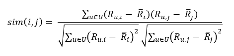
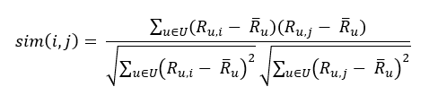

<html><head></head><body>
<h1 class="title topictitle1" id="ariaid-title1">KNNRecommender</h1>

<b>Related Information</b>

<ul class="linklist linklist relinfo">
<a href="qym1549987102806.md">Nondeterministic Results and UniqueID Syntax Element</a>
</ul>

<h2 class="title topictitle2" id="ariaid-title2">KNNRecommender Syntax</h2>

<h3 class="title sectiontitle">Version 1.4</h3><pre class="pre codeblock" xml:space="preserve"><code>SELECT * FROM KNNRecommender (
  ON <var class="keyword varname">input_table</var> AS InputTable
  OUT TABLE WeightModelTable (<var class="keyword varname">weight_model_table</var>)
  OUT TABLE BiasModelTable (<var class="keyword varname">bias_model_table</var>)
  [ OUT TABLE NearestItemsTable (<var class="keyword varname">item_neighbors_table</var>) ]
  USING
  [ UserIDColumn ('<var class="keyword varname">userid_column</var>')
    ItemIDColumn ('<var class="keyword varname">itemid_column</var>')
    RatingColumn ('<var class="keyword varname">rating_column</var>')
  ]
  [ K (<var class="keyword varname">number_of_item_neighbors</var>) ]
  [ LearningRate (<var class="keyword varname">learning_rate</var>) ]
  [ MaxIterNum (<var class="keyword varname">max_iteration_number</var>) ]
  [ StopThreshold (<var class="keyword varname">threshold</var>) ]
  [ SimilarityMethod ({ 'pearson' | 'adjustedcosine' }) ]
) AS <var class="keyword varname">alias</var>;</code></pre>

<h2 class="title topictitle2" id="ariaid-title3">KNNRecommender Syntax Elements</h2>

<dl class="dl parml"><dt class="dt pt dlterm">WeightModelTable</dt><dd class="dd pd">Specify the name for the output table of interpolation weights.</dd><dt class="dt pt dlterm">BiasModelTable</dt><dd class="dd pd">Specify the name for the output table of global, user, and item bias statistics.</dd><dt class="dt pt dlterm">NearestItemsTable</dt><dd class="dd pd">[Optional] Specify the name for the output table of nearest neighbors for each item.

If you omit this syntax element, the function does not output this table.

If you specify this syntax element, and a table named <var class="keyword varname">item_neighbors_table</var> exists, the function uses the existing table to train the model.

If you specify this syntax element, and no table named <var class="keyword varname">item_neighbors_table</var> exists, the function creates a table with that name.
</dd><dt class="dt pt dlterm">UserIDColumn</dt><dd class="dd pd">[Optional] Specify the InputTable column that contains the user IDs.</dd><dd class="dd pd ddexpand">You must specify either all or none of UserIDColumn, ItemIDColumn, and RatingColumn.</dd><dd class="dd pd ddexpand">Default: First InputTable column</dd><dt class="dt pt dlterm">ItemIDColumn</dt><dd class="dd pd">[Optional] Specify the InputTable column that contains the item IDs.</dd><dd class="dd pd ddexpand">Default: Second InputTable column</dd><dt class="dt pt dlterm">RatingColumn</dt><dd class="dd pd">[Optional] Specify the InputTable column that contains the ratings.</dd><dd class="dd pd ddexpand">Default: Third InputTable column</dd><dt class="dt pt dlterm">K</dt><dd class="dd pd">[Optional] Specify the number of nearest neighbors with which to calculate the interpolation weights.</dd><dd class="dd pd ddexpand">Default: 20</dd><dt class="dt pt dlterm">LearningRate</dt><dd class="dd pd">[Optional] Specify the initial learning rate. The learning rate adjusts automatically during training based on changes in the root-mean-square error (RMSE).</dd><dd class="dd pd ddexpand">Default: 0.001</dd><dt class="dt pt dlterm">MaxIterNum</dt><dd class="dd pd">[Optional] Specify the maximum number of iterations.</dd><dd class="dd pd ddexpand">Default: 10</dd><dt class="dt pt dlterm">StopThreshold</dt><dd class="dd pd">[Optional] Specify the RMSE below which the function stops.</dd><dd class="dd pd ddexpand">Default: 0.0002</dd><dt class="dt pt dlterm">SimilarityMethod</dt><dd class="dd pd">[Optional] Specify the method for calculating item similarity:

<table cellpadding="4" cellspacing="0" summary="" id="ztk1507908552372__table_dn2_jrz_fdb" class="table" frame="border" border="1" rules="all">

<colgroup span="1"><col style="width:25%" span="1"></col><col style="width:75%" span="1"></col></colgroup><thead class="thead" style="text-align:left;"><tr class="row"><th class="entry cellrowborder" style="vertical-align:top;" id="d123231e211" rowspan="1" colspan="1">Option</th><th class="entry cellrowborder" style="vertical-align:top;" id="d123231e213" rowspan="1" colspan="1">Description</th></tr></thead><tbody class="tbody"><tr class="row"><td class="entry cellrowborder" style="vertical-align:top;" headers="d123231e211" rowspan="1" colspan="1"><code class="ph codeph">'pearson'</code> (Default)</td><td class="entry cellrowborder" style="vertical-align:top;" headers="d123231e213" rowspan="1" colspan="1">Pearson correlation coefficient:

  </img>  
</td></tr><tr class="row"><td class="entry cellrowborder" style="vertical-align:top;" headers="d123231e211" rowspan="1" colspan="1"><code class="ph codeph">'adjustedcosine'</code></td><td class="entry cellrowborder" style="vertical-align:top;" headers="d123231e213" rowspan="1" colspan="1">Adjusted cosine similarity:

  </img>  
</td></tr></tbody></table>
</dd></dl>

<h2 class="title topictitle2" id="ariaid-title4">KNNRecommender Input</h2>

<h3 class="title sectiontitle">RatingTable Schema</h3>

The table has user ratings of items.

<table cellpadding="4" cellspacing="0" summary="" id="cps1507908555984__table_N10107_N100FE_N1000C_N10001" class="table" frame="border" border="1" rules="all">

<colgroup span="1"><col style="width:20%" span="1"></col><col style="width:20%" span="1"></col><col style="width:60%" span="1"></col></colgroup><thead class="thead" style="text-align:left;"><tr class="row"><th class="entry nocellnorowborder" style="vertical-align:top;" id="d123231e269" rowspan="1" colspan="1">Column</th><th class="entry nocellnorowborder" style="vertical-align:top;" id="d123231e271" rowspan="1" colspan="1">Data Type</th><th class="entry cell-norowborder" style="vertical-align:top;" id="d123231e273" rowspan="1" colspan="1">Description</th></tr></thead><tbody class="tbody"><tr class="row"><td class="entry nocellnorowborder" style="vertical-align:top;" headers="d123231e269" rowspan="1" colspan="1"><var class="keyword varname">userid_column</var></td><td class="entry nocellnorowborder" style="vertical-align:top;" headers="d123231e271" rowspan="1" colspan="1">INTEGER</td><td class="entry cell-norowborder" style="vertical-align:top;" headers="d123231e273" rowspan="1" colspan="1">User identifier.</td></tr><tr class="row"><td class="entry nocellnorowborder" style="vertical-align:top;" headers="d123231e269" rowspan="1" colspan="1"><var class="keyword varname">itemid_column</var></td><td class="entry nocellnorowborder" style="vertical-align:top;" headers="d123231e271" rowspan="1" colspan="1">INTEGER</td><td class="entry cell-norowborder" style="vertical-align:top;" headers="d123231e273" rowspan="1" colspan="1">Item identifier.</td></tr><tr class="row"><td class="entry row-nocellborder" style="vertical-align:top;" headers="d123231e269" rowspan="1" colspan="1"><var class="keyword varname">rating_column</var></td><td class="entry row-nocellborder" style="vertical-align:top;" headers="d123231e271" rowspan="1" colspan="1">Any numeric type.</td><td class="entry cellrowborder" style="vertical-align:top;" headers="d123231e273" rowspan="1" colspan="1">Rating user gave item.</td></tr></tbody></table>

<h2 class="title topictitle2" id="ariaid-title5">KNNRecommender Output</h2>

<h3 class="title sectiontitle">Output Table Schema</h3>
<table cellpadding="4" cellspacing="0" summary="" id="ecq1507908560611__table_N10014_N1000E_N1000C_N10001" class="table" frame="border" border="1" rules="all">

<colgroup span="1"><col style="width:17.543859649122805%" span="1"></col><col style="width:17.543859649122805%" span="1"></col><col style="width:64.91228070175438%" span="1"></col></colgroup><thead class="thead" style="text-align:left;"><tr class="row"><th class="entry nocellnorowborder" style="vertical-align:top;" id="d123231e320" rowspan="1" colspan="1">Column</th><th class="entry nocellnorowborder" style="vertical-align:top;" id="d123231e322" rowspan="1" colspan="1">Data Type</th><th class="entry cell-norowborder" style="vertical-align:top;" id="d123231e324" rowspan="1" colspan="1">Description</th></tr></thead><tbody class="tbody"><tr class="row"><td class="entry nocellnorowborder" style="vertical-align:top;" headers="d123231e320" rowspan="1" colspan="1">iternum</td><td class="entry nocellnorowborder" style="vertical-align:top;" headers="d123231e322" rowspan="1" colspan="1">INTEGER</td><td class="entry cell-norowborder" style="vertical-align:top;" headers="d123231e324" rowspan="1" colspan="1">Iteration number. NULL for baseline rmse.</td></tr><tr class="row"><td class="entry row-nocellborder" style="vertical-align:top;" headers="d123231e320" rowspan="1" colspan="1">rmse</td><td class="entry row-nocellborder" style="vertical-align:top;" headers="d123231e322" rowspan="1" colspan="1">DOUBLE PRECISION</td><td class="entry cellrowborder" style="vertical-align:top;" headers="d123231e324" rowspan="1" colspan="1">Root mean square error after iteration.</td></tr></tbody></table>

<h3 class="title sectiontitle">WeightModelTable Schema</h3>
<table cellpadding="4" cellspacing="0" summary="" id="ecq1507908560611__table_N1005A_N1000E_N1000C_N10001" class="table" frame="border" border="1" rules="all">

<colgroup span="1"><col style="width:17.543859649122805%" span="1"></col><col style="width:17.543859649122805%" span="1"></col><col style="width:64.91228070175438%" span="1"></col></colgroup><thead class="thead" style="text-align:left;"><tr class="row"><th class="entry nocellnorowborder" style="vertical-align:top;" id="d123231e351" rowspan="1" colspan="1">Column</th><th class="entry nocellnorowborder" style="vertical-align:top;" id="d123231e353" rowspan="1" colspan="1">Data Type</th><th class="entry cell-norowborder" style="vertical-align:top;" id="d123231e355" rowspan="1" colspan="1">Description</th></tr></thead><tbody class="tbody"><tr class="row"><td class="entry nocellnorowborder" style="vertical-align:top;" headers="d123231e351" rowspan="1" colspan="1">itemid</td><td class="entry nocellnorowborder" style="vertical-align:top;" headers="d123231e353" rowspan="1" colspan="1">INTEGER</td><td class="entry cell-norowborder" style="vertical-align:top;" headers="d123231e355" rowspan="1" colspan="1">Item identifier.</td></tr><tr class="row"><td class="entry row-nocellborder" style="vertical-align:top;" headers="d123231e351" rowspan="1" colspan="1">weights</td><td class="entry row-nocellborder" style="vertical-align:top;" headers="d123231e353" rowspan="1" colspan="1">BLOB</td><td class="entry cellrowborder" style="vertical-align:top;" headers="d123231e355" rowspan="1" colspan="1">Interpolation weights for item, in compressed binary format.</td></tr></tbody></table>

<h3 class="title sectiontitle">BiasModelTable Schema</h3>
<table cellpadding="4" cellspacing="0" summary="" id="ecq1507908560611__table_N1009D_N1000E_N1000C_N10001" class="table" frame="border" border="1" rules="all">

<colgroup span="1"><col style="width:17.543859649122805%" span="1"></col><col style="width:17.543859649122805%" span="1"></col><col style="width:64.91228070175438%" span="1"></col></colgroup><thead class="thead" style="text-align:left;"><tr class="row"><th class="entry nocellnorowborder" style="vertical-align:top;" id="d123231e382" rowspan="1" colspan="1">Column</th><th class="entry nocellnorowborder" style="vertical-align:top;" id="d123231e384" rowspan="1" colspan="1">Data Type</th><th class="entry cell-norowborder" style="vertical-align:top;" id="d123231e386" rowspan="1" colspan="1">Description</th></tr></thead><tbody class="tbody"><tr class="row"><td class="entry nocellnorowborder" style="vertical-align:top;" headers="d123231e382" rowspan="1" colspan="1">label</td><td class="entry nocellnorowborder" style="vertical-align:top;" headers="d123231e384" rowspan="1" colspan="1">CHARACTER(1)</td><td class="entry cell-norowborder" style="vertical-align:top;" headers="d123231e386" rowspan="1" colspan="1">One of the following values:

<table cellpadding="4" cellspacing="0" summary="" id="ecq1507908560611__table_uht_dvk_ycb" class="table" frame="border" border="1" rules="all">

<colgroup span="1"><col style="width:50%" span="1"></col><col style="width:50%" span="1"></col></colgroup><thead class="thead" style="text-align:left;"><tr class="row"><th class="entry cellrowborder" style="vertical-align:top;" id="d123231e403" rowspan="1" colspan="1">label</th><th class="entry cellrowborder" style="vertical-align:top;" id="d123231e405" rowspan="1" colspan="1">Meaning</th></tr></thead><tbody class="tbody"><tr class="row"><td class="entry cellrowborder" style="vertical-align:top;" headers="d123231e403" rowspan="1" colspan="1">U</td><td class="entry cellrowborder" style="vertical-align:top;" headers="d123231e405" rowspan="1" colspan="1">User statistics</td></tr><tr class="row"><td class="entry cellrowborder" style="vertical-align:top;" headers="d123231e403" rowspan="1" colspan="1">I</td><td class="entry cellrowborder" style="vertical-align:top;" headers="d123231e405" rowspan="1" colspan="1">Item statistics</td></tr><tr class="row"><td class="entry cellrowborder" style="vertical-align:top;" headers="d123231e403" rowspan="1" colspan="1">G</td><td class="entry cellrowborder" style="vertical-align:top;" headers="d123231e405" rowspan="1" colspan="1">Global statistics</td></tr></tbody></table>

</td></tr><tr class="row"><td class="entry nocellnorowborder" style="vertical-align:top;" headers="d123231e382" rowspan="1" colspan="1">id</td><td class="entry nocellnorowborder" style="vertical-align:top;" headers="d123231e384" rowspan="1" colspan="1">INTEGER</td><td class="entry cell-norowborder" style="vertical-align:top;" headers="d123231e386" rowspan="1" colspan="1">Item identifier or user identifier.</td></tr><tr class="row"><td class="entry row-nocellborder" style="vertical-align:top;" headers="d123231e382" rowspan="1" colspan="1">value</td><td class="entry row-nocellborder" style="vertical-align:top;" headers="d123231e384" rowspan="1" colspan="1">DOUBLE PRECISION</td><td class="entry cellrowborder" style="vertical-align:top;" headers="d123231e386" rowspan="1" colspan="1">One of the following values:

<table cellpadding="4" cellspacing="0" summary="" id="ecq1507908560611__table_ym2_kvk_ycb" class="table" frame="border" border="1" rules="all">

<colgroup span="1"><col style="width:50%" span="1"></col><col style="width:50%" span="1"></col></colgroup><thead class="thead" style="text-align:left;"><tr class="row"><th class="entry cellrowborder" style="vertical-align:top;" id="d123231e444" rowspan="1" colspan="1">label</th><th class="entry cellrowborder" style="vertical-align:top;" id="d123231e446" rowspan="1" colspan="1">value</th></tr></thead><tbody class="tbody"><tr class="row"><td class="entry cellrowborder" style="vertical-align:top;" headers="d123231e444" rowspan="1" colspan="1">U</td><td class="entry cellrowborder" style="vertical-align:top;" headers="d123231e446" rowspan="1" colspan="1">Average rating across all users for item.</td></tr><tr class="row"><td class="entry cellrowborder" style="vertical-align:top;" headers="d123231e444" rowspan="1" colspan="1">I</td><td class="entry cellrowborder" style="vertical-align:top;" headers="d123231e446" rowspan="1" colspan="1">Average rating across all items from user.</td></tr><tr class="row"><td class="entry cellrowborder" style="vertical-align:top;" headers="d123231e444" rowspan="1" colspan="1">G</td><td class="entry cellrowborder" style="vertical-align:top;" headers="d123231e446" rowspan="1" colspan="1">Global average rating across all users and all items.</td></tr></tbody></table>

</td></tr></tbody></table>

<h3 class="title sectiontitle">NearestItemsTable Schema</h3>

This table appears only with the NearestItemsTable syntax element.

<table cellpadding="4" cellspacing="0" summary="" id="ecq1507908560611__table_N100FA_N1000E_N1000C_N10001" class="table" frame="border" border="1" rules="all">

<colgroup span="1"><col style="width:17.543859649122805%" span="1"></col><col style="width:17.543859649122805%" span="1"></col><col style="width:64.91228070175438%" span="1"></col></colgroup><thead class="thead" style="text-align:left;"><tr class="row"><th class="entry nocellnorowborder" style="vertical-align:top;" id="d123231e476" rowspan="1" colspan="1">Column</th><th class="entry nocellnorowborder" style="vertical-align:top;" id="d123231e478" rowspan="1" colspan="1">Data Type</th><th class="entry cell-norowborder" style="vertical-align:top;" id="d123231e480" rowspan="1" colspan="1">Description</th></tr></thead><tbody class="tbody"><tr class="row"><td class="entry nocellnorowborder" style="vertical-align:top;" headers="d123231e476" rowspan="1" colspan="1">itemi</td><td class="entry nocellnorowborder" style="vertical-align:top;" headers="d123231e478" rowspan="1" colspan="1">INTEGER</td><td class="entry cell-norowborder" style="vertical-align:top;" headers="d123231e480" rowspan="1" colspan="1">Item identifier of item i.</td></tr><tr class="row"><td class="entry nocellnorowborder" style="vertical-align:top;" headers="d123231e476" rowspan="1" colspan="1">itemj</td><td class="entry nocellnorowborder" style="vertical-align:top;" headers="d123231e478" rowspan="1" colspan="1">INTEGER</td><td class="entry cell-norowborder" style="vertical-align:top;" headers="d123231e480" rowspan="1" colspan="1">Item identifier of item j.</td></tr><tr class="row"><td class="entry row-nocellborder" style="vertical-align:top;" headers="d123231e476" rowspan="1" colspan="1">sij</td><td class="entry row-nocellborder" style="vertical-align:top;" headers="d123231e478" rowspan="1" colspan="1">DOUBLE PRECISION</td><td class="entry cellrowborder" style="vertical-align:top;" headers="d123231e480" rowspan="1" colspan="1">Calculated similarity between item i and item j.</td></tr></tbody></table>

<h2 class="title topictitle2" id="ariaid-title6">KNNRecommender Example</h2>

<h3 class="title sectiontitle">Input</h3>

The InputTable has movie ratings from 50 users on approximately 2900 movies, with an average of about 150 ratings for each user. The 10 possible ratings range from 0.5 to 5 in steps of 0.5. A higher number indicates a better rating.

<table cellpadding="4" cellspacing="0" summary="" id="hez1510706776796__table_bw2_d1x_42b" class="table" frame="border" border="1" rules="all">
InputTable: ml_ratings
<colgroup span="1"><col style="width:33.33333333333333%" span="1"></col><col style="width:33.33333333333333%" span="1"></col><col style="width:33.33333333333333%" span="1"></col></colgroup><thead class="thead" style="text-align:left;"><tr class="row"><th class="entry cellrowborder" style="vertical-align:top;" id="d123231e538" rowspan="1" colspan="1">userid</th><th class="entry cellrowborder" style="vertical-align:top;" id="d123231e540" rowspan="1" colspan="1">itemid</th><th class="entry cellrowborder" style="vertical-align:top;" id="d123231e542" rowspan="1" colspan="1">rating</th></tr></thead><tbody class="tbody"><tr class="row"><td class="entry cellrowborder" style="vertical-align:top;" headers="d123231e538" rowspan="1" colspan="1">1</td><td class="entry cellrowborder" style="vertical-align:top;" headers="d123231e540" rowspan="1" colspan="1">1</td><td class="entry cellrowborder" style="vertical-align:top;" headers="d123231e542" rowspan="1" colspan="1">5</td></tr><tr class="row"><td class="entry cellrowborder" style="vertical-align:top;" headers="d123231e538" rowspan="1" colspan="1">1</td><td class="entry cellrowborder" style="vertical-align:top;" headers="d123231e540" rowspan="1" colspan="1">2</td><td class="entry cellrowborder" style="vertical-align:top;" headers="d123231e542" rowspan="1" colspan="1">3</td></tr><tr class="row"><td class="entry cellrowborder" style="vertical-align:top;" headers="d123231e538" rowspan="1" colspan="1">1</td><td class="entry cellrowborder" style="vertical-align:top;" headers="d123231e540" rowspan="1" colspan="1">10</td><td class="entry cellrowborder" style="vertical-align:top;" headers="d123231e542" rowspan="1" colspan="1">3</td></tr><tr class="row"><td class="entry cellrowborder" style="vertical-align:top;" headers="d123231e538" rowspan="1" colspan="1">1</td><td class="entry cellrowborder" style="vertical-align:top;" headers="d123231e540" rowspan="1" colspan="1">32</td><td class="entry cellrowborder" style="vertical-align:top;" headers="d123231e542" rowspan="1" colspan="1">4</td></tr><tr class="row"><td class="entry cellrowborder" style="vertical-align:top;" headers="d123231e538" rowspan="1" colspan="1">1</td><td class="entry cellrowborder" style="vertical-align:top;" headers="d123231e540" rowspan="1" colspan="1">34</td><td class="entry cellrowborder" style="vertical-align:top;" headers="d123231e542" rowspan="1" colspan="1">4</td></tr><tr class="row"><td class="entry cellrowborder" style="vertical-align:top;" headers="d123231e538" rowspan="1" colspan="1">1</td><td class="entry cellrowborder" style="vertical-align:top;" headers="d123231e540" rowspan="1" colspan="1">47</td><td class="entry cellrowborder" style="vertical-align:top;" headers="d123231e542" rowspan="1" colspan="1">3</td></tr><tr class="row"><td class="entry cellrowborder" style="vertical-align:top;" headers="d123231e538" rowspan="1" colspan="1">1</td><td class="entry cellrowborder" style="vertical-align:top;" headers="d123231e540" rowspan="1" colspan="1">50</td><td class="entry cellrowborder" style="vertical-align:top;" headers="d123231e542" rowspan="1" colspan="1">4</td></tr><tr class="row"><td class="entry cellrowborder" style="vertical-align:top;" headers="d123231e538" rowspan="1" colspan="1">1</td><td class="entry cellrowborder" style="vertical-align:top;" headers="d123231e540" rowspan="1" colspan="1">62</td><td class="entry cellrowborder" style="vertical-align:top;" headers="d123231e542" rowspan="1" colspan="1">4</td></tr><tr class="row"><td class="entry cellrowborder" style="vertical-align:top;" headers="d123231e538" rowspan="1" colspan="1">1</td><td class="entry cellrowborder" style="vertical-align:top;" headers="d123231e540" rowspan="1" colspan="1">150</td><td class="entry cellrowborder" style="vertical-align:top;" headers="d123231e542" rowspan="1" colspan="1">4</td></tr><tr class="row"><td class="entry cellrowborder" style="vertical-align:top;" headers="d123231e538" rowspan="1" colspan="1">1</td><td class="entry cellrowborder" style="vertical-align:top;" headers="d123231e540" rowspan="1" colspan="1">153</td><td class="entry cellrowborder" style="vertical-align:top;" headers="d123231e542" rowspan="1" colspan="1">3</td></tr><tr class="row"><td class="entry cellrowborder" style="vertical-align:top;" headers="d123231e538" rowspan="1" colspan="1">1</td><td class="entry cellrowborder" style="vertical-align:top;" headers="d123231e540" rowspan="1" colspan="1">160</td><td class="entry cellrowborder" style="vertical-align:top;" headers="d123231e542" rowspan="1" colspan="1">3</td></tr><tr class="row"><td class="entry cellrowborder" style="vertical-align:top;" headers="d123231e538" rowspan="1" colspan="1">1</td><td class="entry cellrowborder" style="vertical-align:top;" headers="d123231e540" rowspan="1" colspan="1">161</td><td class="entry cellrowborder" style="vertical-align:top;" headers="d123231e542" rowspan="1" colspan="1">4</td></tr><tr class="row"><td class="entry cellrowborder" style="vertical-align:top;" headers="d123231e538" rowspan="1" colspan="1">1</td><td class="entry cellrowborder" style="vertical-align:top;" headers="d123231e540" rowspan="1" colspan="1">165</td><td class="entry cellrowborder" style="vertical-align:top;" headers="d123231e542" rowspan="1" colspan="1">4</td></tr><tr class="row"><td class="entry cellrowborder" style="vertical-align:top;" headers="d123231e538" rowspan="1" colspan="1">1</td><td class="entry cellrowborder" style="vertical-align:top;" headers="d123231e540" rowspan="1" colspan="1">185</td><td class="entry cellrowborder" style="vertical-align:top;" headers="d123231e542" rowspan="1" colspan="1">3</td></tr><tr class="row"><td class="entry cellrowborder" style="vertical-align:top;" headers="d123231e538" rowspan="1" colspan="1">...</td><td class="entry cellrowborder" style="vertical-align:top;" headers="d123231e540" rowspan="1" colspan="1">...</td><td class="entry cellrowborder" style="vertical-align:top;" headers="d123231e542" rowspan="1" colspan="1">...</td></tr></tbody></table>

<h3 class="title sectiontitle">SQL Call</h3>

KNNRecommender uses the input data to create three model tables: the weights model ('ml_weights'), the bias model table ('ml_bias') and the optional nearest items or neighbors table ('ml_itemngbrs').
<pre class="pre codeblock" xml:space="preserve"><code>DROP TABLE ml_weights;
DROP TABLE ml_bias;
DROP TABLE ml_itemngbrs;</code></pre><pre class="pre codeblock" xml:space="preserve"><code>SELECT * FROM KNNRecommender (
  ON ml_ratings AS InputTable
  OUT TABLE WeightModelTable (ml_weights)
  OUT TABLE BiasModelTable (ml_bias)
  OUT TABLE NearestItemsTable (ml_itemngbrs)
  USING
  UserIDColumn ('userid')
  ItemIDColumn ('itemid')
  RatingColumn ('rating')
  K (15)
  MaxIterNum (20)
  StopThreshold (0.0002)
  LearningRate (0.001)
) AS dt;</code></pre>

<h3 class="title sectiontitle">Output</h3>

The rmse value is output for each of the 20 iterations. The null iteration or first row of the table shows the rmse of the default initialized model.

The ml_weights table is not shown because it is in compressed binary format.
<pre class="pre screen" xml:space="preserve"> iternum rmse              
 ------- ----------------- 
    NULL 0.201160929445398
       0 0.200122952666973
       1 0.199094556858257
       2 0.198024742312269
       3 0.196912337420418
       4 0.195756186274468
       5  0.19455515462393
       6 0.193308136349661
       7  0.19201406046623
       8 0.190671898661581
       9 0.189280673377762
      10 0.187839466430794
      11 0.186347428161151
      12 0.184803787098705
      13 0.183207860117312
      14 0.181559063044462
      15 0.179856921680543
      16 0.178101083170261
      17 0.176291327655719
      18 0.174427580126542
      19 0.172509922367382</pre><pre class="pre codeblock" xml:space="preserve"><code>SELECT * FROM ml_itemngbrs ORDER BY 1;</code></pre>

The sij value (similarity between itemi and itemj) in ml_itemngbrs is the default Pearson correlation coefficient.
<pre class="pre screen" xml:space="preserve"> itemi itemj sij                    
 ----- ----- ---------------------- 
     1   329      0.948683298050514
     1    39     0.4472135954999582
     1   648     0.7071067811865475
     1   225     0.7071067811865475
     1   597     0.7071067811865475
     1   296     0.7071067811865475
     1   300     0.8660254037844385
     1    21     0.7071067811865475
     1   480     0.7071067811865475
     1   265     0.7071067811865475
     1    11     0.7071067811865475
     1   288     0.9999999999999998
     1   165     0.9999999999999998
     1   380     0.4472135954999582
     1   515     0.7071067811865475
    10   161     0.8944271909999159
    10   356                    0.0
    10   160      0.948683298050514
    10   380                    0.0
    10   592                    0.0
    10   357     0.9999999999999998
    10   434                    0.0
   ...    ...                 ...</pre><pre class="pre codeblock" xml:space="preserve"><code>SELECT * FROM ml_bias ORDER BY 1, 2;</code></pre><pre class="pre screen" xml:space="preserve"> label id    value              
 ----- ----- ------------------ 
 G      NULL  3.840092699884125
 I         1                4.0
 I         2                3.0
 I         5                3.0
 I         6                4.0
 I        10                3.5
 I        11                3.5
 I        14                4.0
 I        16                5.0
 I        17                5.0
 I        19                3.0
 I        21                4.0
 I        32                4.5
 I        34                4.5
 I        36                3.0
 I        39 3.3333333333333335
 I        44                2.0
 I        45                4.0
 I        47 3.3333333333333335
 I        50                4.5
...      ...                ...</pre>

Download a zip file of all examples and a SQL script file that creates their input tables from the attachment in the left sidebar.

</body></html>
