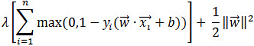
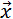

<html><head></head><body>
<h1 class="title topictitle1" id="ariaid-title1">SVMSparse</h1>

The SVMSparse function takes training data (in sparse format) and outputs a predictive model in binary format, which is input to the functions <a href="wzb1541537305621.md#guu1507914686828">SVMSparsePredict_MLE</a> and <a href="ity1558533483914.md#igx1507913009828">SVMSparseSummary</a>.

<h2 class="title topictitle2" id="ariaid-title2">SVMSparse Syntax</h2>

<h3 class="title sectiontitle">Version 1.4</h3><pre class="pre codeblock" xml:space="preserve"><code>SELECT * FROM SVMSparse (
  ON { <var class="keyword varname">table</var> | <var class="keyword varname">view</var> | (<var class="keyword varname">query</var>) } AS InputTable
  OUT TABLE ModelTable (<var class="keyword varname">model_table</var>)
  USING
  IDColumn ('<var class="keyword varname">id_column</var>')
  AttributeNameColumn ('<var class="keyword varname">attribute_name_column</var>')
  [ AttributeValueColumn ('<var class="keyword varname">attribute_value_column</var>') ]
  ResponseColumn ('<var class="keyword varname">response_column</var>')
  [ Cost (<var class="keyword varname">cost</var>) ]
  [ Bias (<var class="keyword varname">bias</var>) ]
  [ HashProjection (<b>{'true'|'t'|'yes'|'y'|'1'|'false'|'f'|'no'|'n'|'0'}</b>) ]
  [ HashBuckets (<var class="keyword varname">buckets_number</var>) ]
  [ ClassWeights ('<var class="keyword varname">class</var>:<var class="keyword varname">weight</var>' [,...]) ]
  [ MaxStep (<var class="keyword varname">max_step</var>) ]
  [ Epsilon (<var class="keyword varname">epsilon</var>) ]
  [ Seed (<var class="keyword varname">seed</var>) ]
) AS <var class="keyword varname">alias</var>;</code></pre>

<h2 class="title topictitle2" id="ariaid-title3">SVMSparse Syntax Elements</h2>

<dl class="dl parml"><dt class="dt pt dlterm">ModelTable</dt><dd class="dd pd">Specify the name of the model table (which must not exist).</dd><dt class="dt pt dlterm">IDColumn</dt><dd class="dd pd">Specify the name of the InputTable column that contains the identifiers of the training samples.</dd><dt class="dt pt dlterm">AttributeNameColumn</dt><dd class="dd pd">Specify the name of the InputTable column that contains the attributes of the samples.</dd><dt class="dt pt dlterm">AttributeValueColumn</dt><dd class="dd pd">[Optional] Specify the name of the InputTable column that contains the attribute values.</dd><dd class="dd pd ddexpand">Default behavior: Each attribute has the value 1.</dd><dt class="dt pt dlterm">ResponseColumn</dt><dd class="dd pd">Specify the name of the InputTable column that contains the classes of the samples.</dd><dt class="dt pt dlterm">Cost</dt><dd class="dd pd">[Optional] Specify the regularization parameter λ in the SVM soft-margin loss function:

  </img>  
</dd><dd class="dd pd ddexpand">The <var class="keyword varname">cost</var> must be greater than 0.0.</dd><dd class="dd pd ddexpand">Default: 1.0</dd><dt class="dt pt dlterm">Bias</dt><dd class="dd pd">[Optional] Specify whether to add another dimension containing the bias value <var class="keyword varname">b</var>. The <var class="keyword varname">bias</var> must be nonnegative. If <var class="keyword varname">bias</var> is greater than 0, the function converts each sample </img> in the training set to (</img> , b). Use this syntax element when not all samples center at 0.</dd><dd class="dd pd ddexpand">Default: 0.0</dd><dt class="dt pt dlterm">HashProjection</dt><dd class="dd pd">[Optional] Specify whether to use hash projection on attributes. Hash projection can accelerate processing speed but can slightly decrease accuracy.</dd><dd class="dd pd ddexpand">You must use hash projection if the data set has more features than fit into memory.</dd><dd class="dd pd ddexpand">Default: 'false'</dd><dt class="dt pt dlterm">HashBuckets</dt><dd class="dd pd">[Optional] [Valid only with HashProjection ('true').] Specify the number of buckets for hash projection. Usually, the function can determine the appropriate number of buckets from the scale of the input data set. However, if the data set has many features, you might have to specify <var class="keyword varname">buckets_number</var> to accelerate the function.</dd><dd class="dd pd ddexpand">Default behavior: The function determines the appropriate number of buckets from the scale of the input data set.</dd><dt class="dt pt dlterm">ClassWeights</dt><dd class="dd pd">[Optional] Specify the weights for different classes. If you specify a <var class="keyword varname">weight</var> for a <var class="keyword varname">class</var>, the cost parameter for that class is <var class="keyword varname">weight</var> * <var class="keyword varname">cost</var>. A <var class="keyword varname">weight</var> larger than 1 often increases the accuracy of <var class="keyword varname">class</var>; however, it may decrease global accuracy.</dd><dd class="dd pd ddexpand">Default behavior: The function assigns weight 1.0 to any class not assigned a weight in this syntax element.</dd><dt class="dt pt dlterm">MaxStep</dt><dd class="dd pd">[Optional] Specify the maximum number of steps of the training process. One step means that the trainer sees each sample once. The <var class="keyword varname">max_step</var> must be in the range (0, 10000].</dd><dd class="dd pd ddexpand">Default: 100</dd><dt class="dt pt dlterm">Epsilon</dt><dd class="dd pd">[Optional] Specify the termination criterion: When the difference between the values of the loss function in two sequential iterations is less than this <var class="keyword varname">epsilon</var>, the function stops. The <var class="keyword varname">epsilon</var> must be greater than 0.0.</dd><dd class="dd pd ddexpand">Default: 0.01</dd><dt class="dt pt dlterm">Seed</dt><dd class="dd pd">[Optional] Specify the random seed the algorithm uses for repeatable results. The algorithm uses the seed to order the training set randomly and consistently. The <var class="keyword varname">seed</var> must be a nonnegative LONG value.
<b>Note</b>
 For repeatable results, use both the Seed and UniqueID syntax elements. For more information, see <a href="qym1549987102806.md">Nondeterministic Results and UniqueID Syntax Element</a>.

</dd><dd class="dd pd ddexpand">Default: 0</dd></dl>

<h2 class="title topictitle2" id="ariaid-title4">SVMSparse Input</h2>

<h3 class="title sectiontitle">InputTable Schema</h3>
<b>Note</b>
It is important to normalize the input variables before calling this function. For details, see <a href="qnw1570800778984.md">Normalized Input</a>.

<table cellpadding="4" cellspacing="0" summary="" id="suj1507915383408__table_N10014_N1000E_N1000C_N10001" class="table" frame="border" border="1" rules="all">

<colgroup span="1"><col style="width:33.33333333333333%" span="1"></col><col style="width:33.33333333333333%" span="1"></col><col style="width:33.33333333333333%" span="1"></col></colgroup><thead class="thead" style="text-align:left;"><tr class="row"><th class="entry nocellnorowborder" style="vertical-align:top;" id="d132800e340" rowspan="1" colspan="1">Column</th><th class="entry nocellnorowborder" style="vertical-align:top;" id="d132800e342" rowspan="1" colspan="1">Data Type</th><th class="entry cell-norowborder" style="vertical-align:top;" id="d132800e344" rowspan="1" colspan="1">Description</th></tr></thead><tbody class="tbody"><tr class="row"><td class="entry nocellnorowborder" style="vertical-align:top;" headers="d132800e340" rowspan="1" colspan="1"><var class="keyword varname">id_column</var></td><td class="entry nocellnorowborder" style="vertical-align:top;" headers="d132800e342" rowspan="1" colspan="1">INTEGER, SMALLINT, BIGINT, NUMERIC, VARCHAR, VARBYTE(<var class="keyword varname">n</var>), or BLOB</td><td class="entry cell-norowborder" style="vertical-align:top;" headers="d132800e344" rowspan="1" colspan="1">Training sample identifier.</td></tr><tr class="row"><td class="entry nocellnorowborder" style="vertical-align:top;" headers="d132800e340" rowspan="1" colspan="1"><var class="keyword varname">attribute_name_column</var></td><td class="entry nocellnorowborder" style="vertical-align:top;" headers="d132800e342" rowspan="1" colspan="1">INTEGER, SMALLINT, BIGINT, or VARCHAR</td><td class="entry cell-norowborder" style="vertical-align:top;" headers="d132800e344" rowspan="1" colspan="1">Training sample attribute.</td></tr><tr class="row"><td class="entry nocellnorowborder" style="vertical-align:top;" headers="d132800e340" rowspan="1" colspan="1"><var class="keyword varname">attribute_value_column</var></td><td class="entry nocellnorowborder" style="vertical-align:top;" headers="d132800e342" rowspan="1" colspan="1">INTEGER, SMALLINT, BIGINT, or NUMERIC</td><td class="entry cell-norowborder" style="vertical-align:top;" headers="d132800e344" rowspan="1" colspan="1">Attribute value.</td></tr><tr class="row"><td class="entry row-nocellborder" style="vertical-align:top;" headers="d132800e340" rowspan="1" colspan="1"><var class="keyword varname">response_column</var></td><td class="entry row-nocellborder" style="vertical-align:top;" headers="d132800e342" rowspan="1" colspan="1">INTEGER, SMALLINT, BIGINT, VARCHAR, or VARCHAR(<var class="keyword varname">n</var>)</td><td class="entry cellrowborder" style="vertical-align:top;" headers="d132800e344" rowspan="1" colspan="1">Training sample class.</td></tr></tbody></table>

<h2 class="title topictitle2" id="ariaid-title5">SVMSparse Output</h2>

<h3 class="title sectiontitle">Output Message Schema</h3>
<table cellpadding="4" cellspacing="0" summary="" id="lhs1507915494399__table_u21_cxw_xcb" class="table" frame="border" border="1" rules="all">

<colgroup span="1"><col style="width:33.33333333333333%" span="1"></col><col style="width:33.33333333333333%" span="1"></col><col style="width:33.33333333333333%" span="1"></col></colgroup><thead class="thead" style="text-align:left;"><tr class="row"><th class="entry cellrowborder" style="vertical-align:top;" id="d132800e404" rowspan="1" colspan="1">Column</th><th class="entry cellrowborder" style="vertical-align:top;" id="d132800e406" rowspan="1" colspan="1">Data Type</th><th class="entry cellrowborder" style="vertical-align:top;" id="d132800e408" rowspan="1" colspan="1">Description</th></tr></thead><tbody class="tbody"><tr class="row"><td class="entry cellrowborder" style="vertical-align:top;" headers="d132800e404" rowspan="1" colspan="1">message</td><td class="entry cellrowborder" style="vertical-align:top;" headers="d132800e406" rowspan="1" colspan="1">VARCHAR</td><td class="entry cellrowborder" style="vertical-align:top;" headers="d132800e408" rowspan="1" colspan="1">Describes model created.</td></tr></tbody></table>

<h3 class="title sectiontitle">ModelTable</h3>

The model table, which is input to the function <a href="wzb1541537305621.md#guu1507914686828">SVMSparsePredict_MLE</a>, is in binary format. To display its readable content, use the function <a href="ity1558533483914.md#igx1507913009828">SVMSparseSummary</a>.

The model may be different even if the function is run with the same syntax elements, unless you run the function on the same database and specify the Seed syntax element.

<h2 class="title topictitle2" id="ariaid-title6">SVMSparse Example</h2>

<h3 class="title sectiontitle">Input</h3>
<ul class="ul" id="vhr1510769089605__ul_f5t_2px_42b">
<li class="li">InputTable: svm_iris_input_train
The example creates svm_iris_input_train in two steps:
<ol class="ol" id="vhr1510769089605__ol_hmj_zrx_42b">
<li class="li">Create table svm_iris_input in sparse format by inputting table svm_iris to the Unpivoting function:<pre class="pre codeblock" xml:space="preserve"><code>CREATE MULTISET TABLE svm_iris_input AS (
  SELECT id, species, attribute, value_col
  FROM Unpivoting (
    ON svm_iris
    USING
    TargetColumns ('Sepal_Length', 'Sepal_Width', 'Petal_Length', 'Petal_Width')
    Accumulate ('ID', 'Species')
  ) AS dt
) WITH DATA;</code></pre></li>
<li class="li">From svm_iris_input, create training table svm_iris_input_train (with 80% of the rows) and testing table svm_iris_input_test (with 20% of the rows):<pre class="pre codeblock" xml:space="preserve"><code>CREATE MULTISET TABLE svm_iris_input_train AS (
  SELECT * FROM svm_iris_input WHERE id MOD 5 <> 0
) WITH DATA;

CREATE MULTISET TABLE svm_iris_input_test AS (
  SELECT * FROM svm_iris_input WHERE id MOD 5 = 0
) WITH DATA;</code></pre>

The testing table is input to the SVMSparsePredict_MLE function.
</li></ol>
</li></ul>

The table svm_iris has four iris attributes (sepal length, sepal width, petal length, and petal width), grouped into three categories (setosa, versicolor, and virginica).

<table cellpadding="4" cellspacing="0" summary="" id="vhr1510769089605__table_vbc_spx_42b" class="table" frame="border" border="1" rules="all">
svm_iris
<colgroup span="1"><col style="width:16.666666666666664%" span="1"></col><col style="width:16.666666666666664%" span="1"></col><col style="width:16.666666666666664%" span="1"></col><col style="width:16.666666666666664%" span="1"></col><col style="width:16.666666666666664%" span="1"></col><col style="width:16.666666666666664%" span="1"></col></colgroup><thead class="thead" style="text-align:left;"><tr class="row"><th class="entry cellrowborder" style="vertical-align:top;" id="d132800e498" rowspan="1" colspan="1">id</th><th class="entry cellrowborder" style="vertical-align:top;" id="d132800e500" rowspan="1" colspan="1">sepal_length</th><th class="entry cellrowborder" style="vertical-align:top;" id="d132800e502" rowspan="1" colspan="1">sepal_width</th><th class="entry cellrowborder" style="vertical-align:top;" id="d132800e504" rowspan="1" colspan="1">petal_length</th><th class="entry cellrowborder" style="vertical-align:top;" id="d132800e506" rowspan="1" colspan="1">petal_width</th><th class="entry cellrowborder" style="vertical-align:top;" id="d132800e508" rowspan="1" colspan="1">species</th></tr></thead><tbody class="tbody"><tr class="row"><td class="entry cellrowborder" style="vertical-align:top;" headers="d132800e498" rowspan="1" colspan="1">1</td><td class="entry cellrowborder" style="vertical-align:top;" headers="d132800e500" rowspan="1" colspan="1">5.1</td><td class="entry cellrowborder" style="vertical-align:top;" headers="d132800e502" rowspan="1" colspan="1">3.5</td><td class="entry cellrowborder" style="vertical-align:top;" headers="d132800e504" rowspan="1" colspan="1">1.4</td><td class="entry cellrowborder" style="vertical-align:top;" headers="d132800e506" rowspan="1" colspan="1">0.2</td><td class="entry cellrowborder" style="vertical-align:top;" headers="d132800e508" rowspan="1" colspan="1">setosa</td></tr><tr class="row"><td class="entry cellrowborder" style="vertical-align:top;" headers="d132800e498" rowspan="1" colspan="1">2</td><td class="entry cellrowborder" style="vertical-align:top;" headers="d132800e500" rowspan="1" colspan="1">4.9</td><td class="entry cellrowborder" style="vertical-align:top;" headers="d132800e502" rowspan="1" colspan="1">3</td><td class="entry cellrowborder" style="vertical-align:top;" headers="d132800e504" rowspan="1" colspan="1">1.4</td><td class="entry cellrowborder" style="vertical-align:top;" headers="d132800e506" rowspan="1" colspan="1">0.2</td><td class="entry cellrowborder" style="vertical-align:top;" headers="d132800e508" rowspan="1" colspan="1">setosa</td></tr><tr class="row"><td class="entry cellrowborder" style="vertical-align:top;" headers="d132800e498" rowspan="1" colspan="1">3</td><td class="entry cellrowborder" style="vertical-align:top;" headers="d132800e500" rowspan="1" colspan="1">4.7</td><td class="entry cellrowborder" style="vertical-align:top;" headers="d132800e502" rowspan="1" colspan="1">3.2</td><td class="entry cellrowborder" style="vertical-align:top;" headers="d132800e504" rowspan="1" colspan="1">1.3</td><td class="entry cellrowborder" style="vertical-align:top;" headers="d132800e506" rowspan="1" colspan="1">0.2</td><td class="entry cellrowborder" style="vertical-align:top;" headers="d132800e508" rowspan="1" colspan="1">setosa</td></tr><tr class="row"><td class="entry cellrowborder" style="vertical-align:top;" headers="d132800e498" rowspan="1" colspan="1">4</td><td class="entry cellrowborder" style="vertical-align:top;" headers="d132800e500" rowspan="1" colspan="1">4.6</td><td class="entry cellrowborder" style="vertical-align:top;" headers="d132800e502" rowspan="1" colspan="1">3.1</td><td class="entry cellrowborder" style="vertical-align:top;" headers="d132800e504" rowspan="1" colspan="1">1.5</td><td class="entry cellrowborder" style="vertical-align:top;" headers="d132800e506" rowspan="1" colspan="1">0.2</td><td class="entry cellrowborder" style="vertical-align:top;" headers="d132800e508" rowspan="1" colspan="1">setosa</td></tr><tr class="row"><td class="entry cellrowborder" style="vertical-align:top;" headers="d132800e498" rowspan="1" colspan="1">5</td><td class="entry cellrowborder" style="vertical-align:top;" headers="d132800e500" rowspan="1" colspan="1">5</td><td class="entry cellrowborder" style="vertical-align:top;" headers="d132800e502" rowspan="1" colspan="1">3.6</td><td class="entry cellrowborder" style="vertical-align:top;" headers="d132800e504" rowspan="1" colspan="1">1.4</td><td class="entry cellrowborder" style="vertical-align:top;" headers="d132800e506" rowspan="1" colspan="1">0.2</td><td class="entry cellrowborder" style="vertical-align:top;" headers="d132800e508" rowspan="1" colspan="1">setosa</td></tr><tr class="row"><td class="entry cellrowborder" style="vertical-align:top;" headers="d132800e498" rowspan="1" colspan="1">6</td><td class="entry cellrowborder" style="vertical-align:top;" headers="d132800e500" rowspan="1" colspan="1">5.4</td><td class="entry cellrowborder" style="vertical-align:top;" headers="d132800e502" rowspan="1" colspan="1">3.9</td><td class="entry cellrowborder" style="vertical-align:top;" headers="d132800e504" rowspan="1" colspan="1">1.7</td><td class="entry cellrowborder" style="vertical-align:top;" headers="d132800e506" rowspan="1" colspan="1">0.4</td><td class="entry cellrowborder" style="vertical-align:top;" headers="d132800e508" rowspan="1" colspan="1">setosa</td></tr><tr class="row"><td class="entry cellrowborder" style="vertical-align:top;" headers="d132800e498" rowspan="1" colspan="1">7</td><td class="entry cellrowborder" style="vertical-align:top;" headers="d132800e500" rowspan="1" colspan="1">4.6</td><td class="entry cellrowborder" style="vertical-align:top;" headers="d132800e502" rowspan="1" colspan="1">3.4</td><td class="entry cellrowborder" style="vertical-align:top;" headers="d132800e504" rowspan="1" colspan="1">1.4</td><td class="entry cellrowborder" style="vertical-align:top;" headers="d132800e506" rowspan="1" colspan="1">0.3</td><td class="entry cellrowborder" style="vertical-align:top;" headers="d132800e508" rowspan="1" colspan="1">setosa</td></tr><tr class="row"><td class="entry cellrowborder" style="vertical-align:top;" headers="d132800e498" rowspan="1" colspan="1">8</td><td class="entry cellrowborder" style="vertical-align:top;" headers="d132800e500" rowspan="1" colspan="1">5</td><td class="entry cellrowborder" style="vertical-align:top;" headers="d132800e502" rowspan="1" colspan="1">3.4</td><td class="entry cellrowborder" style="vertical-align:top;" headers="d132800e504" rowspan="1" colspan="1">1.5</td><td class="entry cellrowborder" style="vertical-align:top;" headers="d132800e506" rowspan="1" colspan="1">0.2</td><td class="entry cellrowborder" style="vertical-align:top;" headers="d132800e508" rowspan="1" colspan="1">setosa</td></tr><tr class="row"><td class="entry cellrowborder" style="vertical-align:top;" headers="d132800e498" rowspan="1" colspan="1">9</td><td class="entry cellrowborder" style="vertical-align:top;" headers="d132800e500" rowspan="1" colspan="1">4.4</td><td class="entry cellrowborder" style="vertical-align:top;" headers="d132800e502" rowspan="1" colspan="1">2.9</td><td class="entry cellrowborder" style="vertical-align:top;" headers="d132800e504" rowspan="1" colspan="1">1.4</td><td class="entry cellrowborder" style="vertical-align:top;" headers="d132800e506" rowspan="1" colspan="1">0.2</td><td class="entry cellrowborder" style="vertical-align:top;" headers="d132800e508" rowspan="1" colspan="1">setosa</td></tr><tr class="row"><td class="entry cellrowborder" style="vertical-align:top;" headers="d132800e498" rowspan="1" colspan="1">10</td><td class="entry cellrowborder" style="vertical-align:top;" headers="d132800e500" rowspan="1" colspan="1">4.9</td><td class="entry cellrowborder" style="vertical-align:top;" headers="d132800e502" rowspan="1" colspan="1">3.1</td><td class="entry cellrowborder" style="vertical-align:top;" headers="d132800e504" rowspan="1" colspan="1">1.5</td><td class="entry cellrowborder" style="vertical-align:top;" headers="d132800e506" rowspan="1" colspan="1">0.1</td><td class="entry cellrowborder" style="vertical-align:top;" headers="d132800e508" rowspan="1" colspan="1">setosa</td></tr><tr class="row"><td class="entry cellrowborder" style="vertical-align:top;" headers="d132800e498" rowspan="1" colspan="1">11</td><td class="entry cellrowborder" style="vertical-align:top;" headers="d132800e500" rowspan="1" colspan="1">5.4</td><td class="entry cellrowborder" style="vertical-align:top;" headers="d132800e502" rowspan="1" colspan="1">3.7</td><td class="entry cellrowborder" style="vertical-align:top;" headers="d132800e504" rowspan="1" colspan="1">1.5</td><td class="entry cellrowborder" style="vertical-align:top;" headers="d132800e506" rowspan="1" colspan="1">0.2</td><td class="entry cellrowborder" style="vertical-align:top;" headers="d132800e508" rowspan="1" colspan="1">setosa</td></tr><tr class="row"><td class="entry cellrowborder" style="vertical-align:top;" headers="d132800e498" rowspan="1" colspan="1">12</td><td class="entry cellrowborder" style="vertical-align:top;" headers="d132800e500" rowspan="1" colspan="1">4.8</td><td class="entry cellrowborder" style="vertical-align:top;" headers="d132800e502" rowspan="1" colspan="1">3.4</td><td class="entry cellrowborder" style="vertical-align:top;" headers="d132800e504" rowspan="1" colspan="1">1.6</td><td class="entry cellrowborder" style="vertical-align:top;" headers="d132800e506" rowspan="1" colspan="1">0.2</td><td class="entry cellrowborder" style="vertical-align:top;" headers="d132800e508" rowspan="1" colspan="1">setosa</td></tr><tr class="row"><td class="entry cellrowborder" style="vertical-align:top;" headers="d132800e498" rowspan="1" colspan="1">13</td><td class="entry cellrowborder" style="vertical-align:top;" headers="d132800e500" rowspan="1" colspan="1">4.8</td><td class="entry cellrowborder" style="vertical-align:top;" headers="d132800e502" rowspan="1" colspan="1">3</td><td class="entry cellrowborder" style="vertical-align:top;" headers="d132800e504" rowspan="1" colspan="1">1.4</td><td class="entry cellrowborder" style="vertical-align:top;" headers="d132800e506" rowspan="1" colspan="1">0.1</td><td class="entry cellrowborder" style="vertical-align:top;" headers="d132800e508" rowspan="1" colspan="1">setosa</td></tr><tr class="row"><td class="entry cellrowborder" style="vertical-align:top;" headers="d132800e498" rowspan="1" colspan="1">14</td><td class="entry cellrowborder" style="vertical-align:top;" headers="d132800e500" rowspan="1" colspan="1">4.3</td><td class="entry cellrowborder" style="vertical-align:top;" headers="d132800e502" rowspan="1" colspan="1">3</td><td class="entry cellrowborder" style="vertical-align:top;" headers="d132800e504" rowspan="1" colspan="1">1.1</td><td class="entry cellrowborder" style="vertical-align:top;" headers="d132800e506" rowspan="1" colspan="1">0.1</td><td class="entry cellrowborder" style="vertical-align:top;" headers="d132800e508" rowspan="1" colspan="1">setosa</td></tr><tr class="row"><td class="entry cellrowborder" style="vertical-align:top;" headers="d132800e498" rowspan="1" colspan="1">...</td><td class="entry cellrowborder" style="vertical-align:top;" headers="d132800e500" rowspan="1" colspan="1">...</td><td class="entry cellrowborder" style="vertical-align:top;" headers="d132800e502" rowspan="1" colspan="1">...</td><td class="entry cellrowborder" style="vertical-align:top;" headers="d132800e504" rowspan="1" colspan="1">...</td><td class="entry cellrowborder" style="vertical-align:top;" headers="d132800e506" rowspan="1" colspan="1">...</td><td class="entry cellrowborder" style="vertical-align:top;" headers="d132800e508" rowspan="1" colspan="1">...</td></tr></tbody></table>

<table cellpadding="4" cellspacing="0" summary="" id="vhr1510769089605__table_ez4_lqx_42b" class="table" frame="border" border="1" rules="all">
svm_iris_input
<colgroup span="1"><col style="width:25%" span="1"></col><col style="width:25%" span="1"></col><col style="width:25%" span="1"></col><col style="width:25%" span="1"></col></colgroup><thead class="thead" style="text-align:left;"><tr class="row"><th class="entry cellrowborder" style="vertical-align:top;" id="d132800e717" rowspan="1" colspan="1">id</th><th class="entry cellrowborder" style="vertical-align:top;" id="d132800e719" rowspan="1" colspan="1">species</th><th class="entry cellrowborder" style="vertical-align:top;" id="d132800e721" rowspan="1" colspan="1">attribute</th><th class="entry cellrowborder" style="vertical-align:top;" id="d132800e723" rowspan="1" colspan="1">value_col</th></tr></thead><tbody class="tbody"><tr class="row"><td class="entry cellrowborder" style="vertical-align:top;" headers="d132800e717" rowspan="1" colspan="1">1</td><td class="entry cellrowborder" style="vertical-align:top;" headers="d132800e719" rowspan="1" colspan="1">setosa</td><td class="entry cellrowborder" style="vertical-align:top;" headers="d132800e721" rowspan="1" colspan="1">sepal_length</td><td class="entry cellrowborder" style="vertical-align:top;" headers="d132800e723" rowspan="1" colspan="1">5.1</td></tr><tr class="row"><td class="entry cellrowborder" style="vertical-align:top;" headers="d132800e717" rowspan="1" colspan="1">1</td><td class="entry cellrowborder" style="vertical-align:top;" headers="d132800e719" rowspan="1" colspan="1">setosa</td><td class="entry cellrowborder" style="vertical-align:top;" headers="d132800e721" rowspan="1" colspan="1">sepal_width</td><td class="entry cellrowborder" style="vertical-align:top;" headers="d132800e723" rowspan="1" colspan="1">3.5</td></tr><tr class="row"><td class="entry cellrowborder" style="vertical-align:top;" headers="d132800e717" rowspan="1" colspan="1">1</td><td class="entry cellrowborder" style="vertical-align:top;" headers="d132800e719" rowspan="1" colspan="1">setosa</td><td class="entry cellrowborder" style="vertical-align:top;" headers="d132800e721" rowspan="1" colspan="1">petal_length</td><td class="entry cellrowborder" style="vertical-align:top;" headers="d132800e723" rowspan="1" colspan="1">1.4</td></tr><tr class="row"><td class="entry cellrowborder" style="vertical-align:top;" headers="d132800e717" rowspan="1" colspan="1">1</td><td class="entry cellrowborder" style="vertical-align:top;" headers="d132800e719" rowspan="1" colspan="1">setosa</td><td class="entry cellrowborder" style="vertical-align:top;" headers="d132800e721" rowspan="1" colspan="1">petal_width</td><td class="entry cellrowborder" style="vertical-align:top;" headers="d132800e723" rowspan="1" colspan="1">0.2</td></tr><tr class="row"><td class="entry cellrowborder" style="vertical-align:top;" headers="d132800e717" rowspan="1" colspan="1">2</td><td class="entry cellrowborder" style="vertical-align:top;" headers="d132800e719" rowspan="1" colspan="1">setosa</td><td class="entry cellrowborder" style="vertical-align:top;" headers="d132800e721" rowspan="1" colspan="1">sepal_length</td><td class="entry cellrowborder" style="vertical-align:top;" headers="d132800e723" rowspan="1" colspan="1">4.9</td></tr><tr class="row"><td class="entry cellrowborder" style="vertical-align:top;" headers="d132800e717" rowspan="1" colspan="1">2</td><td class="entry cellrowborder" style="vertical-align:top;" headers="d132800e719" rowspan="1" colspan="1">setosa</td><td class="entry cellrowborder" style="vertical-align:top;" headers="d132800e721" rowspan="1" colspan="1">sepal_width</td><td class="entry cellrowborder" style="vertical-align:top;" headers="d132800e723" rowspan="1" colspan="1">3.0</td></tr><tr class="row"><td class="entry cellrowborder" style="vertical-align:top;" headers="d132800e717" rowspan="1" colspan="1">2</td><td class="entry cellrowborder" style="vertical-align:top;" headers="d132800e719" rowspan="1" colspan="1">setosa</td><td class="entry cellrowborder" style="vertical-align:top;" headers="d132800e721" rowspan="1" colspan="1">petal_length</td><td class="entry cellrowborder" style="vertical-align:top;" headers="d132800e723" rowspan="1" colspan="1">1.4</td></tr><tr class="row"><td class="entry cellrowborder" style="vertical-align:top;" headers="d132800e717" rowspan="1" colspan="1">2</td><td class="entry cellrowborder" style="vertical-align:top;" headers="d132800e719" rowspan="1" colspan="1">setosa</td><td class="entry cellrowborder" style="vertical-align:top;" headers="d132800e721" rowspan="1" colspan="1">petal_width</td><td class="entry cellrowborder" style="vertical-align:top;" headers="d132800e723" rowspan="1" colspan="1">0.2</td></tr><tr class="row"><td class="entry cellrowborder" style="vertical-align:top;" headers="d132800e717" rowspan="1" colspan="1">3</td><td class="entry cellrowborder" style="vertical-align:top;" headers="d132800e719" rowspan="1" colspan="1">setosa</td><td class="entry cellrowborder" style="vertical-align:top;" headers="d132800e721" rowspan="1" colspan="1">sepal_length</td><td class="entry cellrowborder" style="vertical-align:top;" headers="d132800e723" rowspan="1" colspan="1">4.7</td></tr><tr class="row"><td class="entry cellrowborder" style="vertical-align:top;" headers="d132800e717" rowspan="1" colspan="1">3</td><td class="entry cellrowborder" style="vertical-align:top;" headers="d132800e719" rowspan="1" colspan="1">setosa</td><td class="entry cellrowborder" style="vertical-align:top;" headers="d132800e721" rowspan="1" colspan="1">sepal_width</td><td class="entry cellrowborder" style="vertical-align:top;" headers="d132800e723" rowspan="1" colspan="1">3.2</td></tr><tr class="row"><td class="entry cellrowborder" style="vertical-align:top;" headers="d132800e717" rowspan="1" colspan="1">3</td><td class="entry cellrowborder" style="vertical-align:top;" headers="d132800e719" rowspan="1" colspan="1">setosa</td><td class="entry cellrowborder" style="vertical-align:top;" headers="d132800e721" rowspan="1" colspan="1">petal_length</td><td class="entry cellrowborder" style="vertical-align:top;" headers="d132800e723" rowspan="1" colspan="1">1.3</td></tr><tr class="row"><td class="entry cellrowborder" style="vertical-align:top;" headers="d132800e717" rowspan="1" colspan="1">3</td><td class="entry cellrowborder" style="vertical-align:top;" headers="d132800e719" rowspan="1" colspan="1">setosa</td><td class="entry cellrowborder" style="vertical-align:top;" headers="d132800e721" rowspan="1" colspan="1">petal_width</td><td class="entry cellrowborder" style="vertical-align:top;" headers="d132800e723" rowspan="1" colspan="1">0.2</td></tr><tr class="row"><td class="entry cellrowborder" style="vertical-align:top;" headers="d132800e717" rowspan="1" colspan="1">...</td><td class="entry cellrowborder" style="vertical-align:top;" headers="d132800e719" rowspan="1" colspan="1">...</td><td class="entry cellrowborder" style="vertical-align:top;" headers="d132800e721" rowspan="1" colspan="1">...</td><td class="entry cellrowborder" style="vertical-align:top;" headers="d132800e723" rowspan="1" colspan="1">...</td></tr></tbody></table>

<table cellpadding="4" cellspacing="0" summary="" id="vhr1510769089605__table_xsm_zsx_42b" class="table" frame="border" border="1" rules="all">
InputTable: svm_iris_input_train
<colgroup span="1"><col style="width:25%" span="1"></col><col style="width:25%" span="1"></col><col style="width:25%" span="1"></col><col style="width:25%" span="1"></col></colgroup><thead class="thead" style="text-align:left;"><tr class="row"><th class="entry cellrowborder" style="vertical-align:top;" id="d132800e854" rowspan="1" colspan="1">id</th><th class="entry cellrowborder" style="vertical-align:top;" id="d132800e856" rowspan="1" colspan="1">species</th><th class="entry cellrowborder" style="vertical-align:top;" id="d132800e858" rowspan="1" colspan="1">attribute</th><th class="entry cellrowborder" style="vertical-align:top;" id="d132800e860" rowspan="1" colspan="1">value_col</th></tr></thead><tbody class="tbody"><tr class="row"><td class="entry cellrowborder" style="vertical-align:top;" headers="d132800e854" rowspan="1" colspan="1">1</td><td class="entry cellrowborder" style="vertical-align:top;" headers="d132800e856" rowspan="1" colspan="1">setosa</td><td class="entry cellrowborder" style="vertical-align:top;" headers="d132800e858" rowspan="1" colspan="1">sepal_length</td><td class="entry cellrowborder" style="vertical-align:top;" headers="d132800e860" rowspan="1" colspan="1">5.1</td></tr><tr class="row"><td class="entry cellrowborder" style="vertical-align:top;" headers="d132800e854" rowspan="1" colspan="1">1</td><td class="entry cellrowborder" style="vertical-align:top;" headers="d132800e856" rowspan="1" colspan="1">setosa</td><td class="entry cellrowborder" style="vertical-align:top;" headers="d132800e858" rowspan="1" colspan="1">sepal_width</td><td class="entry cellrowborder" style="vertical-align:top;" headers="d132800e860" rowspan="1" colspan="1">3.5</td></tr><tr class="row"><td class="entry cellrowborder" style="vertical-align:top;" headers="d132800e854" rowspan="1" colspan="1">1</td><td class="entry cellrowborder" style="vertical-align:top;" headers="d132800e856" rowspan="1" colspan="1">setosa</td><td class="entry cellrowborder" style="vertical-align:top;" headers="d132800e858" rowspan="1" colspan="1">petal_length</td><td class="entry cellrowborder" style="vertical-align:top;" headers="d132800e860" rowspan="1" colspan="1">1.4</td></tr><tr class="row"><td class="entry cellrowborder" style="vertical-align:top;" headers="d132800e854" rowspan="1" colspan="1">1</td><td class="entry cellrowborder" style="vertical-align:top;" headers="d132800e856" rowspan="1" colspan="1">setosa</td><td class="entry cellrowborder" style="vertical-align:top;" headers="d132800e858" rowspan="1" colspan="1">petal_width</td><td class="entry cellrowborder" style="vertical-align:top;" headers="d132800e860" rowspan="1" colspan="1">0.2</td></tr><tr class="row"><td class="entry cellrowborder" style="vertical-align:top;" headers="d132800e854" rowspan="1" colspan="1">2</td><td class="entry cellrowborder" style="vertical-align:top;" headers="d132800e856" rowspan="1" colspan="1">setosa</td><td class="entry cellrowborder" style="vertical-align:top;" headers="d132800e858" rowspan="1" colspan="1">sepal_length</td><td class="entry cellrowborder" style="vertical-align:top;" headers="d132800e860" rowspan="1" colspan="1">4.9</td></tr><tr class="row"><td class="entry cellrowborder" style="vertical-align:top;" headers="d132800e854" rowspan="1" colspan="1">2</td><td class="entry cellrowborder" style="vertical-align:top;" headers="d132800e856" rowspan="1" colspan="1">setosa</td><td class="entry cellrowborder" style="vertical-align:top;" headers="d132800e858" rowspan="1" colspan="1">sepal_width</td><td class="entry cellrowborder" style="vertical-align:top;" headers="d132800e860" rowspan="1" colspan="1">3.0</td></tr><tr class="row"><td class="entry cellrowborder" style="vertical-align:top;" headers="d132800e854" rowspan="1" colspan="1">2</td><td class="entry cellrowborder" style="vertical-align:top;" headers="d132800e856" rowspan="1" colspan="1">setosa</td><td class="entry cellrowborder" style="vertical-align:top;" headers="d132800e858" rowspan="1" colspan="1">petal_length</td><td class="entry cellrowborder" style="vertical-align:top;" headers="d132800e860" rowspan="1" colspan="1">1.4</td></tr><tr class="row"><td class="entry cellrowborder" style="vertical-align:top;" headers="d132800e854" rowspan="1" colspan="1">2</td><td class="entry cellrowborder" style="vertical-align:top;" headers="d132800e856" rowspan="1" colspan="1">setosa</td><td class="entry cellrowborder" style="vertical-align:top;" headers="d132800e858" rowspan="1" colspan="1">petal_width</td><td class="entry cellrowborder" style="vertical-align:top;" headers="d132800e860" rowspan="1" colspan="1">0.2</td></tr><tr class="row"><td class="entry cellrowborder" style="vertical-align:top;" headers="d132800e854" rowspan="1" colspan="1">3</td><td class="entry cellrowborder" style="vertical-align:top;" headers="d132800e856" rowspan="1" colspan="1">setosa</td><td class="entry cellrowborder" style="vertical-align:top;" headers="d132800e858" rowspan="1" colspan="1">sepal_length</td><td class="entry cellrowborder" style="vertical-align:top;" headers="d132800e860" rowspan="1" colspan="1">4.7</td></tr><tr class="row"><td class="entry cellrowborder" style="vertical-align:top;" headers="d132800e854" rowspan="1" colspan="1">3</td><td class="entry cellrowborder" style="vertical-align:top;" headers="d132800e856" rowspan="1" colspan="1">setosa</td><td class="entry cellrowborder" style="vertical-align:top;" headers="d132800e858" rowspan="1" colspan="1">sepal_width</td><td class="entry cellrowborder" style="vertical-align:top;" headers="d132800e860" rowspan="1" colspan="1">3.2</td></tr><tr class="row"><td class="entry cellrowborder" style="vertical-align:top;" headers="d132800e854" rowspan="1" colspan="1">...</td><td class="entry cellrowborder" style="vertical-align:top;" headers="d132800e856" rowspan="1" colspan="1">...</td><td class="entry cellrowborder" style="vertical-align:top;" headers="d132800e858" rowspan="1" colspan="1">...</td><td class="entry cellrowborder" style="vertical-align:top;" headers="d132800e860" rowspan="1" colspan="1">...</td></tr></tbody></table>

<h3 class="title sectiontitle">SQL Call</h3><pre class="pre codeblock" xml:space="preserve"><code>SELECT * FROM SVMSparse (
  ON svm_iris_input_train AS InputTable
  OUT TABLE ModelTable (svm_iris_model_1)
  USING
  IDColumn ('id')
  AttributeNameColumn ('attribute')
  ResponseColumn ('species')
  AttributeValueColumn ('value1')
  MaxStep (150)
  Seed (0)
)as dt ;</code></pre>

<h3 class="title sectiontitle">Output</h3><pre class="pre screen" xml:space="preserve"> message                                                                                                                                        
 ---------------------------------------------------------------------------------------------------------------------------------------------- 
 Model table is created successfully                                                                                                           
 The model is trained with 120 samples and 4 unique attributes                                                                                 
 There are 3 different classes in the training set                                                                                             
 The model is not converged after 150 steps with epsilon 0.01, the average value of the loss function for the training set is 36.44926590032744
 The corresponding training parameters are cost:1.0 bias:0.0</pre>

The model table, svm_iris_model, is in binary format.

Download a zip file of all examples and a SQL script file that creates their input tables from the attachment in the left sidebar.

</body></html>
