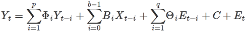

<html><head></head><body>
<h1 class="title topictitle1" id="ariaid-title1">VARMAX (ML Engine)</h1>

VARMAX (Vector Autoregressive Moving Average model with eXogenous variables) extends the ARMA/ARIMA model in two ways:

<ul class="ul" id="klg1507052716326__ul_nhg_5dl_p1b">
<li class="li">To work with time series with multiple response variables (vector time series).</li>
<li class="li">To work with exogenous variables, or variables that are independent of the other variables in the system.</li></ul>

The model includes both the dynamic relationship between the multiple response variables and the relationship between the dependent and independent variables.

<h2 class="title sectiontitle">Nonseasonal VARMAX Model</h2>

This formula represents a nonseasonal VARMAX model:

  </img>  

<table cellpadding="4" cellspacing="0" summary="" id="klg1507052716326__table_mqq_pj4_zdb" class="table" frame="border" border="1" rules="all">

<colgroup span="1"><col style="width:50%" span="1"></col><col style="width:50%" span="1"></col></colgroup><thead class="thead" style="text-align:left;"><tr class="row"><th class="entry cellrowborder" style="vertical-align:top;" id="d181074e56" rowspan="1" colspan="1">Variable</th><th class="entry cellrowborder" style="vertical-align:top;" id="d181074e58" rowspan="1" colspan="1">Description</th></tr></thead><tbody class="tbody"><tr class="row"><td class="entry cellrowborder" style="vertical-align:top;" headers="d181074e56" rowspan="1" colspan="1"><var class="keyword varname">Y</var><var class="keyword varname">t</var></td><td class="entry cellrowborder" style="vertical-align:top;" headers="d181074e58" rowspan="1" colspan="1">Time series made stationary. First term is autoregressive component, second term is exogenous component, third term is moving average component, the fourth term (<var class="keyword varname">C</var>) is vector of constants, and fifth term (<var class="keyword varname">E</var><var class="keyword varname">t</var>) is vector of residual errors.</td></tr><tr class="row"><td class="entry cellrowborder" style="vertical-align:top;" headers="d181074e56" rowspan="1" colspan="1"><var class="keyword varname">Y</var><var class="keyword varname">t</var></td><td class="entry cellrowborder" style="vertical-align:top;" headers="d181074e58" rowspan="1" colspan="1">Vector of <var class="keyword varname">n</var> response variables.</td></tr><tr class="row"><td class="entry cellrowborder" style="vertical-align:top;" headers="d181074e56" rowspan="1" colspan="1"><var class="keyword varname">X</var><var class="keyword varname">t</var></td><td class="entry cellrowborder" style="vertical-align:top;" headers="d181074e58" rowspan="1" colspan="1">Vector of <var class="keyword varname">m</var> exogenous variables.</td></tr><tr class="row"><td class="entry cellrowborder" style="vertical-align:top;" headers="d181074e56" rowspan="1" colspan="1"><var class="keyword varname">p</var></td><td class="entry cellrowborder" style="vertical-align:top;" headers="d181074e58" rowspan="1" colspan="1">Number of previous periods of endogenous variables included in model.</td></tr><tr class="row"><td class="entry cellrowborder" style="vertical-align:top;" headers="d181074e56" rowspan="1" colspan="1"><var class="keyword varname">q</var></td><td class="entry cellrowborder" style="vertical-align:top;" headers="d181074e58" rowspan="1" colspan="1">Number of previous periods included in moving average.</td></tr><tr class="row"><td class="entry cellrowborder" style="vertical-align:top;" headers="d181074e56" rowspan="1" colspan="1"><var class="keyword varname">b</var></td><td class="entry cellrowborder" style="vertical-align:top;" headers="d181074e58" rowspan="1" colspan="1">Number of previous periods of exogenous variables included.</td></tr><tr class="row"><td class="entry cellrowborder" style="vertical-align:top;" headers="d181074e56" rowspan="1" colspan="1">Φ<var class="keyword varname">i</var></td><td class="entry cellrowborder" style="vertical-align:top;" headers="d181074e58" rowspan="1" colspan="1"><var class="keyword varname">n</var> * <var class="keyword varname">n</var> matrix of autoregressive parameters.</td></tr><tr class="row"><td class="entry cellrowborder" style="vertical-align:top;" headers="d181074e56" rowspan="1" colspan="1"><var class="keyword varname">B</var><var class="keyword varname">i</var></td><td class="entry cellrowborder" style="vertical-align:top;" headers="d181074e58" rowspan="1" colspan="1"><var class="keyword varname">n</var> * <var class="keyword varname">m</var> matrix of exogenous variable parameters.</td></tr><tr class="row"><td class="entry cellrowborder" style="vertical-align:top;" headers="d181074e56" rowspan="1" colspan="1">Θ<var class="keyword varname">i</var></td><td class="entry cellrowborder" style="vertical-align:top;" headers="d181074e58" rowspan="1" colspan="1"><var class="keyword varname">n</var> * <var class="keyword varname">n</var> matrix of moving average parameters.</td></tr><tr class="row"><td class="entry cellrowborder" style="vertical-align:top;" headers="d181074e56" rowspan="1" colspan="1"><var class="keyword varname">E</var><var class="keyword varname">t</var></td><td class="entry cellrowborder" style="vertical-align:top;" headers="d181074e58" rowspan="1" colspan="1">Difference between actual and predicted value of <var class="keyword varname">Y</var><var class="keyword varname">t</var>, (<var class="keyword varname">Y</var><var class="keyword varname">t</var> - Ŷ<var class="keyword varname">t</var>).</td></tr></tbody></table>

<h2 class="title sectiontitle">Seasonal VARMAX Model</h2>

This formula represents a seasonal VARMAX model:

(1 - Φ1Back - … - Φ<var class="keyword varname">p</var>Back<var class="keyword varname">p</var>)(1 - Φ1Back<var class="keyword varname">m</var> - … - Φ<var class="keyword varname">sp</var>Back<var class="keyword varname">m*sp</var>)(1 - Back)<var class="keyword varname">d</var>(1 - Back<var class="keyword varname">m</var>)<var class="keyword varname">sd</var>(<var class="keyword varname">Y</var><var class="keyword varname">t</var>) =

<var class="keyword varname">C</var> + (1 + Θ1Back + … + Θ<var class="keyword varname">q</var>Back<var class="keyword varname">q</var>) (1 + Θ1Back<var class="keyword varname">m</var> + … + Θ<var class="keyword varname">sq</var>Back<var class="keyword varname">m*sq</var>) <var class="keyword varname">E</var><var class="keyword varname">t</var> + 

 (<var class="keyword varname">B</var>1 + <var class="keyword varname">B</var>2Back + … + <var class="keyword varname">B</var><var class="keyword varname">b</var>-1Back<var class="keyword varname">b</var>) (1 - Back)<var class="keyword varname">d</var> (1 - Back<var class="keyword varname">m</var>)<var class="keyword varname">sd</var><var class="keyword varname">X</var><var class="keyword varname">t</var>

Variables are as in the nonseasonal VARMAX Model and the following table.

<table cellpadding="4" cellspacing="0" summary="" id="klg1507052716326__table_tpx_kl4_zdb" class="table" frame="border" border="1" rules="all">

<colgroup span="1"><col style="width:50%" span="1"></col><col style="width:50%" span="1"></col></colgroup><thead class="thead" style="text-align:left;"><tr class="row"><th class="entry cellrowborder" style="vertical-align:top;" id="d181074e326" rowspan="1" colspan="1">Variable</th><th class="entry cellrowborder" style="vertical-align:top;" id="d181074e328" rowspan="1" colspan="1">Description</th></tr></thead><tbody class="tbody"><tr class="row"><td class="entry cellrowborder" style="vertical-align:top;" headers="d181074e326" rowspan="1" colspan="1">Back</td><td class="entry cellrowborder" style="vertical-align:top;" headers="d181074e328" rowspan="1" colspan="1">Back-shift operator, that is:

 Back(<var class="keyword varname">y</var><var class="keyword varname">t</var>) = <var class="keyword varname">y</var><var class="keyword varname">t</var>-1
</td></tr><tr class="row"><td class="entry cellrowborder" style="vertical-align:top;" headers="d181074e326" rowspan="1" colspan="1"><var class="keyword varname">m</var></td><td class="entry cellrowborder" style="vertical-align:top;" headers="d181074e328" rowspan="1" colspan="1">Number of periods in each season.</td></tr><tr class="row"><td class="entry cellrowborder" style="vertical-align:top;" headers="d181074e326" rowspan="1" colspan="1"><var class="keyword varname">d</var></td><td class="entry cellrowborder" style="vertical-align:top;" headers="d181074e328" rowspan="1" colspan="1">Number of differencing steps performed to stationarize time series.</td></tr><tr class="row"><td class="entry cellrowborder" style="vertical-align:top;" headers="d181074e326" rowspan="1" colspan="1"><var class="keyword varname">sp</var></td><td class="entry cellrowborder" style="vertical-align:top;" headers="d181074e328" rowspan="1" colspan="1">Seasonal parameter corresponding to <var class="keyword varname">p</var>.</td></tr><tr class="row"><td class="entry cellrowborder" style="vertical-align:top;" headers="d181074e326" rowspan="1" colspan="1"><var class="keyword varname">sq</var></td><td class="entry cellrowborder" style="vertical-align:top;" headers="d181074e328" rowspan="1" colspan="1">Seasonal parameter corresponding to <var class="keyword varname">q</var>.</td></tr><tr class="row"><td class="entry cellrowborder" style="vertical-align:top;" headers="d181074e326" rowspan="1" colspan="1"><var class="keyword varname">sd</var></td><td class="entry cellrowborder" style="vertical-align:top;" headers="d181074e328" rowspan="1" colspan="1">Seasonal parameter corresponding to <var class="keyword varname">d</var>.</td></tr></tbody></table>

<h2 class="title sectiontitle">Difference between VARMAX and R Function VARMA</h2>

The results of the VARMAX function and the VARMA function in the R package MTS might not match exactly, because VARMA applies a boundary to the numerical optimization and VARMAX does not. Also, the default optimization method (the Method syntax element) is different for VARMA and VARMAX.

<h2 class="title topictitle2" id="ariaid-title2">VARMAX Syntax</h2>

<h3 class="title sectiontitle">Version 1.11</h3><pre class="pre codeblock" xml:space="preserve"><code>SELECT * FROM VARMAX (
  ON <var class="keyword varname">input_table</var> [ AS InputTable ]
    PARTITION BY { 1 | <var class="keyword varname">partition_column</var> [,...] } ORDER BY <var class="keyword varname">time_stamp_column</var> [,...]
  { ON <var class="keyword varname">orders_table</var> AS Orders PARTITION BY { 1 | <var class="keyword varname">partition_column</var> [,...] } |
    OrderP (<var class="keyword varname">p</var>) OrderD (<var class="keyword varname">d</var>) OrderQ (<var class="keyword varname">q</var>) |
    PDQ ('<var class="keyword varname">p</var>, <var class="keyword varname">d</var>, <var class="keyword varname">q</var>')
  }
  USING
  TargetColumns ('<var class="keyword varname">target_column</var>' [,...])
  [ ExogenousColumns ('<var class="keyword varname">exogenous_column</var>' [,...]) ]
  [ PartitionColumns ('<var class="keyword varname">partition_column</var>' [,...]) ]
  [ { SeasonalOrderP (<var class="keyword varname">sp</var>) SeasonalOrderD (<var class="keyword varname">sd</var>) SeasonalOrderQ (<var class="keyword varname">sq</var>) |
      SeasonalPDQ ('<var class="keyword varname">sp</var>, <var class="keyword varname">sd</var>, <var class="keyword varname">sq</var>')
    } Period (<var class="keyword varname">period</var>)
  ]
  [ ExogenousOrder ('<var class="keyword varname">b</var>') ]
  [ Lag (<var class="keyword varname">lag</var>) ]
  [ IncludeMean (<b>{'true'|'t'|'yes'|'y'|'1'|'false'|'f'|'no'|'n'|'0'}</b>) ]
  [ IncludeDrift (<b>{'true'|'t'|'yes'|'y'|'1'|'false'|'f'|'no'|'n'|'0'}</b>)]
  [ MaxIterNum (<var class="keyword varname">max_iteration_number</var>) ]
  [ StepAhead (<var class="keyword varname">predict_steps</var>) ]
  [ FitMethod ({ 'SSE' | 'ML' }) ]
) AS <var class="keyword varname">alias</var>;</code></pre>

<h2 class="title topictitle2" id="ariaid-title3">VARMAX Syntax Elements</h2>

<dl class="dl parml"><dt class="dt pt dlterm">TargetColumns</dt><dd class="dd pd">Specify the InputTable columns containing the response data. Null values are allowed at the end of the series. If you specify StepAhead, the function reports predicted values for the missing values, using values from the predictor columns for those time periods.</dd><dt class="dt pt dlterm">ExogenousColumns</dt><dd class="dd pd">[Optional] Specify the InputTable columns containing the exogenous (independent) predictors.</dd><dd class="dd pd ddexpand">Default behavior: The function calculates the model without exogenous vectors.</dd><dt class="dt pt dlterm">PartitionColumns</dt><dd class="dd pd">[Optional] Specify the InputTable partition columns to pass to the output.</dd><dt class="dt pt dlterm">OrderP</dt><dd class="dd pd">[Required if you omit Orders table and PDQ, disallowed otherwise.] Specify the value of the nonseasonal parameter <var class="keyword varname">p</var> for the VARMAX model, an INTEGER in the range [0, 10].</dd><dt class="dt pt dlterm">OrderD</dt><dd class="dd pd">[Required if you omit Orders table and PDQ, disallowed otherwise.] Specify the value of the nonseasonal parameter <var class="keyword varname">d</var> for the VARMAX model, the INTEGER 0 or 1.</dd><dt class="dt pt dlterm">OrderQ</dt><dd class="dd pd">[Required if you omit Orders table and PDQ, disallowed otherwise.] Specify the value of the nonseasonal parameter <var class="keyword varname">q</var> for the VARMAX model, an INTEGER in the range [0, 10].</dd><dt class="dt pt dlterm">PDQ</dt><dd class="dd pd">[Required if you omit Orders table and OrderP, OrderD, and OrderQ; disallowed otherwise.] Specify the parameters <var class="keyword varname">p</var>, <var class="keyword varname">d</var>, and <var class="keyword varname">q</var> for the VARMA part of the model. These values must be in the ranges for OrderP, OrderD, and OrderQ, respectively.</dd><dt class="dt pt dlterm">SeasonalOrderP</dt><dd class="dd pd">[Optional if you omit Orders table and SeasonalPDQ, disallowed otherwise.] Specify the value of the seasonal parameter <var class="keyword varname">sp</var> for the VARMAX model, an INTEGER in the range [0, 10].</dd><dt class="dt pt dlterm">SeasonalOrderD</dt><dd class="dd pd">[Optional if you omit Orders table and SeasonalPDQ, disallowed otherwise.] Specify the value of the seasonal parameter <var class="keyword varname">sd</var> for the VARMAX model, an INTEGER in the range [0, 3].</dd><dt class="dt pt dlterm">SeasonalOrderQ</dt><dd class="dd pd">[Optional if you omit Orders table and SeasonalPDQ, disallowed otherwise.] Specify the value of the seasonal parameter <var class="keyword varname">sq</var> for the VARMAX model, an INTEGER in the range [0, 10].</dd><dt class="dt pt dlterm">SeasonalPDQ</dt><dd class="dd pd">[Optional if you omit Orders table and SeasonalOrderP, SeasonalOrderD, and SeasonalOrderQ; disallowed otherwise.] Specify seasonal parameters <var class="keyword varname">sp</var>, <var class="keyword varname">sd</var>, and <var class="keyword varname">sq</var> for the VARMA part of the model. These values must be in the ranges for SeasonalOrderP, SeasonalOrderD, and SeasonalOrderQ, respectively.</dd><dd class="dd pd ddexpand">If you specify this syntax element, you must also specify the Period syntax element.</dd><dd class="dd pd ddexpand">Default behavior: The function treats the model as nonseasonal.</dd><dt class="dt pt dlterm">Period</dt><dd class="dd pd">[Required if you specify SeasonalPDQ or SeasonalOrderP, SeasonalOrderD, and SeasonalOrderQ; disallowed otherwise.] Specify the period of each season. The <var class="keyword varname">period</var> must be a positive INTEGER value.</dd><dd class="dd pd ddexpand">Default behavior: The function treats the model as nonseasonal.</dd><dt class="dt pt dlterm">ExogenousOrder</dt><dd class="dd pd">[Optional] Specify the order of the exogenous variables. If the current time is <var class="keyword varname">t</var> and ExogenousOrder is <var class="keyword varname">b</var>, the following values of the exogenous time series are used in calculating the response: X<var class="keyword varname">t</var> X<var class="keyword varname">t</var>-1 ... X<var class="keyword varname">t</var>-<var class="keyword varname">b</var>+1.</dd><dd class="dd pd ddexpand">Default behavior: The function calculates the model without exogenous vectors.</dd><dt class="dt pt dlterm">Lag</dt><dd class="dd pd">[Optional] Specify the lag in the effect of the exogenous variables on the response variables. For example, if <var class="keyword varname">lag</var> is 3, and ExogenousOrder is <var class="keyword varname">b</var>, the prediction Y<var class="keyword varname">i</var> is based on X<var class="keyword varname">i</var>-3 to X<var class="keyword varname">i</var>-<var class="keyword varname">b</var>-2.</dd><dd class="dd pd ddexpand">Default: 0</dd><dt class="dt pt dlterm">IncludeMean</dt><dd class="dd pd">[Optional if you omit Orders table, disallowed otherwise.] Specify whether to add the mean vector of the response series in the VARMAX model.</dd><dd class="dd pd ddexpand">If this syntax element is 'true', the values of the difference parameters <var class="keyword varname">d</var> (in the PDQ syntax element) and <var class="keyword varname">sd</var> (in the SeasonalPDQ syntax element) must be 0.</dd><dd class="dd pd ddexpand">Default: 'false'</dd><dt class="dt pt dlterm">IncludeDrift</dt><dd class="dd pd">[Optional if you omit Orders table, disallowed otherwise.] Specify whether to add the drift term of the response series in the VARMAX model. The drift term applies only when <var class="keyword varname">d</var> is 1.</dd><dd class="dd pd ddexpand">IncludeDrift and IncludeMean cannot both be true. If either the syntax elements or order table specifies true for both IncludeDrift and IncludeMean, the function issues an error message.</dd><dd class="dd pd ddexpand">Default: 'false'</dd><dt class="dt pt dlterm">MaxIterNum</dt><dd class="dd pd">[Optional] Specify the maximum number of iterations performed. The <var class="keyword varname">max_iteration_number</var> must be a positive INTEGER value.</dd><dd class="dd pd ddexpand">Default: 100</dd><dt class="dt pt dlterm">StepAhead</dt><dd class="dd pd">[Optional] Specify the number of steps to forecast after the end of the time series. The <var class="keyword varname">predict_steps</var> must be a positive INTEGER value.</dd><dd class="dd pd ddexpand">Default behavior: The function calculates no forecast values.</dd><dt class="dt pt dlterm">FitMethod</dt><dd class="dd pd">[Optional] Specify the method for fitting the model parameters:

<table cellpadding="4" cellspacing="0" summary="" id="arw1507054267366__table_jwp_kly_fdb" class="table" frame="border" border="1" rules="all">

<colgroup span="1"><col style="width:50%" span="1"></col><col style="width:50%" span="1"></col></colgroup><thead class="thead" style="text-align:left;"><tr class="row"><th class="entry cellrowborder" style="vertical-align:top;" id="d181074e750" rowspan="1" colspan="1">Option</th><th class="entry cellrowborder" style="vertical-align:top;" id="d181074e752" rowspan="1" colspan="1">Description</th></tr></thead><tbody class="tbody"><tr class="row"><td class="entry cellrowborder" style="vertical-align:top;" headers="d181074e750" rowspan="1" colspan="1"><code class="ph codeph">'SSE'</code> (Default)</td><td class="entry cellrowborder" style="vertical-align:top;" headers="d181074e752" rowspan="1" colspan="1">Sum of squared error.</td></tr><tr class="row"><td class="entry cellrowborder" style="vertical-align:top;" headers="d181074e750" rowspan="1" colspan="1"><code class="ph codeph">'ML'</code></td><td class="entry cellrowborder" style="vertical-align:top;" headers="d181074e752" rowspan="1" colspan="1">Maximum likelihood. This method is more accurate, but slower to calculate.</td></tr></tbody></table>
</dd></dl>

<h2 class="title topictitle2" id="ariaid-title4">VARMAX Input</h2>

<table cellpadding="4" cellspacing="0" summary="" id="kny1507054403896__table_kht_qzs_wcb" class="table" frame="border" border="1" rules="all">

<colgroup span="1"><col style="width:50%" span="1"></col><col style="width:50%" span="1"></col></colgroup><thead class="thead" style="text-align:left;"><tr class="row"><th class="entry cellrowborder" style="vertical-align:top;" id="d181074e787" rowspan="1" colspan="1">Table</th><th class="entry cellrowborder" style="vertical-align:top;" id="d181074e789" rowspan="1" colspan="1">Description</th></tr></thead><tbody class="tbody"><tr class="row"><td class="entry cellrowborder" style="vertical-align:top;" headers="d181074e787" rowspan="1" colspan="1">InputTable</td><td class="entry cellrowborder" style="vertical-align:top;" headers="d181074e789" rowspan="1" colspan="1">The alias, InputTable, is required only if you specify the optional Orders table.</td></tr><tr class="row"><td class="entry cellrowborder" style="vertical-align:top;" headers="d181074e787" rowspan="1" colspan="1">Orders</td><td class="entry cellrowborder" style="vertical-align:top;" headers="d181074e789" rowspan="1" colspan="1">[Optional] <a href="srq1558463209300.md#qex1507227073634">TimeSeriesOrders Output</a> table. If omitted, you must specify the PDQ syntax element.</td></tr></tbody></table>

<h3 class="title sectiontitle">InputTable Schema</h3>
<table cellpadding="4" cellspacing="0" summary="" id="kny1507054403896__table_N1000E_N1000C_N10001" class="table" frame="border" border="1" rules="all">

<colgroup span="1"><col style="width:26.31578947368421%" span="1"></col><col style="width:17.543859649122805%" span="1"></col><col style="width:56.14035087719298%" span="1"></col></colgroup><thead class="thead" style="text-align:left;"><tr class="row"><th class="entry nocellnorowborder" style="vertical-align:top;" id="d181074e816" rowspan="1" colspan="1">Column</th><th class="entry nocellnorowborder" style="vertical-align:top;" id="d181074e818" rowspan="1" colspan="1">Data Type</th><th class="entry cell-norowborder" style="vertical-align:top;" id="d181074e820" rowspan="1" colspan="1">Description</th></tr></thead><tbody class="tbody"><tr class="row"><td class="entry nocellnorowborder" style="vertical-align:top;" headers="d181074e816" rowspan="1" colspan="1"><var class="keyword varname">timestamp_column</var></td><td class="entry nocellnorowborder" style="vertical-align:top;" headers="d181074e818" rowspan="1" colspan="1">Any</td><td class="entry cell-norowborder" style="vertical-align:top;" headers="d181074e820" rowspan="1" colspan="1">[Column appears once for each specified <var class="keyword varname">timestamp_column</var>.] Sequence (time points) of input value.

If time points do not have uniform intervals, run <a href="ksn1554470945504.md#vns1506529598207">Interpolator (ML Engine)</a> function on them before running VARMAX function on input table.
</td></tr><tr class="row"><td class="entry nocellnorowborder" style="vertical-align:top;" headers="d181074e816" rowspan="1" colspan="1"><var class="keyword varname">partition_column</var></td><td class="entry nocellnorowborder" style="vertical-align:top;" headers="d181074e818" rowspan="1" colspan="1">Any</td><td class="entry cell-norowborder" style="vertical-align:top;" headers="d181074e820" rowspan="1" colspan="1">[Column appears once for each specified <var class="keyword varname">partition_column</var>.] Column by which input data is partitioned.</td></tr><tr class="row"><td class="entry nocellnorowborder" style="vertical-align:top;" headers="d181074e816" rowspan="1" colspan="1"><var class="keyword varname">target_column</var></td><td class="entry nocellnorowborder" style="vertical-align:top;" headers="d181074e818" rowspan="1" colspan="1">Any numeric SQL data type</td><td class="entry cell-norowborder" style="vertical-align:top;" headers="d181074e820" rowspan="1" colspan="1">[Column appears once for each specified <var class="keyword varname">target_column</var>.] Value of response variable.</td></tr><tr class="row"><td class="entry row-nocellborder" style="vertical-align:top;" headers="d181074e816" rowspan="1" colspan="1"><var class="keyword varname">exogenous_column</var></td><td class="entry row-nocellborder" style="vertical-align:top;" headers="d181074e818" rowspan="1" colspan="1">Any numeric SQL data type</td><td class="entry cellrowborder" style="vertical-align:top;" headers="d181074e820" rowspan="1" colspan="1">[Column appears once for each specified <var class="keyword varname">exogenous_column</var>.] Value of exogenous variable.</td></tr></tbody></table>

Each input time series must:
<ul class="ul" id="kny1507054403896__ul_bcx_mfs_51b">
<li class="li">Be an ordered sequence in a partition with uniform time intervals</li>
<li class="li">Fit into memory</li>
<li class="li">Not include NULL or numeric values, except as noted in the description of the ResponseColumns syntax element</li></ul>

<h2 class="title topictitle2" id="ariaid-title5">VARMAX Output</h2>

The VARMAX function outputs a model for each partition in the InputTable.

<h3 class="title sectiontitle">Output Schema</h3>
<table cellpadding="4" cellspacing="0" summary="" id="bsp1507054465250__table_N10014_N1000E_N1000C_N10001" class="table" frame="border" border="1" rules="all">

<colgroup span="1"><col style="width:26.31578947368421%" span="1"></col><col style="width:17.543859649122805%" span="1"></col><col style="width:56.14035087719298%" span="1"></col></colgroup><thead class="thead" style="text-align:left;"><tr class="row"><th class="entry nocellnorowborder" style="vertical-align:top;" id="d181074e912" rowspan="1" colspan="1">Column</th><th class="entry nocellnorowborder" style="vertical-align:top;" id="d181074e914" rowspan="1" colspan="1">Data Type</th><th class="entry cell-norowborder" style="vertical-align:top;" id="d181074e916" rowspan="1" colspan="1">Description</th></tr></thead><tbody class="tbody"><tr class="row"><td class="entry nocellnorowborder" style="vertical-align:top;" headers="d181074e912" rowspan="1" colspan="1"><var class="keyword varname">partition_column</var></td><td class="entry nocellnorowborder" style="vertical-align:top;" headers="d181074e914" rowspan="1" colspan="1">Same as in InputTable</td><td class="entry cell-norowborder" style="vertical-align:top;" headers="d181074e916" rowspan="1" colspan="1">Identifier of <var class="keyword varname">partition_column</var> from InputTable.</td></tr><tr class="row"><td class="entry nocellnorowborder" style="vertical-align:top;" headers="d181074e912" rowspan="1" colspan="1">coef</td><td class="entry nocellnorowborder" style="vertical-align:top;" headers="d181074e914" rowspan="1" colspan="1">VARCHAR</td><td class="entry cell-norowborder" style="vertical-align:top;" headers="d181074e916" rowspan="1" colspan="1">Value from following table.</td></tr><tr class="row"><td class="entry nocellnorowborder" style="vertical-align:top;" headers="d181074e912" rowspan="1" colspan="1">coef_value</td><td class="entry nocellnorowborder" style="vertical-align:top;" headers="d181074e914" rowspan="1" colspan="1">VARCHAR</td><td class="entry cell-norowborder" style="vertical-align:top;" headers="d181074e916" rowspan="1" colspan="1">Value explanation from following table.</td></tr><tr class="row"><td class="entry nocellnorowborder" style="vertical-align:top;" headers="d181074e912" rowspan="1" colspan="1">stepahead</td><td class="entry nocellnorowborder" style="vertical-align:top;" headers="d181074e914" rowspan="1" colspan="1">Integer</td><td class="entry cell-norowborder" style="vertical-align:top;" headers="d181074e916" rowspan="1" colspan="1">[Appears only if StepAhead syntax element has positive value.] Identifier of future period. For example, for StepAhead (3), this column contains 1, 2, and 3 (in separate rows) to indicate the future period for which a predicted value appears in the next column.</td></tr><tr class="row"><td class="entry row-nocellborder" style="vertical-align:top;" headers="d181074e912" rowspan="1" colspan="1">predict_columnname</td><td class="entry row-nocellborder" style="vertical-align:top;" headers="d181074e914" rowspan="1" colspan="1">Double</td><td class="entry cellrowborder" style="vertical-align:top;" headers="d181074e916" rowspan="1" colspan="1">[Appears only if StepAhead syntax element has positive value.] [Column appears once for each specified <var class="keyword varname">response_column</var>.] Predicted future values of response variable.</td></tr></tbody></table>

<h3 class="title sectiontitle">Model Coefficients</h3>
<table cellpadding="4" cellspacing="0" summary="" id="bsp1507054465250__table_N10087_N1000E_N1000C_N10001" class="table" frame="border" border="1" rules="all">

<colgroup span="1"><col style="width:25%" span="1"></col><col style="width:75%" span="1"></col></colgroup><thead class="thead" style="text-align:left;"><tr class="row"><th class="entry nocellnorowborder" style="vertical-align:top;" id="d181074e970" rowspan="1" colspan="1">coef</th><th class="entry cell-norowborder" style="vertical-align:top;" id="d181074e972" rowspan="1" colspan="1">coef_value</th></tr></thead><tbody class="tbody"><tr class="row"><td class="entry nocellnorowborder" style="vertical-align:top;" headers="d181074e970" rowspan="1" colspan="1">coef</td><td class="entry cell-norowborder" style="vertical-align:top;" headers="d181074e972" rowspan="1" colspan="1">Vector [<var class="keyword varname">p</var>, <var class="keyword varname">d</var>, <var class="keyword varname">q</var>, <var class="keyword varname">sp</var>, <var class="keyword varname">sd</var>, <var class="keyword varname">sq</var>, <var class="keyword varname">b</var>].</td></tr><tr class="row"><td class="entry nocellnorowborder" style="vertical-align:top;" headers="d181074e970" rowspan="1" colspan="1">ar_params</td><td class="entry cell-norowborder" style="vertical-align:top;" headers="d181074e972" rowspan="1" colspan="1">Matrixes Φi, as vector of <var class="keyword varname">p</var> matrixes, each of which is an <var class="keyword varname">n</var> *<var class="keyword varname">n</var> matrix. <var class="keyword varname">p</var> is from coef vector and <var class="keyword varname">n</var> is number of response variables specified in ResponseColumns syntax element.</td></tr><tr class="row"><td class="entry nocellnorowborder" style="vertical-align:top;" headers="d181074e970" rowspan="1" colspan="1">ma_params</td><td class="entry cell-norowborder" style="vertical-align:top;" headers="d181074e972" rowspan="1" colspan="1">Matrixes Φi, as vector of <var class="keyword varname">q</var> matrixes, each of which is an <var class="keyword varname">n</var> *<var class="keyword varname">n</var> matrix. <var class="keyword varname">q</var> is from coef vector and <var class="keyword varname">n</var> is number of response variables specified in ResponseColumns syntax element.</td></tr><tr class="row"><td class="entry nocellnorowborder" style="vertical-align:top;" headers="d181074e970" rowspan="1" colspan="1">exogenous_params</td><td class="entry cell-norowborder" style="vertical-align:top;" headers="d181074e972" rowspan="1" colspan="1">Matrixes <var class="keyword varname">B</var><var class="keyword varname">i</var>, shown as a vector of <var class="keyword varname">b</var> matrixes, each of which is an <var class="keyword varname">n</var> *<var class="keyword varname">m</var> matrix. <var class="keyword varname">b</var> is from coef vector, <var class="keyword varname">n</var> is number of response variables specified in ResponseColumns syntax element, and <var class="keyword varname">m</var> is number of exogenous variables specified in ExogenousColumns syntax element.</td></tr><tr class="row"><td class="entry nocellnorowborder" style="vertical-align:top;" headers="d181074e970" rowspan="1" colspan="1">seasonal_ar_params</td><td class="entry cell-norowborder" style="vertical-align:top;" headers="d181074e972" rowspan="1" colspan="1">Matrix Φsi for seasonal parameters.</td></tr><tr class="row"><td class="entry nocellnorowborder" style="vertical-align:top;" headers="d181074e970" rowspan="1" colspan="1">seasonal_ma_params</td><td class="entry cell-norowborder" style="vertical-align:top;" headers="d181074e972" rowspan="1" colspan="1">Matrix Φsi for seasonal parameters.</td></tr><tr class="row"><td class="entry nocellnorowborder" style="vertical-align:top;" headers="d181074e970" rowspan="1" colspan="1">mean_param</td><td class="entry cell-norowborder" style="vertical-align:top;" headers="d181074e972" rowspan="1" colspan="1">[Appears only with IncludeMean ('true').] Mean vector of response series.</td></tr><tr class="row"><td class="entry nocellnorowborder" style="vertical-align:top;" headers="d181074e970" rowspan="1" colspan="1">period</td><td class="entry cell-norowborder" style="vertical-align:top;" headers="d181074e972" rowspan="1" colspan="1">Cycle period for seasonal models (0 for nonseasonal models).</td></tr><tr class="row"><td class="entry nocellnorowborder" style="vertical-align:top;" headers="d181074e970" rowspan="1" colspan="1">lag</td><td class="entry cell-norowborder" style="vertical-align:top;" headers="d181074e972" rowspan="1" colspan="1">Lag value specified in function call.</td></tr><tr class="row"><td class="entry nocellnorowborder" style="vertical-align:top;" headers="d181074e970" rowspan="1" colspan="1">sigma</td><td class="entry cell-norowborder" style="vertical-align:top;" headers="d181074e972" rowspan="1" colspan="1">The variance matrix.</td></tr><tr class="row"><td class="entry nocellnorowborder" style="vertical-align:top;" headers="d181074e970" rowspan="1" colspan="1">aic</td><td class="entry cell-norowborder" style="vertical-align:top;" headers="d181074e972" rowspan="1" colspan="1">Akaike information criterion.</td></tr><tr class="row"><td class="entry nocellnorowborder" style="vertical-align:top;" headers="d181074e970" rowspan="1" colspan="1">bic</td><td class="entry cell-norowborder" style="vertical-align:top;" headers="d181074e972" rowspan="1" colspan="1">Bayesian information criterion.</td></tr><tr class="row"><td class="entry nocellnorowborder" style="vertical-align:top;" headers="d181074e970" rowspan="1" colspan="1">iterations</td><td class="entry cell-norowborder" style="vertical-align:top;" headers="d181074e972" rowspan="1" colspan="1">Number of iterations performed.</td></tr><tr class="row"><td class="entry row-nocellborder" style="vertical-align:top;" headers="d181074e970" rowspan="1" colspan="1">converged</td><td class="entry cellrowborder" style="vertical-align:top;" headers="d181074e972" rowspan="1" colspan="1">Whether algorithm converged.</td></tr></tbody></table>

<h2 class="title topictitle2" id="ariaid-title6">VARMAX Examples</h2>

<h3 class="title topictitle3" id="ariaid-title7">VARMAX Example: No Exogenous Model</h3>

<h4 class="title sectiontitle">Input</h4>

The input table, finance_data3, has seasonally adjusted quarterly financial
        data from West Germany between 1960 and 1982, in billions of Deutsche Marks. The table has
        three time series—consumer expenditures, disposable income, and fixed investmen—partitioned
        by the column id, which indicates the decade.

<table cellpadding="4" cellspacing="0" summary="" id="dql1507054600545__table_fxm_dby_m2b" class="table" frame="border" border="1" rules="all">
finance_data3
<colgroup span="1"><col style="width:16.666666666666664%" span="1"></col><col style="width:16.666666666666664%" span="1"></col><col style="width:16.666666666666664%" span="1"></col><col style="width:16.666666666666664%" span="1"></col><col style="width:16.666666666666664%" span="1"></col><col style="width:16.666666666666664%" span="1"></col></colgroup><thead class="thead" style="text-align:left;"><tr class="row"><th class="entry cellrowborder" style="vertical-align:top;" id="d181074e1197" rowspan="1" colspan="1">id</th><th class="entry cellrowborder" style="vertical-align:top;" id="d181074e1200" rowspan="1" colspan="1">period</th><th class="entry cellrowborder" style="vertical-align:top;" id="d181074e1203" rowspan="1" colspan="1">expenditure</th><th class="entry cellrowborder" style="vertical-align:top;" id="d181074e1206" rowspan="1" colspan="1">income</th><th class="entry cellrowborder" style="vertical-align:top;" id="d181074e1209" rowspan="1" colspan="1">id</th><th class="entry cellrowborder" style="vertical-align:top;" id="d181074e1213" rowspan="1" colspan="1">investment</th></tr></thead><tbody class="tbody"><tr class="row"><td class="entry cellrowborder" style="vertical-align:top;" headers="d181074e1197" rowspan="1" colspan="1">1</td><td class="entry cellrowborder" style="vertical-align:top;" headers="d181074e1200" rowspan="1" colspan="1">1960Q1</td><td class="entry cellrowborder" style="vertical-align:top;" headers="d181074e1203" rowspan="1" colspan="1">415</td><td class="entry cellrowborder" style="vertical-align:top;" headers="d181074e1206" rowspan="1" colspan="1">451</td><td class="entry cellrowborder" style="vertical-align:top;" headers="d181074e1209" rowspan="1" colspan="1">1</td><td class="entry cellrowborder" style="vertical-align:top;" headers="d181074e1213" rowspan="1" colspan="1">180</td></tr><tr class="row"><td class="entry cellrowborder" style="vertical-align:top;" headers="d181074e1197" rowspan="1" colspan="1">1</td><td class="entry cellrowborder" style="vertical-align:top;" headers="d181074e1200" rowspan="1" colspan="1">1960Q2</td><td class="entry cellrowborder" style="vertical-align:top;" headers="d181074e1203" rowspan="1" colspan="1">421</td><td class="entry cellrowborder" style="vertical-align:top;" headers="d181074e1206" rowspan="1" colspan="1">465</td><td class="entry cellrowborder" style="vertical-align:top;" headers="d181074e1209" rowspan="1" colspan="1">1</td><td class="entry cellrowborder" style="vertical-align:top;" headers="d181074e1213" rowspan="1" colspan="1">179</td></tr><tr class="row"><td class="entry cellrowborder" style="vertical-align:top;" headers="d181074e1197" rowspan="1" colspan="1">1</td><td class="entry cellrowborder" style="vertical-align:top;" headers="d181074e1200" rowspan="1" colspan="1">1960Q3</td><td class="entry cellrowborder" style="vertical-align:top;" headers="d181074e1203" rowspan="1" colspan="1">434</td><td class="entry cellrowborder" style="vertical-align:top;" headers="d181074e1206" rowspan="1" colspan="1">485</td><td class="entry cellrowborder" style="vertical-align:top;" headers="d181074e1209" rowspan="1" colspan="1">1</td><td class="entry cellrowborder" style="vertical-align:top;" headers="d181074e1213" rowspan="1" colspan="1">185</td></tr><tr class="row"><td class="entry cellrowborder" style="vertical-align:top;" headers="d181074e1197" rowspan="1" colspan="1">1</td><td class="entry cellrowborder" style="vertical-align:top;" headers="d181074e1200" rowspan="1" colspan="1">1960Q4</td><td class="entry cellrowborder" style="vertical-align:top;" headers="d181074e1203" rowspan="1" colspan="1">448</td><td class="entry cellrowborder" style="vertical-align:top;" headers="d181074e1206" rowspan="1" colspan="1">493</td><td class="entry cellrowborder" style="vertical-align:top;" headers="d181074e1209" rowspan="1" colspan="1">1</td><td class="entry cellrowborder" style="vertical-align:top;" headers="d181074e1213" rowspan="1" colspan="1">192</td></tr><tr class="row"><td class="entry cellrowborder" style="vertical-align:top;" headers="d181074e1197" rowspan="1" colspan="1">1</td><td class="entry cellrowborder" style="vertical-align:top;" headers="d181074e1200" rowspan="1" colspan="1">1961Q1</td><td class="entry cellrowborder" style="vertical-align:top;" headers="d181074e1203" rowspan="1" colspan="1">459</td><td class="entry cellrowborder" style="vertical-align:top;" headers="d181074e1206" rowspan="1" colspan="1">509</td><td class="entry cellrowborder" style="vertical-align:top;" headers="d181074e1209" rowspan="1" colspan="1">1</td><td class="entry cellrowborder" style="vertical-align:top;" headers="d181074e1213" rowspan="1" colspan="1">211</td></tr><tr class="row"><td class="entry cellrowborder" style="vertical-align:top;" headers="d181074e1197" rowspan="1" colspan="1">1</td><td class="entry cellrowborder" style="vertical-align:top;" headers="d181074e1200" rowspan="1" colspan="1">1961Q2</td><td class="entry cellrowborder" style="vertical-align:top;" headers="d181074e1203" rowspan="1" colspan="1">458</td><td class="entry cellrowborder" style="vertical-align:top;" headers="d181074e1206" rowspan="1" colspan="1">520</td><td class="entry cellrowborder" style="vertical-align:top;" headers="d181074e1209" rowspan="1" colspan="1">1</td><td class="entry cellrowborder" style="vertical-align:top;" headers="d181074e1213" rowspan="1" colspan="1">202</td></tr><tr class="row"><td class="entry cellrowborder" style="vertical-align:top;" headers="d181074e1197" rowspan="1" colspan="1">1</td><td class="entry cellrowborder" style="vertical-align:top;" headers="d181074e1200" rowspan="1" colspan="1">1961Q3</td><td class="entry cellrowborder" style="vertical-align:top;" headers="d181074e1203" rowspan="1" colspan="1">479</td><td class="entry cellrowborder" style="vertical-align:top;" headers="d181074e1206" rowspan="1" colspan="1">521</td><td class="entry cellrowborder" style="vertical-align:top;" headers="d181074e1209" rowspan="1" colspan="1">1</td><td class="entry cellrowborder" style="vertical-align:top;" headers="d181074e1213" rowspan="1" colspan="1">207</td></tr><tr class="row"><td class="entry cellrowborder" style="vertical-align:top;" headers="d181074e1197" rowspan="1" colspan="1">1</td><td class="entry cellrowborder" style="vertical-align:top;" headers="d181074e1200" rowspan="1" colspan="1">1961Q4</td><td class="entry cellrowborder" style="vertical-align:top;" headers="d181074e1203" rowspan="1" colspan="1">487</td><td class="entry cellrowborder" style="vertical-align:top;" headers="d181074e1206" rowspan="1" colspan="1">540</td><td class="entry cellrowborder" style="vertical-align:top;" headers="d181074e1209" rowspan="1" colspan="1">1</td><td class="entry cellrowborder" style="vertical-align:top;" headers="d181074e1213" rowspan="1" colspan="1">214</td></tr><tr class="row"><td class="entry cellrowborder" style="vertical-align:top;" headers="d181074e1197" rowspan="1" colspan="1">1</td><td class="entry cellrowborder" style="vertical-align:top;" headers="d181074e1200" rowspan="1" colspan="1">1962Q1</td><td class="entry cellrowborder" style="vertical-align:top;" headers="d181074e1203" rowspan="1" colspan="1">497</td><td class="entry cellrowborder" style="vertical-align:top;" headers="d181074e1206" rowspan="1" colspan="1">548</td><td class="entry cellrowborder" style="vertical-align:top;" headers="d181074e1209" rowspan="1" colspan="1">1</td><td class="entry cellrowborder" style="vertical-align:top;" headers="d181074e1213" rowspan="1" colspan="1">231</td></tr><tr class="row"><td class="entry cellrowborder" style="vertical-align:top;" headers="d181074e1197" rowspan="1" colspan="1">1</td><td class="entry cellrowborder" style="vertical-align:top;" headers="d181074e1200" rowspan="1" colspan="1">1962Q2</td><td class="entry cellrowborder" style="vertical-align:top;" headers="d181074e1203" rowspan="1" colspan="1">510</td><td class="entry cellrowborder" style="vertical-align:top;" headers="d181074e1206" rowspan="1" colspan="1">558</td><td class="entry cellrowborder" style="vertical-align:top;" headers="d181074e1209" rowspan="1" colspan="1">1</td><td class="entry cellrowborder" style="vertical-align:top;" headers="d181074e1213" rowspan="1" colspan="1">229</td></tr><tr class="row"><td class="entry cellrowborder" style="vertical-align:top;" headers="d181074e1197" rowspan="1" colspan="1">1</td><td class="entry cellrowborder" style="vertical-align:top;" headers="d181074e1200" rowspan="1" colspan="1">1962Q3</td><td class="entry cellrowborder" style="vertical-align:top;" headers="d181074e1203" rowspan="1" colspan="1">516</td><td class="entry cellrowborder" style="vertical-align:top;" headers="d181074e1206" rowspan="1" colspan="1">574</td><td class="entry cellrowborder" style="vertical-align:top;" headers="d181074e1209" rowspan="1" colspan="1">1</td><td class="entry cellrowborder" style="vertical-align:top;" headers="d181074e1213" rowspan="1" colspan="1">234</td></tr><tr class="row"><td class="entry cellrowborder" style="vertical-align:top;" headers="d181074e1197" rowspan="1" colspan="1">1</td><td class="entry cellrowborder" style="vertical-align:top;" headers="d181074e1200" rowspan="1" colspan="1">1962Q4</td><td class="entry cellrowborder" style="vertical-align:top;" headers="d181074e1203" rowspan="1" colspan="1">525</td><td class="entry cellrowborder" style="vertical-align:top;" headers="d181074e1206" rowspan="1" colspan="1">583</td><td class="entry cellrowborder" style="vertical-align:top;" headers="d181074e1209" rowspan="1" colspan="1">1</td><td class="entry cellrowborder" style="vertical-align:top;" headers="d181074e1213" rowspan="1" colspan="1">237</td></tr><tr class="row"><td class="entry cellrowborder" style="vertical-align:top;" headers="d181074e1197" rowspan="1" colspan="1">1</td><td class="entry cellrowborder" style="vertical-align:top;" headers="d181074e1200" rowspan="1" colspan="1">1963Q1</td><td class="entry cellrowborder" style="vertical-align:top;" headers="d181074e1203" rowspan="1" colspan="1">529</td><td class="entry cellrowborder" style="vertical-align:top;" headers="d181074e1206" rowspan="1" colspan="1">591</td><td class="entry cellrowborder" style="vertical-align:top;" headers="d181074e1209" rowspan="1" colspan="1">1</td><td class="entry cellrowborder" style="vertical-align:top;" headers="d181074e1213" rowspan="1" colspan="1">206</td></tr><tr class="row"><td class="entry cellrowborder" style="vertical-align:top;" headers="d181074e1197" rowspan="1" colspan="1">1</td><td class="entry cellrowborder" style="vertical-align:top;" headers="d181074e1200" rowspan="1" colspan="1">1963Q2</td><td class="entry cellrowborder" style="vertical-align:top;" headers="d181074e1203" rowspan="1" colspan="1">538</td><td class="entry cellrowborder" style="vertical-align:top;" headers="d181074e1206" rowspan="1" colspan="1">599</td><td class="entry cellrowborder" style="vertical-align:top;" headers="d181074e1209" rowspan="1" colspan="1">1</td><td class="entry cellrowborder" style="vertical-align:top;" headers="d181074e1213" rowspan="1" colspan="1">250</td></tr><tr class="row"><td class="entry cellrowborder" style="vertical-align:top;" headers="d181074e1197" rowspan="1" colspan="1">...</td><td class="entry cellrowborder" style="vertical-align:top;" headers="d181074e1200" rowspan="1" colspan="1">...</td><td class="entry cellrowborder" style="vertical-align:top;" headers="d181074e1203" rowspan="1" colspan="1">...</td><td class="entry cellrowborder" style="vertical-align:top;" headers="d181074e1206" rowspan="1" colspan="1">...</td><td class="entry cellrowborder" style="vertical-align:top;" headers="d181074e1209" rowspan="1" colspan="1">...</td><td class="entry cellrowborder" style="vertical-align:top;" headers="d181074e1213" rowspan="1" colspan="1">...</td></tr></tbody></table>

<h4 class="title sectiontitle">SQL Call</h4>

Three values are predicted (StepAhead (3)) for each time series with PDQ
        (1, 1,
      1).
<pre class="pre codeblock" xml:space="preserve"><code>SELECT * FROM VARMAX (
  ON finance_data3 AS InputTable PARTITION BY id ORDER BY period
  USING
  TargetColumns ('expenditure', 'income', 'investment')
  PartitionColumns ('id')
  PDQ ('1, 1, 1')
  IncludeMean ('false')
  StepAhead (3)
) AS dt ORDER BY id;</code></pre>

<h4 class="title sectiontitle">Output</h4>

Series id = 2 does not converge. You might improve convergence by adding more orders or more models.
<pre class="pre screen" xml:space="preserve"> id coef               coef_value                                                                                                                                                                                       stepahead predict_expenditure predict_income     predict_investment 
 -- ------------------ ------------------------------------------------------------------------------------------------------------------------------------------------------------------------------------------------ --------- ------------------- ------------------ ------------------ 
  1 ma_params          [[1.248390739091949, -1.265426674704899, 1.8366448514566578],[-0.04357992971257406, -0.8104294171113546, 3.1912081090547098],[0.5282557132572212, -0.8969134194646912, 0.6941781537982473]]      NULL                     NULL               NULL               NULL
  1 aic                25.8626571338923                                                                                                                                                                                 NULL                     NULL               NULL               NULL
  1 converged          false                                                                                                                                                                                            NULL                     NULL               NULL               NULL
  1 seasonal_ar_params NULL                                                                                                                                                                                             NULL                     NULL               NULL               NULL
  1 sigma              [[10937.698750122627, 10097.09183807659, 3520.1342920478005],[10097.09183807659, 14134.11499016197, 2999.6089815260793],[3520.1342920478005, 2999.6089815260793, 2433.4777442199834]]            NULL                     NULL               NULL               NULL
  1 period             0                                                                                                                                                                                                NULL                     NULL               NULL               NULL
  1 bic                26.630454816721365                                                                                                                                                                               NULL                     NULL               NULL               NULL
  1 NULL               NULL                                                                                                                                                                                             3          1753.0780834153084  2213.770938403275  743.8238313279019
  1 NULL               NULL                                                                                                                                                                                             1          1870.2700856952113  2220.305114150415  732.6964571772069
  1 coef               1, 1, 1, 0, 0, 0, 0                                                                                                                                                                              NULL                     NULL               NULL               NULL
  1 seasonal_ma_params NULL                                                                                                                                                                                             NULL                     NULL               NULL               NULL
  1 exogenous_params   NULL                                                                                                                                                                                             NULL                     NULL               NULL               NULL
  1 iterations         100                                                                                                                                                                                              NULL                     NULL               NULL               NULL
  1 NULL               NULL                                                                                                                                                                                             2          1994.0913688056626  2240.692404271746  749.3573689292496
  1 lag                0                                                                                                                                                                                                NULL                     NULL               NULL               NULL
  1 ar_params          [[-2.342501109086588, 1.9423693188736098, 0.5665092606109724],[-0.23679729916046047, 0.463259213827403, -0.4228772439268348],[-0.05041900311204333, 0.3456632515726913, -0.3803950846917263]]    NULL                     NULL               NULL               NULL
  2 ma_params          [[-1.7350580320377782, 2.253563262977889, 1.3630071115741689],[-2.5529132696801202, 2.8604609381524764, 0.8539594322792532],[-1.0527526199458779, 0.9124434365333087, 0.8251886996083113]]       NULL                     NULL               NULL               NULL
  2 seasonal_ar_params NULL                                                                                                                                                                                             NULL                     NULL               NULL               NULL
  2 seasonal_ma_params NULL                                                                                                                                                                                             NULL                     NULL               NULL               NULL
  2 period             0                                                                                                                                                                                                NULL                     NULL               NULL               NULL
  2 sigma              [[13901.648209349993, 14915.088344538926, 3504.4514805844747],[14915.088344538926, 20430.147818275578, 5617.087770107875],[3504.4514805844747, 5617.087770107875, 2572.3863667164956]]           NULL                     NULL               NULL               NULL
  2 aic                25.67191854988387                                                                                                                                                                                NULL                     NULL               NULL               NULL
  2 bic                26.439716232712936                                                                                                                                                                               NULL                     NULL               NULL               NULL
  2 iterations         100                                                                                                                                                                                              NULL                     NULL               NULL               NULL
  2 converged          false                                                                                                                                                                                            NULL                     NULL               NULL               NULL
  2 NULL               NULL                                                                                                                                                                                             1          1610.2071609154068 1959.9484516211046  615.9731282343708
  2 NULL               NULL                                                                                                                                                                                             2          1895.7603142841267 2113.7353384844932  562.4152008833979
  2 NULL               NULL                                                                                                                                                                                             3           965.7973575959059 1398.1791635434158  645.9978584480411
  2 lag                0                                                                                                                                                                                                NULL                     NULL               NULL               NULL
  2 exogenous_params   NULL                                                                                                                                                                                             NULL                     NULL               NULL               NULL
  2 ar_params          [[-4.059896316264422, 2.184439535900078, 1.9900866644404875],[-2.136312518482259, 0.2996326943183063, 2.8306729828361092],[0.48777641750942646, -0.4954211191320447, -0.38249865177522036]]      NULL                     NULL               NULL               NULL
  2 coef               1, 1, 1, 0, 0, 0, 0                                                                                                                                                                              NULL                     NULL               NULL               NULL
  3 NULL               NULL                                                                                                                                                                                             1           2291.751800546244  2771.519391960251  843.1553213951414
  3 converged          false                                                                                                                                                                                            NULL                     NULL               NULL               NULL
  3 iterations         100                                                                                                                                                                                              NULL                     NULL               NULL               NULL
  3 aic                26.01717883870844                                                                                                                                                                                NULL                     NULL               NULL               NULL
  3 sigma              [[4675.639154179282, -271.81096013599335, 500.1394808930519],[-271.81096013599335, 1347.982467607846, 256.8154939947388],[500.1394808930519, 256.8154939947388, 1326.5247222046553]]             NULL                     NULL               NULL               NULL
  3 lag                0                                                                                                                                                                                                NULL                     NULL               NULL               NULL
  3 bic                26.668280194196683                                                                                                                                                                               NULL                     NULL               NULL               NULL
  3 period             0                                                                                                                                                                                                NULL                     NULL               NULL               NULL
  3 seasonal_ma_params NULL                                                                                                                                                                                             NULL                     NULL               NULL               NULL
  3 seasonal_ar_params NULL                                                                                                                                                                                             NULL                     NULL               NULL               NULL
  3 exogenous_params   NULL                                                                                                                                                                                             NULL                     NULL               NULL               NULL
  3 NULL               NULL                                                                                                                                                                                             2          2256.0140486155283  3057.017727562449 1012.7661239880138
  3 ma_params          [[-0.6946133251302785, -0.21908174663171212, 2.0539095733809596],[-5.146412337538272, 1.8914154757069057, -0.023736634213482252],[-1.3446784229340576, -0.10492861623291512, 0.197379047992889]] NULL                     NULL               NULL               NULL
  3 ar_params          [[1.4735147057787517, -0.3714896584284457, -1.637673972878577],[-0.49114758180592777, 2.419163855654859, 0.31427398834899123],[-1.6601973673615065, 1.665300190890637, 0.25555596015840437]]     NULL                     NULL               NULL               NULL
  3 coef               1, 1, 1, 0, 0, 0, 0                                                                                                                                                                              NULL                     NULL               NULL               NULL
  3 NULL               NULL                                                                                                                                                                                             3          1819.5270694940025 3818.5417557387937 1590.8833299459645</pre>

Download a zip file of all examples and a SQL script file that creates their input tables from the attachment in the left sidebar.

<h3 class="title topictitle3" id="ariaid-title8">VARMAX Example: Exogenous Model</h3>

This example models the expenditure time series as a function of exogenous variables (income and investment) and the AR and MA parameters.

<h4 class="title sectiontitle">Input</h4>
<ul class="ul" id="mcc1507055221022__ul_sh2_sdy_m2b">
<li class="li">finance_data3, as in <a href="lnd1558463317081.md#dql1507054600545">VARMAX Example: No Exogenous Model</a></li></ul>

<h4 class="title sectiontitle">SQL Call</h4><pre class="pre codeblock" xml:space="preserve"><code>SELECT * FROM VARMAX (
  ON finance_data3 AS InputTable PARTITION BY id ORDER BY period
  USING
  TargetColumns ('expenditure')
  ExogenousColumns ('income', 'investment')
  PartitionColumns ('id')
  PDQ ('1, 1, 1')
  Lag (3)
  ExogenousOrder (3)
  IncludeMean ('false')
  StepAhead (3)
) AS dt ORDER BY id;</code></pre>

<h4 class="title sectiontitle">Output</h4>

The model converges for all three decades.
<pre class="pre screen" xml:space="preserve"> id coef               coef_value                                                                                                                            stepahead predict_expenditure 
 -- ------------------ ------------------------------------------------------------------------------------------------------------------------------------- --------- ------------------- 
  1 lag                3                                                                                                                                     NULL                     NULL
  1 exogenous_params   [[0.1519680005451124, -0.6551050387116059]],[[3.435192616763898, -3.882673202143499]],[[1.3541313678881937, 1.6646325777482736]]      NULL                     NULL
  1 bic                10.741829043275684                                                                                                                    NULL                     NULL
  1 seasonal_ar_params NULL                                                                                                                                  NULL                     NULL
  1 ar_params          [[-0.11089814304828957]]                                                                                                              NULL                     NULL
  1 iterations         52                                                                                                                                    NULL                     NULL
  1 seasonal_ma_params NULL                                                                                                                                  NULL                     NULL
  1 NULL               NULL                                                                                                                                  1             4600.7706184855
  1 period             0                                                                                                                                     NULL                     NULL
  1 ma_params          [[0.19307253407851677]]                                                                                                               NULL                     NULL
  1 aic                10.400585628684988                                                                                                                    NULL                     NULL
  1 coef               1, 1, 1, 0, 0, 0, 3                                                                                                                   NULL                     NULL
  1 sigma              [[21814.479344791267]]                                                                                                                NULL                     NULL
  1 converged          true                                                                                                                                  NULL                     NULL
  1 NULL               NULL                                                                                                                                  2           6373.998107354011
  1 NULL               NULL                                                                                                                                  3           6350.744363017893
  2 NULL               NULL                                                                                                                                  2          1687.7469213444433
  2 NULL               NULL                                                                                                                                  1           1738.714144436625
  2 period             0                                                                                                                                     NULL                     NULL
  2 converged          true                                                                                                                                  NULL                     NULL
  2 iterations         41                                                                                                                                    NULL                     NULL
  2 seasonal_ma_params NULL                                                                                                                                  NULL                     NULL
  2 ma_params          [[-0.8359845907086888]]                                                                                                               NULL                     NULL
  2 bic                11.376308711954195                                                                                                                    NULL                     NULL
  2 aic                11.035065297363499                                                                                                                    NULL                     NULL
  2 seasonal_ar_params NULL                                                                                                                                  NULL                     NULL
  2 sigma              [[41142.99197004428]]                                                                                                                 NULL                     NULL
  2 NULL               NULL                                                                                                                                  3          1741.1916880853182
  2 lag                3                                                                                                                                     NULL                     NULL
  2 exogenous_params   [[-1.2720319560315987, 3.655852449852053]],[[0.8360385941734287, -2.302383393590858]],[[0.7593553302868498, -2.374110320858793]]      NULL                     NULL
  2 ar_params          [[0.7108652352664463]]                                                                                                                NULL                     NULL
  2 coef               1, 1, 1, 0, 0, 0, 3                                                                                                                   NULL                     NULL
  3 ma_params          [[-0.0614288647351308]]                                                                                                               NULL                     NULL
  3 seasonal_ar_params NULL                                                                                                                                  NULL                     NULL
  3 seasonal_ma_params NULL                                                                                                                                  NULL                     NULL
  3 period             0                                                                                                                                     NULL                     NULL
  3 sigma              [[6.363011312881083E-13]]                                                                                                             NULL                     NULL
  3 aic                -26.62855901221182                                                                                                                    NULL                     NULL
  3 bic                -26.33918063199482                                                                                                                    NULL                     NULL
  3 iterations         100                                                                                                                                   NULL                     NULL
  3 converged          false                                                                                                                                 NULL                     NULL
  3 NULL               NULL                                                                                                                                  1          2322.3532307390687
  3 NULL               NULL                                                                                                                                  2          2383.7876893596203
  3 NULL               NULL                                                                                                                                  3           2361.660078073284
  3 lag                3                                                                                                                                     NULL                     NULL
  3 exogenous_params   [[0.25875628651307314, -0.6072084966292083]],[[-0.05294450371858871, 0.1933161164790199]],[[0.5381262647961994, -1.2967359488966945]] NULL                     NULL
  3 ar_params          [[0.18907298111234366]]                                                                                                               NULL                     NULL
  3 coef               1, 1, 1, 0, 0, 0, 3                                                                                                                   NULL                     NULL</pre>

Download a zip file of all examples and a SQL script file that creates their input tables from the attachment in the left sidebar.

<h3 class="title topictitle3" id="ariaid-title9">VARMAX Example: Seasonal Model, No Exogenous Model</h3>

<h4 class="title sectiontitle">Input</h4>
<ul class="ul" id="fdp1507055709467__ul_sh2_sdy_m2b">
<li class="li">finance_data3, as in <a href="lnd1558463317081.md#dql1507054600545">VARMAX Example: No Exogenous Model</a></li></ul>

<h4 class="title sectiontitle">SQL Call</h4>

Seasonal modeling are specified by the Period and SeasonalPDQ syntax elements.
<pre class="pre codeblock" xml:space="preserve"><code>SELECT * FROM VARMAX (
  ON finance_data3 AS InputTable PARTITION BY id ORDER BY period
  USING
  TargetColumns ('expenditure', 'income', 'investment')
  PartitionColumns ('id')
  PDQ ('1,1,1')
  SeasonalPDQ ('1,0,0')
  Period (4)
  IncludeMean ('false')
  StepAhead (3)
) AS dt ORDER BY id;</code></pre>

<h4 class="title sectiontitle">Output</h4><pre class="pre screen" xml:space="preserve"> id coef               coef_value                                                                                                                                                                                                         stepahead predict_expenditure predict_income     predict_investment 
 -- ------------------ ------------------------------------------------------------------------------------------------------------------------------------------------------------------------------------------------------------------ --------- ------------------- ------------------ ------------------ 
  1 ma_params          [[0.047161415589433306, -1.906043453002955, 1.0468038966218294],[-0.13240014325688745, -1.718397893417201, 1.39178874725834],[0.0037687548122121994, -0.5051382020273312, -0.15314353469864087]]                   NULL                     NULL               NULL               NULL
  1 aic                25.32292860210836                                                                                                                                                                                                  NULL                     NULL               NULL               NULL
  1 converged          true                                                                                                                                                                                                               NULL                     NULL               NULL               NULL
  1 seasonal_ar_params [[-0.16845518629067494, 1.6244951628223803, -1.919050728871083],[1.3604369899583515, 2.3278614226936565, -3.096311206806939],[0.692982567095393, 0.6025475118342052, -1.7567031588496334]]                         NULL                     NULL               NULL               NULL
  1 sigma              [[8507.086753280108, 9128.51276469664, 1501.0110439314783],[9128.51276469664, 10931.74025041702, 1877.8340370539074],[1501.0110439314783, 1877.8340370539074, 2903.7551352984965]]                                 NULL                     NULL               NULL               NULL
  1 period             4                                                                                                                                                                                                                  NULL                     NULL               NULL               NULL
  1 bic                26.474625126351963                                                                                                                                                                                                 NULL                     NULL               NULL               NULL
  1 NULL               NULL                                                                                                                                                                                                               3            2261.66509463083  4805.075647611341 -85.65885437898675
  1 NULL               NULL                                                                                                                                                                                                               1          3008.4122472417243  5243.487089399085 1593.0015737498193
  1 coef               1, 1, 1, 1, 0, 0, 0                                                                                                                                                                                                NULL                     NULL               NULL               NULL
  1 seasonal_ma_params NULL                                                                                                                                                                                                               NULL                     NULL               NULL               NULL
  1 exogenous_params   NULL                                                                                                                                                                                                               NULL                     NULL               NULL               NULL
  1 iterations         90                                                                                                                                                                                                                 NULL                     NULL               NULL               NULL
  1 NULL               NULL                                                                                                                                                                                                               2          3139.7419274225804   4677.14682761945 -160.6000488318316
  1 lag                0                                                                                                                                                                                                                  NULL                     NULL               NULL               NULL
  1 ar_params          [[0.6749792690680297, 0.09241813288404432, 0.5484884989127043],[1.0839981966998173, -0.23542155358055403, 0.14231078552096657],[1.2894538111710467, -0.9457973261338974, 0.38673451989311164]]                     NULL                     NULL               NULL               NULL
  2 ma_params          [[-1.5756434415526015, 1.630187686487473, 2.1347097874729792],[-1.9435395521265888, 1.873384498811412, 2.6763882969664268],[-0.933312508854108, 0.49480536089543276, 1.590592606432673]]                           NULL                     NULL               NULL               NULL
  2 seasonal_ar_params [[-2.973968196921355, 2.9573715910806713, -1.4339914670174523],[-3.1805599462697067, 3.3167662120040973, -2.1174689799806643],[-2.035395283487158, 1.2767914660698918, 1.2383397778611864]]                        NULL                     NULL               NULL               NULL
  2 seasonal_ma_params NULL                                                                                                                                                                                                               NULL                     NULL               NULL               NULL
  2 period             4                                                                                                                                                                                                                  NULL                     NULL               NULL               NULL
  2 sigma              [[10013.563226714596, 10328.92305258156, 2522.651762868327],[10328.92305258156, 13660.58770687717, 3586.0393410620686],[2522.651762868327, 3586.0393410620686, 4065.2136506535103]]                                NULL                     NULL               NULL               NULL
  2 aic                26.6464291226334                                                                                                                                                                                                   NULL                     NULL               NULL               NULL
  2 bic                27.798125646877004                                                                                                                                                                                                 NULL                     NULL               NULL               NULL
  2 iterations         100                                                                                                                                                                                                                NULL                     NULL               NULL               NULL
  2 converged          false                                                                                                                                                                                                              NULL                     NULL               NULL               NULL
  2 NULL               NULL                                                                                                                                                                                                               1          1886.5914476963292  2222.789211779163  728.0400718629573
  2 NULL               NULL                                                                                                                                                                                                               2          1903.2071472190191 2210.4430886478253  746.9419150917527
  2 NULL               NULL                                                                                                                                                                                                               3          1932.9016081238367 2310.3080468286544  755.5631886642103
  2 lag                0                                                                                                                                                                                                                  NULL                     NULL               NULL               NULL
  2 exogenous_params   NULL                                                                                                                                                                                                               NULL                     NULL               NULL               NULL
  2 ar_params          [[-1.6168918787094855, 1.3975465858808604, -0.02967704587502138],[-0.6136719639019782, 0.6245910144797986, -0.004323898456822209],[-0.10656699187624753, -0.0041473039543114066, 0.2760541617316411]]              NULL                     NULL               NULL               NULL
  2 coef               1, 1, 1, 1, 0, 0, 0                                                                                                                                                                                                NULL                     NULL               NULL               NULL
  3 NULL               NULL                                                                                                                                                                                                               1            2286.73827930903  2666.389925343694  846.6929154260399
  3 converged          false                                                                                                                                                                                                              NULL                     NULL               NULL               NULL
  3 iterations         100                                                                                                                                                                                                                NULL                     NULL               NULL               NULL
  3 aic                -44.60965861168598                                                                                                                                                                                                 NULL                     NULL               NULL               NULL
  3 sigma              [[7.526043504203248E-8, -5.613039588268464E-8, 3.493979116954864E-8],[-5.613039588268464E-8, 1.6041066073702722E-7, -1.1143252721740114E-7],[3.493979116954864E-8, -1.1143252721740114E-7, 1.1268415707165419E-7]] NULL                     NULL               NULL               NULL
  3 lag                0                                                                                                                                                                                                                  NULL                     NULL               NULL               NULL
  3 bic                -43.63300657845361                                                                                                                                                                                                 NULL                     NULL               NULL               NULL
  3 period             4                                                                                                                                                                                                                  NULL                     NULL               NULL               NULL
  3 seasonal_ma_params NULL                                                                                                                                                                                                               NULL                     NULL               NULL               NULL
  3 seasonal_ar_params [[-0.2101429741884885, 0.2796383976301956, -0.22814036733111545],[0.39208495397322296, -0.18940564549948544, -0.2544806668877057],[0.4733053379224758, -0.2671558233963303, -0.22331382713353207]]                 NULL                     NULL               NULL               NULL
  3 exogenous_params   NULL                                                                                                                                                                                                               NULL                     NULL               NULL               NULL
  3 NULL               NULL                                                                                                                                                                                                               2          2275.0386892095153   2674.72073694218  859.8962665935035
  3 ma_params          [[0.4727104594654274, -0.4088587225958212, 0.2525235211650897],[-0.312645520932563, 0.33960805201909594, 0.23370759611826677],[0.4471490198322245, -0.4664238983816184, -0.24726031377126428]]                     NULL                     NULL               NULL               NULL
  3 ar_params          [[1.2942647874597708, -0.9582895919745037, -0.3611398899762283],[0.8491941789939056, 0.13426472552340252, 0.10004993633165297],[-1.3595901466064593, 0.1927208494956761, 0.5089697698633536]]                      NULL                     NULL               NULL               NULL
  3 coef               1, 1, 1, 1, 0, 0, 0                                                                                                                                                                                                NULL                     NULL               NULL               NULL
  3 NULL               NULL                                                                                                                                                                                                               3          2245.3218790410156 2677.8225099270294  864.8036704818687</pre>

Download a zip file of all examples and a SQL script file that creates their input tables from the attachment in the left sidebar.

<h3 class="title topictitle3" id="ariaid-title10">VARMAX Example: Exogenous and Seasonal Models</h3>

<h4 class="title sectiontitle">Input</h4>
<ul class="ul" id="zss1507056125671__ul_sh2_sdy_m2b">
<li class="li">InputTable: finance_data3, as in <a href="lnd1558463317081.md#dql1507054600545">VARMAX Example: No Exogenous Model</a></li></ul>

<h4 class="title sectiontitle">SQL Call</h4><pre class="pre codeblock" xml:space="preserve"><code>SELECT * FROM VARMAX (
  ON finance_data3 AS InputTable PARTITION BY id ORDER BY period
  USING
  TargetColumns ('expenditure')
  ExogenousColumns ('income', 'investment')
  PartitionColumns ('id')
  PDQ ('1, 1, 1')
  SeasonalPDQ ('1, 0, 0')
  Period (4)
  Lag (3)
  ExogenousOrder (3)
  IncludeMean ('false')
  StepAhead (3)
) AS dt ORDER BY id;</code></pre>

<h4 class="title sectiontitle">Output</h4><pre class="pre screen" xml:space="preserve"> id coef               coef_value                                                                                                                            stepahead predict_expenditure 
 -- ------------------ ------------------------------------------------------------------------------------------------------------------------------------- --------- ------------------- 
  1 lag                3                                                                                                                                     NULL                     NULL
  1 exogenous_params   [[0.14136535289002805, -0.5764731379270335]],[[4.327609632621381, -3.6776117386402745]],[[1.5658681771405536, 1.7090892798326973]]    NULL                     NULL
  1 bic                10.829562247171378                                                                                                                    NULL                     NULL
  1 seasonal_ar_params [[-1.749468260264603]]                                                                                                                NULL                     NULL
  1 ar_params          [[-0.083675090299998]]                                                                                                                NULL                     NULL
  1 iterations         41                                                                                                                                    NULL                     NULL
  1 seasonal_ma_params NULL                                                                                                                                  NULL                     NULL
  1 NULL               NULL                                                                                                                                  1           3948.029466182273
  1 period             4                                                                                                                                     NULL                     NULL
  1 ma_params          [[0.16557702978800654]]                                                                                                               NULL                     NULL
  1 aic                10.445663405756845                                                                                                                    NULL                     NULL
  1 coef               1, 1, 1, 1, 0, 0, 3                                                                                                                   NULL                     NULL
  1 sigma              [[21679.55531881341]]                                                                                                                 NULL                     NULL
  1 converged          true                                                                                                                                  NULL                     NULL
  1 NULL               NULL                                                                                                                                  2           5935.804907456769
  1 NULL               NULL                                                                                                                                  3           5954.276592372843
  2 ma_params          [[-0.8204637812812601]]                                                                                                               NULL                     NULL
  2 seasonal_ar_params [[-5.614414697261441]]                                                                                                                NULL                     NULL
  2 seasonal_ma_params NULL                                                                                                                                  NULL                     NULL
  2 period             4                                                                                                                                     NULL                     NULL
  2 sigma              [[32608.138895810247]]                                                                                                                NULL                     NULL
  2 aic                10.853855657114226                                                                                                                    NULL                     NULL
  2 bic                11.237754498528759                                                                                                                    NULL                     NULL
  2 iterations         85                                                                                                                                    NULL                     NULL
  2 converged          true                                                                                                                                  NULL                     NULL
  2 NULL               NULL                                                                                                                                  1           1620.451901286435
  2 NULL               NULL                                                                                                                                  2          1586.3420191931932
  2 NULL               NULL                                                                                                                                  3          1658.0951344806858
  2 lag                3                                                                                                                                     NULL                     NULL
  2 exogenous_params   [[-0.9778053595354401, 2.6268103989144316]],[[4.974327689829748, -0.39732611440463356]],[[-2.326100821660923, -2.6208248381459405]]   NULL                     NULL
  2 ar_params          [[0.67251029839066]]                                                                                                                  NULL                     NULL
  2 coef               1, 1, 1, 1, 0, 0, 3                                                                                                                   NULL                     NULL
  3 NULL               NULL                                                                                                                                  2          2372.4860996289876
  3 NULL               NULL                                                                                                                                  1          2327.0431364124015
  3 period             4                                                                                                                                     NULL                     NULL
  3 converged          false                                                                                                                                 NULL                     NULL
  3 iterations         100                                                                                                                                   NULL                     NULL
  3 seasonal_ma_params NULL                                                                                                                                  NULL                     NULL
  3 ma_params          [[-0.014945451170288799]]                                                                                                             NULL                     NULL
  3 bic                -26.29272322661271                                                                                                                    NULL                     NULL
  3 aic                -26.618273904356833                                                                                                                   NULL                     NULL
  3 seasonal_ar_params [[0.13346859797280347]]                                                                                                               NULL                     NULL
  3 sigma              [[5.360025155179078E-13]]                                                                                                             NULL                     NULL
  3 NULL               NULL                                                                                                                                  3          2321.5615950896404
  3 lag                3                                                                                                                                     NULL                     NULL
  3 exogenous_params   [[0.2934923712302498, -0.6135109059450977]],[[-0.11162047294277623, 0.11996630573488476]],[[0.6145949488515016, -1.5210989053056008]] NULL                     NULL
  3 ar_params          [[-0.2624228703654427]]                                                                                                               NULL                     NULL
  3 coef               1, 1, 1, 1, 0, 0, 3                                                                                                                   NULL                     NULL</pre>

Download a zip file of all examples and a SQL script file that creates their input tables from the attachment in the left sidebar.

<h3 class="title topictitle3" id="ariaid-title11">VARMAX Example: Orders Table, One Time Series</h3>

This example uses an Orders table (output by the TimeSeriesOrders function) instead of a PDQ syntax element. The Orders table has one time series.

<h4 class="title sectiontitle">Input</h4>
<table cellpadding="4" cellspacing="0" summary="" id="hyk1507056514956__table_scr_5jl_wfb" class="table" frame="border" border="1" rules="all">
milk_timeseries
<colgroup span="1"><col style="width:33.33333333333333%" span="1"></col><col style="width:33.33333333333333%" span="1"></col><col style="width:33.33333333333333%" span="1"></col></colgroup><thead class="thead" style="text-align:left;"><tr class="row"><th class="entry cellrowborder" style="vertical-align:top;" id="d181074e1769" rowspan="1" colspan="1">id</th><th class="entry cellrowborder" style="vertical-align:top;" id="d181074e1771" rowspan="1" colspan="1">period</th><th class="entry cellrowborder" style="vertical-align:top;" id="d181074e1773" rowspan="1" colspan="1">milkpound</th></tr></thead><tbody class="tbody"><tr class="row"><td class="entry cellrowborder" style="vertical-align:top;" headers="d181074e1769" rowspan="1" colspan="1">1</td><td class="entry cellrowborder" style="vertical-align:top;" headers="d181074e1771" rowspan="1" colspan="1">1962-01</td><td class="entry cellrowborder" style="vertical-align:top;" headers="d181074e1773" rowspan="1" colspan="1">578.3</td></tr><tr class="row"><td class="entry cellrowborder" style="vertical-align:top;" headers="d181074e1769" rowspan="1" colspan="1">2</td><td class="entry cellrowborder" style="vertical-align:top;" headers="d181074e1771" rowspan="1" colspan="1">1962-02</td><td class="entry cellrowborder" style="vertical-align:top;" headers="d181074e1773" rowspan="1" colspan="1">609.8</td></tr><tr class="row"><td class="entry cellrowborder" style="vertical-align:top;" headers="d181074e1769" rowspan="1" colspan="1">3</td><td class="entry cellrowborder" style="vertical-align:top;" headers="d181074e1771" rowspan="1" colspan="1">1962-03</td><td class="entry cellrowborder" style="vertical-align:top;" headers="d181074e1773" rowspan="1" colspan="1">628.4</td></tr><tr class="row"><td class="entry cellrowborder" style="vertical-align:top;" headers="d181074e1769" rowspan="1" colspan="1">4</td><td class="entry cellrowborder" style="vertical-align:top;" headers="d181074e1771" rowspan="1" colspan="1">1962-04</td><td class="entry cellrowborder" style="vertical-align:top;" headers="d181074e1773" rowspan="1" colspan="1">665.6</td></tr><tr class="row"><td class="entry cellrowborder" style="vertical-align:top;" headers="d181074e1769" rowspan="1" colspan="1">5</td><td class="entry cellrowborder" style="vertical-align:top;" headers="d181074e1771" rowspan="1" colspan="1">1962-05</td><td class="entry cellrowborder" style="vertical-align:top;" headers="d181074e1773" rowspan="1" colspan="1">713.8</td></tr><tr class="row"><td class="entry cellrowborder" style="vertical-align:top;" headers="d181074e1769" rowspan="1" colspan="1">6</td><td class="entry cellrowborder" style="vertical-align:top;" headers="d181074e1771" rowspan="1" colspan="1">1962-06</td><td class="entry cellrowborder" style="vertical-align:top;" headers="d181074e1773" rowspan="1" colspan="1">707.2</td></tr><tr class="row"><td class="entry cellrowborder" style="vertical-align:top;" headers="d181074e1769" rowspan="1" colspan="1">7</td><td class="entry cellrowborder" style="vertical-align:top;" headers="d181074e1771" rowspan="1" colspan="1">1962-07</td><td class="entry cellrowborder" style="vertical-align:top;" headers="d181074e1773" rowspan="1" colspan="1">628.4</td></tr><tr class="row"><td class="entry cellrowborder" style="vertical-align:top;" headers="d181074e1769" rowspan="1" colspan="1">8</td><td class="entry cellrowborder" style="vertical-align:top;" headers="d181074e1771" rowspan="1" colspan="1">1962-08</td><td class="entry cellrowborder" style="vertical-align:top;" headers="d181074e1773" rowspan="1" colspan="1">588.1</td></tr><tr class="row"><td class="entry cellrowborder" style="vertical-align:top;" headers="d181074e1769" rowspan="1" colspan="1">9</td><td class="entry cellrowborder" style="vertical-align:top;" headers="d181074e1771" rowspan="1" colspan="1">1962-09</td><td class="entry cellrowborder" style="vertical-align:top;" headers="d181074e1773" rowspan="1" colspan="1">576.3</td></tr><tr class="row"><td class="entry cellrowborder" style="vertical-align:top;" headers="d181074e1769" rowspan="1" colspan="1">10</td><td class="entry cellrowborder" style="vertical-align:top;" headers="d181074e1771" rowspan="1" colspan="1">1962-10</td><td class="entry cellrowborder" style="vertical-align:top;" headers="d181074e1773" rowspan="1" colspan="1">566.5</td></tr><tr class="row"><td class="entry cellrowborder" style="vertical-align:top;" headers="d181074e1769" rowspan="1" colspan="1">11</td><td class="entry cellrowborder" style="vertical-align:top;" headers="d181074e1771" rowspan="1" colspan="1">1962-11</td><td class="entry cellrowborder" style="vertical-align:top;" headers="d181074e1773" rowspan="1" colspan="1">561.1</td></tr><tr class="row"><td class="entry cellrowborder" style="vertical-align:top;" headers="d181074e1769" rowspan="1" colspan="1">12</td><td class="entry cellrowborder" style="vertical-align:top;" headers="d181074e1771" rowspan="1" colspan="1">1962-12</td><td class="entry cellrowborder" style="vertical-align:top;" headers="d181074e1773" rowspan="1" colspan="1">571.4</td></tr><tr class="row"><td class="entry cellrowborder" style="vertical-align:top;" headers="d181074e1769" rowspan="1" colspan="1">13</td><td class="entry cellrowborder" style="vertical-align:top;" headers="d181074e1771" rowspan="1" colspan="1">1963-01</td><td class="entry cellrowborder" style="vertical-align:top;" headers="d181074e1773" rowspan="1" colspan="1">589.1</td></tr><tr class="row"><td class="entry cellrowborder" style="vertical-align:top;" headers="d181074e1769" rowspan="1" colspan="1">14</td><td class="entry cellrowborder" style="vertical-align:top;" headers="d181074e1771" rowspan="1" colspan="1">1963-02</td><td class="entry cellrowborder" style="vertical-align:top;" headers="d181074e1773" rowspan="1" colspan="1">615.3</td></tr><tr class="row"><td class="entry cellrowborder" style="vertical-align:top;" headers="d181074e1769" rowspan="1" colspan="1">15</td><td class="entry cellrowborder" style="vertical-align:top;" headers="d181074e1771" rowspan="1" colspan="1">1963-03</td><td class="entry cellrowborder" style="vertical-align:top;" headers="d181074e1773" rowspan="1" colspan="1">641.2</td></tr><tr class="row"><td class="entry cellrowborder" style="vertical-align:top;" headers="d181074e1769" rowspan="1" colspan="1">16</td><td class="entry cellrowborder" style="vertical-align:top;" headers="d181074e1771" rowspan="1" colspan="1">1963-04</td><td class="entry cellrowborder" style="vertical-align:top;" headers="d181074e1773" rowspan="1" colspan="1">682.8</td></tr><tr class="row"><td class="entry cellrowborder" style="vertical-align:top;" headers="d181074e1769" rowspan="1" colspan="1">17</td><td class="entry cellrowborder" style="vertical-align:top;" headers="d181074e1771" rowspan="1" colspan="1">1963-05</td><td class="entry cellrowborder" style="vertical-align:top;" headers="d181074e1773" rowspan="1" colspan="1">728.5</td></tr><tr class="row"><td class="entry cellrowborder" style="vertical-align:top;" headers="d181074e1769" rowspan="1" colspan="1">18</td><td class="entry cellrowborder" style="vertical-align:top;" headers="d181074e1771" rowspan="1" colspan="1">1963-06</td><td class="entry cellrowborder" style="vertical-align:top;" headers="d181074e1773" rowspan="1" colspan="1">726.4</td></tr><tr class="row"><td class="entry cellrowborder" style="vertical-align:top;" headers="d181074e1769" rowspan="1" colspan="1">19</td><td class="entry cellrowborder" style="vertical-align:top;" headers="d181074e1771" rowspan="1" colspan="1">1963-07</td><td class="entry cellrowborder" style="vertical-align:top;" headers="d181074e1773" rowspan="1" colspan="1">648</td></tr><tr class="row"><td class="entry cellrowborder" style="vertical-align:top;" headers="d181074e1769" rowspan="1" colspan="1">...</td><td class="entry cellrowborder" style="vertical-align:top;" headers="d181074e1771" rowspan="1" colspan="1">...</td><td class="entry cellrowborder" style="vertical-align:top;" headers="d181074e1773" rowspan="1" colspan="1">...</td></tr></tbody></table>

<h4 class="title sectiontitle">SQL Call</h4><pre class="pre codeblock" xml:space="preserve"><code>SELECT * FROM VARMAX (
  ON milk_timeseries AS InputTable PARTITION BY 1 ORDER BY id
  ON TimeSeriesOrders (
  ON milk_timeseries AS InputTable PARTITION BY 1 ORDER BY id ASC
  USING
    TimestampColumns ('period')
    ResponseColumn ('milkpound')
  ) AS orders PARTITION BY 1
  USING
    TargetColumns ('milkpound')
    MaxIterNum (1000)
    FitMethod ('ML')
) AS dt ;</code></pre>

<h4 class="title sectiontitle">Output</h4><pre class="pre screen" xml:space="preserve"> coef               coef_value                                     
 ------------------ ---------------------------------------------- 
 coef               0, 1, 2, 0, 0, 0, 0                           
 ar_params          NULL                                          
 ma_params          [[0.8569252788514398]],[[0.35803161161466235]]
 exogenous_params   NULL                                          
 seasonal_ar_params NULL                                          
 seasonal_ma_params NULL                                          
 drift_params       [0.7402653820420226]                          
 period             0                                             
 lag                0                                             
 sigma              [[633.9229968930607]]                         
 aic                6.490637168475567                             
 bic                6.54954217073852                              
 iterations         22                                            
 converged          true</pre>

Download a zip file of all examples and a SQL script file that creates their input tables from the attachment in the left sidebar.

<h3 class="title topictitle3" id="ariaid-title12">VARMAX Example: Orders Table, Two Time Series</h3>

This example uses an Orders table (output by the TimeSeriesOrders function) instead of a PDQ syntax element. The Orders table has two time series.

<h4 class="title sectiontitle">Input</h4>

The InputTable, milk_3, is from <a href="lla1558463669510.md#btp1531511955069">ARIMA Example: OrdersTable, PartitionColumns, No Seasonality</a>.

<h4 class="title sectiontitle">SQL Call</h4><pre class="pre codeblock" xml:space="preserve"><code>SELECT * FROM VARMAX (
  ON milk_3 AS InputTable PARTITION BY id_partition ORDER BY period
  ON TimeSeriesOrders(
  ON milk_3 AS InputTable PARTITION BY id_partition ORDER BY period ASC
  USING
    TimestampColumns ('period')
    ResponseColumn ('milkpound')
    PartitionColumns ('id_partition')
  ) AS orders PARTITION BY id_partition
  USING
    TargetColumns ('milkpound')
    PartitionColumns ('id_partition')
    MaxIterNum (1000)
    FitMethod ('ML')
) AS dt ;</code></pre>

<h4 class="title sectiontitle">Output</h4><pre class="pre screen" xml:space="preserve"> id_partition coef               coef_value                                     
 ------------ ------------------ ---------------------------------------------- 
            1 coef               1, 1, 1, 0, 0, 0, 0                           
            2 coef               0, 1, 2, 0, 0, 0, 0                           
            1 ar_params          [[0.34403170023658103]]                       
            2 ar_params          NULL                                          
            1 ma_params          [[0.5821427351731738]]                        
            2 ma_params          [[0.8304444685178987]],[[0.39987632773261356]]
            1 exogenous_params   NULL                                          
            2 exogenous_params   NULL                                          
            1 seasonal_ar_params NULL                                          
            2 seasonal_ar_params NULL                                          
            1 seasonal_ma_params NULL                                          
            2 seasonal_ma_params NULL                                          
            1 period             0                                             
            2 period             0                                             
            1 lag                0                                             
            2 lag                0                                             
            1 sigma              [[591.6645419709592]]                         
            2 sigma              [[643.2306748042672]]                         
            1 aic                6.468046205178683                             
            2 aic                6.503886585224706                             
            1 bic                6.546775890357835                             
            2 bic                6.553846002691284                             
            1 iterations         20                                            
            2 iterations         23                                            
            1 converged          true                                          
            2 converged          true</pre>

Download a zip file of all examples and a SQL script file that creates their input tables from the attachment in the left sidebar.

<h3 class="title topictitle3" id="ariaid-title13">VARMAX Example: Existing Orders Table</h3>

This example uses an existing Orders table instead of a PDQ syntax element or TimeSeriesOrders call.

<h4 class="title sectiontitle">Input</h4>
<ul class="ul" id="muq1507057214647__ul_jq5_qwj_mdb">
<li class="li">InputTable: finance_data3, as in <a href="lnd1558463317081.md#dql1507054600545">VARMAX Example: No Exogenous Model</a></li>
<li class="li">Orders: orders_ex7</li></ul>
<table cellpadding="4" cellspacing="0" summary="" id="muq1507057214647__table_ybp_b4y_m2b" class="table" frame="border" border="1" rules="all">
orders_ex7
<colgroup span="1"><col style="width:16.666666666666664%" span="1"></col><col style="width:16.666666666666664%" span="1"></col><col style="width:16.666666666666664%" span="1"></col><col style="width:16.666666666666664%" span="1"></col><col style="width:16.666666666666664%" span="1"></col><col style="width:16.666666666666664%" span="1"></col></colgroup><thead class="thead" style="text-align:left;"><tr class="row"><th class="entry cellrowborder" style="vertical-align:top;" id="d181074e2042" rowspan="1" colspan="1">id</th><th class="entry cellrowborder" style="vertical-align:top;" id="d181074e2044" rowspan="1" colspan="1">p</th><th class="entry cellrowborder" style="vertical-align:top;" id="d181074e2046" rowspan="1" colspan="1">d</th><th class="entry cellrowborder" style="vertical-align:top;" id="d181074e2048" rowspan="1" colspan="1">q</th><th class="entry cellrowborder" style="vertical-align:top;" id="d181074e2050" rowspan="1" colspan="1">include_drift</th><th class="entry cellrowborder" style="vertical-align:top;" id="d181074e2052" rowspan="1" colspan="1">include_mean</th></tr></thead><tbody class="tbody"><tr class="row"><td class="entry cellrowborder" style="vertical-align:top;" headers="d181074e2042" rowspan="1" colspan="1">3</td><td class="entry cellrowborder" style="vertical-align:top;" headers="d181074e2044" rowspan="1" colspan="1">0</td><td class="entry cellrowborder" style="vertical-align:top;" headers="d181074e2046" rowspan="1" colspan="1">2</td><td class="entry cellrowborder" style="vertical-align:top;" headers="d181074e2048" rowspan="1" colspan="1">0</td><td class="entry cellrowborder" style="vertical-align:top;" headers="d181074e2050" rowspan="1" colspan="1">0</td><td class="entry cellrowborder" style="vertical-align:top;" headers="d181074e2052" rowspan="1" colspan="1">0</td></tr><tr class="row"><td class="entry cellrowborder" style="vertical-align:top;" headers="d181074e2042" rowspan="1" colspan="1">1</td><td class="entry cellrowborder" style="vertical-align:top;" headers="d181074e2044" rowspan="1" colspan="1">0</td><td class="entry cellrowborder" style="vertical-align:top;" headers="d181074e2046" rowspan="1" colspan="1">1</td><td class="entry cellrowborder" style="vertical-align:top;" headers="d181074e2048" rowspan="1" colspan="1">0</td><td class="entry cellrowborder" style="vertical-align:top;" headers="d181074e2050" rowspan="1" colspan="1">1</td><td class="entry cellrowborder" style="vertical-align:top;" headers="d181074e2052" rowspan="1" colspan="1">0</td></tr><tr class="row"><td class="entry cellrowborder" style="vertical-align:top;" headers="d181074e2042" rowspan="1" colspan="1">2</td><td class="entry cellrowborder" style="vertical-align:top;" headers="d181074e2044" rowspan="1" colspan="1">0</td><td class="entry cellrowborder" style="vertical-align:top;" headers="d181074e2046" rowspan="1" colspan="1">1</td><td class="entry cellrowborder" style="vertical-align:top;" headers="d181074e2048" rowspan="1" colspan="1">0</td><td class="entry cellrowborder" style="vertical-align:top;" headers="d181074e2050" rowspan="1" colspan="1">0</td><td class="entry cellrowborder" style="vertical-align:top;" headers="d181074e2052" rowspan="1" colspan="1">0</td></tr></tbody></table>

<h4 class="title sectiontitle">SQL Call</h4><pre class="pre codeblock" xml:space="preserve"><code>SELECT * FROM VARMAX (
  ON finance_data3 AS InputTable PARTITION BY id ORDER BY period
  ON orders_ex7 AS Orders PARTITION BY id
  USING
  TargetColumns ('expenditure')
  PartitionColumns ('id')
  MaxIterNum (1000)
  FitMethod ('ML')
) AS dt ORDER BY id;</code></pre>

<h4 class="title sectiontitle">Output</h4><pre class="pre screen" xml:space="preserve"> id coef               coef_value             
 -- ------------------ ---------------------- 
  1 sigma              [[24235.070398818556]]
  1 drift_params       [35.1194422383902]    
  1 iterations         22                    
  1 coef               0, 1, 0, 0, 0, 0, 0   
  1 seasonal_ar_params NULL                  
  1 aic                10.146838104398181    
  1 lag                0                     
  1 period             0                     
  1 seasonal_ma_params NULL                  
  1 exogenous_params   NULL                  
  1 ar_params          NULL                  
  1 bic                10.189493531222018    
  1 converged          true                  
  1 ma_params          NULL                  
  2 ma_params          NULL                  
  2 seasonal_ar_params NULL                  
  2 seasonal_ma_params NULL                  
  2 period             0                     
  2 sigma              [[45895.666666666664]]
  2 aic                10.734125983458284    
  2 bic                10.734125983458284    
  2 iterations         1                     
  2 converged          true                  
  2 lag                0                     
  2 exogenous_params   NULL                  
  2 ar_params          NULL                  
  2 coef               0, 1, 0, 0, 0, 0, 0   
  3 period             0                     
  3 converged          true                  
  3 iterations         1                     
  3 seasonal_ma_params NULL                  
  3 ma_params          NULL                  
  3 bic                10.214956949880218    
  3 aic                10.214956949880218    
  3 seasonal_ar_params NULL                  
  3 sigma              [[27308.600000000002]]
  3 lag                0                     
  3 exogenous_params   NULL                  
  3 ar_params          NULL                  
  3 coef               0, 2, 0, 0, 0, 0, 0</pre>

Download a zip file of all examples and a SQL script file that creates their input tables from the attachment in the left sidebar.

</body></html>
