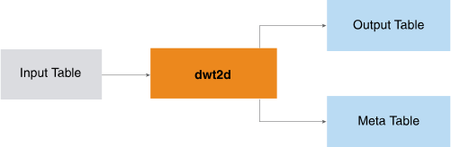

<html><head></head><body>
<h1 class="title topictitle1" id="ariaid-title1">DWT2D</h1>

The DWT2D function implements the Mallat algorithm (an iterate algorithm in the Discrete Wavelet Transform field) on 2-dimensional matrixes and applies wavelet transform on multiple sequences simultaneously.

The input is a set of sequences. Typically, each sequence is a matrix that contains a position in 2-dimensional space (y and x indexes or coordinates) and its corresponding values. You specify the wavelet name or wavelet filter table, transform level, and (optionally) extension mode. The function returns the transformed sequences in Hilbert space with the corresponding component identifiers and indices. (The transformation is also called the decomposition.)

  </img>  

The wavelet filter table does not appear in the preceding diagram because it is seldom used.

This is a typical DWT2D use case:

<ol class="ol" id="mld1506629675211__ol_i4x_11f_p1b">
<li class="li">Apply DWT2D to the original data to create the approximate coefficients of the matrixes and the corresponding metadata.</li>
<li class="li">If desired, filter the coefficients by methods appropriate for the objects (for example, minimum threshold or top <var class="keyword varname">n</var> coefficients).</li>
<li class="li">From the approximate or filtered coefficients, reconstruct the matrixes and compare them with their original counterparts.</li></ol>

<h2 class="title topictitle2" id="ariaid-title2">DWT2D Syntax</h2>

<h2 class="title topictitle2" id="ariaid-title3">DWT2D Syntax Elements</h2>

<dl class="dl parml"><dt class="dt pt dlterm">OutputTable</dt><dd class="dd pd">Specify the name for the table that the function creates to store the coefficients output by the wavelet transform. This table must not exist.</dd><dt class="dt pt dlterm">MetaInformationTable</dt><dd class="dd pd">Specify the name for the table that the function creates to store the meta information for the wavelet transform. This table must not exist.</dd><dt class="dt pt dlterm">TargetColumns</dt><dd class="dd pd">Specify the names of the InputTable columns that contain the data to transform. These columns must contain numeric values between -1e308 and 1e308. The function treats NULL as 0.</dd><dt class="dt pt dlterm">PartitionColumns</dt><dd class="dd pd">[Optional] Specify the names of the InputTable partition columns, which identify the sequences. Rows with the same partition column values belong to the same sequence. If you specify multiple partition columns, the function treats the first one as the distribute key of the OutputTable and MetaInformationTable.
<b>Note</b>
The DWT2D output tables are the IDWT2D input tables. If you specify this syntax element for DWT2D, you must also specify it for IDWT2D; otherwise, the results might not make sense.

</dd><dd class="dd pd ddexpand">Default behavior: All rows belong to one sequence, and the function creates a distribute key column named dwt_id_<var class="keyword varname">random_name</var> in both the OutputTable and MetaInformationTable. In both tables, every cell of dwt_id_<var class="keyword varname">random_name</var> has the value 1.</dd><dt class="dt pt dlterm">IndexColumns</dt><dd class="dd pd">Specify the columns that contain the indexes of the input sequences. For a matrix, <var class="keyword varname">indexy_column</var> contains the y coordinates and <var class="keyword varname">indexx_column</var> contains the x coordinates.</dd><dt class="dt pt dlterm">Range</dt><dd class="dd pd">[Optional] Specify the start and end indexes of the input data, all of which must be integers. The range can specify a maximum of 1,000,000 cells. The function treats any NULL value as 0.

<table cellpadding="4" cellspacing="0" summary="" id="jvt1506630894806__table_cb5_4zf_bcb" class="table" frame="border" border="1" rules="all">

<colgroup span="1"><col style="width:50%" span="1"></col><col style="width:50%" span="1"></col></colgroup><thead class="thead" style="text-align:left;"><tr class="row"><th class="entry cellrowborder" style="vertical-align:top;" id="d149454e145" rowspan="1" colspan="1">Index</th><th class="entry cellrowborder" style="vertical-align:top;" id="d149454e147" rowspan="1" colspan="1">Default</th></tr></thead><tbody class="tbody"><tr class="row"><td class="entry cellrowborder" style="vertical-align:top;" headers="d149454e145" rowspan="1" colspan="1"><var class="keyword varname">starty</var></td><td class="entry cellrowborder" style="vertical-align:top;" headers="d149454e147" rowspan="1" colspan="1">minimum y index</td></tr><tr class="row"><td class="entry cellrowborder" style="vertical-align:top;" headers="d149454e145" rowspan="1" colspan="1"><var class="keyword varname">startx</var></td><td class="entry cellrowborder" style="vertical-align:top;" headers="d149454e147" rowspan="1" colspan="1">minimum x index</td></tr><tr class="row"><td class="entry cellrowborder" style="vertical-align:top;" headers="d149454e145" rowspan="1" colspan="1"><var class="keyword varname">endy</var></td><td class="entry cellrowborder" style="vertical-align:top;" headers="d149454e147" rowspan="1" colspan="1">maximum y index</td></tr><tr class="row"><td class="entry cellrowborder" style="vertical-align:top;" headers="d149454e145" rowspan="1" colspan="1"><var class="keyword varname">endx</var></td><td class="entry cellrowborder" style="vertical-align:top;" headers="d149454e147" rowspan="1" colspan="1">maximum x index</td></tr></tbody></table>
</dd><dt class="dt pt dlterm">Wavelet</dt><dd class="dd pd">[Required if you omit WaveletFilterTable] Specify a wavelet filter name from the table Supported Wavelet Filter Names in <a href="asx1558468105037.md#pic1506628946514">DWT Syntax Elements</a>.</dd><dt class="dt pt dlterm">WaveletTransformLevel</dt><dd class="dd pd">Specify the wavelet transform level. The value level must be an integer in the range [1, 1000].</dd><dt class="dt pt dlterm">ExtensionMode</dt><dd class="dd pd">[Optional] Specify the method for handling border distortion, an <var class="keyword varname">extension_mode</var> from the table Supported Extension Modes in DWT syntax elements.</dd><dd class="dd pd ddexpand">Default: 'sym'</dd><dt class="dt pt dlterm">CompactOutput</dt><dd class="dd pd">[Optional] Specify whether to ignore rows in which all coefficient values have an absolute value less than 1e-12).</dd><dd class="dd pd ddexpand">Default: 'true'. For a sparse input matrix, ignoring such rows reduces the output table size.</dd></dl>

<h2 class="title topictitle2" id="ariaid-title4">DWT2D Input</h2>

The DWT2D input is the same as the <a href="asx1558468105037.md#gzm1506629008899">DWT Input</a>.

<h2 class="title topictitle2" id="ariaid-title5">DWT2D Output</h2>

<h3 class="title sectiontitle">Output Message Schema</h3>
<table cellpadding="4" cellspacing="0" summary="" id="qok1506631067581__table_N10014_N1000E_N1000C_N10001" class="table" frame="border" border="1" rules="all">

<colgroup span="1"><col style="width:23.076923076923077%" span="1"></col><col style="width:15.384615384615385%" span="1"></col><col style="width:61.53846153846154%" span="1"></col></colgroup><thead class="thead" style="text-align:left;"><tr class="row"><th class="entry nocellnorowborder" style="vertical-align:top;" id="d149454e252" rowspan="1" colspan="1">Column</th><th class="entry nocellnorowborder" style="vertical-align:top;" id="d149454e254" rowspan="1" colspan="1">Data Type</th><th class="entry cell-norowborder" style="vertical-align:top;" id="d149454e256" rowspan="1" colspan="1">Description</th></tr></thead><tbody class="tbody"><tr class="row"><td class="entry row-nocellborder" style="vertical-align:top;" headers="d149454e252" rowspan="1" colspan="1">messages</td><td class="entry row-nocellborder" style="vertical-align:top;" headers="d149454e254" rowspan="1" colspan="1">VARCHAR</td><td class="entry cellrowborder" style="vertical-align:top;" headers="d149454e256" rowspan="1" colspan="1">Reports whether function succeeded.</td></tr></tbody></table>

<h3 class="title sectiontitle">OutputTable Schema</h3>

The table has decomposed sequences.

<table cellpadding="4" cellspacing="0" summary="" id="qok1506631067581__table_N10049_N1000E_N1000C_N10001" class="table" frame="border" border="1" rules="all">

<colgroup span="1"><col style="width:25%" span="1"></col><col style="width:25%" span="1"></col><col style="width:50%" span="1"></col></colgroup><thead class="thead" style="text-align:left;"><tr class="row"><th class="entry nocellnorowborder" style="vertical-align:top;" id="d149454e278" rowspan="1" colspan="1">Column</th><th class="entry nocellnorowborder" style="vertical-align:top;" id="d149454e280" rowspan="1" colspan="1">Data Type</th><th class="entry cell-norowborder" style="vertical-align:top;" id="d149454e282" rowspan="1" colspan="1">Description</th></tr></thead><tbody class="tbody"><tr class="row"><td class="entry nocellnorowborder" style="vertical-align:top;" headers="d149454e278" rowspan="1" colspan="1"><var class="keyword varname">partition_column</var></td><td class="entry nocellnorowborder" style="vertical-align:top;" headers="d149454e280" rowspan="1" colspan="1">Same as in Input table</td><td class="entry cell-norowborder" style="vertical-align:top;" headers="d149454e282" rowspan="1" colspan="1">[Column appears once for each specified <var class="keyword varname">partition_column</var>.] Identifier of sequence to which data belongs. Rows with same partition column values belong to same sequence.

If InputTable has multiple partition columns, first one is distribution key in both InputTable and OutputTable.

If InputTable has only one partition column, OutputTable has as its distribution key a function-created column named dwt_id_<var class="keyword varname">random_name</var>. Every cell of dwt_id_<var class="keyword varname">random_name</var> has the value 1.
</td></tr><tr class="row"><td class="entry nocellnorowborder" style="vertical-align:top;" headers="d149454e278" rowspan="1" colspan="1">waveletid</td><td class="entry nocellnorowborder" style="vertical-align:top;" headers="d149454e280" rowspan="1" colspan="1">INTEGER</td><td class="entry cell-norowborder" style="vertical-align:top;" headers="d149454e282" rowspan="1" colspan="1">Index of each wavelet coefficient (starting from 1 for each sequence).</td></tr><tr class="row"><td class="entry nocellnorowborder" style="vertical-align:top;" headers="d149454e278" rowspan="1" colspan="1">waveletcomponent</td><td class="entry nocellnorowborder" style="vertical-align:top;" headers="d149454e280" rowspan="1" colspan="1">VARCHAR</td><td class="entry cell-norowborder" style="vertical-align:top;" headers="d149454e282" rowspan="1" colspan="1">Component to which coefficient belongs. Possible values are <var class="keyword varname">A</var>n<var class="keyword varname">, H</var>n<var class="keyword varname">, V</var>n<var class="keyword varname">, D</var>n<var class="keyword varname">, H</var>n-1<var class="keyword varname">, ..., H</var>1<var class="keyword varname">, V</var>1<var class="keyword varname">, D</var>1<var class="keyword varname">,</var> where <var class="keyword varname">n</var> is wavelet transform level.</td></tr><tr class="row"><td class="entry row-nocellborder" style="vertical-align:top;" headers="d149454e278" rowspan="1" colspan="1"><var class="keyword varname">target_column</var></td><td class="entry row-nocellborder" style="vertical-align:top;" headers="d149454e280" rowspan="1" colspan="1">DOUBLE PRECISION</td><td class="entry cellrowborder" style="vertical-align:top;" headers="d149454e282" rowspan="1" colspan="1">[Column appears once for each <var class="keyword varname">target_column</var>.] Coefficient of input column after wavelet transform.</td></tr></tbody></table>

<h3 class="title sectiontitle">MetaInformationTable Schema</h3>
<table cellpadding="4" cellspacing="0" summary="" id="qok1506631067581__table_N10106_N1000E_N1000C_N10001" class="table" frame="border" border="1" rules="all">

<colgroup span="1"><col style="width:25%" span="1"></col><col style="width:25%" span="1"></col><col style="width:50%" span="1"></col></colgroup><thead class="thead" style="text-align:left;"><tr class="row"><th class="entry nocellnorowborder" style="vertical-align:top;" id="d149454e381" rowspan="1" colspan="1">Column</th><th class="entry nocellnorowborder" style="vertical-align:top;" id="d149454e383" rowspan="1" colspan="1">Data Type</th><th class="entry cell-norowborder" style="vertical-align:top;" id="d149454e385" rowspan="1" colspan="1">Description</th></tr></thead><tbody class="tbody"><tr class="row"><td class="entry nocellnorowborder" style="vertical-align:top;" headers="d149454e381" rowspan="1" colspan="1"><var class="keyword varname">partition_column</var></td><td class="entry nocellnorowborder" style="vertical-align:top;" headers="d149454e383" rowspan="1" colspan="1">Same as in Input table</td><td class="entry cell-norowborder" style="vertical-align:top;" headers="d149454e385" rowspan="1" colspan="1">[Column appears once for each specified <var class="keyword varname">partition_column</var>.] Identifier of sequence to which data belongs. Rows with same partition column values belong to same sequence.

If InputTable has multiple partition columns, first one is distribution key in both input and output tables.

If InputTable has only one partition column, output table has as its distribution key a function-created column named dwt_id_<var class="keyword varname">random_name</var>. Every cell of dwt_id_<var class="keyword varname">random_name</var> has the value 1.
</td></tr><tr class="row"><td class="entry nocellnorowborder" style="vertical-align:top;" headers="d149454e381" rowspan="1" colspan="1">meta</td><td class="entry nocellnorowborder" style="vertical-align:top;" headers="d149454e383" rowspan="1" colspan="1">VARCHAR</td><td class="entry cell-norowborder" style="vertical-align:top;" headers="d149454e385" rowspan="1" colspan="1">Name from meta column of following table.</td></tr><tr class="row"><td class="entry row-nocellborder" style="vertical-align:top;" headers="d149454e381" rowspan="1" colspan="1">content</td><td class="entry row-nocellborder" style="vertical-align:top;" headers="d149454e383" rowspan="1" colspan="1">VARCHAR</td><td class="entry cellrowborder" style="vertical-align:top;" headers="d149454e385" rowspan="1" colspan="1">Content from content column of following table.</td></tr></tbody></table>

<h3 class="title sectiontitle">Meta Information for Each Sequence</h3>
<table cellpadding="4" cellspacing="0" summary="" id="qok1506631067581__table_N10179_N1000E_N1000C_N10001" class="table" frame="border" border="1" rules="all">

<colgroup span="1"><col style="width:16.666666666666664%" span="1"></col><col style="width:83.33333333333334%" span="1"></col></colgroup><thead class="thead" style="text-align:left;"><tr class="row"><th class="entry nocellnorowborder" style="vertical-align:top;" id="d149454e433" rowspan="1" colspan="1">meta</th><th class="entry cell-norowborder" style="vertical-align:top;" id="d149454e435" rowspan="1" colspan="1">content</th></tr></thead><tbody class="tbody"><tr class="row"><td class="entry nocellnorowborder" style="vertical-align:top;" headers="d149454e433" rowspan="1" colspan="1">blocklength</td><td class="entry cell-norowborder" style="vertical-align:top;" headers="d149454e435" rowspan="1" colspan="1">Pairs that represent length of each block of coefficients. 

Format: (<var class="keyword varname">row_number</var>, <var class="keyword varname">column_number</var>)

Example: (5, 5), (5, 5), (5, 6)
</td></tr><tr class="row"><td class="entry nocellnorowborder" style="vertical-align:top;" headers="d149454e433" rowspan="1" colspan="1">length</td><td class="entry cell-norowborder" style="vertical-align:top;" headers="d149454e435" rowspan="1" colspan="1">Pair that represents length of original sequence in each dimension.

Format: (<var class="keyword varname">row_number</var>, <var class="keyword varname">column_number</var>)

Example: (5, 8)
</td></tr><tr class="row"><td class="entry nocellnorowborder" style="vertical-align:top;" headers="d149454e433" rowspan="1" colspan="1">range</td><td class="entry cell-norowborder" style="vertical-align:top;" headers="d149454e435" rowspan="1" colspan="1">Minimum and maximum indexes of original sequence.

Format: (<var class="keyword varname">min_y_index</var>, <var class="keyword varname">min_x_index</var>), (<var class="keyword varname">max_y_index</var>, <var class="keyword varname">max_x_index</var>)

Example: (1, 1), (5, 8)
</td></tr><tr class="row"><td class="entry nocellnorowborder" style="vertical-align:top;" headers="d149454e433" rowspan="1" colspan="1">lowpassfilter</td><td class="entry cell-norowborder" style="vertical-align:top;" headers="d149454e435" rowspan="1" colspan="1">Low-pass filter coefficients used in wavelet decomposition.</td></tr><tr class="row"><td class="entry nocellnorowborder" style="vertical-align:top;" headers="d149454e433" rowspan="1" colspan="1">highpassfilter</td><td class="entry cell-norowborder" style="vertical-align:top;" headers="d149454e435" rowspan="1" colspan="1">High-pass filter coefficients used in wavelet decomposition.</td></tr><tr class="row"><td class="entry nocellnorowborder" style="vertical-align:top;" headers="d149454e433" rowspan="1" colspan="1">ilowpassfilter</td><td class="entry cell-norowborder" style="vertical-align:top;" headers="d149454e435" rowspan="1" colspan="1">Low-pass filter coefficients used in wavelet reconstruction.</td></tr><tr class="row"><td class="entry nocellnorowborder" style="vertical-align:top;" headers="d149454e433" rowspan="1" colspan="1">ihighpassfilter</td><td class="entry cell-norowborder" style="vertical-align:top;" headers="d149454e435" rowspan="1" colspan="1">High-pass filter coefficients used in wavelet reconstruction.</td></tr><tr class="row"><td class="entry nocellnorowborder" style="vertical-align:top;" headers="d149454e433" rowspan="1" colspan="1">level</td><td class="entry cell-norowborder" style="vertical-align:top;" headers="d149454e435" rowspan="1" colspan="1">Level of wavelet transform.</td></tr><tr class="row"><td class="entry row-nocellborder" style="vertical-align:top;" headers="d149454e433" rowspan="1" colspan="1">extensionmode</td><td class="entry cellrowborder" style="vertical-align:top;" headers="d149454e435" rowspan="1" colspan="1">Extension mode used in wavelet transform.</td></tr></tbody></table>

<h2 class="title topictitle2" id="ariaid-title6">DWT2D Example</h2>

This example uses climate data in cities in California (CA), Texas (TX), and Washington (WA). The cities are represented by two-dimensional coordinates (latitude and longitude). The data are temperature (in degrees Fahrenheit), pressure (in Mbars), and dew point (in degrees Fahrenheit). The function outputs a coefficient model table and a meta table, which are used as input to the function <a href="xwz1558468423479.md#zsa1506633647588">IDWT2D</a>.

<h3 class="title sectiontitle">Input</h3>
<table cellpadding="4" cellspacing="0" summary="" id="vme1506631169343__table_k2d_gsy_m2b" class="table" frame="border" border="1" rules="all">
InputTable: twod_climate_data
<colgroup span="1"><col style="width:14.285714285714285%" span="1"></col><col style="width:14.285714285714285%" span="1"></col><col style="width:14.285714285714285%" span="1"></col><col style="width:14.285714285714285%" span="1"></col><col style="width:14.285714285714285%" span="1"></col><col style="width:14.285714285714285%" span="1"></col><col style="width:14.285714285714285%" span="1"></col></colgroup><thead class="thead" style="text-align:left;"><tr class="row"><th class="entry cellrowborder" style="vertical-align:top;" id="d149454e567" rowspan="1" colspan="1">state</th><th class="entry cellrowborder" style="vertical-align:top;" id="d149454e569" rowspan="1" colspan="1">city</th><th class="entry cellrowborder" style="vertical-align:top;" id="d149454e571" rowspan="1" colspan="1">longitude</th><th class="entry cellrowborder" style="vertical-align:top;" id="d149454e573" rowspan="1" colspan="1">latitude</th><th class="entry cellrowborder" style="vertical-align:top;" id="d149454e575" rowspan="1" colspan="1">temp_f</th><th class="entry cellrowborder" style="vertical-align:top;" id="d149454e577" rowspan="1" colspan="1">pressure_mbar</th><th class="entry cellrowborder" style="vertical-align:top;" id="d149454e579" rowspan="1" colspan="1">dewpoint_f</th></tr></thead><tbody class="tbody"><tr class="row"><td class="entry cellrowborder" style="vertical-align:top;" headers="d149454e567" rowspan="1" colspan="1">CA</td><td class="entry cellrowborder" style="vertical-align:top;" headers="d149454e569" rowspan="1" colspan="1">ALPINE</td><td class="entry cellrowborder" style="vertical-align:top;" headers="d149454e571" rowspan="1" colspan="1">-117</td><td class="entry cellrowborder" style="vertical-align:top;" headers="d149454e573" rowspan="1" colspan="1">32</td><td class="entry cellrowborder" style="vertical-align:top;" headers="d149454e575" rowspan="1" colspan="1">34.9</td><td class="entry cellrowborder" style="vertical-align:top;" headers="d149454e577" rowspan="1" colspan="1">1020.5</td><td class="entry cellrowborder" style="vertical-align:top;" headers="d149454e579" rowspan="1" colspan="1">28.9</td></tr><tr class="row"><td class="entry cellrowborder" style="vertical-align:top;" headers="d149454e567" rowspan="1" colspan="1">CA</td><td class="entry cellrowborder" style="vertical-align:top;" headers="d149454e569" rowspan="1" colspan="1">ALTURAS</td><td class="entry cellrowborder" style="vertical-align:top;" headers="d149454e571" rowspan="1" colspan="1">-121</td><td class="entry cellrowborder" style="vertical-align:top;" headers="d149454e573" rowspan="1" colspan="1">41</td><td class="entry cellrowborder" style="vertical-align:top;" headers="d149454e575" rowspan="1" colspan="1">36.6</td><td class="entry cellrowborder" style="vertical-align:top;" headers="d149454e577" rowspan="1" colspan="1">1022</td><td class="entry cellrowborder" style="vertical-align:top;" headers="d149454e579" rowspan="1" colspan="1">29.1</td></tr><tr class="row"><td class="entry cellrowborder" style="vertical-align:top;" headers="d149454e567" rowspan="1" colspan="1">CA</td><td class="entry cellrowborder" style="vertical-align:top;" headers="d149454e569" rowspan="1" colspan="1">ANAHEIM</td><td class="entry cellrowborder" style="vertical-align:top;" headers="d149454e571" rowspan="1" colspan="1">-118</td><td class="entry cellrowborder" style="vertical-align:top;" headers="d149454e573" rowspan="1" colspan="1">33</td><td class="entry cellrowborder" style="vertical-align:top;" headers="d149454e575" rowspan="1" colspan="1">33.9</td><td class="entry cellrowborder" style="vertical-align:top;" headers="d149454e577" rowspan="1" colspan="1">1020</td><td class="entry cellrowborder" style="vertical-align:top;" headers="d149454e579" rowspan="1" colspan="1">28.4</td></tr><tr class="row"><td class="entry cellrowborder" style="vertical-align:top;" headers="d149454e567" rowspan="1" colspan="1">CA</td><td class="entry cellrowborder" style="vertical-align:top;" headers="d149454e569" rowspan="1" colspan="1">AUBURN</td><td class="entry cellrowborder" style="vertical-align:top;" headers="d149454e571" rowspan="1" colspan="1">-122</td><td class="entry cellrowborder" style="vertical-align:top;" headers="d149454e573" rowspan="1" colspan="1">38</td><td class="entry cellrowborder" style="vertical-align:top;" headers="d149454e575" rowspan="1" colspan="1">34.9</td><td class="entry cellrowborder" style="vertical-align:top;" headers="d149454e577" rowspan="1" colspan="1">1020.6</td><td class="entry cellrowborder" style="vertical-align:top;" headers="d149454e579" rowspan="1" colspan="1">28.8</td></tr><tr class="row"><td class="entry cellrowborder" style="vertical-align:top;" headers="d149454e567" rowspan="1" colspan="1">CA</td><td class="entry cellrowborder" style="vertical-align:top;" headers="d149454e569" rowspan="1" colspan="1">BAKER</td><td class="entry cellrowborder" style="vertical-align:top;" headers="d149454e571" rowspan="1" colspan="1">-117</td><td class="entry cellrowborder" style="vertical-align:top;" headers="d149454e573" rowspan="1" colspan="1">35</td><td class="entry cellrowborder" style="vertical-align:top;" headers="d149454e575" rowspan="1" colspan="1">39.4</td><td class="entry cellrowborder" style="vertical-align:top;" headers="d149454e577" rowspan="1" colspan="1">1022</td><td class="entry cellrowborder" style="vertical-align:top;" headers="d149454e579" rowspan="1" colspan="1">29.3</td></tr><tr class="row"><td class="entry cellrowborder" style="vertical-align:top;" headers="d149454e567" rowspan="1" colspan="1">CA</td><td class="entry cellrowborder" style="vertical-align:top;" headers="d149454e569" rowspan="1" colspan="1">BARSTOW</td><td class="entry cellrowborder" style="vertical-align:top;" headers="d149454e571" rowspan="1" colspan="1">-118</td><td class="entry cellrowborder" style="vertical-align:top;" headers="d149454e573" rowspan="1" colspan="1">34</td><td class="entry cellrowborder" style="vertical-align:top;" headers="d149454e575" rowspan="1" colspan="1">32.3</td><td class="entry cellrowborder" style="vertical-align:top;" headers="d149454e577" rowspan="1" colspan="1">1020.8</td><td class="entry cellrowborder" style="vertical-align:top;" headers="d149454e579" rowspan="1" colspan="1">27.6</td></tr><tr class="row"><td class="entry cellrowborder" style="vertical-align:top;" headers="d149454e567" rowspan="1" colspan="1">CA</td><td class="entry cellrowborder" style="vertical-align:top;" headers="d149454e569" rowspan="1" colspan="1">BRIDGEPORT</td><td class="entry cellrowborder" style="vertical-align:top;" headers="d149454e571" rowspan="1" colspan="1">-120</td><td class="entry cellrowborder" style="vertical-align:top;" headers="d149454e573" rowspan="1" colspan="1">38</td><td class="entry cellrowborder" style="vertical-align:top;" headers="d149454e575" rowspan="1" colspan="1">33.9</td><td class="entry cellrowborder" style="vertical-align:top;" headers="d149454e577" rowspan="1" colspan="1">1020.1</td><td class="entry cellrowborder" style="vertical-align:top;" headers="d149454e579" rowspan="1" colspan="1">28.4</td></tr><tr class="row"><td class="entry cellrowborder" style="vertical-align:top;" headers="d149454e567" rowspan="1" colspan="1">CA</td><td class="entry cellrowborder" style="vertical-align:top;" headers="d149454e569" rowspan="1" colspan="1">BURNEY</td><td class="entry cellrowborder" style="vertical-align:top;" headers="d149454e571" rowspan="1" colspan="1">-122</td><td class="entry cellrowborder" style="vertical-align:top;" headers="d149454e573" rowspan="1" colspan="1">40</td><td class="entry cellrowborder" style="vertical-align:top;" headers="d149454e575" rowspan="1" colspan="1">32.3</td><td class="entry cellrowborder" style="vertical-align:top;" headers="d149454e577" rowspan="1" colspan="1">1020.8</td><td class="entry cellrowborder" style="vertical-align:top;" headers="d149454e579" rowspan="1" colspan="1">27.6</td></tr><tr class="row"><td class="entry cellrowborder" style="vertical-align:top;" headers="d149454e567" rowspan="1" colspan="1">CA</td><td class="entry cellrowborder" style="vertical-align:top;" headers="d149454e569" rowspan="1" colspan="1">BUTTONWILLOW</td><td class="entry cellrowborder" style="vertical-align:top;" headers="d149454e571" rowspan="1" colspan="1">-120</td><td class="entry cellrowborder" style="vertical-align:top;" headers="d149454e573" rowspan="1" colspan="1">35</td><td class="entry cellrowborder" style="vertical-align:top;" headers="d149454e575" rowspan="1" colspan="1">32.1</td><td class="entry cellrowborder" style="vertical-align:top;" headers="d149454e577" rowspan="1" colspan="1">1021.3</td><td class="entry cellrowborder" style="vertical-align:top;" headers="d149454e579" rowspan="1" colspan="1">27.4</td></tr><tr class="row"><td class="entry cellrowborder" style="vertical-align:top;" headers="d149454e567" rowspan="1" colspan="1">CA</td><td class="entry cellrowborder" style="vertical-align:top;" headers="d149454e569" rowspan="1" colspan="1">CALISTOGA</td><td class="entry cellrowborder" style="vertical-align:top;" headers="d149454e571" rowspan="1" colspan="1">-123</td><td class="entry cellrowborder" style="vertical-align:top;" headers="d149454e573" rowspan="1" colspan="1">38</td><td class="entry cellrowborder" style="vertical-align:top;" headers="d149454e575" rowspan="1" colspan="1">33.8</td><td class="entry cellrowborder" style="vertical-align:top;" headers="d149454e577" rowspan="1" colspan="1">1021.7</td><td class="entry cellrowborder" style="vertical-align:top;" headers="d149454e579" rowspan="1" colspan="1">28.2</td></tr><tr class="row"><td class="entry cellrowborder" style="vertical-align:top;" headers="d149454e567" rowspan="1" colspan="1">CA</td><td class="entry cellrowborder" style="vertical-align:top;" headers="d149454e569" rowspan="1" colspan="1">CALLAHAN</td><td class="entry cellrowborder" style="vertical-align:top;" headers="d149454e571" rowspan="1" colspan="1">-123</td><td class="entry cellrowborder" style="vertical-align:top;" headers="d149454e573" rowspan="1" colspan="1">41</td><td class="entry cellrowborder" style="vertical-align:top;" headers="d149454e575" rowspan="1" colspan="1">34.6</td><td class="entry cellrowborder" style="vertical-align:top;" headers="d149454e577" rowspan="1" colspan="1">1020.2</td><td class="entry cellrowborder" style="vertical-align:top;" headers="d149454e579" rowspan="1" colspan="1">28.8</td></tr><tr class="row"><td class="entry cellrowborder" style="vertical-align:top;" headers="d149454e567" rowspan="1" colspan="1">CA</td><td class="entry cellrowborder" style="vertical-align:top;" headers="d149454e569" rowspan="1" colspan="1">CECILVILLE</td><td class="entry cellrowborder" style="vertical-align:top;" headers="d149454e571" rowspan="1" colspan="1">-124</td><td class="entry cellrowborder" style="vertical-align:top;" headers="d149454e573" rowspan="1" colspan="1">41</td><td class="entry cellrowborder" style="vertical-align:top;" headers="d149454e575" rowspan="1" colspan="1">33.8</td><td class="entry cellrowborder" style="vertical-align:top;" headers="d149454e577" rowspan="1" colspan="1">1021.7</td><td class="entry cellrowborder" style="vertical-align:top;" headers="d149454e579" rowspan="1" colspan="1">28.3</td></tr><tr class="row"><td class="entry cellrowborder" style="vertical-align:top;" headers="d149454e567" rowspan="1" colspan="1">CA</td><td class="entry cellrowborder" style="vertical-align:top;" headers="d149454e569" rowspan="1" colspan="1">CLOVERDALE</td><td class="entry cellrowborder" style="vertical-align:top;" headers="d149454e571" rowspan="1" colspan="1">-124</td><td class="entry cellrowborder" style="vertical-align:top;" headers="d149454e573" rowspan="1" colspan="1">38</td><td class="entry cellrowborder" style="vertical-align:top;" headers="d149454e575" rowspan="1" colspan="1">32.1</td><td class="entry cellrowborder" style="vertical-align:top;" headers="d149454e577" rowspan="1" colspan="1">1021.3</td><td class="entry cellrowborder" style="vertical-align:top;" headers="d149454e579" rowspan="1" colspan="1">27.4</td></tr><tr class="row"><td class="entry cellrowborder" style="vertical-align:top;" headers="d149454e567" rowspan="1" colspan="1">CA</td><td class="entry cellrowborder" style="vertical-align:top;" headers="d149454e569" rowspan="1" colspan="1">COVELO</td><td class="entry cellrowborder" style="vertical-align:top;" headers="d149454e571" rowspan="1" colspan="1">-124</td><td class="entry cellrowborder" style="vertical-align:top;" headers="d149454e573" rowspan="1" colspan="1">39</td><td class="entry cellrowborder" style="vertical-align:top;" headers="d149454e575" rowspan="1" colspan="1">33.5</td><td class="entry cellrowborder" style="vertical-align:top;" headers="d149454e577" rowspan="1" colspan="1">1020.2</td><td class="entry cellrowborder" style="vertical-align:top;" headers="d149454e579" rowspan="1" colspan="1">28.3</td></tr><tr class="row"><td class="entry cellrowborder" style="vertical-align:top;" headers="d149454e567" rowspan="1" colspan="1">CA</td><td class="entry cellrowborder" style="vertical-align:top;" headers="d149454e569" rowspan="1" colspan="1">GLENNVILLE</td><td class="entry cellrowborder" style="vertical-align:top;" headers="d149454e571" rowspan="1" colspan="1">-119</td><td class="entry cellrowborder" style="vertical-align:top;" headers="d149454e573" rowspan="1" colspan="1">35</td><td class="entry cellrowborder" style="vertical-align:top;" headers="d149454e575" rowspan="1" colspan="1">33.8</td><td class="entry cellrowborder" style="vertical-align:top;" headers="d149454e577" rowspan="1" colspan="1">1021.7</td><td class="entry cellrowborder" style="vertical-align:top;" headers="d149454e579" rowspan="1" colspan="1">28.2</td></tr><tr class="row"><td class="entry cellrowborder" style="vertical-align:top;" headers="d149454e567" rowspan="1" colspan="1">CA</td><td class="entry cellrowborder" style="vertical-align:top;" headers="d149454e569" rowspan="1" colspan="1">HAIWEE</td><td class="entry cellrowborder" style="vertical-align:top;" headers="d149454e571" rowspan="1" colspan="1">-118</td><td class="entry cellrowborder" style="vertical-align:top;" headers="d149454e573" rowspan="1" colspan="1">36</td><td class="entry cellrowborder" style="vertical-align:top;" headers="d149454e575" rowspan="1" colspan="1">33.1</td><td class="entry cellrowborder" style="vertical-align:top;" headers="d149454e577" rowspan="1" colspan="1">1020.2</td><td class="entry cellrowborder" style="vertical-align:top;" headers="d149454e579" rowspan="1" colspan="1">28</td></tr><tr class="row"><td class="entry cellrowborder" style="vertical-align:top;" headers="d149454e567" rowspan="1" colspan="1">CA</td><td class="entry cellrowborder" style="vertical-align:top;" headers="d149454e569" rowspan="1" colspan="1">HEMET</td><td class="entry cellrowborder" style="vertical-align:top;" headers="d149454e571" rowspan="1" colspan="1">-117</td><td class="entry cellrowborder" style="vertical-align:top;" headers="d149454e573" rowspan="1" colspan="1">33</td><td class="entry cellrowborder" style="vertical-align:top;" headers="d149454e575" rowspan="1" colspan="1">33.4</td><td class="entry cellrowborder" style="vertical-align:top;" headers="d149454e577" rowspan="1" colspan="1">1020.2</td><td class="entry cellrowborder" style="vertical-align:top;" headers="d149454e579" rowspan="1" colspan="1">28.3</td></tr><tr class="row"><td class="entry cellrowborder" style="vertical-align:top;" headers="d149454e567" rowspan="1" colspan="1">CA</td><td class="entry cellrowborder" style="vertical-align:top;" headers="d149454e569" rowspan="1" colspan="1">IMPERIAL</td><td class="entry cellrowborder" style="vertical-align:top;" headers="d149454e571" rowspan="1" colspan="1">-116</td><td class="entry cellrowborder" style="vertical-align:top;" headers="d149454e573" rowspan="1" colspan="1">32</td><td class="entry cellrowborder" style="vertical-align:top;" headers="d149454e575" rowspan="1" colspan="1">34.4</td><td class="entry cellrowborder" style="vertical-align:top;" headers="d149454e577" rowspan="1" colspan="1">1020.2</td><td class="entry cellrowborder" style="vertical-align:top;" headers="d149454e579" rowspan="1" colspan="1">28.7</td></tr><tr class="row"><td class="entry cellrowborder" style="vertical-align:top;" headers="d149454e567" rowspan="1" colspan="1">CA</td><td class="entry cellrowborder" style="vertical-align:top;" headers="d149454e569" rowspan="1" colspan="1">KENTFIELD</td><td class="entry cellrowborder" style="vertical-align:top;" headers="d149454e571" rowspan="1" colspan="1">-123</td><td class="entry cellrowborder" style="vertical-align:top;" headers="d149454e573" rowspan="1" colspan="1">37</td><td class="entry cellrowborder" style="vertical-align:top;" headers="d149454e575" rowspan="1" colspan="1">32.7</td><td class="entry cellrowborder" style="vertical-align:top;" headers="d149454e577" rowspan="1" colspan="1">1020</td><td class="entry cellrowborder" style="vertical-align:top;" headers="d149454e579" rowspan="1" colspan="1">27.9</td></tr><tr class="row"><td class="entry cellrowborder" style="vertical-align:top;" headers="d149454e567" rowspan="1" colspan="1">CA</td><td class="entry cellrowborder" style="vertical-align:top;" headers="d149454e569" rowspan="1" colspan="1">KLAMATH</td><td class="entry cellrowborder" style="vertical-align:top;" headers="d149454e571" rowspan="1" colspan="1">-125</td><td class="entry cellrowborder" style="vertical-align:top;" headers="d149454e573" rowspan="1" colspan="1">41</td><td class="entry cellrowborder" style="vertical-align:top;" headers="d149454e575" rowspan="1" colspan="1">32.1</td><td class="entry cellrowborder" style="vertical-align:top;" headers="d149454e577" rowspan="1" colspan="1">1021.3</td><td class="entry cellrowborder" style="vertical-align:top;" headers="d149454e579" rowspan="1" colspan="1">27.5</td></tr><tr class="row"><td class="entry cellrowborder" style="vertical-align:top;" headers="d149454e567" rowspan="1" colspan="1">...</td><td class="entry cellrowborder" style="vertical-align:top;" headers="d149454e569" rowspan="1" colspan="1">...</td><td class="entry cellrowborder" style="vertical-align:top;" headers="d149454e571" rowspan="1" colspan="1">...</td><td class="entry cellrowborder" style="vertical-align:top;" headers="d149454e573" rowspan="1" colspan="1">...</td><td class="entry cellrowborder" style="vertical-align:top;" headers="d149454e575" rowspan="1" colspan="1">...</td><td class="entry cellrowborder" style="vertical-align:top;" headers="d149454e577" rowspan="1" colspan="1">...</td><td class="entry cellrowborder" style="vertical-align:top;" headers="d149454e579" rowspan="1" colspan="1">...</td></tr></tbody></table>

<h3 class="title sectiontitle">SQL Call</h3><pre class="pre codeblock" xml:space="preserve"><code>SELECT * FROM DWT2D (
  ON twod_climate_data AS InputTable
  OUT TABLE OutputTable (dwt2d_coeftable)
  OUT TABLE MetaInformationTable (dwt2d_metatable)
  USING
  TargetColumns ('temp_f','pressure_mbar','dewpoint_f')
  PartitionColumns ('state')
  IndexColumns ('latitude', 'longitude')
  Wavelet ('db2')
  CompactOutput ('true')
  WaveletTransformLevel (2)
) AS dt;</code></pre>

<h3 class="title sectiontitle">Output</h3><pre class="pre screen" xml:space="preserve"> messages                     
 ---------------------------- 
 Dwt2D finished successfully!</pre><pre class="pre codeblock" xml:space="preserve"><code>SELECT * FROM dwt2d_coeftable ORDER BY state, waveletid, waveletcomponent;</code></pre><pre class="pre screen" xml:space="preserve"> state waveletid waveletcomponent temp_f                pressure_mbar        dewpoint_f            
 ----- --------- ---------------- --------------------- -------------------- --------------------- 
 ca            2 A2                 0.17966670080766614    5.367577820865212   0.14864598865259468
 ca            3 A2                 -2.8794432544680917   -80.83794342982637   -2.3434013863320886
 ca            4 A2                   85.17099422732936    2535.209096707586     71.20340790342276
 ca            5 A2                -0.43698818294264186  -14.301367416569166  -0.37656963780789143
 ca            6 A2                 -3.5518013494034726  -112.24731824224867   -3.0373591313812405
 ca            7 A2                   7.607131707178469   243.03773964415961     6.527150195494035
 ca            8 A2                   77.48362490347102   2309.1677654492873     64.67758744765001
 ca            9 A2                  -2.467185519590279   -72.80570197561599   -2.0559702715297323
 ca           10 A2                   4.307237263004058    138.9649861032441     3.698570590257976
 ...
 tx            1 A2                 -3.6011517287761174   -89.66062613652628    -2.533400946695857
 tx            2 A2                  -4.892774826100907  -122.68985857717036   -3.4903463430079986
 tx            3 A2                   32.55414532700897    781.9783426823088    22.511340139411953
 tx            4 A2                   52.65077802036848   1237.3018397594763     35.65115873239475
 tx            5 A2                 -18.081617481567218   -449.8871020273652   -12.869485244673767
 tx            6 A2                   5.199579156036784    125.1711586833209    3.5429928486997295
 tx            7 A2                  0.7131422719011882   22.194219313520705    0.5933788322995257
 tx            8 A2                  34.490654091515125    824.5284208268199    23.648074260046357
 tx            9 A2                   50.07836808898107   1177.1087409858105      33.8303478810003
 tx           10 A2                 -21.489198057562923   -517.9621336089269   -14.920617758952584
 ...
 wa            1 A2                    42.6254931061425   1468.4366999990582     35.28539169480957
 wa            2 A2                   47.21635578657956   1624.9053300999767     39.10397731411011
 wa            3 A2                   73.03586814995711   2509.1676792770127    60.485928056688806
 wa            4 A2                  29.612765080680177   1012.0954617994031    24.068537871549648
 wa            5 A2                   63.39836472182281    2184.274991658562    52.422101734722204
 wa            6 A2                   67.34481712227416   2319.5128100909124     55.70701016166999
 wa            7 A2                   82.16956338227835   2826.8562365727303      67.8884826575598
 wa            8 A2                  46.981578273758515   1609.3291255609581    38.192760986972914
 wa            9 A2                   40.32603519406097   1391.6270194096492     33.09817180508851
 wa           10 A2                   53.39390787028372   1851.1134440137755     43.76464770186756</pre>

CompactOutput('true') prevents rows in which all coefficient values have an absolute value less than 1e-12) from appearing in dwt2d_coeftable.
<pre class="pre codeblock" xml:space="preserve"><code>SELECT * FROM dwt2d_metatable ORDER BY state;</code></pre><pre class="pre screen" xml:space="preserve"> state meta            content                                                                          
 ----- --------------- -------------------------------------------------------------------------------- 
 ca    range           (32,-125),(41,-116)                                                             
 ca    extensionmode   sym                                                                             
 ca    ilowpassfilter  0.4829629131445342, 0.836516303737808, 0.2241438680420134, -0.1294095225512604  
 ca    waveletname     db2                                                                             
 ca    length          (10, 10)                                                                        
 ca    highpassfilter  -0.4829629131445342, 0.836516303737808, -0.2241438680420134, -0.1294095225512604
 ca    ihighpassfilter -0.1294095225512604, -0.2241438680420134, 0.836516303737808, -0.4829629131445342
 ca    lowpassfilter   -0.1294095225512604, 0.2241438680420134, 0.836516303737808, 0.4829629131445342  
 ca    blocklength     (4, 4),(4, 4),(4, 4),(4, 4),(6, 6),(6, 6),(6, 6)                                
 ca    level           2                                                                               
 tx    highpassfilter  -0.4829629131445342, 0.836516303737808, -0.2241438680420134, -0.1294095225512604
 tx    extensionmode   sym                                                                             
 tx    lowpassfilter   -0.1294095225512604, 0.2241438680420134, 0.836516303737808, 0.4829629131445342  
 tx    ihighpassfilter -0.1294095225512604, -0.2241438680420134, 0.836516303737808, -0.4829629131445342
 tx    length          (11, 11)                                                                        
 tx    waveletname     db2                                                                             
 tx    blocklength     (5, 5),(5, 5),(5, 5),(5, 5),(7, 7),(7, 7),(7, 7)                                
 tx    range           (26,-105),(36,-95)                                                              
 tx    level           2                                                                               
 tx    ilowpassfilter  0.4829629131445342, 0.836516303737808, 0.2241438680420134, -0.1294095225512604  
 wa    range           (45,-125),(48,-118)                                                             
 wa    highpassfilter  -0.4829629131445342, 0.836516303737808, -0.2241438680420134, -0.1294095225512604
 wa    level           2                                                                               
 wa    ihighpassfilter -0.1294095225512604, -0.2241438680420134, 0.836516303737808, -0.4829629131445342
 wa    extensionmode   sym                                                                             
 wa    waveletname     db2                                                                             
 wa    blocklength     (3, 4),(3, 4),(3, 4),(3, 4),(3, 5),(3, 5),(3, 5)                                
 wa    ilowpassfilter  0.4829629131445342, 0.836516303737808, 0.2241438680420134, -0.1294095225512604  
 wa    lowpassfilter   -0.1294095225512604, 0.2241438680420134, 0.836516303737808, 0.4829629131445342  
 wa    length          (4, 8)</pre>

Download a zip file of all examples and a SQL script file that creates their input tables from the attachment in the left sidebar.

</body></html>
