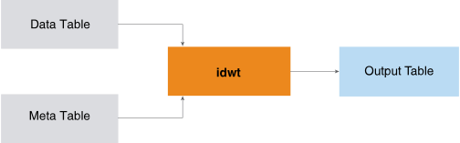

<html><head></head><body>
<h1 class="title topictitle1" id="ariaid-title1">IDWT</h1>

The IDWT function is the inverse of <a href="asx1558468105037.md#rpd1506628701823">DWT</a>; that is, IDWT applies inverse wavelet transforms on multiple sequences simultaneously. IDWT takes as input the output table and meta table output by DWT and outputs the sequences in time domain. (Because the IDWT output is comparable to the DWT input, the inverse transformation is also called the reconstruction.)

  </img>  

This is a typical IDWT use case:

<ol class="ol" id="xcy1506632882935__ol_f2l_xy2_p1b">
<li class="li">Apply DWT to sequences to create their coefficients and corresponding metadata.</li>
<li class="li">Filter the coefficients by methods appropriate for the objects (for example, minimum threshold or top <var class="keyword varname">n</var> coefficients).</li>
<li class="li">Apply IDWT to the filtered coefficients to reconstruct the sequences.</li>
<li class="li">Compare the reconstructed sequences to their original counterparts.</li></ol>

<h2 class="title topictitle2" id="ariaid-title2">IDWT Syntax</h2>

<h2 class="title topictitle2" id="ariaid-title3">IDWT Syntax Elements</h2>

<dl class="dl parml"><dt class="dt pt dlterm">OutputTable</dt><dd class="dd pd">Specify the name for the table that the function creates to store the reconstructed result. This table must not exist.</dd><dt class="dt pt dlterm">TargetColumns</dt><dd class="dd pd">Specify the names of the InputTable columns that contain the data to transform. These columns must contain numeric values between -1e308 and 1e308. The function treats NULL as 0.</dd><dt class="dt pt dlterm">SortColumn</dt><dd class="dd pd">Specify the name of the InputTable column that represents the order of coefficients in each sequence (the waveletid column in the DWT output table). The column must contain a sequence of integer values that start from 1 for each sequence. If a value is missing from the sequence, the function treats the corresponding data column as 0.</dd><dt class="dt pt dlterm">PartitionColumns</dt><dd class="dd pd">[Optional] Specify the names of the InputTable partition columns, which identify the sequences. Rows with the same partition column values belong to the same sequence. If you specify multiple partition columns, the function treats the first one as the distribute key of the OutputTable and MetaTable.
<b>Note</b>
The IDWT input tables are the DWT output tables. If you specify this syntax element for DWT, you must also specify it for IDWT; otherwise, the results might not make sense.

</dd><dd class="dd pd ddexpand">Default behavior: All rows belong to one sequence, and the function creates a distribute key column named dwt_id_<var class="keyword varname">random_name</var> in both the OutputTable and MetaTable. In both tables, every cell of dwt_id_<var class="keyword varname">random_name</var> has the value 1.</dd></dl>

<h2 class="title topictitle2" id="ariaid-title4">IDWT Input</h2>

<table cellpadding="4" cellspacing="0" summary="" id="znn1506633082308__table_gn5_dht_wcb" class="table" frame="border" border="1" rules="all">

<colgroup span="1"><col style="width:50%" span="1"></col><col style="width:50%" span="1"></col></colgroup><thead class="thead" style="text-align:left;"><tr class="row"><th class="entry cellrowborder" style="vertical-align:top;" id="d196807e143" rowspan="1" colspan="1">Table</th><th class="entry cellrowborder" style="vertical-align:top;" id="d196807e145" rowspan="1" colspan="1">Description</th></tr></thead><tbody class="tbody"><tr class="row"><td class="entry cellrowborder" style="vertical-align:top;" headers="d196807e143" rowspan="1" colspan="1">InputTable</td><td class="entry cellrowborder" style="vertical-align:top;" headers="d196807e145" rowspan="1" colspan="1">Has same schema as <a href="asx1558468105037.md#sns1506629090993">DWT Output</a> OutputTable.</td></tr><tr class="row"><td class="entry cellrowborder" style="vertical-align:top;" headers="d196807e143" rowspan="1" colspan="1">MetaTable</td><td class="entry cellrowborder" style="vertical-align:top;" headers="d196807e145" rowspan="1" colspan="1">Has same schema as DWT Output MetaInformationTable.</td></tr></tbody></table>

<h2 class="title topictitle2" id="ariaid-title5">IDWT Output</h2>

<h3 class="title sectiontitle">Output Message Schema</h3>
<table cellpadding="4" cellspacing="0" summary="" id="vih1506633152472__table_N10014_N1000E_N1000C_N10001" class="table" frame="border" border="1" rules="all">

<colgroup span="1"><col style="width:23.076923076923077%" span="1"></col><col style="width:15.384615384615385%" span="1"></col><col style="width:61.53846153846154%" span="1"></col></colgroup><thead class="thead" style="text-align:left;"><tr class="row"><th class="entry nocellnorowborder" style="vertical-align:top;" id="d196807e181" rowspan="1" colspan="1">Column</th><th class="entry nocellnorowborder" style="vertical-align:top;" id="d196807e183" rowspan="1" colspan="1">Data Type</th><th class="entry cell-norowborder" style="vertical-align:top;" id="d196807e185" rowspan="1" colspan="1">Description</th></tr></thead><tbody class="tbody"><tr class="row"><td class="entry row-nocellborder" style="vertical-align:top;" headers="d196807e181" rowspan="1" colspan="1">messages</td><td class="entry row-nocellborder" style="vertical-align:top;" headers="d196807e183" rowspan="1" colspan="1">VARCHAR</td><td class="entry cellrowborder" style="vertical-align:top;" headers="d196807e185" rowspan="1" colspan="1">Reports whether function succeeded.</td></tr></tbody></table>

<h3 class="title sectiontitle">OutputTable Schema</h3>

The table has reconstructed sequences.

<table cellpadding="4" cellspacing="0" summary="" id="vih1506633152472__table_N10049_N1000E_N1000C_N10001" class="table" frame="border" border="1" rules="all">

<colgroup span="1"><col style="width:18.181818181818183%" span="1"></col><col style="width:27.27272727272727%" span="1"></col><col style="width:54.54545454545454%" span="1"></col></colgroup><thead class="thead" style="text-align:left;"><tr class="row"><th class="entry nocellnorowborder" style="vertical-align:top;" id="d196807e207" rowspan="1" colspan="1">Column</th><th class="entry nocellnorowborder" style="vertical-align:top;" id="d196807e209" rowspan="1" colspan="1">Data Type</th><th class="entry cell-norowborder" style="vertical-align:top;" id="d196807e211" rowspan="1" colspan="1">Description</th></tr></thead><tbody class="tbody"><tr class="row"><td class="entry nocellnorowborder" style="vertical-align:top;" headers="d196807e207" rowspan="1" colspan="1"><var class="keyword varname">partition_column</var></td><td class="entry nocellnorowborder" style="vertical-align:top;" headers="d196807e209" rowspan="1" colspan="1">Same as in Input table</td><td class="entry cell-norowborder" style="vertical-align:top;" headers="d196807e211" rowspan="1" colspan="1">[Column appears once for each specified <var class="keyword varname">partition_column</var>.] Identifier of sequence to which data belongs. Rows with same partition column values belong to same sequence.

If InputTable has multiple partition columns, first one is distribution key in both InputTable and OutputTable.

If InputTable has only one partition column, OutputTable has as its distribution key a function-created column named dwt_id_<var class="keyword varname">random_name</var>. Every cell of dwt_id_<var class="keyword varname">random_name</var> has the value 1.
</td></tr><tr class="row"><td class="entry nocellnorowborder" style="vertical-align:top;" headers="d196807e207" rowspan="1" colspan="1">indexid</td><td class="entry nocellnorowborder" style="vertical-align:top;" headers="d196807e209" rowspan="1" colspan="1">INTEGER</td><td class="entry cell-norowborder" style="vertical-align:top;" headers="d196807e211" rowspan="1" colspan="1">Index of each reconstructed sequence (starting from 1 for each sequence).</td></tr><tr class="row"><td class="entry row-nocellborder" style="vertical-align:top;" headers="d196807e207" rowspan="1" colspan="1"><var class="keyword varname">target_column</var></td><td class="entry row-nocellborder" style="vertical-align:top;" headers="d196807e209" rowspan="1" colspan="1">INTEGER, SMALLINT, BIGINT, DOUBLE PRECISION, or NUMERIC</td><td class="entry cellrowborder" style="vertical-align:top;" headers="d196807e211" rowspan="1" colspan="1">[Column appears once for each <var class="keyword varname">target_column</var>.] Reconstructed sequence.</td></tr></tbody></table>

<h2 class="title topictitle2" id="ariaid-title6">IDWT Example</h2>

This example reconstructs the <a href="asx1558468105037.md#jqm1506629299458">DWT Example</a> input.

<h3 class="title sectiontitle">Input</h3>

Input tables are <a href="asx1558468105037.md#jqm1506629299458">DWT Example</a> output:

<ul class="ul" id="mmq1506633228426__ul_o1l_4fq_ccb">
<li class="li">InputTable: dwt_coef_table</li>
<li class="li">MetaTable: dwt_meta_table</li></ul>

<h3 class="title sectiontitle">SQL Call</h3><pre class="pre codeblock" xml:space="preserve"><code>DROP TABLE climate_reconstruct;

SELECT * FROM IDWT (
  ON dwt_coef_table AS InputTable
  ON dwt_meta_table AS MetaTable
  OUT TABLE OutputTable (climate_reconstruct)
  USING
  TargetColumns ('temp_f', 'pressure_mbar', 'dewpoint_f')
  SortColumn ('waveletid')
  PartitionColumns ('city')
) AS dt;</code></pre>

<h3 class="title sectiontitle">Output</h3><pre class="pre screen" xml:space="preserve"> messages                    
 --------------------------- 
 IDwt finished successfully!</pre><pre class="pre codeblock" xml:space="preserve"><code>SELECT * FROM climate_reconstruct ORDER BY city, indexid;</code></pre>

Except for its name, climate_reconstruct, the output table is the same as the <a href="asx1558468105037.md#jqm1506629299458">DWT Example</a> input table, ville_climatedata. The original values for the temperature, pressure, and the dew point are reconstructed.
<pre class="pre screen" xml:space="preserve"> city        indexid temp_f             pressure_mbar      dewpoint_f         
 ----------- ------- ------------------ ------------------ ------------------ 
 asheville         1  34.90000000000003 1020.5000000000007 28.900000000000016
 asheville         2  34.40000000000003  1020.200000000001 28.700000000000006
 asheville         3  33.90000000000002 1020.0000000000008 28.400000000000013
 asheville         4  33.40000000000002  1020.200000000001  28.30000000000001
 asheville         5  33.10000000000004 1020.2000000000007 28.000000000000018
 asheville         6  32.70000000000004 1020.0000000000006  27.90000000000002
 asheville         7 32.500000000000014 1020.3000000000004 27.700000000000017
 asheville         8 32.300000000000004 1020.8000000000003  27.60000000000001
 asheville         9 32.100000000000016 1021.3000000000006 27.400000000000016
 asheville        10 33.800000000000004 1021.7000000000008 28.200000000000024
 asheville        11  36.40000000000003 1022.1000000000008  28.90000000000002
 asheville        12 39.400000000000034 1022.0000000000007 29.300000000000026
 asheville        13  42.10000000000004 1021.1000000000006 29.200000000000017
 asheville        14 44.200000000000045 1020.0000000000005 29.100000000000023
 asheville        15  45.60000000000004 1019.3000000000005 28.900000000000013
 asheville        16  46.20000000000004 1019.0000000000006  28.50000000000001
 asheville        17  45.80000000000002 1019.2000000000007 28.500000000000014
 asheville        18 44.100000000000016 1019.6000000000008 28.600000000000023
 asheville        19 41.200000000000024 1020.1000000000007 28.500000000000025
 asheville        20  39.60000000000003 1020.6000000000006 28.800000000000026
 asheville        21  38.20000000000004 1020.9000000000003  29.00000000000002
 asheville        22  37.20000000000003 1021.1000000000004  29.00000000000002
 asheville        23 36.300000000000026 1021.0000000000007 29.000000000000018
 asheville        24 35.500000000000014 1020.9000000000008  29.00000000000002
 brownsville       1  35.10000000000003 1020.5000000000005  28.90000000000002
 brownsville       2  34.60000000000004 1020.2000000000005  28.80000000000002
 brownsville       3  34.10000000000002 1020.0000000000007 28.500000000000018
 brownsville       4 33.700000000000024 1020.1000000000005 28.400000000000013
 brownsville       5  33.30000000000002 1020.2000000000007 28.200000000000017
 brownsville       6  32.90000000000003 1020.0000000000007  28.10000000000002
 brownsville       7  32.70000000000003 1020.3000000000006  27.90000000000002
 brownsville       8  32.50000000000002 1020.8000000000005 27.800000000000022
 brownsville       9  32.30000000000001 1021.2000000000007 27.700000000000017
 brownsville      10 34.000000000000014 1021.6000000000007 28.500000000000014
 brownsville      11  36.70000000000002 1022.0000000000008 29.200000000000017
 brownsville      12  39.70000000000003 1021.9000000000008 29.600000000000016
 brownsville      13  42.50000000000003 1021.0000000000007  29.70000000000001
 brownsville      14 44.500000000000036 1019.9000000000007 29.500000000000007
 brownsville      15  45.90000000000004 1019.2000000000007 29.200000000000017
 brownsville      16  46.50000000000004 1019.0000000000002 28.900000000000013
 brownsville      17  46.00000000000004 1019.2000000000008 28.900000000000013
 brownsville      18  44.30000000000003 1019.6000000000006 28.900000000000006
 brownsville      19 41.500000000000036 1020.0000000000007 28.800000000000015
 brownsville      20  39.80000000000003 1020.5000000000003  29.20000000000001
 brownsville      21  38.50000000000004 1020.8000000000004  29.30000000000002
 brownsville      22 37.400000000000034 1020.9000000000005  29.30000000000002
 brownsville      23  36.50000000000003 1020.9000000000004 29.300000000000022
 brownsville      24  35.70000000000003 1020.8000000000004 29.200000000000006
 greenville        1  34.90000000000002 1020.6000000000006  28.80000000000002
 greenville        2  34.40000000000002 1020.2000000000008  28.70000000000001
 greenville        3  33.90000000000001 1020.1000000000005 28.400000000000013
 greenville        4  33.50000000000002 1020.2000000000003  28.30000000000001
 greenville        5  33.10000000000002 1020.2000000000003 28.000000000000018
 greenville        6 32.700000000000024 1020.0000000000002  27.90000000000002
 greenville        7 32.500000000000014 1020.4000000000004 27.700000000000017
 greenville        8  32.30000000000001 1020.8000000000006 27.600000000000016
 greenville        9 32.100000000000016 1021.3000000000004 27.500000000000018
 greenville       10 33.800000000000026 1021.7000000000004 28.300000000000015
 greenville       11  36.60000000000003 1022.0000000000006 29.100000000000016
 greenville       12  39.60000000000003 1021.9000000000008 29.500000000000014
 greenville       13  42.40000000000003 1021.1000000000006  29.50000000000002
 greenville       14  44.50000000000003 1020.0000000000007  29.40000000000002
 greenville       15  46.00000000000003 1019.3000000000006 29.100000000000023
 greenville       16  46.50000000000002 1019.0000000000006  28.80000000000002
 greenville       17  46.10000000000002 1019.2000000000007  28.80000000000002
 greenville       18  44.40000000000002 1019.6000000000008 28.700000000000017
 greenville       19  41.50000000000002 1020.1000000000007 28.700000000000017
 greenville       20  39.80000000000003 1020.6000000000004 29.100000000000023
 greenville       21  38.50000000000003 1020.9000000000007 29.200000000000017
 greenville       22  37.40000000000002 1021.0000000000008 29.200000000000017
 greenville       23  36.50000000000002 1020.9000000000007  29.20000000000001
 greenville       24  35.80000000000001 1020.9000000000004  29.10000000000001
 knoxville         1  34.80000000000002 1020.4000000000004 28.700000000000017
 knoxville         2  34.20000000000003 1020.0000000000007  28.40000000000002
 knoxville         3  33.70000000000003 1019.9000000000005  28.10000000000002
 knoxville         4  33.20000000000003 1020.0000000000008 27.900000000000016
 knoxville         5  32.80000000000001 1020.0000000000005  27.70000000000002
 knoxville         6  32.40000000000001 1019.9000000000003  27.50000000000002
 knoxville         7 32.200000000000024 1020.2000000000005 27.400000000000013
 knoxville         8  32.00000000000003 1020.6000000000005  27.30000000000001
 knoxville         9  31.80000000000002 1021.1000000000004 27.200000000000024
 knoxville        10  33.50000000000002 1021.5000000000003 28.000000000000032
 knoxville        11 36.300000000000026 1021.9000000000005 28.700000000000017
 knoxville        12 39.300000000000026 1021.8000000000005 29.000000000000007
 knoxville        13  42.10000000000002 1021.0000000000005  29.10000000000002
 knoxville        14  44.10000000000002 1019.9000000000002  28.90000000000002
 knoxville        15  45.50000000000002 1019.2000000000006 28.600000000000023
 knoxville        16  46.00000000000003 1018.9000000000005 28.300000000000022
 knoxville        17  45.60000000000002  1019.200000000001 28.300000000000026
 knoxville        18  43.90000000000002 1019.6000000000008 28.400000000000023
 knoxville        19 41.100000000000016 1020.0000000000009 28.300000000000022
 knoxville        20  39.40000000000002 1020.5000000000006 28.700000000000024
 knoxville        21  38.20000000000003 1020.8000000000004  28.80000000000002
 knoxville        22  37.10000000000004 1020.9000000000005 28.800000000000015
 knoxville        23  36.30000000000002 1020.9000000000003  28.80000000000002
 knoxville        24  35.50000000000002 1020.8000000000004  28.70000000000001
 nasheville        1  35.00000000000002 1020.4000000000007  29.00000000000002
 nasheville        2 34.500000000000014 1020.1000000000007 28.700000000000017
 nasheville        3 34.000000000000014 1019.9000000000008 28.500000000000018
 nasheville        4 33.600000000000016 1020.0000000000007  28.30000000000001
 nasheville        5  33.10000000000001 1020.1000000000003 28.100000000000016
 nasheville        6               32.8 1019.9000000000001  28.00000000000002
 nasheville        7 32.500000000000014 1020.2000000000005 27.800000000000022
 nasheville        8  32.40000000000001 1020.6000000000006 27.700000000000028
 nasheville        9  32.20000000000002 1021.1000000000004 27.600000000000023
 nasheville       10  33.80000000000002 1021.5000000000006  28.40000000000002
 nasheville       11  36.60000000000003 1021.9000000000005 29.000000000000014
 nasheville       12  39.60000000000004 1021.8000000000005 29.400000000000002
 nasheville       13 42.300000000000026 1021.0000000000008 29.400000000000016
 nasheville       14  44.30000000000003 1019.8000000000006  29.20000000000002
 nasheville       15  45.60000000000003 1019.2000000000005  28.90000000000002
 nasheville       16  46.20000000000003 1018.9000000000003  28.70000000000002
 nasheville       17  45.70000000000004 1019.1000000000004 28.600000000000016
 nasheville       18  44.10000000000003 1019.5000000000007 28.700000000000017
 nasheville       19  41.30000000000002 1019.9000000000005  28.60000000000002
 nasheville       20  39.50000000000002 1020.4000000000007 28.900000000000016
 nasheville       21  38.30000000000002  1020.700000000001 29.000000000000014
 nasheville       22  37.20000000000003 1020.9000000000011 29.000000000000014
 nasheville       23  36.40000000000002 1020.8000000000006 29.000000000000014
 nasheville       24  35.60000000000002 1020.7000000000006  28.90000000000002</pre>

Download a zip file of all examples and a SQL script file that creates their input tables from the attachment in the left sidebar.

</body></html>
