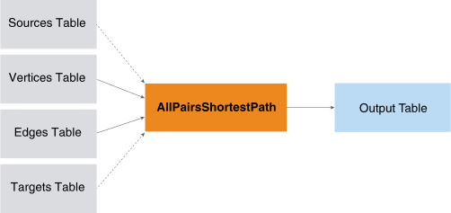
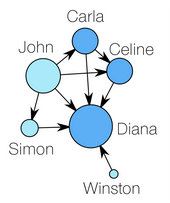

<html><head></head><body>
<h1 class="title topictitle1" id="ariaid-title1">AllPairsShortestPath (ML Engine)</h1>

The AllPairsShortestPath function computes the shortest distances between
			all combinations of the specified source and target vertices. The function works on
			directed, undirected, weighted, and unweighted graphs.

  </img>  

The function is useful in social network analysis. The resulting pairs and
			distances can be aggregated to determine a closeness metric or the k-degree for each
			vertex in a graph.

<h2 class="title topictitle2" id="ariaid-title2">AllPairsShortestPath Syntax</h2>

<h3 class="title sectiontitle">Version 1.4</h3><pre class="pre codeblock" xml:space="preserve"><code>SELECT * FROM AllPairsShortestPath (
  ON <var class="keyword varname">vertices_table</var> AS Vertices PARTITION BY <var class="keyword varname">vertex_key_column</var> [,...] 
  ON <var class="keyword varname">edges_table</var> AS Edges PARTITION BY <var class="keyword varname">source_vertex_key_column</var> [,...] 
  [ ON <var class="keyword varname">sources_table</var> AS Sources PARTITION BY <var class="keyword varname">source_vertex_key_column</var> [,...] ]
  [ ON <var class="keyword varname">targets_table</var> AS Targets PARTITION BY <var class="keyword varname">target_vertex_key_column</var> [,...] ]
  USING
  TargetKey ({ '<var class="keyword varname">target_key_column</var>' | <var class="keyword varname">target_key_column_range</var> }[,...])
  [ EdgeWeight ('<var class="keyword varname">edge_weight</var>') ]
  [ Directed (<b>{'true'|'t'|'yes'|'y'|'1'|'false'|'f'|'no'|'n'|'0'}</b>) ]
  [ MaxDistance (<var class="keyword varname">max_distance</var>) ]
  [ GroupSize (<var class="keyword varname">group_size</var>) ]
) AS <var class="keyword varname">alias</var>;</code></pre>

<b>Related Information</b>

<ul class="linklist linklist relinfo">
<a href="ndv1557782188375.md">Column Specification Syntax Elements</a>
</ul>

<h2 class="title topictitle2" id="ariaid-title3">AllPairsShortestPath Syntax Elements</h2>

<dl class="dl parml"><dt class="dt pt dlterm">TargetKey</dt><dd class="dd pd">Specify the target key (the names of the Edges table columns that identify the target vertex). If you specify <var class="keyword varname">targets_table</var>, the function uses only the vertices in <var class="keyword varname">targets_table</var> as targets (which must be a subset of those that this syntax element specifies).</dd><dt class="dt pt dlterm">EdgeWeight</dt><dd class="dd pd">[Optional] Specify the name of the Edges table column that contains edge weights. Each <var class="keyword varname">edge_weight</var> is a positive value.</dd><dd class="dd pd ddexpand">Default: Each <var class="keyword varname">edge_weight</var> is 1 (that is, the graph is unweighted)</dd><dt class="dt pt dlterm">Directed</dt><dd class="dd pd">[Optional] Specify whether the graph is directed.</dd><dd class="dd pd ddexpand">Default: 'true'</dd><dt class="dt pt dlterm">MaxDistance</dt><dd class="dd pd">[Optional] Specify the maximum distance between source and target for which the function outputs the vertices. The <var class="keyword varname">max_distance</var> must be an integer. If <var class="keyword varname">max_distance</var> is negative, the distance between source and target is unbounded.</dd><dd class="dd pd ddexpand">Default: 10</dd><dt class="dt pt dlterm">GroupSize</dt><dd class="dd pd">[Optional] Specify the number of source vertices that run a single-node shortest path (SNSP) algorithm in parallel. If <var class="keyword varname">group_size</var> exceeds the number of source vertices in a partition, the number of source vertices in the partition is the group size.</dd><dd class="dd pd ddexpand">Default behavior: The function uses cluster and query characteristics to determine the optimal group size.</dd></dl>

<h2 class="title topictitle2" id="ariaid-title4">AllPairsShortestPath Input</h2>

<table cellpadding="4" cellspacing="0" summary="" id="wii1507906698470__table_cjt_2rl_ycb" class="table" frame="border" border="1" rules="all">

<colgroup span="1"><col style="width:50%" span="1"></col><col style="width:50%" span="1"></col></colgroup><thead class="thead" style="text-align:left;"><tr class="row"><th class="entry cellrowborder" style="vertical-align:top;" id="d170092e227" rowspan="1" colspan="1">Table</th><th class="entry cellrowborder" style="vertical-align:top;" id="d170092e229" rowspan="1" colspan="1">Description</th></tr></thead><tbody class="tbody"><tr class="row"><td class="entry cellrowborder" style="vertical-align:top;" headers="d170092e227" rowspan="1" colspan="1">Vertices</td><td class="entry cellrowborder" style="vertical-align:top;" headers="d170092e229" rowspan="1" colspan="1">Each row represents a vertex of the graph.</td></tr><tr class="row"><td class="entry cellrowborder" style="vertical-align:top;" headers="d170092e227" rowspan="1" colspan="1">Edges</td><td class="entry cellrowborder" style="vertical-align:top;" headers="d170092e229" rowspan="1" colspan="1">Each row represents an edge of the graph.

For undirected graph, this table might have duplicate rows. Remove them, using code in <a href="ojy1558543631986.md#cfo1507906702624">Deleting Duplicate Edges Table Rows</a>.
</td></tr><tr class="row"><td class="entry cellrowborder" style="vertical-align:top;" headers="d170092e227" rowspan="1" colspan="1">Sources</td><td class="entry cellrowborder" style="vertical-align:top;" headers="d170092e229" rowspan="1" colspan="1">[Required for directed graph, optional for undirected graph.] Vertices to use as sources.

By default, all vertices are both sources and targets (that is, the graph is undirected).
</td></tr><tr class="row"><td class="entry cellrowborder" style="vertical-align:top;" headers="d170092e227" rowspan="1" colspan="1">Targets</td><td class="entry cellrowborder" style="vertical-align:top;" headers="d170092e229" rowspan="1" colspan="1">[Required for directed graph, optional for undirected graph.] Vertices to use as targets.</td></tr></tbody></table>

<h3 class="title sectiontitle">Vertices Schema</h3>
<table cellpadding="4" cellspacing="0" summary="" id="wii1507906698470__table_N10020_N1000E_N1000C_N10001" class="table" frame="border" border="1" rules="all">

<colgroup span="1"><col style="width:33.33333333333333%" span="1"></col><col style="width:33.33333333333333%" span="1"></col><col style="width:33.33333333333333%" span="1"></col></colgroup><thead class="thead" style="text-align:left;"><tr class="row"><th class="entry nocellnorowborder" style="vertical-align:top;" id="d170092e270" rowspan="1" colspan="1">Column</th><th class="entry nocellnorowborder" style="vertical-align:top;" id="d170092e272" rowspan="1" colspan="1">Data Type</th><th class="entry cell-norowborder" style="vertical-align:top;" id="d170092e274" rowspan="1" colspan="1">Description</th></tr></thead><tbody class="tbody"><tr class="row"><td class="entry row-nocellborder" style="vertical-align:top;" headers="d170092e270" rowspan="1" colspan="1"><var class="keyword varname">vertex_key_column</var></td><td class="entry row-nocellborder" style="vertical-align:top;" headers="d170092e272" rowspan="1" colspan="1">Any allowed in PARTITION BY clause</td><td class="entry cellrowborder" style="vertical-align:top;" headers="d170092e274" rowspan="1" colspan="1">[Column appears once for each specified <var class="keyword varname">vertex_key_column</var>.] All or part of unique vertex key. Cannot be NULL.</td></tr></tbody></table>

<h3 class="title sectiontitle">Edges Schema</h3>
<table cellpadding="4" cellspacing="0" summary="" id="wii1507906698470__table_N10055_N1000E_N1000C_N10001" class="table" frame="border" border="1" rules="all">

<colgroup span="1"><col style="width:33.33333333333333%" span="1"></col><col style="width:33.33333333333333%" span="1"></col><col style="width:33.33333333333333%" span="1"></col></colgroup><thead class="thead" style="text-align:left;"><tr class="row"><th class="entry nocellnorowborder" style="vertical-align:top;" id="d170092e298" rowspan="1" colspan="1">Column</th><th class="entry nocellnorowborder" style="vertical-align:top;" id="d170092e300" rowspan="1" colspan="1">Data Type</th><th class="entry cell-norowborder" style="vertical-align:top;" id="d170092e302" rowspan="1" colspan="1">Description</th></tr></thead><tbody class="tbody"><tr class="row"><td class="entry nocellnorowborder" style="vertical-align:top;" headers="d170092e298" rowspan="1" colspan="1"><var class="keyword varname">source_vertex_key_column</var></td><td class="entry nocellnorowborder" style="vertical-align:top;" headers="d170092e300" rowspan="1" colspan="1">Any allowed in PARTITION BY clause</td><td class="entry cell-norowborder" style="vertical-align:top;" headers="d170092e302" rowspan="1" colspan="1">Column appears once for each specified <var class="keyword varname">source_vertex_key_column</var>.] All or part of key that identifies source vertex of edge. Must be a <var class="keyword varname">vertex_key_column</var> in Vertices table. Cannot be NULL.</td></tr><tr class="row"><td class="entry nocellnorowborder" style="vertical-align:top;" headers="d170092e298" rowspan="1" colspan="1"><var class="keyword varname">target_vertex_key_column</var></td><td class="entry nocellnorowborder" style="vertical-align:top;" headers="d170092e300" rowspan="1" colspan="1">Same as <var class="keyword varname">source_vertex_key_column</var></td><td class="entry cell-norowborder" style="vertical-align:top;" headers="d170092e302" rowspan="1" colspan="1">Column appears once for each specified <var class="keyword varname">target_vertex_key_column</var>.] All or part of key that identifies target vertex of edge. Must be a <var class="keyword varname">vertex_key_column</var> in Vertices table. Cannot be NULL.</td></tr><tr class="row"><td class="entry row-nocellborder" style="vertical-align:top;" headers="d170092e298" rowspan="1" colspan="1"><var class="keyword varname">edge_weight</var></td><td class="entry row-nocellborder" style="vertical-align:top;" headers="d170092e300" rowspan="1" colspan="1">SMALLINT, INTEGER, or NUMERIC</td><td class="entry cellrowborder" style="vertical-align:top;" headers="d170092e302" rowspan="1" colspan="1">[Required only for weighted graph.] Edge weight, a positive value. Can be NULL.</td></tr></tbody></table>

<h3 class="title sectiontitle">Sources Schema</h3>
<table cellpadding="4" cellspacing="0" summary="" id="wii1507906698470__table_N100A6_N1000E_N1000C_N10001" class="table" frame="border" border="1" rules="all">

<colgroup span="1"><col style="width:33.33333333333333%" span="1"></col><col style="width:33.33333333333333%" span="1"></col><col style="width:33.33333333333333%" span="1"></col></colgroup><thead class="thead" style="text-align:left;"><tr class="row"><th class="entry nocellnorowborder" style="vertical-align:top;" id="d170092e353" rowspan="1" colspan="1">Column</th><th class="entry nocellnorowborder" style="vertical-align:top;" id="d170092e355" rowspan="1" colspan="1">Data Type</th><th class="entry cell-norowborder" style="vertical-align:top;" id="d170092e357" rowspan="1" colspan="1">Description</th></tr></thead><tbody class="tbody"><tr class="row"><td class="entry row-nocellborder" style="vertical-align:top;" headers="d170092e353" rowspan="1" colspan="1"><var class="keyword varname">source_vertex_key_column</var></td><td class="entry row-nocellborder" style="vertical-align:top;" headers="d170092e355" rowspan="1" colspan="1">Same as corresponding <var class="keyword varname">vertex_key_column</var> in Vertices table</td><td class="entry cellrowborder" style="vertical-align:top;" headers="d170092e357" rowspan="1" colspan="1">Column appears once for each specified <var class="keyword varname">source_vertex_key_column</var>.] All or part of key that identifies source vertex of edge. Must be a <var class="keyword varname">vertex_key_column</var> in Vertices table. Cannot be NULL.</td></tr></tbody></table>

<h3 class="title sectiontitle">Targets Schema</h3>
<table cellpadding="4" cellspacing="0" summary="" id="wii1507906698470__table_N100DB_N1000E_N1000C_N10001" class="table" frame="border" border="1" rules="all">

<colgroup span="1"><col style="width:33.33333333333333%" span="1"></col><col style="width:33.33333333333333%" span="1"></col><col style="width:33.33333333333333%" span="1"></col></colgroup><thead class="thead" style="text-align:left;"><tr class="row"><th class="entry nocellnorowborder" style="vertical-align:top;" id="d170092e387" rowspan="1" colspan="1">Column</th><th class="entry nocellnorowborder" style="vertical-align:top;" id="d170092e389" rowspan="1" colspan="1">Data Type</th><th class="entry cell-norowborder" style="vertical-align:top;" id="d170092e391" rowspan="1" colspan="1">Description</th></tr></thead><tbody class="tbody"><tr class="row"><td class="entry row-nocellborder" style="vertical-align:top;" headers="d170092e387" rowspan="1" colspan="1"><var class="keyword varname">target_vertex_key_column</var></td><td class="entry row-nocellborder" style="vertical-align:top;" headers="d170092e389" rowspan="1" colspan="1">Same as corresponding <var class="keyword varname">vertex_key_column</var> in Vertices table</td><td class="entry cellrowborder" style="vertical-align:top;" headers="d170092e391" rowspan="1" colspan="1">Column appears once for each specified <var class="keyword varname">target_vertex_key_column</var>.] All or part of key that identifies target vertex of edge. Must be a <var class="keyword varname">vertex_key_column</var> in Vertices table. Cannot be NULL.</td></tr></tbody></table>

<h3 class="title topictitle3" id="ariaid-title5">Deleting Duplicate Edges Table Rows</h3>

The Edges table of an undirected graph can have duplicate rows, because each edge between vertices A and B is represented by two rows—one row has A in the source column and B in the target column, and the other row has B in the source column and A in the target column. Teradata recommends deleting duplicate rows from the Edges table, using this code (where edges_table is the Edges table name):
<pre class="pre codeblock" xml:space="preserve"><code>DROP TABLE copy;

CREATE MULTISET TABLE copy AS (
  SELECT *, ROW_NUMBER() OVER(ORDER BY source, target) rn
  FROM edges_table
) WITH DATA;

DROP TABLE DuplicatesRemoved;

CREATE MULTISET TABLE DuplicatesRemoved AS (
  SELECT * FROM copy
) WITH DATA;

DELETE FROM DuplicatesRemoved WHERE rn IN (
  SELECT a.rn FROM DuplicatesRemoved a
  JOIN Copy b
  ON a.source=b.target AND a.target=b.source AND a.rn < b.rn
);

DROP TABLE Copy;</code></pre>
<table cellpadding="4" cellspacing="0" summary="" id="cfo1507906702624__table_N1001C_N1000E_N1000C_N10001" class="table" frame="border" border="1" rules="all">
AllPairsShortestPath DuplicatesRemoved Table Schema
<colgroup span="1"><col style="width:29.411764705882355%" span="1"></col><col style="width:23.52941176470588%" span="1"></col><col style="width:47.05882352941176%" span="1"></col></colgroup><thead class="thead" style="text-align:left;"><tr class="row"><th class="entry nocellnorowborder" style="vertical-align:top;" id="d170092e434" rowspan="1" colspan="1">Column</th><th class="entry nocellnorowborder" style="vertical-align:top;" id="d170092e436" rowspan="1" colspan="1">Data Type</th><th class="entry cell-norowborder" style="vertical-align:top;" id="d170092e438" rowspan="1" colspan="1">Description</th></tr></thead><tbody class="tbody"><tr class="row"><td class="entry nocellnorowborder" style="vertical-align:top;" headers="d170092e434" rowspan="1" colspan="1">source</td><td class="entry nocellnorowborder" style="vertical-align:top;" headers="d170092e436" rowspan="1" colspan="1">VARCHAR</td><td class="entry cell-norowborder" style="vertical-align:top;" headers="d170092e438" rowspan="1" colspan="1">Source key.</td></tr><tr class="row"><td class="entry nocellnorowborder" style="vertical-align:top;" headers="d170092e434" rowspan="1" colspan="1">target</td><td class="entry nocellnorowborder" style="vertical-align:top;" headers="d170092e436" rowspan="1" colspan="1">VARCHAR</td><td class="entry cell-norowborder" style="vertical-align:top;" headers="d170092e438" rowspan="1" colspan="1">Target key.</td></tr><tr class="row"><td class="entry row-nocellborder" style="vertical-align:top;" headers="d170092e434" rowspan="1" colspan="1">rn</td><td class="entry row-nocellborder" style="vertical-align:top;" headers="d170092e436" rowspan="1" colspan="1">INTEGER</td><td class="entry cellrowborder" style="vertical-align:top;" headers="d170092e438" rowspan="1" colspan="1">Row number in edges_table.</td></tr></tbody></table>

<h2 class="title topictitle2" id="ariaid-title6">AllPairsShortestPath Output</h2>

For source and target vertices connected by a path of less than <var class="keyword varname">max_distance</var>, the function outputs their corresponding source and target vertex keys and the distance of the shortest path between them. The function does not output cycle information.

<h3 class="title sectiontitle">Output Table Schema</h3>
<table cellpadding="4" cellspacing="0" summary="" id="ajt1507906706339__table_N10014_N1000E_N1000C_N10001" class="table" frame="border" border="1" rules="all">

<colgroup span="1"><col style="width:17.24137931034483%" span="1"></col><col style="width:13.793103448275861%" span="1"></col><col style="width:68.96551724137932%" span="1"></col></colgroup><thead class="thead" style="text-align:left;"><tr class="row"><th class="entry nocellnorowborder" style="vertical-align:top;" id="d170092e487" rowspan="1" colspan="1">Column</th><th class="entry nocellnorowborder" style="vertical-align:top;" id="d170092e489" rowspan="1" colspan="1">Data Type</th><th class="entry cell-norowborder" style="vertical-align:top;" id="d170092e491" rowspan="1" colspan="1">Description</th></tr></thead><tbody class="tbody"><tr class="row"><td class="entry nocellnorowborder" style="vertical-align:top;" headers="d170092e487" rowspan="1" colspan="1">source</td><td class="entry nocellnorowborder" style="vertical-align:top;" headers="d170092e489" rowspan="1" colspan="1">INTEGER or VARCHAR</td><td class="entry cell-norowborder" style="vertical-align:top;" headers="d170092e491" rowspan="1" colspan="1">Source vertex key.</td></tr><tr class="row"><td class="entry nocellnorowborder" style="vertical-align:top;" headers="d170092e487" rowspan="1" colspan="1">target</td><td class="entry nocellnorowborder" style="vertical-align:top;" headers="d170092e489" rowspan="1" colspan="1">INTEGER or VARCHAR</td><td class="entry cell-norowborder" style="vertical-align:top;" headers="d170092e491" rowspan="1" colspan="1">Target vertex key.</td></tr><tr class="row"><td class="entry row-nocellborder" style="vertical-align:top;" headers="d170092e487" rowspan="1" colspan="1">distance</td><td class="entry row-nocellborder" style="vertical-align:top;" headers="d170092e489" rowspan="1" colspan="1">INTEGER</td><td class="entry cellrowborder" style="vertical-align:top;" headers="d170092e491" rowspan="1" colspan="1">Distance of shortest path between the source and target vertices.</td></tr></tbody></table>

<h2 class="title topictitle2" id="ariaid-title7">AllPairsShortestPath Examples</h2>

<h3 class="title topictitle3" id="ariaid-title8">AllPairsShortestPath Example: Unweighted, Unbounded Graph</h3>

<h4 class="title sectiontitle">Input</h4>

In the following figure, nodes represent persons—light blue for males and dark blue for females. The directed edges represent phone calls from one person to another. Node size represents number of connections (degree centrality).

Graph of Phone Calls between Persons
  </img>  

The graph in the figure is represented by the Vertices and Edges tables callers and calls, respectively.

<table cellpadding="4" cellspacing="0" summary="" id="wpd1525894439964__table_ch1_4dy_42b" class="table" frame="border" border="1" rules="all">
Vertices: callers
<colgroup span="1"><col style="width:50%" span="1"></col><col style="width:50%" span="1"></col></colgroup><thead class="thead" style="text-align:left;"><tr class="row"><th class="entry cellrowborder" style="vertical-align:top;" id="d170092e569" rowspan="1" colspan="1">callerid</th><th class="entry cellrowborder" style="vertical-align:top;" id="d170092e571" rowspan="1" colspan="1">callername</th></tr></thead><tbody class="tbody"><tr class="row"><td class="entry cellrowborder" style="vertical-align:top;" headers="d170092e569" rowspan="1" colspan="1">1</td><td class="entry cellrowborder" style="vertical-align:top;" headers="d170092e571" rowspan="1" colspan="1">John</td></tr><tr class="row"><td class="entry cellrowborder" style="vertical-align:top;" headers="d170092e569" rowspan="1" colspan="1">2</td><td class="entry cellrowborder" style="vertical-align:top;" headers="d170092e571" rowspan="1" colspan="1">Carla</td></tr><tr class="row"><td class="entry cellrowborder" style="vertical-align:top;" headers="d170092e569" rowspan="1" colspan="1">3</td><td class="entry cellrowborder" style="vertical-align:top;" headers="d170092e571" rowspan="1" colspan="1">Simon</td></tr><tr class="row"><td class="entry cellrowborder" style="vertical-align:top;" headers="d170092e569" rowspan="1" colspan="1">4</td><td class="entry cellrowborder" style="vertical-align:top;" headers="d170092e571" rowspan="1" colspan="1">Celine</td></tr><tr class="row"><td class="entry cellrowborder" style="vertical-align:top;" headers="d170092e569" rowspan="1" colspan="1">5</td><td class="entry cellrowborder" style="vertical-align:top;" headers="d170092e571" rowspan="1" colspan="1">Winston</td></tr><tr class="row"><td class="entry cellrowborder" style="vertical-align:top;" headers="d170092e569" rowspan="1" colspan="1">6</td><td class="entry cellrowborder" style="vertical-align:top;" headers="d170092e571" rowspan="1" colspan="1">Diana</td></tr></tbody></table>

<table cellpadding="4" cellspacing="0" summary="" id="wpd1525894439964__table_wrv_rdy_42b" class="table" frame="border" border="1" rules="all">
Edges: calls
<colgroup span="1"><col style="width:33.33333333333333%" span="1"></col><col style="width:33.33333333333333%" span="1"></col><col style="width:33.33333333333333%" span="1"></col></colgroup><thead class="thead" style="text-align:left;"><tr class="row"><th class="entry cellrowborder" style="vertical-align:top;" id="d170092e613" rowspan="1" colspan="1">callerfrom</th><th class="entry cellrowborder" style="vertical-align:top;" id="d170092e615" rowspan="1" colspan="1">callerto</th><th class="entry cellrowborder" style="vertical-align:top;" id="d170092e617" rowspan="1" colspan="1">calls</th></tr></thead><tbody class="tbody"><tr class="row"><td class="entry cellrowborder" style="vertical-align:top;" headers="d170092e613" rowspan="1" colspan="1">2</td><td class="entry cellrowborder" style="vertical-align:top;" headers="d170092e615" rowspan="1" colspan="1">4</td><td class="entry cellrowborder" style="vertical-align:top;" headers="d170092e617" rowspan="1" colspan="1">7</td></tr><tr class="row"><td class="entry cellrowborder" style="vertical-align:top;" headers="d170092e613" rowspan="1" colspan="1">2</td><td class="entry cellrowborder" style="vertical-align:top;" headers="d170092e615" rowspan="1" colspan="1">6</td><td class="entry cellrowborder" style="vertical-align:top;" headers="d170092e617" rowspan="1" colspan="1">12</td></tr><tr class="row"><td class="entry cellrowborder" style="vertical-align:top;" headers="d170092e613" rowspan="1" colspan="1">4</td><td class="entry cellrowborder" style="vertical-align:top;" headers="d170092e615" rowspan="1" colspan="1">6</td><td class="entry cellrowborder" style="vertical-align:top;" headers="d170092e617" rowspan="1" colspan="1">4</td></tr><tr class="row"><td class="entry cellrowborder" style="vertical-align:top;" headers="d170092e613" rowspan="1" colspan="1">1</td><td class="entry cellrowborder" style="vertical-align:top;" headers="d170092e615" rowspan="1" colspan="1">2</td><td class="entry cellrowborder" style="vertical-align:top;" headers="d170092e617" rowspan="1" colspan="1">10</td></tr><tr class="row"><td class="entry cellrowborder" style="vertical-align:top;" headers="d170092e613" rowspan="1" colspan="1">1</td><td class="entry cellrowborder" style="vertical-align:top;" headers="d170092e615" rowspan="1" colspan="1">3</td><td class="entry cellrowborder" style="vertical-align:top;" headers="d170092e617" rowspan="1" colspan="1">2</td></tr><tr class="row"><td class="entry cellrowborder" style="vertical-align:top;" headers="d170092e613" rowspan="1" colspan="1">1</td><td class="entry cellrowborder" style="vertical-align:top;" headers="d170092e615" rowspan="1" colspan="1">4</td><td class="entry cellrowborder" style="vertical-align:top;" headers="d170092e617" rowspan="1" colspan="1">5</td></tr><tr class="row"><td class="entry cellrowborder" style="vertical-align:top;" headers="d170092e613" rowspan="1" colspan="1">1</td><td class="entry cellrowborder" style="vertical-align:top;" headers="d170092e615" rowspan="1" colspan="1">6</td><td class="entry cellrowborder" style="vertical-align:top;" headers="d170092e617" rowspan="1" colspan="1">6</td></tr><tr class="row"><td class="entry cellrowborder" style="vertical-align:top;" headers="d170092e613" rowspan="1" colspan="1">3</td><td class="entry cellrowborder" style="vertical-align:top;" headers="d170092e615" rowspan="1" colspan="1">6</td><td class="entry cellrowborder" style="vertical-align:top;" headers="d170092e617" rowspan="1" colspan="1">1</td></tr><tr class="row"><td class="entry cellrowborder" style="vertical-align:top;" headers="d170092e613" rowspan="1" colspan="1">5</td><td class="entry cellrowborder" style="vertical-align:top;" headers="d170092e615" rowspan="1" colspan="1">6</td><td class="entry cellrowborder" style="vertical-align:top;" headers="d170092e617" rowspan="1" colspan="1">10</td></tr></tbody></table>

<h4 class="title sectiontitle">SQL Call</h4><pre class="pre codeblock" xml:space="preserve"><code>SELECT * FROM AllPairsShortestPath (
  ON callers AS Vertices PARTITION BY callerid
  ON calls AS Edges PARTITION BY callerfrom
  USING
  TargetKey ('callerto')
  MaxDistance (-1)
) AS dt ORDER BY source, target;</code></pre>

<h4 class="title sectiontitle">Output</h4><pre class="pre screen" xml:space="preserve"> source target distance 
 ------ ------ -------- 
      1      2      1.0
      1      3      1.0
      1      4      1.0
      1      6      1.0
      2      4      1.0
      2      6      1.0
      3      6      1.0
      4      6      1.0
      5      6      1.0</pre>

Download a zip file of all examples and a SQL script file that creates their input tables from the attachment in the left sidebar.

<h3 class="title topictitle3" id="ariaid-title9">AllPairsShortestPath Example: Weighted, Unbounded Graph</h3>

<h4 class="title sectiontitle">Input</h4>

The input  is the same as in <a href="ojy1558543631986.md#wpd1525894439964">AllPairsShortestPath Example: Unweighted, Unbounded Graph</a>.

<h4 class="title sectiontitle">SQL Call</h4><pre class="pre codeblock" xml:space="preserve"><code>SELECT * FROM AllPairsShortestPath (
  ON callers AS Vertices PARTITION BY callerid
  ON calls AS Edges PARTITION BY callerfrom
  USING
  TargetKey ('callerto')
  EdgeWeight ('calls') 
  MaxDistance (-1)
) AS dt ORDER BY source, target;</code></pre>

<h4 class="title sectiontitle">Output</h4><pre class="pre screen" xml:space="preserve"> source target distance 
 ------ ------ -------- 
      1      2     10.0
      1      3      2.0
      1      4      5.0
      1      6      3.0
      2      4      7.0
      2      6     11.0
      3      6      1.0
      4      6      4.0
      5      6     10.0</pre>

Download a zip file of all examples and a SQL script file that creates their input tables from the attachment in the left sidebar.

<h3 class="title topictitle3" id="ariaid-title10">AllPairsShortestPath Example: Weighted, Bounded Graph with Sources</h3>

<h4 class="title sectiontitle">Input</h4>

The input  is the same as in <a href="ojy1558543631986.md#wpd1525894439964">AllPairsShortestPath Example: Unweighted, Unbounded Graph</a>.

<h4 class="title sectiontitle">SQL Call</h4><pre class="pre codeblock" xml:space="preserve"><code>SELECT * FROM AllPairsShortestPath (
  ON callers AS Vertices PARTITION BY callerid
  ON calls AS Edges PARTITION BY callerfrom
  ON (SELECT callerid FROM callers
    WHERE callerid IN (1, 2)) AS Sources PARTITION BY callerid
  USING
  TargetKey ('callerto')
  MaxDistance (8)
  EdgeWeight ('calls')
) AS dt ORDER BY source, target;</code></pre>

<h4 class="title sectiontitle">Output</h4><pre class="pre screen" xml:space="preserve"> source target distance 
 ------ ------ -------- 
      1      3      2.0
      1      4      5.0
      1      6      3.0
      2      4      7.0</pre>

Download a zip file of all examples and a SQL script file that creates their input tables from the attachment in the left sidebar.

</body></html>
