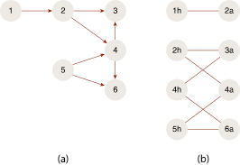
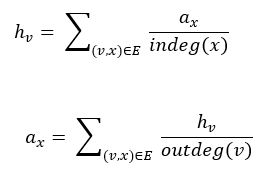
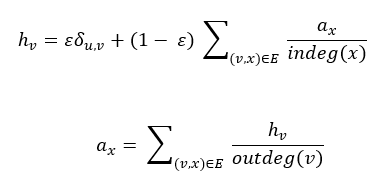

<html><head></head><body>
<h1 class="title topictitle1" id="ariaid-title1">PSALSA (ML Engine)</h1>

The PSALSA (Personalized SALSA) function is a <b>SQL-GR</b> function that evaluates the similarity of nodes in a bipartite graph according to their proximity. The typical application of PSALSA is for recommendation.

The PSALSA function assigns numerical scores (between 0 and 1) to the vertices on both sides of the bipartite graph for each seed (hub) vertex. Also, for each seed vertex, the function outputs <var class="keyword varname">K</var> hub/authority vertices with highest score.

The score assigned by PSALSA to a node defines the probability of visiting the node by a random walk with a restart from a seed node.

<b>Related Information</b>

<ul class="linklist linklist relinfo">
<a href="qym1549987102806.md">Nondeterministic Results and UniqueID Syntax Element</a>
</ul>

<h2 class="title topictitle2" id="ariaid-title2">PSALSA Background</h2>

<h3 class="title topictitle3" id="ariaid-title3">SALSA</h3>

<dfn class="term">Stochastic Approach for Link-Structure Analysis (SALSA)</dfn> is a link analysis algorithm originally developed for evaluating the importance of web pages (similar to the PageRank algorithm).

In SALSA, a collection of web pages is transformed into a bipartite graph:

`<var class="keyword varname">G</var>=(<var class="keyword varname">V</var>,<var class="keyword varname">X</var>,<var class="keyword varname">E</var>)

where

{<var class="keyword varname">ν</var> ∈<var class="keyword varname">V</var>} are hub vertices located on the left side of the graph.

{<var class="keyword varname">x</var> ∈ <var class="keyword varname">X</var>} are authority vertices located on the right side of the graph.

{(<var class="keyword varname">ν</var>,<var class="keyword varname">x</var>) Î <var class="keyword varname">E</var>} are edges linking the hub vertices and authority vertices.

The following figure shows an example on a bipartite graph, which shows the transforming (a) of the collection into (b) bipartite `<var class="keyword varname">G</var>.

  </img>  

For each hub vertex in the graph, SALSA computes a hub score (<var class="keyword varname">h</var><var class="keyword varname">ν</var>), and for each authority vertex, an authority score (<var class="keyword varname">h</var><var class="keyword varname">x</var>) is associated with. The hub/authority score is defined by analyzing a random walk on the bipartite graph, wherein the steps from hub vertex to authority vertex (from the left side of the bipartite graph to the right side) are called forward steps, and the steps from the authority vertex to the hub vertex are called backward steps.

The hub score (<var class="keyword varname">h</var><var class="keyword varname">ν</var>) is defined as the probability of visiting the hub vertex <var class="keyword varname">ν</var> and the authority score (<var class="keyword varname">a</var><var class="keyword varname">x</var>) is the probability of visiting the authority vertex <var class="keyword varname">x</var> in a random walk on the bipartite graph.

The hub score (<var class="keyword varname">h</var><var class="keyword varname">ν</var>) and authority score (<var class="keyword varname">a</var><var class="keyword varname">x</var>) can be computed using this update rule until convergence:

  </img>  

For more information about SALSA, see this paper:

Lempel, R.; Moran S. (April 2001). "SALSA: The Stochastic Approach for Link-Structure Analysis" (PDF). <cite class="cite">ACM Transaction on Information Systems</cite> 19 (2): 131–160. doi:10.1145/382979.383041

<h3 class="title topictitle3" id="ariaid-title4">PSALSA</h3>

You can use the personalized version of the SALSA algorithm, PSALSA, to evaluate the similarity between vertices on each side. While the SALSA algorithm creates a global score for each vertex, the PSALSA algorithm creates, for each hub vertex <var class="keyword varname">v</var><var class="keyword varname">i</var>, a set of hub scores, <var class="keyword varname">h</var><var class="keyword varname">v</var><var class="keyword varname">j</var> (<var class="keyword varname">i</var>), and a set of authority scores, <var class="keyword varname">a</var><var class="keyword varname">x</var><var class="keyword varname">k</var> (<var class="keyword varname">i</var>).

A higher hub score indicates that vertex <var class="keyword varname">v</var><var class="keyword varname">j</var> shares more connections with (or is closer to) <var class="keyword varname">v</var><var class="keyword varname">i</var>. A higher authority score indicates that vertex <var class="keyword varname">a</var><var class="keyword varname">k</var> is more important in building the closeness relationship with <var class="keyword varname">v</var><var class="keyword varname">i</var>.

The updating rule for hub/authority score personalizing on <var class="keyword varname">v</var><var class="keyword varname">j</var> is as follows:

  </img>  

This allows random jumps, with a probability of ε, to the seed vertex at forward steps.

Personalized SALSA can be used in recommendation application where the users are the hub vertices and the products that must be recommended are the authority nodes, and there is an edge between the user and product nodes if there is a purchase record.

Using the power iteration method to get the scores personalizing each of the hub vertices is harder with PSALSA than with SALSA, because the power iteration must run once for each hub vertex.

The PSALSA function implements the personalized SALSA algorithm described in this paper:

Bahmani Bahman, Abdur Chowdhury, and Ashish Goel. "Fast incremental and personalized PageRank." <cite class="cite">Proceedings of the VLDB Endowment</cite> 4.3 (2010): 173-184.

This paper solves the problem through Monte Carlo simulation: From each hub vertex <var class="keyword varname">h</var><var class="keyword varname">i</var>, the algorithm starts a random walk of <var class="keyword varname">L</var> steps (<var class="keyword varname">L</var> is a input parameter) and tracks the path of the random walk. After the walk stops, the algorithm computes the score of a hub vertex <var class="keyword varname">h</var><var class="keyword varname">j</var> to <var class="keyword varname">h</var><var class="keyword varname">i</var>,, and an authority vertex <var class="keyword varname">a</var><var class="keyword varname">k</var> to <var class="keyword varname">h</var><var class="keyword varname">i</var> as follows:

<var class="keyword varname">score_h</var><var class="keyword varname">ij</var> = (2<var class="keyword varname">vh</var><var class="keyword varname">ij</var>) / <var class="keyword varname">L</var>

<var class="keyword varname">score_a</var><var class="keyword varname">ik</var> = (2<var class="keyword varname">va</var><var class="keyword varname">ik</var>) / <var class="keyword varname">L</var>

where <var class="keyword varname">vh</var><var class="keyword varname">ij</var> and <var class="keyword varname">va</var><var class="keyword varname">ik</var> are the visit time of vertex <var class="keyword varname">h</var><var class="keyword varname">j</var> as a hub vertex and <var class="keyword varname">a</var><var class="keyword varname">k</var> as an authority vertex in the random walk path starting from the seed vertex <var class="keyword varname">h</var><var class="keyword varname">i</var>.

<h2 class="title topictitle2" id="ariaid-title5">PSALSA Syntax</h2>

<h3 class="title sectiontitle">Version 1.2</h3><pre class="pre codeblock" xml:space="preserve"><code>SELECT * FROM PSALSA (
  ON <var class="keyword varname">vertices_table</var> AS Vertices PARTITION BY <var class="keyword varname">vertex_key_column</var> [,...] 
  ON <var class="keyword varname">edges_table</var> AS Edges PARTITION BY <var class="keyword varname">source_vertex_key_column</var> [,...] 
  [ ON <var class="keyword varname">sources_table</var> AS Sources PARTITION BY <var class="keyword varname">source_vertex_key_column</var> [,...] ]
  [ ON <var class="keyword varname">targets_table</var> AS Targets PARTITION BY <var class="keyword varname">target_vertex_key_column</var> [,...] ]
  USING
  SourceKey ({ '<var class="keyword varname">source_vertex_column</var>' | <var class="keyword varname">source_vertex_column_range</var> }[,...])
  TargetKey ({ '<var class="keyword varname">target_vertex_column</var>' | <var class="keyword varname">target_vertex_column_range</var> }[,...])
  [ EdgeWeight (<var class="keyword varname">weight_column</var>) ]
  MaxHubNum (<var class="keyword varname">max_hubs</var>)
  MaxAuthorityNum (<var class="keyword varname">max_authority</var>)
  <code class="ph codeph">[ Accumulate ({ '<var class="keyword varname">accumulate_column</var>' | <var class="keyword varname">accumulate_column_range</var> }[,...]) ]</code>
  [ TeleportProb (<var class="keyword varname">eta</var>) ]
  [ RandomWalkLength (<var class="keyword varname">L</var>) ]
) AS <var class="keyword varname">alias</var>;</code></pre>

<b>Related Information</b>

<ul class="linklist linklist relinfo">
<a href="ndv1557782188375.md">Column Specification Syntax Elements</a>
</ul>

<h2 class="title topictitle2" id="ariaid-title6">PSALSA Syntax Elements</h2>

<dl class="dl parml"><dt class="dt pt dlterm">SourceKey</dt><dd class="dd pd">Specify the source key (the names of the Edges table columns that identify the target vertex). If you specify <var class="keyword varname">sources_table</var>, the function uses only the vertices in <var class="keyword varname">sources_table</var> as sources (which must be a subset of those that this syntax element specifies).

The function uses these names to construct the column names for recommended hub nodes in the output table.
</dd><dt class="dt pt dlterm">TargetKey</dt><dd class="dd pd">Specify the target key (the names of the Edges table columns that identify the target vertex). If you specify <var class="keyword varname">targets_table</var>, the function uses only the vertices in targets_table as targets (which must be a subset of those that this syntax element specifies).</dd><dt class="dt pt dlterm">EdgeWeight</dt><dd class="dd pd">[Optional] Specify the name of the Edges table column that contains edge weights. Each <var class="keyword varname">edge_weight</var> is a positive value.</dd><dd class="dd pd ddexpand">Default behavior: Each <var class="keyword varname">edge_weight</var> is 1; that is, the graph is unweighted.</dd><dt class="dt pt dlterm">MaxHubNum</dt><dd class="dd pd">Specify the maximum number of hub vertices with the highest score output for each hub vertex. The <var class="keyword varname">max_hubs</var> must be an INTEGER.</dd><dt class="dt pt dlterm">MaxAuthorityNum</dt><dd class="dd pd">Specify the maximum number of authority vertices with the highest score output for each hub vertex. The <var class="keyword varname">max_authority</var> must be an INTEGER.</dd><dt class="dt pt dlterm">Accumulate</dt><dd class="dd pd">[Optional] Specify the name of the Vertices table columns to copy to the output table.</dd><dt class="dt pt dlterm">TeleportProb</dt><dd class="dd pd">[Optional] Specify the probability ε, a DOUBLE PRECISION value between 0 and 1 that represents the jump to the seed vertex during random walk.</dd><dd class="dd pd ddexpand">Default: 0.15</dd><dt class="dt pt dlterm">RandomWalkLength</dt><dd class="dd pd">[Optional] Specify the random walk length <var class="keyword varname">L</var> for each hub vertex. <var class="keyword varname">L</var> must be an INTEGER. The final hub/authority score is computed as <code class="ph codeph">ε*<var class="keyword varname">K</var><var class="keyword varname">v</var>/<var class="keyword varname">L</var></code>, where <var class="keyword varname">K</var><var class="keyword varname">v</var> is the number of times that the random walk visits vertex <var class="keyword varname">v</var>.</dd><dd class="dd pd ddexpand">Default: 5000</dd></dl>

<h2 class="title topictitle2" id="ariaid-title7">PSALSA Input</h2>

<table cellpadding="4" cellspacing="0" summary="" id="unr1507827956095__table_jm5_zgr_ycb" class="table" frame="border" border="1" rules="all">

<colgroup span="1"><col style="width:50%" span="1"></col><col style="width:50%" span="1"></col></colgroup><thead class="thead" style="text-align:left;"><tr class="row"><th class="entry cellrowborder" style="vertical-align:top;" id="d104968e646" rowspan="1" colspan="1">Table</th><th class="entry cellrowborder" style="vertical-align:top;" id="d104968e648" rowspan="1" colspan="1">Description</th></tr></thead><tbody class="tbody"><tr class="row"><td class="entry cellrowborder" style="vertical-align:top;" headers="d104968e646" rowspan="1" colspan="1">Vertices</td><td class="entry cellrowborder" style="vertical-align:top;" headers="d104968e648" rowspan="1" colspan="1">Each row represents a vertex of the graph.</td></tr><tr class="row"><td class="entry cellrowborder" style="vertical-align:top;" headers="d104968e646" rowspan="1" colspan="1">Edges</td><td class="entry cellrowborder" style="vertical-align:top;" headers="d104968e648" rowspan="1" colspan="1">Each row represents an edge of the graph.</td></tr><tr class="row"><td class="entry cellrowborder" style="vertical-align:top;" headers="d104968e646" rowspan="1" colspan="1">Sources</td><td class="entry cellrowborder" style="vertical-align:top;" headers="d104968e648" rowspan="1" colspan="1">[Required for directed graph, optional for undirected graph.] Vertices to use as sources.

By default, all vertices are both sources and targets (that is, the graph is undirected).
</td></tr><tr class="row"><td class="entry cellrowborder" style="vertical-align:top;" headers="d104968e646" rowspan="1" colspan="1">Targets</td><td class="entry cellrowborder" style="vertical-align:top;" headers="d104968e648" rowspan="1" colspan="1">[Required for directed graph, optional for undirected graph.] Vertices to use as targets.</td></tr></tbody></table>

<h3 class="title sectiontitle">Vertices Schema</h3>
<table cellpadding="4" cellspacing="0" summary="" id="unr1507827956095__table_N10017_N1000E_N1000C_N10001" class="table" frame="border" border="1" rules="all">

<colgroup span="1"><col style="width:33.33333333333333%" span="1"></col><col style="width:33.33333333333333%" span="1"></col><col style="width:33.33333333333333%" span="1"></col></colgroup><thead class="thead" style="text-align:left;"><tr class="row"><th class="entry nocellnorowborder" style="vertical-align:top;" id="d104968e683" rowspan="1" colspan="1">Column</th><th class="entry nocellnorowborder" style="vertical-align:top;" id="d104968e685" rowspan="1" colspan="1">Data Type</th><th class="entry cell-norowborder" style="vertical-align:top;" id="d104968e687" rowspan="1" colspan="1">Description</th></tr></thead><tbody class="tbody"><tr class="row"><td class="entry row-nocellborder" style="vertical-align:top;" headers="d104968e683" rowspan="1" colspan="1"><var class="keyword varname">vertex_key_column</var></td><td class="entry row-nocellborder" style="vertical-align:top;" headers="d104968e685" rowspan="1" colspan="1">Any allowed in PARTITION BY clause</td><td class="entry cellrowborder" style="vertical-align:top;" headers="d104968e687" rowspan="1" colspan="1">[Column appears once for each specified <var class="keyword varname">vertex_key_column</var>.] All or part of unique vertex key. Cannot be NULL.</td></tr></tbody></table>

<h3 class="title sectiontitle">Edges Schema</h3>
<table cellpadding="4" cellspacing="0" summary="" id="unr1507827956095__table_N1004C_N1000E_N1000C_N10001" class="table" frame="border" border="1" rules="all">

<colgroup span="1"><col style="width:33.33333333333333%" span="1"></col><col style="width:33.33333333333333%" span="1"></col><col style="width:33.33333333333333%" span="1"></col></colgroup><thead class="thead" style="text-align:left;"><tr class="row"><th class="entry nocellnorowborder" style="vertical-align:top;" id="d104968e711" rowspan="1" colspan="1">Column</th><th class="entry nocellnorowborder" style="vertical-align:top;" id="d104968e713" rowspan="1" colspan="1">Data Type</th><th class="entry cell-norowborder" style="vertical-align:top;" id="d104968e715" rowspan="1" colspan="1">Description</th></tr></thead><tbody class="tbody"><tr class="row"><td class="entry nocellnorowborder" style="vertical-align:top;" headers="d104968e711" rowspan="1" colspan="1"><var class="keyword varname">source_vertex_key_column</var></td><td class="entry nocellnorowborder" style="vertical-align:top;" headers="d104968e713" rowspan="1" colspan="1">Any allowed in PARTITION BY clause</td><td class="entry cell-norowborder" style="vertical-align:top;" headers="d104968e715" rowspan="1" colspan="1">Column appears once for each specified <var class="keyword varname">source_vertex_key_column</var>.] All or part of key that identifies source vertex of edge. Must be a <var class="keyword varname">vertex_key_column</var> in Vertices table. Cannot be NULL.</td></tr><tr class="row"><td class="entry nocellnorowborder" style="vertical-align:top;" headers="d104968e711" rowspan="1" colspan="1"><var class="keyword varname">target_vertex_key_column</var></td><td class="entry nocellnorowborder" style="vertical-align:top;" headers="d104968e713" rowspan="1" colspan="1">Same as <var class="keyword varname">source_vertex_key_column</var></td><td class="entry cell-norowborder" style="vertical-align:top;" headers="d104968e715" rowspan="1" colspan="1">Column appears once for each specified <var class="keyword varname">target_vertex_key_column</var>.] All or part of key that identifies target vertex of edge. Must be a <var class="keyword varname">vertex_key_column</var> in Vertices table. Cannot be NULL.</td></tr><tr class="row"><td class="entry row-nocellborder" style="vertical-align:top;" headers="d104968e711" rowspan="1" colspan="1"><var class="keyword varname">edge_weight</var></td><td class="entry row-nocellborder" style="vertical-align:top;" headers="d104968e713" rowspan="1" colspan="1">SMALLINT, INTEGER, or NUMERIC</td><td class="entry cellrowborder" style="vertical-align:top;" headers="d104968e715" rowspan="1" colspan="1">[Required only for weighted graph.] Edge weight, a positive value. Can be NULL.</td></tr></tbody></table>

<h3 class="title sectiontitle">Sources Schema</h3>
<table cellpadding="4" cellspacing="0" summary="" id="unr1507827956095__table_N1009D_N1000E_N1000C_N10001" class="table" frame="border" border="1" rules="all">

<colgroup span="1"><col style="width:33.33333333333333%" span="1"></col><col style="width:33.33333333333333%" span="1"></col><col style="width:33.33333333333333%" span="1"></col></colgroup><thead class="thead" style="text-align:left;"><tr class="row"><th class="entry nocellnorowborder" style="vertical-align:top;" id="d104968e766" rowspan="1" colspan="1">Column</th><th class="entry nocellnorowborder" style="vertical-align:top;" id="d104968e768" rowspan="1" colspan="1">Data Type</th><th class="entry cell-norowborder" style="vertical-align:top;" id="d104968e770" rowspan="1" colspan="1">Description</th></tr></thead><tbody class="tbody"><tr class="row"><td class="entry row-nocellborder" style="vertical-align:top;" headers="d104968e766" rowspan="1" colspan="1"><var class="keyword varname">source_vertex_key_column</var></td><td class="entry row-nocellborder" style="vertical-align:top;" headers="d104968e768" rowspan="1" colspan="1">Same as corresponding <var class="keyword varname">vertex_key_column</var> in Vertices table</td><td class="entry cellrowborder" style="vertical-align:top;" headers="d104968e770" rowspan="1" colspan="1">Column appears once for each specified <var class="keyword varname">source_vertex_key_column</var>.] All or part of key that identifies source vertex of edge. Must be a <var class="keyword varname">vertex_key_column</var> in Vertices table. Cannot be NULL.</td></tr></tbody></table>

<h3 class="title sectiontitle">Targets Schema</h3>
<table cellpadding="4" cellspacing="0" summary="" id="unr1507827956095__table_N100D2_N1000E_N1000C_N10001" class="table" frame="border" border="1" rules="all">

<colgroup span="1"><col style="width:33.33333333333333%" span="1"></col><col style="width:33.33333333333333%" span="1"></col><col style="width:33.33333333333333%" span="1"></col></colgroup><thead class="thead" style="text-align:left;"><tr class="row"><th class="entry nocellnorowborder" style="vertical-align:top;" id="d104968e800" rowspan="1" colspan="1">Column</th><th class="entry nocellnorowborder" style="vertical-align:top;" id="d104968e802" rowspan="1" colspan="1">Data Type</th><th class="entry cell-norowborder" style="vertical-align:top;" id="d104968e804" rowspan="1" colspan="1">Description</th></tr></thead><tbody class="tbody"><tr class="row"><td class="entry row-nocellborder" style="vertical-align:top;" headers="d104968e800" rowspan="1" colspan="1"><var class="keyword varname">target_vertex_key_column</var></td><td class="entry row-nocellborder" style="vertical-align:top;" headers="d104968e802" rowspan="1" colspan="1">Same as corresponding <var class="keyword varname">vertex_key_column</var> in Vertices table</td><td class="entry cellrowborder" style="vertical-align:top;" headers="d104968e804" rowspan="1" colspan="1">Column appears once for each specified <var class="keyword varname">target_vertex_key_column</var>.] All or part of key that identifies target vertex of edge. Must be a <var class="keyword varname">vertex_key_column</var> in Vertices table. Cannot be NULL.</td></tr></tbody></table>

<h2 class="title topictitle2" id="ariaid-title8">PSALSA Output</h2>

<h3 class="title sectiontitle">Output Table Schema</h3>
<table cellpadding="4" cellspacing="0" summary="" id="dch1507828018756__table_N1000E_N1000C_N10001" class="table" frame="border" border="1" rules="all">

<colgroup span="1"><col style="width:33.33333333333333%" span="1"></col><col style="width:16.666666666666664%" span="1"></col><col style="width:50%" span="1"></col></colgroup><thead class="thead" style="text-align:left;"><tr class="row"><th class="entry nocellnorowborder" style="vertical-align:top;" id="d104968e844" rowspan="1" colspan="1">Column</th><th class="entry nocellnorowborder" style="vertical-align:top;" id="d104968e846" rowspan="1" colspan="1">Data Type</th><th class="entry cell-norowborder" style="vertical-align:top;" id="d104968e848" rowspan="1" colspan="1">Description</th></tr></thead><tbody class="tbody"><tr class="row"><td class="entry nocellnorowborder" style="vertical-align:top;" headers="d104968e844" rowspan="1" colspan="1"><var class="keyword varname">source_vertex_key_column</var></td><td class="entry nocellnorowborder" style="vertical-align:top;" headers="d104968e846" rowspan="1" colspan="1">Same as in Edges table</td><td class="entry cell-norowborder" style="vertical-align:top;" headers="d104968e848" rowspan="1" colspan="1">Column appears once for each specified <var class="keyword varname">source_vertex_key_column</var>.] All or part of key that identifies source vertex of edge. Must be a <var class="keyword varname">vertex_key_column</var> in Vertices table. Cannot be NULL.</td></tr><tr class="row"><td class="entry nocellnorowborder" style="vertical-align:top;" headers="d104968e844" rowspan="1" colspan="1"><var class="keyword varname">accumulate_column</var></td><td class="entry nocellnorowborder" style="vertical-align:top;" headers="d104968e846" rowspan="1" colspan="1">Same as in Vertices table</td><td class="entry cell-norowborder" style="vertical-align:top;" headers="d104968e848" rowspan="1" colspan="1">Column appears once for each specified <var class="keyword varname">accumulate_column</var>.] Column copied from Vertices table.</td></tr><tr class="row"><td class="entry nocellnorowborder" style="vertical-align:top;" headers="d104968e844" rowspan="1" colspan="1">hub_<var class="keyword varname">source_vertex_key_column</var></td><td class="entry nocellnorowborder" style="vertical-align:top;" headers="d104968e846" rowspan="1" colspan="1">Same as in Edges table</td><td class="entry cell-norowborder" style="vertical-align:top;" headers="d104968e848" rowspan="1" colspan="1">Column appears once for each specified <var class="keyword varname">source_vertex_key_column</var>.] Hub node with top hub score, personalized on source node.</td></tr><tr class="row"><td class="entry nocellnorowborder" style="vertical-align:top;" headers="d104968e844" rowspan="1" colspan="1">hub_score</td><td class="entry nocellnorowborder" style="vertical-align:top;" headers="d104968e846" rowspan="1" colspan="1">DOUBLE PRECISION</td><td class="entry cell-norowborder" style="vertical-align:top;" headers="d104968e848" rowspan="1" colspan="1">Hub score for top hub node.</td></tr><tr class="row"><td class="entry nocellnorowborder" style="vertical-align:top;" headers="d104968e844" rowspan="1" colspan="1">authority_<var class="keyword varname">target_key_column</var></td><td class="entry nocellnorowborder" style="vertical-align:top;" headers="d104968e846" rowspan="1" colspan="1">Same as in Edges table</td><td class="entry cell-norowborder" style="vertical-align:top;" headers="d104968e848" rowspan="1" colspan="1">Column appears once for each specified <var class="keyword varname">target_key_column</var>.] Authority node with highest authority score, personalized on source node.</td></tr><tr class="row"><td class="entry row-nocellborder" style="vertical-align:top;" headers="d104968e844" rowspan="1" colspan="1">authority_score</td><td class="entry row-nocellborder" style="vertical-align:top;" headers="d104968e846" rowspan="1" colspan="1">DOUBLE PRECISION</td><td class="entry cellrowborder" style="vertical-align:top;" headers="d104968e848" rowspan="1" colspan="1">Authority score for node with highest authority score.</td></tr></tbody></table>

<h2 class="title topictitle2" id="ariaid-title9">PSALSA Examples</h2>

<h3 class="title topictitle3" id="ariaid-title10">PSALSA Example: Similar Users, No Edge Weight</h3>

This example uses the syntax elements MaxHubNum and MaxAuthorityNum to output a maximum of two hub and two authority users.

<h4 class="title sectiontitle">Input</h4>
<table cellpadding="4" cellspacing="0" summary="" id="dpa1526071664537__table_yvc_wrg_5db" class="table" frame="border" border="1" rules="all">
Vertices: users_vertex
<colgroup span="1"><col style="width:50%" span="1"></col><col style="width:50%" span="1"></col></colgroup><thead class="thead" style="text-align:left;"><tr class="row"><th class="entry cellrowborder" style="vertical-align:top;" id="d104968e961" rowspan="1" colspan="1">userid</th><th class="entry cellrowborder" style="vertical-align:top;" id="d104968e963" rowspan="1" colspan="1">username</th></tr></thead><tbody class="tbody"><tr class="row"><td class="entry cellrowborder" style="vertical-align:top;" headers="d104968e961" rowspan="1" colspan="1">1</td><td class="entry cellrowborder" style="vertical-align:top;" headers="d104968e963" rowspan="1" colspan="1">John</td></tr><tr class="row"><td class="entry cellrowborder" style="vertical-align:top;" headers="d104968e961" rowspan="1" colspan="1">2</td><td class="entry cellrowborder" style="vertical-align:top;" headers="d104968e963" rowspan="1" colspan="1">Carla</td></tr><tr class="row"><td class="entry cellrowborder" style="vertical-align:top;" headers="d104968e961" rowspan="1" colspan="1">3</td><td class="entry cellrowborder" style="vertical-align:top;" headers="d104968e963" rowspan="1" colspan="1">Simon</td></tr><tr class="row"><td class="entry cellrowborder" style="vertical-align:top;" headers="d104968e961" rowspan="1" colspan="1">4</td><td class="entry cellrowborder" style="vertical-align:top;" headers="d104968e963" rowspan="1" colspan="1">Celine</td></tr><tr class="row"><td class="entry cellrowborder" style="vertical-align:top;" headers="d104968e961" rowspan="1" colspan="1">5</td><td class="entry cellrowborder" style="vertical-align:top;" headers="d104968e963" rowspan="1" colspan="1">Winston</td></tr><tr class="row"><td class="entry cellrowborder" style="vertical-align:top;" headers="d104968e961" rowspan="1" colspan="1">6</td><td class="entry cellrowborder" style="vertical-align:top;" headers="d104968e963" rowspan="1" colspan="1">Diana</td></tr></tbody></table>

<table cellpadding="4" cellspacing="0" summary="" id="dpa1526071664537__table_eky_xrg_5db" class="table" frame="border" border="1" rules="all">
Edges: users_edges
<colgroup span="1"><col style="width:33.33333333333333%" span="1"></col><col style="width:33.33333333333333%" span="1"></col><col style="width:33.33333333333333%" span="1"></col></colgroup><thead class="thead" style="text-align:left;"><tr class="row"><th class="entry cellrowborder" style="vertical-align:top;" id="d104968e1005" rowspan="1" colspan="1">followers</th><th class="entry cellrowborder" style="vertical-align:top;" id="d104968e1007" rowspan="1" colspan="1">leaders</th><th class="entry cellrowborder" style="vertical-align:top;" id="d104968e1009" rowspan="1" colspan="1">likes</th></tr></thead><tbody class="tbody"><tr class="row"><td class="entry cellrowborder" style="vertical-align:top;" headers="d104968e1005" rowspan="1" colspan="1">Carla</td><td class="entry cellrowborder" style="vertical-align:top;" headers="d104968e1007" rowspan="1" colspan="1">Celine</td><td class="entry cellrowborder" style="vertical-align:top;" headers="d104968e1009" rowspan="1" colspan="1">7</td></tr><tr class="row"><td class="entry cellrowborder" style="vertical-align:top;" headers="d104968e1005" rowspan="1" colspan="1">Carla</td><td class="entry cellrowborder" style="vertical-align:top;" headers="d104968e1007" rowspan="1" colspan="1">Diana</td><td class="entry cellrowborder" style="vertical-align:top;" headers="d104968e1009" rowspan="1" colspan="1">12</td></tr><tr class="row"><td class="entry cellrowborder" style="vertical-align:top;" headers="d104968e1005" rowspan="1" colspan="1">Celine</td><td class="entry cellrowborder" style="vertical-align:top;" headers="d104968e1007" rowspan="1" colspan="1">Diana</td><td class="entry cellrowborder" style="vertical-align:top;" headers="d104968e1009" rowspan="1" colspan="1">4</td></tr><tr class="row"><td class="entry cellrowborder" style="vertical-align:top;" headers="d104968e1005" rowspan="1" colspan="1">John</td><td class="entry cellrowborder" style="vertical-align:top;" headers="d104968e1007" rowspan="1" colspan="1">Carla</td><td class="entry cellrowborder" style="vertical-align:top;" headers="d104968e1009" rowspan="1" colspan="1">10</td></tr><tr class="row"><td class="entry cellrowborder" style="vertical-align:top;" headers="d104968e1005" rowspan="1" colspan="1">John</td><td class="entry cellrowborder" style="vertical-align:top;" headers="d104968e1007" rowspan="1" colspan="1">Celine</td><td class="entry cellrowborder" style="vertical-align:top;" headers="d104968e1009" rowspan="1" colspan="1">5</td></tr><tr class="row"><td class="entry cellrowborder" style="vertical-align:top;" headers="d104968e1005" rowspan="1" colspan="1">John</td><td class="entry cellrowborder" style="vertical-align:top;" headers="d104968e1007" rowspan="1" colspan="1">Diana</td><td class="entry cellrowborder" style="vertical-align:top;" headers="d104968e1009" rowspan="1" colspan="1">6</td></tr><tr class="row"><td class="entry cellrowborder" style="vertical-align:top;" headers="d104968e1005" rowspan="1" colspan="1">John</td><td class="entry cellrowborder" style="vertical-align:top;" headers="d104968e1007" rowspan="1" colspan="1">Simon</td><td class="entry cellrowborder" style="vertical-align:top;" headers="d104968e1009" rowspan="1" colspan="1">2</td></tr><tr class="row"><td class="entry cellrowborder" style="vertical-align:top;" headers="d104968e1005" rowspan="1" colspan="1">Simon</td><td class="entry cellrowborder" style="vertical-align:top;" headers="d104968e1007" rowspan="1" colspan="1">Diana</td><td class="entry cellrowborder" style="vertical-align:top;" headers="d104968e1009" rowspan="1" colspan="1">1</td></tr><tr class="row"><td class="entry cellrowborder" style="vertical-align:top;" headers="d104968e1005" rowspan="1" colspan="1">Winston</td><td class="entry cellrowborder" style="vertical-align:top;" headers="d104968e1007" rowspan="1" colspan="1">Diana</td><td class="entry cellrowborder" style="vertical-align:top;" headers="d104968e1009" rowspan="1" colspan="1">10</td></tr></tbody></table>

The likes column is not used as edgeweight in this example.

<h4 class="title sectiontitle">SQL Call</h4><pre class="pre codeblock" xml:space="preserve"><code>SELECT * FROM PSALSA (
  ON users_vertex AS Vertices PARTITION BY username
  ON users_edges AS Edges PARTITION BY followers
  USING
  SourceKey ('followers ')
  TargetKey ('leaders ')
  MaxHubNum (2)
  MaxAuthorityNum (2)
  TeleportProb (0.15)
  RandomWalkLength (1000)
) AS dt ORDER BY followers;</code></pre>

<h4 class="title sectiontitle">Output</h4>

The output shows that the users John and Simon are similar to Carla. John is more similar, as he has a higher hub_score. The output varies with every run.
<pre class="pre screen" xml:space="preserve"> followers hub_followers hub_score           authority_leaders authority_score     
 --------- ------------- ------------------- ----------------- ------------------- 
 carla     NULL                         NULL carla             0.12326043737574553
 carla     NULL                         NULL simon             0.09145129224652088
 carla     simon         0.08366533864541832 NULL                             NULL
 carla     john          0.41832669322709165 NULL                             NULL
 celine    NULL                         NULL celine             0.1854043392504931
 celine    NULL                         NULL carla             0.09072978303747535
 celine    carla          0.2075098814229249 NULL                             NULL
 celine    john          0.31225296442687744 NULL                             NULL
 john      celine        0.07240704500978473 NULL                             NULL
 john      carla         0.19373776908023482 NULL                             NULL
 simon     NULL                         NULL celine                          0.166
 simon     NULL                         NULL carla                           0.092
 simon     carla                       0.186 NULL                             NULL
 simon     john                        0.318 NULL                             NULL
 winston   NULL                         NULL celine                          0.184
 winston   NULL                         NULL carla                           0.096
 winston   carla                       0.186 NULL                             NULL
 winston   john                        0.308 NULL                             NULL</pre>

Download a zip file of all examples and a SQL script file that creates their input tables from the attachment in the left sidebar.

<h3 class="title topictitle3" id="ariaid-title11">PSALSA Example: Similar Users, Edge Weight</h3>

This example uses the syntax elements MaxHubNum and MaxAuthorityNum to output a maximum of two hub and two authority users.

<h4 class="title sectiontitle">Input</h4>
As in <a href="qcm1558545044723.md#dpa1526071664537">PSALSA Example: Similar Users, No Edge Weight</a>:
<ul class="ul" id="eso1526071725336__ul_jz1_jcq_j2b">
<li class="li">Vertices: users_vertex</li>
<li class="li">Edges: users_edges</li></ul>

<h4 class="title sectiontitle">SQL Call</h4><pre class="pre codeblock" xml:space="preserve"><code>SELECT * FROM PSALSA (
  ON users_vertex AS Vertices PARTITION BY username
  ON users_edges AS Edges PARTITION BY followers
  USING
  SourceKey ('followers ')
  TargetKey ('leaders ')
  EdgeWeight ('likes')
  MaxHubNum (2)
  MaxAuthorityNum (2)
  TeleportProb (0.15)
  RandomWalkLength (1000)
) AS dt ORDER BY 1, 3 DESC, 5 DESC;</code></pre>

<h4 class="title sectiontitle">Output</h4>

The output shows that John and Winston are similar to Carla. John is more similar, as he has a higher hub_score. The output varies with every run.
<pre class="pre screen" xml:space="preserve"> followers hub_followers hub_score           authority_leaders authority_score     
 --------- ------------- ------------------- ----------------- ------------------- 
 carla     john          0.29504950495049503 NULL                             NULL
 carla     winston       0.16237623762376238 NULL                             NULL
 carla     NULL                         NULL carla              0.1067193675889328
 carla     NULL                         NULL simon             0.03557312252964427
 celine    carla           0.300990099009901 NULL                             NULL
 celine    john          0.27524752475247527 NULL                             NULL
 celine    NULL                         NULL celine            0.17786561264822134
 celine    NULL                         NULL carla             0.10869565217391304
 john      carla                       0.278 NULL                             NULL
 john      winston                     0.138 NULL                             NULL
 simon     carla                        0.32 NULL                             NULL
 simon     john                         0.27 NULL                             NULL
 simon     NULL                         NULL celine                           0.18
 simon     NULL                         NULL carla                           0.102
 winston   carla                       0.324 NULL                             NULL
 winston   john                        0.264 NULL                             NULL
 winston   NULL                         NULL celine                          0.178
 winston   NULL                         NULL carla                           0.104</pre>

Download a zip file of all examples and a SQL script file that creates their input tables from the attachment in the left sidebar.

<h3 class="title topictitle3" id="ariaid-title12">PSALSA Example: Product Recommendation for Similar Users</h3>

This example finds similar customers and recommended products for them.

Teradata recommends PSALSA for recommending products to similar users when the product line has limited pairwise history or changes frequently. An example of a product line that changes frequently is apparel, which is subject to seasons and trends.

<h4 class="title sectiontitle">Input</h4>
<ul class="ul" id="xpa1526071760766__ul_lnx_wcq_j2b">
<li class="li">Vertices: user_product_nodes, which has customer names</li>
<li class="li">Edges: women_apparel_log, which reflects customer shopping patterns</li></ul>
<table cellpadding="4" cellspacing="0" summary="" id="xpa1526071760766__table_knn_j5g_5db" class="table" frame="border" border="1" rules="all">
Vertices:user_product_nodes
<colgroup span="1"><col style="width:50%" span="1"></col><col style="width:50%" span="1"></col></colgroup><thead class="thead" style="text-align:left;"><tr class="row"><th class="entry cellrowborder" style="vertical-align:top;" id="d104968e1194" rowspan="1" colspan="1">nodeid</th><th class="entry cellrowborder" style="vertical-align:top;" id="d104968e1196" rowspan="1" colspan="1">nodename</th></tr></thead><tbody class="tbody"><tr class="row"><td class="entry cellrowborder" style="vertical-align:top;" headers="d104968e1194" rowspan="1" colspan="1">1</td><td class="entry cellrowborder" style="vertical-align:top;" headers="d104968e1196" rowspan="1" colspan="1">Sandra</td></tr><tr class="row"><td class="entry cellrowborder" style="vertical-align:top;" headers="d104968e1194" rowspan="1" colspan="1">2</td><td class="entry cellrowborder" style="vertical-align:top;" headers="d104968e1196" rowspan="1" colspan="1">Susan</td></tr><tr class="row"><td class="entry cellrowborder" style="vertical-align:top;" headers="d104968e1194" rowspan="1" colspan="1">3</td><td class="entry cellrowborder" style="vertical-align:top;" headers="d104968e1196" rowspan="1" colspan="1">Stacie</td></tr><tr class="row"><td class="entry cellrowborder" style="vertical-align:top;" headers="d104968e1194" rowspan="1" colspan="1">4</td><td class="entry cellrowborder" style="vertical-align:top;" headers="d104968e1196" rowspan="1" colspan="1">Stephanie</td></tr><tr class="row"><td class="entry cellrowborder" style="vertical-align:top;" headers="d104968e1194" rowspan="1" colspan="1">5</td><td class="entry cellrowborder" style="vertical-align:top;" headers="d104968e1196" rowspan="1" colspan="1">Sally</td></tr><tr class="row"><td class="entry cellrowborder" style="vertical-align:top;" headers="d104968e1194" rowspan="1" colspan="1">6</td><td class="entry cellrowborder" style="vertical-align:top;" headers="d104968e1196" rowspan="1" colspan="1">coats</td></tr><tr class="row"><td class="entry cellrowborder" style="vertical-align:top;" headers="d104968e1194" rowspan="1" colspan="1">7</td><td class="entry cellrowborder" style="vertical-align:top;" headers="d104968e1196" rowspan="1" colspan="1">sweaters</td></tr><tr class="row"><td class="entry cellrowborder" style="vertical-align:top;" headers="d104968e1194" rowspan="1" colspan="1">8</td><td class="entry cellrowborder" style="vertical-align:top;" headers="d104968e1196" rowspan="1" colspan="1">jackets</td></tr><tr class="row"><td class="entry cellrowborder" style="vertical-align:top;" headers="d104968e1194" rowspan="1" colspan="1">9</td><td class="entry cellrowborder" style="vertical-align:top;" headers="d104968e1196" rowspan="1" colspan="1">blazers</td></tr><tr class="row"><td class="entry cellrowborder" style="vertical-align:top;" headers="d104968e1194" rowspan="1" colspan="1">10</td><td class="entry cellrowborder" style="vertical-align:top;" headers="d104968e1196" rowspan="1" colspan="1">pants</td></tr><tr class="row"><td class="entry cellrowborder" style="vertical-align:top;" headers="d104968e1194" rowspan="1" colspan="1">11</td><td class="entry cellrowborder" style="vertical-align:top;" headers="d104968e1196" rowspan="1" colspan="1">pajamas</td></tr></tbody></table>

<table cellpadding="4" cellspacing="0" summary="" id="xpa1526071760766__table_pzv_45g_5db" class="table" frame="border" border="1" rules="all">
Edges: women_apparel_log
<colgroup span="1"><col style="width:33.33333333333333%" span="1"></col><col style="width:33.33333333333333%" span="1"></col><col style="width:33.33333333333333%" span="1"></col></colgroup><thead class="thead" style="text-align:left;"><tr class="row"><th class="entry cellrowborder" style="vertical-align:top;" id="d104968e1263" rowspan="1" colspan="1">username</th><th class="entry cellrowborder" style="vertical-align:top;" id="d104968e1265" rowspan="1" colspan="1">product</th><th class="entry cellrowborder" style="vertical-align:top;" id="d104968e1267" rowspan="1" colspan="1">frequency</th></tr></thead><tbody class="tbody"><tr class="row"><td class="entry cellrowborder" style="vertical-align:top;" headers="d104968e1263" rowspan="1" colspan="1">Sally</td><td class="entry cellrowborder" style="vertical-align:top;" headers="d104968e1265" rowspan="1" colspan="1">blazers</td><td class="entry cellrowborder" style="vertical-align:top;" headers="d104968e1267" rowspan="1" colspan="1">2</td></tr><tr class="row"><td class="entry cellrowborder" style="vertical-align:top;" headers="d104968e1263" rowspan="1" colspan="1">Sally</td><td class="entry cellrowborder" style="vertical-align:top;" headers="d104968e1265" rowspan="1" colspan="1">coats</td><td class="entry cellrowborder" style="vertical-align:top;" headers="d104968e1267" rowspan="1" colspan="1">10</td></tr><tr class="row"><td class="entry cellrowborder" style="vertical-align:top;" headers="d104968e1263" rowspan="1" colspan="1">Sally</td><td class="entry cellrowborder" style="vertical-align:top;" headers="d104968e1265" rowspan="1" colspan="1">jackets</td><td class="entry cellrowborder" style="vertical-align:top;" headers="d104968e1267" rowspan="1" colspan="1">8</td></tr><tr class="row"><td class="entry cellrowborder" style="vertical-align:top;" headers="d104968e1263" rowspan="1" colspan="1">Sally</td><td class="entry cellrowborder" style="vertical-align:top;" headers="d104968e1265" rowspan="1" colspan="1">sweaters</td><td class="entry cellrowborder" style="vertical-align:top;" headers="d104968e1267" rowspan="1" colspan="1">9</td></tr><tr class="row"><td class="entry cellrowborder" style="vertical-align:top;" headers="d104968e1263" rowspan="1" colspan="1">Sandra</td><td class="entry cellrowborder" style="vertical-align:top;" headers="d104968e1265" rowspan="1" colspan="1">coats</td><td class="entry cellrowborder" style="vertical-align:top;" headers="d104968e1267" rowspan="1" colspan="1">10</td></tr><tr class="row"><td class="entry cellrowborder" style="vertical-align:top;" headers="d104968e1263" rowspan="1" colspan="1">Sandra</td><td class="entry cellrowborder" style="vertical-align:top;" headers="d104968e1265" rowspan="1" colspan="1">jackets</td><td class="entry cellrowborder" style="vertical-align:top;" headers="d104968e1267" rowspan="1" colspan="1">8</td></tr><tr class="row"><td class="entry cellrowborder" style="vertical-align:top;" headers="d104968e1263" rowspan="1" colspan="1">Sandra</td><td class="entry cellrowborder" style="vertical-align:top;" headers="d104968e1265" rowspan="1" colspan="1">sweaters</td><td class="entry cellrowborder" style="vertical-align:top;" headers="d104968e1267" rowspan="1" colspan="1">9</td></tr><tr class="row"><td class="entry cellrowborder" style="vertical-align:top;" headers="d104968e1263" rowspan="1" colspan="1">Stacie</td><td class="entry cellrowborder" style="vertical-align:top;" headers="d104968e1265" rowspan="1" colspan="1">pajamas</td><td class="entry cellrowborder" style="vertical-align:top;" headers="d104968e1267" rowspan="1" colspan="1">9</td></tr><tr class="row"><td class="entry cellrowborder" style="vertical-align:top;" headers="d104968e1263" rowspan="1" colspan="1">Stacie</td><td class="entry cellrowborder" style="vertical-align:top;" headers="d104968e1265" rowspan="1" colspan="1">pants</td><td class="entry cellrowborder" style="vertical-align:top;" headers="d104968e1267" rowspan="1" colspan="1">9</td></tr><tr class="row"><td class="entry cellrowborder" style="vertical-align:top;" headers="d104968e1263" rowspan="1" colspan="1">Stephanie</td><td class="entry cellrowborder" style="vertical-align:top;" headers="d104968e1265" rowspan="1" colspan="1">blazers</td><td class="entry cellrowborder" style="vertical-align:top;" headers="d104968e1267" rowspan="1" colspan="1">5</td></tr><tr class="row"><td class="entry cellrowborder" style="vertical-align:top;" headers="d104968e1263" rowspan="1" colspan="1">Stephanie</td><td class="entry cellrowborder" style="vertical-align:top;" headers="d104968e1265" rowspan="1" colspan="1">jackets</td><td class="entry cellrowborder" style="vertical-align:top;" headers="d104968e1267" rowspan="1" colspan="1">4</td></tr><tr class="row"><td class="entry cellrowborder" style="vertical-align:top;" headers="d104968e1263" rowspan="1" colspan="1">Stephanie</td><td class="entry cellrowborder" style="vertical-align:top;" headers="d104968e1265" rowspan="1" colspan="1">pajamas</td><td class="entry cellrowborder" style="vertical-align:top;" headers="d104968e1267" rowspan="1" colspan="1">7</td></tr><tr class="row"><td class="entry cellrowborder" style="vertical-align:top;" headers="d104968e1263" rowspan="1" colspan="1">Stephanie</td><td class="entry cellrowborder" style="vertical-align:top;" headers="d104968e1265" rowspan="1" colspan="1">pants</td><td class="entry cellrowborder" style="vertical-align:top;" headers="d104968e1267" rowspan="1" colspan="1">6</td></tr><tr class="row"><td class="entry cellrowborder" style="vertical-align:top;" headers="d104968e1263" rowspan="1" colspan="1">Susan</td><td class="entry cellrowborder" style="vertical-align:top;" headers="d104968e1265" rowspan="1" colspan="1">blazers</td><td class="entry cellrowborder" style="vertical-align:top;" headers="d104968e1267" rowspan="1" colspan="1">5</td></tr><tr class="row"><td class="entry cellrowborder" style="vertical-align:top;" headers="d104968e1263" rowspan="1" colspan="1">Susan</td><td class="entry cellrowborder" style="vertical-align:top;" headers="d104968e1265" rowspan="1" colspan="1">jackets</td><td class="entry cellrowborder" style="vertical-align:top;" headers="d104968e1267" rowspan="1" colspan="1">2</td></tr><tr class="row"><td class="entry cellrowborder" style="vertical-align:top;" headers="d104968e1263" rowspan="1" colspan="1">Susan</td><td class="entry cellrowborder" style="vertical-align:top;" headers="d104968e1265" rowspan="1" colspan="1">pajamas</td><td class="entry cellrowborder" style="vertical-align:top;" headers="d104968e1267" rowspan="1" colspan="1">5</td></tr><tr class="row"><td class="entry cellrowborder" style="vertical-align:top;" headers="d104968e1263" rowspan="1" colspan="1">Susan</td><td class="entry cellrowborder" style="vertical-align:top;" headers="d104968e1265" rowspan="1" colspan="1">pants</td><td class="entry cellrowborder" style="vertical-align:top;" headers="d104968e1267" rowspan="1" colspan="1">4</td></tr><tr class="row"><td class="entry cellrowborder" style="vertical-align:top;" headers="d104968e1263" rowspan="1" colspan="1">Susan</td><td class="entry cellrowborder" style="vertical-align:top;" headers="d104968e1265" rowspan="1" colspan="1">sweaters</td><td class="entry cellrowborder" style="vertical-align:top;" headers="d104968e1267" rowspan="1" colspan="1">4</td></tr></tbody></table>

<h4 class="title sectiontitle">SQL Call</h4>

This call outputs a maximum of two similar users (hub) and recommends two products (authority) for each user, using frequency of purchase as a weight factor.
<pre class="pre codeblock" xml:space="preserve"><code>SELECT * FROM PSALSA (
  ON user_product_nodes AS Vertices PARTITION BY nodename
  ON women_apparel_log AS Edges PARTITION BY username
  USING
  SourceKey ('username')
  TargetKey ('product')
  EdgeWeight ('frequency')
  MaxHubNum (2)
  MaxAuthorityNum (2)
  TeleportProb (0.15)
  RandomWalkLength (500)
) AS dt ORDER BY username, hub_score DESC, authority_score DESC;</code></pre>

<h4 class="title sectiontitle">Output</h4>

The output shows possible recommendations, based on hub_score and authority_score. For example, the seller can recommend pajamas to Sandra and Susan because they and Sally have similar scores. The hub_score and authority_score values vary with every run.
<pre class="pre screen" xml:space="preserve"> username  hub_username hub_score           authority_product authority_score     
 --------- ------------ ------------------- ----------------- ------------------- 
 sally     sandra       0.23255813953488372 NULL                             NULL
 sally     stephanie    0.13565891472868216 NULL                             NULL
 sally     NULL                        NULL pajamas           0.13127413127413126
 sally     NULL                        NULL pants             0.12355212355212356
 sandra    sally                      0.212 NULL                             NULL
 sandra    stephanie                  0.152 NULL                             NULL
 sandra    NULL                        NULL pajamas                         0.144
 sandra    NULL                        NULL pants                           0.136
 stacie    stephanie     0.1984732824427481 NULL                             NULL
 stacie    sally        0.17557251908396945 NULL                             NULL
 stacie    NULL                        NULL jackets            0.1482889733840304
 stacie    NULL                        NULL sweaters          0.13307984790874525
 stephanie sally        0.18253968253968253 NULL                             NULL
 stephanie susan         0.1746031746031746 NULL                             NULL
 stephanie NULL                        NULL coats             0.13043478260869565
 stephanie NULL                        NULL sweaters          0.12648221343873517
 susan     stephanie    0.17120622568093385 NULL                             NULL
 susan     stacie       0.16731517509727625 NULL                             NULL
 susan     NULL                        NULL coats             0.09689922480620156</pre>

Download a zip file of all examples and a SQL script file that creates their input tables from the attachment in the left sidebar.

<h3 class="title topictitle3" id="ariaid-title13">PSALSA Example: Sources and Targets Tables as Inputs</h3>

This example shows how to limit the vertices and edges used. Teradata recommends this technique if the original Vertices and Edges tables are large, but only a subset of the information is relevant. The function calculates the hubs and authorities for the nodes specified in the Sources and Targets tables (user_source_nodes and product_target_nodes).

<h4 class="title sectiontitle">Input</h4>
As in <a href="qcm1558545044723.md#xpa1526071760766">PSALSA Example: Product Recommendation for Similar Users</a>:
<ul class="ul" id="npa1526071799230__ul_lnx_wcq_j2b">
<li class="li">Vertices: user_product_nodes, which has customer names</li>
<li class="li">Edges: women_apparel_log, which reflects customer shopping patterns</li></ul>

<h4 class="title sectiontitle">SQL Call</h4><pre class="pre codeblock" xml:space="preserve"><code>SELECT * FROM PSALSA (
  ON user_product_nodes AS Vertices PARTITION BY nodename
  ON women_apparel_log AS Edges PARTITION BY username
  ON user_source_nodes AS Sources PARTITION BY username
  ON product_target_nodes AS Targets PARTITION BY product
  USING
  SourceKey ('username')
  TargetKey ('product')
  EdgeWeight ('frequency')
  MaxHubNum (2)
  MaxAuthorityNum (2)
  TeleportProb (0.15)
  RandomWalkLength (500)
) AS dt ORDER BY username, hub_score DESC, authority_score DESC;</code></pre>

<h4 class="title sectiontitle">Output</h4>

Based on the output, the retailer recommends pajamas to Sandra, who has no purchase history for them, but recommends nothing to Susan, who has bought all the items (see the <a href="qcm1558545044723.md#xpa1526071760766">PSALSA Example: Product Recommendation for Similar Users</a> input). The *_score results vary with every run.
<pre class="pre screen" xml:space="preserve"> username hub_username hub_score authority_product authority_score     
 -------- ------------ --------- ----------------- ------------------- 
 sandra   sally            0.364 NULL                             NULL
 sandra   stephanie        0.088 NULL                             NULL
 sandra   NULL              NULL pajamas           0.21348314606741572
 susan    sally            0.228 NULL                             NULL
 susan    sandra           0.168 NULL                             NULL</pre>

Download a zip file of all examples and a SQL script file that creates their input tables from the attachment in the left sidebar.

</body></html>
